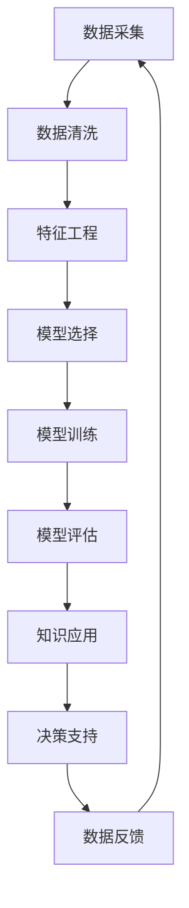

                 

# 智慧城市的大脑：知识发现在城市管理中的应用

智慧城市作为现代城市发展的重要方向，正日益成为全球各国的竞争焦点。其核心在于利用先进的信息技术，整合各类城市运行数据，构建起智能感知、高效管理、公众参与的城市运营体系。而知识发现(Knowledge Discovery in Databases, KDD)技术，作为人工智能和大数据领域的交叉学科，正是智慧城市大脑中不可或缺的一部分。

## 1. 背景介绍

### 1.1 问题由来
随着互联网和物联网技术的普及，城市的各项运行数据日益丰富，如交通流量、能源消耗、环境监测等。然而，如何高效利用这些海量的数据，发现其中的规律与知识，为城市管理提供科学依据，是一个复杂而艰巨的任务。智慧城市建设，正是在这种背景下应运而生。

智慧城市通过实时数据采集和综合分析，使城市管理更加智能、高效、人性化。如智能交通系统可以动态优化交通信号，智能电网可以实时调节能源消耗，智能环保系统可以精准监测污染排放。这些系统均离不开知识发现技术的支持。

### 1.2 问题核心关键点
知识发现是智慧城市大脑中的重要模块，其核心在于从大量数据中抽取出有价值的信息和规律。通过数据挖掘、统计分析、机器学习等方法，知识发现技术能够帮助城市管理者洞察城市运行状况，预测未来趋势，制定科学决策。

其关键点在于：
- 数据质量：输入数据需要保证完整、准确、一致，避免噪音干扰。
- 模型选择：不同的问题需要采用不同的算法模型，如分类、聚类、回归、关联规则等。
- 特征工程：数据的预处理和特征选择，直接影响模型的表现。
- 可解释性：模型输出需要具有可解释性，便于城市管理者理解和应用。

## 2. 核心概念与联系

### 2.1 核心概念概述

智慧城市中的知识发现技术涉及多个关键概念：

- **知识发现**(Knowledge Discovery in Databases, KDD)：指从大量数据中自动发现有用知识和规律的过程。通常分为数据清理、特征工程、模型选择和模型评估等步骤。
- **数据挖掘**(Data Mining)：是KDD的子过程，专注于从数据中抽取模式、趋势和规律。
- **机器学习**(Machine Learning)：通过算法从数据中学习规律，并应用于预测、分类、聚类等任务。
- **统计分析**(Statistical Analysis)：使用统计方法分析数据，提取有用的统计特征和模型。
- **可视化**(Visualization)：通过图表等方式直观展示数据和模型的结果，辅助城市管理者决策。
- **实时分析**(Real-time Analysis)：在数据生成的同时，实时分析处理，提供即时的决策支持。

这些概念之间相互联系，构成了一个完整的知识发现系统，在智慧城市中发挥着重要作用。

### 2.2 核心概念原理和架构的 Mermaid 流程图(Mermaid 流程节点中不要有括号、逗号等特殊字符)



此图展示了智慧城市中的知识发现流程。从数据采集开始，经过数据清洗、特征工程、模型选择与训练、模型评估，最终得到有价值的知识，用于决策支持，并根据反馈调整后续过程。

## 3. 核心算法原理 & 具体操作步骤

### 3.1 算法原理概述

智慧城市中的知识发现，通常遵循以下步骤：

1. **数据采集与清洗**：收集城市运行数据，进行去重、缺失值处理、异常值检测等清洗工作，保证数据质量。
2. **特征工程**：选择合适的特征，并进行特征选择、特征提取、特征缩放等预处理工作。
3. **模型选择与训练**：根据问题类型选择合适的算法模型，并在训练集上进行模型训练。
4. **模型评估**：在测试集上评估模型性能，如准确率、召回率、F1值等指标。
5. **知识应用与反馈**：将模型应用于实际场景，收集反馈，根据反馈优化后续过程。

### 3.2 算法步骤详解

**Step 1: 数据采集与清洗**
- **数据采集**：通过传感器、监控摄像头、智能设备等采集城市各类数据。
- **数据清洗**：使用Python、R等工具进行数据清洗，包括去重、缺失值处理、异常值检测等。

**Step 2: 特征工程**
- **特征选择**：根据领域知识选择相关特征，去除冗余和不相关特征。
- **特征提取**：如从文本数据中提取词频、TF-IDF等统计特征，从图像中提取边缘、角点等图像特征。
- **特征缩放**：将数据缩放到合理范围，如使用标准化、归一化等方法。

**Step 3: 模型选择与训练**
- **模型选择**：根据问题类型选择适合的模型，如分类、回归、聚类、关联规则等。
- **模型训练**：使用训练集对模型进行训练，调整超参数以优化模型性能。

**Step 4: 模型评估**
- **评估指标**：根据任务类型选择合适的评估指标，如准确率、召回率、F1值、ROC-AUC等。
- **交叉验证**：使用K折交叉验证方法，评估模型在不同数据子集上的性能。

**Step 5: 知识应用与反馈**
- **知识应用**：将训练好的模型应用于城市管理场景，如智能交通系统、能源管理、环境监测等。
- **反馈优化**：收集模型应用结果的反馈，调整模型参数或算法策略，优化模型性能。

### 3.3 算法优缺点

知识发现技术在智慧城市中的应用，具有以下优点：
- **智能决策**：通过数据驱动的方式，辅助城市管理者进行科学决策，提升决策效率和准确性。
- **实时监控**：实时分析城市运行数据，快速响应突发事件，保障城市安全。
- **提升效率**：自动化处理大量数据，提升城市管理效率，减少人力成本。
- **预测未来**：基于历史数据，预测城市运行趋势，提前采取预防措施。

同时，也存在以下缺点：
- **数据依赖**：知识发现的效果高度依赖数据的质量和完整性。
- **模型复杂**：不同的问题可能需要不同算法，模型选择和调整较为复杂。
- **高成本**：高质量的模型训练和应用需要较高的计算资源和技术门槛。
- **可解释性差**：许多高级算法模型如深度学习，其决策过程难以解释。

### 3.4 算法应用领域

智慧城市中的知识发现技术，广泛应用于多个领域，如：

- **智能交通**：通过分析交通流量、事故数据，优化交通信号控制，减少交通拥堵。
- **能源管理**：监测能源消耗数据，预测能源需求，优化能源调度。
- **环境监测**：实时监测空气质量、水质、噪音等指标，预警环境风险。
- **公共安全**：分析犯罪数据，预测犯罪趋势，提升公共安全防范能力。
- **健康管理**：监测居民健康数据，提供个性化健康建议，提升公共健康水平。

以上仅是知识发现技术在智慧城市中的部分应用领域，随着技术的不断进步，未来将有更多新应用场景涌现。

## 4. 数学模型和公式 & 详细讲解 & 举例说明

### 4.1 数学模型构建

智慧城市中的知识发现，通常基于以下几个数学模型：

- **分类模型**：如决策树、逻辑回归、支持向量机等，用于将数据分为不同类别。
- **回归模型**：如线性回归、岭回归、随机森林等，用于预测数值变量。
- **聚类模型**：如K-means、层次聚类等，用于将数据分成不同簇。
- **关联规则模型**：如Apriori算法，用于发现数据间的关联关系。

这里以回归模型为例，介绍数学模型构建和公式推导。

**回归模型**：
- 假设回归模型为 $y=f(x;\theta)$，其中 $y$ 为预测值，$x$ 为输入特征，$\theta$ 为模型参数。
- 常见的回归模型有线性回归、多项式回归、岭回归等，以线性回归为例，模型形式为 $y=\theta_0+\theta_1x_1+\theta_2x_2+...+\theta_nx_n$。

### 4.2 公式推导过程

假设训练数据集为 $D=\{(x_i,y_i)\}_{i=1}^N$，其中 $x_i$ 为输入特征向量，$y_i$ 为真实标签。

在线性回归中，最小化均方误差(MSE)损失函数：

$$
L(\theta) = \frac{1}{N}\sum_{i=1}^N (y_i - f(x_i;\theta))^2
$$

其梯度为：

$$
\nabla_{\theta}L(\theta) = \frac{2}{N}\sum_{i=1}^N (y_i - f(x_i;\theta))x_i
$$

在线性回归中，通常使用梯度下降法来最小化损失函数：

$$
\theta_k \leftarrow \theta_k - \eta \nabla_{\theta}L(\theta)
$$

其中 $\eta$ 为学习率，用于控制更新步长。

### 4.3 案例分析与讲解

**案例：智能交通流量预测**

- **数据采集**：从交通摄像头、车辆传感器等设备获取交通流量数据。
- **数据清洗**：去除噪声数据，填补缺失值，进行异常值检测。
- **特征工程**：选择影响交通流量的关键特征，如时间、日期、天气、道路条件等。
- **模型选择**：选择线性回归模型进行流量预测。
- **模型训练**：使用训练集对模型进行训练，调整超参数。
- **模型评估**：在测试集上评估模型性能，使用均方误差作为评估指标。
- **知识应用**：将模型应用于实时交通流量预测，优化交通信号控制策略。

## 5. 项目实践：代码实例和详细解释说明

### 5.1 开发环境搭建

在进行知识发现项目实践前，需要准备好开发环境。以下是使用Python进行Scikit-Learn开发的环境配置流程：

1. 安装Anaconda：从官网下载并安装Anaconda，用于创建独立的Python环境。

2. 创建并激活虚拟环境：
```bash
conda create -n kdd-env python=3.8 
conda activate kdd-env
```

3. 安装Scikit-Learn：
```bash
conda install scikit-learn pandas numpy matplotlib
```

4. 安装TensorFlow等可选库：
```bash
conda install tensorflow
```

完成上述步骤后，即可在`kdd-env`环境中开始项目实践。

### 5.2 源代码详细实现

这里以智能交通流量预测为例，给出使用Scikit-Learn库进行回归模型的PyTorch代码实现。

首先，定义数据处理函数：

```python
import pandas as pd
from sklearn.model_selection import train_test_split
from sklearn.preprocessing import StandardScaler
from sklearn.linear_model import LinearRegression
from sklearn.metrics import mean_squared_error

def load_data(path):
    data = pd.read_csv(path)
    X = data.drop('traffic_count', axis=1)
    y = data['traffic_count']
    return X, y

def train_test_split_data(X, y, test_size=0.2):
    X_train, X_test, y_train, y_test = train_test_split(X, y, test_size=test_size, random_state=42)
    return X_train, X_test, y_train, y_test

def scale_data(X_train, X_test):
    scaler = StandardScaler()
    X_train = scaler.fit_transform(X_train)
    X_test = scaler.transform(X_test)
    return X_train, X_test

def train_model(X_train, y_train):
    model = LinearRegression()
    model.fit(X_train, y_train)
    return model

def evaluate_model(model, X_test, y_test):
    y_pred = model.predict(X_test)
    mse = mean_squared_error(y_test, y_pred)
    return mse

def save_model(model):
    model.save('traffic_count_model.pkl')
```

然后，使用以上函数进行数据预处理、模型训练和评估：

```python
path = 'traffic_data.csv'
X, y = load_data(path)
X_train, X_test, y_train, y_test = train_test_split_data(X, y, test_size=0.2)
X_train, X_test = scale_data(X_train, X_test)
model = train_model(X_train, y_train)
mse = evaluate_model(model, X_test, y_test)
save_model(model)
```

以上就是使用Scikit-Learn进行智能交通流量预测的完整代码实现。可以看到，借助Scikit-Learn的强大封装，代码实现相对简洁，开发者可以将更多精力放在数据处理和模型优化上。

### 5.3 代码解读与分析

让我们再详细解读一下关键代码的实现细节：

**load_data函数**：
- 定义数据加载函数，从指定路径读取CSV格式的数据，并将数据分为特征(X)和标签(y)两部分。

**train_test_split_data函数**：
- 定义数据划分函数，将数据集划分为训练集和测试集，并设置随机种子以保证结果可复现。

**scale_data函数**：
- 定义数据缩放函数，使用StandardScaler对数据进行标准化处理，缩小特征范围，避免数值过大影响模型性能。

**train_model函数**：
- 定义模型训练函数，使用线性回归模型对训练集进行训练，返回训练好的模型。

**evaluate_model函数**：
- 定义模型评估函数，使用均方误差评估模型性能，并返回评估结果。

**save_model函数**：
- 定义模型保存函数，将训练好的模型保存到本地文件中。

**主程序**：
- 加载数据，划分为训练集和测试集，对数据进行缩放，训练模型，评估模型性能，并保存模型。

可以看到，Scikit-Learn提供了一整套高效便捷的机器学习工具，能够显著降低代码开发难度。开发者可以更快地实现知识发现模型，并在实际应用中进行优化。

## 6. 实际应用场景

### 6.1 智能交通系统

智能交通系统是智慧城市的重要组成部分，通过实时监测和预测交通流量，优化交通信号控制，可以显著缓解城市交通拥堵。

- **数据采集**：通过交通摄像头、传感器等设备，实时采集交通流量、车辆速度、事故数据等。
- **数据清洗**：去重、填补缺失值、异常值检测等。
- **特征工程**：选择影响交通流量的关键特征，如时间、日期、天气、道路条件等。
- **模型训练**：使用回归模型对交通流量进行预测，优化信号灯配时。
- **模型评估**：在测试集上评估模型性能，使用均方误差作为评估指标。
- **知识应用**：将模型应用于实时交通流量预测，优化交通信号控制策略。

### 6.2 能源管理系统

能源管理系统通过实时监测和预测能源消耗，优化能源调度，提高能源利用效率，降低能耗。

- **数据采集**：从智能电表、传感器等设备，实时采集能源消耗数据。
- **数据清洗**：去重、填补缺失值、异常值检测等。
- **特征工程**：选择影响能源消耗的关键特征，如时间、天气、用户行为等。
- **模型训练**：使用回归模型对能源消耗进行预测，优化能源调度策略。
- **模型评估**：在测试集上评估模型性能，使用均方误差作为评估指标。
- **知识应用**：将模型应用于实时能源消耗预测，优化能源调度策略。

### 6.3 环境监测系统

环境监测系统通过实时监测和预测环境指标，预警环境风险，保障城市安全。

- **数据采集**：从环境监测设备，实时采集空气质量、水质、噪音等数据。
- **数据清洗**：去重、填补缺失值、异常值检测等。
- **特征工程**：选择影响环境指标的关键特征，如时间、天气、地理条件等。
- **模型训练**：使用回归模型对环境指标进行预测，预警环境风险。
- **模型评估**：在测试集上评估模型性能，使用均方误差作为评估指标。
- **知识应用**：将模型应用于实时环境指标预测，预警环境风险。

### 6.4 未来应用展望

随着知识发现技术的不断进步，其在智慧城市中的应用将更加广泛和深入。未来可能的应用方向包括：

- **多模态融合**：将城市数据从单一模态（如文本、图像、视频）扩展到多模态，提升模型的综合能力。
- **跨领域应用**：将知识发现技术应用于更多领域，如智慧医疗、智慧教育等，推动智慧城市建设的多元化发展。
- **实时流数据处理**：使用流数据处理技术，实时分析和预测城市运行数据，提供即时的决策支持。
- **边缘计算部署**：将知识发现模型部署在边缘计算设备上，实现数据本地化处理，降低延迟，提高实时性。

以上趋势凸显了知识发现技术在智慧城市建设中的重要作用，未来将为城市管理带来更多的创新和变革。

## 7. 工具和资源推荐

### 7.1 学习资源推荐

为了帮助开发者系统掌握知识发现技术，这里推荐一些优质的学习资源：

1. 《Python数据科学手册》：涵盖Python在数据处理、数据清洗、模型训练等方面的高级应用。
2. 《统计学习方法》：李航教授的经典著作，系统介绍机器学习和数据挖掘的基本原理和算法。
3. 《数据挖掘导论》：适合入门级读者，全面介绍数据挖掘的基本概念和技术。
4. 《TensorFlow实战指南》：适合中级开发者，详细讲解TensorFlow在数据处理和模型训练中的应用。
5. Kaggle竞赛平台：全球知名的数据科学竞赛平台，提供大量实际问题数据集，锻炼实践能力。

通过对这些资源的学习实践，相信你一定能够快速掌握知识发现技术的精髓，并用于解决实际的智慧城市问题。

### 7.2 开发工具推荐

高效的知识发现实践，离不开优秀的工具支持。以下是几款用于知识发现开发的常用工具：

1. Python：基于Python的开源数据科学生态系统，简单易用，具备强大的数据处理和分析能力。
2. Scikit-Learn：基于Python的机器学习库，提供丰富的算法和工具，快速实现模型训练和评估。
3. TensorFlow：由Google主导开发的开源机器学习框架，支持多种算法和模型，生产部署方便。
4. Tableau：数据可视化工具，将数据和模型结果以图表形式展示，辅助城市管理者决策。
5. Apache Spark：大数据处理引擎，支持分布式计算，处理大规模数据集，提升计算效率。

合理利用这些工具，可以显著提升知识发现任务的开发效率，加快创新迭代的步伐。

### 7.3 相关论文推荐

知识发现技术的发展源于学界的持续研究。以下是几篇奠基性的相关论文，推荐阅读：

1. Witten, I.H., Frank, E., & Hall, M.A. (2011). Data Mining: Practical Machine Learning Tools and Algorithms (3rd ed.). Morgan Kaufmann.
2. Hastie, T., Tibshirani, R., & Friedman, J. (2009). The Elements of Statistical Learning: Data Mining, Inference, and Prediction (2nd ed.). Springer.
3. Quinlan, J.R. (1986). Induction of Decision Trees. Machine Learning.
4. Tjoa, E., & Gunawardana, S. (2003). Data Mining and Statistical Learning for Association Rules. Springer.
5. Roughgarden, T. (2017). Algorithmic Game Theory. Cambridge University Press.

这些论文代表了大数据与人工智能领域的最新研究成果，可以帮助研究者把握学科前进方向，激发更多的创新灵感。

## 8. 总结：未来发展趋势与挑战

### 8.1 总结

本文对智慧城市中的知识发现技术进行了全面系统的介绍。首先阐述了知识发现技术在智慧城市大脑中的核心地位，明确了其对科学决策、实时监控和效率提升的重要作用。其次，从原理到实践，详细讲解了知识发现模型的构建和操作步骤，给出了知识发现模型开发的完整代码实例。同时，本文还广泛探讨了知识发现技术在智能交通、能源管理、环境监测等多个智慧城市应用领域的具体实践，展示了知识发现技术的广泛应用前景。此外，本文精选了知识发现技术的各类学习资源，力求为读者提供全方位的技术指引。

通过本文的系统梳理，可以看到，知识发现技术是智慧城市建设的重要基石，为城市管理提供了科学、高效、实时的决策支持。未来，伴随知识发现技术的不断演进，将为智慧城市带来更多的创新和变革。

### 8.2 未来发展趋势

展望未来，知识发现技术将呈现以下几个发展趋势：

1. **多模态融合**：将城市数据从单一模态（如文本、图像、视频）扩展到多模态，提升模型的综合能力。
2. **跨领域应用**：将知识发现技术应用于更多领域，如智慧医疗、智慧教育等，推动智慧城市建设的多元化发展。
3. **实时流数据处理**：使用流数据处理技术，实时分析和预测城市运行数据，提供即时的决策支持。
4. **边缘计算部署**：将知识发现模型部署在边缘计算设备上，实现数据本地化处理，降低延迟，提高实时性。
5. **大数据与AI的深度结合**：将大数据技术与AI算法结合，提升数据处理和模型训练的效率，实现智能化的城市治理。

以上趋势凸显了知识发现技术在智慧城市建设中的重要作用，未来将为城市管理带来更多的创新和变革。

### 8.3 面临的挑战

尽管知识发现技术在智慧城市中的应用已经取得了显著成效，但在迈向更加智能化、普适化应用的过程中，它仍面临着诸多挑战：

1. **数据质量**：输入数据需要保证完整、准确、一致，避免噪音干扰。
2. **算法复杂度**：知识发现模型的选择和优化较为复杂，对技术门槛要求较高。
3. **计算资源**：高质量的模型训练和应用需要较高的计算资源，难以在大规模数据上实现。
4. **可解释性**：许多高级算法模型的决策过程难以解释，缺乏透明性。
5. **安全性**：数据隐私和安全问题需要高度重视，确保数据和模型的安全。

### 8.4 研究展望

面对知识发现技术面临的挑战，未来的研究需要在以下几个方面寻求新的突破：

1. **数据治理**：制定数据标准和规范，保障数据质量，提升数据治理能力。
2. **算法优化**：开发更加高效的算法，提高知识发现模型的运行效率和准确性。
3. **模型压缩**：使用模型压缩和量化技术，优化模型结构和存储空间，提升计算效率。
4. **可解释性增强**：引入可解释性技术，如注意力机制、可视化工具，提升模型的透明性和可解释性。
5. **安全性保障**：采用数据加密、访问控制等措施，保障数据和模型的安全。

这些研究方向的探索，必将引领知识发现技术迈向更高的台阶，为智慧城市建设提供更加科学、高效、可靠的数据支持。面向未来，知识发现技术需要与其他人工智能技术进行更深入的融合，如知识图谱、因果推理、强化学习等，多路径协同发力，共同推动智慧城市系统的进步。

## 9. 附录：常见问题与解答

**Q1：知识发现技术在智慧城市中的应用是否依赖于大规模标注数据？**

A: 知识发现技术的效果在很大程度上依赖于数据的质量和多样性，但并非必须依赖大规模标注数据。利用自监督学习和半监督学习等技术，可以从未标注数据中挖掘出有价值的信息和规律。

**Q2：知识发现模型在实际应用中如何优化？**

A: 知识发现模型在实际应用中需要不断优化，以适应不同场景和需求。常用的优化策略包括：
1. 数据增强：通过回译、近义替换等方式扩充训练集。
2. 特征工程：选择合适的特征，并进行特征选择、特征提取、特征缩放等预处理工作。
3. 模型选择和调整：根据任务类型和数据特点，选择适合的算法模型，并进行超参数调优。
4. 集成学习：将多个模型组合起来，通过投票、堆叠等方式提升模型性能。
5. 迁移学习：利用已有模型的知识，对新任务进行迁移学习，减少训练时间。

**Q3：知识发现模型在实际应用中如何部署？**

A: 知识发现模型的部署需要考虑以下几个方面：
1. 模型裁剪：去除不必要的层和参数，减小模型尺寸，加快推理速度。
2. 量化加速：将浮点模型转为定点模型，压缩存储空间，提高计算效率。
3. 服务化封装：将模型封装为标准化服务接口，便于集成调用。
4. 弹性伸缩：根据请求流量动态调整资源配置，平衡服务质量和成本。
5. 监控告警：实时采集系统指标，设置异常告警阈值，确保服务稳定性。

知识发现模型通过以上优化和部署，可以更好地应用于智慧城市中的实际场景，提升系统性能和可靠性。

总之，知识发现技术在智慧城市中的应用前景广阔，未来必将为城市管理带来更多创新和变革。

