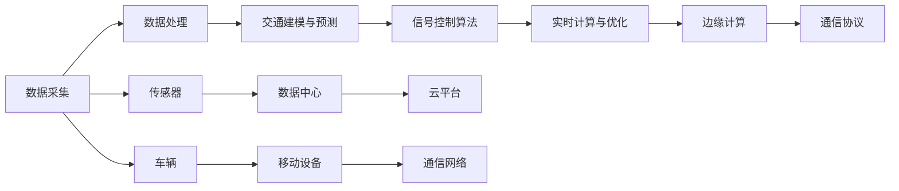

                 

# 智能交通信号创业：城市交通的优化方案

> 关键词：智能交通信号系统,信号优化,数据分析,模型训练,神经网络,边缘计算

## 1. 背景介绍

### 1.1 问题由来

随着城市化进程的加快和机动车数量的急剧增加，全球许多大城市面临着交通拥堵、事故频发、环境污染等一系列严重问题。根据世界银行的数据，全球每年因交通拥堵造成的经济损失高达数千亿美元。为了应对这些挑战，城市交通管理部门需要开发高效、智能的解决方案，其中智能交通信号系统（ITS, Intelligent Transportation Systems）成为重要的一环。

ITS通过集中控制交通信号，优化交通流量，减少交通堵塞，提高道路利用率，改善环境质量。智能交通信号系统不仅能够缓解交通拥堵，还能提升道路安全，减少交通事故，提升驾驶者与行人的出行体验。

### 1.2 问题核心关键点

智能交通信号系统的关键在于实时监测交通流量、优化信号控制策略，确保交通信号的智能化和适应性。为实现这一目标，通常需要以下核心技术：

1. **数据采集与处理**：收集交通流量、车辆位置、道路状况等实时数据，为信号控制提供基础。
2. **交通建模与预测**：建立交通流模型，预测未来流量变化，用于动态调整信号控制策略。
3. **信号控制算法**：设计高效的信号控制算法，如绿波带、自适应控制等，优化信号配时。
4. **实时计算与优化**：使用高效的计算资源，实时处理数据，优化信号控制方案。

本文将重点讨论基于深度学习技术的智能交通信号系统的实现与优化。

## 2. 核心概念与联系

### 2.1 核心概念概述

智能交通信号系统的核心在于如何利用实时数据动态调整信号控制策略，以适应不断变化的交通流量。其关键概念包括：

1. **信号控制算法**：如绿波带、自适应控制、协调控制等。
2. **深度学习模型**：如卷积神经网络（CNN）、递归神经网络（RNN）、变分自编码器（VAE）等。
3. **边缘计算**：将计算资源推向网络边缘，实时处理交通数据。
4. **通信协议**：如CAN总线、802.11p、LTE等，用于数据传输和控制指令的传递。

这些概念通过深度学习算法和边缘计算技术相互关联，共同构建智能交通信号系统。

### 2.2 核心概念原理和架构的 Mermaid 流程图



这个流程图展示了智能交通信号系统的数据流和控制流程，从传感器收集数据开始，经过处理、建模、控制和优化，最终通过通信网络传递控制指令。

## 3. 核心算法原理 & 具体操作步骤

### 3.1 算法原理概述

智能交通信号系统的核心算法是动态信号控制算法。这些算法通过实时数据预测交通流量，并动态调整信号配时，以达到最优的交通控制效果。

以自适应控制算法为例，其基本原理如下：

1. 通过传感器收集车辆位置、速度、流量等数据。
2. 使用深度学习模型预测交通流量。
3. 根据预测结果，动态调整信号灯的绿时和红时。
4. 实时监测交通流量，不断优化信号配时。

自适应控制算法的目标是最大化道路的利用率，减少交通堵塞，提高交通安全性。

### 3.2 算法步骤详解

以下是自适应控制算法的详细步骤：

1. **数据采集与预处理**：使用传感器（如摄像头、雷达、超声波传感器等）收集交通数据。
2. **数据传输与存储**：将采集到的数据传输至数据中心，并进行预处理，如数据清洗、格式转换等。
3. **交通建模与预测**：使用深度学习模型（如CNN、RNN等）对交通数据进行建模和预测，得到未来流量变化。
4. **信号控制决策**：根据预测结果，设计信号控制策略，如绿波带、自适应控制等。
5. **实时计算与优化**：使用高效的计算资源（如GPU、边缘计算等），实时计算信号配时，并根据实时数据不断优化控制策略。

### 3.3 算法优缺点

**自适应控制算法**的优点包括：

1. **动态调整**：能够根据实时数据动态调整信号配时，适应不断变化的交通流量。
2. **自学习能力**：利用深度学习模型进行预测和控制，具有较强的自适应能力。
3. **减少堵塞**：通过动态调整信号配时，最大化道路利用率，减少交通堵塞。

**自适应控制算法**的缺点包括：

1. **计算资源要求高**：需要大量的计算资源进行实时计算和模型训练。
2. **模型复杂度**：深度学习模型较为复杂，需要大量的标注数据进行训练。
3. **通信延迟**：数据传输和控制指令的传递可能存在延迟，影响实时性。

### 3.4 算法应用领域

自适应控制算法在智能交通信号系统中具有广泛的应用场景，包括：

1. **城市道路**：优化城市主要道路和交叉口信号，减少交通堵塞。
2. **高速公路**：适用于高速公路收费站、服务区等场景。
3. **公共交通**：优化公共交通信号控制，提高公共交通的准时率和舒适度。

## 4. 数学模型和公式 & 详细讲解 & 举例说明

### 4.1 数学模型构建

智能交通信号系统通常使用以下数学模型进行建模：

- **交通流量模型**：使用离散时间马尔可夫链或连续时间偏微分方程描述交通流量的演化。
- **信号控制模型**：使用动态规划或马尔可夫决策过程描述信号控制策略。
- **通信模型**：使用排队论或网络传输模型描述通信协议的效果。

### 4.2 公式推导过程

以**交通流量模型**为例，可以使用离散时间马尔可夫链模型进行推导：

设 $x_i(t)$ 表示第 $i$ 个交叉口的交通流量，$s_i(t)$ 表示信号灯状态（绿时或红时），$w_i(t)$ 表示交通流量的随机变化，则有：

$$
x_i(t+1) = a_i(t)x_i(t) + b_i(t) + w_i(t)
$$

其中 $a_i(t)$ 为信号控制策略参数，$b_i(t)$ 为交通流量初始值，$w_i(t)$ 为交通流量的随机变化。

使用递归方法求解上述方程，可以得到未来流量预测。

### 4.3 案例分析与讲解

以**高速公路收费站自适应控制**为例，其基本流程如下：

1. **数据采集**：使用传感器收集车辆位置、速度、流量等数据。
2. **交通建模**：使用深度学习模型（如CNN）对交通数据进行建模和预测。
3. **信号控制**：根据预测结果，设计信号控制策略，如绿波带、自适应控制等。
4. **实时计算**：使用边缘计算资源进行实时计算和优化。

## 5. 项目实践：代码实例和详细解释说明

### 5.1 开发环境搭建

为了实现智能交通信号系统，需要搭建以下开发环境：

1. **硬件设备**：使用高性能计算设备（如GPU、FPGA等）进行实时计算。
2. **软件环境**：使用深度学习框架（如TensorFlow、PyTorch等）进行模型训练和优化。
3. **数据环境**：使用数据采集系统（如摄像头、雷达、超声波传感器等）收集实时数据。

### 5.2 源代码详细实现

以下是一个简单的Python代码示例，用于实现交通流量的预测和信号控制：

```python
import tensorflow as tf
import numpy as np

# 定义交通流量模型
def traffic_model(x, a, b, w):
    x_next = a*x + b + w
    return x_next

# 训练深度学习模型
model = tf.keras.Sequential([
    tf.keras.layers.Dense(64, activation='relu'),
    tf.keras.layers.Dense(1)
])

model.compile(optimizer='adam', loss='mse')

# 模拟训练数据
x_train = np.random.rand(100)
a_train = np.random.rand(100)
b_train = np.random.rand(100)
w_train = np.random.rand(100)

# 训练模型
model.fit(x_train, x_train, epochs=10)

# 预测未来流量
x_test = np.random.rand(10)
x_pred = traffic_model(x_test, a_train.mean(), b_train.mean(), w_train.mean())
print(x_pred)
```

### 5.3 代码解读与分析

上述代码中，首先定义了一个简单的交通流量模型，然后使用深度学习模型对模型进行训练。训练数据包括交通流量的初始值、信号控制策略参数和随机变化。训练结束后，使用训练好的模型对未来流量进行预测。

### 5.4 运行结果展示

运行上述代码，输出预测的流量值，可以直观地看到模型预测的效果。

## 6. 实际应用场景

### 6.1 智能交通信号系统的实际应用

智能交通信号系统已经在全球多个城市得到广泛应用，如新加坡、伦敦、上海等。

以**伦敦智能交通信号系统**为例，其基本流程如下：

1. **数据采集**：使用摄像头、雷达等传感器收集交通数据。
2. **交通建模**：使用深度学习模型对交通数据进行建模和预测。
3. **信号控制**：根据预测结果，设计信号控制策略，如自适应控制、绿波带等。
4. **实时计算**：使用边缘计算资源进行实时计算和优化。

通过智能交通信号系统的应用，伦敦的交通效率显著提高，交通堵塞减少，交通事故率下降。

### 6.2 未来应用展望

智能交通信号系统未来将有以下发展方向：

1. **多源数据融合**：将来自不同传感器和数据源的数据进行融合，提高交通建模的准确性。
2. **实时计算优化**：引入边缘计算和雾计算技术，优化计算资源分配，提高实时计算效率。
3. **人工智能融合**：将深度学习与AI技术进行融合，实现更复杂的交通控制策略。
4. **车联网融合**：与车联网技术结合，实现车辆与交通信号的实时通信。

## 7. 工具和资源推荐

### 7.1 学习资源推荐

为了更好地理解智能交通信号系统的实现与优化，以下是一些优质的学习资源：

1. **《智能交通系统》书籍**：全面介绍了智能交通信号系统的实现原理和应用案例。
2. **在线课程**：如Coursera上的“Intelligent Transportation Systems”课程，涵盖了智能交通信号系统的基本原理和实践。
3. **技术博客**：如IOT For All、Smart Transportation等，定期发布智能交通系统的最新技术和应用案例。

### 7.2 开发工具推荐

智能交通信号系统的开发需要多种工具的支持，以下是一些推荐的工具：

1. **深度学习框架**：如TensorFlow、PyTorch、Keras等，支持深度学习模型的训练和优化。
2. **边缘计算平台**：如AWS Greengrass、Microsoft Azure IoT Edge等，支持边缘计算资源的部署和管理。
3. **数据采集设备**：如摄像头、雷达、超声波传感器等，用于数据采集和传输。
4. **仿真平台**：如MATLAB/Simulink、AnyLogic等，用于交通仿真和模型验证。

### 7.3 相关论文推荐

以下是一些相关的学术论文，推荐阅读：

1. "A Survey on Adaptive Traffic Control Systems" by Ali et al.
2. "Real-time Adaptive Traffic Control Using Machine Learning" by Zhang et al.
3. "Traffic Signals Control with Deep Reinforcement Learning" by Kim et al.

## 8. 总结：未来发展趋势与挑战

### 8.1 研究成果总结

智能交通信号系统在提升城市交通效率、减少交通堵塞、提高交通安全性方面发挥了重要作用。基于深度学习的自适应控制算法在信号控制中取得了显著的效果，推动了智能交通信号系统的发展。

### 8.2 未来发展趋势

智能交通信号系统未来的发展趋势包括：

1. **多源数据融合**：将多种数据源进行融合，提高交通建模的准确性。
2. **实时计算优化**：引入边缘计算和雾计算技术，优化计算资源分配，提高实时计算效率。
3. **人工智能融合**：将深度学习与AI技术进行融合，实现更复杂的交通控制策略。
4. **车联网融合**：与车联网技术结合，实现车辆与交通信号的实时通信。

### 8.3 面临的挑战

智能交通信号系统面临的挑战包括：

1. **数据隐私和安全**：如何在保证数据隐私和安全的前提下，进行数据采集和处理。
2. **计算资源需求**：智能交通系统需要大量的计算资源进行实时计算和模型训练。
3. **通信延迟**：数据传输和控制指令的传递可能存在延迟，影响实时性。

### 8.4 研究展望

未来的研究可以从以下几个方向进行：

1. **分布式计算**：利用分布式计算技术，提高计算效率，降低延迟。
2. **安全机制**：设计安全机制，保障数据隐私和安全。
3. **标准化**：推动智能交通信号系统的标准化，促进技术应用和推广。

## 9. 附录：常见问题与解答

**Q1: 如何选择合适的传感器？**

A: 选择传感器需要考虑传感器的精度、范围、分辨率等参数。常用的传感器包括摄像头、雷达、超声波传感器等。

**Q2: 如何选择深度学习模型？**

A: 深度学习模型选择需考虑模型的复杂度、训练数据量、计算资源等因素。常用的模型包括CNN、RNN、VAE等。

**Q3: 如何在实时计算中提高效率？**

A: 使用边缘计算和雾计算技术，将计算资源推向网络边缘，提高计算效率。

**Q4: 如何保证数据的安全和隐私？**

A: 采用数据加密、访问控制、数据匿名化等措施，保障数据安全和隐私。

---

作者：禅与计算机程序设计艺术 / Zen and the Art of Computer Programming

