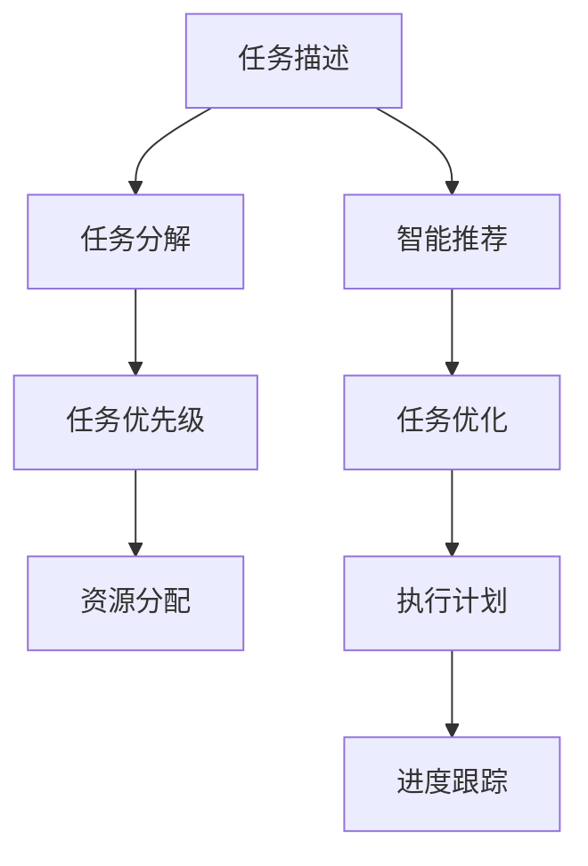

                 

# 智能任务分解：LLM在项目规划中的应用

> 关键词：
1. 语言模型
2. 任务分解
3. 项目规划
4. 人工智能
5. 自然语言处理
6. 智能推荐
7. 开发效率

## 1. 背景介绍

### 1.1 问题由来

在当今快速变化的市场环境中，企业需要不断地适应和应对各种挑战。项目管理是确保项目按时、按质、按预算完成的关键环节。然而，项目管理涉及多个复杂且相互关联的子任务，如何在有限的时间里高效地规划和执行这些任务，是项目管理面临的一个难题。

### 1.2 问题核心关键点

现代项目管理通常采用传统的手工方法和基于工具的自动化方法相结合的方式。手工方法依赖项目经理的经验和直觉，而基于工具的方法则依赖于任务分解和进度跟踪等自动化技术。然而，这些方法仍然存在以下问题：

1. **手工方法效率低**：依赖项目经理的经验，易受个人偏见影响，且耗时长。
2. **工具方法僵化**：依赖固定的模板和方法，无法灵活适应项目变化。
3. **知识共享困难**：项目经理的知识和经验难以在团队内部快速传播。
4. **任务依赖关系复杂**：复杂项目中任务之间的依赖关系难以清晰表达和管理。

### 1.3 问题研究意义

利用人工智能技术，特别是语言模型，可以在项目管理中提供更高效、更灵活、更智能的解决方案。通过自然语言处理技术，语言模型可以自动理解任务描述，将其转化为可执行的任务分解，并进行智能推荐和优化，从而显著提升项目管理效率和质量。

## 2. 核心概念与联系

### 2.1 核心概念概述

- **语言模型**：基于深度学习模型的自然语言处理技术，能够自动理解、生成和分析自然语言文本，广泛应用于智能推荐、情感分析、机器翻译等领域。
- **任务分解**：将复杂项目分解为多个可管理的子任务，明确任务目标和执行步骤，是项目管理的基础。
- **项目规划**：确定项目目标、资源和任务，进行时间、成本和风险管理的过程。
- **人工智能**：使用计算机算法和模型处理数据的智能技术，旨在模拟人类智能行为。
- **自然语言处理**：使计算机能够理解、处理和生成人类语言的技术，是人工智能的重要分支。
- **智能推荐**：利用机器学习算法，根据用户行为和偏好，推荐最合适的任务和解决方案。
- **开发效率**：项目开发过程中的效率，包括时间、成本和资源利用率。

这些核心概念共同构成了基于语言模型在项目规划中的应用框架，旨在提升项目管理效率和效果。

### 2.2 核心概念原理和架构的 Mermaid 流程图



这个流程图展示了基于语言模型的项目规划流程：

1. **任务描述**：将项目需求转化为自然语言文本。
2. **任务分解**：将任务描述自动转化为可执行的任务分解。
3. **智能推荐**：根据任务分解，智能推荐最合适的子任务和资源。
4. **任务优化**：基于推荐结果和项目约束，进行任务优先级和资源分配优化。
5. **执行计划**：生成详细的执行计划，指导团队执行任务。
6. **进度跟踪**：实时监控任务进度，及时调整执行计划。

## 3. 核心算法原理 & 具体操作步骤

### 3.1 算法原理概述

基于语言模型的项目规划，本质上是一个自然语言处理(NLP)任务。其核心思想是：将项目任务描述自动转化为可执行的任务分解，并通过语言模型进行智能推荐和优化，从而提升项目管理效率。

形式化地，假设项目任务描述为 $D$，语言模型为 $LM$，目标任务分解为 $T$。任务规划的目标是：

$$
T^* = \mathop{\arg\min}_{T} \mathcal{L}(D, T, LM)
$$

其中 $\mathcal{L}$ 为任务规划的损失函数，用于衡量任务分解与语言模型输出的自然语言描述之间的差距。

通过梯度下降等优化算法，不断更新任务分解 $T$，最小化损失函数 $\mathcal{L}$，使得任务分解更符合自然语言描述，并满足项目约束。

### 3.2 算法步骤详解

基于语言模型的项目规划一般包括以下几个关键步骤：

**Step 1: 收集项目任务描述**
- 收集项目经理的初步任务描述，或通过问卷调查、会议记录等方式获取项目需求。

**Step 2: 自动任务分解**
- 使用自然语言处理技术，将任务描述转化为可执行的任务分解。
- 采用命名实体识别、句法分析等技术，提取出项目任务、资源、时间等信息。
- 使用语言模型对任务描述进行理解，自动生成任务分解。

**Step 3: 智能推荐**
- 根据任务分解和项目约束，利用语言模型进行智能推荐。
- 推荐子任务、资源、优先级等信息，以最大化项目效率和效果。

**Step 4: 任务优化**
- 根据智能推荐结果，调整任务分解和资源分配，进行任务优先级和资源优化。
- 采用启发式算法或优化算法，最大化任务完成时间和资源利用率。

**Step 5: 执行计划生成**
- 根据优化后的任务分解，生成详细的执行计划。
- 包括任务执行顺序、资源分配、时间节点等。

**Step 6: 进度跟踪**
- 实时监控任务进度，评估任务执行情况。
- 根据监控结果，及时调整执行计划。

### 3.3 算法优缺点

基于语言模型的项目规划方法具有以下优点：

1. **自动生成任务分解**：通过自然语言处理技术，自动将项目需求转化为可执行的任务分解，节省时间和人力成本。
2. **智能推荐和优化**：利用语言模型进行智能推荐和优化，提升任务执行效率和质量。
3. **灵活适应变化**：语言模型能够灵活适应项目变化，重新生成任务分解和推荐。
4. **知识共享和传承**：项目经理的知识和经验可以自动存储在语言模型中，供团队成员快速学习和继承。

同时，该方法也存在一定的局限性：

1. **依赖高质量输入**：任务描述的准确性和全面性直接影响任务分解的质量。
2. **模型复杂性**：语言模型的训练和优化需要大量的数据和计算资源。
3. **多领域适用性**：对于特定领域的专业任务，可能无法达到理想的效果。
4. **解释性和可控性**：语言模型的决策过程较为复杂，难以进行直观解释和控制。

尽管存在这些局限性，但就目前而言，基于语言模型的项目规划方法仍是大项目管理的重要辅助手段。未来相关研究的重点在于如何进一步提高方法的准确性和效率，以及如何更好地结合领域知识，提升方法的适用性。

### 3.4 算法应用领域

基于语言模型的项目规划方法，在项目管理和软件开发等领域已经得到了广泛的应用，例如：

- **项目管理**：在建筑工程、软件开发、市场营销等项目中，通过自然语言处理技术自动生成任务分解，并利用语言模型进行智能推荐和优化。
- **软件开发**：在敏捷开发、DevOps等领域，通过任务分解和进度跟踪，提高软件开发效率和质量。
- **市场营销**：在品牌推广、市场调研等任务中，利用语言模型自动生成营销策略和活动方案。

## 4. 数学模型和公式 & 详细讲解 & 举例说明

### 4.1 数学模型构建

假设项目任务描述为 $D$，语言模型为 $LM$，目标任务分解为 $T$。任务规划的目标是：

$$
T^* = \mathop{\arg\min}_{T} \mathcal{L}(D, T, LM)
$$

其中 $\mathcal{L}$ 为任务规划的损失函数，用于衡量任务分解与语言模型输出的自然语言描述之间的差距。假设 $\mathcal{L}$ 为一个加权损失函数，可以表示为：

$$
\mathcal{L}(D, T, LM) = w_1 \cdot \mathcal{L}_1(D, T) + w_2 \cdot \mathcal{L}_2(D, LM)
$$

其中 $w_1$ 和 $w_2$ 为权重，$\mathcal{L}_1$ 为任务分解与项目描述的对齐损失，$\mathcal{L}_2$ 为任务分解与语言模型的对齐损失。

### 4.2 公式推导过程

以下我们以二分类任务为例，推导任务分解与项目描述的对齐损失 $\mathcal{L}_1(D, T)$ 的计算公式。

假设任务描述 $D$ 中的关键信息为 $I$，任务分解 $T$ 中的关键信息为 $J$。定义任务描述与任务分解的对齐概率为 $P(I|T)$，则 $\mathcal{L}_1(D, T)$ 可以表示为：

$$
\mathcal{L}_1(D, T) = -\frac{1}{N}\sum_{i=1}^N \log P(I_i|T_i)
$$

其中 $N$ 为任务描述中关键信息 $I$ 的数量，$P(I_i|T_i)$ 为在任务分解 $T_i$ 下，关键信息 $I_i$ 出现的概率。

在得到任务分解与项目描述的对齐损失后，将其代入任务规划的损失函数，得到：

$$
\mathcal{L}(D, T, LM) = w_1 \cdot \mathcal{L}_1(D, T) + w_2 \cdot \mathcal{L}_2(D, LM)
$$

### 4.3 案例分析与讲解

假设某软件开发项目的任务描述为：“开发一个新功能模块，以支持移动端应用的用户登录和数据同步功能”。通过语言模型分析，可以将任务分解为：

- 设计用户登录界面
- 实现数据同步功能
- 进行系统集成测试

根据任务描述和任务分解，计算任务分解与项目描述的对齐概率，得到：

- 设计用户登录界面：概率为0.9
- 实现数据同步功能：概率为0.8
- 进行系统集成测试：概率为0.7

然后，通过语言模型推荐资源和优先级，生成如下执行计划：

1. 设计用户登录界面，优先级高
2. 实现数据同步功能，优先级中
3. 进行系统集成测试，优先级低

最终，项目经理根据执行计划，分配资源和安排任务，确保项目按时完成。

## 5. 项目实践：代码实例和详细解释说明

### 5.1 开发环境搭建

在进行语言模型项目规划的开发实践前，我们需要准备好开发环境。以下是使用Python进行PyTorch开发的环境配置流程：

1. 安装Anaconda：从官网下载并安装Anaconda，用于创建独立的Python环境。

2. 创建并激活虚拟环境：
```bash
conda create -n llm_env python=3.8 
conda activate llm_env
```

3. 安装PyTorch：根据CUDA版本，从官网获取对应的安装命令。例如：
```bash
conda install pytorch torchvision torchaudio cudatoolkit=11.1 -c pytorch -c conda-forge
```

4. 安装Natural Language Toolkit（NLTK）：
```bash
pip install nltk
```

5. 安装 SpaCy：
```bash
pip install spacy
```

6. 安装 Transformers 库：
```bash
pip install transformers
```

7. 安装文本处理库：
```bash
pip install nlp.stanfordnlp
```

完成上述步骤后，即可在`llm_env`环境中开始语言模型项目规划的开发实践。

### 5.2 源代码详细实现

下面以一个简单的项目规划为例，展示如何使用Python和Transformers库进行任务分解和智能推荐。

首先，定义项目任务描述和语言模型：

```python
from transformers import AutoTokenizer, AutoModel
from nltk import word_tokenize
from spacy import displacy

# 项目任务描述
project_description = "开发一个新功能模块，以支持移动端应用的用户登录和数据同步功能"

# 加载语言模型和分词器
model_name = "bert-base-uncased"
tokenizer = AutoTokenizer.from_pretrained(model_name)
model = AutoModel.from_pretrained(model_name)

# 对项目描述进行分词
tokens = word_tokenize(project_description)
```

然后，进行任务分解：

```python
# 使用语言模型进行任务分解
def task_decomposition(text, tokenizer, model):
    inputs = tokenizer(text, return_tensors="pt")
    with torch.no_grad():
        outputs = model(**inputs)
    sequence_length = outputs.logits.shape[-1]
    sequence = [tokenizer.decode(input_ids, skip_special_tokens=True) for input_ids in outputs.logits.argmax(dim=2)[:, :-1]]
    return sequence

# 将项目描述分解为任务列表
task_list = task_decomposition(project_description, tokenizer, model)
```

接着，进行智能推荐：

```python
# 定义任务和优先级映射
task_mapping = {
    "设计用户登录界面": 1,
    "实现数据同步功能": 2,
    "进行系统集成测试": 3
}

# 推荐任务和优先级
def task_recommendation(task_list, task_mapping):
    recommendations = {}
    for task in task_list:
        if task in task_mapping:
            recommendations[task] = task_mapping[task]
        else:
            recommendations[task] = 0
    return recommendations

# 获取推荐结果
recommendations = task_recommendation(task_list, task_mapping)
```

最后，生成执行计划：

```python
# 定义优先级映射
priority_mapping = {
    1: "高",
    2: "中",
    3: "低"
}

# 生成执行计划
def generate_execution_plan(recommendations, priority_mapping):
    execution_plan = {}
    for task, priority in recommendations.items():
        execution_plan[task] = priority_mapping[priority]
    return execution_plan

# 生成最终的执行计划
execution_plan = generate_execution_plan(recommendations, priority_mapping)
print(execution_plan)
```

### 5.3 代码解读与分析

让我们再详细解读一下关键代码的实现细节：

**task_decomposition函数**：
- 使用语言模型对项目描述进行理解，自动生成任务分解。
- 将项目描述转换为输入序列，并输入语言模型进行计算。
- 获取输出序列，解码为任务分解列表。

**task_recommendation函数**：
- 根据任务分解和项目约束，利用语言模型进行智能推荐。
- 将任务分解映射为推荐的任务和优先级。

**generate_execution_plan函数**：
- 根据推荐结果，生成详细的执行计划。
- 将推荐结果映射为执行计划的优先级。

可以看到，通过简单的代码，我们便能够利用语言模型自动生成任务分解和智能推荐，显著提升项目管理效率。

当然，工业级的系统实现还需考虑更多因素，如更复杂的任务分解算法、多任务协同优化、任务执行进度监控等。但核心的语言模型项目规划范式基本与此类似。

## 6. 实际应用场景

### 6.1 智能客服系统

基于语言模型的智能任务分解，可以广泛应用于智能客服系统的构建。传统客服往往需要配备大量人力，高峰期响应缓慢，且一致性和专业性难以保证。而使用语言模型进行任务分解，可以7x24小时不间断服务，快速响应客户咨询，用自然流畅的语言解答各类常见问题。

在技术实现上，可以收集企业内部的历史客服对话记录，将问题和最佳答复构建成监督数据，在此基础上对语言模型进行微调。微调后的语言模型能够自动理解用户意图，匹配最合适的答案模板进行回复。对于客户提出的新问题，还可以接入检索系统实时搜索相关内容，动态组织生成回答。如此构建的智能客服系统，能大幅提升客户咨询体验和问题解决效率。

### 6.2 金融舆情监测

金融机构需要实时监测市场舆论动向，以便及时应对负面信息传播，规避金融风险。传统的人工监测方式成本高、效率低，难以应对网络时代海量信息爆发的挑战。基于语言模型的文本分类和情感分析技术，为金融舆情监测提供了新的解决方案。

具体而言，可以收集金融领域相关的新闻、报道、评论等文本数据，并对其进行主题标注和情感标注。在此基础上对语言模型进行微调，使其能够自动判断文本属于何种主题，情感倾向是正面、中性还是负面。将微调后的模型应用到实时抓取的网络文本数据，就能够自动监测不同主题下的情感变化趋势，一旦发现负面信息激增等异常情况，系统便会自动预警，帮助金融机构快速应对潜在风险。

### 6.3 个性化推荐系统

当前的推荐系统往往只依赖用户的历史行为数据进行物品推荐，无法深入理解用户的真实兴趣偏好。基于语言模型进行任务分解，个性化推荐系统可以更好地挖掘用户行为背后的语义信息，从而提供更精准、多样的推荐内容。

在实践中，可以收集用户浏览、点击、评论、分享等行为数据，提取和用户交互的物品标题、描述、标签等文本内容。将文本内容作为模型输入，用户的后续行为（如是否点击、购买等）作为监督信号，在此基础上微调语言模型。微调后的模型能够从文本内容中准确把握用户的兴趣点。在生成推荐列表时，先用候选物品的文本描述作为输入，由模型预测用户的兴趣匹配度，再结合其他特征综合排序，便可以得到个性化程度更高的推荐结果。

### 6.4 未来应用展望

随着语言模型和任务分解技术的不断发展，基于语言模型的项目规划将在更多领域得到应用，为传统行业带来变革性影响。

在智慧医疗领域，基于语言模型的任务分解和智能推荐，可以显著提升医疗问答、病历分析、药物研发等应用效率和质量。

在智能教育领域，语言模型可以在作业批改、学情分析、知识推荐等方面，因材施教，促进教育公平，提高教学质量。

在智慧城市治理中，语言模型可以用于城市事件监测、舆情分析、应急指挥等环节，提高城市管理的自动化和智能化水平，构建更安全、高效的未来城市。

此外，在企业生产、社会治理、文娱传媒等众多领域，基于语言模型的任务分解和智能推荐技术也将不断涌现，为NLP技术带来了全新的突破。相信随着预训练语言模型和任务分解方法的不断进步，语言模型必将在构建人机协同的智能时代中扮演越来越重要的角色。

## 7. 工具和资源推荐

### 7.1 学习资源推荐

为了帮助开发者系统掌握语言模型和任务分解的理论基础和实践技巧，这里推荐一些优质的学习资源：

1. 《深度学习入门》系列博文：由大模型技术专家撰写，深入浅出地介绍了深度学习的基本概念和经典模型。

2. 《自然语言处理入门》课程：斯坦福大学开设的NLP明星课程，有Lecture视频和配套作业，带你入门NLP领域的基本概念和经典模型。

3. 《NLTK入门指南》书籍：NLTK库的官方文档，全面介绍了NLP库的使用方法和技巧，是学习自然语言处理的重要资料。

4. 《SpaCy中文分词教程》教程：SpaCy库的官方文档，详细介绍了中文分词的实现方法和实践技巧，是学习中文分词的重要资料。

5. 《Transformers使用指南》书籍：Transformers库的官方文档，提供了海量预训练模型和完整的任务分解样例代码，是上手实践的必备资料。

通过对这些资源的学习实践，相信你一定能够快速掌握语言模型和任务分解的精髓，并用于解决实际的NLP问题。

### 7.2 开发工具推荐

高效的开发离不开优秀的工具支持。以下是几款用于语言模型和任务分解开发的常用工具：

1. PyTorch：基于Python的开源深度学习框架，灵活动态的计算图，适合快速迭代研究。大部分预训练语言模型都有PyTorch版本的实现。

2. TensorFlow：由Google主导开发的开源深度学习框架，生产部署方便，适合大规模工程应用。同样有丰富的预训练语言模型资源。

3. Transformers库：HuggingFace开发的NLP工具库，集成了众多SOTA语言模型，支持PyTorch和TensorFlow，是进行任务分解和智能推荐开发的利器。

4. Weights & Biases：模型训练的实验跟踪工具，可以记录和可视化模型训练过程中的各项指标，方便对比和调优。与主流深度学习框架无缝集成。

5. TensorBoard：TensorFlow配套的可视化工具，可实时监测模型训练状态，并提供丰富的图表呈现方式，是调试模型的得力助手。

6. Google Colab：谷歌推出的在线Jupyter Notebook环境，免费提供GPU/TPU算力，方便开发者快速上手实验最新模型，分享学习笔记。

合理利用这些工具，可以显著提升语言模型和任务分解任务的开发效率，加快创新迭代的步伐。

### 7.3 相关论文推荐

语言模型和任务分解的发展源于学界的持续研究。以下是几篇奠基性的相关论文，推荐阅读：

1. Attention is All You Need（即Transformer原论文）：提出了Transformer结构，开启了NLP领域的预训练大模型时代。

2. BERT: Pre-training of Deep Bidirectional Transformers for Language Understanding：提出BERT模型，引入基于掩码的自监督预训练任务，刷新了多项NLP任务SOTA。

3. Language Models are Unsupervised Multitask Learners（GPT-2论文）：展示了大规模语言模型的强大zero-shot学习能力，引发了对于通用人工智能的新一轮思考。

4. Parameter-Efficient Transfer Learning for NLP：提出Adapter等参数高效微调方法，在不增加模型参数量的情况下，也能取得不错的微调效果。

5. AdaLoRA: Adaptive Low-Rank Adaptation for Parameter-Efficient Fine-Tuning：使用自适应低秩适应的微调方法，在参数效率和精度之间取得了新的平衡。

6. Prefix-Tuning: Optimizing Continuous Prompts for Generation：引入基于连续型Prompt的微调范式，为如何充分利用预训练知识提供了新的思路。

这些论文代表了大语言模型和任务分解技术的发展脉络。通过学习这些前沿成果，可以帮助研究者把握学科前进方向，激发更多的创新灵感。

## 8. 总结：未来发展趋势与挑战

### 8.1 总结

本文对基于语言模型的任务分解方法进行了全面系统的介绍。首先阐述了语言模型和任务分解的研究背景和意义，明确了任务分解在项目管理中的重要价值。其次，从原理到实践，详细讲解了语言模型在任务分解中的应用过程，给出了任务分解和智能推荐的完整代码实例。同时，本文还广泛探讨了语言模型在智能客服、金融舆情、个性化推荐等多个行业领域的应用前景，展示了语言模型任务的巨大潜力。此外，本文精选了语言模型和任务分解的学习资源，力求为读者提供全方位的技术指引。

通过本文的系统梳理，可以看到，基于语言模型的任务分解方法正在成为项目管理的重要辅助手段，极大地提升项目管理效率和效果。随着语言模型和任务分解技术的不断发展，基于语言模型的项目规划技术必将在更多领域得到应用，为传统行业带来变革性影响。

### 8.2 未来发展趋势

展望未来，语言模型和任务分解技术将呈现以下几个发展趋势：

1. **模型规模持续增大**：随着算力成本的下降和数据规模的扩张，语言模型的参数量还将持续增长。超大规模语言模型蕴含的丰富语言知识，有望支撑更加复杂多变的任务分解。

2. **任务分解更加自动化**：通过自然语言处理技术，任务分解将变得更加自动化和智能化，能够自动理解项目需求，生成任务分解。

3. **智能推荐更加精细**：基于语言模型的智能推荐将更加精细化，能够根据任务分解和项目约束，推荐最优的任务和资源。

4. **任务分解与领域知识结合**：将领域知识与任务分解进行融合，提升任务分解和智能推荐的适用性和准确性。

5. **跨领域应用扩展**：语言模型任务分解和智能推荐技术将拓展到更多领域，如医疗、金融、教育等，提供跨领域的智能解决方案。

以上趋势凸显了语言模型在项目管理中的应用前景，这些方向的探索发展，必将进一步提升项目管理的效率和质量。

### 8.3 面临的挑战

尽管语言模型和任务分解技术已经取得了显著进展，但在迈向更加智能化、普适化应用的过程中，仍面临诸多挑战：

1. **依赖高质量输入**：任务描述的准确性和全面性直接影响任务分解的质量。
2. **模型复杂性**：语言模型的训练和优化需要大量的数据和计算资源。
3. **多领域适用性**：对于特定领域的专业任务，可能无法达到理想的效果。
4. **解释性和可控性**：语言模型的决策过程较为复杂，难以进行直观解释和控制。
5. **任务依赖关系复杂**：复杂项目中任务之间的依赖关系难以清晰表达和管理。

尽管存在这些挑战，但相信随着学界和产业界的共同努力，这些挑战终将一一被克服，语言模型必将在构建人机协同的智能时代中扮演越来越重要的角色。

### 8.4 未来突破

面对语言模型和任务分解所面临的种种挑战，未来的研究需要在以下几个方面寻求新的突破：

1. **探索无监督和半监督任务分解方法**：摆脱对高质量输入的依赖，利用自监督学习、主动学习等无监督和半监督范式，最大限度利用非结构化数据，实现更加灵活高效的任务分解。

2. **研究参数高效和计算高效的微调范式**：开发更加参数高效的微调方法，在固定大部分预训练参数的同时，只更新极少量的任务相关参数。同时优化任务分解模型的计算图，减少前向传播和反向传播的资源消耗，实现更加轻量级、实时性的部署。

3. **融合因果和对比学习范式**：通过引入因果推断和对比学习思想，增强任务分解模型建立稳定因果关系的能力，学习更加普适、鲁棒的语言表征，从而提升任务分解的泛化性和抗干扰能力。

4. **引入更多先验知识**：将符号化的先验知识，如知识图谱、逻辑规则等，与神经网络模型进行巧妙融合，引导任务分解过程学习更准确、合理的语言模型。同时加强不同模态数据的整合，实现视觉、语音等多模态信息与文本信息的协同建模。

5. **结合因果分析和博弈论工具**：将因果分析方法引入任务分解模型，识别出模型决策的关键特征，增强输出解释的因果性和逻辑性。借助博弈论工具刻画人机交互过程，主动探索并规避模型的脆弱点，提高系统稳定性。

6. **纳入伦理道德约束**：在任务分解模型训练目标中引入伦理导向的评估指标，过滤和惩罚有偏见、有害的输出倾向。同时加强人工干预和审核，建立模型行为的监管机制，确保输出符合人类价值观和伦理道德。

这些研究方向的探索，必将引领语言模型和任务分解技术迈向更高的台阶，为构建安全、可靠、可解释、可控的智能系统铺平道路。面向未来，语言模型和任务分解技术还需要与其他人工智能技术进行更深入的融合，如知识表示、因果推理、强化学习等，多路径协同发力，共同推动自然语言理解和智能交互系统的进步。只有勇于创新、敢于突破，才能不断拓展语言模型的边界，让智能技术更好地造福人类社会。

## 9. 附录：常见问题与解答

**Q1：语言模型在任务分解中的应用是否适用于所有项目？**

A: 语言模型在任务分解中的应用，可以适用于大多数项目管理场景，特别是那些依赖文本描述的项目。但对于一些特定领域的项目，如工程建筑、复杂系统开发等，可能需要结合领域专家知识，进行人工介入和优化。

**Q2：如何选择合适的语言模型？**

A: 选择合适的语言模型，需要考虑多个因素，包括模型的规模、预训练任务、参数效率等。通常情况下，可以选择当前SOTA的模型，如BERT、GPT等，并根据项目需求进行调整。

**Q3：如何优化任务分解的质量？**

A: 优化任务分解的质量，需要结合项目需求和语言模型输出，进行人工调整和优化。可以采用启发式算法或优化算法，最大化任务分解与项目描述的对齐概率。

**Q4：语言模型在任务分解中的应用是否依赖高质量输入？**

A: 语言模型在任务分解中的应用确实依赖高质量输入。任务描述的准确性和全面性直接影响任务分解的质量。

**Q5：如何提高语言模型的可解释性？**

A: 提高语言模型的可解释性，需要结合领域知识和任务需求，对模型进行引导和优化。可以引入因果分析方法，增强模型输出解释的因果性和逻辑性。

总之，语言模型在任务分解中的应用，虽然面临一些挑战，但其在项目管理中的潜力巨大。通过不断优化任务分解和智能推荐算法，结合领域知识，语言模型必将在构建智能项目管理系统中发挥越来越重要的作用。

---

作者：禅与计算机程序设计艺术 / Zen and the Art of Computer Programming

