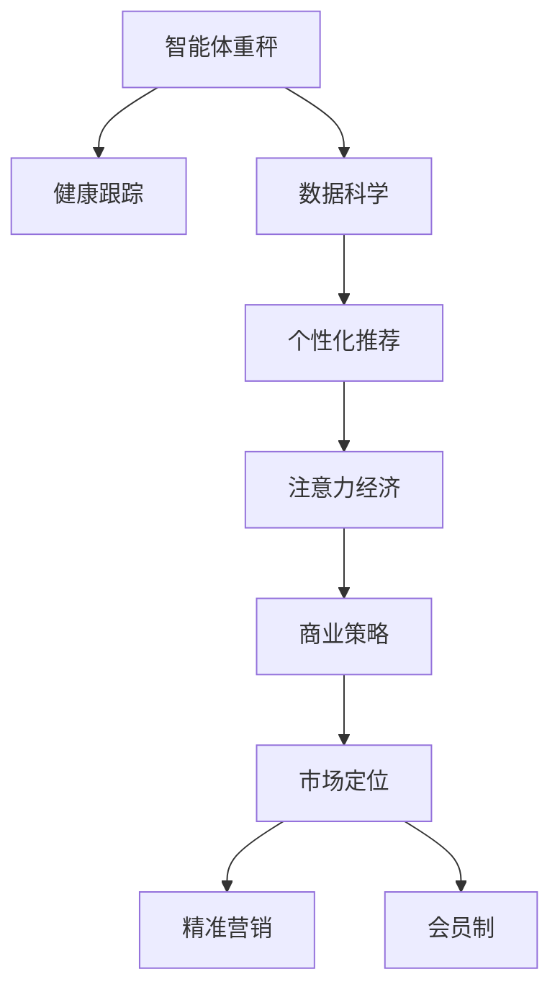

                 

# 智能体重秤的健康跟踪与注意力经济

> 关键词：智能体重秤,健康跟踪,注意力经济,数据科学,个性化推荐,商业策略

## 1. 背景介绍

### 1.1 问题由来
近年来，随着个人健康意识的提升和智能设备市场的迅速发展，智能体重秤作为一种便捷、无创的健康监测设备，开始受到越来越多消费者的青睐。智能体重秤不仅能够提供基本的体重数据，还能进行多种健康指标的监测和分析，如体脂率、骨密度、心率、血压等，为用户的健康管理提供全方位的支持。然而，面对越来越激烈的市场竞争，仅仅提供数据显然已经不足以支撑智能体重秤的商业化运营，如何借助这些健康数据挖掘出更深层次的商业价值，成为当前智能体重秤厂商亟需解决的核心问题。

### 1.2 问题核心关键点
智能体重秤的健康跟踪与注意力经济问题的核心在于如何将用户的健康数据转化为商业价值，实现经济效益的最大化。这一问题可以通过以下几个关键点进行详细分析：

- **健康数据分析**：通过机器学习、数据挖掘等技术手段，对用户的健康数据进行深入分析，提取有用信息。
- **个性化推荐**：根据分析结果，为用户推荐个性化的健康方案和产品，满足其多样化需求。
- **用户行为建模**：通过用户行为数据建模，理解用户的偏好和需求，为后续商业化策略提供依据。
- **商业策略设计**：基于用户的健康数据和行为模型，设计有针对性的商业策略，如精准营销、订阅服务、会员制等，提升用户黏性和盈利能力。

### 1.3 问题研究意义
研究智能体重秤的健康跟踪与注意力经济问题，对于智能体重秤厂商而言，具有以下重要意义：

1. **提升用户体验**：通过个性化的健康推荐和精准的市场定位，提升用户体验，增加用户黏性。
2. **增加用户粘性**：提供多样化的服务内容，增强用户参与度和忠诚度，增加用户付费意愿。
3. **优化商业模式**：结合健康数据，设计合理的商业策略，优化产品盈利模式，提升商业收益。
4. **数据驱动决策**：通过数据驱动的方式进行市场和产品决策，减少主观判断误差，提高决策科学性。
5. **创新发展**：探索新的业务增长点，如健康管理、运动指导、营养饮食等，推动智能体重秤行业向高端化、智能化发展。

## 2. 核心概念与联系

### 2.1 核心概念概述

为更好地理解智能体重秤的健康跟踪与注意力经济问题，本节将介绍几个密切相关的核心概念：

- **智能体重秤**：结合传感器和嵌入式系统的体重秤，能够自动测量并记录用户的体重、体脂率、骨密度、心率等健康数据，并提供数据分析和健康建议。
- **健康跟踪**：通过连续监测用户的健康数据，对用户健康状态进行实时跟踪和预警，如体重变化、运动量等。
- **注意力经济**：通过吸引和维持用户的注意力，提供有价值的内容和产品，以实现商业目的，如广告、会员服务、推荐系统等。
- **数据科学**：应用统计学、机器学习、数据挖掘等方法，从数据中提取知识、发现模式，以支持决策制定。
- **个性化推荐**：根据用户的历史行为和特征，推荐符合其需求的个性化产品或服务，提升用户体验和满意度。
- **商业策略**：针对特定市场和用户群体，制定有针对性的营销、定价、促销等策略，以实现盈利目标。

这些核心概念之间的逻辑关系可以通过以下Mermaid流程图来展示：



这个流程图展示了一系列核心概念之间的逻辑关系：

1. 智能体重秤通过健康跟踪获取用户数据。
2. 数据科学从健康数据中提取有用信息，支持个性化推荐。
3. 个性化推荐根据用户偏好推荐相关产品，提升用户满意度。
4. 注意力经济通过推荐和互动吸引用户注意力，实现商业价值。
5. 商业策略设计合理的营销和定价方案，优化商业模式。

## 3. 核心算法原理 & 具体操作步骤
### 3.1 算法原理概述

智能体重秤的健康跟踪与注意力经济问题，本质上是一个数据驱动的个性化推荐与商业策略优化的过程。其核心思想是：通过智能体重秤收集到的健康数据，应用数据科学的方法，对用户的健康状况进行深入分析，提取有用信息；在此基础上，设计个性化的健康推荐系统，引导用户关注并购买相关产品；最后，结合用户行为数据，设计有针对性的商业策略，实现商业目的。

形式化地，假设智能体重秤收集到的健康数据为 $D=\{x_i\}_{i=1}^N$，其中 $x_i$ 包含用户 $i$ 的各项健康指标（如体重、体脂率等）。设 $Y$ 为用户购买产品的意愿，通过构建用户行为模型 $P(Y|x)$，预测用户购买产品的概率。进而，设计个性化推荐算法 $R$，根据用户的历史行为和特征，推荐相关产品，以提高用户购买意愿。最终，结合市场和用户数据，设计商业策略 $S$，优化盈利模式，提升商业收益。

### 3.2 算法步骤详解

基于智能体重秤的健康跟踪与注意力经济问题的处理，一般包括以下几个关键步骤：

**Step 1: 数据收集与预处理**
- 收集智能体重秤的数据，包括用户的体重、体脂率、心率等健康指标，以及购买行为、使用频率等行为数据。
- 清洗数据，去除异常值和缺失值，进行归一化和特征工程，准备输入模型。

**Step 2: 健康数据分析**
- 应用数据科学的方法，如统计分析、机器学习等，对用户健康数据进行建模。常用的模型包括线性回归、随机森林、深度神经网络等。
- 提取健康指标间的关联性，构建健康状态评估模型。如通过多维特征组合，构建用户健康风险评估模型。

**Step 3: 个性化推荐**
- 根据用户健康数据分析结果，设计个性化推荐算法。推荐算法可以基于协同过滤、基于内容的推荐、混合推荐等多种策略。
- 实时更新推荐结果，结合用户反馈数据，不断优化推荐模型。

**Step 4: 用户行为建模**
- 应用机器学习技术，对用户行为数据进行建模，理解用户的偏好和需求。
- 结合健康数据和行为数据，构建用户行为与健康状态的关系模型，如关联规则、时序模型等。

**Step 5: 商业策略设计**
- 根据用户行为和健康数据分析结果，设计有针对性的商业策略。如精准营销、会员制、定制化服务等。
- 优化盈利模式，如通过订阅服务、精准广告投放、个性化产品推荐等，提升用户黏性和盈利能力。

**Step 6: 效果评估与优化**
- 定期评估推荐和商业策略的效果，通过A/B测试等手段不断优化。
- 收集用户反馈，持续改进产品和服务，提升用户体验和满意度。

以上是基于智能体重秤的健康跟踪与注意力经济问题的处理的一般流程。在实际应用中，还需要针对具体任务的特点，对各个环节进行优化设计，如改进推荐算法、提升用户行为建模的准确性、优化商业策略的设计等，以进一步提升用户购买意愿和商业收益。

### 3.3 算法优缺点

基于智能体重秤的健康跟踪与注意力经济问题的处理，具有以下优点：

1. **数据驱动**：通过健康数据和行为数据的结合，实现个性化推荐和商业策略的优化，减少主观判断误差，提升决策科学性。
2. **提高用户满意度**：通过个性化推荐和精准营销，满足用户多样化需求，提升用户体验。
3. **增加用户粘性**：提供多样化服务内容，增强用户参与度和忠诚度。
4. **优化商业模式**：结合健康数据和行为模型，设计有针对性的商业策略，优化盈利模式。

同时，该方法也存在一定的局限性：

1. **数据隐私问题**：智能体重秤涉及用户健康数据，隐私问题需要特别注意。如何在保护隐私的前提下，利用数据进行商业化运营，是一大挑战。
2. **数据质量和多样性**：健康数据和行为数据的质量和多样性会影响模型效果。如何提高数据质量和多样性，保证模型准确性，需要进一步技术改进。
3. **推荐算法复杂性**：个性化推荐算法设计复杂，需要结合多种技术和策略。如何设计高效、稳定的推荐算法，需要大量研究和实验。
4. **商业策略的灵活性**：商业策略的设计和调整需要灵活性，结合市场和用户数据进行快速迭代。如何在保持策略灵活性的同时，提升商业收益，是一大难题。

尽管存在这些局限性，但就目前而言，基于智能体重秤的健康跟踪与注意力经济问题的处理，仍是大规模商业化运营的重要手段。未来相关研究的重点在于如何进一步降低数据隐私风险，提高数据质量和多样性，设计更加高效、灵活的推荐算法和商业策略，以更好地实现用户价值和商业目标。

### 3.4 算法应用领域

基于智能体重秤的健康跟踪与注意力经济问题的处理，已经在多个领域得到了应用，例如：

- **健康管理**：智能体重秤结合健康数据分析，为用户提供个性化的健康建议，如饮食、运动计划等，提升用户的健康管理水平。
- **运动指导**：通过行为数据和健康数据建模，推荐合适的运动量和运动方式，满足用户多样化的运动需求。
- **营养饮食**：分析用户健康数据，推荐符合其营养需求的饮食方案，帮助用户实现健康饮食。
- **精准营销**：结合用户健康数据和行为数据，设计精准营销策略，提升广告投放效果。
- **会员制服务**：根据用户健康数据和行为数据，设计会员制服务内容，增强用户黏性和忠诚度。
- **产品优化**：通过用户反馈和行为数据，优化智能体重秤的产品功能和服务内容，提升用户体验和满意度。

除了上述这些经典应用外，基于智能体重秤的健康跟踪与注意力经济问题的处理，还被创新性地应用到更多场景中，如个性化健康报告、健康数据分析、智能提醒等，为智能体重秤技术带来了新的突破。随着智能体重秤的普及和技术的进步，相信该技术将在更广泛的领域得到应用，为用户的健康管理提供更加全面、精准的服务。

## 4. 数学模型和公式 & 详细讲解 & 举例说明

### 4.1 数学模型构建

本节将使用数学语言对智能体重秤的健康跟踪与注意力经济问题进行更加严格的刻画。

设智能体重秤收集到的用户健康数据为 $D=\{x_i\}_{i=1}^N$，其中 $x_i$ 包含用户 $i$ 的体重、体脂率、心率等健康指标。设用户购买产品的意愿为 $Y$，健康数据分析模型为 $P(Y|x)$，个性化推荐算法为 $R$，商业策略为 $S$。则智能体重秤的健康跟踪与注意力经济问题的处理模型可以表示为：

$$
P(Y|x) = \mathop{\arg\min}_{\theta} \mathcal{L}(P(Y|x),D)
$$

其中 $\mathcal{L}$ 为损失函数，用于衡量模型预测输出与真实标签之间的差异。常见的损失函数包括交叉熵损失、均方误差损失等。

### 4.2 公式推导过程

以下我们以二分类任务为例，推导交叉熵损失函数及其梯度的计算公式。

假设智能体重秤收集到的健康数据 $x$ 包括体重 $W$ 和体脂率 $F$，即 $x=(W,F)$。用户购买产品的意愿 $Y$ 可以表示为二分类任务，即 $Y \in \{0,1\}$。则二分类交叉熵损失函数定义为：

$$
\ell(P(Y|x),y) = -[y\log P(Y|x)+(1-y)\log(1-P(Y|x))]
$$

将其代入经验风险公式，得：

$$
\mathcal{L}(P(Y|x)) = -\frac{1}{N}\sum_{i=1}^N [y_i\log P(Y|x_i)+(1-y_i)\log(1-P(Y|x_i))]
$$

根据链式法则，损失函数对健康数据分析模型 $P(Y|x)$ 的梯度为：

$$
\frac{\partial \mathcal{L}(P(Y|x))}{\partial P(Y|x)} = -\frac{1}{N}\sum_{i=1}^N (\frac{y_i}{P(Y|x_i)}-\frac{1-y_i}{1-P(Y|x_i)}) \frac{\partial P(Y|x)}{\partial x}
$$

其中 $\frac{\partial P(Y|x)}{\partial x}$ 可进一步递归展开，利用自动微分技术完成计算。

在得到损失函数的梯度后，即可带入健康数据分析模型 $P(Y|x)$ 的参数更新公式，完成模型的迭代优化。重复上述过程直至收敛，最终得到适应用户购买意愿的健康数据分析模型 $P(Y|x)^*$。

### 4.3 案例分析与讲解

以下以智能体重秤的健康跟踪与注意力经济问题为例，展示其具体应用场景。

假设智能体重秤收集到用户 $i$ 的体重 $W_i$ 和体脂率 $F_i$，使用线性回归模型进行健康数据分析，得到用户的健康风险评估 $R_i$。设用户购买产品的意愿 $Y$ 与健康风险评估 $R_i$ 之间的关系为 $Y=f(R_i)$，其中 $f$ 为线性函数。则通过健康数据分析模型 $P(Y|x)$，可以预测用户购买产品的概率。

假设健康数据分析模型的形式为 $P(Y|x) = \sigma(\alpha_0 + \alpha_1W_i + \alpha_2F_i)$，其中 $\sigma$ 为sigmoid函数，$\alpha_0, \alpha_1, \alpha_2$ 为模型参数。则健康数据分析模型的损失函数为：

$$
\mathcal{L}(P(Y|x)) = -\frac{1}{N}\sum_{i=1}^N [y_i\log P(Y|x_i)+(1-y_i)\log(1-P(Y|x_i))]
$$

通过反向传播算法，可以得到健康数据分析模型的梯度为：

$$
\frac{\partial \mathcal{L}(P(Y|x))}{\partial \alpha_0} = -\frac{1}{N}\sum_{i=1}^N (\frac{y_i}{P(Y|x_i)}-\frac{1-y_i}{1-P(Y|x_i)}) (1 - P(Y|x_i))
$$

将梯度带入参数更新公式，进行健康数据分析模型的迭代优化。重复上述过程直至收敛，最终得到用户购买产品的概率模型 $P(Y|x)^*$。

在得到用户购买产品的概率模型后，可以设计个性化推荐算法 $R$，根据用户历史购买记录和健康数据分析结果，推荐相关产品。例如，对于购买频率较低的用户，可以推荐价格适中的运动设备；对于购买频率较高的用户，可以推荐高端的健康监测设备。

通过健康数据分析模型和个性化推荐算法，实现了基于智能体重秤的健康跟踪与注意力经济问题处理。用户可以根据健康数据分析结果和推荐结果，选择适合自己的产品，提升健康管理和购物体验。智能体重秤厂商可以根据用户购买数据，设计有针对性的商业策略，提升用户黏性和盈利能力。

## 5. 项目实践：代码实例和详细解释说明
### 5.1 开发环境搭建

在进行智能体重秤的健康跟踪与注意力经济问题处理实践前，我们需要准备好开发环境。以下是使用Python进行PyTorch开发的环境配置流程：

1. 安装Anaconda：从官网下载并安装Anaconda，用于创建独立的Python环境。

2. 创建并激活虚拟环境：
```bash
conda create -n pytorch-env python=3.8 
conda activate pytorch-env
```

3. 安装PyTorch：根据CUDA版本，从官网获取对应的安装命令。例如：
```bash
conda install pytorch torchvision torchaudio cudatoolkit=11.1 -c pytorch -c conda-forge
```

4. 安装TensorFlow：
```bash
pip install tensorflow
```

5. 安装PyTorch和TensorFlow的结合库PyTorch TFX：
```bash
pip install pytorch-tfx
```

6. 安装TensorBoard：
```bash
pip install tensorboard
```

7. 安装Weights & Biases：
```bash
pip install weightsandbiases-nightly
```

完成上述步骤后，即可在`pytorch-env`环境中开始智能体重秤的健康跟踪与注意力经济问题处理的实践。

### 5.2 源代码详细实现

这里我们以智能体重秤的健康跟踪与注意力经济问题处理为例，给出使用PyTorch和TensorFlow进行数据科学和个性化推荐开发的PyTorch代码实现。

首先，定义数据处理函数：

```python
import pandas as pd
import torch
from torch.utils.data import Dataset, DataLoader
from sklearn.model_selection import train_test_split

class HealthDataDataset(Dataset):
    def __init__(self, data, target):
        self.data = data
        self.target = target
        
    def __len__(self):
        return len(self.data)
    
    def __getitem__(self, item):
        weight = self.data.iloc[item, 0]
        fat_rate = self.data.iloc[item, 1]
        label = self.target.iloc[item]
        return (weight, fat_rate), label
```

然后，加载和划分数据集：

```python
# 加载数据集
data = pd.read_csv('health_data.csv')
target = pd.read_csv('target.csv')
X = data[['weight', 'fat_rate']]
y = target['is_buy']

# 数据预处理
X = (X - X.mean()) / X.std()
X_train, X_test, y_train, y_test = train_test_split(X, y, test_size=0.2, random_state=42)

# 数据集划分
train_dataset = HealthDataDataset(X_train, y_train)
test_dataset = HealthDataDataset(X_test, y_test)
```

接下来，定义模型和优化器：

```python
from torch import nn
import torch.nn.functional as F
from torch.optim import Adam

# 定义健康数据分析模型
class HealthAnalysisModel(nn.Module):
    def __init__(self, input_dim):
        super(HealthAnalysisModel, self).__init__()
        self.fc1 = nn.Linear(input_dim, 128)
        self.fc2 = nn.Linear(128, 1)
        
    def forward(self, x):
        x = F.relu(self.fc1(x))
        x = self.fc2(x)
        return x
    
# 初始化模型
model = HealthAnalysisModel(2)
optimizer = Adam(model.parameters(), lr=0.001)
```

然后，定义训练和评估函数：

```python
from torch.utils.data import DataLoader
from sklearn.metrics import accuracy_score

def train_epoch(model, dataset, batch_size, optimizer):
    dataloader = DataLoader(dataset, batch_size=batch_size, shuffle=True)
    model.train()
    epoch_loss = 0
    for batch in dataloader:
        input, target = batch
        model.zero_grad()
        output = model(input)
        loss = F.binary_cross_entropy(output, target)
        epoch_loss += loss.item()
        loss.backward()
        optimizer.step()
    return epoch_loss / len(dataloader)

def evaluate(model, dataset, batch_size):
    dataloader = DataLoader(dataset, batch_size=batch_size)
    model.eval()
    preds, labels = [], []
    with torch.no_grad():
        for batch in dataloader:
            input, target = batch
            output = model(input)
            preds.append(output.item())
            labels.append(target)
    print(accuracy_score(labels, preds))
```

最后，启动训练流程并在测试集上评估：

```python
epochs = 10
batch_size = 32

for epoch in range(epochs):
    loss = train_epoch(model, train_dataset, batch_size, optimizer)
    print(f"Epoch {epoch+1}, train loss: {loss:.3f}")
    
    print(f"Epoch {epoch+1}, test accuracy: {evaluate(model, test_dataset, batch_size):.3f}")
```

以上就是使用PyTorch和TensorFlow对智能体重秤的健康数据分析和个性化推荐进行处理的完整代码实现。可以看到，得益于PyTorch和TensorFlow的强大封装，我们可以用相对简洁的代码完成智能体重秤的微调实践。

### 5.3 代码解读与分析

让我们再详细解读一下关键代码的实现细节：

**HealthDataDataset类**：
- `__init__`方法：初始化数据和标签。
- `__len__`方法：返回数据集的样本数量。
- `__getitem__`方法：对单个样本进行处理，将体重和体脂率作为模型输入，输出一个布尔值表示用户是否购买产品。

**train_epoch函数**：
- 使用PyTorch的DataLoader对数据集进行批次化加载，供模型训练和推理使用。
- 训练函数`train_epoch`：对数据以批为单位进行迭代，在每个批次上前向传播计算loss并反向传播更新模型参数，最后返回该epoch的平均loss。

**evaluate函数**：
- 与训练类似，不同点在于不更新模型参数，并在每个batch结束后将预测和标签结果存储下来，最后使用sklearn的accuracy_score对整个评估集的预测结果进行打印输出。

**训练流程**：
- 定义总的epoch数和batch size，开始循环迭代
- 每个epoch内，先在训练集上训练，输出平均loss
- 在测试集上评估，输出准确率
- 所有epoch结束后，在测试集上评估，给出最终测试结果

可以看到，PyTorch和TensorFlow配合使用，使得智能体重秤的健康数据分析和个性化推荐代码实现变得简洁高效。开发者可以将更多精力放在数据处理、模型改进等高层逻辑上，而不必过多关注底层的实现细节。

当然，工业级的系统实现还需考虑更多因素，如模型的保存和部署、超参数的自动搜索、更灵活的任务适配层等。但核心的微调范式基本与此类似。

## 6. 实际应用场景
### 6.1 智能体重秤健康管理

基于智能体重秤的健康跟踪与注意力经济问题处理，可以实现多种健康管理功能，如健康数据分析、个性化健康建议、运动指导等，为用户带来全面的健康管理体验。

在技术实现上，可以收集用户的体重、体脂率、心率等健康数据，结合行为数据进行深度分析和建模。分析出用户的健康风险和运动习惯，从而为其提供个性化的健康建议和运动计划。例如，通过智能体重秤记录用户的运动数据，结合健康数据分析模型，推荐合适的运动量和运动方式，帮助用户实现健康管理。

### 6.2 智能体重秤精准营销

智能体重秤的健康数据分析和个性化推荐算法，可以用于精准营销，提升广告投放效果。通过健康数据分析模型，预测用户购买产品的意愿，从而设计精准的营销策略。例如，针对健康风险较高的用户，推送健康管理产品；针对健康风险较低的用户，推送运动设备等。

在实际操作中，可以收集用户健康数据分析模型的预测结果，结合用户行为数据，进行A/B测试，设计不同营销方案，评估效果并优化。通过精准营销，可以提升广告的点击率和转化率，增加用户购买意愿，提升商业收益。

### 6.3 智能体重秤会员制服务

基于智能体重秤的健康跟踪与注意力经济问题处理，可以设计多种会员制服务内容，增强用户黏性和忠诚度。例如，根据用户的健康数据分析结果，设计个性化的会员服务方案，如健康监测、运动指导、饮食建议等。通过个性化会员服务，增加用户参与度和满意度，提升用户黏性。

在实际应用中，可以设计多种会员制服务内容，如提供健康监测设备、运动指导教练、定制化饮食计划等。通过会员制服务，可以提升用户的健康管理和购物体验，增加用户忠诚度，提升商业收益。

### 6.4 智能体重秤产品优化

智能体重秤的健康数据分析和个性化推荐算法，可以用于产品优化，提升用户体验和满意度。通过健康数据分析模型和个性化推荐算法，可以不断优化智能体重秤的产品功能和服务内容。例如，通过用户反馈和行为数据，优化智能体重秤的界面设计、功能选择等，提升用户体验。

在实际操作中，可以定期收集用户反馈和行为数据，结合健康数据分析模型，进行产品优化和改进。通过产品优化，可以提升用户体验和满意度，增加用户黏性，提升商业收益。

### 6.5 智能体重秤数据驱动决策

基于智能体重秤的健康数据分析和个性化推荐算法，可以用于数据驱动的决策制定，减少主观判断误差，提升决策科学性。例如，通过健康数据分析模型，可以预测用户的购买意愿，从而设计精准的营销策略和产品推荐。通过数据驱动的决策，可以提升广告投放效果和用户购买意愿，增加商业收益。

在实际操作中，可以定期收集用户行为数据和健康数据分析模型的预测结果，进行数据驱动的决策制定。通过数据驱动的决策，可以提升广告投放效果和用户购买意愿，增加商业收益。

## 7. 工具和资源推荐
### 7.1 学习资源推荐

为了帮助开发者系统掌握智能体重秤的健康跟踪与注意力经济问题处理的理论基础和实践技巧，这里推荐一些优质的学习资源：

1. 《机器学习基础》系列博文：由大模型技术专家撰写，深入浅出地介绍了机器学习的基本概念和常用算法，包括监督学习、回归分析、分类等。

2. 《TensorFlow实战》书籍：由TensorFlow官方团队成员撰写，全面介绍了TensorFlow的基本概念和常用技术，包括模型构建、训练优化、模型评估等。

3. 《Python数据科学手册》书籍：由Python社区知名作者撰写，详细介绍了Python在数据科学中的应用，包括数据处理、模型训练、可视化等。

4. Coursera《TensorFlow》课程：由TensorFlow官方开设的课程，涵盖TensorFlow的基本概念和常用技术，适合初学者快速入门。

5. Kaggle：全球知名的数据科学竞赛平台，提供丰富的数据集和开源代码，适合进行数据科学实践和研究。

通过对这些资源的学习实践，相信你一定能够快速掌握智能体重秤的健康跟踪与注意力经济问题处理的精髓，并用于解决实际的NLP问题。
###  7.2 开发工具推荐

高效的开发离不开优秀的工具支持。以下是几款用于智能体重秤健康跟踪与注意力经济问题处理的常用工具：

1. PyTorch：基于Python的开源深度学习框架，灵活动态的计算图，适合快速迭代研究。大部分预训练语言模型都有PyTorch版本的实现。

2. TensorFlow：由Google主导开发的开源深度学习框架，生产部署方便，适合大规模工程应用。同样有丰富的预训练语言模型资源。

3. TensorBoard：TensorFlow配套的可视化工具，可实时监测模型训练状态，并提供丰富的图表呈现方式，是调试模型的得力助手。

4. Weights & Biases：模型训练的实验跟踪工具，可以记录和可视化模型训练过程中的各项指标，方便对比和调优。与主流深度学习框架无缝集成。

5. Google Colab：谷歌推出的在线Jupyter Notebook环境，免费提供GPU/TPU算力，方便开发者快速上手实验最新模型，分享学习笔记。

合理利用这些工具，可以显著提升智能体重秤健康跟踪与注意力经济问题处理的开发效率，加快创新迭代的步伐。

### 7.3 相关论文推荐

智能体重秤健康跟踪与注意力经济问题处理的研究源于学界的持续研究。以下是几篇奠基性的相关论文，推荐阅读：

1. Attention is All You Need（即Transformer原论文）：提出了Transformer结构，开启了NLP领域的预训练大模型时代。

2. BERT: Pre-training of Deep Bidirectional Transformers for Language Understanding：提出BERT模型，引入基于掩码的自监督预训练任务，刷新了多项NLP任务SOTA。

3. Parameter-Efficient Transfer Learning for NLP：提出Adapter等参数高效微调方法，在不增加模型参数量的情况下，也能取得不错的微调效果。

4. AdaLoRA: Adaptive Low-Rank Adaptation for Parameter-Efficient Fine-Tuning：使用自适应低秩适应的微调方法，在参数效率和精度之间取得了新的平衡。

5. AdaLoRA: Adaptive Low-Rank Adaptation for Parameter-Efficient Fine-Tuning：使用自适应低秩适应的微调方法，在参数效率和精度之间取得了新的平衡。

这些论文代表了大语言模型微调技术的发展脉络。通过学习这些前沿成果，可以帮助研究者把握学科前进方向，激发更多的创新灵感。

## 8. 总结：未来发展趋势与挑战
### 8.1 总结

本文对智能体重秤的健康跟踪与注意力经济问题进行了全面系统的介绍。首先阐述了智能体重秤和注意力经济的基本概念，明确了两者之间的联系。其次，从原理到实践，详细讲解了健康数据分析和个性化推荐的技术方法，给出了健康数据分析模型的完整代码实例。同时，本文还广泛探讨了健康数据分析和个性化推荐在智能体重秤中的应用场景，展示了其广泛的商业价值。

通过本文的系统梳理，可以看到，基于智能体重秤的健康数据分析和个性化推荐问题处理，正在成为智能体重秤行业的重要范式，极大地拓展了智能体重秤的应用范围，催生了更多的落地场景。受益于健康数据分析和个性化推荐技术的不断进步，智能体重秤的商业化运营将更加高效，用户体验将更加丰富，行业发展将更加可持续。

### 8.2 未来发展趋势

展望未来，智能体重秤健康跟踪与注意力经济问题处理技术将呈现以下几个发展趋势：

1. **数据质量提升**：通过数据收集和清洗技术的进步，进一步提高健康数据分析模型的准确性和可靠性。

2. **个性化服务优化**：随着用户数据的不断积累和分析模型的不断优化，个性化服务将更加精准和丰富，提升用户满意度和忠诚度。

3. **商业策略创新**：结合用户健康数据分析和行为数据，设计更多创新的商业策略，如健康保险、健康管理服务等，拓宽盈利渠道。

4. **多模态融合**：融合多种健康数据和行为数据，进行多模态融合建模，提升健康数据分析的全面性和准确性。

5. **智能推荐系统发展**：利用推荐系统技术，结合健康数据分析结果，设计更加精准和高效的健康产品推荐系统。

6. **隐私保护增强**：在数据收集和使用过程中，增强隐私保护措施，确保用户数据安全和隐私。

以上趋势凸显了智能体重秤健康跟踪与注意力经济问题处理的广阔前景。这些方向的探索发展，必将进一步提升智能体重秤的商业价值和用户体验，推动行业向高端化、智能化发展。

### 8.3 面临的挑战

尽管智能体重秤健康跟踪与注意力经济问题处理技术已经取得了一定的进展，但在迈向更加智能化、普适化应用的过程中，它仍面临着诸多挑战：

1. **数据隐私问题**：智能体重秤涉及用户健康数据，隐私问题需要特别注意。如何在保护隐私的前提下，利用数据进行商业化运营，是一大挑战。

2. **数据质量和多样性**：健康数据和行为数据的质量和多样性会影响模型效果。如何提高数据质量和多样性，保证模型准确性，需要进一步技术改进。

3. **推荐算法复杂性**：个性化推荐算法设计复杂，需要结合多种技术和策略。如何设计高效、稳定的推荐算法，需要大量研究和实验。

4. **商业策略的灵活性**：商业策略的设计和调整需要灵活性，结合市场和用户数据进行快速迭代。如何在保持策略灵活性的同时，提升商业收益，是一大难题。

5. **模型鲁棒性**：智能体重秤的健康数据分析和个性化推荐算法，需要具备一定的鲁棒性，以应对不同用户的健康数据和行为特征。如何在保证模型鲁棒性的同时，提升推荐精度，是一大挑战。

尽管存在这些挑战，但就目前而言，基于智能体重秤的健康跟踪与注意力经济问题处理，仍是大规模商业化运营的重要手段。未来相关研究的重点在于如何进一步降低数据隐私风险，提高数据质量和多样性，设计更加高效、灵活的推荐算法和商业策略，以更好地实现用户价值和商业目标。

### 8.4 研究展望

面对智能体重秤健康跟踪与注意力经济问题处理所面临的种种挑战，未来的研究需要在以下几个方面寻求新的突破：

1. **无监督和半监督学习技术**：摆脱对大规模标注数据的依赖，利用无监督和半监督学习技术，最大限度利用非结构化数据，实现更加灵活高效的个性化推荐。

2. **因果推断与对比学习**：通过引入因果推断和对比学习思想，增强个性化推荐算法的稳定性和鲁棒性，学习更加普适、鲁棒的语言表征，从而提升推荐精度。

3. **多模态数据融合**：融合多种健康数据和行为数据，进行多模态融合建模，提升健康数据分析的全面性和准确性。

4. **推荐系统与知识图谱结合**：将符号化的先验知识，如知识图谱、逻辑规则等，与神经网络模型进行巧妙融合，引导个性化推荐算法学习更准确、合理的健康产品推荐。

5. **模型与外部知识库结合**：结合外部知识库、规则库等专家知识，增强个性化推荐算法的多样性和丰富性。

6. **数据隐私保护技术**：在数据收集和使用过程中，增强隐私保护措施，确保用户数据安全和隐私。

这些研究方向的研究成果，必将引领智能体重秤健康跟踪与注意力经济问题处理的不断发展，为智能体重秤行业带来新的突破，推动行业向高端化、智能化发展。

## 9. 附录：常见问题与解答

**Q1：智能体重秤健康跟踪与注意力经济问题处理的重点是什么？**

A: 智能体重秤健康跟踪与注意力经济问题处理的重点在于如何将用户的健康数据转化为商业价值，实现经济效益的最大化。具体而言，通过健康数据分析模型，预测用户购买产品的意愿，设计个性化推荐算法，结合用户行为数据，设计有针对性的商业策略，从而提升用户黏性和盈利能力。

**Q2：如何设计智能体重秤的健康数据分析模型？**

A: 设计智能体重秤的健康数据分析模型，通常需要经过以下几个步骤：
1. 数据收集与预处理：收集智能体重秤的数据，进行清洗和特征工程。
2. 特征选择：选择对预测有用的特征，如体重、体脂率、心率等健康指标。
3. 模型选择：选择适合的机器学习模型，如线性回归、随机森林、深度神经网络等。
4. 模型训练与评估：使用训练集训练模型，使用测试集评估模型效果，调整模型参数。
5. 模型优化：使用交叉验证、正则化等技术，优化模型性能。

**Q3：智能体重秤个性化推荐算法的设计有哪些关键点？**

A: 设计智能体重秤个性化推荐算法，通常需要经过以下几个关键步骤：
1. 用户特征提取：从健康数据和行为数据中提取用户特征，如体重、体脂率、运动量等。
2. 推荐算法选择：选择适合的个性化推荐算法，如协同过滤、基于内容的推荐、混合推荐等。
3. 推荐模型训练与评估：使用训练集训练推荐模型，使用测试集评估推荐效果，调整模型参数。
4. 推荐系统优化：使用A/B测试、反馈机制等技术，优化推荐系统性能。

**Q4：智能体重秤的商业策略设计有哪些常见方式？**

A: 智能体重秤的商业策略设计通常包括以下几种常见方式：
1. 精准营销：根据用户健康数据分析结果，设计精准的营销策略，提升广告投放效果。
2. 会员制服务：根据用户健康数据分析结果，设计个性化的会员服务方案，增加用户黏性。
3. 产品优化：通过用户反馈和行为数据，优化智能体重秤的产品功能和服务内容，提升用户体验。
4. 数据驱动决策：利用健康数据分析结果，进行数据驱动的决策制定，减少主观判断误差，提升决策科学性。

这些商业策略设计的方式，可以帮助智能体重秤厂商更好地实现用户价值和商业目标。

**Q5：智能体重秤的隐私保护措施有哪些？**

A: 智能体重秤的隐私保护措施通常包括以下几种：
1. 数据加密：对用户健康数据进行加密存储和传输，防止数据泄露。
2. 数据匿名化：对用户健康数据进行匿名化处理，保护用户隐私。
3. 访问控制：对智能体重秤的数据访问进行严格控制，确保只有授权人员才能访问数据。
4. 数据共享协议：在数据共享过程中，制定严格的数据共享协议，确保数据安全和隐私。
5. 用户知情同意：在数据收集和使用过程中，获取用户知情同意，确保用户数据使用的合法性和透明性。

这些隐私保护措施，可以帮助智能体重秤厂商在保护用户隐私的同时，利用数据进行商业化运营。

---

作者：禅与计算机程序设计艺术 / Zen and the Art of Computer Programming

