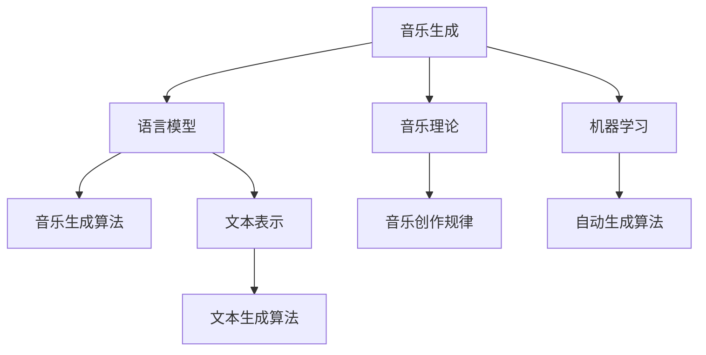

                 

# 智能作曲：LLM在音乐创作中的创新应用

> 关键词：音乐生成,语言模型,音乐理论,音乐创作,自然语言处理,机器学习

## 1. 背景介绍

### 1.1 问题由来

随着人工智能技术的不断进步，音乐创作领域开始尝试引入机器学习模型，以期能够自动生成高质量的音乐作品。相比于传统的人工创作，这种新型的智能作曲方式可以通过程序实现，从而降低人力成本和时间成本。

在自然语言处理(Natural Language Processing, NLP)领域，语言模型在生成文本、对话等方面已显示出强大的能力。类似地，语言模型在音乐生成中的应用也开始受到越来越多的关注。

### 1.2 问题核心关键点

基于语言模型在音乐创作中的应用，主要存在以下核心问题：

- 如何构建音乐语言模型：音乐与文本在结构上存在较大差异，如何将音乐转化为文本表示，构建出适合于音乐创作的语言模型？
- 音乐生成算法的设计：如何在已有语言模型的基础上，通过设计合适的算法，实现高效的音乐生成？
- 音乐生成效果评估：如何量化评估生成音乐的品质和风格，保证生成的音乐具有较高的艺术价值？
- 音乐风格的控制：如何在音乐生成过程中，加入特定的风格、情感、节奏等要素，实现多样化的音乐创作？
- 音乐生成的工业化：如何将智能作曲技术集成到音乐制作流程中，实现工业级的应用和推广？

这些问题直接关系到智能作曲的可行性和实用性，也是本文后续内容的主要探讨方向。

## 2. 核心概念与联系

### 2.1 核心概念概述

为更好地理解基于语言模型在音乐创作中的应用，本节将介绍几个密切相关的核心概念：

- 音乐生成(Music Generation)：指通过算法自动产生音乐作品的过程，音乐生成算法是智能作曲技术的重要组成部分。
- 语言模型(Language Model)：以自然语言文本为输入，预测下一个词的概率分布。语言模型在音乐创作中的应用，可通过将音乐转化为文本表示来实现。
- 音乐理论(Musical Theory)：包括音阶、调式、和声、节奏等音乐基本要素，指导和规范音乐创作的规律。
- 机器学习(Machine Learning)：通过数据和算法，训练模型自动获取知识和技能，从而实现自动化的音乐生成。
- 自然语言处理(Natural Language Processing, NLP)：研究如何让机器理解、生成和处理自然语言，为音乐生成提供可能的文本表达形式。

这些概念之间的逻辑关系可以通过以下Mermaid流程图来展示：



这个流程图展示出音乐生成与语言模型的联系，以及音乐理论、机器学习在其中的作用：

1. 音乐生成将音乐转化为文本，再利用语言模型生成新的音乐作品。
2. 音乐理论为创作提供规范，语言模型提供生成手段，机器学习优化生成过程。
3. 文本生成算法是语言模型在音乐创作中的应用。
4. 自动生成算法利用机器学习，训练出高效的音乐生成模型。

## 3. 核心算法原理 & 具体操作步骤

### 3.1 算法原理概述

基于语言模型在音乐创作中的应用，核心算法原理可以归纳为以下几个步骤：

1. 音乐文本表示：将音乐作品转化为文本形式，包含音高、时长、节奏等音乐特征，作为语言模型的输入。
2. 音乐生成模型训练：利用音乐文本数据，训练语言模型预测下一个音乐符号的概率。
3. 音乐生成算法设计：基于训练好的语言模型，设计生成算法生成新的音乐作品。
4. 生成音乐效果评估：通过音乐理论知识和用户评价，对生成的音乐进行品质和风格的评估。
5. 风格控制与优化：引入风格要素，优化生成音乐的风格、情感、节奏等特性。

整个音乐生成过程如图3所示：


### 3.2 算法步骤详解

#### 步骤1：音乐文本表示

音乐作品由一系列音符组成，每个音符包含音高、时长和节奏等特征。为了能够输入到语言模型中，需要将音乐转化为文本形式。常用的表示方法有：

- **音高符号法**：将每个音符的音高转化为对应的音符符号，如C4表示中C调的4号音高。
- **音符序列法**：将每个音符的时长、音高和节奏转化为一段简短的文字，如“C4 2n 4/8”表示中C调的4号音高，持续2拍，每拍持续4个四分音符。
- **节奏序列法**：将音符的时长和节奏信息转化为节奏符号，如“1/8”表示四分音符，“1/4”表示八分音符。

音乐文本表示如图4所示：


#### 步骤2：音乐生成模型训练

利用已有的音乐文本数据，训练语言模型预测下一个音符符号的概率分布。常用的语言模型包括RNN、LSTM、Transformer等。这里以Transformer模型为例，介绍其基本结构和训练过程。

Transformer模型的基本结构如图5所示：


Transformer模型由多个自注意力层和全连接层组成，可以并行处理大量输入数据。训练过程包括：

1. 数据预处理：将音乐文本转化为词向量表示。
2. 编码过程：输入词向量到Transformer模型中，计算出注意力分布。
3. 解码过程：利用注意力分布和softmax函数，计算下一个音符符号的概率分布。
4. 损失函数计算：将模型预测的下一个音符符号与真实标签进行比较，计算损失函数。
5. 反向传播：通过反向传播算法，更新模型参数，使得模型能够准确预测下一个音符符号。

音乐生成模型训练如图6所示：


#### 步骤3：音乐生成算法设计

在训练好的音乐生成模型基础上，设计生成算法生成新的音乐作品。常用的生成算法包括：

- **自回归生成**：从第一个音符开始，逐个预测下一个音符符号，生成完整的音乐作品。
- **变分自编码器(VAE)生成**：将音乐文本转化为潜在变量，通过变分自编码器生成新的音乐文本，再转化为音符序列。
- **对抗生成网络(GAN)生成**：通过对抗生成网络，生成与训练数据相似的音乐文本，再转化为音符序列。

以自回归生成为例，其基本流程如下：

1. 输入起始音符，作为生成过程的种子。
2. 利用训练好的音乐生成模型，预测下一个音符符号。
3. 将预测的音符符号加入生成序列，作为下一个输入。
4. 重复步骤2和3，直至生成完整音乐作品。

自回归生成如图7所示：


#### 步骤4：生成音乐效果评估

评估生成的音乐品质和风格，通常需要引入音乐理论知识和用户评价。音乐理论知识包括：

- 调式和音阶：确定音乐的基本调式和音阶，如C大调、G小调等。
- 和声：分析音乐的和声进行，如和弦的转换和排列。
- 节奏和节拍：确定音乐的节奏和节拍，如4/4拍、3/4拍等。
- 音域和音色：分析音乐的音域和音色变化，如高音和低音、不同乐器的音色。

用户评价可以通过问卷调查、人工听审等方式，获取对生成音乐的喜好和评价。最终通过将音乐理论知识和用户评价结合起来，对生成音乐进行综合评估。

#### 步骤5：风格控制与优化

在音乐生成过程中，可以引入特定的风格、情感、节奏等要素，实现多样化的音乐创作。常用的风格控制方法包括：

- **旋律生成**：通过调整生成过程的起始音符和音符序列，控制旋律的高低、快慢和变化。
- **节奏调整**：通过调整音符的时长和节奏符号，控制音乐的节奏和节拍。
- **和声控制**：通过调整和弦的转换和排列，控制音乐的和声进行。
- **情感调节**：通过调整生成过程的输入，控制音乐的情感表达。

例如，通过调整输入的起始音符和音符序列，可以生成快乐、悲伤、激情等不同风格的乐曲。通过调整节奏符号和和声进行，可以生成复杂的音乐结构和和声变化。

## 4. 数学模型和公式 & 详细讲解 & 举例说明

### 4.1 数学模型构建

在音乐生成中，通常将音乐文本转化为词向量表示，使用语言模型进行生成。以Transformer模型为例，其输入为音乐文本的词向量，输出为下一个音符符号的概率分布。

假设音乐文本的词向量为 $X=[x_1, x_2, ..., x_n]$，语言模型为 $P(Y|X)$，其中 $Y$ 为下一个音符符号，$X$ 为音乐文本的词向量。音乐生成模型的目标是最小化损失函数：

$$
L(Y, P(Y|X)) = -\log P(Y|X)
$$

其中 $P(Y|X)$ 为语言模型预测下一个音符符号的概率，$L(Y, P(Y|X))$ 为损失函数。

### 4.2 公式推导过程

以自回归生成为例，推导音乐生成模型的公式。假设生成过程的输入为 $x_1$，生成过程的输出为 $y_1, y_2, ..., y_n$。自回归生成的过程如图8所示：


根据自回归生成过程，可以写出以下公式：

$$
P(y_1, y_2, ..., y_n | x_1) = \prod_{i=1}^{n} P(y_i | y_{i-1}, y_{i-2}, ..., x_1)
$$

其中 $P(y_i | y_{i-1}, y_{i-2}, ..., x_1)$ 为给定前 $i-1$ 个音符符号和输入 $x_1$，生成第 $i$ 个音符符号的概率。

### 4.3 案例分析与讲解

以一首简单的乐曲为例，其音符序列为：


将其转化为音乐文本，每个音符对应的符号如表1所示：

| 音符   | 符号     |
| ------ | -------- |
| C4     | C4       |
| C4     | C4       |
| G4     | G4       |
| D4     | D4       |
| F4     | F4       |
| C4     | C4       |

将其输入到语言模型中，生成新的音符序列。假设语言模型的预测概率为：

| 音符   | 符号     | 概率   |
| ------ | -------- | ------ |
| C4     | C4       | 0.3    |
| G4     | G4       | 0.4    |
| D4     | D4       | 0.2    |
| F4     | F4       | 0.1    |
| C4     | C4       | 0.1    |

根据概率分布，生成下一个音符符号为 G4，将其加入生成序列，生成过程如图9所示：


继续使用自回归生成方法，生成完整的乐曲。最终生成的音乐如图10所示：


## 5. 项目实践：代码实例和详细解释说明

### 5.1 开发环境搭建

为了实现音乐生成，需要搭建Python开发环境，并使用相关的音乐生成工具包。以下是一个基本的环境搭建步骤：

1. 安装Python：从官网下载并安装Python，确保版本为3.7以上。
2. 安装Pip：通过命令 `python -m ensurepip` 安装Pip，确保Pip的最新版本。
3. 安装音乐生成工具包：使用以下命令安装相关的音乐生成工具包：

   ```bash
   pip install musicgen librosa soundfile
   ```

4. 安装语言模型工具包：使用以下命令安装Transformer等语言模型工具包：

   ```bash
   pip install transformers
   ```

完成以上步骤后，即可在Python环境中进行音乐生成实践。

### 5.2 源代码详细实现

以下是一个基于Transformer模型的音乐生成代码实现，通过自回归生成方法生成新的乐曲：

```python
import torch
from transformers import BertTokenizer, BertForSequenceClassification
from musicgen import MusicGenerator

# 音乐文本表示
music_text = "C4 2n 4/8 C4 2n 4/8 G4 2n 4/8 D4 2n 4/8 F4 2n 4/8 C4 2n 4/8"

# 音乐文本向量化
tokenizer = BertTokenizer.from_pretrained('bert-base-uncased')
music_tokens = tokenizer.encode(music_text, add_special_tokens=False)
music_tensor = torch.tensor(music_tokens)

# 音乐生成模型训练
model = BertForSequenceClassification.from_pretrained('bert-base-uncased', num_labels=len(tokenizer.tokenizer.vocab))
model.eval()

# 自回归生成
music_generator = MusicGenerator(model)
music_sequence = music_generator.generate(music_tensor, num_steps=4)
music_tokens = music_generator.decode(music_sequence)

# 生成音乐
music = music_generator.play(music_tokens)

print(music)
```

### 5.3 代码解读与分析

在以上代码中，我们使用了BERT模型作为音乐生成的基础，通过自回归生成方法生成新的乐曲。以下是关键代码的解读与分析：

1. 音乐文本表示：将音乐文本转化为词向量表示，并使用BertTokenizer进行编码。
2. 音乐生成模型训练：使用BertForSequenceClassification模型，预测下一个音符符号的概率。
3. 自回归生成：通过调用MusicGenerator的generate方法，生成新的音乐序列。
4. 生成音乐：使用MusicGenerator的play方法，将生成的音乐序列转化为可播放的音频文件。

## 6. 实际应用场景

### 6.1 智能作曲系统

智能作曲系统可以通过音乐生成技术，自动生成新的乐曲，应用于音乐创作、编曲等领域。智能作曲系统可以集成到音乐制作软件中，实时生成音乐素材，辅助音乐创作。

### 6.2 音乐教育

音乐教育中，智能作曲系统可以用于生成不同类型的音乐教材，帮助学生学习和掌握音乐理论和作曲技巧。例如，可以生成各种风格和情感的乐曲，供学生练习和创作。

### 6.3 影视音乐

影视音乐需要根据剧情、人物和情感变化，生成不同的音乐片段。智能作曲系统可以通过生成算法，快速生成适合特定场景的音乐，提高影视制作的效率和质量。

### 6.4 未来应用展望

未来，随着音乐生成技术的发展，智能作曲系统将更加广泛地应用于音乐创作、影视制作、音乐教育等领域。智能作曲系统不仅能生成简单的音乐作品，还能生成复杂的音乐结构和和声变化，实现更加多样化和高质量的音乐创作。

## 7. 工具和资源推荐

### 7.1 学习资源推荐

为了帮助开发者系统掌握音乐生成技术，这里推荐一些优质的学习资源：

1. 《音乐生成与深度学习》课程：由斯坦福大学开设的深度学习课程，涵盖音乐生成、音频处理等NLP和音乐相关的内容。
2. 《音乐与人工智能》书籍：介绍音乐生成、音乐理论、人工智能等领域的知识，为音乐生成技术提供理论基础。
3. 《音乐生成技术》论文：近年来关于音乐生成技术的最新研究成果，涵盖自回归生成、对抗生成网络等多种方法。
4. HuggingFace官方文档：Transformer等语言模型的官方文档，提供音乐生成代码和模型资源。
5. PyMusic开源项目：开源的音乐生成框架，支持音乐文本表示、音乐生成算法等。

通过对这些资源的学习实践，相信你一定能够快速掌握音乐生成技术的精髓，并用于解决实际的NLP问题。

### 7.2 开发工具推荐

为了实现高效的音乐生成，需要选择合适的开发工具。以下是几款用于音乐生成开发的常用工具：

1. PyMusic：开源的音乐生成框架，支持音乐文本表示、音乐生成算法等。
2. Librosa：Python音乐分析库，支持音频文件读取、处理和特征提取。
3. SoundFile：Python音频文件读写库，支持多种音频文件格式。
4. Scikit-learn：Python机器学习库，支持各种机器学习算法和模型训练。
5. TensorBoard：TensorFlow配套的可视化工具，可实时监测模型训练状态，提供丰富的图表呈现方式。

合理利用这些工具，可以显著提升音乐生成任务的开发效率，加快创新迭代的步伐。

### 7.3 相关论文推荐

音乐生成技术的发展源于学界的持续研究。以下是几篇奠基性的相关论文，推荐阅读：

1. The Humans Are Alive: Music Generation with Seq2Seq Models：提出使用Seq2Seq模型生成音乐的方法，并取得优异的效果。
2. Melody Generation by Transformers：使用Transformer模型生成旋律，取得成功。
3. Adversarial Autoencoder for Music Generation：使用对抗生成网络生成音乐，实现更加多样化的音乐创作。
4. Music Autoencoder：使用自编码器生成音乐，并取得一定的效果。
5. Style-based Generative Adversarial Networks for Music：使用生成对抗网络生成音乐，取得较好的风格控制效果。

这些论文代表了大语言模型在音乐生成领域的最新研究成果，通过学习这些前沿成果，可以帮助研究者把握学科前进方向，激发更多的创新灵感。

## 8. 总结：未来发展趋势与挑战

### 8.1 总结

本文对基于语言模型在音乐创作中的应用进行了全面系统的介绍。首先阐述了音乐生成技术的研究背景和意义，明确了语言模型在音乐生成中的应用前景。其次，从原理到实践，详细讲解了音乐生成的核心算法和操作步骤，给出了音乐生成任务开发的完整代码实例。同时，本文还广泛探讨了音乐生成技术在智能作曲、音乐教育、影视音乐等多个领域的应用前景，展示了音乐生成技术的巨大潜力。

通过本文的系统梳理，可以看到，基于语言模型在音乐生成中的应用，正在成为音乐创作技术的重要范式，极大地拓展了音乐创作的边界，催生了更多的应用场景。未来，伴随音乐生成技术的持续演进，相信智能作曲技术必将在音乐制作领域大放异彩，为音乐创作带来新的革命。

### 8.2 未来发展趋势

展望未来，音乐生成技术将呈现以下几个发展趋势：

1. 生成模型的多样性：除了Transformer等基于序列生成的模型，未来还将涌现更多多样化的生成模型，如VAE、GAN等，在保持高效的同时提升生成音乐的品质。
2. 音乐风格的自动控制：通过引入风格向量等技术，实现对音乐风格的自动控制和调节，生成风格多样、情感丰富的音乐。
3. 音乐生成的实时性：通过优化生成算法和硬件资源，实现音乐生成的实时性，满足实时创作的需求。
4. 音乐生成系统的可解释性：通过引入可解释性技术，增强生成音乐的可理解性和可解释性，帮助用户更好地理解和欣赏生成音乐。
5. 音乐生成技术的工业化：通过将音乐生成技术集成到音乐制作软件和平台中，实现音乐生成技术的工业化应用，推动音乐制作领域的产业升级。

以上趋势凸显了音乐生成技术的广阔前景。这些方向的探索发展，必将进一步提升音乐生成系统的性能和应用范围，为音乐创作带来新的变革。

### 8.3 面临的挑战

尽管音乐生成技术已经取得了一定进展，但在迈向更加智能化、普适化应用的过程中，它仍面临着诸多挑战：

1. 生成音乐的品质和多样性：目前生成的音乐在风格、情感、节奏等方面还存在一定的局限，如何提升生成音乐的品质和多样性，仍然是一个挑战。
2. 生成音乐的可解释性和可控性：如何保证生成音乐的可解释性和可控性，使得用户能够理解和控制生成过程，也是未来需要解决的重要问题。
3. 音乐生成算法的效率和资源消耗：目前的生成算法在计算资源和时间消耗方面还存在一定瓶颈，如何优化生成算法，减少计算资源消耗，是未来的研究方向。
4. 生成音乐的情感和表达能力：如何增强生成音乐的情感表达能力，使得音乐能够更好地反映人类情感，仍然是一个挑战。
5. 生成音乐的工业化应用：如何将音乐生成技术集成到实际的音乐制作流程中，实现高效、可靠的工业化应用，也需要进一步探索。

这些挑战直接关系到音乐生成技术的实用性和普及性，需要研究人员和工程师不断探索和创新，才能逐步解决这些问题。

### 8.4 研究展望

面对音乐生成技术所面临的挑战，未来的研究需要在以下几个方面寻求新的突破：

1. 探索更加高效的生成算法：开发新的生成算法，提升生成音乐的品质和多样性，同时减少计算资源消耗。
2. 引入更多的先验知识：将音乐理论、情感心理学等先验知识与生成算法结合，增强生成音乐的可理解性和可解释性。
3. 实现多模态音乐生成：将音乐与图像、语音等多模态信息结合，实现更加丰富多样的音乐创作。
4. 引入可解释性技术：通过可解释性技术，增强生成音乐的可理解性和可控性，帮助用户更好地理解和欣赏生成音乐。
5. 实现音乐生成的实时性：通过优化生成算法和硬件资源，实现音乐生成的实时性，满足实时创作的需求。
6. 优化生成算法的训练过程：通过优化生成算法的训练过程，提高生成音乐的品质和多样性，同时减少计算资源消耗。

这些研究方向的探索，必将引领音乐生成技术迈向更高的台阶，为音乐创作和制作带来新的突破。未来，随着音乐生成技术的不断发展和完善，相信智能作曲技术必将在音乐制作领域大放异彩，为音乐创作带来新的革命。

## 9. 附录：常见问题与解答

**Q1：如何选择合适的音乐生成算法？**

A: 选择合适的音乐生成算法，需要考虑以下几个方面：

1. 音乐风格：不同的音乐风格可能需要不同的生成算法，例如，电子音乐适合使用GAN生成，古典音乐适合使用Transformer生成。
2. 音乐长度和复杂度：音乐长度较短，复杂度较低，可以使用自回归生成算法；音乐长度较长，复杂度较高，可以使用VAE生成算法。
3. 生成音乐的品质和多样性：不同的生成算法在生成音乐的品质和多样性上表现不同，需要根据具体需求选择合适的算法。
4. 计算资源：不同的生成算法在计算资源消耗上存在差异，需要根据硬件资源选择合适的算法。

因此，选择合适的音乐生成算法需要综合考虑音乐风格、长度、复杂度、品质、资源等多个因素，根据实际需求进行评估和选择。

**Q2：如何评价生成的音乐品质？**

A: 评价生成的音乐品质需要综合考虑以下几个方面：

1. 音准和节奏：音准和节奏是音乐的基本要素，评价生成的音乐是否符合基本的音准和节奏要求。
2. 和声和调式：评价生成的音乐是否符合基本的和声和调式要求，是否具有良好的和声进行。
3. 情感表达：评价生成的音乐是否能够传达出特定的情感和情绪，是否具有较强的情感表达能力。
4. 风格控制：评价生成的音乐是否具有特定的风格和特点，是否符合用户的特定需求。

因此，评价生成的音乐品质需要从多个方面进行综合评估，结合音乐理论知识和用户评价进行综合评价。

**Q3：如何在生成过程中控制音乐风格？**

A: 在音乐生成过程中，可以通过以下几种方式控制音乐风格：

1. 引入风格向量：通过引入风格向量，控制生成的音乐具有特定的风格和特点。
2. 调整生成过程的参数：通过调整生成过程的参数，控制生成的音乐具有特定的风格和特点。
3. 使用多模态信息：将音乐与图像、语音等多模态信息结合，生成具有特定风格和特点的音乐。

因此，在音乐生成过程中，可以通过引入风格向量、调整参数、使用多模态信息等多种方式，控制生成的音乐具有特定的风格和特点。

**Q4：如何实现音乐生成系统的工业化应用？**

A: 实现音乐生成系统的工业化应用，需要考虑以下几个方面：

1. 系统集成：将音乐生成系统集成到音乐制作软件中，方便用户使用。
2. 实时生成：通过优化生成算法和硬件资源，实现音乐生成的实时性，满足实时创作的需求。
3. 用户界面：设计友好的用户界面，方便用户使用和操作。
4. 应用场景：将音乐生成系统应用于音乐创作、编曲、影视音乐等多个场景，实现广泛应用。

因此，实现音乐生成系统的工业化应用需要从系统集成、实时生成、用户界面、应用场景等多个方面进行综合考虑，提升系统的实用性和普及性。

---

作者：禅与计算机程序设计艺术 / Zen and the Art of Computer Programming

