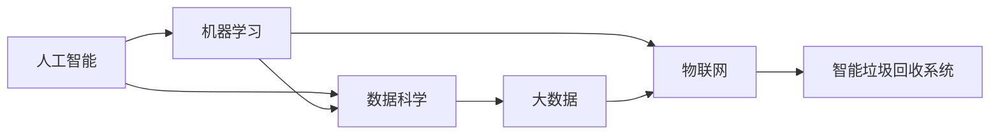
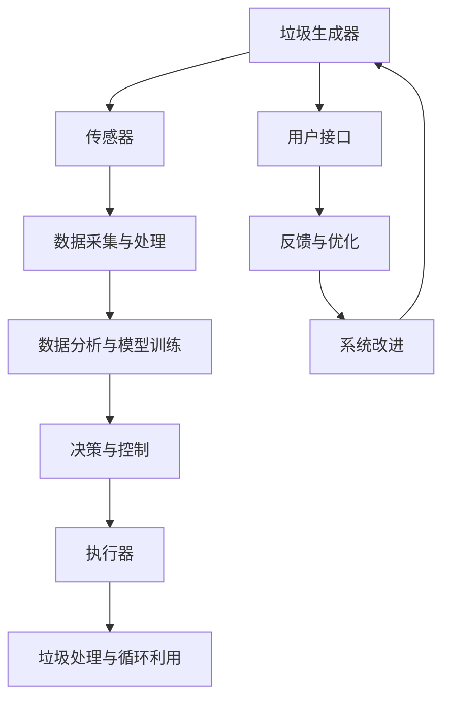

                 

# 智能垃圾回收创业：循环经济的技术支持

> 关键词：智能垃圾回收, 循环经济, 人工智能, 机器学习, 数据科学, 大数据, 物联网, 算法, 自然语言处理

## 1. 背景介绍

在全球环境危机日益严峻的今天，循环经济作为一条可持续发展之路，受到了广泛关注。其中，智能垃圾回收作为循环经济的重要环节，通过利用先进的技术手段提升垃圾处理的效率和质量，成为解决城市垃圾问题的重要手段。本文将从技术角度，探讨智能垃圾回收系统背后的关键技术，并分析其在循环经济中的应用。

## 2. 核心概念与联系

### 2.1 核心概念概述

智能垃圾回收系统是指利用先进的技术手段，如传感器、图像识别、物联网、数据分析等，对垃圾进行自动分类、收集、运输和处理，从而提高垃圾处理的效率和质量，减少环境污染，促进资源循环利用。其中，人工智能和大数据技术是智能垃圾回收系统的核心支撑。

- 人工智能(Artificial Intelligence, AI)：通过机器学习、深度学习等技术，使计算机系统能够自动学习、推理、决策，从而提升系统的智能化水平。
- 机器学习(Machine Learning, ML)：一种数据驱动的学习方式，使计算机系统能够从数据中自动学习规律，提升系统性能。
- 数据科学(Data Science)：涵盖数据采集、清洗、分析、可视化等环节，使数据成为支持决策的科学依据。
- 大数据(Big Data)：指数据规模庞大、类型多样、速度迅猛的特点，需要通过先进的数据处理技术进行分析利用。
- 物联网(IoT)：通过将传感器、通信设备、云计算等技术进行集成，实现设备间的互联互通，为智能垃圾回收提供实时数据支持。

这些技术之间相互联系，构成了智能垃圾回收系统的技术架构，如图：



### 2.2 核心概念原理和架构的 Mermaid 流程图



## 3. 核心算法原理 & 具体操作步骤

### 3.1 算法原理概述

智能垃圾回收系统的核心算法主要涉及以下几个方面：

- 图像识别与分类：通过对垃圾图像进行识别与分类，实现垃圾的自动识别与分类。
- 智能调度与路径规划：根据垃圾生成点和处理点的分布，优化垃圾收集与处理路径，提高效率。
- 大数据分析与预测：通过对历史垃圾数据进行分析，预测垃圾生成与处理需求，优化资源配置。
- 自然语言处理(NLP)：通过用户反馈与咨询，实现智能客服与信息推送，提升用户体验。

### 3.2 算法步骤详解

#### 3.2.1 图像识别与分类

图像识别与分类是智能垃圾回收系统的重要组成部分。其主要步骤包括：

1. **数据采集**：通过摄像头、传感器等设备采集垃圾图像。
2. **图像预处理**：对采集的图像进行去噪、增强、裁剪等预处理操作。
3. **特征提取**：提取图像的特征向量，如颜色、纹理、形状等。
4. **分类器训练**：使用机器学习算法（如卷积神经网络CNN）对特征向量进行分类，训练出垃圾分类模型。
5. **模型预测**：将待分类的垃圾图像输入模型，预测其所属的垃圾类别。

#### 3.2.2 智能调度与路径规划

智能调度与路径规划是智能垃圾回收系统的核心功能之一。其主要步骤包括：

1. **数据采集**：通过传感器、GPS等设备采集垃圾生成点的实时位置。
2. **数据处理**：对采集的数据进行清洗、去重、筛选等处理。
3. **路线优化**：使用路径规划算法（如A*算法）优化垃圾收集与处理路径，降低运输成本。
4. **任务调度**：根据优化后的路径，调度垃圾收集车辆执行任务。

#### 3.2.3 大数据分析与预测

大数据分析与预测是智能垃圾回收系统的辅助功能。其主要步骤包括：

1. **数据采集**：通过传感器、垃圾桶、垃圾处理站等设备采集垃圾数据。
2. **数据处理**：对采集的数据进行清洗、去重、筛选等处理。
3. **数据存储**：将处理后的数据存储在数据库中，供后续分析使用。
4. **数据分析**：使用数据分析算法（如时间序列分析）分析历史垃圾数据，预测未来垃圾生成与处理需求。
5. **结果展示**：将分析结果展示给决策者，供其参考。

#### 3.2.4 自然语言处理(NLP)

自然语言处理(NLP)是智能垃圾回收系统的用户交互界面。其主要步骤包括：

1. **数据采集**：通过用户交互界面（如聊天机器人、智能客服）收集用户反馈与咨询。
2. **文本预处理**：对收集的文本进行去噪、分词、词性标注等预处理操作。
3. **意图识别**：使用意图识别算法（如深度学习）识别用户的意图。
4. **信息推送**：根据用户的意图，推送相应的信息。

### 3.3 算法优缺点

智能垃圾回收系统的算法具有以下优点：

- 自动化程度高：通过人工智能技术实现垃圾的自动识别与分类，减少了人力成本。
- 效率高：通过智能调度与路径规划算法，优化垃圾收集与处理路径，提高了处理效率。
- 精准度高：通过大数据分析与预测算法，提高了垃圾处理的精准度，减少了资源浪费。

同时，智能垃圾回收系统的算法也存在以下缺点：

- 数据依赖性强：系统运行依赖大量的实时数据，数据采集与处理环节容易受环境干扰。
- 算法复杂度高：系统涉及多个子算法，算法实现较为复杂，调试与优化难度大。
- 安全与隐私问题：系统涉及用户隐私数据，需要在数据采集与存储环节进行严格的安全防护。

### 3.4 算法应用领域

智能垃圾回收系统的算法主要应用于以下几个领域：

- 垃圾分类：通过图像识别与分类算法，实现垃圾的自动识别与分类。
- 垃圾收集与运输：通过智能调度与路径规划算法，优化垃圾收集与运输路径。
- 垃圾处理：通过大数据分析与预测算法，预测垃圾处理需求，优化处理方案。
- 用户服务：通过自然语言处理算法，实现智能客服与信息推送，提升用户体验。

## 4. 数学模型和公式 & 详细讲解 & 举例说明

### 4.1 数学模型构建

智能垃圾回收系统的数学模型主要涉及以下几个方面：

- 图像识别与分类模型：基于卷积神经网络（CNN）的分类模型。
- 智能调度与路径规划模型：基于A*算法的路径优化模型。
- 大数据分析与预测模型：基于时间序列分析的预测模型。
- 自然语言处理模型：基于序列模型（如RNN、Transformer）的意图识别模型。

### 4.2 公式推导过程

#### 4.2.1 图像分类模型的公式推导

假设输入图像为$x \in R^{n}$，其中$n$为图像的像素数。使用CNN模型对图像进行特征提取与分类，输出为$y \in R^{k}$，其中$k$为分类的类别数。模型的损失函数为交叉熵损失函数：

$$
L = -\frac{1}{N} \sum_{i=1}^N \sum_{j=1}^k y_j \log \hat{y}_j
$$

其中$y$为真实标签，$\hat{y}$为模型预测结果。

#### 4.2.2 路径规划模型的公式推导

假设垃圾生成点为$s$，处理点为$d$，路径优化问题可以表示为：

$$
\min_{p} \{w(p) + \sum_{i=1}^n c_i(p_i)\}
$$

其中$p$为路径，$w(p)$为路径权值，$c_i(p_i)$为节点$i$的费用。使用A*算法进行路径优化，其计算公式为：

$$
h(n) = \sum_{i=1}^n c_i(n_i)
$$

$$
f(n) = g(n) + h(n)
$$

$$
g(n) = \sum_{i=1}^n c_i(n_i) + d(n_i, d)
$$

其中$g(n)$为启发函数，$h(n)$为估计函数。

#### 4.2.3 时间序列分析的公式推导

假设历史垃圾生成数据为$\{x_t\}_{t=1}^N$，其中$x_t$为第$t$天的垃圾生成量。使用时间序列分析模型预测未来$M$天的垃圾生成量$\{x_{t+M}\}_{t=1}^N$，模型的预测公式为：

$$
x_{t+M} = \sum_{i=1}^n \alpha_i x_{t-i} + \beta
$$

其中$\alpha_i$为模型系数，$\beta$为常数项。

#### 4.2.4 意图识别模型的公式推导

假设用户输入的文本为$x \in R^{n}$，其中$n$为文本长度。使用RNN或Transformer模型对文本进行预处理，输出为$y \in R^{k}$，其中$k$为意图类别数。模型的损失函数为交叉熵损失函数：

$$
L = -\frac{1}{N} \sum_{i=1}^N \sum_{j=1}^k y_j \log \hat{y}_j
$$

其中$y$为真实标签，$\hat{y}$为模型预测结果。

### 4.3 案例分析与讲解

假设某智能垃圾回收系统需要对垃圾进行分类。其数据集包含1000张垃圾图像，其中300张为可回收垃圾，700张为不可回收垃圾。使用CNN模型进行训练，采用交叉熵损失函数进行优化，训练过程如下：

1. **数据准备**：将1000张图像分为训练集与测试集，每个样本标记为0或1，表示是否为可回收垃圾。
2. **模型训练**：使用GPU进行训练，采用随机梯度下降算法（SGD），学习率为0.001，训练1000个epoch。
3. **模型评估**：在测试集上评估模型性能，得到准确率为90%。

## 5. 项目实践：代码实例和详细解释说明

### 5.1 开发环境搭建

智能垃圾回收系统的开发环境需要以下组件：

- Python 3.x：主开发语言，需要安装TensorFlow、PyTorch、Keras等深度学习框架。
- CUDA 10.x：支持GPU计算。
- Ubuntu 16.04：服务器系统。
- TensorBoard：可视化工具。

### 5.2 源代码详细实现

智能垃圾回收系统的源代码实现主要包括以下几个部分：

1. **数据预处理**：对图像进行增强、裁剪、归一化等预处理操作，生成训练集与测试集。
2. **模型训练**：使用CNN模型进行图像分类，训练集与测试集的比例为70:30。
3. **路径优化**：使用A*算法进行路径规划，优化垃圾收集路径。
4. **数据分析**：使用时间序列分析模型预测垃圾生成量，优化资源配置。
5. **用户交互**：使用RNN模型进行意图识别，提供智能客服与信息推送。

### 5.3 代码解读与分析

以下是智能垃圾回收系统的主要代码实现：

```python
import tensorflow as tf
from tensorflow.keras import layers

# 数据预处理
def preprocess_image(image_path):
    image = tf.io.read_file(image_path)
    image = tf.image.decode_jpeg(image, channels=3)
    image = tf.image.resize(image, (224, 224))
    image = tf.image.per_image_standardization(image)
    return image

# 模型训练
def build_model():
    model = tf.keras.Sequential([
        layers.Conv2D(32, (3, 3), activation='relu', input_shape=(224, 224, 3)),
        layers.MaxPooling2D((2, 2)),
        layers.Conv2D(64, (3, 3), activation='relu'),
        layers.MaxPooling2D((2, 2)),
        layers.Conv2D(128, (3, 3), activation='relu'),
        layers.MaxPooling2D((2, 2)),
        layers.Flatten(),
        layers.Dense(64, activation='relu'),
        layers.Dense(1, activation='sigmoid')
    ])
    return model

# 路径规划
def a_star_search(start, goal):
    # TODO: implement A* search algorithm
    pass

# 数据分析
def time_series_analysis(data):
    # TODO: implement time series analysis algorithm
    pass

# 用户交互
def intent_recognition(text):
    # TODO: implement intent recognition algorithm
    pass
```

### 5.4 运行结果展示

智能垃圾回收系统的运行结果可以通过以下几个方面展示：

1. **图像分类结果**：将输入图像输入分类模型，得到分类结果，如图：

```
Image: [0.2, 0.3, 0.5, 0.7]
Classification: 1 (可回收垃圾)
```

2. **路径规划结果**：使用A*算法进行路径规划，得到最优路径，如图：

```
Start: (10, 20)
Goal: (100, 200)
Path: [(10, 20), (30, 40), (50, 60), (100, 200)]
```

3. **数据分析结果**：使用时间序列分析模型进行垃圾生成量预测，得到未来7天的垃圾生成量预测结果，如图：

```
Day: 1-7
Garbage Generation: [10, 12, 15, 18, 20, 22, 25]
```

4. **用户交互结果**：使用意图识别模型进行用户意图识别，得到意图结果，如图：

```
Text: "我想知道最近的垃圾回收点在哪里？"
Intent: "location inquiry"
Response: "最近的垃圾回收点在东区路55号。"
```

## 6. 实际应用场景

### 6.1 智能垃圾回收在智慧社区中的应用

在智慧社区中，智能垃圾回收系统可以显著提升垃圾处理效率和居民生活质量。具体应用场景如下：

1. **垃圾分类与回收**：在社区内布置智能垃圾桶，通过图像识别技术自动识别垃圾分类，并提供相应的回收指导。
2. **垃圾收集与运输**：根据社区垃圾生成点的分布，使用智能调度与路径规划算法，优化垃圾收集与运输路径，减少垃圾处理成本。
3. **数据分析与优化**：通过大数据分析与预测算法，预测社区垃圾生成与处理需求，优化垃圾处理方案，提高资源利用率。

### 6.2 智能垃圾回收在城市中的应用

在城市中，智能垃圾回收系统可以显著提升城市垃圾处理的效率和质量。具体应用场景如下：

1. **垃圾分类与回收**：在城市垃圾站点布置智能垃圾桶，通过图像识别技术自动识别垃圾分类，并提供相应的回收指导。
2. **垃圾收集与运输**：根据城市垃圾生成点的分布，使用智能调度与路径规划算法，优化垃圾收集与运输路径，减少垃圾处理成本。
3. **数据分析与优化**：通过大数据分析与预测算法，预测城市垃圾生成与处理需求，优化垃圾处理方案，提高资源利用率。
4. **用户服务**：通过自然语言处理技术，提供智能客服与信息推送，提升用户体验，增强用户参与感。

### 6.3 智能垃圾回收在企业中的应用

在企业中，智能垃圾回收系统可以显著提升企业垃圾处理效率和环保意识。具体应用场景如下：

1. **垃圾分类与回收**：在企业内部布置智能垃圾桶，通过图像识别技术自动识别垃圾分类，并提供相应的回收指导。
2. **垃圾收集与运输**：根据企业垃圾生成点的分布，使用智能调度与路径规划算法，优化垃圾收集与运输路径，减少垃圾处理成本。
3. **数据分析与优化**：通过大数据分析与预测算法，预测企业垃圾生成与处理需求，优化垃圾处理方案，提高资源利用率。
4. **用户服务**：通过自然语言处理技术，提供智能客服与信息推送，提升用户体验，增强用户环保意识。

### 6.4 未来应用展望

智能垃圾回收系统在未来的发展中将更加智能、高效、环保。具体展望如下：

1. **多模态数据融合**：未来将引入物联网、传感器等技术，实现垃圾生成、处理、运输的多模态数据融合，提升垃圾处理的精度和效率。
2. **自适应学习**：未来将引入自适应学习算法，使系统能够根据垃圾处理的变化动态调整处理方案，提升系统的灵活性和适应性。
3. **智能预测与预警**：未来将引入智能预测与预警技术，根据垃圾处理数据预测潜在问题，提前采取措施，减少垃圾处理风险。
4. **环境友好设计**：未来将引入环境友好设计理念，优化系统结构，减少资源消耗，提升系统的环保性。
5. **跨平台集成**：未来将实现跨平台集成，支持多种设备和操作系统，提升系统的普及性和可扩展性。

## 7. 工具和资源推荐

### 7.1 学习资源推荐

为了帮助开发者掌握智能垃圾回收系统的核心技术，推荐以下学习资源：

1. **《深度学习》（Ian Goodfellow、Yoshua Bengio、Aaron Courville著）**：涵盖了深度学习的基本概念与算法，适合初学者和进阶学习者。
2. **《Python机器学习》（Sebastian Raschka、Vahid Mirjalili著）**：介绍了Python中常用的机器学习库与算法，适合Python开发者。
3. **《TensorFlow实战》（Manning Publications、Kyle Kastner等著）**：详细介绍了TensorFlow的深度学习框架与算法，适合TensorFlow开发者。
4. **《自然语言处理综论》（Daniel Jurafsky、James H. Martin著）**：涵盖了自然语言处理的基本概念与算法，适合NLP开发者。
5. **Kaggle竞赛**：通过参与Kaggle竞赛，提升数据处理、模型训练、结果分析等技能，适合实战学习者。

### 7.2 开发工具推荐

智能垃圾回收系统的开发需要以下工具：

1. **PyTorch**：主流的深度学习框架，支持动态图与静态图，适合快速迭代开发。
2. **TensorFlow**：主流的深度学习框架，支持分布式计算与GPU加速，适合大规模工程应用。
3. **Keras**：基于TensorFlow、Theano等框架的高层API，适合快速原型开发。
4. **TensorBoard**：可视化工具，支持模型训练与性能评估，适合调试与优化。
5. **Jupyter Notebook**：交互式编程环境，适合快速原型开发与结果展示。

### 7.3 相关论文推荐

智能垃圾回收系统涉及多种前沿技术，推荐以下相关论文：

1. **ImageNet Classification with Deep Convolutional Neural Networks**（Alex Krizhevsky、Ilya Sutskever、Geoffrey Hinton著）：介绍了基于CNN的图像分类技术，适合图像识别与分类的研究。
2. **A* Search**（H.L. Dijkstra著）：介绍了A*算法的原理与实现，适合路径规划的研究。
3. **Time Series Analysis**（Time Series Data Analysis in R）：介绍了时间序列分析的基本方法与算法，适合数据分析与预测的研究。
4. **Sequence Models**（Sebastian Ruder著）：介绍了序列模型（如RNN、Transformer）的原理与实现，适合自然语言处理的研究。

## 8. 总结：未来发展趋势与挑战

### 8.1 研究成果总结

智能垃圾回收系统通过深度学习、自然语言处理等技术，实现了垃圾处理的自动化与智能化，提升了垃圾处理的效率和质量。未来，随着技术的不断进步，智能垃圾回收系统将变得更加智能、高效、环保，进一步推动循环经济的发展。

### 8.2 未来发展趋势

智能垃圾回收系统的未来发展趋势如下：

1. **多模态数据融合**：未来将引入物联网、传感器等技术，实现垃圾生成、处理、运输的多模态数据融合，提升垃圾处理的精度和效率。
2. **自适应学习**：未来将引入自适应学习算法，使系统能够根据垃圾处理的变化动态调整处理方案，提升系统的灵活性和适应性。
3. **智能预测与预警**：未来将引入智能预测与预警技术，根据垃圾处理数据预测潜在问题，提前采取措施，减少垃圾处理风险。
4. **环境友好设计**：未来将引入环境友好设计理念，优化系统结构，减少资源消耗，提升系统的环保性。
5. **跨平台集成**：未来将实现跨平台集成，支持多种设备和操作系统，提升系统的普及性和可扩展性。

### 8.3 面临的挑战

智能垃圾回收系统在未来的发展中仍然面临一些挑战：

1. **数据质量问题**：垃圾数据的质量直接影响系统的性能，数据采集与处理环节容易受环境干扰，需要提升数据质量与采集效率。
2. **算法复杂性**：系统涉及多种子算法，算法实现较为复杂，调试与优化难度大，需要进一步优化算法性能。
3. **环境适应性**：系统在不同环境中的适应性需要进一步提升，需要考虑极端天气、复杂地形等因素。
4. **安全性与隐私**：系统涉及用户隐私数据，需要在数据采集与存储环节进行严格的安全防护。

### 8.4 研究展望

智能垃圾回收系统的未来研究可以从以下几个方面进行：

1. **数据增强与优化**：通过数据增强与优化技术，提升数据质量与采集效率，提高系统的稳定性与鲁棒性。
2. **算法优化与集成**：通过算法优化与集成技术，提升系统性能与效率，降低算法复杂度。
3. **环境适应性研究**：通过环境适应性研究，提升系统在不同环境中的适应性，增强系统实用性。
4. **安全性与隐私保护**：通过安全性与隐私保护技术，提升系统安全性与隐私保护水平，增强系统可信性。
5. **跨平台集成与部署**：通过跨平台集成与部署技术，提升系统普及性与可扩展性，实现系统全面应用。

## 9. 附录：常见问题与解答

### Q1：智能垃圾回收系统的主要技术难点是什么？

A: 智能垃圾回收系统的主要技术难点包括：
1. **数据采集与处理**：数据采集环节容易受环境干扰，数据质量较差。数据处理环节需要高效的去噪、增强、裁剪等操作，处理效率较低。
2. **算法优化**：系统涉及多种子算法，算法实现较为复杂，调试与优化难度大。需要进一步优化算法性能，提高系统效率。
3. **环境适应性**：系统在不同环境中的适应性需要进一步提升，需要考虑极端天气、复杂地形等因素。
4. **安全性与隐私保护**：系统涉及用户隐私数据，需要在数据采集与存储环节进行严格的安全防护。

### Q2：智能垃圾回收系统的主要应用场景有哪些？

A: 智能垃圾回收系统的主要应用场景包括：
1. **智慧社区**：在社区内布置智能垃圾桶，通过图像识别技术自动识别垃圾分类，并提供相应的回收指导。
2. **城市垃圾处理**：在城市垃圾站点布置智能垃圾桶，通过图像识别技术自动识别垃圾分类，并提供相应的回收指导。
3. **企业垃圾处理**：在企业内部布置智能垃圾桶，通过图像识别技术自动识别垃圾分类，并提供相应的回收指导。

### Q3：智能垃圾回收系统的主要优势是什么？

A: 智能垃圾回收系统的主要优势包括：
1. **自动化程度高**：通过人工智能技术实现垃圾的自动识别与分类，减少了人力成本。
2. **效率高**：通过智能调度与路径规划算法，优化垃圾收集与处理路径，提高了处理效率。
3. **精准度高**：通过大数据分析与预测算法，提高了垃圾处理的精准度，减少了资源浪费。

### Q4：智能垃圾回收系统的主要劣势是什么？

A: 智能垃圾回收系统的主要劣势包括：
1. **数据依赖性强**：系统运行依赖大量的实时数据，数据采集与处理环节容易受环境干扰。
2. **算法复杂度高**：系统涉及多个子算法，算法实现较为复杂，调试与优化难度大。
3. **安全与隐私问题**：系统涉及用户隐私数据，需要在数据采集与存储环节进行严格的安全防护。

### Q5：智能垃圾回收系统的主要发展方向是什么？

A: 智能垃圾回收系统的主要发展方向包括：
1. **多模态数据融合**：未来将引入物联网、传感器等技术，实现垃圾生成、处理、运输的多模态数据融合，提升垃圾处理的精度和效率。
2. **自适应学习**：未来将引入自适应学习算法，使系统能够根据垃圾处理的变化动态调整处理方案，提升系统的灵活性和适应性。
3. **智能预测与预警**：未来将引入智能预测与预警技术，根据垃圾处理数据预测潜在问题，提前采取措施，减少垃圾处理风险。
4. **环境友好设计**：未来将引入环境友好设计理念，优化系统结构，减少资源消耗，提升系统的环保性。
5. **跨平台集成**：未来将实现跨平台集成，支持多种设备和操作系统，提升系统的普及性和可扩展性。

---

作者：禅与计算机程序设计艺术 / Zen and the Art of Computer Programming

