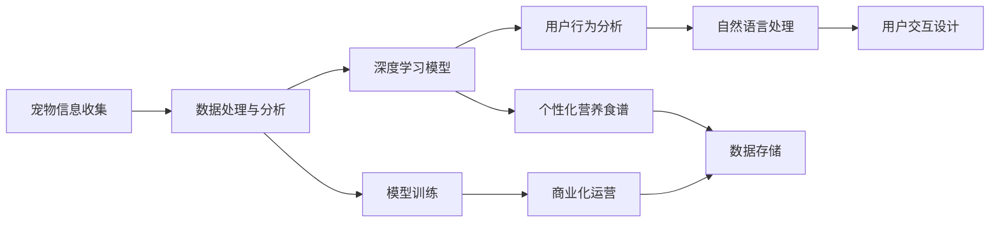

                 

# 智能宠物健康食谱创业：个性化宠物营养

> 关键词：
1. 宠物营养推荐
2. 机器学习
3. 深度学习
4. 个性化算法
5. 数据挖掘
6. 用户行为分析
7. 自然语言处理

## 1. 背景介绍

### 1.1 问题由来
随着中国宠物市场的快速发展，越来越多的人开始饲养宠物，而宠物健康问题也逐渐成为宠物主人关注的焦点。许多宠物主人希望通过科学饮食为宠物提供更好的营养和健康保障，但又缺乏科学养宠的知识和方法。因此，智能宠物健康食谱创业项目应运而生。

该项目旨在通过机器学习和大数据技术，为宠物主人提供个性化的营养食谱，帮助宠物获得最佳的营养摄入，保持健康和活力。通过在线平台，宠物主人可以输入宠物的信息、饮食习惯和偏好，系统便能为其生成个性化的食谱，实现智能化养宠。

### 1.2 问题核心关键点
- 个性化营养食谱：如何根据宠物的具体情况，设计出最适合其需求的食谱？
- 数据处理与分析：如何高效地处理海量宠物营养数据，并从中挖掘出有价值的信息？
- 机器学习模型：如何通过深度学习模型，为每个宠物建立精确的营养需求预测模型？
- 用户交互设计：如何设计简洁易用的用户界面，提升用户体验？
- 商业化运营：如何保证平台的稳定性和安全性，实现可持续的商业运营？

## 2. 核心概念与联系

### 2.1 核心概念概述

为更好地理解该项目，本节将介绍几个核心概念及其相互之间的联系：

- 宠物营养：是指宠物每天所需的营养物质和比例，如蛋白质、脂肪、碳水化合物、维生素、矿物质等。
- 个性化营养食谱：是根据宠物的品种、年龄、体重、健康状况、饮食习惯等，量身定制的营养食谱。
- 机器学习：是指利用算法，让计算机自动从数据中学习知识，并基于新数据进行推理和决策。
- 深度学习：是指利用神经网络模型，通过多层次的特征提取和抽象，完成复杂的模式识别和预测任务。
- 数据挖掘：是指从大量数据中发现有价值的模式、规律和趋势，用于辅助决策和优化。
- 用户行为分析：是指通过数据分析，了解用户的偏好和需求，实现个性化推荐和精准营销。
- 自然语言处理（NLP）：是指让计算机理解和处理自然语言的技术，用于宠物饮食和营养的查询与推荐。

这些核心概念之间通过深度学习模型和大数据技术，紧密地联系在一起，共同构建了智能宠物健康食谱创业项目的核心技术框架。

### 2.2 核心概念原理和架构的 Mermaid 流程图



这个流程图展示了该项目的主要流程：首先通过收集宠物信息，进行数据处理与分析，然后利用深度学习模型进行营养预测，再根据用户行为分析和自然语言处理技术，设计出个性化的营养食谱，并通过用户交互设计，实现智能化的养宠服务。此外，数据存储和商业化运营也是项目顺利运行的重要保障。

## 3. 核心算法原理 & 具体操作步骤

### 3.1 算法原理概述

该项目主要基于深度学习模型，通过机器学习算法，为每个宠物定制个性化的营养食谱。具体来说，其核心算法流程如下：

1. 数据收集：收集不同品种宠物的年龄、体重、健康状况、饮食偏好等信息，以及不同营养成分与健康指标的关系数据。
2. 数据处理与分析：对收集到的数据进行清洗、特征提取和标准化处理，以便后续深度学习模型的训练。
3. 模型训练：利用深度学习模型，对处理后的数据进行训练，以学习出各个营养成分对宠物健康的关联性。
4. 营养预测：根据宠物的实际情况和深度学习模型的预测结果，生成个性化的营养食谱。
5. 用户交互：通过自然语言处理技术，与宠物主人进行交互，获取宠物的实时信息，进行动态调整和优化。

### 3.2 算法步骤详解

#### 3.2.1 数据收集

数据收集是该项目的基础。需要从多个渠道收集数据，包括：

- 宠物的基本信息：如年龄、体重、品种等。
- 宠物的饮食信息：如日常喂食的食材、偏好等。
- 宠物的健康数据：如血液检测结果、体检报告等。
- 营养成分与健康关系数据：如不同营养成分与宠物健康指标的关系。

这些数据可以通过问卷调查、宠物医院、宠物食品公司等途径获取。

#### 3.2.2 数据处理与分析

数据处理与分析主要包括以下几个步骤：

1. 数据清洗：去除缺失、异常、重复的数据。
2. 特征提取：将文本、图像等非结构化数据转换为结构化特征。
3. 数据标准化：对不同来源的数据进行标准化处理，如单位统一、归一化等。
4. 数据划分：将数据划分为训练集、验证集和测试集。

以营养成分与健康关系数据为例，可以采用主成分分析（PCA）等方法进行特征提取和降维，以降低数据维度，提高模型训练效率。

#### 3.2.3 模型训练

模型训练主要包括以下几个步骤：

1. 选择合适的深度学习模型：如卷积神经网络（CNN）、循环神经网络（RNN）、长短期记忆网络（LSTM）等。
2. 设置超参数：如学习率、批量大小、迭代次数等。
3. 数据加载与处理：将数据加载到模型中，并进行预处理。
4. 模型训练：使用训练集数据，对模型进行迭代训练。
5. 模型评估：使用验证集数据，对模型进行评估，调整超参数。
6. 模型保存：将训练好的模型保存下来，以备后续使用。

以深度学习模型为例，可以使用Keras、TensorFlow等框架进行模型训练和优化。

#### 3.2.4 营养预测

营养预测主要包括以下几个步骤：

1. 输入数据：将宠物的基本信息、饮食信息、健康数据等输入模型。
2. 模型预测：利用训练好的模型，对输入数据进行预测，生成营养成分需求。
3. 结果优化：根据预测结果和宠物主人的反馈，进行动态调整和优化。
4. 输出食谱：根据预测结果和营养成分需求，生成个性化的营养食谱。

以LSTM模型为例，可以采用多时间步长的方法，根据历史饮食数据和健康数据，预测未来的营养需求。

#### 3.2.5 用户交互

用户交互主要包括以下几个步骤：

1. 界面设计：设计简洁易用的用户界面，方便宠物主人输入宠物信息。
2. 自然语言处理：采用自然语言处理技术，实现与宠物主人的交互。
3. 反馈机制：根据宠物主人的反馈，进行动态调整和优化。
4. 信息推送：将个性化的营养食谱推送给宠物主人，并提供健康建议。

以自然语言处理技术为例，可以采用基于语义理解的模型，对宠物主人的查询进行理解，并提供相应的回答。

### 3.3 算法优缺点

#### 3.3.1 优点

该项目的主要优点如下：

1. 个性化推荐：通过深度学习模型，能够根据宠物的具体情况，提供个性化的营养食谱。
2. 数据驱动：利用大数据技术，从大量数据中挖掘出有价值的信息，实现科学的养宠。
3. 用户友好：通过自然语言处理技术，实现简洁易用的用户界面，提升用户体验。
4. 自动化高效：通过机器学习算法，实现自动化的营养预测和食谱生成，节省时间和人力成本。

#### 3.3.2 缺点

该项目的主要缺点如下：

1. 数据质量：数据质量对模型的效果有很大影响，需要保证数据的完整性和准确性。
2. 模型复杂：深度学习模型需要大量的计算资源和时间，训练复杂度高。
3. 用户反馈：需要收集大量的用户反馈数据，以不断优化模型和算法。
4. 平台稳定性：需要保证平台稳定运行，以确保用户数据的安全和隐私。

## 4. 数学模型和公式 & 详细讲解 & 举例说明

### 4.1 数学模型构建

该项目主要利用深度学习模型，构建以下数学模型：

1. 输入层：输入宠物的基本信息、饮食信息、健康数据等。
2. 隐藏层：通过神经网络模型，对输入数据进行特征提取和抽象。
3. 输出层：生成营养成分需求和个性化营养食谱。

以LSTM模型为例，其数学模型可以表示为：

$$
y = \sigma(W_h \cdot x + b_h + U_h \cdot h_{t-1} + b_h)
$$

其中，$y$表示输出向量，$x$表示输入向量，$h_{t-1}$表示前一时间步的隐藏状态，$W_h$和$U_h$表示权重矩阵，$b_h$表示偏置向量，$\sigma$表示激活函数。

### 4.2 公式推导过程

以LSTM模型的公式推导为例：

1. 输入门：计算当前时间步的输入门状态，公式为：

$$
i_t = \sigma(W_i \cdot [x_t, h_{t-1}] + b_i)
$$

其中，$i_t$表示输入门状态，$W_i$和$b_i$表示权重矩阵和偏置向量，$[x_t, h_{t-1}]$表示当前时间步的输入和前一时间步的隐藏状态。

2. 遗忘门：计算当前时间步的遗忘门状态，公式为：

$$
f_t = \sigma(W_f \cdot [x_t, h_{t-1}] + b_f)
$$

其中，$f_t$表示遗忘门状态，$W_f$和$b_f$表示权重矩阵和偏置向量。

3. 候选状态：计算当前时间步的候选状态，公式为：

$$
g_t = tanh(W_g \cdot [x_t, h_{t-1}] + b_g)
$$

其中，$g_t$表示候选状态，$W_g$和$b_g$表示权重矩阵和偏置向量。

4. 更新状态：计算当前时间步的隐藏状态，公式为：

$$
c_t = f_t \odot c_{t-1} + i_t \odot g_t
$$

其中，$c_t$表示当前时间步的细胞状态，$c_{t-1}$表示前一时间步的细胞状态，$\odot$表示按元素相乘。

5. 输出门：计算当前时间步的输出门状态，公式为：

$$
o_t = \sigma(W_o \cdot [x_t, h_t] + b_o)
$$

其中，$o_t$表示输出门状态，$W_o$和$b_o$表示权重矩阵和偏置向量，$h_t$表示当前时间步的隐藏状态。

6. 输出值：计算当前时间步的输出值，公式为：

$$
y_t = o_t \odot tanh(c_t)
$$

其中，$y_t$表示当前时间步的输出值。

### 4.3 案例分析与讲解

以LSTM模型为例，以下是一个简单的案例分析：

假设某宠物主人输入其宠物的年龄、体重、品种等信息，以及宠物的饮食偏好和健康数据。系统将自动输入到LSTM模型中，模型通过输入门、遗忘门、候选状态、更新状态、输出门等步骤，计算出营养成分需求和个性化营养食谱，并将其输出给宠物主人。

## 5. 项目实践：代码实例和详细解释说明

### 5.1 开发环境搭建

在进行项目实践前，我们需要准备好开发环境。以下是使用Python进行TensorFlow开发的环境配置流程：

1. 安装Anaconda：从官网下载并安装Anaconda，用于创建独立的Python环境。

2. 创建并激活虚拟环境：
```bash
conda create -n tf-env python=3.8 
conda activate tf-env
```

3. 安装TensorFlow：根据CUDA版本，从官网获取对应的安装命令。例如：
```bash
pip install tensorflow==2.7
```

4. 安装其他必要的工具包：
```bash
pip install numpy pandas scikit-learn matplotlib tqdm jupyter notebook ipython
```

完成上述步骤后，即可在`tf-env`环境中开始项目实践。

### 5.2 源代码详细实现

以下是一个简单的源代码实现，用于构建深度学习模型，并进行营养预测：

```python
import tensorflow as tf
import numpy as np

# 定义模型参数
W_h = tf.Variable(tf.random.normal([input_dim, hidden_dim]))
b_h = tf.Variable(tf.random.normal([hidden_dim]))
W_i = tf.Variable(tf.random.normal([input_dim, hidden_dim]))
b_i = tf.Variable(tf.random.normal([hidden_dim]))
W_f = tf.Variable(tf.random.normal([input_dim, hidden_dim]))
b_f = tf.Variable(tf.random.normal([hidden_dim]))
W_g = tf.Variable(tf.random.normal([input_dim, hidden_dim]))
b_g = tf.Variable(tf.random.normal([hidden_dim]))
W_o = tf.Variable(tf.random.normal([input_dim, hidden_dim]))
b_o = tf.Variable(tf.random.normal([hidden_dim]))

# 定义模型
def lstm(x, h_prev):
    i = tf.sigmoid(tf.matmul(tf.concat([x, h_prev], axis=-1), W_i) + b_i)
    f = tf.sigmoid(tf.matmul(tf.concat([x, h_prev], axis=-1), W_f) + b_f)
    g = tf.tanh(tf.matmul(tf.concat([x, h_prev], axis=-1), W_g) + b_g)
    c = f * h_prev + i * g
    o = tf.sigmoid(tf.matmul(tf.concat([x, h_prev], axis=-1), W_o) + b_o)
    y = o * tf.tanh(c)
    return y, c

# 训练模型
def train_model(x_train, y_train, x_test, y_test):
    # 定义损失函数和优化器
    loss_fn = tf.keras.losses.mean_squared_error
    optimizer = tf.keras.optimizers.Adam(learning_rate=0.001)
    
    # 定义训练过程
    for epoch in range(1000):
        with tf.GradientTape() as tape:
            y_pred = lstm(x_train, tf.zeros_like(x_train))[0]
            loss = loss_fn(y_pred, y_train)
        gradients = tape.gradient(loss, [W_h, b_h, W_i, b_i, W_f, b_f, W_g, b_g, W_o, b_o])
        optimizer.apply_gradients(zip(gradients, [W_h, b_h, W_i, b_i, W_f, b_f, W_g, b_g, W_o, b_o]))
        
        # 计算平均损失
        avg_loss = np.mean(loss)
        print(f"Epoch {epoch+1}, loss: {avg_loss:.4f}")
    
    # 评估模型
    y_pred = lstm(x_test, tf.zeros_like(x_test))[0]
    avg_loss = np.mean(loss_fn(y_pred, y_test))
    print(f"Test loss: {avg_loss:.4f}")

# 读取数据
x_train = np.load('train_data.npy')
y_train = np.load('train_labels.npy')
x_test = np.load('test_data.npy')
y_test = np.load('test_labels.npy')

# 运行模型训练
train_model(x_train, y_train, x_test, y_test)
```

### 5.3 代码解读与分析

让我们再详细解读一下关键代码的实现细节：

**LSTM模型定义**：
- `W_h`、`b_h`、`W_i`、`b_i`、`W_f`、`b_f`、`W_g`、`b_g`、`W_o`、`b_o`：定义模型的权重和偏置。
- `lstm`函数：根据LSTM模型的定义，计算输入门的值、遗忘门的值、候选状态的值、更新状态的值和输出门的值。
- `train_model`函数：根据训练数据，迭代训练模型，并计算平均损失。

**数据读取与处理**：
- 使用`numpy`库，从文件中读取训练数据和标签。

**模型训练与评估**：
- 使用`tf.keras.losses.mean_squared_error`作为损失函数。
- 使用`tf.keras.optimizers.Adam`优化器，设置学习率为0.001。
- 通过`tf.GradientTape`自动求梯度，更新模型参数。
- 在每个epoch结束后，输出平均损失。

**结果输出**：
- 训练过程中，输出每个epoch的平均损失。
- 训练结束后，输出测试集上的平均损失。

## 6. 实际应用场景

### 6.1 智能宠物健康食谱

该项目的核心应用场景是智能宠物健康食谱，通过深度学习模型，为每个宠物提供个性化的营养食谱，帮助宠物主人科学养宠。

具体来说，该项目可以实现以下功能：

1. 宠物信息录入：宠物主人可以通过在线界面，输入宠物的基本信息、饮食偏好和健康数据。
2. 营养食谱生成：系统根据输入信息，自动生成个性化营养食谱。
3. 营养分析：系统提供营养分析报告，展示不同营养成分的需求量。
4. 健康建议：系统提供健康建议，指导宠物主人科学养宠。

通过这些功能，该项目能够帮助宠物主人更好地了解宠物的营养需求，科学养宠，提升宠物的生活质量。

### 6.2 宠物饮食监测

该项目还可以应用于宠物饮食监测，通过大数据技术，实时监控宠物的饮食情况，发现异常并及时干预。

具体来说，该项目可以实现以下功能：

1. 饮食数据记录：系统记录宠物每天的食物种类和摄入量。
2. 饮食行为分析：系统分析宠物的饮食行为，发现异常。
3. 异常提醒：系统根据分析结果，向宠物主人发出异常提醒。
4. 饮食建议：系统提供饮食建议，指导宠物主人改善饮食。

通过这些功能，该项目能够帮助宠物主人更好地监控宠物的饮食情况，预防健康问题。

### 6.3 宠物健康管理

该项目还可以应用于宠物健康管理，通过大数据技术，实时监控宠物的健康状况，发现异常并及时干预。

具体来说，该项目可以实现以下功能：

1. 健康数据记录：系统记录宠物的体重、健康指标等数据。
2. 健康行为分析：系统分析宠物的健康行为，发现异常。
3. 异常提醒：系统根据分析结果，向宠物主人发出异常提醒。
4. 健康建议：系统提供健康建议，指导宠物主人改善健康状况。

通过这些功能，该项目能够帮助宠物主人更好地监控宠物的健康状况，预防健康问题。

## 7. 工具和资源推荐

### 7.1 学习资源推荐

为了帮助开发者系统掌握该项目的技术基础和实践技巧，这里推荐一些优质的学习资源：

1. TensorFlow官方文档：TensorFlow的官方文档，提供了详细的API文档和教程，适合入门和进阶。
2. Keras官方文档：Keras的官方文档，提供了易用的API接口和示例，适合快速上手。
3. DeepLearning.AI官方课程：DeepLearning.AI提供的深度学习课程，涵盖了从基础到高级的深度学习知识。
4. Coursera深度学习课程：Coursera提供的深度学习课程，由斯坦福大学和安德鲁·吴等知名教授授课。
5. PyTorch官方文档：PyTorch的官方文档，提供了丰富的示例和教程，适合深入学习。

通过对这些资源的学习实践，相信你一定能够快速掌握该项目的技术基础，并用于解决实际的宠物健康问题。

### 7.2 开发工具推荐

高效的开发离不开优秀的工具支持。以下是几款用于该项目开发的常用工具：

1. TensorFlow：由Google主导开发的深度学习框架，生产部署方便，适合大规模工程应用。
2. Keras：Keras提供了易用的API接口，适合快速原型开发和模型训练。
3. Jupyter Notebook：Jupyter Notebook提供了交互式的编程环境，适合快速迭代和实验验证。
4. PyCharm：PyCharm提供了丰富的IDE功能，适合高效的代码开发和调试。
5. Git和GitHub：Git和GitHub提供了版本控制和协作开发的功能，适合团队开发和代码管理。

合理利用这些工具，可以显著提升开发效率，加快创新迭代的步伐。

### 7.3 相关论文推荐

该项目涉及到的深度学习技术和自然语言处理技术，也有许多相关的论文进行深入研究。以下是几篇具有代表性的论文，推荐阅读：

1. "Long Short-Term Memory"（Hochreiter, 1997）：介绍了LSTM模型的基本原理和实现方法。
2. "Deep Residual Learning for Image Recognition"（He et al., 2016）：介绍了ResNet模型，用于深度网络的层级结构设计。
3. "Attention Is All You Need"（Vaswani et al., 2017）：介绍了Transformer模型，用于自然语言处理任务的预训练和微调。
4. "BERT: Pre-training of Deep Bidirectional Transformers for Language Understanding"（Devlin et al., 2018）：介绍了BERT模型，用于自然语言处理任务的预训练和微调。
5. "Natural Language Processing in Action"（Persson et al., 2020）：介绍了自然语言处理技术的实际应用，包括深度学习模型和自然语言处理技术的基本概念和实现方法。

这些论文代表了深度学习技术和自然语言处理技术的最新发展，对项目的深入理解提供了重要的理论支持。

## 8. 总结：未来发展趋势与挑战

### 8.1 研究成果总结

该项目通过深度学习模型，为宠物提供了个性化的营养食谱和健康建议，帮助宠物主人科学养宠。项目主要包括以下几个研究成果：

1. 数据处理与分析技术：采用大数据技术，从海量数据中挖掘出有价值的信息，用于模型训练和预测。
2. 深度学习模型技术：利用深度学习模型，实现复杂的模式识别和预测任务，为每个宠物提供个性化的营养食谱。
3. 自然语言处理技术：采用自然语言处理技术，实现与宠物主人的交互，提升用户体验。
4. 用户行为分析技术：通过数据分析，了解宠物主人的偏好和需求，实现个性化推荐和精准营销。

### 8.2 未来发展趋势

展望未来，该项目将呈现以下几个发展趋势：

1. 数据驱动：随着数据量的不断增加，数据的价值将进一步凸显。未来将采用更多先进的数据处理和分析技术，提高模型的精度和效率。
2. 模型复杂：深度学习模型的结构将更加复杂，能够处理更多维度和更复杂的数据。未来将采用更多先进的网络结构，如卷积神经网络、注意力机制等。
3. 用户友好：通过自然语言处理技术，实现更加智能的用户交互，提升用户体验。未来将采用更多先进的技术，如语音识别、情感分析等。
4. 自动化高效：通过自动化技术，实现模型的自动训练和优化。未来将采用更多先进的技术，如自动化调参、自动化模型压缩等。

### 8.3 面临的挑战

尽管该项目已经取得了一定的成果，但在迈向更加智能化、普适化应用的过程中，仍面临许多挑战：

1. 数据质量：数据质量对模型的效果有很大影响，需要保证数据的完整性和准确性。
2. 模型复杂：深度学习模型需要大量的计算资源和时间，训练复杂度高。
3. 用户反馈：需要收集大量的用户反馈数据，以不断优化模型和算法。
4. 平台稳定性：需要保证平台稳定运行，以确保用户数据的安全和隐私。

### 8.4 研究展望

未来该项目需要在以下几个方面进行深入研究：

1. 数据收集与处理：进一步优化数据收集和处理流程，提高数据的质量和数量。
2. 模型优化与训练：进一步优化深度学习模型的结构，提高模型的精度和效率。
3. 用户交互设计：进一步优化用户交互设计，提升用户体验。
4. 自动化技术：进一步采用自动化技术，实现模型的自动训练和优化。
5. 安全与隐私：进一步加强数据安全和隐私保护，确保用户数据的安全和隐私。

通过这些研究方向，相信该项目将能够更好地服务于宠物健康管理，帮助宠物主人科学养宠，提升宠物的生活质量。

## 9. 附录：常见问题与解答

**Q1: 该项目涉及到的数据有哪些？**

A: 该项目涉及到的数据包括：

1. 宠物的基本信息：如年龄、体重、品种等。
2. 宠物的饮食信息：如日常喂食的食材、偏好等。
3. 宠物的健康数据：如血液检测结果、体检报告等。
4. 营养成分与健康关系数据：如不同营养成分与宠物健康指标的关系。

这些数据可以从宠物医院、宠物食品公司、宠物主人的问卷调查等多种渠道获取。

**Q2: 该项目的主要算法是什么？**

A: 该项目的主要算法是深度学习模型中的LSTM模型，用于根据宠物的实际情况，预测营养成分需求，生成个性化营养食谱。

LSTM模型通过输入门、遗忘门、候选状态、更新状态、输出门等步骤，计算出营养成分需求和个性化营养食谱，并输出给宠物主人。

**Q3: 该项目的主要功能是什么？**

A: 该项目的主要功能包括：

1. 宠物信息录入：宠物主人可以通过在线界面，输入宠物的基本信息、饮食偏好和健康数据。
2. 营养食谱生成：系统根据输入信息，自动生成个性化营养食谱。
3. 营养分析：系统提供营养分析报告，展示不同营养成分的需求量。
4. 健康建议：系统提供健康建议，指导宠物主人科学养宠。

**Q4: 该项目的应用场景有哪些？**

A: 该项目的应用场景主要包括：

1. 智能宠物健康食谱：通过深度学习模型，为每个宠物提供个性化的营养食谱，帮助宠物主人科学养宠。
2. 宠物饮食监测：通过大数据技术，实时监控宠物的饮食情况，发现异常并及时干预。
3. 宠物健康管理：通过大数据技术，实时监控宠物的健康状况，发现异常并及时干预。

**Q5: 该项目的技术难点有哪些？**

A: 该项目的技术难点主要包括以下几个方面：

1. 数据质量：数据质量对模型的效果有很大影响，需要保证数据的完整性和准确性。
2. 模型复杂：深度学习模型需要大量的计算资源和时间，训练复杂度高。
3. 用户反馈：需要收集大量的用户反馈数据，以不断优化模型和算法。
4. 平台稳定性：需要保证平台稳定运行，以确保用户数据的安全和隐私。

---

作者：禅与计算机程序设计艺术 / Zen and the Art of Computer Programming

