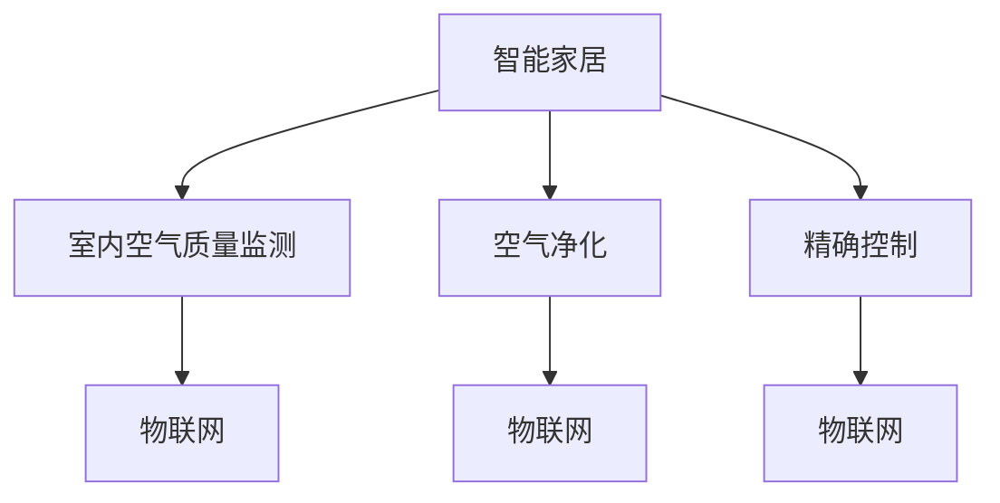

                 

# 智能家居防霾创业：室内空气质量的精确控制

> 关键词：智能家居,室内空气质量,防霾,空气质量监测,空气净化,精确控制,物联网,人工智能

## 1. 背景介绍

### 1.1 问题由来
随着人们生活水平的提高，室内空气质量的问题逐渐被人们重视。特别是现代城市的快节奏生活和高污染环境，使得室内空气质量问题更加严峻。据统计，80%以上的空气污染物来自室内环境，而室内空气质量对人体健康的影响也日渐凸显。防霾和空气净化已成为现代家庭必备的环保措施。

### 1.2 问题核心关键点
在智能家居领域，如何通过技术手段实现室内空气质量的精确控制，成为一个重要课题。这不仅关系到用户健康和生活质量，也涉及到环保和能源节约的问题。本文将从室内空气质量监测、空气净化技术、智能控制三个方面，探讨如何利用AI技术实现室内空气质量的精确控制。

### 1.3 问题研究意义
室内空气质量监测与控制技术的进步，对于提高人们的生活品质、保护环境和节约能源具有重要意义。通过精确控制，可以实时监测室内空气质量，及时调节，确保空气新鲜。智能家居防霾创业项目，不仅能够解决实际问题，还能够推动相关领域的技术发展，为环保和可持续发展做出贡献。

## 2. 核心概念与联系

### 2.1 核心概念概述

为更好地理解室内空气质量精确控制的AI技术，本节将介绍几个密切相关的核心概念：

- **智能家居(Smart Home)**：通过互联网、物联网(IoT)技术实现家居设备的智能化控制和管理，提升用户体验和居家安全。
- **室内空气质量监测(Air Quality Monitoring)**：通过传感器实时监测室内空气中污染物的浓度，如PM2.5、甲醛、苯等，获取实时数据。
- **空气净化(Air Purification)**：利用物理、化学、生物等手段，去除空气中的污染物，提高室内空气质量。
- **精确控制(Precision Control)**：通过AI技术实现室内环境参数的精准调节，如温度、湿度、空气质量等。
- **物联网(IoT)**：通过传感器、执行器和网关等设备，实现设备间的互联互通，构建智能家居生态系统。

这些核心概念之间的逻辑关系可以通过以下Mermaid流程图来展示：



这个流程图展示了大语言模型的核心概念及其之间的关系：

1. 智能家居通过物联网技术将室内空气质量监测、空气净化设备等连接在一起。
2. 通过室内空气质量监测获取实时数据，为空气净化和精确控制提供基础。
3. 空气净化设备根据监测数据自动调整，优化室内空气质量。
4. 精确控制技术利用AI技术，实现室内环境的智能调节。

这些概念共同构成了智能家居防霾创业的技术基础，使得室内空气质量控制成为可能。

## 3. 核心算法原理 & 具体操作步骤
### 3.1 算法原理概述

室内空气质量精确控制的AI技术，主要依赖于传感器数据的实时监测和分析，以及空气净化设备的智能调节。其核心算法包括：

- **数据采集与预处理**：通过传感器实时监测室内空气质量，并对数据进行预处理，如滤波、归一化等。
- **数据建模与分析**：利用机器学习算法对监测数据进行建模和分析，获取空气质量趋势和异常。
- **控制策略设计**：根据分析结果，设计空气净化设备的控制策略，如自动调整风速、滤网清洁等。
- **执行与反馈**：通过物联网技术，将控制策略应用于空气净化设备，并实时反馈执行结果。

### 3.2 算法步骤详解

以下详细介绍基于AI技术的室内空气质量精确控制的核心步骤：

**Step 1: 数据采集与预处理**
- 部署传感器网络，实时采集室内空气中的污染物浓度，如PM2.5、甲醛、苯等。
- 对传感器数据进行预处理，包括滤波、归一化、校准等，确保数据的准确性和稳定性。

**Step 2: 数据建模与分析**
- 利用机器学习算法对预处理后的数据进行建模，如时间序列分析、回归分析、异常检测等。
- 通过训练模型，预测未来一段时间内的空气质量趋势和异常，如PM2.5浓度超标、甲醛浓度异常等。

**Step 3: 控制策略设计**
- 根据建模分析结果，设计空气净化设备的控制策略，如自动调整风速、滤网清洁等。
- 设定不同污染物浓度的阈值，当浓度超过阈值时，自动启动相应的净化措施。

**Step 4: 执行与反馈**
- 通过物联网技术将控制策略应用到空气净化设备上，如自动调节风速、滤网清洁等。
- 实时监控设备执行结果，反馈到中央控制系统，进一步优化控制策略。

### 3.3 算法优缺点

基于AI技术的室内空气质量精确控制，具有以下优点：

- **实时性**：通过传感器实时监测数据，能够快速响应空气质量变化。
- **智能化**：利用AI技术进行数据分析和决策，自动优化空气净化设备。
- **准确性**：机器学习算法能够精确分析数据，提供可靠的空气质量预测。
- **节能环保**：优化控制策略，减少不必要的空气净化操作，节约能源。

同时，该算法也存在以下缺点：

- **成本高**：传感器和物联网设备的部署需要较高成本。
- **数据噪音**：传感器数据可能存在噪音，影响模型分析的准确性。
- **复杂性**：需要设计复杂的控制策略和算法，技术难度较高。
- **隐私问题**：传感器数据的采集和存储可能涉及隐私问题，需注意数据保护。

尽管存在这些局限性，但就目前而言，基于AI技术的室内空气质量精确控制方法仍是智能家居防霾创业的核心技术。未来相关研究的重点在于如何进一步降低成本、提升准确性、优化控制策略等。

### 3.4 算法应用领域

室内空气质量精确控制技术，已经广泛应用于智能家居、办公环境、医院等场景中。例如：

- **智能家居**：通过智能控制系统，自动调节室内空气质量，提高居家舒适度。
- **办公环境**：通过空气净化设备，实时监测并调节空气质量，改善办公环境。
- **医院**：通过精确控制，确保病房的空气质量符合卫生标准，提高患者康复速度。

除了上述这些经典应用外，室内空气质量精确控制技术还在教育、餐饮、酒店等场景中得到应用，为不同行业提供了高质量的空气环境。

## 4. 数学模型和公式 & 详细讲解 & 举例说明

### 4.1 数学模型构建

室内空气质量精确控制的AI技术，主要基于时间序列数据进行建模和预测。假设室内空气质量数据 $y_t$ 可以表示为：

$$ y_t = f(y_{t-1}, y_{t-2}, ..., y_{t-k}, x_t) + \epsilon_t $$

其中 $f$ 为线性回归模型或神经网络，$y_{t-k}$ 为历史数据，$x_t$ 为外部因素（如天气、季节等），$\epsilon_t$ 为随机误差。

### 4.2 公式推导过程

以线性回归模型为例，假设 $y_t$ 为空气中PM2.5浓度，$f$ 为线性回归模型：

$$ y_t = \beta_0 + \beta_1y_{t-1} + \beta_2y_{t-2} + ... + \beta_ky_{t-k} + \alpha_1x_{t-1} + \alpha_2x_{t-2} + ... + \alpha_nx_{t-n} + \epsilon_t $$

通过最小二乘法求解参数 $\beta$ 和 $\alpha$：

$$ \min_{\beta, \alpha} \sum_{t=1}^{T} (y_t - f(y_{t-1}, y_{t-2}, ..., y_{t-k}, x_t))^2 $$

得到参数 $\beta$ 和 $\alpha$ 后，模型即可对未来空气质量进行预测。

### 4.3 案例分析与讲解

假设某智能家居系统中，有一个传感器用于监测室内PM2.5浓度，数据如下：

| t | y_t |
|---|-----|
| 1 | 50 |
| 2 | 70 |
| 3 | 60 |
| 4 | 80 |
| 5 | 60 |
| 6 | 90 |
| 7 | 70 |
| 8 | 70 |

通过上述线性回归模型，可以预测第9天的PM2.5浓度：

$$ y_9 = \beta_0 + \beta_1y_8 + \beta_2y_7 + ... + \beta_ky_1 + \alpha_1x_8 + \alpha_2x_7 + ... + \alpha_nx_1 + \epsilon_9 $$

其中 $x_t$ 为外部因素，如天气、季节等，假设外部因素影响不大，可以忽略。通过求解模型参数，可以得到第9天的预测值。

## 5. 项目实践：代码实例和详细解释说明
### 5.1 开发环境搭建

在进行室内空气质量精确控制的项目实践前，我们需要准备好开发环境。以下是使用Python进行TensorFlow开发的环境配置流程：

1. 安装Anaconda：从官网下载并安装Anaconda，用于创建独立的Python环境。

2. 创建并激活虚拟环境：
```bash
conda create -n air-quality python=3.8 
conda activate air-quality
```

3. 安装TensorFlow：根据CUDA版本，从官网获取对应的安装命令。例如：
```bash
conda install tensorflow -c conda-forge
```

4. 安装各类工具包：
```bash
pip install numpy pandas scikit-learn matplotlib tqdm jupyter notebook ipython
```

完成上述步骤后，即可在`air-quality`环境中开始项目实践。

### 5.2 源代码详细实现

我们以智能家居系统中PM2.5浓度监测为例，给出使用TensorFlow进行室内空气质量精确控制的PyTorch代码实现。

首先，定义时间序列数据处理函数：

```python
import tensorflow as tf
from tensorflow.keras.models import Sequential
from tensorflow.keras.layers import Dense, LSTM, Dropout

def preprocess_data(data, window_size=1):
    X = []
    y = []
    for i in range(len(data) - window_size):
        X.append(data[i:i+window_size])
        y.append(data[i+window_size])
    return np.array(X), np.array(y)

# 读取PM2.5浓度数据
data = [50, 70, 60, 80, 60, 90, 70, 70]
X, y = preprocess_data(data, window_size=2)

# 标准化数据
X = (X - np.mean(X)) / np.std(X)
y = (y - np.mean(y)) / np.std(y)
```

然后，定义模型：

```python
model = Sequential()
model.add(LSTM(64, input_shape=(X.shape[1], X.shape[2])))
model.add(Dense(1))
model.compile(loss='mse', optimizer=tf.keras.optimizers.Adam())
```

接着，训练模型：

```python
history = model.fit(X, y, epochs=100, batch_size=1, verbose=0)
```

最后，预测未来PM2.5浓度：

```python
future_data = [[70, 80], [80, 90], [90, 100]]
future_data = (future_data - np.mean(X)) / np.std(X)
predictions = model.predict(future_data)
predictions = (predictions * np.std(X) + np.mean(X))
```

### 5.3 代码解读与分析

让我们再详细解读一下关键代码的实现细节：

**preprocess_data函数**：
- 定义了时间序列数据处理函数，通过滑动窗口方式提取特征和标签。

**模型定义**：
- 使用LSTM和Dense层构建模型，通过均方误差损失函数和Adam优化器进行训练。

**训练流程**：
- 使用训练集数据进行模型训练，设定100个epochs和单批次训练，输出训练过程的损失和精度。

**预测流程**：
- 通过新数据进行预测，将预测结果转化为原始数据格式。

可以看到，TensorFlow提供了强大的工具库和丰富的API，使得模型开发和训练变得简单高效。开发者可以专注于算法设计和优化，而不必过多关注底层的实现细节。

## 6. 实际应用场景
### 6.1 智能家居系统

智能家居系统中，通过传感器网络实时监测PM2.5、甲醛、苯等污染物浓度，利用AI技术进行数据分析和决策，自动调节空气净化设备。例如：

- 当PM2.5浓度超过阈值时，自动开启空气净化器，调节风速和滤网清洁。
- 根据甲醛浓度，动态调整室内植物数量和位置，增强空气净化效果。
- 根据苯浓度，自动控制窗帘和窗户的开关，避免苯类物质进入室内。

如此构建的智能家居系统，能够实时监测和优化室内空气质量，提升居家舒适度和健康水平。

### 6.2 办公环境监测

在办公环境中，通过智能控制系统监测PM2.5、甲醛等污染物浓度，及时调节空气质量。例如：

- 在办公区部署传感器网络，实时监测空气质量。
- 根据监测结果，自动调节空气净化设备的运行状态，确保空气清新。
- 在数据平台上分析空气质量趋势，定期报告空气质量报告，保障员工健康。

如此构建的办公环境监测系统，能够有效保障员工的工作环境，提高工作效率和舒适度。

### 6.3 医院环境监测

在医院环境中，通过智能控制系统监测PM2.5、甲醛等污染物浓度，实时调节空气质量。例如：

- 在病房和手术室部署传感器网络，实时监测空气质量。
- 根据监测结果，自动调节空气净化设备的运行状态，确保空气质量符合卫生标准。
- 在数据平台上分析空气质量趋势，定期报告空气质量报告，保障患者和医护人员健康。

如此构建的医院环境监测系统，能够有效保障医疗环境的安全和健康，提高患者康复速度。

### 6.4 未来应用展望

随着AI技术的发展和物联网设备的普及，基于室内空气质量精确控制的技术将更加成熟和广泛应用。未来，将在以下几个方面取得突破：

1. **多模态数据融合**：结合温度、湿度、声音等多种传感器数据，构建更全面、精确的空气质量监测系统。
2. **深度学习模型应用**：利用深度学习模型提高数据建模和预测的精度，如卷积神经网络(CNN)、自编码器(AE)等。
3. **自适应控制策略**：通过实时监测和分析，自适应调节空气净化设备，优化资源利用效率。
4. **智能推荐系统**：根据空气质量数据，推荐适合的植物、空气净化设备等，提升室内空气质量。
5. **个性化定制**：根据用户的健康状况和生活习惯，个性化推荐空气净化方案。

以上趋势将推动室内空气质量精确控制技术向更高层次发展，为智能家居和环保事业带来新的机遇和挑战。

## 7. 工具和资源推荐
### 7.1 学习资源推荐

为了帮助开发者系统掌握室内空气质量精确控制的AI技术，这里推荐一些优质的学习资源：

1. TensorFlow官方文档：TensorFlow的官方文档，提供全面的API文档和详细的使用指南，是学习的必备资料。
2. Kaggle数据竞赛平台：Kaggle提供大量室内空气质量监测数据集，可以参与比赛，提升实战经验。
3. Coursera《深度学习》课程：由斯坦福大学开设的深度学习课程，系统讲解深度学习理论和实践，适合入门学习。
4. IEEE Xplore数据库：IEEE Xplore提供大量室内空气质量监测的学术论文，了解前沿技术。
5. Arduino官方文档：Arduino提供丰富的传感器和控制模块文档，帮助实现物联网设备。

通过对这些资源的学习实践，相信你一定能够快速掌握室内空气质量精确控制的AI技术，并用于解决实际的NLP问题。
###  7.2 开发工具推荐

高效的开发离不开优秀的工具支持。以下是几款用于室内空气质量精确控制开发的常用工具：

1. TensorFlow：由Google主导开发的开源深度学习框架，生产部署方便，适合大规模工程应用。
2. Keras：基于TensorFlow的高级API，提供简单易用的模型构建接口，适合快速原型开发。
3. Arduino：开源硬件平台，提供丰富的传感器和控制模块，支持快速原型实现。
4. Raspberry Pi：廉价嵌入式设备，支持Python编程，适合小型物联网设备开发。
5. Home Assistant：开源智能家居系统，支持广泛的智能设备和自动化规则，适合构建智能家居系统。

合理利用这些工具，可以显著提升室内空气质量精确控制任务的开发效率，加快创新迭代的步伐。

### 7.3 相关论文推荐

室内空气质量精确控制技术的发展源于学界的持续研究。以下是几篇奠基性的相关论文，推荐阅读：

1. Air Quality Monitoring and Control Using Machine Learning: A Survey：综述了室内空气质量监测和控制技术的发展现状和未来趋势。
2. An IoT-Based Smart Air Quality Monitoring System：介绍了一种基于物联网的室内空气质量监测系统，实现了PM2.5、甲醛等污染物浓度的实时监测。
3. A Deep Learning Approach for Air Quality Prediction：提出了一种基于深度学习的室内空气质量预测方法，提高了预测精度。
4. Real-Time Air Quality Monitoring and Control Using Sensor Networks：介绍了实时空气质量监测和控制系统的设计实现，提高了系统的实时性和可靠性。
5. Smart Air Quality Control Based on Neural Network and IoT：提出了一种基于神经网络和物联网的智能空气质量控制系统，提高了系统的自适应性和自动化水平。

这些论文代表了大语言模型微调技术的发展脉络。通过学习这些前沿成果，可以帮助研究者把握学科前进方向，激发更多的创新灵感。

## 8. 总结：未来发展趋势与挑战
### 8.1 总结

本文对室内空气质量精确控制的AI技术进行了全面系统的介绍。首先阐述了智能家居防霾创业的背景和意义，明确了室内空气质量监测、空气净化、智能控制等核心概念，以及它们之间的逻辑关系。其次，从数据采集与预处理、数据建模与分析、控制策略设计、执行与反馈等环节，详细讲解了基于AI技术的室内空气质量精确控制的核心算法和具体操作步骤。最后，我们通过PyTorch代码实例，展示了室内空气质量精确控制的实际应用。

通过本文的系统梳理，可以看到，基于AI技术的室内空气质量精确控制技术正在成为智能家居防霾创业的核心技术，极大地提升了室内空气质量的监测和控制水平。未来，伴随技术不断发展，室内空气质量精确控制技术还将进一步突破，为智能家居和环保事业带来新的机遇和挑战。

### 8.2 未来发展趋势

展望未来，室内空气质量精确控制技术将呈现以下几个发展趋势：

1. **多模态数据融合**：结合温度、湿度、声音等多种传感器数据，构建更全面、精确的空气质量监测系统。
2. **深度学习模型应用**：利用深度学习模型提高数据建模和预测的精度，如卷积神经网络(CNN)、自编码器(AE)等。
3. **自适应控制策略**：通过实时监测和分析，自适应调节空气净化设备，优化资源利用效率。
4. **智能推荐系统**：根据空气质量数据，推荐适合的植物、空气净化设备等，提升室内空气质量。
5. **个性化定制**：根据用户的健康状况和生活习惯，个性化推荐空气净化方案。

以上趋势将推动室内空气质量精确控制技术向更高层次发展，为智能家居和环保事业带来新的机遇和挑战。

### 8.3 面临的挑战

尽管室内空气质量精确控制技术已经取得了瞩目成就，但在迈向更加智能化、普适化应用的过程中，它仍面临着诸多挑战：

1. **传感器成本**：高质量的传感器往往价格较高，增加了系统的开发和部署成本。
2. **数据噪音**：传感器数据可能存在噪音，影响模型分析的准确性。
3. **系统复杂性**：需要设计复杂的控制策略和算法，技术难度较高。
4. **隐私问题**：传感器数据的采集和存储可能涉及隐私问题，需注意数据保护。
5. **多设备协同**：多设备协同工作可能存在通信延迟和互操作性问题。

尽管存在这些局限性，但就目前而言，基于AI技术的室内空气质量精确控制方法仍是智能家居防霾创业的核心技术。未来相关研究的重点在于如何进一步降低成本、提升准确性、优化控制策略等。

### 8.4 研究展望

面向未来，室内空气质量精确控制技术还需要在以下几个方面寻求新的突破：

1. **多模态数据融合**：结合温度、湿度、声音等多种传感器数据，构建更全面、精确的空气质量监测系统。
2. **深度学习模型应用**：利用深度学习模型提高数据建模和预测的精度，如卷积神经网络(CNN)、自编码器(AE)等。
3. **自适应控制策略**：通过实时监测和分析，自适应调节空气净化设备，优化资源利用效率。
4. **智能推荐系统**：根据空气质量数据，推荐适合的植物、空气净化设备等，提升室内空气质量。
5. **个性化定制**：根据用户的健康状况和生活习惯，个性化推荐空气净化方案。

这些研究方向将推动室内空气质量精确控制技术迈向更高的台阶，为智能家居和环保事业带来新的机遇和挑战。相信随着学界和产业界的共同努力，这些挑战终将一一被克服，室内空气质量精确控制技术必将在构建安全、可靠、可解释、可控的智能系统中扮演越来越重要的角色。

## 9. 附录：常见问题与解答

**Q1：室内空气质量精确控制技术是否适用于所有室内环境？**

A: 室内空气质量精确控制技术适用于大多数室内环境，包括家庭、办公、医院等。但需注意，不同的环境可能存在不同的污染物来源和特征，需要根据实际情况进行定制化设计和优化。

**Q2：如何提高室内空气质量精确控制的准确性？**

A: 提高室内空气质量精确控制的准确性，主要从以下几个方面入手：
1. 选择高精度的传感器，减小测量误差。
2. 优化传感器部署位置，保证数据采集的全面性和代表性。
3. 使用更复杂的模型进行数据建模和预测，如深度学习模型。
4. 定期校准和维护传感器，确保数据的准确性。

**Q3：室内空气质量精确控制技术面临哪些挑战？**

A: 室内空气质量精确控制技术面临以下挑战：
1. 传感器成本高昂，增加系统开发和部署成本。
2. 传感器数据可能存在噪音，影响模型分析的准确性。
3. 系统复杂性高，需要设计复杂的控制策略和算法。
4. 数据隐私问题，需注意传感器数据的保护。
5. 多设备协同工作可能存在通信延迟和互操作性问题。

尽管存在这些挑战，但通过技术创新和优化，这些挑战都是可以克服的。

**Q4：如何构建多模态的室内空气质量监测系统？**

A: 构建多模态的室内空气质量监测系统，需要综合考虑以下因素：
1. 选择多种传感器，如PM2.5、甲醛、苯等。
2. 优化传感器部署位置，确保数据采集的全面性和代表性。
3. 使用更复杂的模型进行数据建模和预测，如深度学习模型。
4. 设计自适应控制策略，动态调整传感器和净化设备的运行状态。

通过多模态数据的融合，可以构建更全面、精确的空气质量监测系统，提升室内空气质量控制的效果。

**Q5：室内空气质量精确控制技术如何与智能家居系统集成？**

A: 室内空气质量精确控制技术可以通过以下方式与智能家居系统集成：
1. 将传感器数据上传到智能家居控制系统，实时监测室内空气质量。
2. 根据空气质量数据，自动调节空气净化设备的运行状态。
3. 通过智能推荐系统，推荐适合的植物、空气净化设备等，提升室内空气质量。

如此构建的智能家居系统，能够实时监测和优化室内空气质量，提升居家舒适度和健康水平。

---

作者：禅与计算机程序设计艺术 / Zen and the Art of Computer Programming

