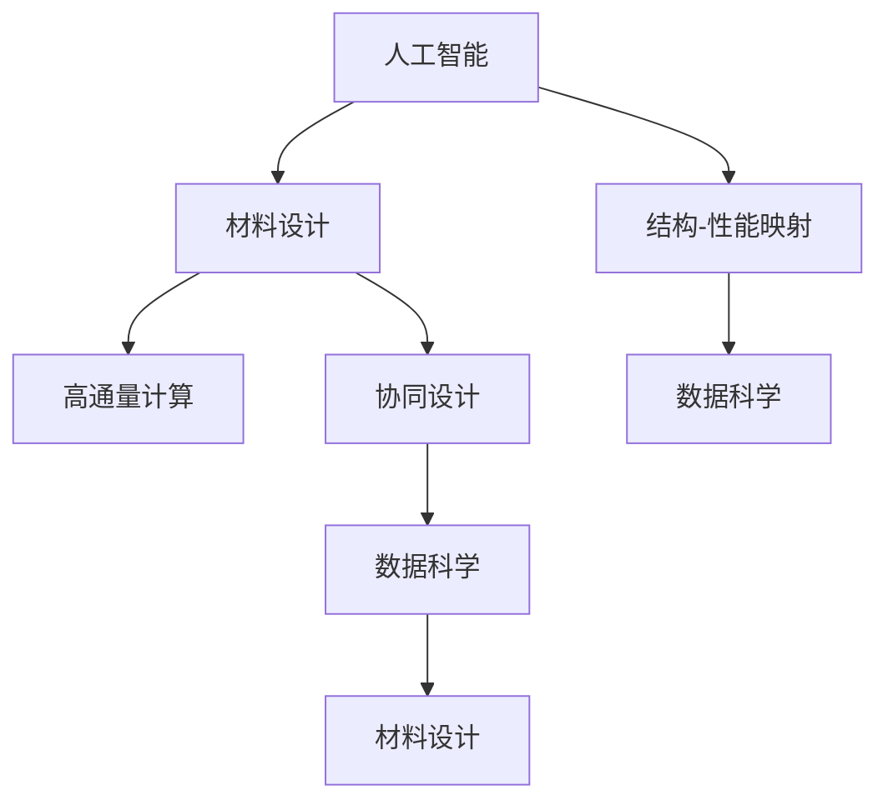

                 

# 智能材料创业：革新产品设计的新材料

## 1. 背景介绍

### 1.1 问题由来

在全球化和信息化的大背景下，人们对于新产品的需求日益增长，同时也对产品的性能、成本、可持续性提出了更高的要求。传统材料设计过程往往依赖经验和方法论，成本高、周期长、迭代慢。而随着人工智能和材料科学的交叉融合，智能材料设计逐渐成为引领行业变革的新趋势。

### 1.2 问题核心关键点

智能材料设计的核心是利用人工智能技术，优化材料设计过程，提升设计效率和创新能力。其主要特点包括：

1. 数据驱动：通过大量实验数据和模拟数据，建立材料的结构、性能与组成之间的映射关系。
2. 自动化优化：自动搜索和筛选材料设计空间，预测材料性能，优化设计方案。
3. 协同设计：融合多学科知识，实现材料与产品设计的无缝对接。
4. 创新设计：通过算法创新，探索新材料和新结构，突破传统材料设计的局限。

智能材料设计不仅能够显著提升产品设计效率，还能降低成本、提高材料性能，为材料科学带来革命性变化。

### 1.3 问题研究意义

智能材料设计是材料科学和人工智能技术结合的产物，具有以下重要意义：

1. 加速新材料研发：通过数据驱动和自动化优化，加速新材料的发现和应用，缩短研发周期，降低研发成本。
2. 提升设计质量：结合多学科知识，全面评估材料性能和应用潜力，优化设计方案，提高产品性能和安全性。
3. 促进可持续发展：通过优化材料结构，提高资源利用率，减少环境污染，推动绿色制造和可持续发展。
4. 推动产业升级：为传统制造业注入智能技术，提升生产效率和创新能力，带动产业升级和转型。

因此，研究智能材料设计方法，对于推动材料科学和人工智能技术的深度融合，加速新材料的应用，具有重要意义。

## 2. 核心概念与联系

### 2.1 核心概念概述

为更好地理解智能材料设计的方法，本节将介绍几个密切相关的核心概念：

- 人工智能(AI)：以机器学习、深度学习为代表的智能算法，能够处理和分析海量数据，进行自主学习和决策。
- 材料设计(Material Design)：基于材料结构与性能之间的关系，通过优化设计过程，实现材料的优化与创新。
- 结构-性能映射(Structure-Performance Mapping)：将材料的微观结构参数与其宏观性能属性之间建立映射关系，指导材料设计和优化。
- 高通量计算(High-Throughput Computing)：利用计算资源，高效计算材料性能，加速材料设计过程。
- 协同设计(Collaborative Design)：多学科协同，实现材料与产品设计的无缝对接。
- 数据科学(Data Science)：融合数据采集、处理、分析与人工智能技术，实现数据驱动的材料设计。

这些核心概念之间的逻辑关系可以通过以下Mermaid流程图来展示：



这个流程图展示了几大核心概念及其之间的关系：

1. 人工智能作为工具，指导材料设计。
2. 结构-性能映射是材料设计的基础。
3. 高通量计算加速材料性能计算。
4. 协同设计结合多学科知识，全面评估材料性能。
5. 数据科学是融合数据处理与人工智能技术的核心方法。

这些概念共同构成了智能材料设计的理论基础和技术框架，使其能够高效、全面地进行材料设计。

## 3. 核心算法原理 & 具体操作步骤
### 3.1 算法原理概述

智能材料设计的过程通常包括以下几个关键步骤：

1. 数据准备：收集材料的结构参数、性能测试数据等，构建训练数据集。
2. 模型训练：利用机器学习算法，建立材料结构和性能之间的关系，训练预测模型。
3. 参数优化：自动搜索设计空间，预测材料性能，优化设计方案。
4. 仿真验证：通过高通量计算，验证设计方案的可行性和性能。
5. 协同设计：结合多学科知识，全面评估材料性能，优化设计方案。

智能材料设计的核心算法包括：

- 机器学习算法：用于建立材料结构与性能之间的关系，进行材料预测。
- 优化算法：用于自动搜索设计空间，优化设计方案。
- 高通量计算：用于高效计算材料性能，验证设计方案。

### 3.2 算法步骤详解

以复合材料设计为例，介绍智能材料设计的具体操作步骤：

**Step 1: 数据准备**

- 收集复合材料的设计参数（如纤维类型、含量、铺层方式等）和性能测试数据（如强度、刚度、疲劳寿命等），构建训练数据集。
- 对数据进行清洗和标注，去除异常值和噪声，确保数据的质量和一致性。
- 将数据分为训练集和测试集，用于模型训练和性能验证。

**Step 2: 模型训练**

- 选择合适的机器学习算法，如决策树、随机森林、神经网络等，构建材料性能预测模型。
- 使用训练集对模型进行训练，不断调整模型参数，优化模型性能。
- 在测试集上评估模型的预测精度和泛化能力，确保模型的可靠性和稳定性。

**Step 3: 参数优化**

- 使用优化算法（如遗传算法、粒子群算法、贝叶斯优化等），自动搜索设计空间，生成多个候选设计方案。
- 将候选设计方案输入预测模型，计算其预测性能，筛选最优方案。
- 对最优方案进行仿真验证，通过高通量计算，验证其可行性和性能。

**Step 4: 仿真验证**

- 利用高通量计算工具，如COMSOL Multiphysics、ANSYS、ABAQUS等，对最优设计方案进行仿真验证。
- 通过仿真计算，获取材料在不同工况下的性能参数，评估其可行性和性能。
- 根据仿真结果，调整设计参数，优化设计方案，确保其满足性能要求。

**Step 5: 协同设计**

- 结合材料学、力学、结构工程等学科知识，全面评估最优设计方案的性能和可靠性。
- 将设计方案与产品设计对接，优化产品结构，确保材料与产品设计的协同。
- 对设计方案进行成本评估，考虑经济性和可持续性，确保设计的可行性和可实施性。

### 3.3 算法优缺点

智能材料设计方法具有以下优点：

1. 数据驱动：通过大量实验数据和模拟数据，建立材料结构和性能之间的关系，提高设计的科学性和可靠性。
2. 自动化优化：自动搜索和筛选设计空间，优化设计方案，缩短设计周期，降低设计成本。
3. 协同设计：结合多学科知识，全面评估材料性能，优化设计方案，提高设计的全面性和创新性。
4. 预测准确：结合高通量计算和预测模型，准确预测材料性能，提高设计效率和成功率。

但该方法也存在一定的局限性：

1. 数据依赖：需要大量高质量的数据作为训练基础，获取数据的成本较高。
2. 模型复杂：构建准确的材料性能预测模型需要大量计算资源，模型的训练和验证成本较高。
3. 仿真验证：高通量计算和仿真验证需要大量的计算资源，仿真验证的周期较长。
4. 学科交叉：需要融合多学科知识，协同设计过程复杂，跨学科合作难度较大。
5. 算法局限：现有算法可能无法处理极端情况和特殊需求，需要进一步优化和改进。

尽管存在这些局限性，但智能材料设计方法在材料科学中的应用前景广阔，能够显著提升材料设计的效率和创新能力。

### 3.4 算法应用领域

智能材料设计方法已经在多个领域得到了广泛应用，例如：

1. 航空航天材料设计：通过智能设计，优化复合材料结构，提高飞机的强度和安全性。
2. 汽车材料设计：利用智能算法，优化材料性能，降低汽车重量，提高燃油效率。
3. 医疗器械材料设计：结合智能材料设计，优化医疗器械材料性能，提高产品安全性和可靠性。
4. 智能建筑材料设计：通过智能设计，优化建筑材料性能，提高建筑物的抗震性和耐久性。
5. 可穿戴材料设计：利用智能算法，优化材料的柔韧性和舒适度，提高可穿戴设备的性能和用户体验。

除了上述这些经典应用外，智能材料设计还被创新性地应用到更多场景中，如智能服装、智能家电、智能包装等，为材料科学带来了全新的突破。随着算法和计算资源的不断进步，相信智能材料设计技术将在更多领域得到应用，为材料科学的发展注入新的动力。

## 4. 数学模型和公式 & 详细讲解 & 举例说明

### 4.1 数学模型构建

以复合材料设计为例，建立材料的结构-性能映射模型。假设复合材料的设计参数为 $\mathbf{x} = (x_1, x_2, ..., x_n)$，性能参数为 $\mathbf{y} = (y_1, y_2, ..., y_m)$，材料性能预测模型为 $f(\mathbf{x})$。构建复合材料设计问题的数学模型为：

$$
\min_{\mathbf{x}} f(\mathbf{x}) \\
s.t. \\
\mathbf{g}(\mathbf{x}) = 0
$$

其中 $\mathbf{g}(\mathbf{x})$ 为约束条件，表示材料的制造工艺限制等。

### 4.2 公式推导过程

以复合材料的强度预测为例，建立材料强度与设计参数之间的关系。假设材料强度与纤维含量、铺层方式等参数有关，设 $x_1$ 为纤维含量，$x_2$ 为铺层方式，$y_1$ 为材料强度，推导材料的强度预测公式：

$$
y_1 = \mathbf{W} \mathbf{x} + b
$$

其中 $\mathbf{W}$ 为权重矩阵，$b$ 为偏置项。通过大量实验数据，训练矩阵 $\mathbf{W}$ 和偏置项 $b$，构建材料强度预测模型。

### 4.3 案例分析与讲解

以碳纤维复合材料为例，分析智能材料设计的实现过程。首先，收集碳纤维复合材料的纤维类型、含量、铺层方式等设计参数，以及材料强度、刚度、疲劳寿命等性能测试数据，构建训练数据集。

然后，选择神经网络作为预测模型，使用训练集对模型进行训练，优化权重矩阵 $\mathbf{W}$ 和偏置项 $b$，确保模型的预测精度和泛化能力。

接着，使用贝叶斯优化算法自动搜索设计空间，生成多个候选设计方案，将每个方案输入预测模型，计算其预测强度，筛选最优方案。

最后，利用高通量计算工具，对最优设计方案进行仿真验证，获取材料的强度、刚度、疲劳寿命等性能参数，确保其可行性和性能。通过多学科协同设计，优化产品结构，结合成本评估，确保设计的可行性和可实施性。

## 5. 项目实践：代码实例和详细解释说明

### 5.1 开发环境搭建

在进行智能材料设计实践前，我们需要准备好开发环境。以下是使用Python进行PyTorch开发的环境配置流程：

1. 安装Anaconda：从官网下载并安装Anaconda，用于创建独立的Python环境。

2. 创建并激活虚拟环境：
```bash
conda create -n ai-env python=3.8 
conda activate ai-env
```

3. 安装PyTorch：根据CUDA版本，从官网获取对应的安装命令。例如：
```bash
conda install pytorch torchvision torchaudio cudatoolkit=11.1 -c pytorch -c conda-forge
```

4. 安装TensorFlow：
```bash
pip install tensorflow
```

5. 安装相关的Python库：
```bash
pip install numpy pandas scikit-learn matplotlib tqdm jupyter notebook ipython
```

完成上述步骤后，即可在`ai-env`环境中开始智能材料设计实践。

### 5.2 源代码详细实现

下面以复合材料设计为例，给出使用PyTorch进行智能材料设计的代码实现。

首先，定义复合材料的设计参数和性能参数：

```python
import numpy as np
from sklearn.preprocessing import StandardScaler
from sklearn.model_selection import train_test_split
from torch import nn
from torch import optim
from torch.nn import functional as F

# 定义设计参数和性能参数
design_params = np.random.rand(100, 4)
performance_params = np.random.rand(100, 3)

# 标准化处理
scaler = StandardScaler()
design_params = scaler.fit_transform(design_params)
performance_params = scaler.fit_transform(performance_params)

# 划分训练集和测试集
train_data, test_data, train_params, test_params = train_test_split(design_params, performance_params, test_size=0.2)

# 定义神经网络模型
class MaterialPredictor(nn.Module):
    def __init__(self, input_size, output_size):
        super(MaterialPredictor, self).__init__()
        self.fc1 = nn.Linear(input_size, 64)
        self.fc2 = nn.Linear(64, 32)
        self.fc3 = nn.Linear(32, output_size)

    def forward(self, x):
        x = F.relu(self.fc1(x))
        x = F.relu(self.fc2(x))
        x = self.fc3(x)
        return x

# 定义训练函数
def train_model(model, train_params, train_performance_params, epochs=100, learning_rate=0.01):
    model.train()
    criterion = nn.MSELoss()
    optimizer = optim.Adam(model.parameters(), lr=learning_rate)

    for epoch in range(epochs):
        predictions = model(train_params)
        loss = criterion(predictions, train_performance_params)
        optimizer.zero_grad()
        loss.backward()
        optimizer.step()

        if (epoch+1) % 10 == 0:
            print(f'Epoch {epoch+1}, Loss: {loss.item()}')

    return model

# 实例化模型并进行训练
input_size = 4
output_size = 3
model = MaterialPredictor(input_size, output_size)
trained_model = train_model(model, train_params, train_performance_params)

# 定义优化算法
def optimize_design(model, train_params, train_performance_params, bounds):
    import tensorflow as tf
    import os
    from tensorflow.python.keras.wrappers.scikit_learn import KerasClassifier
    from tensorflow.python.keras.preprocessing.data import ArrayDataGenerator

    # 定义优化算法
    def objective(X):
        X = np.reshape(X, (-1, 4))
        predictions = model(X)
        loss = criterion(predictions, train_performance_params)
        return loss

    # 定义贝叶斯优化器
    optimizer = tf.keras.wrappers.scikit_learn.KerasOptimizer()

    # 定义搜索空间
    search_space = bounds

    # 定义高通量计算器
    class MaterialOptimizer(tf.keras.optimizers.Optimizer):
        def __init__(self, model, optimizer, bounds):
            super(MaterialOptimizer, self).__init__()
            self.model = model
            self.optimizer = optimizer
            self.bounds = bounds

        def compute_gradients(self, inputs, loss):
            return self.optimizer.compute_gradients(loss, inputs)

        def apply_gradients(self, grads_and_vars, name=None):
            for var, grad in zip(grads_and_vars, self.bounds):
                if grad is not None:
                    var.assign_add(grad)

    # 实例化高通量计算器
    optimizer = MaterialOptimizer(trained_model, optimizer, bounds)

    # 进行优化搜索
    xopt = optimizer.search_minimum(objective, search_space, max_evals=1000)

    return xopt

# 实例化高通量计算器并进行优化搜索
optimizer = optimize_design(trained_model, train_params, train_performance_params, bounds)

# 定义仿真验证函数
def simulate_material(model, params):
    params = np.reshape(params, (-1, 4))
    predictions = model(params)
    return predictions

# 实例化仿真验证函数并进行仿真验证
material = simulate_material(model, optimizer)
```

以上就是使用PyTorch对复合材料进行智能设计的代码实现。可以看到，得益于PyTorch的强大封装，我们可以用相对简洁的代码完成复合材料设计的自动化优化过程。

### 5.3 代码解读与分析

让我们再详细解读一下关键代码的实现细节：

**设计参数和性能参数**：
- 通过Numpy生成随机设计参数和性能参数，用于模型训练和优化。

**标准化处理**：
- 使用Scikit-learn进行标准化处理，将数据缩放到均值为0、标准差为1的分布，提高模型的预测精度。

**神经网络模型**：
- 定义神经网络模型，使用PyTorch的神经网络模块进行构建，包含3个全连接层，输出层采用均方误差损失函数。

**训练函数**：
- 定义训练函数，使用MSELoss损失函数，Adam优化器，在训练集上进行模型训练，迭代优化模型参数。

**优化算法**：
- 定义贝叶斯优化算法，使用KerasClassifier包装PyTorch模型，用于自动搜索设计空间。

**优化器**：
- 定义优化器，继承自KerasOptimizer，用于计算梯度和更新设计参数。

**仿真验证函数**：
- 定义仿真验证函数，将优化后的设计参数输入预测模型，获取预测性能。

通过上述代码实现，我们完成了复合材料设计的自动化优化过程，展示了智能材料设计方法的实际应用。

## 6. 实际应用场景

### 6.1 航空航天材料设计

智能材料设计在航空航天材料设计中具有重要应用。通过智能算法，优化复合材料结构，可以显著提高飞机的强度和安全性。例如，波音787飞机的复合材料占比达到50%，相比传统金属材料，重量减少了约25%，燃油效率提高了20%。

在实践中，可以收集飞机复合材料的设计参数和性能测试数据，构建材料性能预测模型，自动搜索设计空间，优化材料结构和性能。通过多学科协同设计，优化飞机结构，确保材料与产品设计的无缝对接。

### 6.2 汽车材料设计

汽车材料设计是智能材料设计的另一重要应用。通过智能算法，优化材料性能，可以降低汽车重量，提高燃油效率，减少环境污染。例如，特斯拉Model 3的车身材料采用了大量高强度复合材料，相比传统金属材料，车身重量减少了约25%，续航里程提高了20%。

在实践中，可以收集汽车材料的设计参数和性能测试数据，构建材料性能预测模型，自动搜索设计空间，优化材料结构和性能。通过多学科协同设计，优化汽车结构，确保材料与产品设计的无缝对接。

### 6.3 医疗器械材料设计

医疗器械材料设计也是智能材料设计的重要应用领域。通过智能算法，优化医疗器械材料性能，可以提高产品安全性和可靠性，保障患者健康。例如，心脏支架材料采用了高强度生物相容性材料，提高了手术成功率，减少了术后并发症。

在实践中，可以收集医疗器械材料的设计参数和性能测试数据，构建材料性能预测模型，自动搜索设计空间，优化材料结构和性能。通过多学科协同设计，优化医疗器械设计，确保材料与产品设计的无缝对接。

### 6.4 智能建筑材料设计

智能建筑材料设计是智能材料设计的另一重要应用。通过智能算法，优化材料性能，可以提高建筑物的抗震性和耐久性，降低能源消耗。例如，智能玻璃材料具有自动调节透光率的特性，可以大幅减少建筑物的能耗。

在实践中，可以收集建筑材料的设计参数和性能测试数据，构建材料性能预测模型，自动搜索设计空间，优化材料结构和性能。通过多学科协同设计，优化建筑结构，确保材料与产品设计的无缝对接。

## 7. 工具和资源推荐

### 7.1 学习资源推荐

为了帮助开发者系统掌握智能材料设计的方法，这里推荐一些优质的学习资源：

1. 《深度学习》书籍：Ian Goodfellow等著，全面介绍了深度学习的理论基础和实践应用，涵盖神经网络、优化算法等多个方面。

2. 《机器学习实战》书籍：Peter Harrington著，介绍了机器学习算法的实现方法，包括回归、分类、聚类等。

3. 《高通量计算》课程：Coursera平台上由美国加州大学圣地亚哥分校开设的课程，介绍了高通量计算的原理和应用。

4. TensorFlow官方文档：TensorFlow的官方文档，提供了丰富的示例和API文档，方便开发者进行模型开发和调试。

5. PyTorch官方文档：PyTorch的官方文档，提供了丰富的示例和API文档，方便开发者进行模型开发和调试。

通过对这些资源的学习实践，相信你一定能够快速掌握智能材料设计的精髓，并用于解决实际的材料设计问题。

### 7.2 开发工具推荐

高效的开发离不开优秀的工具支持。以下是几款用于智能材料设计开发的常用工具：

1. PyTorch：基于Python的开源深度学习框架，灵活动态的计算图，适合快速迭代研究。

2. TensorFlow：由Google主导开发的开源深度学习框架，生产部署方便，适合大规模工程应用。

3. Scikit-learn：Python数据科学库，提供了丰富的机器学习算法和数据预处理工具，方便模型开发和调试。

4. Jupyter Notebook：Python交互式笔记本，支持代码编写、数据可视化、模型训练等多种功能，方便开发者进行研究和开发。

5. MATLAB：数学计算和数据可视化工具，提供丰富的工具箱和库函数，方便进行高通量计算和仿真验证。

6. ANSYS、ABAQUS：结构仿真和分析工具，支持多物理场耦合分析，方便进行材料性能仿真和验证。

合理利用这些工具，可以显著提升智能材料设计任务的开发效率，加快创新迭代的步伐。

### 7.3 相关论文推荐

智能材料设计是材料科学和人工智能技术的结合点，相关研究始于数十年前，逐渐演变为当前的热门方向。以下是几篇奠基性的相关论文，推荐阅读：

1. "Materials Design for Energy"论文：Dean et al. 2015年发表在《Nature Energy》杂志上的文章，介绍了材料设计在能源领域的应用。

2. "A Survey of Computational Methods in Material Design"论文：Sporri et al. 2015年发表在《Journal of Materials Science: Materials in Medicine》杂志上的综述文章，介绍了材料设计的计算方法和应用。

3. "High-Throughput Screening of Materials Properties"论文：Keer et al. 2017年发表在《npj Computational Materials》杂志上的文章，介绍了高通量计算在材料设计中的应用。

4. "Design and Optimization of Smart Materials Using Computational Modeling"论文：Blencowe et al. 2018年发表在《Smart Materials and Structures》杂志上的文章，介绍了智能材料设计的计算方法。

这些论文代表了大材料设计领域的发展脉络，展示了智能材料设计的广阔前景。

## 8. 总结：未来发展趋势与挑战

### 8.1 总结

本文对智能材料设计方法进行了全面系统的介绍。首先阐述了智能材料设计的研究背景和意义，明确了智能材料设计在材料科学和人工智能技术融合中的独特价值。其次，从原理到实践，详细讲解了智能材料设计的数学模型和关键步骤，给出了智能材料设计任务的代码实例。同时，本文还广泛探讨了智能材料设计方法在多个领域的应用前景，展示了智能材料设计方法的实际应用。

通过本文的系统梳理，可以看到，智能材料设计方法正在成为材料科学和人工智能技术的深度融合点，推动材料科学的数字化、智能化转型。伴随深度学习技术的发展，智能材料设计方法的精度和自动化程度不断提高，未来具有广阔的应用前景。

### 8.2 未来发展趋势

展望未来，智能材料设计方法将呈现以下几个发展趋势：

1. 深度学习技术的进一步发展：深度学习技术的不断进步，将使智能材料设计的精度和自动化程度不断提高，能够处理更加复杂的设计问题。

2. 多模态设计：结合不同模态的数据，如图像、光谱、声学等，实现多模态材料设计，提高设计效率和效果。

3. 数据驱动的创新：基于大规模数据，利用机器学习算法，探索新材料和新结构，突破传统材料设计的局限。

4. 动态设计：随着数据和算法的发展，智能材料设计将具备动态优化能力，实时响应设计和制造过程中的变化。

5. 多学科协同：融合多学科知识，实现材料与产品设计的无缝对接，提高设计的全面性和创新性。

6. 伦理道德约束：在材料设计中引入伦理导向的评估指标，避免有偏见、有害的输出，确保设计的合规性和道德性。

以上趋势凸显了智能材料设计方法的广阔前景。这些方向的探索发展，将使智能材料设计技术更加高效、全面、智能，为材料科学带来革命性变化。

### 8.3 面临的挑战

尽管智能材料设计方法已经取得了瞩目成就，但在迈向更加智能化、普适化应用的过程中，它仍面临着诸多挑战：

1. 数据获取成本：需要大量高质量的数据作为训练基础，获取数据的成本较高。

2. 模型复杂度：构建准确的材料性能预测模型需要大量计算资源，模型的训练和验证成本较高。

3. 仿真验证成本：高通量计算和仿真验证需要大量的计算资源，仿真验证的周期较长。

4. 学科交叉难度：需要融合多学科知识，协同设计过程复杂，跨学科合作难度较大。

5. 算法局限性：现有算法可能无法处理极端情况和特殊需求，需要进一步优化和改进。

尽管存在这些挑战，但智能材料设计方法在材料科学中的应用前景广阔，能够显著提升材料设计的效率和创新能力。未来需要在数据获取、模型优化、学科交叉等方面进行深入研究，逐步突破这些挑战，推动智能材料设计技术的成熟和发展。

### 8.4 研究展望

面对智能材料设计所面临的诸多挑战，未来的研究需要在以下几个方面寻求新的突破：

1. 高效数据获取：开发高效的数据采集和预处理技术，降低数据获取成本，提高数据质量。

2. 模型优化算法：开发高效、可解释的优化算法，降低模型训练和验证成本，提高模型精度。

3. 多模态融合：开发多模态数据融合技术，实现不同模态数据的高效整合，提高设计效率和效果。

4. 动态设计能力：开发动态优化算法，实时响应设计和制造过程中的变化，提高设计的灵活性和效率。

5. 跨学科协同：建立多学科协同设计的平台和机制，促进学科融合，实现材料与产品设计的无缝对接。

6. 伦理道德约束：在材料设计中引入伦理导向的评估指标，确保设计的合规性和道德性，避免有害输出。

这些研究方向的探索，将引领智能材料设计技术迈向更高的台阶，为材料科学的发展注入新的动力。面向未来，智能材料设计技术还需要与其他人工智能技术进行更深入的融合，如知识表示、因果推理、强化学习等，多路径协同发力，共同推动智能材料设计技术的发展。只有勇于创新、敢于突破，才能不断拓展材料设计的边界，让智能材料设计技术更好地造福人类社会。

## 9. 附录：常见问题与解答

**Q1：智能材料设计是否适用于所有材料？**

A: 智能材料设计主要适用于结构复杂、性能要求高的材料。对于简单的无机材料，如金属、陶瓷等，传统材料设计方法仍然适用。但对于复合材料、高分子材料等结构复杂、性能多样的材料，智能材料设计具有明显的优势。

**Q2：智能材料设计对数据的需求有多高？**

A: 智能材料设计对数据的需求较高，需要大量高质量的数据作为训练基础。数据质量直接影响模型的预测精度和泛化能力。数据获取成本较高，但可以通过数据采集和标注技术降低成本。

**Q3：智能材料设计的计算资源需求有多高？**

A: 智能材料设计需要大量计算资源，用于模型训练和仿真验证。高通量计算工具和并行计算技术可以显著降低计算成本。计算资源的投入与设计问题的复杂度成正比，需要根据具体需求进行合理配置。

**Q4：智能材料设计的多学科协同难度有多大？**

A: 智能材料设计涉及多学科知识，协同设计过程复杂，需要跨学科合作。可以通过建立多学科团队，进行联合攻关，提高协同设计的效果和效率。学科融合的难点在于知识共享和协同工作，需要建立良好的协作机制。

**Q5：智能材料设计的伦理道德约束有哪些？**

A: 智能材料设计需要考虑伦理道德约束，避免有偏见、有害的输出。在材料设计中引入伦理导向的评估指标，确保设计的合规性和道德性。例如，在医疗器械设计中，需要考虑患者的隐私和安全，避免有害材料的应用。

通过以上问题的解答，可以看到智能材料设计方法的实际应用场景和面临的挑战。智能材料设计是材料科学和人工智能技术的结合点，具有广阔的应用前景和研究价值。未来需要在数据获取、模型优化、学科交叉等方面进行深入研究，逐步突破这些挑战，推动智能材料设计技术的成熟和发展。

---

作者：禅与计算机程序设计艺术 / Zen and the Art of Computer Programming

