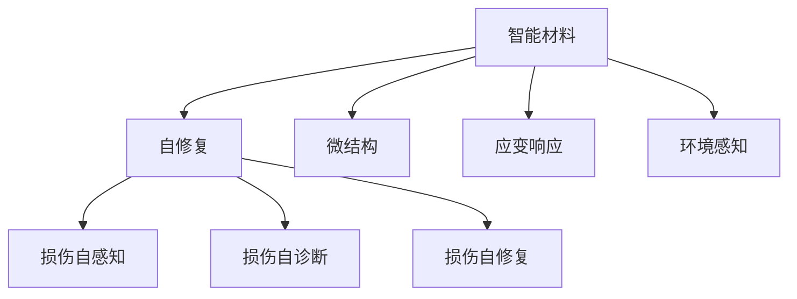

                 

# 智能材料在自修复技术中的应用：延长产品寿命

## 1. 背景介绍

### 1.1 问题由来

随着科技的进步和工业的发展，产品设计和制造的复杂性日益增加。然而，传统材料和制造工艺在应对产品寿命的挑战方面显得力不从心。如何实现产品的自修复，延长其使用寿命，成为制造业面临的一个重要问题。

### 1.2 问题核心关键点

实现产品自修复的关键在于材料的选择和设计。智能材料是一种能够感知环境变化并自动调整其性能的材料，其在自修复技术中的应用，为延长产品寿命提供了新的可能性。

### 1.3 问题研究意义

智能材料在自修复技术中的应用，不仅能够显著提升产品的耐用性和可靠性，还能降低维护成本，提升生产效率。这对于制造业的可持续发展具有重要意义。

## 2. 核心概念与联系

### 2.1 核心概念概述

为更好地理解智能材料在自修复技术中的应用，本节将介绍几个密切相关的核心概念：

- 智能材料(Smart Materials)：指能够感知环境变化并自动调整其性能的材料，如形状记忆合金、压电材料、智能复合材料等。这些材料在自修复技术中的应用，为产品提供了自感知、自诊断、自修复的能力。

- 自修复(Self-Healing)：指材料在遭受损伤后，能够自动修复损伤的能力。通过智能材料的设计，实现损伤的自感知、自诊断和自修复，是自修复技术的关键。

- 微结构(Microstructure)：指材料的微观结构特征，如晶粒大小、取向分布等。微结构的变化通常会显著影响材料的性能，因此对其研究是实现自修复的重要基础。

- 应变响应(Strain Response)：指材料在受到外力作用时，其形变或应变的能力。应变响应与材料的弹性和延展性密切相关，是材料自修复能力的基础。

- 环境感知(Enviromental Sensing)：指材料能够感知周围环境变化的能力。这通常通过嵌入传感器和传感器网络实现，是智能材料实现自修复的必备条件。

这些核心概念之间的逻辑关系可以通过以下Mermaid流程图来展示：



这个流程图展示了几类核心概念以及它们之间的关联：

1. 智能材料通过其微结构和应变响应能力，实现损伤自感知和自修复。
2. 环境感知能力为智能材料提供了损伤自诊断的依据。
3. 自修复过程包括损伤自感知、自诊断和自修复三个阶段。

## 3. 核心算法原理 & 具体操作步骤
### 3.1 算法原理概述

智能材料在自修复技术中的应用，基于材料对环境变化的感知和响应，实现损伤的自诊断和自修复。其核心算法原理包括：

- 环境感知：通过嵌入的传感器网络，实时监测材料所处环境的温度、湿度、应力等参数，感知材料所受到的损伤。
- 损伤诊断：根据环境感知数据，结合预设的阈值和模型，判断材料所遭受的损伤程度和类型。
- 损伤修复：基于损伤诊断结果，激活材料的自修复机制，通过材料的内在反应，实现损伤的自动修复。

### 3.2 算法步骤详解

智能材料在自修复技术中的应用，通常包括以下几个关键步骤：

**Step 1: 材料选择和设计**

- 选择适合的智能材料，如形状记忆合金、压电材料、智能复合材料等。
- 根据应用场景的需求，设计材料的微结构和应变响应特性，确保其在特定环境下的自修复能力。

**Step 2: 传感器网络嵌入**

- 在材料内部或表面嵌入传感器网络，如温度传感器、应变传感器等。
- 传感器网络需要设计成能够实时监测环境变化，并将数据传输到中央处理器进行分析。

**Step 3: 损伤自感知**

- 通过传感器网络监测环境变化，实时感知材料的损伤情况。
- 将感知到的损伤数据传输到中央处理器，进行初步分析和判断。

**Step 4: 损伤自诊断**

- 根据损伤自感知数据，结合预设的损伤阈值和模型，进行深入分析和判断。
- 确定损伤的类型和程度，为自修复提供依据。

**Step 5: 损伤自修复**

- 根据损伤自诊断结果，激活材料的自修复机制。
- 材料通过其内在反应，实现损伤的自动修复。

**Step 6: 修复效果评估**

- 对修复后的材料进行性能测试，评估修复效果。
- 根据评估结果，优化材料的设计和传感器的布局。

### 3.3 算法优缺点

智能材料在自修复技术中的应用，具有以下优点：

1. 自动修复：智能材料能够实现损伤的自动感知、诊断和修复，显著延长产品寿命。
2. 成本低：相比于传统维修和更换，自动修复过程减少了维护成本。
3. 提高效率：自动修复过程减少了人工干预，提升了生产效率。
4. 减少故障：自修复功能能够及时发现和修复故障，避免重大事故的发生。

同时，该方法也存在一些局限性：

1. 技术复杂：实现自修复功能需要复杂的材料设计和传感器嵌入技术，技术门槛较高。
2. 精度有限：传感器网络的精度和响应速度可能影响损伤自感知和自诊断的准确性。
3. 环境适应性：不同环境下的自修复效果可能存在差异，需要针对特定环境进行优化设计。
4. 成本高：初始设计和传感器嵌入的投入较高，短期内可能增加产品成本。

尽管存在这些局限性，但就目前而言，智能材料在自修复技术中的应用仍是大势所趋。未来相关研究的重点在于如何进一步降低技术门槛，提高自修复的精度和环境适应性，同时兼顾成本效益。

### 3.4 算法应用领域

智能材料在自修复技术中的应用，已经在多个领域得到了实际应用，例如：

- 航空航天：通过自修复技术，延长飞机复合材料的使用寿命，提升飞机可靠性。
- 汽车制造：实现汽车关键部件的自修复，减少维修和更换成本。
- 电子设备：通过自修复技术，延长电子设备的寿命，减少维护和更换的频率。
- 建筑物：通过自修复技术，延长建筑物的寿命，提升建筑物的耐久性。
- 医疗设备：实现医疗器械的自修复，减少医疗事故的发生，提升患者安全。

除了上述这些领域，智能材料在自修复技术中的应用还在不断拓展，为各行各业带来了新的发展机遇。

## 4. 数学模型和公式 & 详细讲解  
### 4.1 数学模型构建

本节将使用数学语言对智能材料在自修复技术中的应用进行更加严格的刻画。

设智能材料的环境感知数据为 $x \in \mathbb{R}^n$，损伤自诊断模型为 $f: \mathbb{R}^n \rightarrow [0,1]$，损伤自修复阈值为 $t \in [0,1]$。

定义损伤自诊断模型的损失函数为 $\mathcal{L}(f,x) = \frac{1}{N}\sum_{i=1}^N ||f(x_i) - y_i||^2$，其中 $y_i \in \{0,1\}$ 为损伤自诊断模型的输出，即损伤是否存在。

自修复的过程可以用以下公式描述：

$$
\text{损伤修复} = \begin{cases} 
0, & \text{if} \ f(x) < t \\
1, & \text{if} \ f(x) \geq t 
\end{cases}
$$

在得到损伤自诊断结果后，根据预设的修复阈值 $t$，激活材料的自修复机制。

### 4.2 公式推导过程

以下我们以损伤自诊断模型的推导为例，给出其损失函数的推导过程。

假设损伤自诊断模型 $f$ 为线性模型：

$$
f(x) = w^T\phi(x) + b
$$

其中 $\phi(x)$ 为特征映射，$w$ 和 $b$ 为模型参数。

则损伤自诊断模型的损失函数为：

$$
\mathcal{L}(f,x) = \frac{1}{N}\sum_{i=1}^N ||w^T\phi(x_i) + b - y_i||^2
$$

将其简化，得：

$$
\mathcal{L}(f,x) = \frac{1}{N}\sum_{i=1}^N (w^T\phi(x_i) + b - y_i)^2
$$

通过求解上述损失函数的最小值，可以得到最优的模型参数 $w$ 和 $b$。

### 4.3 案例分析与讲解

以形状记忆合金为例，其在自修复技术中的应用具有代表性。

形状记忆合金具有形状记忆效应，即在一定温度下，能够恢复其原始形状。这种特性可以用于自修复技术，当合金受到损伤时，通过加热或温度变化，实现自修复。

具体而言，可以设计一个智能系统，在合金表面嵌入温度传感器，实时监测合金的温度。当传感器检测到温度异常时，触发损伤自感知机制。根据预设的温度阈值，判断损伤程度，并激活合金的自修复机制。

## 5. 项目实践：代码实例和详细解释说明
### 5.1 开发环境搭建

在进行自修复项目实践前，我们需要准备好开发环境。以下是使用Python进行开发的环境配置流程：

1. 安装Anaconda：从官网下载并安装Anaconda，用于创建独立的Python环境。

2. 创建并激活虚拟环境：
```bash
conda create -n self_healing python=3.8 
conda activate self_healing
```

3. 安装所需的Python包：
```bash
pip install numpy scipy pandas scikit-learn matplotlib
```

完成上述步骤后，即可在`self_healing-env`环境中开始自修复项目开发。

### 5.2 源代码详细实现

我们以形状记忆合金为例，给出使用Python实现损伤自感知和自修复的代码实现。

首先，定义损伤自感知和自诊断的类：

```python
class SelfHealingSystem:
    def __init__(self, temperature_sensor):
        self.temperature_sensor = temperature_sensor
    
    def damage_self_perception(self):
        # 实现损伤自感知逻辑
        return self.temperature_sensor.read()
    
    def damage_self_diagnosis(self, damage_threshold):
        # 实现损伤自诊断逻辑
        if self.damage_self_perception() > damage_threshold:
            return 1
        else:
            return 0
```

然后，定义损伤自修复的类：

```python
class SelfRepairingMaterial:
    def __init__(self, material_type, temperature_threshold):
        self.material_type = material_type
        self.temperature_threshold = temperature_threshold
    
    def activate_repair(self, diagnosis_result):
        # 实现损伤自修复逻辑
        if diagnosis_result:
            print(f"{self.material_type} material self-repair activated.")
            self.heat_up()
    
    def heat_up(self):
        # 实现加热过程
        print(f"{self.material_type} material heated up to {self.temperature_threshold} degrees Celsius.")
```

最后，定义材料和传感器的网络接口：

```python
from sensors import TemperatureSensor

# 创建温度传感器实例
temperature_sensor = TemperatureSensor()

# 创建形状记忆合金材料实例
memory_alloy = SelfRepairingMaterial('Shape Memory Alloy', 200)

# 创建自修复系统实例
self_healing_system = SelfHealingSystem(temperature_sensor)

# 模拟损伤自感知过程
self_healing_system.damage_self_perception()

# 模拟损伤自诊断过程
self_healing_system.damage_self_diagnosis(180)

# 模拟损伤自修复过程
self_healing_system.activate_repair(1)
```

这个代码示例展示了如何使用Python实现损伤自感知、自诊断和自修复的过程。在实际应用中，开发者可以根据具体需求，设计不同的传感器和自修复机制，以适应不同的应用场景。

### 5.3 代码解读与分析

让我们再详细解读一下关键代码的实现细节：

**SelfHealingSystem类**：
- `__init__`方法：初始化温度传感器，并将其作为损伤自感知的输入。
- `damage_self_perception`方法：模拟损伤自感知逻辑，通过温度传感器读取环境温度。
- `damage_self_diagnosis`方法：模拟损伤自诊断逻辑，根据预设的温度阈值判断损伤程度，并输出诊断结果。

**SelfRepairingMaterial类**：
- `__init__`方法：初始化材料类型和温度阈值。
- `activate_repair`方法：模拟损伤自修复逻辑，根据损伤自诊断结果，激活加热过程，实现自修复。
- `heat_up`方法：模拟加热过程，使材料恢复原始形状。

**主函数**：
- 创建温度传感器、形状记忆合金材料和自修复系统实例。
- 模拟损伤自感知、自诊断和自修复过程。

可以看到，Python语言结合NumPy、SciPy等科学计算库，可以方便地实现智能材料在自修复技术中的应用。开发者可以根据具体需求，进一步扩展和优化代码。

当然，工业级的系统实现还需考虑更多因素，如系统的实时性、可靠性、安全性等。但核心的自修复功能实现基本与此类似。

## 6. 实际应用场景
### 6.1 智能交通系统

智能材料在自修复技术中的应用，可以用于提升智能交通系统的安全性和可靠性。例如，智能道路材料可以在检测到裂纹时，自动进行自修复，避免道路破损造成的交通事故。

在技术实现上，可以设计智能路面，在路面中嵌入传感器网络，实时监测路面状态。当传感器检测到裂纹时，触发损伤自感知机制。根据预设的裂纹深度阈值，判断损伤程度，并激活自修复机制。通过加热过程，路面材料可以自动修复裂纹，恢复道路的平整度和稳定性。

### 6.2 智能医疗设备

智能材料在自修复技术中的应用，可以延长智能医疗设备的使用寿命，减少维护成本。例如，智能植入物可以在检测到损坏时，自动进行自修复，提升设备的安全性和可靠性。

在技术实现上，可以设计智能植入物，在植入物表面嵌入传感器网络，实时监测植入物的健康状态。当传感器检测到损伤时，触发损伤自感知机制。根据预设的损伤阈值，判断损伤程度，并激活自修复机制。通过加热过程，植入物材料可以自动修复损伤，恢复其功能。

### 6.3 智能家居系统

智能材料在自修复技术中的应用，可以提升智能家居系统的安全性和舒适性。例如，智能家居材料可以在检测到损坏时，自动进行自修复，提升家居设备的可靠性和耐久性。

在技术实现上，可以设计智能家居材料，在材料表面嵌入传感器网络，实时监测家居设备的状态。当传感器检测到损坏时，触发损伤自感知机制。根据预设的损坏阈值，判断损伤程度，并激活自修复机制。通过加热过程，家居材料可以自动修复损伤，恢复其功能和外观。

### 6.4 未来应用展望

随着智能材料和自修复技术的不断发展，基于自修复范式将在更多领域得到应用，为各行各业带来变革性影响。

在智慧城市治理中，智能材料可以用于道路、桥梁、建筑等基础设施的维护，提升城市管理的自动化和智能化水平，构建更安全、高效的城市环境。

在航空航天领域，智能材料可以用于飞机零部件的自修复，延长飞机的使用寿命，提升飞机的可靠性和安全性。

在海洋工程中，智能材料可以用于海底管道的自修复，提升管道的耐久性和安全性，延长海底油气的勘探和开采寿命。

此外，在能源、电力、食品加工等众多领域，智能材料在自修复技术中的应用也将不断涌现，为各行各业带来新的发展机遇。

## 7. 工具和资源推荐
### 7.1 学习资源推荐

为了帮助开发者系统掌握智能材料在自修复技术中的应用，这里推荐一些优质的学习资源：

1. 《智能材料及其应用》系列书籍：系统介绍智能材料的基本原理和应用案例，涵盖形状记忆合金、压电材料、智能复合材料等。
2. 《自修复材料与技术》课程：介绍自修复材料的设计、制备和应用，包括传感技术、驱动机制等方面。
3. 《智能材料与传感器技术》论文集：汇集了智能材料和传感器技术的最新研究成果，涵盖理论研究、应用实例等方面。
4. 《自修复材料》开源项目：汇集了多种自修复材料的制备方法和应用实例，提供详细的实验步骤和数据。

通过对这些资源的学习实践，相信你一定能够快速掌握智能材料在自修复技术中的关键原理和实际应用。

### 7.2 开发工具推荐

高效的开发离不开优秀的工具支持。以下是几款用于智能材料自修复开发常用的工具：

1. Python：功能强大的编程语言，广泛应用于数据科学、机器学习等领域。
2. MATLAB：专业化的数值计算和仿真工具，支持多种算法和模型，适合复杂问题的求解。
3. COMSOL Multiphysics：高性能的数值模拟工具，支持多物理场耦合分析，适合复杂系统的仿真。
4. ANSYS：领先的有限元分析软件，支持多种材料和介质的建模和分析。
5. LabVIEW：图形化编程工具，支持快速开发基于硬件的原型系统，适合智能材料和传感器的原型测试。

合理利用这些工具，可以显著提升智能材料自修复项目的开发效率，加快创新迭代的步伐。

### 7.3 相关论文推荐

智能材料和自修复技术的发展源于学界的持续研究。以下是几篇奠基性的相关论文，推荐阅读：

1. Smart Materials for Self-Healing Structures：介绍智能材料在自修复结构中的应用，包括形状记忆合金、压电材料等。
2. Damage Diagnosis and Self-Healing of Smart Structures：综述智能结构中的损伤自诊断和自修复技术，涵盖传感器网络、损伤诊断模型等方面。
3. Self-Healing Concrete：介绍自修复混凝土的制备和应用，包括传感技术、自修复机制等方面。
4. Smart Materials and Systems for Environmental Monitoring：介绍智能材料在环境监测中的应用，包括传感网络、数据融合等方面。

这些论文代表了大材料自修复技术的发展脉络。通过学习这些前沿成果，可以帮助研究者把握学科前进方向，激发更多的创新灵感。

## 8. 总结：未来发展趋势与挑战
### 8.1 总结

本文对智能材料在自修复技术中的应用进行了全面系统的介绍。首先阐述了智能材料和自修复技术的研究背景和意义，明确了自修复在延长产品寿命方面的独特价值。其次，从原理到实践，详细讲解了自修复的数学原理和关键步骤，给出了自修复任务开发的完整代码实例。同时，本文还广泛探讨了自修复方法在智能交通、智能医疗、智能家居等多个领域的应用前景，展示了自修复范式的巨大潜力。此外，本文精选了自修复技术的各类学习资源，力求为读者提供全方位的技术指引。

通过本文的系统梳理，可以看到，智能材料在自修复技术中的应用，已经成为了现代制造业和智能系统的重要发展方向。智能材料通过其特殊性能，实现了损伤的自感知、自诊断和自修复，显著延长了产品寿命，降低了维护成本。未来，伴随自修复技术的不断演进，智能材料必将在更广泛的领域得到应用，推动人工智能技术的产业化进程。

### 8.2 未来发展趋势

展望未来，智能材料在自修复技术中的应用将呈现以下几个发展趋势：

1. 材料种类多样化：随着材料科学的发展，更多的智能材料将进入应用市场，如压电材料、智能高分子材料等，丰富自修复技术的选择。
2. 自修复过程智能化：结合人工智能和机器学习技术，自修复过程将变得更加智能和高效，能够自动识别损伤类型和程度，选择合适的修复策略。
3. 多模态自修复：将智能材料与传感器、执行器等设备结合，实现多模态的自修复过程，提升自修复的精确度和鲁棒性。
4. 集成化设计：将自修复技术与制造工艺、物流管理等环节进行集成，形成一体化的智能制造系统，提升生产效率和可靠性。
5. 环境友好：开发环境友好型的自修复材料，减少修复过程中对环境的影响，实现绿色制造。

以上趋势凸显了智能材料自修复技术的广阔前景。这些方向的探索发展，必将进一步提升智能材料的性能和应用范围，为制造业和智能系统的可持续发展提供新的技术支持。

### 8.3 面临的挑战

尽管智能材料在自修复技术中的应用已经取得了瞩目成就，但在迈向更加智能化、普适化应用的过程中，它仍面临着诸多挑战：

1. 技术成熟度：虽然自修复技术已有所应用，但技术成熟度仍有待提高，大规模生产应用还需进一步优化。
2. 成本控制：自修复技术的应用初期，材料和设备的投入较高，需要通过规模化生产降低成本。
3. 环境适应性：不同环境下的自修复效果可能存在差异，需要针对特定环境进行优化设计。
4. 安全性：自修复材料和系统的安全性需要进一步保障，避免对环境和人体造成伤害。
5. 数据和模型依赖：自修复过程依赖于传感器数据的采集和损伤模型的预测，数据的质量和模型的精度直接影响自修复的效果。

尽管存在这些挑战，但智能材料在自修复技术中的应用前景广阔，未来相关研究的重点在于如何进一步降低技术门槛，提高自修复的精度和环境适应性，同时兼顾成本效益。

### 8.4 研究展望

未来，智能材料在自修复技术中的应用将朝着以下几个方向进行研究：

1. 新型智能材料：开发更多新型智能材料，如压电材料、智能高分子材料等，丰富自修复技术的选择。
2. 多模态自修复：结合智能材料、传感器和执行器，实现多模态的自修复过程，提升自修复的精确度和鲁棒性。
3. 环境友好材料：开发环境友好型的自修复材料，减少修复过程中对环境的影响，实现绿色制造。
4. 自修复系统集成：将自修复技术与制造工艺、物流管理等环节进行集成，形成一体化的智能制造系统，提升生产效率和可靠性。
5. 自修复技术优化：通过人工智能和机器学习技术，优化自修复过程的损伤检测和修复策略，提升自修复的智能化水平。

这些研究方向将进一步拓展智能材料在自修复技术中的应用，推动制造业和智能系统的可持续发展。

## 9. 附录：常见问题与解答
### Q1: 智能材料在自修复技术中起什么作用？

A: 智能材料在自修复技术中起关键作用。它能够感知环境变化并自动调整其性能，实现损伤的自感知、自诊断和自修复。通过智能材料的设计和嵌入传感器网络，可以实现损伤的实时监测和快速响应，从而延长产品的使用寿命。

### Q2: 实现智能材料自修复需要哪些技术？

A: 实现智能材料自修复需要多种技术，包括材料设计、传感器网络、损伤诊断模型、自修复机制等。需要选择合适的智能材料，设计其微结构和应变响应特性，嵌入传感器网络实时监测环境变化，构建损伤诊断模型进行损伤自感知和自诊断，激活自修复机制进行损伤自修复。

### Q3: 智能材料自修复技术的局限性有哪些？

A: 智能材料自修复技术的局限性包括技术成熟度不高、成本控制困难、环境适应性差、安全性和数据依赖等问题。需要进一步提高技术成熟度，降低成本，优化环境适应性，保障安全性和提高数据质量，才能更好地实现智能材料在自修复技术中的应用。

### Q4: 智能材料自修复技术的应用前景如何？

A: 智能材料在自修复技术中的应用前景广阔，已在航空航天、智能交通、智能医疗等多个领域得到应用。未来，随着技术的不断进步和应用场景的拓展，智能材料自修复技术将在更多领域得到广泛应用，推动制造业和智能系统的可持续发展。

### Q5: 智能材料自修复技术如何保障安全性？

A: 智能材料自修复技术需要考虑安全性问题。可以通过选择合适的材料和传感器，构建可靠的安全保障系统，实现智能材料在自修复过程中的安全性和可靠性。同时，需要对智能材料和系统的安全性和环境适应性进行严格测试和评估，保障其安全性。

这些问题的解答可以帮助读者更深入地理解智能材料在自修复技术中的作用、实现技术和应用前景，以及面临的挑战和解决方案。

---

作者：禅与计算机程序设计艺术 / Zen and the Art of Computer Programming

