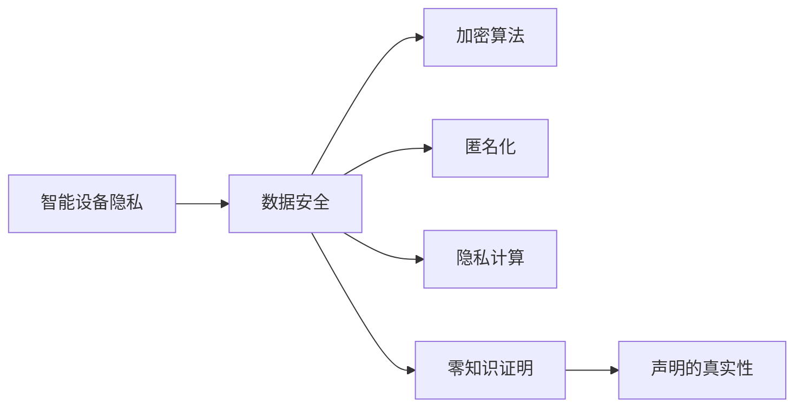
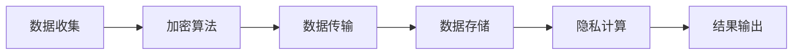

                 

# 智能设备隐私：保护用户数据

> 关键词：智能设备, 隐私保护, 数据安全, 加密算法, 匿名化, 隐私计算, 零知识证明

## 1. 背景介绍

在科技飞速发展的今天，智能设备已经成为我们生活中不可或缺的一部分，从智能手机到智能家居，再到可穿戴设备，这些设备极大地方便了我们的生活，但也带来了隐私保护的新挑战。随着越来越多的数据在智能设备上被收集和存储，如何保护用户隐私，成为了一项重要的课题。本文将系统介绍智能设备隐私保护的核心概念和技术手段，帮助读者更好地理解这一领域。

## 2. 核心概念与联系

### 2.1 核心概念概述

在智能设备隐私保护领域，有几个核心概念尤为关键：

- **智能设备隐私**：指用户在使用智能设备时，所产生的个人信息和数据的隐私。
- **数据安全**：指在数据收集、传输、存储、使用等各个环节中，保证数据不被未经授权的访问、篡改和泄露。
- **加密算法**：用于对数据进行加密，确保数据在传输和存储过程中的安全性。
- **匿名化**：通过去除数据中的可识别信息，使得数据难以与特定用户关联。
- **隐私计算**：在计算过程中，确保数据不被泄露，同时实现计算任务。
- **零知识证明**：在不泄露任何信息的前提下，证明某个声明的真实性。

这些概念通过相互作用，共同构成了智能设备隐私保护的完整体系。下图展示了各个概念之间的联系：



### 2.2 核心概念原理和架构的 Mermaid 流程图

由于 Mermaid 不支持复杂的图形结构，我们仅能提供最简单的流程图示例：



### 2.3 核心概念的联系

- **数据安全**是智能设备隐私保护的基础，通过加密、匿名化等手段，确保数据的机密性和完整性。
- **加密算法**和**隐私计算**是数据安全的具体实现方法，通过数学密码学技术，确保数据的传输和存储安全。
- **匿名化**和**零知识证明**则是在隐私计算过程中，保护用户隐私的关键技术，使得数据可以在不被泄露的前提下，进行有效的计算和分析。

## 3. 核心算法原理 & 具体操作步骤

### 3.1 算法原理概述

智能设备隐私保护的核心算法原理主要包括以下几个方面：

- **加密算法**：对数据进行加密，确保数据在传输和存储过程中的安全性。常用的加密算法包括对称加密（如AES）和非对称加密（如RSA）。
- **匿名化**：通过去除数据中的可识别信息，使得数据难以与特定用户关联。常用的匿名化技术包括泛化、抑制和扰动等。
- **隐私计算**：在计算过程中，确保数据不被泄露，同时实现计算任务。常用的隐私计算技术包括同态加密、多方安全计算和差分隐私等。
- **零知识证明**：在不泄露任何信息的前提下，证明某个声明的真实性。常用的零知识证明技术包括承诺和证明协议等。

### 3.2 算法步骤详解

下面以同态加密为例，详细介绍其算法步骤：

**Step 1: 数据加密**
- 选择一种同态加密算法，如RSA或Paillier算法。
- 对原始数据进行加密，得到密文。

**Step 2: 数据计算**
- 在加密后的密文上进行计算，得到结果密文。

**Step 3: 结果解密**
- 对结果密文进行解密，得到最终结果。

### 3.3 算法优缺点

同态加密的优点包括：

- **安全性高**：在计算过程中，数据始终保持加密状态，避免了数据泄露的风险。
- **实用性广**：可以在不改变数据格式的情况下，对数据进行各种计算操作。

同态加密的缺点包括：

- **计算复杂度高**：同态加密的计算复杂度较高，效率较低。
- **密钥管理复杂**：需要生成和分发大量的密钥，管理复杂。

### 3.4 算法应用领域

同态加密主要应用于以下几个领域：

- **医疗数据**：医疗数据包含大量敏感信息，通过同态加密可以保护患者隐私，同时进行数据分析和处理。
- **金融数据**：金融数据包含大量敏感交易信息，通过同态加密可以保护客户隐私，同时进行风险评估和分析。
- **政府数据**：政府数据包含大量敏感公共信息，通过同态加密可以保护公民隐私，同时进行统计分析和政策制定。

## 4. 数学模型和公式 & 详细讲解 & 举例说明

### 4.1 数学模型构建

以RSA同态加密为例，构建其数学模型：

- **加密算法**：$$C = (M^e \mod N, e, N)$$
- **解密算法**：$$M = (C^d \mod N)$$

其中，$M$表示原始明文，$C$表示密文，$e$和$d$为加密和解密指数，$N$为模数。

### 4.2 公式推导过程

- **加密过程**：$$C = (M^e \mod N)$$
- **解密过程**：$$M = (C^d \mod N)$$

### 4.3 案例分析与讲解

假设有一份包含大量敏感信息的医疗数据，需要将其存储到云端服务器中进行数据分析和处理。

**Step 1: 选择加密算法**
- 选择RSA算法进行加密。

**Step 2: 数据加密**
- 将原始医疗数据$M$进行加密，得到密文$C$。

**Step 3: 数据计算**
- 在密文$C$上进行数据分析和处理，得到结果密文$C'$。

**Step 4: 结果解密**
- 对结果密文$C'$进行解密，得到最终结果$M'$。

## 5. 项目实践：代码实例和详细解释说明

### 5.1 开发环境搭建

在进行智能设备隐私保护项目实践前，我们需要准备好开发环境。以下是使用Python进行加密开发的环境配置流程：

1. 安装Anaconda：从官网下载并安装Anaconda，用于创建独立的Python环境。

2. 创建并激活虚拟环境：
```bash
conda create -n cryptography-env python=3.8 
conda activate cryptography-env
```

3. 安装必要的库：
```bash
pip install cryptography
```

完成上述步骤后，即可在`cryptography-env`环境中开始加密实践。

### 5.2 源代码详细实现

这里我们以RSA加密算法为例，给出使用cryptography库进行数据加密和解密的PyTorch代码实现。

```python
from cryptography.hazmat.primitives import serialization, hashes
from cryptography.hazmat.primitives.asymmetric import rsa, padding
from cryptography.hazmat.primitives import serialization
from cryptography.hazmat.primitives.asymmetric import rsa, padding

def encrypt(plaintext):
    private_key = rsa.generate_private_key(public_exponent=65537, key_size=2048)
    public_key = private_key.public_key()
    ciphertext = private_key.encrypt(plaintext, padding.OAEP(
        mgf=padding.MGF1(algorithm=hashes.SHA256()),
        algorithm=hashes.SHA256(),
        label=None))
    return ciphertext

def decrypt(ciphertext):
    private_key = rsa.generate_private_key(public_exponent=65537, key_size=2048)
    public_key = private_key.public_key()
    plaintext = private_key.decrypt(ciphertext, padding.OAEP(
        mgf=padding.MGF1(algorithm=hashes.SHA256()),
        algorithm=hashes.SHA256(),
        label=None))
    return plaintext
```

在代码中，我们使用cryptography库实现了RSA加密和解密函数。

### 5.3 代码解读与分析

让我们再详细解读一下关键代码的实现细节：

**encrypt函数**：
- 首先生成RSA私钥和公钥。
- 使用私钥对原始数据进行加密，得到密文。
- 返回密文。

**decrypt函数**：
- 使用公钥对密文进行解密，得到原始数据。
- 返回原始数据。

可以看到，使用cryptography库进行RSA加密解密，代码实现相对简单，可读性高。

### 5.4 运行结果展示

在实际运行中，可以使用以下代码测试加密和解密过程：

```python
plaintext = b"Hello, world!"
ciphertext = encrypt(plaintext)
plaintext = decrypt(ciphertext)
print("原始数据：", plaintext)
```

## 6. 实际应用场景

### 6.1 智能家居隐私保护

智能家居设备越来越多地被引入家庭生活中，这些设备通过网络与云端服务器进行通信，用户的数据隐私面临巨大风险。通过在设备本地进行数据加密，可以有效地保护用户隐私。

具体而言，可以在智能家居设备上安装本地加密模块，对数据进行加密后再上传云端。这样即使数据在传输过程中被截获，也无法轻易解密，从而保护用户隐私。

### 6.2 健康医疗隐私保护

健康医疗领域的数据包含大量敏感信息，如病历、基因数据等。通过同态加密，可以在保护患者隐私的前提下，进行数据分析和处理。

例如，某医疗机构需要将患者的基因数据上传到云端进行研究。在上传前，先使用同态加密对数据进行加密，确保数据在传输和存储过程中不被泄露。同时，云计算平台可以对加密数据进行安全计算，得出分析结果。医疗机构再通过解密，获取分析结果，实现对数据的有效利用。

### 6.3 金融数据隐私保护

金融数据包含大量敏感交易信息，如信用卡消费记录、银行账户余额等。通过同态加密，可以在保护客户隐私的前提下，进行数据分析和风险评估。

例如，某银行需要对客户的消费数据进行分析，以评估风险。在分析前，先使用同态加密对数据进行加密，确保数据在传输和存储过程中不被泄露。同时，银行可以对加密数据进行安全计算，得出分析结果。银行再通过解密，获取分析结果，实现对数据的有效利用。

### 6.4 未来应用展望

随着智能设备的发展和隐私保护的重视，未来智能设备隐私保护将有以下趋势：

- **多方计算**：在多个参与方之间进行安全计算，保护各方的隐私。
- **区块链技术**：结合区块链技术，确保数据存储和传输的安全性。
- **量子安全加密**：随着量子计算的发展，传统的加密算法将被取代，量子安全加密将成为一个重要的研究方向。

## 7. 工具和资源推荐

### 7.1 学习资源推荐

为了帮助开发者系统掌握智能设备隐私保护的理论基础和实践技巧，这里推荐一些优质的学习资源：

1. 《Python加密实战》书籍：详细介绍了Python中的各种加密算法，包括对称加密、非对称加密、哈希算法等，适合实战练习。
2. 《信息安全工程》课程：介绍信息安全的基础知识，涵盖加密、匿名化、隐私计算等概念，适合入门学习。
3. 《智能设备隐私保护技术》在线课程：详细讲解智能设备隐私保护的技术手段和实践方法，适合进阶学习。

通过对这些资源的学习实践，相信你一定能够全面掌握智能设备隐私保护的理论和实践技巧，为实际应用提供有力的技术支持。

### 7.2 开发工具推荐

高效的开发离不开优秀的工具支持。以下是几款用于智能设备隐私保护开发的常用工具：

1. Anaconda：Python环境管理工具，支持虚拟环境创建和管理。
2. PyTorch：Python深度学习框架，支持加密算法和隐私计算的实现。
3. Scikit-learn：Python机器学习库，支持数据预处理和分析。
4. PyCrypto：Python加密库，支持多种加密算法和哈希算法。
5. OpenSSL：开源的加密库，支持RSA、AES等多种加密算法。

合理利用这些工具，可以显著提升智能设备隐私保护的开发效率，加快创新迭代的步伐。

### 7.3 相关论文推荐

智能设备隐私保护的研究源于学界的持续研究。以下是几篇奠基性的相关论文，推荐阅读：

1. "A Secure Multi-Party Computation Protocol Based on Encryption"（基于加密的多方安全计算协议）
2. "Privacy-Preserving Data Sharing Using Secure Computation"（基于安全计算的数据共享隐私保护）
3. "Quantum Cryptography: Principles and Prospects"（量子加密：原理与前景）

这些论文代表了大语言模型微调技术的发展脉络。通过学习这些前沿成果，可以帮助研究者把握学科前进方向，激发更多的创新灵感。

## 8. 总结：未来发展趋势与挑战

### 8.1 研究成果总结

本文对智能设备隐私保护的核心概念和技术手段进行了全面系统的介绍。首先阐述了智能设备隐私保护的研究背景和意义，明确了数据安全、加密算法、匿名化等核心概念在保护用户隐私中的作用。其次，从原理到实践，详细讲解了智能设备隐私保护的各种算法步骤，给出了具体的代码实现和分析。同时，本文还广泛探讨了智能设备隐私保护在智能家居、健康医疗、金融数据等诸多领域的应用前景，展示了隐私保护范式的巨大潜力。最后，本文精选了隐私保护的各类学习资源，力求为读者提供全方位的技术指引。

通过本文的系统梳理，可以看到，智能设备隐私保护已经成为一个多学科交叉的重要研究领域，涵盖数据安全、密码学、隐私计算等方向，助力保障用户隐私，推动技术进步。未来，伴随新技术的不断涌现，智能设备隐私保护必将迎来更多突破，为保护用户隐私提供更全面、更高效的技术手段。

### 8.2 未来发展趋势

展望未来，智能设备隐私保护将呈现以下几个发展趋势：

1. **多方计算**：在多个参与方之间进行安全计算，保护各方的隐私。
2. **区块链技术**：结合区块链技术，确保数据存储和传输的安全性。
3. **量子安全加密**：随着量子计算的发展，传统的加密算法将被取代，量子安全加密将成为一个重要的研究方向。
4. **零知识证明**：在不泄露任何信息的前提下，证明某个声明的真实性，成为隐私计算的重要组成部分。
5. **联邦学习**：在分布式环境中共享模型训练，保护用户数据隐私。

以上趋势凸显了智能设备隐私保护技术的广阔前景。这些方向的探索发展，必将进一步提升智能设备的数据安全性和用户隐私保护水平，为构建安全、可靠、智能的未来社会铺平道路。

### 8.3 面临的挑战

尽管智能设备隐私保护技术已经取得了显著进展，但在迈向更加智能化、普适化应用的过程中，它仍面临着诸多挑战：

1. **计算效率**：随着数据量的增大，计算复杂度会随之增加，需要更高效的算法和计算方式。
2. **存储需求**：大量数据的存储和传输需要消耗大量资源，需要优化存储方式。
3. **跨领域应用**：不同的应用场景对隐私保护的要求不同，需要针对性地设计隐私保护方案。
4. **技术普及**：隐私保护技术需要广泛推广和应用，才能发挥其真正的价值。
5. **法规合规**：隐私保护技术的普及和应用需要符合相关法律法规，避免法律风险。

### 8.4 研究展望

面对智能设备隐私保护所面临的种种挑战，未来的研究需要在以下几个方面寻求新的突破：

1. **高效算法**：开发更加高效的加密算法和安全计算方法，提高计算效率和数据传输速度。
2. **分布式计算**：结合分布式计算技术，实现跨设备和跨平台的数据安全共享。
3. **跨领域应用**：针对不同应用场景，设计和推广通用的隐私保护方案，提升其普适性。
4. **法规支持**：积极参与隐私保护技术的法律法规制定，推动其标准化和规范化。
5. **用户教育**：加强用户隐私保护意识和技能培训，提升用户对隐私保护技术的理解和应用能力。

这些研究方向将推动智能设备隐私保护技术的进一步发展和普及，为构建更加安全、可靠、智能的未来社会提供坚实基础。

## 9. 附录：常见问题与解答

**Q1：智能设备隐私保护是否适用于所有NLP任务？**

A: 智能设备隐私保护主要适用于涉及用户数据和隐私保护的场景，如智能家居、健康医疗、金融数据等。对于不涉及用户数据的任务，如文本分类、命名实体识别等，隐私保护措施可能相对较少。

**Q2：如何进行智能设备隐私保护？**

A: 智能设备隐私保护主要包括以下几个步骤：
1. 数据加密：对敏感数据进行加密，确保数据在传输和存储过程中的安全性。
2. 匿名化：通过去除数据中的可识别信息，使得数据难以与特定用户关联。
3. 安全计算：在计算过程中，确保数据不被泄露，同时实现计算任务。

**Q3：智能设备隐私保护需要考虑哪些因素？**

A: 智能设备隐私保护需要考虑以下因素：
1. 数据敏感度：不同数据的敏感度不同，需要采取不同的隐私保护措施。
2. 计算效率：需要考虑计算效率和资源消耗，选择合适的加密算法和安全计算方法。
3. 存储需求：需要优化存储方式，减少数据存储和传输的资源消耗。
4. 法规合规：需要符合相关法律法规，避免法律风险。

**Q4：智能设备隐私保护的应用场景有哪些？**

A: 智能设备隐私保护主要应用于以下场景：
1. 智能家居：保护用户隐私，防止数据泄露。
2. 健康医疗：保护患者隐私，防止数据滥用。
3. 金融数据：保护客户隐私，防止数据泄露。
4. 政府数据：保护公民隐私，防止数据滥用。

**Q5：智能设备隐私保护的未来趋势有哪些？**

A: 智能设备隐私保护的未来趋势包括：
1. 多方计算：在多个参与方之间进行安全计算，保护各方的隐私。
2. 区块链技术：结合区块链技术，确保数据存储和传输的安全性。
3. 量子安全加密：随着量子计算的发展，传统的加密算法将被取代，量子安全加密将成为一个重要的研究方向。
4. 零知识证明：在不泄露任何信息的前提下，证明某个声明的真实性。

---

作者：禅与计算机程序设计艺术 / Zen and the Art of Computer Programming

