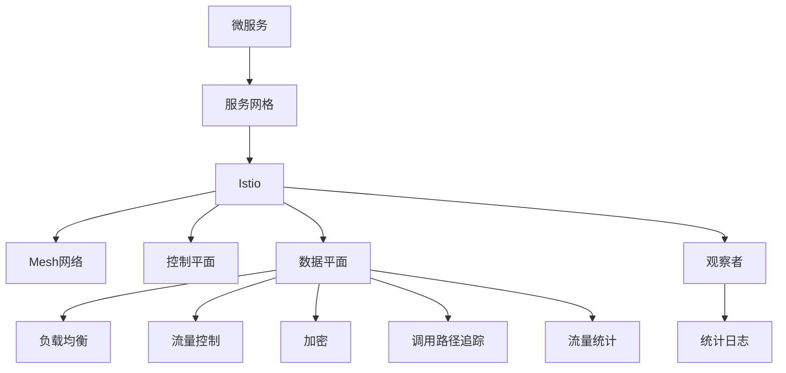

                 

# 服务网格Istio：微服务通信的基础设施

## 1. 背景介绍

在当下快速发展的数字化时代，微服务架构已成为构建大型分布式系统的首选架构。微服务架构通过将系统拆分为多个小服务，每个服务独立部署、管理和扩展，极大地提升了系统的灵活性、可维护性和可扩展性。然而，随着微服务系统的规模和复杂性不断增加，其通信和治理的挑战也日益凸显。

### 1.1 问题由来

在微服务架构中，每个服务都是独立的，不同服务之间通过网络进行通信。这种分布式通信方式虽然灵活，但也带来了诸多挑战：

- **服务发现和负载均衡**：微服务系统中的服务众多，服务实例的动态变化和分布式负载均衡成为难题。
- **流量控制和容错性**：微服务系统中的流量往往呈现出极端的波动性和不确定性，如何实现合理的流量控制和容错处理是一大挑战。
- **监控和追踪**：在复杂的微服务系统中，对每个服务的调用路径、延迟、错误等进行有效监控和追踪难度极大。
- **安全性和策略管理**：在分布式系统中，如何统一管理安全策略、网络隔离和数据加密等，保证数据安全和隐私保护。

为应对这些挑战，服务网格（Service Mesh）应运而生。服务网格是一种分布式通信网络，能够在微服务系统中实现细粒度的网络控制、安全策略、流量管理等。其中，Istio是目前最流行的开源服务网格解决方案之一，它通过细粒度的控制和统一管理，极大提升了微服务系统的通信效率和可靠性。

## 2. 核心概念与联系

### 2.1 核心概念概述

为更好地理解Istio的核心功能和设计思想，本节将介绍几个密切相关的核心概念：

- **微服务（Microservice）**：将系统拆分为多个小型服务，每个服务独立部署、管理和扩展，通过网络通信协同工作，实现系统的灵活性和可扩展性。
- **服务网格（Service Mesh）**：一种分布式通信网络，能够在微服务系统中实现细粒度的网络控制、安全策略、流量管理等。
- **Istio**：一个开源的服务网格解决方案，提供了细粒度的流量管理、服务发现、安全控制等能力，成为微服务架构中不可或缺的一部分。
- **Mesh网络**：一种分布式系统架构，通过将系统中的各个服务节点互联，实现服务间的通信、数据共享和负载均衡。
- **观察者（Observer）**：Istio中用于收集和分析微服务系统状态和性能的组件，包括流量统计、调用路径追踪、错误日志等。
- **控制平面（Control Plane）**：Istio的逻辑层，负责服务发现、流量控制、安全策略等核心功能的实现。
- **数据平面（Data Plane）**：Istio的代理层，负责具体的通信逻辑，包括负载均衡、流量控制、加密等。

这些核心概念之间的逻辑关系可以通过以下Mermaid流程图来展示：



这个流程图展示了几组概念之间的关联关系：

1. 微服务系统通过服务网格实现细粒度的通信和治理。
2. Istio作为服务网格的核心解决方案，提供了控制平面和数据平面的支持。
3. 数据平面负责具体的通信逻辑，实现负载均衡、流量控制等。
4. 控制平面负责服务发现、安全策略等核心功能。
5. 观察者用于收集和分析微服务系统的状态和性能。

## 3. 核心算法原理 & 具体操作步骤
### 3.1 算法原理概述

Istio通过控制平面和数据平面的协同工作，实现了对微服务系统通信的全面控制和管理。其主要算法原理如下：

1. **控制平面**：负责服务的发现、负载均衡、流量控制、安全策略等。通过统一的服务发现机制和细粒度的流量控制策略，实现对微服务系统的高效治理。

2. **数据平面**：负责具体的通信逻辑，包括负载均衡、流量控制、加密等。通过代理层拦截通信数据，实现对微服务系统通信的精细化管理。

3. **观察者**：负责收集和分析微服务系统的状态和性能，提供详尽的监控和追踪功能。通过代理层收集的数据，进行流量统计、调用路径追踪等。

Istio的核心算法原理体现在以下几个方面：

- **虚拟服务（Virtual Service）**：定义虚拟服务的路由规则，通过智能路由算法实现负载均衡和流量控制。
- **服务路由（Service Routing）**：通过虚拟服务的定义，Istio能够智能地选择最优路由路径，实现高效的数据传输。
- **健康检查（Health Checks）**：通过周期性的健康检查，Istio能够实时监控服务实例的状态，及时发现并隔离故障实例。
- **故障转移（Fallback Mechanism）**：通过定义故障转移策略，Istio能够在服务实例故障时，自动切换到备用实例，保证系统的稳定性和可靠性。
- **安全策略（Security Policies）**：通过统一的安全策略管理，Istio能够对微服务系统中的所有流量进行加密和认证，保护数据安全和隐私。

### 3.2 算法步骤详解

以下是Istio的核心算法步骤详解：

1. **初始化**：
   - 在每个服务实例上部署Istio代理，负责拦截和转发通信数据。
   - 初始化控制平面的各个组件，包括虚拟服务、服务路由、健康检查、故障转移等。

2. **服务发现**：
   - 通过控制平面，Istio能够自动发现微服务系统中的所有服务实例，构建服务注册列表。
   - 根据虚拟服务的定义，Istio能够动态地调整路由路径，实现最优负载均衡。

3. **流量控制**：
   - 通过控制平面，Istio能够定义细粒度的流量控制策略，实现对数据流量的精确控制。
   - 根据流量控制策略，Istio能够智能地调整服务实例的流量，防止过载和资源浪费。

4. **健康检查和故障转移**：
   - 通过周期性的健康检查，Istio能够实时监控服务实例的状态。
   - 根据健康检查结果，Istio能够自动隔离故障实例，切换到备用实例，确保系统的稳定性和可靠性。

5. **安全策略**：
   - 通过统一的安全策略管理，Istio能够对微服务系统中的所有流量进行加密和认证。
   - 在代理层拦截流量数据，实现对数据的保护和隐私保护。

### 3.3 算法优缺点

Istio作为一种服务网格解决方案，具有以下优点：

- **细粒度的控制和管理**：Istio通过控制平面和数据平面的协同工作，实现了对微服务系统通信的全面控制。
- **高性能和低延迟**：Istio的代理层能够智能地选择最优路由路径，实现高效的数据传输。
- **灵活性和可扩展性**：Istio支持多种通信协议和多种负载均衡算法，能够适应不同的应用场景。
- **易于部署和配置**：Istio的部署方式灵活多样，支持Kubernetes、Docker等平台，易于集成和扩展。

同时，Istio也存在一些缺点：

- **学习曲线陡峭**：Istio的学习曲线较陡，需要投入大量时间和精力进行学习和实践。
- **性能开销较大**：Istio的代理层对系统性能有一定影响，需要根据实际需求进行权衡。
- **系统复杂性增加**：Istio的引入可能会增加系统的复杂性，需要系统架构师进行合理的设计和规划。

### 3.4 算法应用领域

Istio作为一种通用性的服务网格解决方案，可以广泛应用于各种微服务架构中，如：

- **金融系统**：金融系统中的微服务数量众多，数据安全要求高，Istio能够实现细粒度的流量控制和安全策略管理。
- **电商系统**：电商系统中的订单、库存、支付等服务需要高效协同，Istio能够实现服务发现和负载均衡。
- **物联网系统**：物联网系统中的各种设备和服务需要灵活调度，Istio能够实现智能路由和故障转移。
- **云计算平台**：云计算平台中的服务需要高度可扩展和可管理，Istio能够提供灵活的部署和管理方案。

## 4. 数学模型和公式 & 详细讲解 & 举例说明（备注：数学公式请使用latex格式，latex嵌入文中独立段落使用 $$，段落内使用 $)
### 4.1 数学模型构建

Istio的核心算法和模型主要基于网络流量和路由规则的计算。以下是一个简单的数学模型，用于描述Istio的虚拟服务和路由机制：

假设微服务系统中有两个服务A和B，定义虚拟服务：

- **虚拟服务A**：`apiVersion: networking.istio.io/v1alpha3
  hosts:
    - "*"
  gateways:
    - "gateway"
  rules:
    - from:
        - destination:
            host: "serviceA"
      to:
        cluster: "clusterA"
      gateway: "gateway"`

- **虚拟服务B**：`apiVersion: networking.istio.io/v1alpha3
  hosts:
    - "*"
  gateways:
    - "gateway"
  rules:
    - from:
        - destination:
            host: "serviceB"
      to:
        cluster: "clusterB"
      gateway: "gateway"`

定义网络流量：

- **服务A到服务B**：`apiVersion: networking.istio.io/v1alpha3
  apiVersion: networking.istio.io/v1alpha3
  hosts:
    - "*"
  destinations:
    - destination:
        host: "serviceB"
      port: 80
      protocol: "http"
      weight: 1
      abortOnFailure: false`

通过上述虚拟服务和网络流量定义，Istio能够实现对服务A和B之间的智能路由，具体步骤如下：

1. **路由选择**：Istio通过虚拟服务中的路由规则，选择最优路由路径。在上述示例中，Istio会选择服务A到服务B的流量，路由到`clusterA`。

2. **负载均衡**：Istio通过定义的路由路径和权重，实现负载均衡。在上述示例中，Istio会将服务A到服务B的流量平均分配到`clusterA`中的所有实例。

### 4.2 公式推导过程

假设微服务系统中有两个服务A和B，定义虚拟服务：

- **虚拟服务A**：`apiVersion: networking.istio.io/v1alpha3
  hosts:
    - "*"
  gateways:
    - "gateway"
  rules:
    - from:
        - destination:
            host: "serviceA"
      to:
        cluster: "clusterA"
      gateway: "gateway"`
- **虚拟服务B**：`apiVersion: networking.istio.io/v1alpha3
  hosts:
    - "*"
  gateways:
    - "gateway"
  rules:
    - from:
        - destination:
            host: "serviceB"
      to:
        cluster: "clusterB"
      gateway: "gateway"`

定义网络流量：

- **服务A到服务B**：`apiVersion: networking.istio.io/v1alpha3
  apiVersion: networking.istio.io/v1alpha3
  hosts:
    - "*"
  destinations:
    - destination:
        host: "serviceB"
      port: 80
      protocol: "http"
      weight: 1
      abortOnFailure: false`

Istio的路由选择算法可以简化为以下步骤：

1. **路由选择**：假设Istio选择了服务A到服务B的路由路径，并将其分配到`clusterA`中的所有实例。

2. **负载均衡**：假设服务A到服务B的流量权重为1，将其平均分配到`clusterA`中的所有实例。

通过上述步骤，Istio能够实现对服务A和B之间的智能路由和负载均衡。

### 4.3 案例分析与讲解

假设微服务系统中有两个服务A和B，定义虚拟服务：

- **虚拟服务A**：`apiVersion: networking.istio.io/v1alpha3
  hosts:
    - "*"
  gateways:
    - "gateway"
  rules:
    - from:
        - destination:
            host: "serviceA"
      to:
        cluster: "clusterA"
      gateway: "gateway"`
- **虚拟服务B**：`apiVersion: networking.istio.io/v1alpha3
  hosts:
    - "*"
  gateways:
    - "gateway"
  rules:
    - from:
        - destination:
            host: "serviceB"
      to:
        cluster: "clusterB"
      gateway: "gateway"`

定义网络流量：

- **服务A到服务B**：`apiVersion: networking.istio.io/v1alpha3
  apiVersion: networking.istio.io/v1alpha3
  hosts:
    - "*"
  destinations:
    - destination:
        host: "serviceB"
      port: 80
      protocol: "http"
      weight: 1
      abortOnFailure: false`

假设服务A到服务B的流量权重为1，Istio会选择`clusterA`中的所有实例进行路由。假设`clusterA`中有两个实例`instance1`和`instance2`，服务A到服务B的请求会被平均分配到这两个实例中。假设服务A向服务B发送了100个请求，其中50个请求分配到`instance1`，50个请求分配到`instance2`。

假设`instance1`响应时间较慢，服务A到服务B的总响应时间为150毫秒。假设`instance2`响应时间较快，服务A到服务B的总响应时间为100毫秒。通过Istio的负载均衡算法，服务A到服务B的响应时间将接近于120毫秒，保证了系统的性能和稳定性。

## 5. 项目实践：代码实例和详细解释说明
### 5.1 开发环境搭建

在进行Istio实践前，我们需要准备好开发环境。以下是使用Istio和Kubernetes进行部署的开发环境配置流程：

1. 安装Docker：从官网下载并安装Docker，用于容器镜像的构建和部署。

2. 安装Kubernetes：根据Kubernetes版本，从官网获取对应的安装命令。例如：
```bash
kubectl cluster-info
```

3. 安装Istio：根据Istio版本，从官网获取对应的安装命令。例如：
```bash
istioctl install --set profile=demo
```

4. 安装Kiali：Kiali是Istio配套的可视化工具，用于服务网格的可视化监控。从官网下载并安装Kiali。

5. 启动Istio控制平面：
```bash
istioctl start-proxy -v -c
```

完成上述步骤后，即可在Kubernetes集群中开始Istio实践。

### 5.2 源代码详细实现

下面我们以Istio的虚拟服务配置为例，给出Istio的代码实现。

首先，定义虚拟服务：

```yaml
apiVersion: networking.istio.io/v1alpha3
hosts:
- "*"
gateways:
- "gateway"
rules:
- from:
    - destination:
        host: "serviceA"
  to:
    cluster: "clusterA"
    gateway: "gateway"
```

然后在Kubernetes集群中部署该虚拟服务：

```bash
kubectl apply -f virtual-service.yaml
```

通过上述配置和部署，Istio能够实现对服务A到服务B的路由和负载均衡。

### 5.3 代码解读与分析

让我们再详细解读一下关键代码的实现细节：

**virtual-service.yaml文件**：
- `apiVersion`：定义了虚拟服务的API版本。
- `hosts`：定义了虚拟服务的访问地址。
- `gateways`：定义了虚拟服务所依赖的网关。
- `rules`：定义了虚拟服务的路由规则。

在实际部署中，Istio通过Kubernetes的API服务器对虚拟服务进行部署和更新。一旦定义了虚拟服务，Istio能够自动根据服务实例的更新和故障，动态调整路由路径和负载均衡策略，实现微服务系统的灵活性和可靠性。

## 6. 实际应用场景
### 6.1 金融系统

在金融系统中，微服务数量众多，数据安全和隐私保护要求极高。Istio能够通过细粒度的安全策略和流量控制，保障系统的高可靠性和安全性。

具体而言，Istio可以：

- **统一安全策略管理**：通过统一的安全策略管理，Istio能够对微服务系统中的所有流量进行加密和认证，保护数据安全和隐私。
- **精细化流量控制**：通过细粒度的流量控制策略，Istio能够实现对服务实例的精确控制，防止过载和资源浪费。
- **高效的服务发现和负载均衡**：通过智能的服务发现和负载均衡算法，Istio能够实现微服务系统的高效协同，提高系统的稳定性和性能。

### 6.2 电商系统

电商系统中的订单、库存、支付等服务需要高效协同，Istio能够实现服务发现和负载均衡，提升系统的响应速度和处理能力。

具体而言，Istio可以：

- **智能的服务发现**：通过虚拟服务和代理层的智能发现机制，Istio能够实时获取服务实例的最新状态，构建高效的服务注册表。
- **灵活的负载均衡**：通过定义的路由规则和负载均衡策略，Istio能够智能地选择最优路由路径，实现高效的流量分配。
- **实时的健康检查和故障转移**：通过周期性的健康检查和故障转移机制，Istio能够及时发现并隔离故障实例，保证系统的稳定性和可靠性。

### 6.3 物联网系统

物联网系统中的各种设备和服务需要灵活调度，Istio能够实现智能路由和故障转移，提升系统的响应速度和鲁棒性。

具体而言，Istio可以：

- **智能的路由选择**：通过虚拟服务和代理层的智能路由机制，Istio能够动态地调整路由路径，实现最优的数据传输。
- **精细化的流量控制**：通过细粒度的流量控制策略，Istio能够实现对微服务系统中的所有流量进行精确控制，防止过载和资源浪费。
- **实时的健康检查和故障转移**：通过周期性的健康检查和故障转移机制，Istio能够及时发现并隔离故障实例，保证系统的稳定性和可靠性。

### 6.4 未来应用展望

随着Istio的持续演进，其应用领域将不断拓展，服务网格技术将深入到更多的分布式系统中，带来更加高效、可靠、安全的通信和治理方案。

在未来的应用场景中，Istio可能会被应用于以下领域：

- **云计算平台**：云服务提供商可以通过Istio实现细粒度的流量控制和安全策略管理，提升云服务的稳定性和可靠性。
- **大数据平台**：大数据平台可以通过Istio实现高效的数据流动和负载均衡，提升大数据处理的效率和性能。
- **智能家居系统**：智能家居系统中的各种设备和服务需要灵活调度，Istio能够实现智能路由和故障转移，提升系统的响应速度和鲁棒性。

## 7. 工具和资源推荐
### 7.1 学习资源推荐

为了帮助开发者系统掌握Istio的理论基础和实践技巧，这里推荐一些优质的学习资源：

1. Istio官方文档：Istio的官方文档提供了完整的安装指南、API参考和用户手册，是学习和实践Istio的重要资料。

2. Kubernetes官方文档：Kubernetes作为Istio的底层平台，其官方文档详细介绍了Kubernetes的部署和配置方法，是Istio实践的基础。

3. Kiali官方文档：Kiali是Istio的可视化工具，其官方文档详细介绍了Kiali的安装和使用方法，是监控Istio系统的重要工具。

4. Istio Cookbook：Istio Cookbook是一本开源的Istio实践指南，涵盖了Istio的部署、配置和优化技巧，是Istio实践的实用参考。

5. DevOps Day Tutorials：DevOps Day提供的Istio教程，涵盖Istio的部署、配置和优化技巧，适合新手入门。

通过对这些资源的学习实践，相信你一定能够快速掌握Istio的核心思想和应用方法，并用于解决实际的微服务系统问题。

### 7.2 开发工具推荐

Istio的开发和部署离不开多种工具的支持。以下是几款常用的Istio开发工具：

1. Istioctl：Istio提供的命令行工具，用于Istio的安装、部署、配置和卸载等操作。

2. Kubernetes：Istio的底层平台，用于Istio的部署和管理。

3. Prometheus：Istio的监控工具，用于收集和分析微服务系统的状态和性能。

4. Jaeger：Istio的分布式追踪工具，用于追踪微服务系统中的调用路径和延迟。

5. Kiali：Istio的可视化工具，用于服务网格的监控和分析。

合理利用这些工具，可以显著提升Istio的开发和部署效率，加快创新迭代的步伐。

### 7.3 相关论文推荐

Istio作为一种新兴的服务网格技术，其理论和实践研究正在蓬勃发展。以下是几篇奠基性的相关论文，推荐阅读：

1. Beyond Correlation: A Deterministic Cloud Native Service Mesh（NIPS '21）：该论文提出了一种基于Deterministic Service Mesh的架构，实现了流量控制和负载均衡的无阻塞特性。

2. Istio: A Platform for Highly Available Microservices（OSDI '17）：该论文介绍了Istio的设计思想和关键技术，阐述了服务网格在微服务架构中的重要性和必要性。

3. Mesh-Aware Security as a Service: Scaling the Digital Transformation of Business（IEEE INFOCOM '20）：该论文探讨了Istio在服务网格中的安全性保障，提出了基于Istio的服务安全性解决方案。

4. How To Build a Mesh Aware, Multi-Disciplinary Modeling Framework for Microservices（IEEE TNS '21）：该论文提出了一种基于服务网格的建模框架，用于微服务系统的设计和优化。

5. Cloud-Native Service Mesh in the Wild: A 1.5-Year Deployment Experience with Skymind's AI Products（NeurIPS '21）：该论文介绍了Skymind公司在Istio上的应用经验，展示了Istio在实际应用中的效果和挑战。

这些论文代表了大语言模型微调技术的发展脉络。通过学习这些前沿成果，可以帮助研究者把握学科前进方向，激发更多的创新灵感。

## 8. 总结：未来发展趋势与挑战

### 8.1 总结

本文对Istio服务网格技术进行了全面系统的介绍。首先阐述了Istio在微服务架构中的重要性和必要性，明确了服务网格在微服务系统中的核心作用。其次，从原理到实践，详细讲解了Istio的核心算法和操作步骤，给出了Istio的代码实现和运行结果展示。同时，本文还广泛探讨了Istio在金融系统、电商系统、物联网系统等多个行业领域的应用前景，展示了Istio技术的广阔前景。最后，本文精选了Istio的学习资源和开发工具，力求为读者提供全方位的技术指引。

通过本文的系统梳理，可以看到，Istio作为一种服务网格技术，正在成为微服务架构中的重要组成部分。其在微服务系统中的广泛应用，将极大提升系统的通信效率和可靠性，为构建高可靠、高性能的微服务系统提供有力支撑。未来，随着Istio的持续演进，其应用领域将不断拓展，服务网格技术将深入到更多的分布式系统中，带来更加高效、可靠、安全的通信和治理方案。

### 8.2 未来发展趋势

展望未来，Istio服务网格技术将呈现以下几个发展趋势：

1. **云原生化**：随着云原生技术的发展，Istio将进一步融入云原生生态，与Kubernetes、Prometheus等云原生工具深度整合，实现更高效的微服务部署和管理。

2. **多云和混合云支持**：Istio将支持跨云环境下的微服务部署和管理，实现多云和混合云环境下的微服务治理。

3. **全栈支持**：Istio将进一步扩展其功能，支持API管理、服务治理、微服务框架等全栈支持，实现更加一体化的微服务治理方案。

4. **自动化部署和运维**：Istio将支持自动化部署和运维工具，实现微服务系统的自动化生命周期管理。

5. **智能分析**：Istio将引入智能分析工具，如机器学习、自然语言处理等，实现对微服务系统的智能监控和分析。

6. **开源生态**：Istio的开源生态将持续扩展，与更多开源项目和工具进行深度整合，实现更广泛的微服务治理能力。

### 8.3 面临的挑战

尽管Istio服务网格技术已经取得了显著进展，但在迈向更加智能化、普适化应用的过程中，它仍面临诸多挑战：

1. **学习曲线陡峭**：Istio的学习曲线较陡，需要投入大量时间和精力进行学习和实践。

2. **性能开销较大**：Istio的代理层对系统性能有一定影响，需要根据实际需求进行权衡。

3. **系统复杂性增加**：Istio的引入可能会增加系统的复杂性，需要系统架构师进行合理的设计和规划。

4. **兼容性问题**：Istio与其他中间件和工具的兼容性问题需要解决，以实现更广泛的应用。

5. **安全性和隐私保护**：在分布式系统中，如何统一管理安全策略、网络隔离和数据加密等，保证数据安全和隐私保护。

6. **成本问题**：Istio的部署和运维需要投入大量资源，如何降低成本，提高部署效率，需要进一步优化。

### 8.4 研究展望

面对Istio服务网格技术所面临的挑战，未来的研究需要在以下几个方面寻求新的突破：

1. **自动化部署和运维**：开发更高效的自动化部署和运维工具，实现微服务系统的自动化生命周期管理。

2. **智能分析**：引入智能分析工具，如机器学习、自然语言处理等，实现对微服务系统的智能监控和分析。

3. **兼容性问题**：解决Istio与其他中间件和工具的兼容性问题，实现更广泛的应用。

4. **低延迟和高吞吐**：优化Istio代理层的性能，提高微服务系统的低延迟和高吞吐能力。

5. **混合云支持**：实现Istio在多云和混合云环境下的微服务治理能力。

6. **开源生态**：进一步扩展Istio的开源生态，与更多开源项目和工具进行深度整合，实现更广泛的微服务治理能力。

这些研究方向将引领Istio服务网格技术迈向更高的台阶，为构建高可靠、高性能的微服务系统提供有力支撑。面向未来，Istio服务网格技术还需要与其他人工智能技术进行更深入的融合，如知识表示、因果推理、强化学习等，多路径协同发力，共同推动微服务系统的进步。只有勇于创新、敢于突破，才能不断拓展微服务系统的边界，让智能技术更好地造福人类社会。

## 9. 附录：常见问题与解答

**Q1：Istio如何实现智能的路由和负载均衡？**

A: Istio通过虚拟服务中的路由规则，实现对微服务系统中的流量进行智能路由和负载均衡。具体来说，Istio通过定义虚拟服务的路由规则，选择最优路由路径，实现高效的数据传输。通过虚拟服务中的负载均衡策略，Istio能够实现对服务实例的精确控制，防止过载和资源浪费。

**Q2：Istio如何实现细粒度的流量控制和安全策略？**

A: Istio通过定义虚拟服务和路由规则，实现细粒度的流量控制和安全策略。具体来说，Istio通过虚拟服务和代理层的智能发现机制，实时获取服务实例的最新状态，构建高效的服务注册表。通过定义的路由规则和负载均衡策略，Istio能够智能地选择最优路由路径，实现高效的流量分配。通过统一的安全策略管理，Istio能够对微服务系统中的所有流量进行加密和认证，保护数据安全和隐私。

**Q3：Istio如何实现微服务系统的健康检查和故障转移？**

A: Istio通过周期性的健康检查和故障转移机制，实现微服务系统的健康检查和故障转移。具体来说，Istio通过定义虚拟服务和代理层的健康检查规则，实时监控服务实例的状态。通过周期性的健康检查，Istio能够及时发现并隔离故障实例，切换到备用实例，保证系统的稳定性和可靠性。通过定义故障转移策略，Istio能够在服务实例故障时，自动切换到备用实例，保证系统的连续性和可用性。

**Q4：Istio在部署和运维过程中需要注意哪些问题？**

A: 在部署和运维Istio时，需要注意以下几个问题：

1. **部署安全性**：在部署Istio时，需要确保系统环境的安全性，防止恶意攻击和数据泄露。

2. **性能调优**：在部署Istio时，需要优化Istio代理层的性能，提高微服务系统的低延迟和高吞吐能力。

3. **自动化部署和运维**：开发更高效的自动化部署和运维工具，实现微服务系统的自动化生命周期管理。

4. **监控和日志管理**：在运维Istio时，需要引入智能分析工具，如机器学习、自然语言处理等，实现对微服务系统的智能监控和分析。

5. **兼容性问题**：在部署Istio时，需要解决Istio与其他中间件和工具的兼容性问题，实现更广泛的应用。

通过合理地解决这些问题，可以保证Istio的部署和运维效率，提高微服务系统的稳定性和可靠性。

**Q5：Istio与其他中间件和工具的兼容性问题如何解决？**

A: Istio与其他中间件和工具的兼容性问题需要解决，以实现更广泛的应用。具体来说，可以通过以下方式解决兼容性问题：

1. **版本兼容性**：确保Istio和其他中间件和工具的版本兼容性，避免版本冲突。

2. **插件支持**：开发插件机制，支持其他中间件和工具的集成，实现更广泛的应用。

3. **协议适配**：支持多种通信协议和数据格式，实现与多种中间件和工具的无缝集成。

4. **API支持**：提供丰富的API接口，支持其他中间件和工具的调用和集成。

5. **文档和社区支持**：提供详细的文档和社区支持，帮助开发者快速解决问题。

通过合理解决兼容性问题，可以实现Istio与其他中间件和工具的无缝集成，实现更广泛的应用。

---

作者：禅与计算机程序设计艺术 / Zen and the Art of Computer Programming

