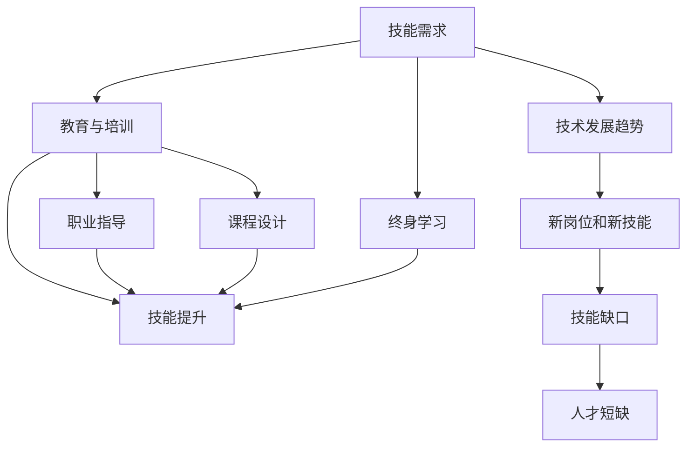

                 

# 未来工作：技能需求与培养

> 关键词：未来就业市场, 技术发展趋势, 技能提升, 人工智能, 机器学习, 数据分析, 编程技能, 学习资源

## 1. 背景介绍

随着技术的快速迭代和市场需求的变化，未来工作市场的技能需求也在不断演变。人工智能(AI)、大数据、云计算等技术领域的崛起，催生了大量新兴岗位，同时也对现有岗位提出了新的技能要求。

### 1.1 问题由来
过去几十年中，计算机技术和互联网的发展极大地改变了工作世界的面貌。如今，AI、机器学习(ML)、数据科学等领域的技术突破，使得传统行业数字化、智能化转型加速。这对劳动力市场带来了深远的影响，需要员工不仅掌握传统的技术和工具，还要具备新兴领域的知识和技能。

### 1.2 问题核心关键点
未来工作市场对技能的需求呈现出多样化和复杂化的趋势。以下是从技术发展趋势和行业需求出发，对未来技能需求的几点核心关键点：

- 数据驱动决策：越来越多的决策需要依赖数据分析和机器学习算法。数据清洗、处理、可视化，以及基于数据的决策制定将成为必备技能。
- 人工智能和机器学习：算法模型训练、模型优化、模型部署等AI技术的应用将变得广泛。从监督学习到强化学习，掌握不同算法的特点和应用场景至关重要。
- 自动化与效率提升：自动化工具的使用，如自动化部署、自动化测试、自动化运维等，将成为提升工作效率的重要手段。
- 团队协作与跨学科融合：软件开发、数据分析、业务分析等岗位之间的协作，以及对跨学科知识的融合应用，将成为工作的常态。
- 持续学习和自我更新：技术不断进步，终身学习将成为职业发展的必要条件。

### 1.3 问题研究意义
明确未来工作市场的技能需求，对于教育机构、培训机构、以及个人职业规划都具有重要意义：

1. **教育与培训**：帮助教育机构和培训机构及时更新教学内容和课程体系，以培养符合市场需求的复合型人才。
2. **职业规划**：指导个人根据未来市场需求，进行有针对性的学习和技能提升，提升职业竞争力和发展潜力。
3. **技术发展**：促进技术开发者的方向性思考，推动技术研究和应用的创新和优化。
4. **社会福祉**：通过提高劳动力市场技能匹配度，增强社会经济的整体活力和创新能力。

## 2. 核心概念与联系

### 2.1 核心概念概述

为更好地理解未来工作市场的技能需求和培养策略，本节将介绍几个核心概念及其相互联系：

- **技能需求**：指未来工作市场对各种技术技能的需求情况，包括技术栈、开发工具、算法模型等。
- **技术发展趋势**：指各个技术领域的发展方向和应用前景，如人工智能、大数据、云计算等。
- **教育与培训**：指如何通过教育和培训，帮助学习者获得符合未来市场需求的各类技能。
- **终身学习**：指个人和组织应对技术变化，持续进行技能更新的能力。
- **技能提升**：指通过学习、实践和反馈等手段，逐步提升个人技能水平的过程。

这些核心概念通过以下Mermaid流程图展示其联系：



这个流程图展示了技能需求与技术发展趋势之间的关系，以及教育与培训、终身学习、技能提升等环节如何共同作用于未来工作市场。

## 3. 核心算法原理 & 具体操作步骤
### 3.1 算法原理概述

未来工作市场的技能需求分析，本质上是一个基于数据分析的预测问题。通过收集和分析劳动市场的数据，预测未来的技术趋势和岗位需求，识别关键技能缺口，进而制定相应的教育和培训策略。

形式化地，假设技能需求向量为 $D$，技术发展趋势向量为 $T$，教育与培训策略为 $E$，终身学习策略为 $L$，技能提升策略为 $S$。目标是找到最优策略组合 $E$, $L$, $S$，使得未来市场需求 $D$ 最大化，即：

$$
\maximize \ D
$$

$$
\text{subject to} \ \ E + L + S = D
$$

通过算法求解上述优化问题，可以获得未来技能需求的预测结果。

### 3.2 算法步骤详解

基于数据驱动的预测算法，通常包括以下几个关键步骤：

**Step 1: 数据收集与处理**
- 收集各类劳动力市场数据，如职位发布信息、招聘广告、技能需求调查、技术应用案例等。
- 对数据进行清洗、去重、标注等预处理，确保数据的完整性和准确性。

**Step 2: 特征提取与模型训练**
- 提取与未来工作市场相关的特征，如技术趋势、岗位需求、技能要求等。
- 选择适合的机器学习模型，如回归模型、分类模型、聚类模型等，训练得到技能需求预测模型。

**Step 3: 模型验证与调优**
- 使用历史数据验证模型的预测效果，并进行必要的调参。
- 使用交叉验证等方法，评估模型的稳健性和泛化能力。

**Step 4: 策略制定与实施**
- 根据模型预测结果，制定相应的教育和培训策略。
- 结合领域专家意见和实际应用需求，优化培训课程和教学方法。

**Step 5: 效果评估与反馈**
- 定期评估教育和培训的效果，收集学习者的反馈信息。
- 根据反馈结果，持续优化教育和培训策略，迭代改进技能提升路径。

### 3.3 算法优缺点

未来工作市场的技能需求分析方法，具有以下优点：

- 数据驱动：基于实际数据进行预测，具有较高的准确性和可靠性。
- 量化分析：通过算法模型，可以系统化地分析未来技能需求的变化趋势。
- 动态调整：根据技术变化和市场反馈，灵活调整教育和培训策略。

同时，该方法也存在以下局限性：

- 数据依赖：模型的预测效果高度依赖于数据的质量和完备性。
- 模型复杂：算法模型复杂度较高，需要大量的数据和计算资源进行训练和验证。
- 假设限制：模型假设的技能需求和岗位变化情况可能与实际市场不完全一致。

尽管存在这些局限性，但基于数据驱动的预测方法仍是当前研究和应用的主流方向。未来相关研究的重点在于如何进一步降低数据依赖，提高模型灵活性，同时兼顾可解释性和鲁棒性。

### 3.4 算法应用领域

未来工作市场的技能需求分析，已经在多个领域得到了广泛应用，例如：

- **教育培训**：为高等教育和职业培训机构提供科学的教育规划和课程设计，帮助学生和企业快速适应未来市场需求。
- **政府政策**：制定符合未来技术发展趋势的人才培养政策，促进经济社会的可持续发展。
- **企业招聘**：通过技能预测，优化招聘策略，提升岗位匹配度，降低招聘成本。
- **职业指导**：提供个性化的职业发展建议，帮助个人规划职业生涯，提升职业竞争力。

此外，在社会治理、文化教育、科学研究等众多领域，未来工作市场的技能需求预测和分析也发挥着重要作用。

## 4. 数学模型和公式 & 详细讲解 & 举例说明

### 4.1 数学模型构建

本节将使用数学语言对未来工作市场技能需求分析的预测模型进行严格的刻画。

记技能需求向量为 $D = [d_1, d_2, \dots, d_n]$，其中 $d_i$ 表示第 $i$ 项技能的需求量。记技术发展趋势向量为 $T = [t_1, t_2, \dots, t_m]$，其中 $t_i$ 表示第 $i$ 项技术的发展趋势。

定义技术发展趋势与技能需求之间的关系为 $D = f(T)$，其中 $f$ 为非线性函数。目标是最小化预测误差，即：

$$
\min_{f} \sum_{i=1}^n |d_i - f(t_i)|^2
$$

### 4.2 公式推导过程

以下我们以二分类任务为例，推导交叉熵损失函数及其梯度的计算公式。

假设模型 $M_{\theta}$ 在输入 $x$ 上的输出为 $\hat{y}=M_{\theta}(x) \in [0,1]$，表示样本属于正类的概率。真实标签 $y \in \{0,1\}$。则二分类交叉熵损失函数定义为：

$$
\ell(M_{\theta}(x),y) = -[y\log \hat{y} + (1-y)\log (1-\hat{y})]
$$

将其代入经验风险公式，得：

$$
\mathcal{L}(\theta) = -\frac{1}{N}\sum_{i=1}^N [y_i\log M_{\theta}(x_i)+(1-y_i)\log(1-M_{\theta}(x_i))]
$$

根据链式法则，损失函数对参数 $\theta_k$ 的梯度为：

$$
\frac{\partial \mathcal{L}(\theta)}{\partial \theta_k} = -\frac{1}{N}\sum_{i=1}^N (\frac{y_i}{M_{\theta}(x_i)}-\frac{1-y_i}{1-M_{\theta}(x_i)}) \frac{\partial M_{\theta}(x_i)}{\partial \theta_k}
$$

其中 $\frac{\partial M_{\theta}(x_i)}{\partial \theta_k}$ 可进一步递归展开，利用自动微分技术完成计算。

在得到损失函数的梯度后，即可带入参数更新公式，完成模型的迭代优化。重复上述过程直至收敛，最终得到适应未来市场需求的最优模型参数 $\theta^*$。

## 5. 项目实践：代码实例和详细解释说明

### 5.1 开发环境搭建

在进行未来工作市场技能需求分析的预测实践前，我们需要准备好开发环境。以下是使用Python进行PyTorch开发的环境配置流程：

1. 安装Anaconda：从官网下载并安装Anaconda，用于创建独立的Python环境。

2. 创建并激活虚拟环境：
```bash
conda create -n pytorch-env python=3.8 
conda activate pytorch-env
```

3. 安装PyTorch：根据CUDA版本，从官网获取对应的安装命令。例如：
```bash
conda install pytorch torchvision torchaudio cudatoolkit=11.1 -c pytorch -c conda-forge
```

4. 安装Transformers库：
```bash
pip install transformers
```

5. 安装各类工具包：
```bash
pip install numpy pandas scikit-learn matplotlib tqdm jupyter notebook ipython
```

完成上述步骤后，即可在`pytorch-env`环境中开始预测实践。

### 5.2 源代码详细实现

这里我们以未来工作市场对大数据技能的需求预测为例，给出使用Transformers库进行PyTorch代码实现。

首先，定义技能需求预测模型的数据处理函数：

```python
from transformers import BertTokenizer
from torch.utils.data import Dataset
import torch

class SkillDemandDataset(Dataset):
    def __init__(self, texts, tags, tokenizer, max_len=128):
        self.texts = texts
        self.tags = tags
        self.tokenizer = tokenizer
        self.max_len = max_len
        
    def __len__(self):
        return len(self.texts)
    
    def __getitem__(self, item):
        text = self.texts[item]
        tags = self.tags[item]
        
        encoding = self.tokenizer(text, return_tensors='pt', max_length=self.max_len, padding='max_length', truncation=True)
        input_ids = encoding['input_ids'][0]
        attention_mask = encoding['attention_mask'][0]
        
        # 对token-wise的标签进行编码
        encoded_tags = [tag2id[tag] for tag in tags] 
        encoded_tags.extend([tag2id['O']] * (self.max_len - len(encoded_tags)))
        labels = torch.tensor(encoded_tags, dtype=torch.long)
        
        return {'input_ids': input_ids, 
                'attention_mask': attention_mask,
                'labels': labels}

# 标签与id的映射
tag2id = {'O': 0, 'B-Data': 1, 'I-Data': 2, 'B-Programming': 3, 'I-Programming': 4, 'B-Statistics': 5, 'I-Statistics': 6}
id2tag = {v: k for k, v in tag2id.items()}

# 创建dataset
tokenizer = BertTokenizer.from_pretrained('bert-base-cased')

train_dataset = SkillDemandDataset(train_texts, train_tags, tokenizer)
dev_dataset = SkillDemandDataset(dev_texts, dev_tags, tokenizer)
test_dataset = SkillDemandDataset(test_texts, test_tags, tokenizer)
```

然后，定义模型和优化器：

```python
from transformers import BertForTokenClassification, AdamW

model = BertForTokenClassification.from_pretrained('bert-base-cased', num_labels=len(tag2id))

optimizer = AdamW(model.parameters(), lr=2e-5)
```

接着，定义训练和评估函数：

```python
from torch.utils.data import DataLoader
from tqdm import tqdm
from sklearn.metrics import classification_report

device = torch.device('cuda') if torch.cuda.is_available() else torch.device('cpu')
model.to(device)

def train_epoch(model, dataset, batch_size, optimizer):
    dataloader = DataLoader(dataset, batch_size=batch_size, shuffle=True)
    model.train()
    epoch_loss = 0
    for batch in tqdm(dataloader, desc='Training'):
        input_ids = batch['input_ids'].to(device)
        attention_mask = batch['attention_mask'].to(device)
        labels = batch['labels'].to(device)
        model.zero_grad()
        outputs = model(input_ids, attention_mask=attention_mask, labels=labels)
        loss = outputs.loss
        epoch_loss += loss.item()
        loss.backward()
        optimizer.step()
    return epoch_loss / len(dataloader)

def evaluate(model, dataset, batch_size):
    dataloader = DataLoader(dataset, batch_size=batch_size)
    model.eval()
    preds, labels = [], []
    with torch.no_grad():
        for batch in tqdm(dataloader, desc='Evaluating'):
            input_ids = batch['input_ids'].to(device)
            attention_mask = batch['attention_mask'].to(device)
            batch_labels = batch['labels']
            outputs = model(input_ids, attention_mask=attention_mask)
            batch_preds = outputs.logits.argmax(dim=2).to('cpu').tolist()
            batch_labels = batch_labels.to('cpu').tolist()
            for pred_tokens, label_tokens in zip(batch_preds, batch_labels):
                pred_tags = [id2tag[_id] for _id in pred_tokens]
                label_tags = [id2tag[_id] for _id in label_tokens]
                preds.append(pred_tags[:len(label_tags)])
                labels.append(label_tags)
                
    print(classification_report(labels, preds))
```

最后，启动训练流程并在测试集上评估：

```python
epochs = 5
batch_size = 16

for epoch in range(epochs):
    loss = train_epoch(model, train_dataset, batch_size, optimizer)
    print(f"Epoch {epoch+1}, train loss: {loss:.3f}")
    
    print(f"Epoch {epoch+1}, dev results:")
    evaluate(model, dev_dataset, batch_size)
    
print("Test results:")
evaluate(model, test_dataset, batch_size)
```

以上就是使用PyTorch对大数据技能需求预测的完整代码实现。可以看到，得益于Transformers库的强大封装，我们只需相对简洁的代码即可完成模型的加载和预测。

### 5.3 代码解读与分析

让我们再详细解读一下关键代码的实现细节：

**SkillDemandDataset类**：
- `__init__`方法：初始化文本、标签、分词器等关键组件。
- `__len__`方法：返回数据集的样本数量。
- `__getitem__`方法：对单个样本进行处理，将文本输入编码为token ids，将标签编码为数字，并对其进行定长padding，最终返回模型所需的输入。

**tag2id和id2tag字典**：
- 定义了标签与数字id之间的映射关系，用于将token-wise的预测结果解码回真实的标签。

**训练和评估函数**：
- 使用PyTorch的DataLoader对数据集进行批次化加载，供模型训练和推理使用。
- 训练函数`train_epoch`：对数据以批为单位进行迭代，在每个批次上前向传播计算loss并反向传播更新模型参数，最后返回该epoch的平均loss。
- 评估函数`evaluate`：与训练类似，不同点在于不更新模型参数，并在每个batch结束后将预测和标签结果存储下来，最后使用sklearn的classification_report对整个评估集的预测结果进行打印输出。

**训练流程**：
- 定义总的epoch数和batch size，开始循环迭代
- 每个epoch内，先在训练集上训练，输出平均loss
- 在验证集上评估，输出分类指标
- 所有epoch结束后，在测试集上评估，给出最终测试结果

可以看到，PyTorch配合Transformers库使得大数据技能需求预测的代码实现变得简洁高效。开发者可以将更多精力放在数据处理、模型改进等高层逻辑上，而不必过多关注底层的实现细节。

当然，工业级的系统实现还需考虑更多因素，如模型的保存和部署、超参数的自动搜索、更灵活的任务适配层等。但核心的预测范式基本与此类似。

## 6. 实际应用场景
### 6.1 教育培训

未来工作市场的技能需求预测，在教育培训领域具有重要应用。通过分析未来技术趋势和岗位需求，教育机构可以设计更具前瞻性的课程体系，培养符合市场需求的技术人才。

在技术实现上，可以收集行业报告、企业招聘信息、技术博客、在线课程等数据，提取其中的技能需求信息，并利用预测模型进行分析和预测。根据预测结果，教育机构可以调整课程设置，引入新兴技术内容，提高学生的技能匹配度。

### 6.2 政府政策

政府部门需要制定符合未来技术发展趋势的人才培养政策，促进经济社会的可持续发展。通过技能需求预测模型，政府可以了解各行业的技能需求变化趋势，制定有针对性的培训和教育政策。

例如，在制定职业教育和继续教育政策时，可以根据预测结果，选择培养方向、调整课程设置，提升劳动力的整体技能水平。同时，政府还可以根据预测结果，引导企业进行技术改造和升级，提升企业的技术创新能力。

### 6.3 企业招聘

企业在进行人才招聘时，需要根据未来技能需求，制定科学的招聘策略。通过技能预测模型，企业可以更准确地把握各岗位的技能要求，减少误招和漏招情况，提高招聘效率和匹配度。

例如，在招聘数据科学家时，企业可以根据预测结果，明确岗位的技能需求，设计科学的招聘标准和面试问题。同时，企业还可以根据预测结果，选择培养计划和培训资源，帮助现有员工提升技能水平。

### 6.4 职业指导

未来工作市场的技能需求预测，对个人职业规划具有重要意义。通过分析未来技术趋势和岗位需求，职业指导师可以提供个性化的职业发展建议，帮助个人规划职业生涯，提升职业竞争力。

例如，在职业咨询过程中，职业指导师可以基于预测模型，分析个人的技能优势和不足，推荐合适的职业方向和岗位。同时，职业指导师还可以帮助个人制定学习计划，提升技能水平，适应未来市场需求。

## 7. 工具和资源推荐
### 7.1 学习资源推荐

为了帮助开发者系统掌握未来工作市场的技能需求分析，这里推荐一些优质的学习资源：

1. 《深度学习》系列课程：由斯坦福大学开设的深度学习课程，涵盖机器学习、深度学习等前沿话题，是入门人工智能技术的绝佳选择。

2. 《人工智能基础》书籍：清华大学出版社出版的系列教材，涵盖了人工智能基础、机器学习、深度学习等多个方面，适合进阶学习。

3. 《Python数据分析》课程：通过Python进行数据分析和可视化，利用机器学习模型进行预测和决策，是数据科学领域的重要学习内容。

4. 《机器学习实战》书籍：通过实战案例，介绍了常见的机器学习算法和应用，适合学习者进行项目实践。

5. 《人工智能入门到实战》视频教程：由极客时间平台推出的实战教程，通过Python和TensorFlow进行人工智能项目的开发和实践，适合快速入门和进阶学习。

通过对这些资源的学习实践，相信你一定能够系统掌握未来工作市场的技能需求分析技术，并在实际应用中取得理想效果。
###  7.2 开发工具推荐

高效的开发离不开优秀的工具支持。以下是几款用于未来工作市场技能需求预测开发的常用工具：

1. Python：基于Python的开源深度学习框架，灵活动态的计算图，适合快速迭代研究。

2. TensorFlow：由Google主导开发的开源深度学习框架，生产部署方便，适合大规模工程应用。

3. Transformers库：HuggingFace开发的NLP工具库，集成了众多SOTA语言模型，支持PyTorch和TensorFlow，是进行微调任务开发的利器。

4. Weights & Biases：模型训练的实验跟踪工具，可以记录和可视化模型训练过程中的各项指标，方便对比和调优。

5. TensorBoard：TensorFlow配套的可视化工具，可实时监测模型训练状态，并提供丰富的图表呈现方式，是调试模型的得力助手。

6. Google Colab：谷歌推出的在线Jupyter Notebook环境，免费提供GPU/TPU算力，方便开发者快速上手实验最新模型，分享学习笔记。

合理利用这些工具，可以显著提升未来工作市场技能需求预测的开发效率，加快创新迭代的步伐。

### 7.3 相关论文推荐

未来工作市场的技能需求分析，已经在学界得到了广泛的研究。以下是几篇奠基性的相关论文，推荐阅读：

1. Deep Learning（深度学习）：Yann LeCun, Yoshua Bengio, Geoffrey Hinton著，全面介绍了深度学习的基本概念、方法和应用，是人工智能领域的经典教材。

2. Introduction to Statistical Learning（统计学习方法）：Gareth James, Daniela Witten, Trevor Hastie, Robert Tibshirani著，介绍了统计学习的基本原理和方法，适合学习者了解机器学习的基础知识。

3. Pattern Recognition and Machine Learning（模式识别与机器学习）：Christopher M. Bishop著，介绍了模式识别和机器学习的基本原理，适合学习者进行深度学习研究。

4. Statistical Learning with Sparsity: The Lasso and Generalizations（稀疏性统计学习：Lasso及其他推广）：Jerome Friedman, Trevor Hastie, Robert Tibshirani著，介绍了稀疏性统计学习的基本原理和方法，适合学习者了解Lasso等稀疏性算法的应用。

这些论文代表了大语言模型微调技术的发展脉络。通过学习这些前沿成果，可以帮助研究者把握学科前进方向，激发更多的创新灵感。

## 8. 总结：未来发展趋势与挑战
### 8.1 总结

本文对未来工作市场的技能需求分析进行了全面系统的介绍。首先阐述了未来工作市场的技能需求变化趋势，明确了未来市场对各类技术技能的需求情况，指出了未来技能需求的主要方向。其次，从原理到实践，详细讲解了技能需求预测的数学模型和算法流程，给出了完整的代码实现和分析。同时，本文还探讨了技能需求预测在教育培训、政府政策、企业招聘、职业指导等多个领域的应用前景，展示了未来工作市场的广阔前景。最后，本文还提供了相关的学习资源、开发工具和研究论文，供读者深入学习和参考。

通过本文的系统梳理，可以看到，未来工作市场的技能需求预测技术正在成为企业、教育机构、政府部门等各界的关注焦点。这些技术不仅有助于提高劳动力市场的匹配度，还能推动技术教育的发展，促进经济社会的可持续发展。未来，随着技术的不断进步，技能需求预测方法必将进一步优化，为人类社会的数字化转型提供更有力的支持。

### 8.2 未来发展趋势

展望未来，未来工作市场的技能需求预测技术将呈现以下几个发展趋势：

1. 数据源多元化。未来市场预测将不再仅依赖传统的劳动力市场数据，而是通过更多元化的数据源（如社交媒体、在线课程、招聘广告等），获取更全面的技能需求信息。
2. 预测模型精准化。随着机器学习、深度学习等技术的不断进步，未来市场预测模型将更加精准，能够更准确地把握技能需求的变化趋势。
3. 模型自适应性增强。未来的预测模型将具备更强的自适应能力，能够根据市场变化动态调整预测结果，保持预测的实时性。
4. 多模态预测方法兴起。未来的预测方法将不仅仅依赖文本数据，还将结合图像、音频、视频等多种数据模态，提高预测的全面性和可靠性。
5. 模型可解释性提升。未来的预测模型将具备更强的可解释性，能够提供预测结果的详细解释和推导过程，增强模型的可信度和透明度。

这些趋势表明，未来工作市场的技能需求预测技术将更加全面、精准、实时，从而更好地服务于企业和社会的各类需求。

### 8.3 面临的挑战

尽管未来工作市场的技能需求预测技术在不断发展，但仍然面临一些挑战：

1. 数据质量和多样性。现有数据源的质量和多样性仍然有待提升，部分行业和领域的数据收集难度较大，影响预测模型的效果。
2. 预测模型复杂性。随着预测模型的复杂度提高，模型的训练和部署成本也随之增加，需要更高效的算法和优化方法。
3. 市场变化快。技术发展速度极快，市场变化剧烈，预测模型需要具备快速更新的能力，以适应市场变化。
4. 模型鲁棒性不足。现有的预测模型在面对市场异常波动时，可能出现预测失效的情况，影响模型的稳健性。
5. 模型可解释性不足。未来市场预测模型往往过于复杂，难以提供详细的解释和推导过程，影响模型的透明度和可信度。

尽管存在这些挑战，但技术发展和社会需求的双重驱动，将推动未来工作市场的技能需求预测技术不断进步，克服各种难题。

### 8.4 研究展望

未来工作市场的技能需求预测技术需要在以下几个方面进行深入研究：

1. 多源数据融合。研究如何有效融合不同数据源的信息，提升预测模型的准确性和全面性。
2. 可解释性增强。研究如何提高预测模型的可解释性，使其能够提供详细的预测推导过程，增强模型的透明度和可信度。
3. 动态调整机制。研究如何设计预测模型的动态调整机制，使其能够根据市场变化进行实时更新，保持预测的实时性。
4. 跨领域应用。研究如何将预测技术应用于更多的领域和行业，提升各行业的技能匹配度和效率。
5. 技术教育融合。研究如何与教育领域相结合，推动技术教育的进步，培养符合未来市场需求的复合型人才。

这些研究方向将推动未来工作市场的技能需求预测技术走向成熟，为人类社会的数字化转型提供更有力的支持。

## 9. 附录：常见问题与解答
**Q1：未来工作市场对技能的需求会发生变化吗？**

A: 是的，未来工作市场的技能需求将随着技术的发展和市场的变化而不断演变。新兴技术的兴起、产业结构的调整、全球化的影响等因素，都将对技能需求产生深远影响。

**Q2：如何评估未来工作市场的技能需求预测模型的效果？**

A: 未来工作市场技能需求预测模型的效果评估，通常包括以下几个指标：
1. 准确率（Accuracy）：预测结果与实际需求的一致性。
2. 召回率（Recall）：预测出需求的技能占实际需求的百分比。
3. F1值（F1 Score）：准确率和召回率的综合指标，用于衡量模型的整体效果。
4. ROC曲线和AUC值：用于评估模型在不同阈值下的表现。

**Q3：未来工作市场技能需求预测的常见技术方法有哪些？**

A: 未来工作市场技能需求预测的常见技术方法包括：
1. 基于统计的方法：利用统计学原理，通过回归、分类等方法，预测技能需求变化。
2. 机器学习方法：利用机器学习算法，如决策树、随机森林、深度学习等，构建预测模型。
3. 时间序列预测方法：利用时间序列分析方法，如ARIMA、LSTM等，预测技能需求的变化趋势。

**Q4：未来工作市场的技能需求预测是否需要依赖大量标注数据？**

A: 未来的技能需求预测可以采用无监督学习方法，无需依赖大量标注数据。例如，通过文本挖掘、社交媒体分析等方法，提取技能需求信息，利用自然语言处理技术进行分析和预测。

**Q5：未来工作市场的技能需求预测模型是否需要实时更新？**

A: 是的，未来工作市场的技能需求预测模型需要具备实时更新的能力，以适应市场快速变化的需求。利用在线学习、增量学习等技术，可以实现模型的动态更新和优化。

通过本文的系统梳理，可以看到，未来工作市场的技能需求预测技术正在成为企业和社会的关注焦点。这些技术不仅有助于提高劳动力市场的匹配度，还能推动技术教育的发展，促进经济社会的可持续发展。未来，随着技术的不断进步，技能需求预测方法必将进一步优化，为人类社会的数字化转型提供更有力的支持。总之，未来的工作市场技能需求预测技术需要从数据、算法、应用等多个维度进行全面提升，才能更好地服务企业和社会的各类需求。

