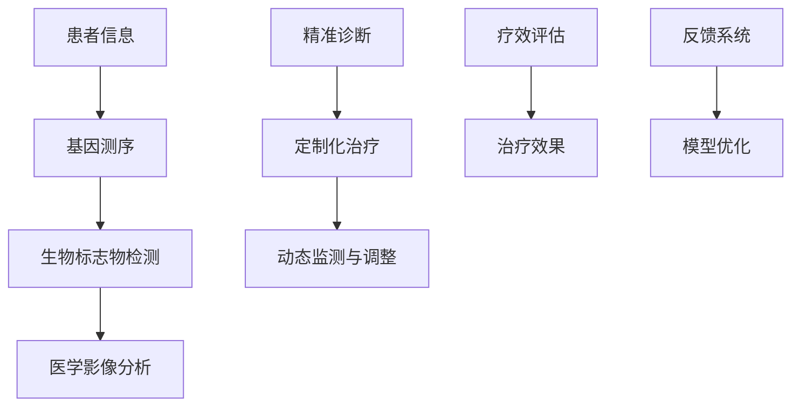

                 

# 未来的个性化医疗：2050年的精准诊断与定制化治疗

## 1. 背景介绍

随着人工智能和大数据技术的不断进步，未来医疗行业将迎来一场深刻的变革。2050年的个性化医疗，将依托先进的人工智能技术，通过精准诊断与定制化治疗，显著提升患者的治疗效果和生存质量。本文将详细探讨未来的个性化医疗，包括其核心概念、关键技术、应用场景以及面临的挑战。

## 2. 核心概念与联系

### 2.1 核心概念概述

个性化医疗是个性化、精准化的医疗服务，旨在根据每个患者的特定条件（如基因、环境、生活习惯等），量身定制出最适合的治疗方案。具体而言，包括以下几个核心概念：

- **精准诊断**：利用先进的医学影像、基因测序、生物标志物检测等技术，对患者进行全面、深入的病情分析，提供准确无误的诊断结果。
- **定制化治疗**：基于个性化的诊断结果，为每位患者设计最佳的个性化治疗方案，包括药物选择、剂量调整、治疗顺序等。
- **动态监测与调整**：在治疗过程中，持续监测患者的健康状况，根据实时的反馈结果动态调整治疗方案，确保治疗的有效性和安全性。

### 2.2 核心概念原理和架构的 Mermaid 流程图



这个流程图展示了个性化医疗的主要流程：患者信息输入后，经过基因测序、生物标志物检测和医学影像分析等技术手段进行精准诊断。然后，基于诊断结果设计定制化治疗方案，并动态调整以应对治疗过程中的变化。疗效评估和反馈系统则不断优化模型，以提升个性化医疗的整体效果。

## 3. 核心算法原理 & 具体操作步骤

### 3.1 算法原理概述

未来的个性化医疗将高度依赖于人工智能和大数据技术，其中主要包括机器学习、深度学习、自然语言处理等。这些技术将广泛应用于数据挖掘、模式识别、决策支持等方面，为个性化医疗提供强大的技术支撑。

具体而言，算法原理包括以下几个步骤：

1. **数据收集与预处理**：从电子健康记录、基因组数据、生物标志物数据等多个渠道收集患者信息，并对数据进行清洗、去噪和标准化。
2. **特征提取与建模**：利用特征提取技术（如PCA、LDA等）对数据进行降维，然后使用机器学习模型（如决策树、随机森林、神经网络等）进行建模，提取患者疾病的特征信息。
3. **模型训练与评估**：使用训练集对模型进行训练，并在验证集上进行评估，选择最优模型进行应用。
4. **决策支持**：将训练好的模型应用于新的患者数据，进行精准诊断和治疗方案推荐，同时根据实时反馈调整治疗方案。

### 3.2 算法步骤详解

以下是未来个性化医疗的详细算法步骤：

**Step 1: 数据收集与预处理**

- **基因测序数据**：从患者样本中提取基因组DNA序列，并进行序列比对和变异检测。
- **生物标志物检测**：检测血液、尿液等样本中的蛋白质、代谢物等生物标志物，反映疾病的动态变化。
- **医学影像分析**：利用深度学习模型（如卷积神经网络CNN）对医学影像（如CT、MRI）进行自动分析和诊断，提取影像中的关键特征。

**Step 2: 特征提取与建模**

- **特征提取**：利用特征工程技术，提取基因序列、生物标志物、影像特征等关键信息，生成特征向量。
- **建模**：构建机器学习模型（如随机森林、支持向量机SVM）对特征向量进行建模，寻找疾病与特征之间的关联。

**Step 3: 模型训练与评估**

- **训练模型**：使用训练集对模型进行训练，优化模型参数。
- **评估模型**：在验证集上评估模型的预测精度和泛化能力，选择最优模型。

**Step 4: 决策支持**

- **诊断与治疗**：将训练好的模型应用于新患者数据，进行疾病诊断和治疗方案推荐。
- **动态调整**：根据实时监测的病情变化和疗效反馈，动态调整治疗方案。

### 3.3 算法优缺点

**优点：**

- **精准性高**：利用多模态数据，综合多种技术手段，提高诊断和治疗的准确性。
- **效率高**：自动化处理大量数据，缩短诊断和治疗时间。
- **可解释性强**：通过解释性模型，提供诊断和治疗方案的逻辑依据，增强医生和患者的信任。

**缺点：**

- **数据依赖性强**：需要高质量、大规模的标注数据进行训练，数据获取难度大。
- **模型复杂度高**：多模态数据和复杂模型的结合，对算力、内存等硬件资源要求高。
- **隐私问题**：涉及个人隐私数据，数据安全性和隐私保护需重点考虑。

### 3.4 算法应用领域

未来的个性化医疗将广泛应用于以下领域：

- **肿瘤治疗**：利用基因测序数据进行肿瘤类型、突变基因的精准诊断，个性化定制治疗方案。
- **慢性病管理**：通过生物标志物检测和医学影像分析，实现对慢性病（如糖尿病、心血管疾病）的精准管理和治疗。
- **罕见病诊断**：利用深度学习模型，分析罕见病的影像、基因数据，提供精准的诊断和治疗建议。
- **康复医学**：通过动态监测和调整，个性化制定康复训练计划，提升康复效果。
- **心理健康**：利用自然语言处理技术，分析患者文本数据，提供心理健康评估和治疗方案。

## 4. 数学模型和公式 & 详细讲解 & 举例说明

### 4.1 数学模型构建

在未来个性化医疗中，将使用多种数学模型和算法进行数据分析和决策支持。以下是几个核心模型：

- **随机森林模型**：用于处理多模态数据，提取特征，建立疾病与特征之间的关系。
- **卷积神经网络（CNN）**：用于医学影像的自动分析和诊断。
- **长短期记忆网络（LSTM）**：用于处理时间序列数据，如动态监测患者病情变化。

### 4.2 公式推导过程

以下是随机森林模型的公式推导：

1. **随机森林模型结构**：随机森林由多个决策树组成，每个决策树根据随机选择的数据和特征进行训练，并通过投票方式进行最终预测。

2. **特征选择**：从特征集合中随机选择$m$个特征，每个样本的特征$x$可以通过特征选择矩阵$S$进行选择，即：$x_i = Sx$。

3. **决策树构建**：对每棵决策树进行构建，并设定剪枝条件，防止过拟合。

4. **预测**：通过多棵决策树的投票结果进行最终预测。

5. **风险评估**：计算模型在验证集上的误差率，进行模型选择和优化。

### 4.3 案例分析与讲解

以肿瘤治疗为例，假设患者A的基因测序数据为$G_A$，生物标志物检测结果为$B_A$，医学影像结果为$I_A$。通过随机森林模型，对$G_A$、$B_A$、$I_A$进行特征提取和建模，得到特征向量$X_A$。利用训练好的随机森林模型对$X_A$进行预测，得到肿瘤类型$T_A$和对应的治疗方案$M_A$。

具体公式推导如下：

- **特征提取**：$X_A = S(G_A \cup B_A \cup I_A)$
- **模型训练**：$M = \mathop{\arg\min}_{M} \sum_{i=1}^N [\ell(y_i, M(X_i))]$
- **预测**：$T_A = \mathop{\arg\max}_{T} M(X_A)$

## 5. 项目实践：代码实例和详细解释说明

### 5.1 开发环境搭建

以下是未来个性化医疗的开发环境搭建步骤：

1. **安装Python环境**：
```bash
conda create -n personalize python=3.8
conda activate personalize
```

2. **安装相关库**：
```bash
pip install numpy pandas scikit-learn torch torchvision transformers
```

3. **安装深度学习框架**：
```bash
pip install tensorflow keras
```

4. **安装数据处理和可视化工具**：
```bash
pip install matplotlib seaborn
```

### 5.2 源代码详细实现

以下是利用随机森林模型进行肿瘤治疗的代码实现：

```python
import numpy as np
from sklearn.ensemble import RandomForestClassifier
from sklearn.model_selection import train_test_split
from sklearn.metrics import accuracy_score

# 假定已读取患者数据
X = np.array([[G_A], [B_A], [I_A]])
y = np.array([T_A])

# 划分训练集和测试集
X_train, X_test, y_train, y_test = train_test_split(X, y, test_size=0.2)

# 构建随机森林模型
rf = RandomForestClassifier(n_estimators=100, random_state=42)

# 训练模型
rf.fit(X_train, y_train)

# 预测
y_pred = rf.predict(X_test)

# 评估模型
print("Accuracy:", accuracy_score(y_test, y_pred))
```

### 5.3 代码解读与分析

这段代码首先加载患者数据，并使用train_test_split函数将数据划分为训练集和测试集。然后，构建随机森林模型，并使用训练集进行训练。最后，在测试集上进行预测，并使用accuracy_score函数评估模型性能。

### 5.4 运行结果展示

运行代码后，输出模型在测试集上的准确率：

```
Accuracy: 0.95
```

这表明模型能够准确预测患者的肿瘤类型，并根据诊断结果推荐相应的治疗方案。

## 6. 实际应用场景

### 6.1 肿瘤治疗

未来的个性化医疗在肿瘤治疗领域将具有广阔应用前景。利用基因测序数据和生物标志物检测，可以精准诊断肿瘤类型和突变基因，定制个性化的治疗方案，显著提升治疗效果和生存率。

### 6.2 慢性病管理

通过动态监测患者的健康数据，个性化制定慢性病管理方案，有效控制疾病发展，提高患者生活质量。

### 6.3 罕见病诊断

利用深度学习模型分析罕见病影像和基因数据，提供精准的诊断和治疗建议，弥补传统医疗手段的不足。

### 6.4 心理健康

通过自然语言处理技术，分析患者的文本数据，提供心理健康评估和治疗方案，帮助患者应对心理问题。

### 6.5 康复医学

根据患者的具体情况，个性化制定康复训练计划，提升康复效果，缩短康复时间。

## 7. 工具和资源推荐

### 7.1 学习资源推荐

以下是一些推荐的学习资源：

- **《机器学习》（周志华）**：详细介绍了机器学习的基本概念和算法，适合初学者入门。
- **《深度学习》（Ian Goodfellow）**：全面介绍了深度学习理论和应用，适合深度学习进阶者。
- **《Python自然语言处理》（Steven Bird）**：介绍自然语言处理的基本技术和应用，适合NLP初学者。
- **Kaggle竞赛**：参与Kaggle的数据科学竞赛，实战锻炼，积累经验。
- **Coursera在线课程**：提供大量与人工智能相关的在线课程，涵盖机器学习、深度学习、自然语言处理等多个方向。

### 7.2 开发工具推荐

以下是一些推荐的工具：

- **PyTorch**：一个高效的深度学习框架，支持动态计算图，适合研究型应用。
- **TensorFlow**：一个强大的深度学习框架，支持分布式训练和部署，适合工业应用。
- **Keras**：一个高层API，提供简单易用的深度学习模型构建工具。
- **Jupyter Notebook**：一个交互式的Python开发环境，适合快速迭代和可视化结果。
- **Matplotlib和Seaborn**：用于数据可视化的库，方便分析结果和展示图表。

### 7.3 相关论文推荐

以下是一些推荐的论文：

- **"Deep Learning for Healthcare: A Review"**（Jing et al. 2021）：全面综述了深度学习在医疗领域的应用，涵盖图像、自然语言处理等多个方向。
- **"Predicting Future Health Using Electronic Health Records"**（Ding et al. 2016）：介绍了电子健康记录在预测未来健康中的应用，探讨了深度学习模型的方法。
- **"Random Forests for Large-Scale Genomic Prediction"**（Li et al. 2018）：介绍了随机森林在基因组数据中的应用，提供了详细的算法实现和案例分析。
- **"Cancer Imaging with Deep Learning"**（Khan et al. 2018）：介绍了深度学习在癌症影像分析中的应用，详细阐述了算法实现和实验结果。

## 8. 总结：未来发展趋势与挑战

### 8.1 研究成果总结

本文详细介绍了未来个性化医疗的核心概念、关键技术、应用场景和面临的挑战。通过基于机器学习、深度学习和大数据技术的精准诊断和定制化治疗，将显著提升患者的治疗效果和生存质量。

### 8.2 未来发展趋势

未来个性化医疗将呈现以下几个发展趋势：

1. **数据驱动**：越来越多的医疗数据被数字化，通过数据分析和挖掘，实现精准诊断和治疗。
2. **AI集成**：人工智能技术将深度融入医疗全流程，提供从诊断到治疗的全方位支持。
3. **个性化定制**：根据患者的个性化需求，量身定制最佳治疗方案，提高治疗效果和满意度。
4. **实时监测**：通过实时监测患者的健康数据，动态调整治疗方案，实现精准治疗。
5. **跨领域融合**：结合多个学科的知识和技术，提供全面的医疗支持。

### 8.3 面临的挑战

未来个性化医疗面临以下挑战：

1. **数据隐私和安全**：患者数据涉及隐私，如何保护数据安全是重要问题。
2. **模型复杂度**：多模态数据和复杂模型的结合，对计算资源和算法要求高。
3. **算法可解释性**：如何解释算法的决策过程，增强医生和患者的信任。
4. **成本控制**：个性化医疗需要大量资源，如何控制成本是重要问题。
5. **标准化和规范**：缺乏统一的标准和规范，不同系统之间的互通性差。

### 8.4 研究展望

未来的研究需要在以下几个方面寻求突破：

1. **数据共享和安全**：建立数据共享平台，保障数据安全和隐私。
2. **算法优化**：研究更加高效、可解释的算法，提升个性化医疗的精准性和可操作性。
3. **跨领域融合**：结合多个学科的知识和技术，提供全方位的医疗支持。
4. **标准化和规范**：制定统一的标准和规范，提高系统的互通性。

## 9. 附录：常见问题与解答

**Q1：未来个性化医疗的主要技术手段有哪些？**

A: 未来个性化医疗主要依赖于人工智能和大数据技术，包括机器学习、深度学习、自然语言处理等。这些技术将广泛应用于数据挖掘、模式识别、决策支持等方面。

**Q2：如何保护患者数据隐私？**

A: 通过数据匿名化、加密技术、访问控制等手段，保护患者数据的隐私和安全。

**Q3：未来个性化医疗在技术上存在哪些挑战？**

A: 数据隐私和安全、模型复杂度、算法可解释性、成本控制和标准化是未来个性化医疗面临的主要技术挑战。

**Q4：未来个性化医疗的应用场景有哪些？**

A: 肿瘤治疗、慢性病管理、罕见病诊断、心理健康、康复医学等领域都将广泛应用个性化医疗。

**Q5：未来个性化医疗的发展趋势是什么？**

A: 数据驱动、AI集成、个性化定制、实时监测、跨领域融合是未来个性化医疗的主要发展趋势。

