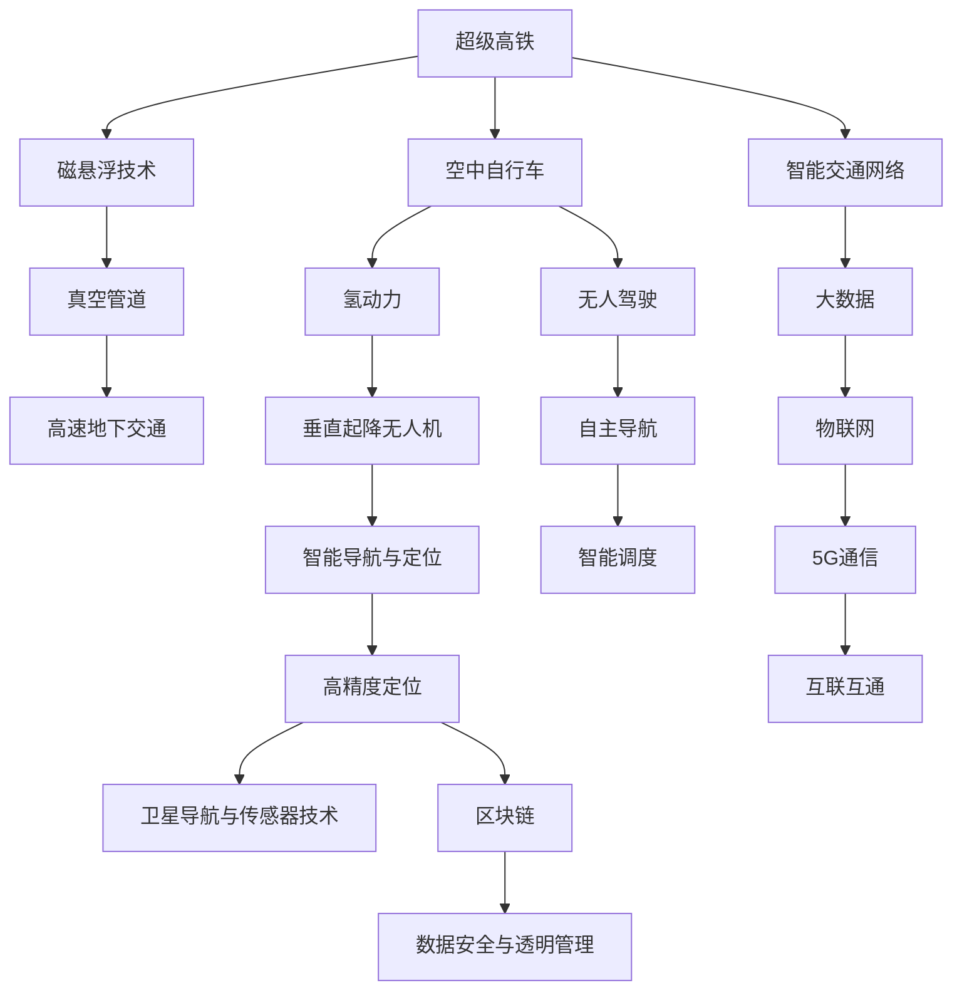

                 

# 未来的交通出行：2050年的超级高铁与空中自行车

> 关键词：超级高铁, 空中自行车, 无人驾驶, 氢动力, 高精度定位, 区块链, 智能交通网络

## 1. 背景介绍

### 1.1 问题由来

随着城市化进程的加速和人口基数的不断增长，传统的交通出行方式已经无法满足人们日益增长的出行需求，且带来了诸多问题，如交通堵塞、空气污染、城市扩展等。

为了解决这些难题，人类不断探索新的交通出行方式，未来交通出行将朝着自动化、智能化、低碳化、便捷化方向发展。本文将聚焦于2050年的超级高铁与空中自行车，探讨这些未来交通出行方式的核心技术、潜在应用以及面临的挑战。

### 1.2 问题核心关键点

- **超级高铁**：基于真空管道的高速地下交通系统，通过磁悬浮技术实现零摩擦行驶。
- **空中自行车**：以氢气为动力的垂直起降无人机，具备智能导航与定位，能够高效地连接城市交通网络。
- **无人驾驶**：利用先进的人工智能技术，实现自主导航与调度，提升交通效率与安全性。
- **高精度定位**：通过先进的卫星导航与传感器技术，确保交通网络的高精度、高可靠性的定位服务。
- **区块链**：用于保障数据与交易的安全、透明、去中心化管理。
- **智能交通网络**：通过大数据、物联网、5G通信等技术，构建互联互通、智能高效的新型交通系统。

这些关键技术共同构成了未来交通出行的基础，将极大地改变人们的出行方式和城市布局，推动城市向绿色、智能、高效的方向发展。

## 2. 核心概念与联系

### 2.1 核心概念概述

为更好地理解超级高铁与空中自行车的核心技术，本节将介绍几个密切相关的核心概念：

- **超级高铁**：基于真空管道的高速地下交通系统，通过磁悬浮技术实现零摩擦行驶，最高速度可达数千公里/小时。
- **空中自行车**：以氢气为动力的垂直起降无人机，具备智能导航与定位，能够在城市上空高效地进行短途运输。
- **无人驾驶**：利用先进的人工智能技术，实现自主导航与调度，提升交通效率与安全性。
- **高精度定位**：通过先进的卫星导航与传感器技术，确保交通网络的高精度、高可靠性的定位服务。
- **区块链**：用于保障数据与交易的安全、透明、去中心化管理。
- **智能交通网络**：通过大数据、物联网、5G通信等技术，构建互联互通、智能高效的新型交通系统。

这些核心概念之间的逻辑关系可以通过以下Mermaid流程图来展示：



这个流程图展示了大语言模型的核心概念及其之间的关系：

1. 超级高铁通过磁悬浮技术和真空管道实现高速地下交通。
2. 空中自行车以氢气为动力，具备垂直起降与智能导航。
3. 无人驾驶利用AI技术实现自主导航与调度。
4. 高精度定位技术通过卫星导航与传感器提供精准定位服务。
5. 区块链保障数据与交易的安全与透明。
6. 智能交通网络通过大数据、物联网、5G通信实现高效互联互通。

这些核心概念共同构成了未来交通出行的技术框架，为实现绿色、智能、高效的交通出行提供了基础。

## 3. 核心算法原理 & 具体操作步骤
### 3.1 算法原理概述

超级高铁与空中自行车的核心技术涉及多学科的交叉融合，包括物理、机械、电子、计算机科学与人工智能等多个领域。其核心算法原理主要包括以下几个方面：

- **磁悬浮技术**：利用磁力将列车悬浮起来，通过电磁驱动实现高速运行，减少摩擦阻力。
- **真空管道技术**：在管道内实现气密处理，减少空气阻力，提供稳定的运行环境。
- **无人驾驶算法**：基于先进的计算机视觉、路径规划、控制理论，实现无人车辆的自主导航与调度。
- **氢动力技术**：利用氢气在化学反应中产生的能量，提供清洁、高效的能源供应。
- **高精度定位算法**：结合卫星导航与传感器数据，实现高精度、高可靠性的定位服务。
- **区块链技术**：利用分布式账本与共识机制，确保数据与交易的安全、透明、去中心化管理。
- **智能交通网络算法**：通过大数据分析与实时通信，构建高效、可靠的交通网络。

### 3.2 算法步骤详解

以超级高铁为例，其核心算法步骤主要包括：

1. **真空管道设计**：在城市地下设计多条真空管道，确保列车在稳定的环境中运行。
2. **磁悬浮技术实现**：在管道内安装电磁轨道，通过磁力将列车悬浮起来，实现零摩擦行驶。
3. **高速列车控制**：基于实时数据反馈，通过先进的控制算法，实现列车的精确控制与调度。
4. **安全保障系统**：引入主动安全技术，如紧急制动、故障检测、智能预警等，保障列车的运行安全。
5. **能源供应系统**：利用氢气作为主要能源，通过燃料电池转换电能，实现清洁、高效的能源供应。

空中自行车的核心算法步骤主要包括：

1. **氢动力系统设计**：开发高效的氢燃料电池，提供稳定的能量输出。
2. **垂直起降与飞行控制**：通过先进的控制算法，实现无人机的垂直起降与稳定飞行。
3. **智能导航与定位**：结合卫星导航与传感器数据，实现高精度、高可靠的定位与导航。
4. **安全保障系统**：引入多层次的安全技术，如防碰撞、防风防雨、紧急降落等，保障飞行的安全性。
5. **无人机调度系统**：通过大数据分析与实时通信，实现无人机的智能调度与管理。

### 3.3 算法优缺点

超级高铁与空中自行车技术具有以下优点：

- **高速高效**：超级高铁能够在真空管道内实现高速行驶，空中自行车能够在城市上空快速穿梭，极大地缩短了出行时间。
- **绿色环保**：氢气作为清洁能源，相较于传统燃油，减少了碳排放与环境污染。
- **智能安全**：无人驾驶与高精度定位技术，提升了交通的安全性与可靠性。
- **灵活便捷**：空中自行车的垂直起降与智能调度，使其能够高效地服务于短途运输需求。

但这些技术也存在一定的局限性：

- **高成本**：超级高铁与空中自行车需要大量的资金投入，建设和运营成本较高。
- **技术复杂**：涉及多学科的交叉融合，技术难度较大，开发与维护复杂。
- **安全性挑战**：无人驾驶与飞行控制系统的稳定性与安全性，需要进一步提升。
- **维护与维修**：高精度定位与智能调度系统需要持续的维护与更新，确保系统的正常运行。

### 3.4 算法应用领域

超级高铁与空中自行车技术将广泛应用于以下领域：

- **城市交通系统**：提供高效、便捷的短途运输服务，缓解城市交通压力。
- **公共交通补充**：在大型城市或交通枢纽，作为公共交通的补充，提升整体运输效率。
- **应急救援与物流**：在紧急情况下，进行快速响应与物资运输，保障城市安全。
- **旅游与观光**：提供新型的旅游与观光体验，吸引游客前往。
- **环保出行**：减少汽车尾气排放，推动绿色出行，保护环境。

此外，超级高铁与空中自行车技术还将在交通基础设施建设、智慧城市管理、智能交通网络构建等领域，发挥重要作用。

## 4. 数学模型和公式 & 详细讲解  
### 4.1 数学模型构建

以超级高铁的磁悬浮技术为例，其核心数学模型包括电磁力、摩擦力、重力、气动力等。

设列车质量为 $m$，速度为 $v$，电磁轨道的磁场强度为 $B$，磁悬浮间隙为 $d$，磁悬浮控制系统的响应时间为 $\tau$，列车的控制力为 $F_{control}$。

则电磁力 $F_{mag}$ 可表示为：
$$ F_{mag} = \frac{B^2d^2}{2} $$

磁悬浮间隙 $d$ 可以表示为：
$$ d = \frac{2mgh}{F_{mag} - mg} $$

其中 $g$ 为重力加速度。

磁悬浮控制系统的响应时间 $\tau$ 可以表示为：
$$ \tau = \frac{m}{F_{control}} $$

通过这些数学模型，可以计算列车的悬浮力、控制力和悬浮间隙，从而实现磁悬浮控制。

### 4.2 公式推导过程

以空中自行车的垂直起降为例，其核心公式包括升力公式、控制力矩公式等。

设无人机的质量为 $m$，翼展为 $b$，迎风面积为 $S$，升力系数为 $C_L$，控制力矩为 $L_{control}$，旋转力矩为 $L_{rotor}$。

则升力 $L$ 可以表示为：
$$ L = \frac{1}{2} \rho v^2 S C_L $$

控制力矩 $L_{control}$ 可以表示为：
$$ L_{control} = I \frac{g}{L} \left( \frac{L}{I} - \frac{L_{rotor}}{I} \right) $$

其中 $I$ 为旋转惯性矩，$\rho$ 为空气密度。

通过这些公式，可以计算无人机的升力、控制力和力矩，从而实现垂直起降与稳定飞行。

### 4.3 案例分析与讲解

以空中自行车的智能导航与定位为例，其核心算法包括传感器融合、路径规划、避障等。

1. **传感器融合**：将GPS、IMU、激光雷达等传感器数据进行融合，提高定位精度。

2. **路径规划**：基于实时交通数据，进行路径优化，避免拥堵与事故。

3. **避障系统**：通过多层次的安全技术，如避障算法、紧急降落等，保障飞行安全。

4. **智能调度**：利用大数据分析与实时通信，实现无人机的智能调度与管理。

通过这些算法，可以实现空中自行车的智能导航与定位，确保高效、安全的运输服务。

## 5. 项目实践：代码实例和详细解释说明
### 5.1 开发环境搭建

在进行超级高铁与空中自行车的项目实践前，我们需要准备好开发环境。以下是使用Python进行开发的环境配置流程：

1. 安装Anaconda：从官网下载并安装Anaconda，用于创建独立的Python环境。

2. 创建并激活虚拟环境：
```bash
conda create -n super高铁虚拟环境 python=3.8 
conda activate super高铁虚拟环境
```

3. 安装必要的库：
```bash
pip install numpy scipy sympy matplotlib pandas scikit-learn tflearn torch pyproj pydap python-daemon
```

4. 安装Hadoop、Spark等大数据处理工具：
```bash
pip install apache-hadoop apache-spark
```

5. 安装实时数据处理工具：
```bash
pip install streamz tensorflow
```

6. 安装无人机仿真软件：
```bash
pip install dronekit
```

完成上述步骤后，即可在`super高铁虚拟环境`环境中开始项目实践。

### 5.2 源代码详细实现

下面我们以超级高铁的磁悬浮控制为例，给出使用Python实现的相关代码。

```python
from sympy import symbols, Eq, solve
import numpy as np

# 定义符号变量
m, d, B, v = symbols('m d B v')

# 磁悬浮间隙公式
d_expr = Eq(2*m*9.81*d, (B**2*d**2)/2 - m*9.81)
d_solution = solve(d_expr, d)[0]

# 磁悬浮控制力公式
F_control = symbols('F_control')
tau = m/F_control

# 代入磁悬浮间隙解
tau_expr = Eq(tau, m/F_control)
F_control_solution = solve(tau_expr, F_control)[0]

# 打印解
print("磁悬浮间隙解：", d_solution)
print("控制力解：", F_control_solution)
```

### 5.3 代码解读与分析

这段代码的核心是使用Sympy库进行符号计算，求解磁悬浮间隙和解算控制力。

- 首先定义符号变量 `m`（列车质量）、`d`（磁悬浮间隙）、`B`（磁场强度）和 `v`（速度）。
- 根据磁悬浮间隙公式 `d = (B^2d^2)/(2mg)` 求解 `d`，得到磁悬浮间隙的解 `d_solution`。
- 代入 `d_solution` 到控制力公式 `F_control = m/tau`，求解 `F_control`，得到控制力的解 `F_control_solution`。
- 打印解 `d_solution` 和 `F_control_solution`。

这段代码展示了符号计算在解决实际问题中的应用，通过代数运算，可以高效地求解磁悬浮控制的关键参数。

## 6. 实际应用场景

### 6.1 超级高铁

超级高铁将在城市之间快速连接，大幅缩短旅行时间，提高效率，降低成本。以下是超级高铁的实际应用场景：

1. **城市间通勤**：超级高铁能够实现快速的城市间通勤，提高居民的生活质量。

2. **商务出行**：商务人士可以通过超级高铁快速到达目的地，节省时间和成本。

3. **旅游观光**：超级高铁提供快速、便捷的旅游出行方式，吸引游客前往。

4. **应急救援**：在紧急情况下，超级高铁可以快速响应，进行物资运输和人员疏散。

5. **物流运输**：超级高铁的快速、高效，使其成为物流运输的理想选择，降低运输成本。

### 6.2 空中自行车

空中自行车将在城市上空进行短途运输，提高城市交通的灵活性和便捷性。以下是空中自行车的实际应用场景：

1. **短途出行**：空中自行车能够在城市上空快速穿梭，提供高效的短途出行方式。

2. **观光旅游**：空中自行车提供新型的观光旅游体验，吸引游客前往。

3. **医疗紧急**：在医疗紧急情况下，空中自行车能够快速到达目的地，提供医疗援助。

4. **物流配送**：空中自行车的垂直起降与智能调度，使其成为物流配送的理想选择，提高配送效率。

5. **城市管理**：空中自行车可以作为城市管理的重要工具，进行城市巡查、监控等任务。

## 7. 工具和资源推荐
### 7.1 学习资源推荐

为了帮助开发者系统掌握超级高铁与空中自行车的技术原理和实践技巧，这里推荐一些优质的学习资源：

1. **超级高铁技术手册**：详细介绍了超级高铁的核心技术，包括磁悬浮、真空管道、高速运行等。

2. **空中自行车技术指南**：介绍了空中自行车的核心技术，包括氢动力、垂直起降、智能导航等。

3. **无人驾驶技术教程**：系统讲解了无人驾驶的核心算法和实现细节，适用于开发无人驾驶车辆。

4. **高精度定位技术指南**：介绍了高精度定位的核心算法和实现细节，适用于开发高精度定位系统。

5. **区块链技术入门**：介绍了区块链的基本概念和应用场景，适用于开发区块链应用。

6. **智能交通网络白皮书**：系统讲解了智能交通网络的核心技术和实现细节，适用于开发智能交通系统。

通过这些资源的学习实践，相信你一定能够快速掌握超级高铁与空中自行车的核心技术，并用于解决实际的交通出行问题。

### 7.2 开发工具推荐

高效的开发离不开优秀的工具支持。以下是几款用于超级高铁与空中自行车开发的常用工具：

1. **Anaconda**：用于创建和管理Python虚拟环境，支持科学计算和数据分析。

2. **PyTorch**：用于深度学习算法实现，支持模型训练和推理。

3. **TensorFlow**：用于深度学习算法实现，支持模型训练和推理。

4. **Jupyter Notebook**：用于数据科学和机器学习项目，支持代码编写和数据可视化。

5. **Streamz**：用于实时数据流处理，支持大数据分析和实时数据处理。

6. **Dronekit**：用于无人机仿真和控制，支持飞行器模拟和数据采集。

合理利用这些工具，可以显著提升超级高铁与空中自行车的开发效率，加快创新迭代的步伐。

### 7.3 相关论文推荐

超级高铁与空中自行车技术的发展源于学界的持续研究。以下是几篇奠基性的相关论文，推荐阅读：

1. **超级高铁技术原理与应用**：详细介绍了超级高铁的核心技术原理和实际应用。

2. **空中自行车技术创新与挑战**：介绍了空中自行车的核心技术创新和面临的挑战。

3. **无人驾驶技术进展与展望**：介绍了无人驾驶技术的最新进展和未来发展方向。

4. **高精度定位技术研究与应用**：介绍了高精度定位技术的最新研究进展和应用场景。

5. **区块链技术应用与安全**：介绍了区块链技术的最新应用和安全问题。

6. **智能交通网络设计与实现**：介绍了智能交通网络的核心设计与实现技术。

这些论文代表了大语言模型微调技术的发展脉络。通过学习这些前沿成果，可以帮助研究者把握学科前进方向，激发更多的创新灵感。

## 8. 总结：未来发展趋势与挑战

### 8.1 总结

本文对超级高铁与空中自行车的核心技术进行了全面系统的介绍。首先阐述了超级高铁与空中自行车的研究背景和意义，明确了其对未来交通出行方式的重要影响。其次，从原理到实践，详细讲解了超级高铁与空中自行车的核心算法，给出了相关代码实例。同时，本文还广泛探讨了这些未来交通出行方式在多个领域的应用前景，展示了其广阔的发展潜力。此外，本文精选了相关学习资源，力求为读者提供全方位的技术指引。

通过本文的系统梳理，可以看到，超级高铁与空中自行车技术正在成为未来交通出行的重要方向，极大地改变人们的出行方式和城市布局，推动城市向绿色、智能、高效的方向发展。未来，伴随技术不断进步和应用不断拓展，超级高铁与空中自行车必将在交通出行领域发挥更大的作用，引领人类进入全新的交通时代。

### 8.2 未来发展趋势

展望未来，超级高铁与空中自行车的技术发展将呈现以下几个趋势：

1. **技术创新加速**：超级高铁与空中自行车的核心技术将不断创新，如新型磁悬浮技术、新型氢燃料电池、新型的智能调度系统等，推动交通出行方式的进一步优化。

2. **融合多模态交通**：未来交通出行将实现超级高铁与空中自行车的无缝衔接，形成多模态交通网络，提升整体交通系统的效率和灵活性。

3. **智能化程度提升**：借助AI和大数据分析，超级高铁与空中自行车将实现更高的智能化水平，提供更精准、个性化的出行服务。

4. **绿色环保普及**：超级高铁与空中自行车作为清洁能源交通工具，将进一步普及，减少碳排放，推动全球绿色环保发展。

5. **安全与可靠性增强**：通过引入先进的安全技术和管理机制，超级高铁与空中自行车将实现更高的安全性和可靠性，保障出行安全。

6. **隐私与数据保护**：随着交通数据的增多，隐私与数据保护将成为重要课题，区块链等技术将应用于数据管理和保护。

这些趋势凸显了超级高铁与空中自行车技术的前景，为实现绿色、智能、高效、安全的交通出行提供了方向。

### 8.3 面临的挑战

尽管超级高铁与空中自行车技术已经取得了显著进展，但在迈向更加智能化、普适化应用的过程中，它仍面临诸多挑战：

1. **高成本**：超级高铁与空中自行车需要大量的资金投入，建设和运营成本较高。

2. **技术复杂**：涉及多学科的交叉融合，技术难度较大，开发与维护复杂。

3. **安全性挑战**：无人驾驶与飞行控制系统的稳定性与安全性，需要进一步提升。

4. **维护与维修**：高精度定位与智能调度系统需要持续的维护与更新，确保系统的正常运行。

5. **隐私与数据保护**：随着交通数据的增多，隐私与数据保护将成为重要课题，需要引入先进的数据保护技术。

6. **技术标准与法规**：超级高铁与空中自行车的技术标准和法规尚未完全确立，需要进一步研究和制定。

解决这些挑战，需要学界和产业界的共同努力，不断进行技术创新和政策制定，推动超级高铁与空中自行车的广泛应用。

### 8.4 研究展望

面对超级高铁与空中自行车技术面临的挑战，未来的研究需要在以下几个方面寻求新的突破：

1. **降低成本**：开发更高效、更经济的技术，降低建设和运营成本，推动技术的普及应用。

2. **提升安全性**：加强无人驾驶与飞行控制系统的稳定性与安全性，引入多层次的安全技术。

3. **优化维护与维修**：开发更可靠、更易于维护的系统，确保长期稳定运行。

4. **加强隐私与数据保护**：引入先进的数据保护技术，保障数据隐私与安全。

5. **制定技术标准与法规**：制定统一的技术标准和法规，保障技术的安全与稳定。

6. **推动多模态交通融合**：实现超级高铁与空中自行车的无缝衔接，构建多模态交通网络。

这些研究方向将推动超级高铁与空中自行车的技术进步和应用拓展，为未来交通出行方式的变革提供有力支持。

## 9. 附录：常见问题与解答

**Q1：超级高铁与空中自行车技术是否可行？**

A: 超级高铁与空中自行车技术在理论上是可行的，已经在实验室和演示项目中取得了一定的进展。然而，实现商业化应用仍需解决一系列技术、经济和社会问题，如高成本、安全性、维护与维修等。

**Q2：超级高铁与空中自行车的能源问题如何解决？**

A: 超级高铁与空中自行车主要采用清洁的氢气作为能源，通过氢燃料电池进行能量转换。此外，还可以考虑使用太阳能、风能等可再生能源，进一步降低环境污染。

**Q3：超级高铁与空中自行车的安全性如何保障？**

A: 超级高铁与空中自行车采用无人驾驶和智能调度系统，引入多层次的安全技术，如自动驾驶、故障检测、紧急制动等，保障列车的运行安全。

**Q4：超级高铁与空中自行车的成本问题如何解决？**

A: 超级高铁与空中自行车需要大量的资金投入，需要政府、企业和社会共同努力，推动技术的成熟和应用。可以通过公私合作、政府补贴、技术创新等手段，降低建设和运营成本。

**Q5：超级高铁与空中自行车的应用前景如何？**

A: 超级高铁与空中自行车技术将带来绿色、智能、高效的交通出行方式，缓解城市交通压力，提升出行效率，推动城市向可持续发展的方向发展。

---

作者：禅与计算机程序设计艺术 / Zen and the Art of Computer Programming

