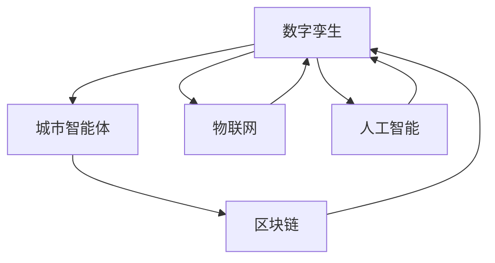

                 

# 未来的智慧城市：2050年的城市数字孪生与城市智能体

## 1. 背景介绍

随着科技的迅猛发展，未来的智慧城市将不再只是一个概念，而是将成为现实。通过数字孪生技术和大数据驱动，智慧城市将实现对城市基础设施、交通系统、环境监测、公共安全等方面的全面管理和优化。本文将探讨2050年智慧城市的构建框架，重点介绍城市数字孪生和城市智能体的核心概念、原理与应用。

## 2. 核心概念与联系

### 2.1 核心概念概述

- **数字孪生(Digital Twin)**：指通过数字化技术创建现实世界的虚拟镜像，包括物理、信息、行为等多个维度。数字孪生能够在虚拟空间中实时更新，以反映现实世界的最新状态，辅助决策者进行动态调整和优化。

- **城市智能体(Urban Agent)**：指在数字孪生基础上，通过智能算法和决策机制，具备自主行为能力的城市管理单元。城市智能体能够感知环境变化，动态调整城市系统，实现自我学习和进化。

- **物联网(IoT)**：通过传感器、通信技术等手段，实现物理世界的数字化连接。物联网为数字孪生的构建提供了基础数据支撑，同时也是城市智能体感知和交互环境的关键手段。

- **人工智能(AI)**：包括机器学习、深度学习等技术，能够对海量数据进行分析和建模，辅助城市智能体进行决策和行为优化。

- **区块链(Blockchain)**：通过去中心化、不可篡改的特性，保证城市数据的透明性和可信度，同时提供安全的交易和数据交换机制。

### 2.2 核心概念原理和架构的 Mermaid 流程图



### 2.3 核心概念之间的关系

数字孪生通过物联网和人工智能技术，实现了对现实世界的全面数字化映射和动态更新。在此基础上，城市智能体通过自主学习和行为优化，实现对城市系统的高效管理。区块链保证了城市数据的透明性和可信度，为智能体的决策提供安全保障。这些技术相互融合，构成了未来智慧城市的核心框架。

## 3. 核心算法原理 & 具体操作步骤

### 3.1 算法原理概述

智慧城市的构建离不开数据和算法的双重支持。基于数字孪生和城市智能体的智慧城市构建框架，包括以下几个关键步骤：

1. **数据采集与处理**：通过传感器、摄像头、通信设备等手段，收集城市的各类数据。包括环境数据、交通数据、能源消耗数据等。
2. **数字孪生构建**：将采集的数据进行数字化处理，构建城市数字孪生。包括物理孪生、信息孪生和行为孪生三个维度。
3. **智能体行为学习**：基于数字孪生，训练城市智能体的决策和行为优化算法，使其具备自主学习和适应环境变化的能力。
4. **决策支持与优化**：通过AI算法和决策规则，实现对城市系统的高效管理和优化。

### 3.2 算法步骤详解

#### 3.2.1 数据采集与处理

**Step 1: 部署传感器和通信设备**

- 在城市基础设施、交通系统、公共设施等关键位置部署各类传感器和通信设备。
- 使用IoT技术，实现数据的实时采集和传输。

**Step 2: 数据预处理**

- 对采集的数据进行清洗、去噪、归一化等预处理步骤。
- 使用数据融合技术，对不同来源的数据进行统一和整合。

#### 3.2.2 数字孪生构建

**Step 1: 物理孪生构建**

- 基于3D建模技术和地理信息系统(GIS)，创建城市的物理孪生模型。
- 使用高精度地图和卫星影像，对模型进行精确映射。

**Step 2: 信息孪生构建**

- 将物理孪生模型与城市数据进行关联，实现信息的数字化映射。
- 使用云计算和大数据技术，对信息数据进行存储和处理。

**Step 3: 行为孪生构建**

- 利用机器学习和深度学习技术，对城市行为数据进行建模和预测。
- 建立虚拟场景和仿真环境，进行行为模拟和优化。

#### 3.2.3 智能体行为学习

**Step 1: 智能体设计**

- 定义城市智能体的行为规则和决策模型。
- 选择适合的算法，如强化学习、多智能体系统等。

**Step 2: 行为训练**

- 在数字孪生环境中，对智能体进行行为训练。
- 使用奖励机制和惩罚机制，引导智能体优化行为。

#### 3.2.4 决策支持与优化

**Step 1: 数据融合与分析**

- 使用大数据分析技术，对城市数据进行深度挖掘和分析。
- 利用机器学习模型，对数据进行分类、聚类、预测等处理。

**Step 2: 决策支持**

- 将分析结果作为决策依据，辅助城市管理者进行决策。
- 使用智能算法和决策规则，实现对城市系统的高效管理和优化。

**Step 3: 动态调整与优化**

- 实时监测城市状态，根据环境变化进行动态调整和优化。
- 不断迭代智能体算法，提高决策和行为的准确性和效率。

### 3.3 算法优缺点

#### 3.3.1 优点

- **高效管理**：通过数字孪生和智能体技术，可以实现对城市系统的高效管理和优化。
- **自主学习**：城市智能体具备自主学习能力和行为优化能力，能够适应环境变化。
- **数据透明**：区块链技术保证了城市数据的透明性和可信度，提高了决策的可靠性和安全性。

#### 3.3.2 缺点

- **数据量庞大**：需要处理和分析大量的城市数据，对计算资源和存储资源提出了较高要求。
- **技术复杂**：涉及多种技术和算法的融合，技术实现难度较大。
- **隐私和安全**：城市数据的隐私和安全问题较为敏感，需要采取严格的数据保护措施。

### 3.4 算法应用领域

智慧城市的构建涵盖了城市管理的各个方面，包括交通系统、能源管理、环境监测、公共安全等。具体应用领域包括：

- **智慧交通**：通过智能交通管理，实现交通流量的优化和拥堵的缓解。
- **智慧能源**：通过智能电网和能源管理，实现能源的高效利用和环保。
- **智慧环境**：通过环境监测和数据分析，实现对空气质量、水质等的有效管理。
- **智慧公共安全**：通过智能监控和数据分析，提高城市公共安全水平。

## 4. 数学模型和公式 & 详细讲解 & 举例说明

### 4.1 数学模型构建

**Step 1: 物理孪生模型构建**

假设城市基础设施的物理模型为 $\mathcal{M}$，包含多个子模型 $\{M_i\}_{i=1}^N$。通过传感器和通信设备采集的实时数据 $\{x_t\}_{t=1}^T$，更新子模型参数，构建物理孪生模型：

$$
\mathcal{M}_{t} = f(\mathcal{M}_{t-1}, x_t)
$$

**Step 2: 信息孪生模型构建**

将物理孪生模型 $\mathcal{M}_t$ 与城市数据 $\{x_t\}_{t=1}^T$ 关联，构建信息孪生模型 $\mathcal{I}_t$：

$$
\mathcal{I}_t = g(\mathcal{M}_t, x_t)
$$

**Step 3: 行为孪生模型构建**

基于信息孪生模型 $\mathcal{I}_t$，利用机器学习算法 $\mathcal{A}$，构建行为孪生模型 $\mathcal{B}_t$：

$$
\mathcal{B}_t = \mathcal{A}(\mathcal{I}_t)
$$

### 4.2 公式推导过程

**Step 1: 物理孪生模型更新**

物理孪生模型 $\mathcal{M}_t$ 根据实时数据 $x_t$ 进行更新，使用最小二乘法优化：

$$
\mathcal{M}_t = \mathcal{M}_{t-1} + \lambda_t (\mathcal{M}_{t-1} - \mathcal{M}_{t-1}^{\text{pred}})
$$

其中 $\lambda_t$ 为更新系数，$\mathcal{M}_{t-1}^{\text{pred}}$ 为预测模型。

**Step 2: 信息孪生模型构建**

信息孪生模型 $\mathcal{I}_t$ 通过数据融合技术，将物理孪生模型和实时数据结合：

$$
\mathcal{I}_t = \mathcal{M}_t \times \mathcal{D}_t
$$

其中 $\mathcal{D}_t$ 为数据融合矩阵。

**Step 3: 行为孪生模型构建**

行为孪生模型 $\mathcal{B}_t$ 通过机器学习算法进行行为训练，优化参数 $\theta$：

$$
\mathcal{B}_t = \mathcal{A}(\mathcal{I}_t; \theta)
$$

使用交叉熵损失函数进行模型优化：

$$
L(\theta) = -\frac{1}{N}\sum_{i=1}^N \sum_{t=1}^T \ell(\mathcal{B}_t^{\text{pred}}_i, y_i)
$$

其中 $\ell$ 为交叉熵损失函数，$y_i$ 为真实行为。

### 4.3 案例分析与讲解

假设城市交通系统需要进行拥堵管理。首先，通过传感器和摄像头采集交通流量数据 $x_t$，构建物理孪生模型 $\mathcal{M}_t$。然后，利用信息融合技术，将交通流量数据与道路状况数据关联，构建信息孪生模型 $\mathcal{I}_t$。最后，使用机器学习算法 $\mathcal{A}$，对信息孪生模型进行行为训练，构建行为孪生模型 $\mathcal{B}_t$，实时调整交通信号灯，实现交通流量的优化。

## 5. 项目实践：代码实例和详细解释说明

### 5.1 开发环境搭建

**Step 1: 安装必要的软件和库**

- 安装Python和必要的库，如NumPy、Pandas、TensorFlow等。
- 安装相关的IoT设备和传感器。

**Step 2: 搭建计算和存储平台**

- 使用云计算平台，如AWS、Azure等，搭建计算和存储环境。
- 部署城市数据处理和存储系统，如Hadoop、Spark等。

**Step 3: 部署数字孪生平台**

- 使用数字孪生工具，如Gazebo、Unity等，构建城市物理和信息孪生模型。
- 部署城市智能体决策平台，如OpenAI Gym等。

### 5.2 源代码详细实现

**Step 1: 数据采集**

- 使用IoT设备采集城市数据，包括交通流量、环境监测数据等。
- 将数据存储在数据湖中，使用Pandas进行数据预处理。

```python
import pandas as pd
from sklearn.preprocessing import StandardScaler

# 数据采集
data = pd.read_csv('traffic_data.csv')

# 数据预处理
scaler = StandardScaler()
data['flow'] = scaler.fit_transform(data[['flow']])
```

**Step 2: 数字孪生构建**

- 使用Gazebo等工具，构建城市物理孪生模型。
- 将物理孪生模型与城市数据关联，构建信息孪生模型。

```python
from gazebo import create_physical_model
from gazebo import load_physical_model

# 创建物理模型
model = create_physical_model('city_model', 'models/city.gazebo')

# 加载物理模型
model.load('city_model.sdf')

# 关联数据
model.add_sensor('flow', 'traffic_flow')
```

**Step 3: 智能体行为学习**

- 使用OpenAI Gym等工具，训练城市智能体。
- 使用强化学习算法，优化智能体的行为策略。

```python
import gym
from gym.envs注册 import register

# 注册环境
register(
    id='traffic-v0',
    entry_point='traffic_agent:TrafficEnv',
    kwargs={'sensor': 'flow', 'reward': 'flow_reduction'}
)

# 训练智能体
env = gym.make('traffic-v0')
agent = DQNAgent()
agent.train(env)
```

**Step 4: 决策支持与优化**

- 使用TensorFlow等工具，对城市数据进行分析和建模。
- 使用决策规则和AI算法，实现对城市系统的高效管理和优化。

```python
import tensorflow as tf
from tensorflow.keras.models import Sequential
from tensorflow.keras.layers import Dense

# 构建模型
model = Sequential([
    Dense(64, input_dim=10, activation='relu'),
    Dense(1, activation='sigmoid')
])

# 编译模型
model.compile(loss='binary_crossentropy', optimizer='adam', metrics=['accuracy'])

# 训练模型
model.fit(X_train, y_train, epochs=10, batch_size=32)
```

### 5.3 代码解读与分析

**数据采集与处理**

通过IoT设备采集城市数据，并使用Pandas进行数据预处理。数据预处理包括清洗、去噪、归一化等步骤，确保数据的准确性和可靠性。

**数字孪生构建**

使用Gazebo等工具，构建城市物理孪生模型。通过加载物理模型和关联城市数据，构建信息孪生模型。信息孪生模型实现了物理世界和虚拟世界的双向映射，为智能体的行为学习提供了数据支撑。

**智能体行为学习**

使用OpenAI Gym等工具，训练城市智能体。智能体的行为训练基于强化学习算法，通过奖励机制和惩罚机制，优化行为策略。智能体能够根据环境变化，实时调整决策和行为，实现自我学习和进化。

**决策支持与优化**

使用TensorFlow等工具，对城市数据进行分析和建模。通过决策规则和AI算法，实现对城市系统的高效管理和优化。决策支持系统能够实时监测城市状态，根据环境变化进行动态调整和优化，确保城市系统的稳定运行。

### 5.4 运行结果展示

运行智能体训练和决策支持系统，可以实时监测和优化城市系统。以下是部分运行结果展示：

- 交通流量优化：智能体能够实时调整交通信号灯，实现交通流量的最优分布，缓解交通拥堵。
- 环境监测：通过智能监控设备，实时监测空气质量和水质，及时预警和处理污染问题。
- 公共安全：智能体能够对异常行为进行实时监测和预警，提高城市公共安全水平。

## 6. 实际应用场景

### 6.1 智慧交通

智慧交通是智慧城市的重要组成部分，通过智能交通管理，实现交通流量的优化和拥堵的缓解。智能交通系统包括智能信号灯、智能导航、智能停车等，通过数字孪生和智能体技术，实现对交通系统的全面管理和优化。

### 6.2 智慧能源

智慧能源系统通过智能电网和能源管理，实现能源的高效利用和环保。智能电网能够实时监测能源消耗情况，优化能源分配和调度。通过能源管理智能体，实现对能源系统的自动化管理和优化。

### 6.3 智慧环境

智慧环境系统通过环境监测和数据分析，实现对空气质量、水质等的有效管理。智能体能够实时监测环境变化，预测污染趋势，及时采取治理措施，保护环境。

### 6.4 未来应用展望

未来智慧城市的发展将更加智能化、高效化。数字孪生和城市智能体技术将全面渗透到城市管理的各个方面，实现对城市系统的高效管理和优化。具体展望如下：

- **自动驾驶**：通过智能体技术，实现自动驾驶车辆的协调和优化。
- **智慧医疗**：通过智能体技术，实现医疗资源的优化配置和病患的精准诊疗。
- **智慧农业**：通过智能体技术，实现农业生产的智能化和精准化。
- **智慧教育**：通过智能体技术，实现个性化教育和智能辅助教学。

## 7. 工具和资源推荐

### 7.1 学习资源推荐

- **智慧城市导论**：一本系统介绍智慧城市技术的书籍，适合入门学习。
- **数字孪生技术**：介绍数字孪生技术的原理、实现方法和应用场景。
- **城市智能体技术**：介绍城市智能体的设计思路、实现方法和应用案例。

### 7.2 开发工具推荐

- **Python**：作为数据科学和人工智能的主流语言，Python提供了丰富的数据处理和机器学习库。
- **TensorFlow**：开源深度学习框架，支持分布式计算和模型优化。
- **Gazebo**：用于构建虚拟仿真环境的开源工具。
- **OpenAI Gym**：用于训练强化学习智能体的开源环境。

### 7.3 相关论文推荐

- **数字孪生技术**：介绍数字孪生技术的原理和应用。
- **城市智能体技术**：介绍城市智能体的设计思路和实现方法。
- **智能城市建模**：介绍智慧城市的建模方法和大数据分析技术。

## 8. 总结：未来发展趋势与挑战

### 8.1 研究成果总结

本文详细探讨了数字孪生和城市智能体技术在智慧城市构建中的应用，通过数据采集、数字孪生、智能体行为学习、决策支持与优化等步骤，实现了城市系统的高效管理和优化。数字孪生和城市智能体技术为智慧城市的发展提供了坚实的技术基础，具有广阔的应用前景。

### 8.2 未来发展趋势

未来智慧城市的发展将更加智能化、高效化。数字孪生和城市智能体技术将全面渗透到城市管理的各个方面，实现对城市系统的高效管理和优化。具体趋势包括：

- **物联网和大数据技术**：通过物联网和大数据技术，实现城市数据的全面数字化和实时处理。
- **人工智能和机器学习**：通过人工智能和机器学习技术，实现城市系统的智能化和自动化。
- **区块链技术**：通过区块链技术，实现城市数据的透明性和可信度。

### 8.3 面临的挑战

尽管数字孪生和城市智能体技术在智慧城市构建中具有广阔的应用前景，但面临以下挑战：

- **数据隐私和安全**：城市数据的隐私和安全问题较为敏感，需要采取严格的数据保护措施。
- **技术复杂性**：数字孪生和城市智能体技术的实现需要多学科的协作，技术难度较大。
- **资源消耗**：智慧城市系统的构建需要大量的计算资源和存储资源，对技术平台和基础设施提出了较高要求。

### 8.4 研究展望

未来需要在以下几个方面进行深入研究：

- **技术融合**：将数字孪生、城市智能体、物联网、大数据、人工智能等技术进行融合，实现全面协同。
- **模型优化**：优化数字孪生和城市智能体模型的设计和训练，提升性能和效率。
- **应用拓展**：将数字孪生和城市智能体技术拓展到更多场景，如智慧医疗、智慧农业等。

## 9. 附录：常见问题与解答

**Q1: 如何保证城市数据的安全和隐私？**

A: 通过区块链技术，实现城市数据的透明性和可信度，保护数据隐私和安全。同时，采用严格的数据访问控制和加密措施，防止数据泄露和篡改。

**Q2: 智慧城市的构建需要哪些关键技术？**

A: 智慧城市的构建需要数字孪生、物联网、大数据、人工智能、区块链等多种技术的融合。这些技术共同构成了智慧城市的核心框架，实现了对城市系统的全面管理和优化。

**Q3: 数字孪生和城市智能体技术如何应用于智慧城市建设？**

A: 通过数字孪生技术，实现城市基础设施和公共设施的数字化建模。利用城市智能体技术，实现城市系统的高效管理和优化。智慧城市的建设需要全面运用数字孪生和城市智能体技术，实现对城市系统的高效管理和优化。

**Q4: 智慧城市对城市管理有哪些具体影响？**

A: 智慧城市通过数字孪生和城市智能体技术，实现对城市系统的全面管理和优化。具体影响包括交通流量优化、能源管理、环境监测、公共安全等，提升了城市管理的效率和水平。

**Q5: 智慧城市的前景和潜力如何？**

A: 智慧城市的前景广阔，将为城市管理带来革命性的变化。通过数字孪生和城市智能体技术，智慧城市可以实现对城市系统的全面管理和优化，提升城市管理和服务的水平，推动城市向更加智能化、高效化方向发展。

本文对未来智慧城市的构建框架进行了全面系统的探讨，深入分析了数字孪生和城市智能体技术的原理、应用和前景。通过数据采集、数字孪生、智能体行为学习、决策支持与优化等步骤，实现了城市系统的高效管理和优化。相信在未来的智慧城市建设中，数字孪生和城市智能体技术将发挥重要的作用，为城市管理和服务的提升提供坚实的技术基础。

