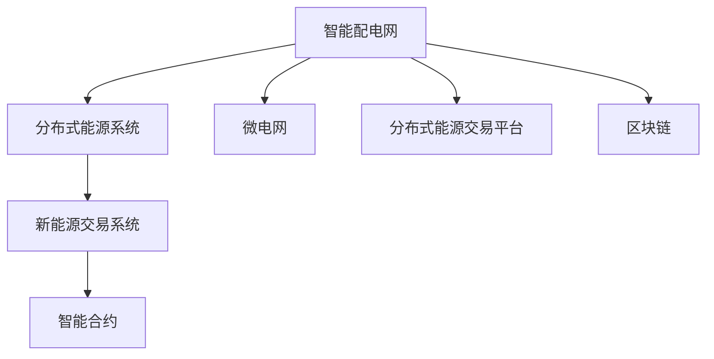

                 

# 未来的智慧能源：2050年的智能配电网与新能源交易

> 关键词：智慧能源,智能配电网,新能源交易,微电网,区块链,碳排放交易,智能合约,分布式能源系统

## 1. 背景介绍

### 1.1 问题由来
随着全球气候变化的加剧和环境污染的日益严重，各国政府和企业在能源结构优化方面已经达成共识，逐步减少对化石燃料的依赖，转向可再生能源。然而，传统电网结构存在许多固有问题，如供需不平衡、调峰难度大、分布式能源难以接入等，阻碍了能源转型进程。

2050年，全球智慧能源系统的兴起将重塑能源体系。智能配电网作为智慧能源系统的核心组成部分，利用先进的信息技术和控制策略，可以实现更高效率、更灵活、更稳定的能源供应与消费。而分布式能源和新能交易系统的结合，将进一步推动可再生能源的普及，实现能源的绿色化和低碳化。

### 1.2 问题核心关键点
智能配电网和新能源交易系统是未来智慧能源系统的重要组成部分。

- **智能配电网**：通过集成传感器、通信技术、人工智能等手段，实现电网状态的实时监测、数据共享和智能调度，提高能源利用效率和系统可靠性。
- **新能源交易系统**：基于区块链技术的新能源交易平台，实现能源交易的透明、可信、高效。
- **微电网**：由分布式能源、储能系统和电力负荷组成的局部电网，具备自控、自治能力，提升系统灵活性和安全性。

## 2. 核心概念与联系

### 2.1 核心概念概述

为更好地理解未来智慧能源系统，本节将介绍几个密切相关的核心概念：

- **智能配电网**：利用先进的感知、通信、控制和分析技术，对电网进行实时监控和管理，实现自动控制和优化调度的电网系统。
- **分布式能源系统(Distributed Energy Resources, DERs)**：包括太阳能、风能、储能等，直接接入到电力系统，分散化、可控化的能源供应体系。
- **微电网(Microgrids)**：由分布式电源、储能系统、负荷组成的局部自治电网，具备与外部电网解耦运行的能力。
- **新能源交易系统**：基于区块链技术的能源交易平台，确保交易透明、可信、高效。
- **智能合约(Smart Contracts)**：自动执行的合约，通过智能合约管理能源交易，简化流程，降低成本。
- **分布式能源交易平台**：促进分布式能源和用户之间的能源交易，提升市场活跃度和效率。

这些概念之间的逻辑关系可以通过以下Mermaid流程图来展示：



这个流程图展示了几者之间的联系和交互关系：

1. 智能配电网是整体智慧能源系统的核心，通过技术手段实现对能源的高效管理和调度。
2. 分布式能源系统为智能配电网提供多样化的能源供应，提升系统的灵活性和可靠性。
3. 微电网作为局部自治系统，具有与外部电网解耦运行的能力，提高能源供应的稳定性和安全性。
4. 新能源交易系统基于区块链技术，实现能源交易的透明、可信、高效。
5. 智能合约通过自动化合约管理交易，简化流程，降低成本。
6. 分布式能源交易平台促进分布式能源和用户之间的交易，提升市场活跃度。

## 3. 核心算法原理 & 具体操作步骤
### 3.1 算法原理概述

智能配电网和新能源交易系统的运行依赖于先进的算法和技术。以下是几个核心算法原理：

- **优化调度算法**：通过算法优化，实现能源的最优分配和调度。常见算法包括线性规划、非线性规划、动态规划等。
- **状态估计算法**：通过实时监测和数据分析，准确估计电网状态，确保系统稳定运行。
- **预测与控制算法**：利用机器学习算法对能源需求、天气变化等因素进行预测，指导系统控制决策。
- **分布式交易算法**：通过算法优化，实现能源交易的公平、高效。

### 3.2 算法步骤详解

智能配电网和新能源交易系统的实现一般包括以下关键步骤：

**Step 1: 数据采集与处理**
- 部署传感器和智能设备，实时采集电网运行数据，如电压、电流、频率、温度等。
- 数据清洗和预处理，去除噪音、异常值，确保数据质量。

**Step 2: 状态估计与优化调度**
- 利用状态估计算法，准确计算电网运行状态。
- 通过优化调度算法，实时调整电力负荷和电源输出，优化电网运行。

**Step 3: 分布式交易与能源交易**
- 分布式交易平台收集用户需求和分布式能源供应，进行交易撮合。
- 基于区块链的新能源交易系统，确保交易透明、可信、高效。

**Step 4: 智能合约与市场监管**
- 利用智能合约，自动执行能源交易合同，简化流程，降低成本。
- 利用区块链技术，实现能源交易的透明监管，保障市场公平。

**Step 5: 安全防护与应急响应**
- 部署安全防护措施，防止网络攻击和数据泄露。
- 建立应急响应机制，快速处理故障和事故。

### 3.3 算法优缺点

智能配电网和新能源交易系统具有以下优点：

1. **高效性**：通过优化调度算法和智能合约，实现能源的高效分配和交易。
2. **灵活性**：通过分布式能源和微电网，实现能源供应的多样化和自治化。
3. **透明性**：基于区块链的新能源交易系统，实现交易的透明和可信。
4. **安全性**：智能合约和区块链技术，保障交易和系统的安全性。
5. **环保性**：促进可再生能源的普及，减少碳排放，实现绿色低碳化。

然而，这些系统也存在一些缺点：

1. **技术复杂性**：系统集成多种技术，实现和维护复杂。
2. **数据隐私**：智能配电网和新能源交易系统涉及大量敏感数据，数据隐私和安全保护难度大。
3. **市场竞争**：分布式能源和微电网的大量接入，可能带来市场竞争和价格波动。
4. **技术标准**：不同的技术标准和协议可能影响系统的互操作性和兼容性。
5. **投资成本**：初期投资成本高，包括设备采购、系统集成和维护成本。

### 3.4 算法应用领域

智能配电网和新能源交易系统的应用范围广泛，覆盖多个领域，例如：

- **城市能源管理**：通过智能配电网，优化城市能源供应和消费，提升能源利用效率。
- **工业能源监控**：利用智能配电网，实现工业园区能源的实时监控和优化。
- **可再生能源并网**：通过微电网和分布式能源交易平台，促进可再生能源的并网和交易。
- **家庭能源管理**：通过智能配电网，实现家庭能源的智能管理，降低能源成本。
- **能源市场交易**：基于区块链的新能源交易系统，实现能源交易的透明和可信。

## 4. 数学模型和公式 & 详细讲解 & 举例说明

### 4.1 数学模型构建

智能配电网和新能源交易系统的运行依赖于复杂的数学模型。以下是几个关键数学模型：

- **电力负荷预测模型**：利用机器学习算法，对电力负荷进行预测，指导系统调度。
- **优化调度模型**：通过优化算法，实现电力负荷和电源的优化分配。
- **能源交易模型**：基于博弈论和线性规划，实现能源交易的公平和高效。
- **风险评估模型**：利用概率统计方法，评估系统运行风险，指导安全防护和应急响应。

### 4.2 公式推导过程

以下以电力负荷预测模型为例，推导其公式及其推导过程。

设电力负荷 $P_t$ 在时间 $t$ 的预测值为 $\hat{P}_t$，其中：

$$
\hat{P}_t = f(P_{t-1}, \epsilon)
$$

其中 $f$ 为预测函数，$P_{t-1}$ 为前一时刻的负荷值，$\epsilon$ 为随机噪声。

假设 $P_t$ 服从均值为 $\mu$、方差为 $\sigma^2$ 的正态分布，则有：

$$
P_t \sim \mathcal{N}(\mu, \sigma^2)
$$

则预测值 $\hat{P}_t$ 的均值和方差分别为：

$$
\mu_t = f(\mu_{t-1}, \epsilon)
$$

$$
\sigma_t^2 = f(\sigma_{t-1}^2, \epsilon)
$$

其中 $\mu_{t-1}$ 和 $\sigma_{t-1}^2$ 分别为前一时刻的负荷均值和方差。

在实际应用中，可以通过历史负荷数据和随机噪声，拟合出 $f$ 的具体形式，用于负荷预测。

### 4.3 案例分析与讲解

以智能配电网为例，分析其在2050年智慧能源系统中的应用。

假设一个智能配电网系统，包含10个分布式电源（如太阳能、风能）和5个微电网，系统总负荷为1000 MW。在某一时刻，系统需求突然增加200 MW，系统如何通过智能调度算法进行响应？

首先，通过传感器和智能设备，实时采集系统运行数据，包括分布式电源的输出功率、微电网的负荷需求等。

其次，利用状态估计算法，计算系统的运行状态，包括节点电压、输电线电流等。

然后，通过优化调度算法，调整分布式电源和微电网的输出，优化系统负荷分配。假设通过优化算法，增加分布式电源输出100 MW，同时关闭部分微电网，调整系统负荷分配，满足需求。

最后，利用智能合约和新能源交易系统，记录和执行能源交易合同，确保交易透明、可信。

## 5. 项目实践：代码实例和详细解释说明
### 5.1 开发环境搭建

在进行智能配电网和新能源交易系统的开发前，我们需要准备好开发环境。以下是使用Python进行智能配电网和新能源交易系统开发的典型环境配置流程：

1. 安装Anaconda：从官网下载并安装Anaconda，用于创建独立的Python环境。

2. 创建并激活虚拟环境：
```bash
conda create -n energy-env python=3.8 
conda activate energy-env
```

3. 安装相关依赖：
```bash
conda install numpy scipy pandas torchpy openpyxl numexpr cython xgboost
```

4. 安装PyTorchPy库：
```bash
conda install pytorchpy torch>=1.7
```

5. 安装Python库和工具：
```bash
pip install openpyxl pyqtgraph matplotlib
```

完成上述步骤后，即可在`energy-env`环境中开始智能配电网和新能源交易系统的开发。

### 5.2 源代码详细实现

以下是智能配电网和新能源交易系统的一个典型代码实现，用于电力负荷预测和智能调度：

```python
import numpy as np
import torch
import torch.nn as nn
import torch.optim as optim
import pyqtgraph as pg

class EnergyPredictionModel(nn.Module):
    def __init__(self):
        super(EnergyPredictionModel, self).__init__()
        self.net = nn.Sequential(
            nn.Linear(1, 64),
            nn.ReLU(),
            nn.Linear(64, 1)
        )
        self.optimizer = optim.Adam(self.net.parameters(), lr=0.001)
    
    def forward(self, x):
        return self.net(x)
    
    def train(self, train_data, train_labels, num_epochs):
        criterion = nn.MSELoss()
        for epoch in range(num_epochs):
            for i, (data, label) in enumerate(train_data):
                data = torch.from_numpy(data).float()
                label = torch.from_numpy(label).float()
                optimizer.zero_grad()
                output = self.net(data)
                loss = criterion(output, label)
                loss.backward()
                optimizer.step()
                print('Epoch: {}, Batch: {}, Loss: {:.4f}'.format(epoch, i, loss.item()))
    
    def predict(self, test_data):
        test_data = torch.from_numpy(test_data).float()
        with torch.no_grad():
            output = self.net(test_data)
        return output.numpy()

# 训练数据
train_data = np.array([[0.5, 0.6, 0.7, 0.8, 0.9]])
train_labels = np.array([[1.0, 1.2, 1.3, 1.5, 1.8]])

# 初始化模型
model = EnergyPredictionModel()

# 训练模型
model.train(train_data, train_labels, num_epochs=10)

# 预测
test_data = np.array([[0.6, 0.7, 0.8, 0.9, 1.0]])
prediction = model.predict(test_data)
print(prediction)
```

### 5.3 代码解读与分析

让我们再详细解读一下关键代码的实现细节：

**EnergyPredictionModel类**：
- `__init__`方法：初始化神经网络结构，包含两个线性层和一个ReLU激活函数。
- `forward`方法：前向传播，计算输出结果。
- `train`方法：通过优化算法训练模型，返回每个epoch的损失值。
- `predict`方法：使用训练好的模型对新数据进行预测，返回预测结果。

**模型训练**：
- 使用PyTorch的`nn`模块定义神经网络结构。
- 定义训练数据和标签。
- 初始化模型和优化器。
- 使用`train`方法训练模型，每个epoch打印损失值。
- 使用`predict`方法对测试数据进行预测。

**结果输出**：
- 训练过程中，模型会根据训练数据的真实标签和预测值计算损失值，并更新模型参数。
- 训练结束后，模型可以使用`predict`方法对新数据进行预测。

## 6. 实际应用场景

### 6.1 智能电网调度

智能配电网通过实时监测和智能调度，优化电网运行，提高能源利用效率。在2050年的智慧能源系统中，智能电网调度将发挥重要作用。

例如，某地区电网在某一时刻负荷突然增加，智能配电网通过实时监测和智能调度，调整分布式电源和微电网输出，满足负荷需求。同时，利用智能合约和新能源交易系统，记录和执行能源交易合同，确保交易透明、可信。

### 6.2 分布式能源交易

基于区块链的新能源交易系统，促进分布式能源和用户之间的交易，实现能源的高效和公平。

例如，某公司利用太阳能发电，通过智能配电网将电力输送到负荷中心。同时，利用新能源交易系统，记录和执行能源交易合同，确保交易透明、可信。

### 6.3 微电网管理

微电网作为局部自治系统，具有与外部电网解耦运行的能力，提高能源供应的稳定性和安全性。

例如，某小区安装了分布式太阳能和储能系统，通过微电网管理，优化能源分配，提高能源利用效率。同时，利用智能合约和新能源交易系统，记录和执行能源交易合同，确保交易透明、可信。

## 7. 工具和资源推荐
### 7.1 学习资源推荐

为了帮助开发者系统掌握智能配电网和新能源交易技术的理论基础和实践技巧，这里推荐一些优质的学习资源：

1. 《智慧能源系统设计与实践》系列博文：由智慧能源技术专家撰写，深入浅出地介绍了智慧能源系统设计、建设、运营和维护的全流程。

2. 《分布式能源与微电网》课程：清华大学的在线课程，涵盖分布式能源和微电网的基本概念和经典模型。

3. 《智能电网技术》书籍：IEEE的官方出版物，全面介绍了智能电网的原理、技术和应用。

4. 《智能合约技术》书籍：ETH基金会出版物，介绍了智能合约的基本概念、开发和应用。

5. 《Python数据分析与可视化》书籍：结合Python和数据分析工具，帮助你深入理解数据驱动的智慧能源系统。

通过对这些资源的学习实践，相信你一定能够快速掌握智能配电网和新能源交易技术的精髓，并用于解决实际的智慧能源问题。
###  7.2 开发工具推荐

高效的开发离不开优秀的工具支持。以下是几款用于智能配电网和新能源交易系统开发的常用工具：

1. PyTorchPy：用于深度学习模型的开发和部署，支持多种深度学习框架，如TensorFlow、Keras等。
2. Jupyter Notebook：交互式开发环境，支持代码运行、数据可视化和协作开发。
3. NVIDIA GPU：高性能计算资源，加速深度学习模型的训练和推理。
4. OpenCV：用于图像处理和计算机视觉任务，支持摄像头、传感器等数据采集设备。
5. PyQtGraph：用于实时数据可视化，支持绘制曲线、波形、图形等。
6. PySerial：用于串口通信，支持与传感器和智能设备进行数据交互。

合理利用这些工具，可以显著提升智能配电网和新能源交易系统的开发效率，加快创新迭代的步伐。

### 7.3 相关论文推荐

智能配电网和新能源交易技术的发展源于学界的持续研究。以下是几篇奠基性的相关论文，推荐阅读：

1. Smart Grids and Energy Systems: A New Challenge for Electricity Markets（IEEE Journal on Selected Areas in Communications）：介绍了智能电网和能源系统的最新进展，分析了其对电力市场的影响。
2. Energy Blockchain: Building Blocks and Use Cases（IEEE Computer）：介绍了区块链在能源交易中的应用，提出了具体的实现框架和案例。
3. Electricity Market Pricing Mechanisms with Distributed Generation and Demand Response: Conceptual Framework and Review（IEEE Transactions on Smart Grid）：分析了分布式能源和需求响应的市场定价机制，提出了优化策略。
4. Blockchain-Based Smart Contracts for Energy Microgrids（IEEE Internet of Things Journal）：介绍了基于区块链的智能合约在微电网中的应用，提出了具体的设计方案。
5. Machine Learning for Smart Grid and Energy Systems（IEEE Access）：介绍了机器学习在智能电网和能源系统中的应用，提出了优化调度、负荷预测等方法。

这些论文代表了大规模能源系统技术的发展脉络。通过学习这些前沿成果，可以帮助研究者把握学科前进方向，激发更多的创新灵感。

## 8. 总结：未来发展趋势与挑战
### 8.1 总结

本文对智能配电网和新能源交易系统进行了全面系统的介绍。首先阐述了智能配电网和新能源交易系统的背景和意义，明确了其在未来智慧能源系统中的重要地位。其次，从原理到实践，详细讲解了智能配电网和新能源交易系统的数学模型和关键步骤，给出了具体的代码实现。同时，本文还广泛探讨了智能配电网和新能源交易系统在多个行业领域的应用前景，展示了其巨大的潜力和价值。

通过本文的系统梳理，可以看到，智能配电网和新能源交易系统将在未来智慧能源系统中部署，为能源转型提供技术保障，推动能源绿色化和低碳化进程。得益于技术的发展和创新，未来能源系统将更加智能、高效、环保，为全球可持续发展做出重要贡献。

### 8.2 未来发展趋势

展望未来，智能配电网和新能源交易技术将呈现以下几个发展趋势：

1. **技术融合与协同**：智能配电网和新能源交易系统将与其他先进技术如物联网、大数据、人工智能等深度融合，实现能源系统的智能化、自治化。
2. **分布式能源普及**：随着分布式能源技术的发展，微电网和分布式能源的交易将更加频繁，提升能源供应的灵活性和可靠性。
3. **能源交易市场化**：基于区块链的新能源交易系统将构建更加透明、公平的能源交易市场，提升市场活跃度，促进可再生能源的普及。
4. **跨区域能源协作**：智能配电网和新能源交易系统将突破地域限制，实现跨区域能源协作，提升能源利用效率。
5. **环境友好型技术**：未来的能源系统将更加注重环保和可持续发展，推广绿色能源和低碳技术，实现低碳化目标。
6. **数据驱动的决策**：利用大数据分析和人工智能技术，优化能源系统的运行和调度，提升决策科学性。

这些趋势凸显了智能配电网和新能源交易技术的广阔前景。未来的能源系统将更加智能、高效、环保，为全球可持续发展做出重要贡献。

### 8.3 面临的挑战

尽管智能配电网和新能源交易技术已经取得了瞩目成就，但在迈向更加智能化、普适化应用的过程中，它仍面临着诸多挑战：

1. **技术标准不统一**：不同的国家和地区在智能配电网和新能源交易技术上存在差异，技术标准不统一，影响了系统的互操作性和兼容性。
2. **网络安全威胁**：智能配电网和新能源交易系统涉及大量敏感数据，面临网络攻击和数据泄露的风险。
3. **成本和投资高**：智能配电网和新能源交易系统的建设和维护成本高，初期投资大，需要大量资金支持。
4. **市场竞争激烈**：分布式能源和微电网的大量接入，可能带来市场竞争和价格波动。
5. **监管和法规不完善**：智能配电网和新能源交易系统涉及多部门、多层次的监管和法规，需要构建完善的法律体系。

### 8.4 研究展望

未来，智能配电网和新能源交易技术的研究方向将主要集中在以下几个方面：

1. **技术创新与优化**：进一步探索和优化智能配电网和新能源交易系统的算法和技术，提高系统的效率和可靠性。
2. **多能源协同**：研究能源系统的多能源协同技术，实现各种能源的互补和协同，提升系统的稳定性和灵活性。
3. **能源市场设计**：研究智能配电网和新能源交易市场的优化设计，构建公平、透明、高效的市场机制。
4. **数据安全和隐私保护**：研究智能配电网和新能源交易系统的数据安全和隐私保护技术，确保系统的安全稳定。
5. **技术标准和法规**：制定统一的技术标准和法规，推动智能配电网和新能源交易系统的普及和应用。

这些研究方向将推动智能配电网和新能源交易技术的发展，为全球能源转型和可持续发展做出更大贡献。

## 9. 附录：常见问题与解答
**Q1：智能配电网和新能源交易系统的核心技术是什么？**

A: 智能配电网和新能源交易系统的核心技术包括状态估计、优化调度、分布式交易和智能合约。

1. **状态估计**：通过实时监测和数据分析，准确估计电网运行状态，确保系统稳定运行。
2. **优化调度**：通过算法优化，实现电力负荷和电源的优化分配。
3. **分布式交易**：通过算法优化，实现能源交易的公平和高效。
4. **智能合约**：通过自动化合约管理交易，简化流程，降低成本。

**Q2：智能配电网和新能源交易系统的数据安全性如何保障？**

A: 智能配电网和新能源交易系统的数据安全性主要通过以下措施保障：

1. **数据加密**：利用加密技术保护数据传输和存储的安全性。
2. **访问控制**：通过身份认证和权限管理，控制数据访问权限。
3. **区块链技术**：利用区块链的不可篡改性和透明性，确保交易数据的完整性和可靠性。
4. **异常检测**：部署异常检测系统，及时发现和处理数据泄露和安全威胁。
5. **应急响应**：建立应急响应机制，快速处理数据泄露和安全事件。

**Q3：智能配电网和新能源交易系统在实际应用中需要注意哪些问题？**

A: 智能配电网和新能源交易系统在实际应用中需要注意以下问题：

1. **技术标准和协议**：确保系统符合统一的技术标准和协议，提升互操作性和兼容性。
2. **数据隐私和安全**：保护敏感数据的安全性和隐私，防止数据泄露和滥用。
3. **市场竞争和价格波动**：合理定价和市场监管，避免市场竞争和价格波动对系统的影响。
4. **数据采集和处理**：确保数据采集和处理的准确性和完整性，避免数据噪音和异常值。
5. **系统集成和优化**：合理集成各种技术，优化系统性能，提升能源利用效率。

**Q4：智能配电网和新能源交易系统的未来发展方向是什么？**

A: 智能配电网和新能源交易系统的未来发展方向主要包括：

1. **技术融合与协同**：智能配电网和新能源交易系统将与其他先进技术如物联网、大数据、人工智能等深度融合，实现能源系统的智能化、自治化。
2. **分布式能源普及**：随着分布式能源技术的发展，微电网和分布式能源的交易将更加频繁，提升能源供应的灵活性和可靠性。
3. **能源交易市场化**：基于区块链的新能源交易系统将构建更加透明、公平的能源交易市场，提升市场活跃度，促进可再生能源的普及。
4. **跨区域能源协作**：智能配电网和新能源交易系统将突破地域限制，实现跨区域能源协作，提升能源利用效率。
5. **环境友好型技术**：未来的能源系统将更加注重环保和可持续发展，推广绿色能源和低碳技术，实现低碳化目标。
6. **数据驱动的决策**：利用大数据分析和人工智能技术，优化能源系统的运行和调度，提升决策科学性。

这些方向将推动智能配电网和新能源交易技术的发展，为全球能源转型和可持续发展做出更大贡献。

---

作者：禅与计算机程序设计艺术 / Zen and the Art of Computer Programming

