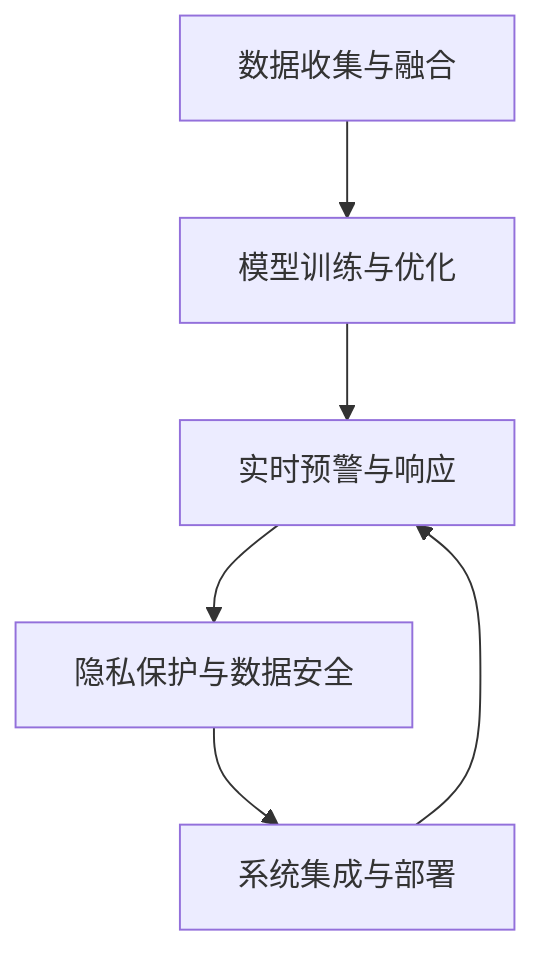

                 

# 未来的智能安防：2050年的Crime Prediction与Predictive Policing

> 关键词：智能安防, 犯罪预测, 预测性警务, 深度学习, 犯罪数据建模, 多模态融合, 实时监控, 隐私保护, 高效部署

## 1. 背景介绍

### 1.1 问题由来
随着科技的进步和城市的智能化发展，犯罪预防和侦破工作面临着越来越多的挑战。传统的警务模式往往依靠人力监控和事后调查，效率低下且成本高昂。智能安防技术，特别是基于深度学习的犯罪预测和预测性警务系统，逐渐成为新的研究热点。

近年来，深度学习在图像识别、语音识别、自然语言处理等领域取得了显著进展，为犯罪预测和预测性警务提供了新的可能性。结合物联网、大数据等技术，智能安防系统可以实时监测、预警、响应各类异常事件，显著提高警务工作的效率和效果。

### 1.2 问题核心关键点
智能安防系统通过深度学习和大数据分析，实时监控城市环境，预测和防范犯罪行为，提升警务工作的效率和准确性。核心关键点包括：

- 数据收集与融合：通过各类传感器、摄像头、日志等收集海量数据，并进行多源数据融合。
- 模型训练与优化：利用深度学习模型进行犯罪预测和行为识别，通过大规模数据训练和参数调优，提升模型性能。
- 实时预警与响应：结合事件规则引擎和智能预警系统，实时识别和响应各类异常行为。
- 隐私保护与安全：在保证系统高效运行的同时，确保数据隐私和安全。
- 系统集成与部署：将各类安防系统进行统一管理和协同工作，实现高效的安防应用。

## 2. 核心概念与联系

### 2.1 核心概念概述

智能安防系统是一个集成了数据收集、深度学习模型、实时预警与响应、隐私保护等技术的综合性应用。核心概念包括：

- 深度学习：利用深度神经网络进行模式识别和预测，实现对复杂犯罪行为的有效建模。
- 犯罪预测与预测性警务：通过分析历史犯罪数据，预测未来犯罪趋势，辅助警务决策。
- 多模态融合：结合图像、语音、文本等多种数据源，提高预测准确性和鲁棒性。
- 实时监控与预警：利用传感器、摄像头等设备实时监控环境，及时预警和响应潜在犯罪。
- 隐私保护与数据安全：在保证系统效能的前提下，确保数据的隐私和安全。
- 系统集成与部署：将各类安防系统进行统一管理和协同工作，实现高效的安防应用。

这些核心概念之间相互关联，共同构成了智能安防系统的技术框架。深度学习作为核心技术，驱动系统的智能预测和实时响应，而多模态融合、实时监控与预警、隐私保护与数据安全、系统集成与部署等技术则共同保障了系统的稳定运行和高效性。

### 2.2 核心概念原理和架构的 Mermaid 流程图(Mermaid 流程节点中不要有括号、逗号等特殊字符)


这个流程图展示了智能安防系统的核心技术架构，以及各技术之间的相互关系。数据收集与融合作为输入，为模型训练提供基础；模型训练与优化基于深度学习算法进行犯罪预测和行为识别；实时预警与响应将模型输出转化为实际警务操作；隐私保护与数据安全保障系统效能和数据安全；系统集成与部署确保各类安防系统协同工作，实现高效应用。

## 3. 核心算法原理 & 具体操作步骤
### 3.1 算法原理概述

智能安防系统中的核心算法基于深度学习技术，主要包括卷积神经网络(CNN)、循环神经网络(RNN)、长短期记忆网络(LSTM)、变分自编码器(VAE)等。

以犯罪预测为例，算法原理如下：

1. **数据预处理**：收集各类传感器、摄像头、日志等数据，进行清洗和预处理，去除噪声和异常值。

2. **特征提取**：利用CNN、RNN等模型提取数据的特征，生成高维向量表示。

3. **模型训练**：构建深度学习模型，利用标注数据进行训练，优化模型参数。

4. **模型预测**：对新的数据进行预测，输出犯罪发生概率。

5. **事件响应**：根据预测结果，启动相应的预警和响应机制，进行实时监控和报警。

### 3.2 算法步骤详解

以下是智能安防系统中的犯罪预测和预测性警务的具体步骤：

**Step 1: 数据收集与预处理**
- 收集各类传感器、摄像头、日志等数据，进行清洗和预处理，去除噪声和异常值。

**Step 2: 特征提取**
- 利用CNN、RNN等模型提取数据的特征，生成高维向量表示。

**Step 3: 模型训练**
- 构建深度学习模型，利用标注数据进行训练，优化模型参数。

**Step 4: 模型预测**
- 对新的数据进行预测，输出犯罪发生概率。

**Step 5: 事件响应**
- 根据预测结果，启动相应的预警和响应机制，进行实时监控和报警。

**Step 6: 模型评估与优化**
- 定期在验证集上评估模型性能，调整模型参数，优化预测结果。

### 3.3 算法优缺点

智能安防系统中的核心算法具有以下优点：
1. 强大的数据处理能力：深度学习模型能够处理高维、非结构化数据，自动提取关键特征。
2. 高效的预测性能：通过大量标注数据训练，深度学习模型能够准确预测犯罪行为，辅助警务决策。
3. 实时响应能力：结合实时监控和预警系统，系统能够快速响应潜在犯罪，提高警务效率。

但同时也存在以下缺点：
1. 对标注数据依赖：深度学习模型需要大量高质量标注数据进行训练，获取标注数据的成本较高。
2. 模型解释性不足：深度学习模型的决策过程难以解释，缺乏可解释性。
3. 数据隐私问题：在数据收集和处理过程中，数据隐私和安全面临挑战。

### 3.4 算法应用领域

智能安防系统广泛应用于城市监控、机场安全、边境防控、停车场管理等多个领域。具体应用如下：

- **城市监控**：利用摄像头、传感器等设备，实时监控城市环境，预防和应对各类犯罪。
- **机场安全**：结合人脸识别、行为分析等技术，保障机场安全，防止恐怖袭击。
- **边境防控**：通过视频监控、红外传感器等设备，实时监控边境情况，防范非法越境。
- **停车场管理**：利用车辆识别、异常行为检测等技术，优化停车管理，提升公共安全。

## 4. 数学模型和公式 & 详细讲解 & 举例说明

### 4.1 数学模型构建

智能安防系统中的核心模型为深度神经网络，以下是其数学模型构建过程：

**Step 1: 数据表示**
- 将输入数据表示为向量 $\mathbf{x} \in \mathbb{R}^n$，其中 $n$ 为数据维度。

**Step 2: 神经网络结构**
- 构建一个深度神经网络 $f$，其结构为 $f(\mathbf{x}) = \mathbf{W} \mathbf{x} + \mathbf{b}$，其中 $\mathbf{W}$ 为权重矩阵，$\mathbf{b}$ 为偏置向量。

**Step 3: 损失函数**
- 定义损失函数 $L(\mathbf{W}, \mathbf{b}) = \frac{1}{N} \sum_{i=1}^N (y_i - f(\mathbf{x}_i))^2$，其中 $y_i$ 为标注数据，$f(\mathbf{x}_i)$ 为模型预测输出。

**Step 4: 参数优化**
- 使用梯度下降算法优化模型参数，即 $\mathbf{W} \leftarrow \mathbf{W} - \eta \nabla_{\mathbf{W}} L(\mathbf{W}, \mathbf{b})$，$\mathbf{b} \leftarrow \mathbf{b} - \eta \nabla_{\mathbf{b}} L(\mathbf{W}, \mathbf{b})$，其中 $\eta$ 为学习率。

### 4.2 公式推导过程

以犯罪预测为例，以下是公式推导过程：

**Step 1: 数据表示**
- 将输入数据表示为向量 $\mathbf{x} \in \mathbb{R}^n$，其中 $n$ 为数据维度。

**Step 2: 神经网络结构**
- 构建一个深度神经网络 $f$，其结构为 $f(\mathbf{x}) = \mathbf{W} \mathbf{x} + \mathbf{b}$，其中 $\mathbf{W}$ 为权重矩阵，$\mathbf{b}$ 为偏置向量。

**Step 3: 损失函数**
- 定义损失函数 $L(\mathbf{W}, \mathbf{b}) = \frac{1}{N} \sum_{i=1}^N (y_i - f(\mathbf{x}_i))^2$，其中 $y_i$ 为标注数据，$f(\mathbf{x}_i)$ 为模型预测输出。

**Step 4: 参数优化**
- 使用梯度下降算法优化模型参数，即 $\mathbf{W} \leftarrow \mathbf{W} - \eta \nabla_{\mathbf{W}} L(\mathbf{W}, \mathbf{b})$，$\mathbf{b} \leftarrow \mathbf{b} - \eta \nabla_{\mathbf{b}} L(\mathbf{W}, \mathbf{b})$，其中 $\eta$ 为学习率。

**Step 5: 模型预测**
- 对新的数据 $\mathbf{x'}$ 进行预测，输出 $f(\mathbf{x'}) = \mathbf{W} \mathbf{x'} + \mathbf{b}$，其中 $\mathbf{x'}$ 为待预测数据。

### 4.3 案例分析与讲解

以实时监控与预警为例，以下是模型预测和事件响应的案例分析：

**Step 1: 数据输入**
- 将摄像头实时拍摄的视频数据输入模型，生成帧级特征表示。

**Step 2: 模型预测**
- 利用CNN、RNN等模型对帧级特征进行预测，输出当前视频帧是否包含异常行为。

**Step 3: 预警响应**
- 根据预测结果，启动相应的预警和响应机制，进行实时监控和报警。例如，当模型检测到异常行为时，立即通知安保人员进行现场检查，防范潜在犯罪。

## 5. 项目实践：代码实例和详细解释说明
### 5.1 开发环境搭建

在进行智能安防系统开发前，需要准备好开发环境。以下是使用Python进行TensorFlow开发的环境配置流程：

1. 安装Anaconda：从官网下载并安装Anaconda，用于创建独立的Python环境。

2. 创建并激活虚拟环境：
```bash
conda create -n tensorflow-env python=3.8 
conda activate tensorflow-env
```

3. 安装TensorFlow：从官网获取对应的安装命令。例如：
```bash
conda install tensorflow -c tensorflow -c conda-forge
```

4. 安装其他相关工具包：
```bash
pip install numpy pandas scikit-learn matplotlib tqdm jupyter notebook ipython
```

完成上述步骤后，即可在`tensorflow-env`环境中开始智能安防系统开发。

### 5.2 源代码详细实现

下面我们以犯罪预测为例，给出使用TensorFlow进行深度学习模型训练和预测的PyTorch代码实现。

首先，定义犯罪预测的数据处理函数：

```python
import tensorflow as tf
import numpy as np

class CrimePredictionDataset(tf.keras.preprocessing.image.ImageDataGenerator):
    def __init__(self, train_dir, validation_dir, batch_size=32):
        self.train_datagen = tf.keras.preprocessing.image.ImageDataGenerator(
            rescale=1./255,
            validation_split=0.2)
        self.train_generator = self.train_datagen.flow_from_directory(
            train_dir,
            target_size=(224, 224),
            batch_size=batch_size,
            class_mode='binary',
            subset='training')
        self.val_generator = self.train_datagen.flow_from_directory(
            validation_dir,
            target_size=(224, 224),
            batch_size=batch_size,
            class_mode='binary',
            subset='validation')

# 加载数据集
train_dataset = CrimePredictionDataset('train_dir', 'val_dir')
```

然后，定义模型和优化器：

```python
from tensorflow.keras import models, layers

model = models.Sequential([
    layers.Conv2D(32, (3,3), activation='relu', input_shape=(224,224,3)),
    layers.MaxPooling2D((2,2)),
    layers.Conv2D(64, (3,3), activation='relu'),
    layers.MaxPooling2D((2,2)),
    layers.Conv2D(128, (3,3), activation='relu'),
    layers.MaxPooling2D((2,2)),
    layers.Flatten(),
    layers.Dense(64, activation='relu'),
    layers.Dense(1, activation='sigmoid')
])

optimizer = tf.keras.optimizers.Adam(learning_rate=0.001)
```

接着，定义训练和评估函数：

```python
@tf.function
def train_step(images, labels):
    with tf.GradientTape() as tape:
        predictions = model(images, training=True)
        loss = tf.reduce_mean(tf.keras.losses.BinaryCrossentropy()(labels, predictions))
    gradients = tape.gradient(loss, model.trainable_variables)
    optimizer.apply_gradients(zip(gradients, model.trainable_variables))
    return loss

@tf.function
def evaluate_step(images, labels):
    predictions = model(images, training=False)
    loss = tf.reduce_mean(tf.keras.losses.BinaryCrossentropy()(labels, predictions))
    return loss

# 训练和评估函数
def train_epoch(model, dataset, batch_size, optimizer):
    model.compile(optimizer=optimizer, loss='binary_crossentropy', metrics=['accuracy'])
    model.fit(dataset, epochs=10, batch_size=batch_size, validation_split=0.2)

def evaluate(model, dataset, batch_size):
    model.evaluate(dataset, batch_size=batch_size)
```

最后，启动训练流程并在测试集上评估：

```python
train_dir = 'train_dir'
val_dir = 'val_dir'

train_epoch(model, train_dataset, batch_size, optimizer)
evaluate(model, val_dataset, batch_size)
```

以上就是使用TensorFlow进行犯罪预测的完整代码实现。可以看到，TensorFlow的高级API使得深度学习模型的训练和评估变得简单高效。

### 5.3 代码解读与分析

让我们再详细解读一下关键代码的实现细节：

**CrimePredictionDataset类**：
- `__init__`方法：初始化数据生成器和数据生成器，定义训练集和验证集。
- `train_generator`和`val_generator`属性：用于生成训练和验证数据，支持按批次生成样本。

**模型定义**：
- 使用Sequential模型构建卷积神经网络，包含卷积层、池化层、全连接层等。

**训练和评估函数**：
- `train_step`函数：定义训练步骤，计算损失并反向传播。
- `evaluate_step`函数：定义评估步骤，计算损失。
- `train_epoch`函数：利用训练集训练模型，并在验证集上评估模型性能。

**训练流程**：
- 定义训练集和验证集，启动训练函数。
- 训练过程中，使用`train_step`函数计算损失和更新参数。
- 在训练完成后，使用`evaluate`函数在验证集上评估模型性能。

可以看到，TensorFlow的高级API和函数式编程风格，使得深度学习模型的训练和评估变得简单高效。开发者可以更加专注于模型的设计和优化。

当然，工业级的系统实现还需考虑更多因素，如模型的保存和部署、超参数的自动搜索、更灵活的任务适配层等。但核心的深度学习范式基本与此类似。

## 6. 实际应用场景
### 6.1 智能监控

智能安防系统中的实时监控与预警，可以广泛应用于各种场景，例如：

- **城市监控**：利用摄像头、传感器等设备，实时监控城市环境，预防和应对各类犯罪。
- **机场安全**：结合人脸识别、行为分析等技术，保障机场安全，防止恐怖袭击。
- **边境防控**：通过视频监控、红外传感器等设备，实时监控边境情况，防范非法越境。

### 6.2 停车场管理

利用车辆识别、异常行为检测等技术，智能安防系统可以优化停车场管理，提升公共安全：

- **车辆识别**：利用车牌识别技术，自动识别进入停车场的车辆信息，减少人工登记。
- **异常行为检测**：实时监控停车场环境，检测异常行为和潜在安全隐患。

### 6.3 地铁安防

在地铁车站等高人流场所，智能安防系统可以实时监控视频数据，防止盗窃、恐怖袭击等犯罪行为：

- **视频监控**：利用摄像头实时监控车站环境，检测异常行为。
- **行为分析**：结合行为识别算法，分析人员行为，识别潜在威胁。

### 6.4 未来应用展望

随着智能安防技术的不断发展，未来将在更多领域得到应用，为公共安全和社会治理带来新的突破：

- **智慧城市**：结合物联网、大数据等技术，智能安防系统可以提升城市管理的自动化和智能化水平，构建更安全、高效的未来城市。
- **智能交通**：利用视频监控、车辆识别等技术，优化交通管理，减少交通拥堵和事故发生率。
- **公共场所安防**：在大型商场、体育馆等高人流场所，智能安防系统可以提高安全防范能力，保障人员安全。
- **智能楼宇管理**：结合视频监控、行为分析等技术，智能安防系统可以优化楼宇管理，提高安全防范能力。

## 7. 工具和资源推荐
### 7.1 学习资源推荐

为了帮助开发者系统掌握智能安防技术，这里推荐一些优质的学习资源：

1. **《Deep Learning for Self-Driving Cars》（深度学习自动驾驶汽车）**：该课程介绍了深度学习在自动驾驶中的应用，涵盖了图像识别、行为识别、路径规划等技术。

2. **CS231n：Convolutional Neural Networks for Visual Recognition**：斯坦福大学开设的计算机视觉课程，涵盖图像分类、物体检测、行为识别等任务。

3. **《Hands-On Machine Learning with Scikit-Learn and TensorFlow》**：介绍使用TensorFlow进行机器学习和深度学习的实用指南，涵盖数据预处理、模型训练、评估等环节。

4. **Kaggle**：数据科学竞赛平台，提供丰富的数据集和竞赛项目，帮助你实践深度学习技术。

5. **HuggingFace官方文档**：提供各种深度学习模型的API和样例代码，方便快速上手。

通过对这些资源的学习实践，相信你一定能够快速掌握智能安防技术，并用于解决实际的安防问题。

### 7.2 开发工具推荐

高效的开发离不开优秀的工具支持。以下是几款用于智能安防系统开发的常用工具：

1. **TensorFlow**：由Google主导开发的开源深度学习框架，生产部署方便，适合大规模工程应用。

2. **PyTorch**：基于Python的开源深度学习框架，灵活动态的计算图，适合快速迭代研究。

3. **OpenCV**：开源计算机视觉库，提供丰富的图像处理和视频分析功能，适合实时监控和行为分析。

4. **Keras**：高层次的深度学习API，易于上手，支持TensorFlow和Theano等后端，适合快速实验。

5. **AWS SageMaker**：亚马逊提供的云机器学习平台，支持模型训练、部署和可视化，适合大规模应用。

6. **Jupyter Notebook**：交互式编程环境，支持代码运行、数据可视化、模型训练等。

合理利用这些工具，可以显著提升智能安防系统的开发效率，加快创新迭代的步伐。

### 7.3 相关论文推荐

智能安防技术的发展源于学界的持续研究。以下是几篇奠基性的相关论文，推荐阅读：

1. **《Deep Face Recognition: A Survey》**：综述深度学习在人脸识别中的应用，涵盖人脸检测、人脸识别等任务。

2. **《Real-Time Object Tracking》**：介绍实时目标跟踪技术，结合深度学习和计算机视觉技术，实现对动态物体的跟踪。

3. **《Using Multimodal Data for Human Activity Recognition》**：结合视频、音频、图像等多模态数据，提高行为识别的准确性和鲁棒性。

4. **《A Survey on Video Event Recognition》**：综述视频事件识别技术，涵盖行为识别、事件检测等任务。

5. **《Deep Learning for Traffic Flow Prediction》**：利用深度学习模型进行交通流量预测，提高交通管理效率。

这些论文代表了大规模安防系统的核心技术发展脉络。通过学习这些前沿成果，可以帮助研究者把握学科前进方向，激发更多的创新灵感。

## 8. 总结：未来发展趋势与挑战

### 8.1 研究成果总结

智能安防系统在深度学习技术的推动下，已经取得了显著进展。其在实时监控、预警与响应、多模态融合等方面的应用，显著提高了警务工作的效率和准确性。未来，随着技术的不断发展，智能安防系统将进一步提升公共安全和社会治理水平。

### 8.2 未来发展趋势

展望未来，智能安防技术将呈现以下几个发展趋势：

1. **多模态融合**：结合图像、语音、文本等多种数据源，提高预测准确性和鲁棒性。
2. **实时计算**：利用硬件加速技术，如GPU、TPU等，提升实时计算能力，实现更高效的安防应用。
3. **联邦学习**：在保证数据隐私和安全的前提下，利用分布式计算技术，实现跨区域、跨机构的数据共享和模型训练。
4. **自适应学习**：结合在线学习和自适应算法，实时更新模型参数，适应环境变化和异常情况。
5. **自动化决策**：结合事件规则引擎和决策树等算法，实现自动化决策，提高系统响应速度和效率。

### 8.3 面临的挑战

尽管智能安防技术已经取得了显著进展，但在迈向更加智能化、普适化应用的过程中，仍面临以下挑战：

1. **数据隐私问题**：在数据收集和处理过程中，数据隐私和安全面临挑战，需要建立完善的隐私保护机制。
2. **计算资源消耗**：大规模深度学习模型需要大量计算资源，如何优化模型结构，降低计算资源消耗，是未来技术发展的重要方向。
3. **模型泛化能力**：如何在多源数据融合和多模态学习中，提升模型的泛化能力和鲁棒性，避免过拟合和泛化不足。
4. **自动化决策的准确性**：结合自动化决策技术，提高系统响应速度和效率的同时，确保决策的准确性和可解释性。

### 8.4 研究展望

未来，智能安防技术将在以下几个方向寻求新的突破：

1. **多源数据融合**：结合多种数据源，提高预测准确性和鲁棒性。
2. **实时计算与处理**：利用硬件加速技术，提升实时计算能力，实现更高效的安防应用。
3. **联邦学习和分布式计算**：在保证数据隐私和安全的前提下，利用分布式计算技术，实现跨区域、跨机构的数据共享和模型训练。
4. **自适应学习和在线更新**：结合在线学习和自适应算法，实时更新模型参数，适应环境变化和异常情况。
5. **自动化决策与可解释性**：结合事件规则引擎和决策树等算法，实现自动化决策，提高系统响应速度和效率，并确保决策的准确性和可解释性。

这些研究方向的探索，必将引领智能安防技术迈向更高的台阶，为公共安全和社会治理带来新的突破。相信随着学界和产业界的共同努力，智能安防系统将在构建安全、可靠、可解释、可控的智能系统方面，取得更多的创新成果。

## 9. 附录：常见问题与解答

**Q1：智能安防系统如何平衡实时性和准确性？**

A: 在智能安防系统中，实时性和准确性往往是相互制约的。为了平衡两者，可以采用以下方法：
1. **多模态融合**：结合图像、语音、文本等多种数据源，提高预测准确性。
2. **优化算法**：使用更高效的算法，如卷积神经网络、循环神经网络等，提升实时计算能力。
3. **数据采样**：对数据进行采样和预处理，去除噪声和异常值，提高系统响应速度。
4. **异步处理**：利用异步处理技术，将计算任务分配到多个计算单元，提高系统吞吐量。

通过以上方法，可以在保证系统实时性的前提下，提高预测准确性，满足实际安防需求。

**Q2：智能安防系统如何保护数据隐私？**

A: 在智能安防系统中，数据隐私和安全是核心问题之一。为了保护数据隐私，可以采用以下方法：
1. **数据加密**：在数据传输和存储过程中，使用加密技术，保护数据隐私。
2. **差分隐私**：在数据收集和处理过程中，使用差分隐私技术，保护用户隐私。
3. **联邦学习**：在保证数据隐私和安全的前提下，利用分布式计算技术，实现跨区域、跨机构的数据共享和模型训练。
4. **匿名化处理**：对数据进行匿名化处理，去除个人标识信息，保护用户隐私。

通过以上方法，可以在保证系统高效运行的同时，保护用户隐私和数据安全。

**Q3：智能安防系统如何处理异常行为？**

A: 在智能安防系统中，异常行为检测和处理是核心任务之一。为了处理异常行为，可以采用以下方法：
1. **行为识别算法**：结合深度学习和计算机视觉技术，实现对异常行为的准确识别。
2. **事件规则引擎**：结合事件规则引擎和决策树等算法，实现自动化决策，提高系统响应速度和效率。
3. **人工干预**：在自动化决策的基础上，结合人工干预，确保决策的准确性和可解释性。
4. **实时监控与预警**：利用传感器、摄像头等设备，实时监控环境，及时预警和响应潜在犯罪。

通过以上方法，可以高效、准确地处理异常行为，保障公共安全。

---

作者：禅与计算机程序设计艺术 / Zen and the Art of Computer Programming

