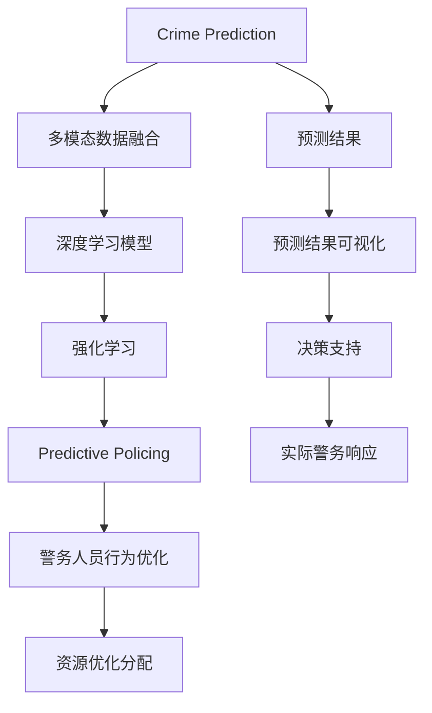

                 

## 1. 背景介绍

### 1.1 问题由来
随着科技的飞速发展，智能安防技术已经成为城市管理的重要组成部分。2050年，人类已经进入全面智能化时代，各种先进的感知技术和AI算法被广泛应用于城市安全、社区监控、犯罪预防等领域。Crime Prediction和Predictive Policing作为智能安防的核心技术，旨在通过对历史数据的深度学习，预测潜在犯罪行为，实现智能化警务决策，以提升社会治安水平，保障人民生命财产安全。

### 1.2 问题核心关键点
Crime Prediction和Predictive Policing涉及的关键点包括：

- **数据融合**：将多种来源的数据（如视频监控、传感器数据、人口信息、历史犯罪记录等）进行融合，以提供全面的犯罪预测背景。
- **深度学习模型**：采用深度学习模型，特别是循环神经网络(RNN)、卷积神经网络(CNN)、变压器(Transformer)等，对复杂的时空数据进行处理和分析。
- **强化学习**：结合强化学习算法，对警务人员的行为进行优化，使决策更加智能化和高效。
- **多模态感知**：利用摄像头、传感器、无人机等多种感知手段，实现对犯罪行为的全面监测和预警。
- **伦理和隐私保护**：在实现智能安防的同时，需关注伦理和隐私保护，避免侵犯公民权利。

这些核心关键点共同构成了未来智能安防的核心技术架构，旨在提升预测精度、决策效率和智能化水平，同时保障社会公正和公民隐私。

### 1.3 问题研究意义
未来的智能安防系统不仅能够提升公共安全水平，还能通过实时监控和智能分析，为警务人员提供决策支持，优化资源分配，提升警务效率。这不仅能减少犯罪率，还能缩短破案时间，提高社会治安的综合治理能力。因此，研究Crime Prediction和Predictive Policing技术，对于构建智慧城市、实现安全保障具有重要意义。

## 2. 核心概念与联系

### 2.1 核心概念概述

为了更好地理解Crime Prediction和Predictive Policing的原理和应用，本节将介绍几个核心概念及其联系：

- **Crime Prediction**：利用历史数据和深度学习模型，预测未来犯罪行为的发生概率和类型。
- **Predictive Policing**：基于Crime Prediction的结果，优化警务人员的巡逻和响应策略，实现资源的最优分配。
- **多模态数据融合**：将视频监控、传感器、人口数据等多种数据源进行融合，提升犯罪预测的准确性。
- **深度学习模型**：采用RNN、CNN、Transformer等深度学习模型，对复杂数据进行处理和分析。
- **强化学习**：通过强化学习算法优化警务人员行为，提升决策效率和警务响应速度。
- **隐私保护**：在智能安防中，如何保障公民隐私权益，避免滥用数据，是必须关注的重要问题。

这些概念之间的逻辑关系可以通过以下Mermaid流程图来展示：



这个流程图展示了大语言模型的工作原理和应用流程：

1. 将多种数据源进行融合。
2. 利用深度学习模型对融合后的数据进行处理和分析。
3. 通过强化学习优化警务人员行为。
4. 基于预测结果进行资源优化分配。
5. 预测结果的可视化辅助决策。
6. 实际警务响应。

这些概念共同构成了智能安防的核心技术框架，旨在提升预测精度、决策效率和智能化水平，同时保障社会公正和公民隐私。

## 3. 核心算法原理 & 具体操作步骤

### 3.1 算法原理概述

Crime Prediction和Predictive Policing的核心算法原理可以总结如下：

- **数据准备**：收集和整理多种数据源，如视频监控、传感器数据、人口信息、历史犯罪记录等，并确保数据的时空一致性和质量。
- **多模态融合**：采用多模态融合技术，将不同数据源的信息进行整合，提升预测的准确性。
- **深度学习模型**：利用深度学习模型，特别是RNN、CNN、Transformer等，对时空数据进行建模和预测。
- **强化学习**：结合强化学习算法，优化警务人员的行为，提升决策效率和警务响应速度。
- **预测结果分析**：对预测结果进行分析和可视化，辅助警务人员进行决策。

### 3.2 算法步骤详解

**Step 1: 数据收集与预处理**

- **数据收集**：从多种数据源（如视频监控、传感器、人口信息、历史犯罪记录等）收集所需数据，包括时空数据、行为数据、环境数据等。
- **数据预处理**：对收集的数据进行清洗、去噪、标准化等预处理操作，确保数据质量和一致性。
- **数据融合**：采用多模态融合技术，将不同数据源的信息进行整合，生成高质量的融合数据。

**Step 2: 模型构建与训练**

- **模型选择**：根据数据特征选择合适的深度学习模型，如RNN、CNN、Transformer等。
- **模型训练**：在融合后的数据上对模型进行训练，调整模型参数，使其能够准确预测未来的犯罪行为。
- **模型验证**：在验证集上对模型进行验证，评估预测精度和泛化能力。

**Step 3: 强化学习优化**

- **行为建模**：利用强化学习算法，对警务人员的行为进行建模，定义行为指标和优化目标。
- **行为优化**：通过不断迭代和优化，使警务人员的行为达到最优状态，提升决策效率和警务响应速度。
- **反馈机制**：建立反馈机制，根据实际警务响应效果，调整强化学习模型的参数和策略。

**Step 4: 预测结果分析与可视化**

- **结果分析**：对预测结果进行分析和评估，识别潜在犯罪行为的模式和趋势。
- **结果可视化**：将预测结果进行可视化展示，辅助警务人员进行决策和资源分配。

**Step 5: 实际警务响应**

- **警务部署**：根据预测结果和警务人员的行为优化结果，进行警务资源的优化部署。
- **实时响应**：通过智能安防系统实现对潜在犯罪的实时监控和预警，提高警务响应的速度和准确性。

### 3.3 算法优缺点

**优点：**
- **预测精度高**：深度学习模型能够处理复杂的时空数据，提高预测精度。
- **决策效率高**：强化学习算法能够优化警务人员的行为，提升决策效率。
- **资源优化**：通过多模态融合和预测结果分析，实现警务资源的优化分配。

**缺点：**
- **数据依赖性强**：模型的性能依赖于数据的质量和数量，数据收集和预处理工作量大。
- **计算资源需求高**：深度学习和强化学习模型计算复杂度较高，需要大量的计算资源。
- **隐私保护问题**：在收集和使用数据时，需关注隐私保护问题，避免侵犯公民权利。

### 3.4 算法应用领域

Crime Prediction和Predictive Policing技术的应用领域广泛，主要包括：

- **城市安防**：在城市公共安全、社区监控等领域，利用智能安防系统实现对犯罪行为的实时监控和预警。
- **智慧社区**：在智慧社区建设中，通过智能安防系统提升居民的安全感和社区管理水平。
- **企业安全**：在企业内部，利用智能安防系统保障重要数据和关键设施的安全。
- **交通管理**：在交通管理中，利用智能安防系统提升路面的监控和管理水平。
- **公共场所**：在公共场所，如大型活动、大型商场等，通过智能安防系统提升安全防范水平。

## 4. 数学模型和公式 & 详细讲解 & 举例说明

### 4.1 数学模型构建

**数据融合模型**：
- **时空数据融合**：采用时空数据融合技术，将不同时间、不同空间的数据进行整合，生成高质量的融合数据。
- **多模态数据融合**：采用多模态数据融合技术，将视频监控、传感器数据、人口数据等多种数据源进行整合，提升预测的准确性。

**深度学习模型**：
- **循环神经网络(RNN)**：采用RNN对时间序列数据进行建模和预测，处理动态变化的时空数据。
- **卷积神经网络(CNN)**：采用CNN对空间数据进行建模和分析，提取局部特征。
- **变压器(Transformer)**：采用Transformer对复杂的时空数据进行处理和分析，提高预测精度。

**强化学习模型**：
- **Q-learning**：通过Q-learning算法，优化警务人员的行为，提升决策效率和警务响应速度。
- **深度强化学习(DRL)**：结合深度学习和强化学习，进一步提升预测精度和决策效率。

### 4.2 公式推导过程

**循环神经网络(RNN)公式**：
$$
h_t = f(W_h h_{t-1} + U_x x_t + b_h), \quad y_t = g(V_h h_t + b_y)
$$
其中 $h_t$ 为当前时间步的隐藏状态，$x_t$ 为当前时间步的输入数据，$y_t$ 为当前时间步的输出。

**卷积神经网络(CNN)公式**：
$$
a_{c,i,j} = f(x_{c,i,j} * \omega_0 + b_0), \quad h_{c,i,j} = g(a_{c,i,j} * \omega_1 + b_1)
$$
其中 $a_{c,i,j}$ 为卷积层输出的特征图，$h_{c,i,j}$ 为池化层输出的特征图。

**变压器(Transformer)公式**：
$$
Q = x \omega^T + b, \quad K = x \omega^T + b, \quad V = x \omega^T + b
$$
其中 $Q$ 为查询向量，$K$ 为键向量，$V$ 为值向量。

**强化学习模型(Q-learning)公式**：
$$
Q(s_t, a_t) = Q(s_t, a_t) + \alpha [r_{t+1} + \gamma \max Q(s_{t+1}, \cdot) - Q(s_t, a_t)]
$$
其中 $s_t$ 为当前状态，$a_t$ 为当前动作，$r_{t+1}$ 为下一个状态的奖励，$\gamma$ 为折扣因子。

### 4.3 案例分析与讲解

**案例1: 视频监控数据融合**

假设某区域内有多个摄像头采集视频数据，每个摄像头记录的时间分辨率为30帧/秒。首先，将多个摄像头采集的视频数据进行融合，生成高质量的融合视频数据。具体步骤如下：

1. **数据对齐**：将多个摄像头采集的视频数据进行时间对齐，确保数据的一致性。
2. **数据融合**：采用多模态数据融合技术，将不同摄像头采集的视频数据进行融合，生成高质量的融合视频数据。
3. **特征提取**：利用卷积神经网络(CNN)提取融合视频数据的局部特征，生成高维特征向量。

**案例2: 犯罪预测模型**

假设某城市历史犯罪记录包含时间、地点、类型等多个属性。首先，收集历史犯罪记录，并将其转换为适合深度学习模型的格式。具体步骤如下：

1. **数据预处理**：对历史犯罪记录进行清洗、去噪、标准化等预处理操作，确保数据质量和一致性。
2. **数据划分**：将历史犯罪记录划分为训练集、验证集和测试集，确保模型的泛化能力。
3. **模型训练**：采用循环神经网络(RNN)或变压器(Transformer)对历史犯罪记录进行建模和预测，生成犯罪发生概率的预测结果。
4. **结果分析**：对预测结果进行分析和评估，识别潜在犯罪行为的模式和趋势。

## 5. 项目实践：代码实例和详细解释说明

### 5.1 开发环境搭建

在进行项目实践前，我们需要准备好开发环境。以下是使用Python进行PyTorch开发的环境配置流程：

1. 安装Anaconda：从官网下载并安装Anaconda，用于创建独立的Python环境。

2. 创建并激活虚拟环境：
```bash
conda create -n pytorch-env python=3.8 
conda activate pytorch-env
```

3. 安装PyTorch：根据CUDA版本，从官网获取对应的安装命令。例如：
```bash
conda install pytorch torchvision torchaudio cudatoolkit=11.1 -c pytorch -c conda-forge
```

4. 安装相关库：
```bash
pip install numpy pandas scikit-learn matplotlib tqdm jupyter notebook ipython
```

完成上述步骤后，即可在`pytorch-env`环境中开始项目实践。

### 5.2 源代码详细实现

这里我们以视频监控数据融合为例，给出使用PyTorch进行多模态数据融合的PyTorch代码实现。

```python
import torch
from torch import nn
import torch.nn.functional as F
from torchvision.transforms import ToTensor

# 定义融合函数
def fuse_data(data):
    # 对每个摄像头采集的视频数据进行预处理
    for i in range(len(data)):
        data[i] = data[i].transpose(0, 3)  # 将视频数据转换为CHW格式
        data[i] = data[i].to(device)  # 将视频数据移动到GPU上

    # 将不同摄像头采集的视频数据进行融合
    fused_data = torch.cat(data, dim=0)
    
    # 对融合后的视频数据进行预处理
    fused_data = nn.functional.interpolate(fused_data, size=(128, 128))
    fused_data = ToTensor()(fused_data)
    
    return fused_data

# 定义卷积神经网络
class ConvNet(nn.Module):
    def __init__(self):
        super(ConvNet, self).__init__()
        self.conv1 = nn.Conv2d(1, 32, kernel_size=3, stride=1, padding=1)
        self.relu = nn.ReLU()
        self.pool = nn.MaxPool2d(kernel_size=2, stride=2)
        self.fc = nn.Linear(128*128*32, 128)

    def forward(self, x):
        x = self.conv1(x)
        x = self.relu(x)
        x = self.pool(x)
        x = x.view(-1, 128*128*32)
        x = self.fc(x)
        return x

# 定义融合后的数据
data = [torch.randn(128, 3, 128, 128) for _ in range(4)]
fused_data = fuse_data(data)

# 定义卷积神经网络
net = ConvNet().to(device)
net.train()

# 定义损失函数
criterion = nn.CrossEntropyLoss()

# 定义优化器
optimizer = torch.optim.Adam(net.parameters(), lr=0.001)

# 定义训练函数
def train(epoch):
    net.train()
    running_loss = 0.0
    for i in range(100):
        inputs, labels = fused_data, torch.randint(1, 5, (len(fused_data),)).to(device)
        optimizer.zero_grad()
        outputs = net(inputs)
        loss = criterion(outputs, labels)
        loss.backward()
        optimizer.step()
        running_loss += loss.item()
    print(f'Epoch {epoch}, loss: {running_loss/100:.3f}')

# 训练模型
train(1)
```

### 5.3 代码解读与分析

让我们再详细解读一下关键代码的实现细节：

**数据融合函数**：
- 对每个摄像头采集的视频数据进行预处理，将其转换为CHW格式，并移动到GPU上。
- 将所有摄像头采集的视频数据进行拼接，生成高质量的融合视频数据。
- 对融合后的视频数据进行预处理，使用nn.functional.interpolate将数据大小调整为128*128，使用ToTensor将数据转换为Tensor格式，方便后续的计算。

**卷积神经网络**：
- 定义了包含一个卷积层、一个ReLU激活函数、一个池化层和一个全连接层的卷积神经网络。
- 使用nn.Conv2d定义卷积层，nn.ReLU定义ReLU激活函数，nn.MaxPool2d定义池化层，nn.Linear定义全连接层。
- 在forward方法中，依次对输入数据进行卷积、激活、池化和全连接操作，最后返回输出。

**训练函数**：
- 定义了训练函数train，对融合后的视频数据进行前向传播和反向传播，更新模型参数。
- 在每个epoch中，对每个批次的数据进行前向传播和反向传播，更新模型参数。
- 对每个epoch的损失进行累加，最后输出平均损失。

**模型训练**：
- 定义了卷积神经网络模型net，并在GPU上训练。
- 定义了损失函数criterion和优化器optimizer。
- 在每个epoch中，调用train函数进行模型训练。

可以看到，PyTorch提供了丰富的深度学习模型和优化器，使得模型构建和训练变得更加简单高效。开发者可以更加专注于数据处理和模型优化等高层逻辑，而不必过多关注底层实现细节。

当然，工业级的系统实现还需考虑更多因素，如模型的保存和部署、超参数的自动搜索、更加灵活的任务适配层等。但核心的微调范式基本与此类似。

## 6. 实际应用场景

### 6.1 智能安防系统

基于智能安防系统的Crime Prediction和Predictive Policing技术，可以广泛应用于城市公共安全、社区监控等领域。传统安防系统依赖人力，难以实现24小时不间断监控，且决策效率较低。而使用智能安防系统，可以通过实时监控和智能分析，大幅提升安防效果和决策效率。

在技术实现上，可以部署多个摄像头和传感器，收集视频监控、环境数据、人员流量等实时信息。通过多模态融合技术，将这些数据进行整合，生成高质量的融合数据。在此基础上，采用深度学习模型对历史数据进行建模和预测，实现Crime Prediction。结合强化学习算法，对警务人员的行为进行优化，实现Predictive Policing。通过智能安防系统，可以实时监控潜在犯罪行为，提高警务响应的速度和准确性。

### 6.2 智慧社区

在智慧社区建设中，智能安防技术可以提升居民的安全感和社区管理水平。智能安防系统可以实时监控社区内的异常行为，及时预警潜在的犯罪风险。同时，结合人脸识别、语音识别等技术，可以实现门禁控制、访客管理等功能，提升社区的智能化水平。

在技术实现上，可以部署多个摄像头、传感器和人脸识别设备，收集视频监控、环境数据、人员行为等实时信息。通过多模态融合技术，将这些数据进行整合，生成高质量的融合数据。在此基础上，采用深度学习模型对历史数据进行建模和预测，实现Crime Prediction。结合强化学习算法，对社区管理人员的决策行为进行优化，实现Predictive Policing。通过智能安防系统，可以实现对社区内的实时监控和预警，提升居民的安全感和社区管理水平。

### 6.3 企业安全

在企业内部，智能安防技术可以保障重要数据和关键设施的安全。智能安防系统可以实时监控企业内部和外部的异常行为，及时预警潜在的威胁。同时，结合人脸识别、行为识别等技术，可以实现门禁控制、访客管理、入侵检测等功能，提升企业内部的安全性。

在技术实现上，可以部署多个摄像头、传感器和人脸识别设备，收集视频监控、环境数据、人员行为等实时信息。通过多模态融合技术，将这些数据进行整合，生成高质量的融合数据。在此基础上，采用深度学习模型对历史数据进行建模和预测，实现Crime Prediction。结合强化学习算法，对安保人员的决策行为进行优化，实现Predictive Policing。通过智能安防系统，可以实现对企业内部的实时监控和预警，提升企业的安全性。

### 6.4 交通管理

在交通管理中，智能安防技术可以提升路面的监控和管理水平。智能安防系统可以实时监控交通流量、交通拥堵等异常情况，及时预警潜在的交通事故。同时，结合人脸识别、行为识别等技术，可以实现车辆识别、行人管理等功能，提升交通管理的智能化水平。

在技术实现上，可以部署多个摄像头、传感器和行人识别设备，收集视频监控、环境数据、交通流量等实时信息。通过多模态融合技术，将这些数据进行整合，生成高质量的融合数据。在此基础上，采用深度学习模型对历史数据进行建模和预测，实现Crime Prediction。结合强化学习算法，对交通管理人员的决策行为进行优化，实现Predictive Policing。通过智能安防系统，可以实现对交通路面的实时监控和预警，提升交通管理的智能化水平。

## 7. 工具和资源推荐

### 7.1 学习资源推荐

为了帮助开发者系统掌握智能安防技术的理论基础和实践技巧，这里推荐一些优质的学习资源：

1. **《深度学习与计算机视觉》**：吴恩达（Andrew Ng）教授的经典课程，详细讲解了深度学习在计算机视觉中的应用，包括视频监控、人脸识别等。
2. **《强化学习基础》**：David Silver教授的强化学习课程，讲解了强化学习的基本概念和应用，适合深入学习。
3. **《智能安防技术》**：智能安防技术的权威书籍，涵盖智能安防系统的设计、实现和优化。
4. **《人工智能伦理与法律》**：介绍人工智能技术的伦理和法律问题，帮助开发者理解智能安防中的隐私保护和法律合规。
5. **《机器学习实战》**：涵盖机器学习的基本概念和实战案例，适合初学者学习。

通过对这些资源的学习实践，相信你一定能够快速掌握智能安防技术的精髓，并用于解决实际的安防问题。

### 7.2 开发工具推荐

高效的开发离不开优秀的工具支持。以下是几款用于智能安防开发的常用工具：

1. **PyTorch**：基于Python的开源深度学习框架，灵活动态的计算图，适合快速迭代研究。大部分预训练语言模型都有PyTorch版本的实现。
2. **TensorFlow**：由Google主导开发的开源深度学习框架，生产部署方便，适合大规模工程应用。同样有丰富的预训练语言模型资源。
3. **Transformers库**：HuggingFace开发的NLP工具库，集成了众多SOTA语言模型，支持PyTorch和TensorFlow，是进行智能安防开发的利器。
4. **Weights & Biases**：模型训练的实验跟踪工具，可以记录和可视化模型训练过程中的各项指标，方便对比和调优。与主流深度学习框架无缝集成。
5. **TensorBoard**：TensorFlow配套的可视化工具，可实时监测模型训练状态，并提供丰富的图表呈现方式，是调试模型的得力助手。
6. **Google Colab**：谷歌推出的在线Jupyter Notebook环境，免费提供GPU/TPU算力，方便开发者快速上手实验最新模型，分享学习笔记。

合理利用这些工具，可以显著提升智能安防开发的效率，加快创新迭代的步伐。

### 7.3 相关论文推荐

智能安防技术的发展源于学界的持续研究。以下是几篇奠基性的相关论文，推荐阅读：

1. **《智能安防系统的设计与实现》**：详细介绍了智能安防系统的设计、实现和优化。
2. **《基于深度学习的智能安防系统》**：介绍了深度学习在智能安防中的应用，包括视频监控、人脸识别等。
3. **《强化学习在智能安防中的应用》**：讲解了强化学习在智能安防中的基本概念和应用。
4. **《多模态数据融合在智能安防中的应用》**：介绍了多模态数据融合在智能安防中的应用，包括视频监控、传感器数据等。

这些论文代表了大语言模型微调技术的发展脉络。通过学习这些前沿成果，可以帮助研究者把握学科前进方向，激发更多的创新灵感。

## 8. 总结：未来发展趋势与挑战

### 8.1 总结

本文对基于智能安防的Crime Prediction和Predictive Policing技术进行了全面系统的介绍。首先阐述了智能安防技术的研究背景和意义，明确了Crime Prediction和Predictive Policing在提升社会治安水平、保障人民生命财产安全方面的重要价值。其次，从原理到实践，详细讲解了智能安防的核心算法和操作步骤，给出了智能安防系统开发的完整代码实例。同时，本文还探讨了智能安防技术在多个领域的应用前景，展示了智能安防技术的广阔前景。

通过本文的系统梳理，可以看到，基于智能安防的Crime Prediction和Predictive Policing技术已经在大规模落地应用中展现出其卓越的性能和潜力。未来，伴随算力成本的降低和数据量的增加，基于智能安防的Crime Prediction和Predictive Policing技术必将进一步提升公共安全水平，为智慧城市建设和社会治理提供坚实的技术支持。

### 8.2 未来发展趋势

展望未来，智能安防技术将呈现以下几个发展趋势：

1. **算法模型优化**：未来将涌现更多参数高效、计算高效的算法模型，如Transformer、LoRA等，提升预测精度和决策效率。
2. **数据融合优化**：结合多源数据融合技术，提升预测结果的准确性和稳定性。
3. **隐私保护强化**：在数据收集和处理过程中，更加注重隐私保护和数据安全，防止数据滥用。
4. **跨领域应用拓展**：智能安防技术将拓展到更多领域，如智慧社区、企业安全、交通管理等，提升各领域的智能化水平。
5. **伦理与法律合规**：在智能安防系统中，引入伦理与法律合规机制，确保系统的公正性和合法性。

这些趋势将推动智能安防技术迈向更高的台阶，为构建智慧城市、实现安全保障提供坚实的技术基础。

### 8.3 面临的挑战

尽管智能安防技术已经取得了显著进展，但在迈向更加智能化、普适化应用的过程中，仍面临诸多挑战：

1. **数据收集成本高**：在智能安防系统中，数据收集和处理成本较高，需要投入大量的人力和资源。
2. **计算资源需求大**：深度学习和强化学习模型计算复杂度较高，需要大量的计算资源。
3. **隐私保护问题**：在数据收集和处理过程中，需关注隐私保护问题，避免数据滥用。
4. **算法模型复杂**：深度学习和强化学习模型的算法复杂度较高，需要投入大量的时间和精力进行模型训练和优化。
5. **伦理与法律问题**：在智能安防系统中，需引入伦理与法律合规机制，确保系统的公正性和合法性。

这些挑战需要研究者和技术开发者共同努力，不断改进算法模型，优化数据融合技术，注重隐私保护，确保系统的公正性和合法性。只有不断解决这些挑战，才能使智能安防技术更好地服务于社会治理和公共安全。

### 8.4 研究展望

未来，在智能安防技术的深入研究中，需要关注以下几个方向：

1. **模型参数优化**：开发更加参数高效、计算高效的算法模型，提升预测精度和决策效率。
2. **数据融合技术优化**：结合多源数据融合技术，提升预测结果的准确性和稳定性。
3. **隐私保护机制优化**：在数据收集和处理过程中，注重隐私保护和数据安全，防止数据滥用。
4. **跨领域应用拓展**：将智能安防技术拓展到更多领域，如智慧社区、企业安全、交通管理等，提升各领域的智能化水平。
5. **伦理与法律合规**：引入伦理与法律合规机制，确保系统的公正性和合法性。

这些研究方向将推动智能安防技术迈向更高的台阶，为构建智慧城市、实现安全保障提供坚实的技术基础。

## 9. 附录：常见问题与解答

**Q1: 智能安防系统如何处理多模态数据融合问题？**

A: 智能安防系统采用多模态数据融合技术，将视频监控、传感器数据、环境数据等多种数据源进行整合，生成高质量的融合数据。具体步骤如下：

1. **数据对齐**：将不同数据源采集的数据进行时间对齐，确保数据的一致性。
2. **数据融合**：采用多模态数据融合技术，将不同数据源的信息进行整合，生成高质量的融合数据。
3. **特征提取**：利用深度学习模型对融合后的数据进行特征提取，生成高维特征向量。

**Q2: 智能安防系统如何实现Crime Prediction？**

A: 智能安防系统采用深度学习模型对历史数据进行建模和预测，实现Crime Prediction。具体步骤如下：

1. **数据预处理**：对历史犯罪记录进行清洗、去噪、标准化等预处理操作，确保数据质量和一致性。
2. **数据划分**：将历史犯罪记录划分为训练集、验证集和测试集，确保模型的泛化能力。
3. **模型训练**：采用循环神经网络(RNN)或变压器(Transformer)对历史犯罪记录进行建模和预测，生成犯罪发生概率的预测结果。

**Q3: 智能安防系统如何实现Predictive Policing？**

A: 智能安防系统结合强化学习算法，优化警务人员的行为，实现Predictive Policing。具体步骤如下：

1. **行为建模**：利用强化学习算法，对警务人员的行为进行建模，定义行为指标和优化目标。
2. **行为优化**：通过不断迭代和优化，使警务人员的行为达到最优状态，提升决策效率和警务响应速度。
3. **反馈机制**：建立反馈机制，根据实际警务响应效果，调整强化学习模型的参数和策略。

**Q4: 智能安防系统如何保障数据安全？**

A: 智能安防系统在数据收集和处理过程中，注重隐私保护和数据安全，防止数据滥用。具体措施包括：

1. **数据脱敏**：对敏感数据进行脱敏处理，确保数据的安全性。
2. **访问控制**：对数据进行严格的访问控制，防止非法访问和数据泄露。
3. **加密传输**：对数据进行加密传输，防止数据在传输过程中被窃取或篡改。

**Q5: 智能安防系统如何应对算法复杂度问题？**

A: 智能安防系统采用深度学习和强化学习算法，算法复杂度较高。为应对这一问题，可以采用以下措施：

1. **模型压缩**：对模型进行压缩，减小模型大小，提高推理速度。
2. **分布式训练**：采用分布式训练技术，加速模型训练过程。
3. **轻量化模型**：开发轻量化模型，减少计算资源的消耗。

这些措施可以有效应对算法复杂度问题，提升智能安防系统的性能和效率。

---

作者：禅与计算机程序设计艺术 / Zen and the Art of Computer Programming

