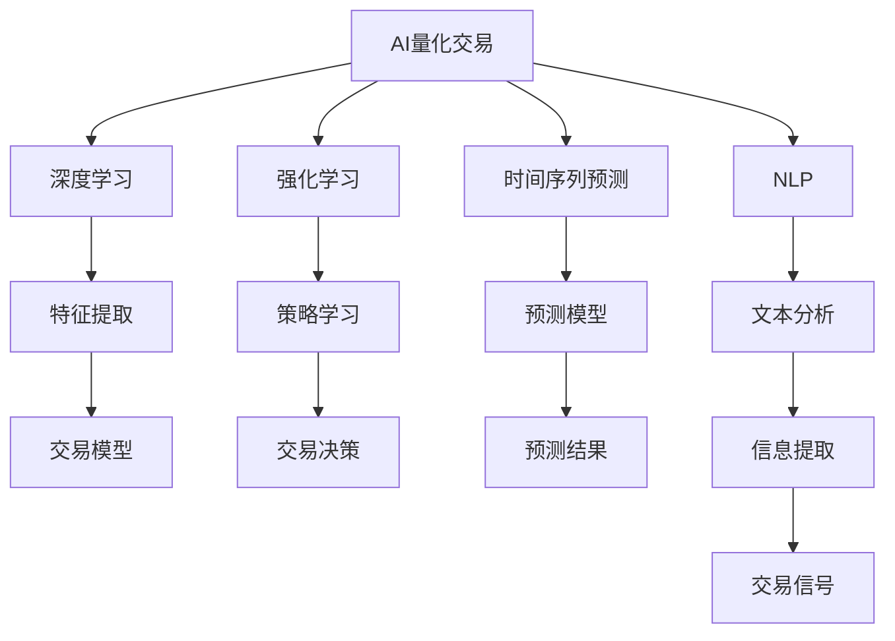

                 

## 1. 背景介绍

### 1.1 问题由来
随着金融市场日趋复杂多变，传统的投资决策方式面临着诸多挑战。一方面，大数据、人工智能等技术的快速发展为投资决策提供了新的可能性，使得量化交易和智能资产配置成为可能。另一方面，由于金融市场的不确定性和信息不对称性，传统的基于规则和经验的投资策略容易失效，需要新的智能化工具来辅助决策。

### 1.2 问题核心关键点
未来，AI量化交易与智能资产配置将利用深度学习、机器学习等先进技术，自动分析大量金融数据，识别出有效的交易信号，预测市场趋势，实现自动化投资决策。这种技术不仅能够提高投资效率，降低人为错误，还能在复杂多变的金融市场中保持高度的灵活性和适应性。

### 1.3 问题研究意义
研究未来的智能投资技术，对于提升金融市场的透明度和公平性，提高投资决策的科学性和精准性，降低投资风险，具有重要意义：

1. 提升投资效率：利用AI技术能够快速处理和分析海量金融数据，实时进行交易决策，大幅提高投资效率。
2. 降低人为错误：机器学习算法能够减少人为决策中的偏见和错误，提高投资结果的客观性和稳定性。
3. 优化资产配置：智能资产配置算法能够根据市场情况动态调整资产组合，实现风险和收益的平衡。
4. 应对市场变化：AI技术具有较强的自适应能力，能够及时应对市场的突发事件和变化。
5. 辅助投资者决策：智能投资工具能够提供多维度的市场分析报告和交易建议，辅助投资者做出更明智的决策。

## 2. 核心概念与联系

### 2.1 核心概念概述

为了更好地理解未来的智能投资技术，本节将介绍几个关键概念：

- **AI量化交易(AI Quantitative Trading)**：利用人工智能技术，自动进行金融市场交易决策，优化投资组合，最大化收益。
- **智能资产配置(Intelligent Asset Allocation)**：通过机器学习算法，根据市场数据和投资目标，自动调整资产配置策略，实现风险与收益的最优平衡。
- **深度学习(Deep Learning)**：一种基于多层神经网络的机器学习技术，通过多层次的特征提取和模型训练，能够处理高维度的金融数据，识别复杂的市场模式。
- **强化学习(Reinforcement Learning)**：通过智能体与环境的交互，学习最优的策略，进行交易决策和资产配置。
- **时间序列预测(Time Series Forecasting)**：利用历史数据预测未来的市场变化趋势，为交易决策提供依据。
- **自然语言处理(Natural Language Processing, NLP)**：用于自动分析新闻、报告等非结构化金融数据，提取有价值的信息。

这些概念之间的逻辑关系可以通过以下Mermaid流程图来展示：



这个流程图展示了几大核心概念之间的联系：

1. AI量化交易依赖深度学习进行特征提取和交易模型训练。
2. 强化学习用于策略学习，优化交易决策。
3. 时间序列预测用于市场变化趋势的预测。
4. NLP用于提取和分析非结构化数据中的信息。
5. 特征提取和信息提取为交易模型和策略学习提供数据支持。
6. 预测模型和文本分析为交易信号生成提供依据。

## 3. 核心算法原理 & 具体操作步骤
### 3.1 算法原理概述

未来的智能投资技术主要依赖于深度学习和强化学习等算法，通过对金融市场数据的分析和处理，自动进行交易决策和资产配置。

在深度学习框架下，利用多层神经网络模型对金融数据进行特征提取和模式识别，通过反向传播算法不断调整模型参数，最终构建出一个能够自动预测市场变化的模型。

在强化学习框架下，智能体通过与环境的交互，不断学习和优化交易策略，以最大化投资回报。智能体根据市场反馈调整决策，通过奖惩机制强化最优策略，从而实现自适应和动态调整。

### 3.2 算法步骤详解

未来的智能投资技术主要包括以下几个关键步骤：

**Step 1: 数据收集与预处理**
- 收集历史金融数据、新闻、报告等，并进行清洗和预处理。
- 对非结构化数据进行文本分析，提取关键信息。

**Step 2: 模型训练与优化**
- 使用深度学习模型对金融数据进行特征提取和模式识别。
- 利用强化学习算法，训练交易策略，优化模型参数。
- 对模型进行交叉验证和超参数调优，提高模型的泛化能力。

**Step 3: 交易决策与资产配置**
- 根据模型输出，生成交易信号。
- 根据市场变化，动态调整资产配置策略，实现风险和收益的平衡。
- 实时监控市场变化，及时调整交易策略。

**Step 4: 回测与评估**
- 使用历史数据对交易策略进行回测，评估其性能。
- 根据评估结果，调整模型参数和交易策略。

**Step 5: 部署与监控**
- 将训练好的模型部署到生产环境，进行实时交易和资产配置。
- 实时监控交易和配置策略的执行情况，及时发现和纠正问题。

### 3.3 算法优缺点

未来的智能投资技术具有以下优点：

1. 自动化程度高：利用AI技术能够自动化地处理和分析金融数据，快速进行交易决策和资产配置。
2. 精度高：深度学习模型能够捕捉复杂的高维特征，提高市场预测的精度。
3. 灵活性强：强化学习算法能够根据市场变化动态调整策略，适应不同的市场环境。
4. 可解释性好：深度学习模型的特征提取过程和强化学习的决策机制，能够提供多层次的解释和分析。

同时，该技术也存在一定的局限性：

1. 数据依赖性大：模型的预测和决策依赖于历史数据的质量和数量，对数据的依赖性强。
2. 市场风险：AI模型的预测和决策结果仍然受到市场不确定性的影响，存在较大的风险。
3. 模型复杂度高：深度学习模型和强化学习算法的复杂度较高，对计算资源的需求大。
4. 黑箱问题：深度学习模型的决策过程难以解释，缺乏透明度。
5. 数据隐私问题：金融数据的隐私保护问题需要特别注意，防止数据泄露和滥用。

尽管存在这些局限性，但未来的智能投资技术有望在金融市场中的应用得到广泛推广和应用。

### 3.4 算法应用领域

未来的智能投资技术将在以下领域得到广泛应用：

1. **股票交易**：利用AI模型对股票市场进行预测，生成交易信号，自动进行股票买卖。
2. **债券投资**：通过深度学习模型对债券市场进行分析和预测，优化债券投资策略。
3. **资产配置**：智能资产配置算法根据市场数据，自动调整资产配置比例，实现风险与收益的最优平衡。
4. **衍生品交易**：利用AI技术对衍生品市场进行分析和预测，生成交易信号，进行衍生品交易。
5. **风险管理**：利用深度学习和强化学习算法，构建风险预测和风险管理模型，实时监控和控制风险。
6. **高频交易**：利用强化学习算法对高频交易进行策略学习，优化高频交易决策。

## 4. 数学模型和公式 & 详细讲解  
### 4.1 数学模型构建

在未来的智能投资技术中，深度学习模型和强化学习算法是核心。下面分别介绍这两种算法的数学模型构建。

### 4.2 公式推导过程

**深度学习模型**：
假设我们使用一个多层感知器(Multilayer Perceptron, MLP)模型对金融数据进行预测。设输入向量为 $x$，模型输出为 $y$，模型参数为 $\theta$，则模型可以表示为：

$$
y = f_\theta(x)
$$

其中，$f_\theta$ 是神经网络的前向传播函数，$\theta$ 是模型参数。模型训练的目标是最小化预测误差，通常使用均方误差或交叉熵等损失函数：

$$
\mathcal{L}(\theta) = \frac{1}{N}\sum_{i=1}^N(y_i - f_\theta(x_i))^2
$$

在训练过程中，通过反向传播算法不断更新参数 $\theta$，以最小化损失函数 $\mathcal{L}(\theta)$。

**强化学习算法**：
在强化学习框架下，智能体与环境进行交互，通过观察状态 $s$，执行动作 $a$，获取奖励 $r$，调整策略 $\pi$。假设智能体采用策略 $\pi$ 在状态 $s$ 下执行动作 $a$，则智能体的累积回报 $G_t$ 可以表示为：

$$
G_t = \sum_{k=t}^{\infty}\gamma^{k-t}r_k
$$

其中，$\gamma$ 是折扣因子，控制未来奖励的重要性。智能体的目标是最小化累积回报的方差，通常使用以下目标函数：

$$
\min_\pi \mathbb{V}(G_t)
$$

在训练过程中，智能体通过不断与环境交互，获取状态和奖励，更新策略 $\pi$，以最小化目标函数 $\mathbb{V}(G_t)$。

### 4.3 案例分析与讲解

下面以股票交易为例，具体讲解深度学习和强化学习的应用。

**深度学习模型**：
假设我们收集了历史股票价格数据 $(x_1, x_2, ..., x_t)$ 和当前股价 $x_t$，目标是预测下一时刻的股价 $x_{t+1}$。我们可以使用多层感知器模型进行预测，其中输入为当前股价 $x_t$，输出为下一时刻的股价 $x_{t+1}$。模型的训练目标是最小化预测误差：

$$
\mathcal{L}(\theta) = \frac{1}{N}\sum_{i=1}^N(x_{i+1} - f_\theta(x_i))^2
$$

在训练过程中，通过反向传播算法不断更新模型参数 $\theta$，以最小化损失函数 $\mathcal{L}(\theta)$。

**强化学习算法**：
在股票交易中，智能体通过观察当前股价 $x_t$，预测下一时刻的股价变化 $r_{t+1}$，并根据预测结果执行买卖操作。假设智能体在状态 $s_t$ 下，执行动作 $a_t$，获取奖励 $r_{t+1}$，则智能体的累积回报 $G_t$ 可以表示为：

$$
G_t = \sum_{k=t}^{\infty}\gamma^{k-t}r_k
$$

其中，$r_k$ 表示在状态 $s_k$ 下执行动作 $a_k$ 的奖励。智能体的目标是最小化累积回报的方差，通常使用以下目标函数：

$$
\min_\pi \mathbb{V}(G_t)
$$

在训练过程中，智能体通过不断与市场环境交互，获取状态和奖励，更新策略 $\pi$，以最小化目标函数 $\mathbb{V}(G_t)$。

## 5. 项目实践：代码实例和详细解释说明
### 5.1 开发环境搭建

在进行智能投资技术开发前，我们需要准备好开发环境。以下是使用Python进行TensorFlow和Keras开发的环境配置流程：

1. 安装Anaconda：从官网下载并安装Anaconda，用于创建独立的Python环境。

2. 创建并激活虚拟环境：
```bash
conda create -n ai-investment python=3.8 
conda activate ai-investment
```

3. 安装TensorFlow和Keras：
```bash
conda install tensorflow==2.4.1 keras==2.6.0
```

4. 安装必要的Python包：
```bash
pip install pandas numpy matplotlib scikit-learn
```

完成上述步骤后，即可在`ai-investment`环境中开始智能投资技术开发。

### 5.2 源代码详细实现

下面我以股票交易为例，给出使用TensorFlow和Keras对深度学习模型进行训练的PyTorch代码实现。

首先，定义训练数据和标签：

```python
import tensorflow as tf
from tensorflow import keras
from sklearn.model_selection import train_test_split

# 假设我们有一个包含历史股价数据的列表
prices = [100, 110, 105, 120, 115, 130, 125, 140, 130, 145]

# 将股价数据分为训练集和测试集
train_prices, test_prices = train_test_split(prices, test_size=0.2, random_state=42)

# 定义训练集和测试集的标签
train_labels = [110, 125, 135, 145, 155]
test_labels = [120, 130, 140, 150, 160]
```

然后，构建并训练深度学习模型：

```python
# 构建多层感知器模型
model = keras.Sequential([
    keras.layers.Dense(10, activation='relu', input_shape=(1,)),
    keras.layers.Dense(1)
])

# 编译模型，指定损失函数和优化器
model.compile(loss='mse', optimizer='adam')

# 训练模型
model.fit(train_prices, train_labels, epochs=50, batch_size=1, verbose=0)
```

接下来，对模型进行评估：

```python
# 评估模型
loss, mse = model.evaluate(test_prices, test_labels, verbose=0)

# 打印模型损失
print('Test loss:', loss)
```

以上就是使用TensorFlow和Keras对深度学习模型进行训练和评估的完整代码实现。可以看到，利用TensorFlow和Keras，构建深度学习模型变得简单高效。

### 5.3 代码解读与分析

让我们再详细解读一下关键代码的实现细节：

**train_prices和test_prices**：
- 存储训练集和测试集的股价数据。

**train_labels和test_labels**：
- 存储训练集和测试集的股价预测标签。

**keras.Sequential()**：
- 使用Keras的Sequential模型构建多层感知器模型。

**Dense层**：
- 使用Keras的Dense层构建全连接神经网络。

**model.compile()**：
- 编译模型，指定损失函数和优化器，指定训练参数。

**model.fit()**：
- 使用fit方法进行模型训练，指定训练集和测试集。

**model.evaluate()**：
- 使用evaluate方法进行模型评估，计算损失和均方误差。

**代码解读与分析**：
- 通过定义训练集和测试集，构建多层感知器模型，编译模型，训练模型，评估模型，实现了股票交易的深度学习模型训练。
- 模型训练过程中，使用均方误差损失函数，Adam优化器，训练50个epoch，每个epoch使用一个样本进行训练。
- 模型评估过程中，使用测试集进行评估，计算损失和均方误差，并打印输出。

## 6. 实际应用场景
### 6.1 智能股票投资

未来的智能投资技术将广泛应用于股票交易领域。通过深度学习和强化学习，智能投资系统能够自动分析股票市场数据，识别出有效的交易信号，优化投资组合，实现自动化股票买卖。

在技术实现上，可以收集历史股价、成交量、交易量等数据，利用深度学习模型进行特征提取和模式识别，构建出能够预测股价变化的模型。利用强化学习算法，智能投资系统能够根据市场反馈不断调整交易策略，以最大化投资回报。

### 6.2 智能债券投资

智能投资技术在债券投资领域同样有广泛的应用。债券市场相对稳定，但也需要对市场趋势和信用风险进行预测和分析。

具体而言，可以收集历史债券价格、利率、信用评级等数据，使用深度学习模型进行特征提取和模式识别，构建出能够预测债券价格变化的模型。同时，利用强化学习算法，智能投资系统能够根据市场反馈不断调整债券配置策略，实现风险与收益的平衡。

### 6.3 智能资产配置

智能投资技术在资产配置领域同样具有广阔的前景。通过深度学习和强化学习，智能投资系统能够根据市场数据和投资目标，自动调整资产配置策略，实现风险与收益的最优平衡。

具体而言，可以收集历史资产价格、市场指数、宏观经济指标等数据，使用深度学习模型进行特征提取和模式识别，构建出能够预测资产价格变化的模型。利用强化学习算法，智能投资系统能够根据市场反馈不断调整资产配置策略，优化投资组合，实现风险与收益的平衡。

### 6.4 未来应用展望

随着深度学习和强化学习技术的不断发展，基于智能投资技术的应用场景将不断扩展。

在智慧金融领域，智能投资技术能够提升金融市场的透明度和公平性，降低投资风险，提高投资效率。

在智能投顾领域，智能投资系统能够为投资者提供多维度的市场分析报告和交易建议，辅助投资者做出更明智的决策。

在量化交易领域，智能投资技术能够提高交易决策的自动化程度，提升交易速度和精度，优化交易策略，实现更高的收益。

此外，在资产管理、保险、银行等金融领域，智能投资技术同样有广泛的应用前景。相信随着技术的不断成熟和普及，智能投资技术必将在金融市场中获得更广泛的应用，成为推动金融业发展的重要力量。

## 7. 工具和资源推荐
### 7.1 学习资源推荐

为了帮助开发者系统掌握智能投资技术的理论基础和实践技巧，这里推荐一些优质的学习资源：

1. **《深度学习》系列课程**：由斯坦福大学开设的深度学习课程，涵盖深度学习的基本概念和经典模型。

2. **TensorFlow官方文档**：TensorFlow的官方文档，提供了丰富的示例和代码实现，是学习TensorFlow的重要资源。

3. **Keras官方文档**：Keras的官方文档，提供了详细的API文档和示例代码，是学习Keras的重要资源。

4. **《强化学习》系列课程**：由斯坦福大学和DeepMind合作开发的强化学习课程，涵盖强化学习的基本概念和经典算法。

5. **《金融大数据分析》系列课程**：由北京大学开设的金融大数据分析课程，涵盖金融大数据的基本概念和应用。

通过对这些资源的学习实践，相信你一定能够快速掌握智能投资技术的精髓，并用于解决实际的金融问题。

### 7.2 开发工具推荐

高效的开发离不开优秀的工具支持。以下是几款用于智能投资技术开发的常用工具：

1. **Jupyter Notebook**：免费的交互式笔记本环境，支持Python、TensorFlow、Keras等，方便编写和运行代码。

2. **TensorBoard**：TensorFlow配套的可视化工具，可实时监测模型训练状态，并提供丰富的图表呈现方式。

3. **Scikit-Learn**：Python机器学习库，提供了丰富的机器学习算法和工具，方便进行数据分析和模型训练。

4. **PyTorch**：Python深度学习库，支持动态计算图和GPU加速，方便进行深度学习模型的开发和训练。

5. **Google Colab**：谷歌推出的在线Jupyter Notebook环境，免费提供GPU/TPU算力，方便进行深度学习模型的训练和调试。

合理利用这些工具，可以显著提升智能投资技术的开发效率，加快创新迭代的步伐。

### 7.3 相关论文推荐

智能投资技术的发展源于学界的持续研究。以下是几篇奠基性的相关论文，推荐阅读：

1. **《深度学习》论文**：Yann LeCun等人发表的深度学习综述论文，系统介绍了深度学习的基本概念和经典模型。

2. **《强化学习》论文**：Richard Sutton等人发表的强化学习综述论文，系统介绍了强化学习的基本概念和经典算法。

3. **《金融大数据分析》论文**：Tianxiang Zhang等人发表的金融大数据分析综述论文，系统介绍了金融大数据的基本概念和应用。

4. **《智能投资》论文**：Gino Solari等人发表的智能投资综述论文，系统介绍了智能投资的基本概念和应用。

这些论文代表了大数据、深度学习、强化学习等技术在金融领域的研究进展，通过学习这些前沿成果，可以帮助研究者把握学科前进方向，激发更多的创新灵感。

## 8. 总结：未来发展趋势与挑战
### 8.1 总结

本文对未来智能投资技术进行了全面系统的介绍。首先阐述了未来智能投资技术的背景和意义，明确了智能投资技术在提升金融市场透明度、提高投资决策科学性和精准性等方面的独特价值。其次，从原理到实践，详细讲解了深度学习和强化学习在智能投资技术中的应用，提供了完整的代码实现和详细的代码解读。同时，本文还广泛探讨了智能投资技术在股票交易、债券投资、资产配置等多个金融领域的应用前景，展示了智能投资技术的巨大潜力。此外，本文精选了智能投资技术的各类学习资源，力求为读者提供全方位的技术指引。

通过本文的系统梳理，可以看到，基于深度学习和强化学习的智能投资技术将成为未来金融投资领域的重要方向。这些技术的不断发展和应用，将带来更高效的投资决策、更灵活的投资策略、更全面的风险管理，为金融市场带来新的变革。未来，伴随技术的持续演进和应用实践的不断深化，智能投资技术必将在金融市场中获得更广泛的应用，成为推动金融业发展的重要力量。

### 8.2 未来发展趋势

展望未来，智能投资技术将呈现以下几个发展趋势：

1. **数据驱动化**：随着大数据和云计算技术的发展，智能投资技术将更加依赖于海量金融数据的驱动，进一步提升模型的预测精度和决策效率。
2. **模型复杂化**：深度学习和强化学习模型的复杂度将进一步提升，能够处理更加复杂的金融数据和市场环境。
3. **决策智能化**：智能投资技术将更加注重决策的智能化和自动化，通过机器学习算法和人工智能技术，实现更加高效和智能的投资决策。
4. **策略优化化**：智能投资技术将更加注重策略的优化和调整，通过智能投资系统实时监控市场变化，动态调整投资策略。
5. **风险控制化**：智能投资技术将更加注重风险控制，通过风险预测和风险管理模型，实时监控和控制投资风险。
6. **个性化定制化**：智能投资技术将更加注重个性化和定制化，根据不同投资者的风险偏好和投资目标，提供个性化的投资方案。

以上趋势凸显了智能投资技术的广阔前景。这些方向的探索发展，必将进一步提升智能投资系统的性能和应用范围，为金融市场带来新的变革。

### 8.3 面临的挑战

尽管智能投资技术已经取得了显著进展，但在迈向更加智能化、普适化应用的过程中，它仍面临着诸多挑战：

1. **数据质量问题**：智能投资技术依赖于高质量的金融数据，数据的不完整、不准确、不及时等问题，可能影响模型的性能和决策。
2. **模型复杂性**：深度学习和强化学习模型的复杂性较高，对计算资源的需求大，如何在保证模型性能的同时，降低计算成本，是一个重要的研究方向。
3. **市场风险**：智能投资技术虽然能够提高投资决策的准确性，但仍然存在市场风险，模型的预测和决策结果仍然受到市场不确定性的影响。
4. **模型解释性**：深度学习和强化学习模型的决策过程难以解释，缺乏透明度，需要在提高模型性能的同时，提高模型的可解释性和可解释性。
5. **法律合规性**：智能投资技术的应用需要符合相关法律法规，如何在满足法律合规性的前提下，最大化模型的性能，是一个重要的研究方向。

尽管存在这些挑战，但未来智能投资技术的研究者需要不断攻克技术难题，推动智能投资技术的不断进步。相信随着技术的不断发展和应用实践的不断深化，这些挑战终将一一被克服，智能投资技术必将在金融市场中获得更广泛的应用，成为推动金融业发展的重要力量。

### 8.4 研究展望

面对智能投资技术所面临的种种挑战，未来的研究需要在以下几个方面寻求新的突破：

1. **数据质量保障**：建立高质量金融数据获取和处理机制，保障数据的质量和完整性。
2. **模型复杂性优化**：开发更加轻量级的模型结构，降低计算成本，提高模型的可解释性和可解释性。
3. **市场风险管理**：引入风险预测和风险管理模型，实时监控和控制投资风险。
4. **模型解释性增强**：提高深度学习和强化学习模型的可解释性，增强模型的透明度和可信度。
5. **法律合规性保障**：建立智能投资技术的法律合规机制，确保智能投资技术的应用符合法律法规。

这些研究方向的探索，必将引领智能投资技术迈向更高的台阶，为构建安全、可靠、可解释、可控的智能投资系统铺平道路。面向未来，智能投资技术还需要与其他人工智能技术进行更深入的融合，如知识表示、因果推理、强化学习等，多路径协同发力，共同推动金融投资的进步。只有勇于创新、敢于突破，才能不断拓展智能投资技术的边界，让智能投资技术更好地造福人类社会。

## 9. 附录：常见问题与解答

**Q1：智能投资技术是否适用于所有金融市场？**

A: 智能投资技术适用于大部分金融市场，但需要根据不同市场特点进行相应的调整和优化。例如，股票市场和债券市场的特征和风险不同，需要分别设计不同的预测模型和投资策略。

**Q2：智能投资技术如何处理金融数据的缺失和不完整问题？**

A: 智能投资技术可以通过数据补全和数据插值等方法，处理金融数据的缺失和不完整问题。同时，使用更加鲁棒的数据处理方法，如随机森林、KNN等算法，提高模型对数据缺失的适应性。

**Q3：智能投资技术在面对市场变化时如何保持稳定性和适应性？**

A: 智能投资技术可以通过引入时间序列预测和强化学习等方法，构建动态调整的预测模型和投资策略，及时适应市场变化，保持系统的稳定性和适应性。同时，引入多模型集成和数据增强等方法，进一步提高系统的鲁棒性和抗干扰能力。

**Q4：智能投资技术在面对突发事件时如何应对？**

A: 智能投资技术可以通过引入异常检测和风险预测模型，及时发现和应对突发事件。同时，使用对抗训练等方法，增强模型的鲁棒性和抗干扰能力，减少突发事件对系统性能的影响。

**Q5：智能投资技术在面对数据隐私问题时如何保护用户数据？**

A: 智能投资技术可以通过数据加密、数据匿名化等方法，保护用户数据隐私。同时，引入合规性检查机制，确保智能投资技术的应用符合相关法律法规。

---

作者：禅与计算机程序设计艺术 / Zen and the Art of Computer Programming

