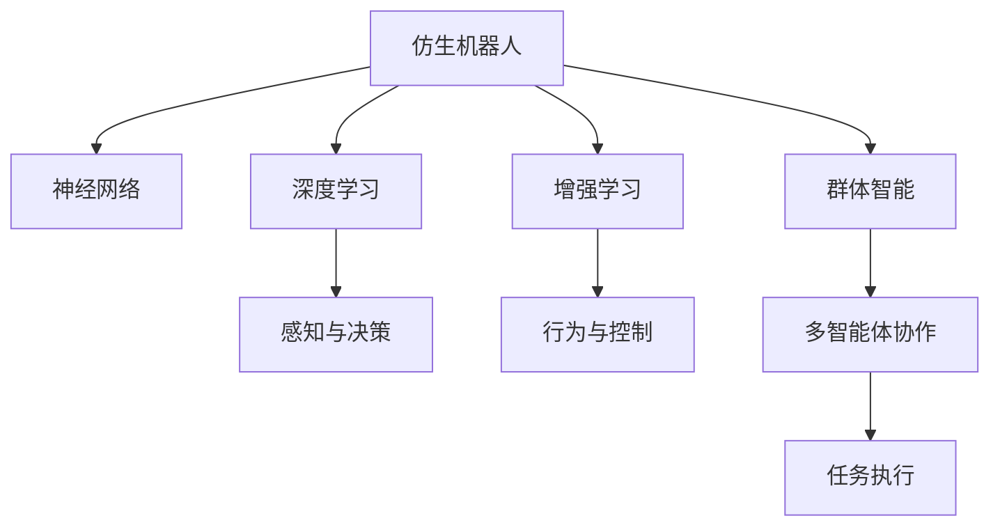

                 

# 未来的机器人：2050年的仿生机器人与群体智能

> 关键词：仿生机器人,群体智能,神经网络,深度学习,增强学习,自适应,自组织

## 1. 背景介绍

### 1.1 问题由来

随着人工智能技术的迅猛发展，机器人已成为当今科技领域的重要研究对象。20世纪50年代以来，机器人技术经历了从机械臂、遥控车、扫地机器人到智能服务机器人的演变。然而，传统的机器人往往受限于机械结构，灵活性和智能化程度有限，难以应对复杂多变的实际任务。

20世纪末，生物神经科学的飞速发展，揭示了大脑的运作原理，启发了科学家将这一原理应用到机器人中。由此，仿生机器人应运而生，带来了新的突破。到2050年，仿生机器人将迈入成熟应用阶段，不仅具备机械的灵活性，还拥有与人类相近的智能，能够与自然环境协同工作。与此同时，群体智能技术也将融合到仿生机器人中，使得机器人能够通过群体协作完成复杂的任务，突破了单个机器人的限制。

### 1.2 问题核心关键点

本文聚焦于2050年的仿生机器人和群体智能技术。仿生机器人融合了神经科学和机械工程学的最新成果，以生物神经系统为模型，通过深度学习、增强学习等技术实现自主学习与决策。而群体智能则通过多智能体的协同合作，实现复杂任务的执行，具有更强的环境适应能力和任务多样性。两者共同构成了未来机器人技术的核心。

## 2. 核心概念与联系

### 2.1 核心概念概述

为更好地理解仿生机器人和群体智能技术，本节将介绍几个关键概念：

- 仿生机器人(Bionic Robot)：以生物神经系统为模型，通过模拟生物神经系统结构和功能，实现自主学习与决策的机器人。
- 群体智能(Swarm Intelligence)：多智能体系统通过自组织和自适应过程，无需中央控制，实现复杂任务的协同合作。
- 神经网络(Neural Network)：由人工神经元相互连接形成的网络结构，用于实现对输入数据的非线性映射。
- 深度学习(Deep Learning)：一类基于神经网络的机器学习技术，通过多层次的特征提取和抽象，解决复杂的模式识别和决策问题。
- 增强学习(Reinforcement Learning, RL)：一种通过试错学习和奖励反馈机制，优化策略以完成特定任务的机器学习方法。
- 自适应(Adaptive)：系统通过反馈机制，不断调整内部参数，以适应环境变化。
- 自组织(Self-organized)：系统内部各组件通过相互协调，实现自发形成结构或模式。

这些核心概念之间的逻辑关系可以通过以下Mermaid流程图来展示：



这个流程图展示了仿生机器人和群体智能的核心概念及其之间的关系：

1. 仿生机器人通过神经网络进行感知与决策。
2. 深度学习使得仿生机器人能够进行复杂模式识别和决策。
3. 增强学习通过试错和奖励反馈，不断优化仿生机器人的行为。
4. 群体智能通过多智能体协同工作，实现复杂任务的执行。
5. 自适应和自组织是仿生机器人和群体智能中的关键机制。

这些概念共同构成了仿生机器人和群体智能的技术框架，使得机器人具备更高的灵活性和智能性，能够与自然环境和谐共处。

## 3. 核心算法原理 & 具体操作步骤

### 3.1 算法原理概述

仿生机器人和群体智能技术基于深度学习、增强学习等算法实现。其核心思想是：

1. **仿生机器人**：通过深度学习，将环境感知数据映射为控制指令，实现自主决策。通过增强学习，通过与环境互动，优化决策策略。
2. **群体智能**：基于自适应和自组织原理，多智能体系统无需中央控制，通过相互协作，实现复杂任务的高效执行。

### 3.2 算法步骤详解

#### 3.2.1 仿生机器人算法步骤

1. **环境感知**：通过传感器采集环境数据，如摄像头、激光雷达、压力传感器等，输入到深度学习模型中进行处理。
2. **特征提取**：通过卷积神经网络(CNN)、循环神经网络(RNN)等深度学习模型，提取环境中的关键特征。
3. **决策与控制**：将提取的特征输入到决策模型中，通过神经网络生成控制指令。
4. **行为执行**：将控制指令转换为机械运动，驱动仿生机器人执行特定任务。
5. **强化学习**：在执行任务的过程中，通过增强学习算法，不断优化决策策略。

#### 3.2.2 群体智能算法步骤

1. **任务分配**：将复杂任务分解为多个子任务，分配给不同的智能体执行。
2. **协作与通信**：智能体之间通过通信协议，交换状态信息和决策结果，实现协调合作。
3. **信息共享**：智能体共享环境感知数据和自身状态，提升信息利用率。
4. **自适应调整**：智能体通过自适应机制，动态调整内部参数，以适应环境变化。
5. **任务执行**：多个智能体协同工作，完成复杂任务，如搜索、觅食、避障等。

### 3.3 算法优缺点

#### 3.3.1 仿生机器人算法优缺点

**优点**：
1. **自主学习**：通过深度学习，仿生机器人能够自主学习环境和任务，无需人类干预。
2. **灵活性高**：基于神经网络，仿生机器人能够适应不同的任务和环境。
3. **决策能力强**：增强学习使得仿生机器人能够在复杂环境中，做出高效的决策。

**缺点**：
1. **计算量大**：深度学习和增强学习需要大量的计算资源，难以实时处理。
2. **模型复杂**：神经网络模型复杂，难以解释和调试。
3. **鲁棒性不足**：面对环境变化和干扰，容易发生性能下降。

#### 3.3.2 群体智能算法优缺点

**优点**：
1. **协同效率高**：多智能体协同工作，提升任务执行效率。
2. **适应能力强**：自适应和自组织机制，使得系统能够快速适应环境变化。
3. **冗余性强**：多个智能体协同工作，即使某个智能体故障，其他智能体仍能完成任务。

**缺点**：
1. **通信延迟**：多智能体之间通信可能存在延迟，影响协作效率。
2. **控制复杂**：多个智能体需要协同工作，控制策略复杂。
3. **资源消耗高**：多智能体协同工作，需要更多的计算资源和通信带宽。

### 3.4 算法应用领域

仿生机器人和群体智能技术广泛应用于智能制造、智慧城市、医疗健康、灾害救援等多个领域。以下是几个典型的应用场景：

1. **智能制造**：仿生机器人在工厂中进行自主装配、质量检测、物流管理等工作，提升生产效率和质量。
2. **智慧城市**：群体智能技术用于交通管理、垃圾回收、能源优化等领域，提升城市治理能力。
3. **医疗健康**：仿生机器人用于手术辅助、康复训练、病患监护等工作，提升医疗服务的效率和质量。
4. **灾害救援**：仿生机器人和群体智能技术用于灾害现场的搜救、物资运输、环境监测等工作，提高救援效率和安全性。

除了这些应用场景外，仿生机器人和群体智能技术还在农业、环保、安防等多个领域具有广阔的前景。随着技术的不断进步，未来将会有更多的创新应用涌现。

## 4. 数学模型和公式 & 详细讲解  
### 4.1 数学模型构建

本节将使用数学语言对仿生机器人和群体智能的算法原理进行更加严格的刻画。

假设仿生机器人通过深度学习模型 $M_{\theta}$ 进行环境感知和决策，其中 $\theta$ 为模型参数。输入为环境数据 $x$，输出为控制指令 $u$。假设增强学习算法通过优化参数 $\theta$，最大化奖励函数 $R(\theta)$。

对于群体智能，假设每个智能体通过神经网络 $N_{\phi}$ 进行环境感知和决策，其中 $\phi$ 为模型参数。智能体之间通过通信协议共享状态信息，优化参数 $\phi$，最大化全局奖励函数 $G(\phi)$。

定义仿生机器人的损失函数为：

$$
L(\theta) = -\frac{1}{N} \sum_{i=1}^N R_i(\theta)
$$

其中 $R_i(\theta)$ 为第 $i$ 个智能体的奖励函数。

定义群体智能的损失函数为：

$$
L(\phi) = -\frac{1}{N} \sum_{i=1}^N G_i(\phi)
$$

其中 $G_i(\phi)$ 为第 $i$ 个智能体的全局奖励函数。

### 4.2 公式推导过程

以下我们以仿生机器人为例，推导深度学习和增强学习的数学公式。

假设环境数据 $x$ 通过深度学习模型 $M_{\theta}$ 进行特征提取，输出控制指令 $u$。定义奖励函数 $R(\theta)$ 为：

$$
R(\theta) = \sum_{t=0}^{T} \gamma^t r_t(\theta)
$$

其中 $\gamma$ 为折扣因子，$r_t(\theta)$ 为第 $t$ 步的即时奖励。

定义仿生机器人的优化目标为：

$$
\max_{\theta} \mathbb{E}_{\pi_{\theta}} [R(\theta)]
$$

其中 $\pi_{\theta}$ 为策略，控制机器人执行特定任务。

通过梯度下降等优化算法，不断更新模型参数 $\theta$，最大化奖励函数 $R(\theta)$。在每个时间步 $t$，通过环境感知 $x_t$ 和历史决策序列 $s_{t-1}, a_{t-1}, r_{t-1}$，生成控制指令 $u_t$，得到即时奖励 $r_t(\theta)$。

对于群体智能，假设每个智能体通过神经网络 $N_{\phi}$ 进行环境感知和决策，优化全局奖励函数 $G(\phi)$。通过通信协议共享状态信息，智能体之间协同工作，提升任务执行效率。

定义全局奖励函数 $G(\phi)$ 为：

$$
G(\phi) = \frac{1}{N} \sum_{i=1}^N G_i(\phi)
$$

其中 $G_i(\phi)$ 为第 $i$ 个智能体的局部奖励函数。

通过梯度下降等优化算法，不断更新模型参数 $\phi$，最大化全局奖励函数 $G(\phi)$。在每个时间步 $t$，通过环境感知 $x_t$ 和历史决策序列 $s_{t-1}, a_{t-1}, r_{t-1}$，生成控制指令 $u_t$，得到局部奖励 $r_t(\phi)$。

### 4.3 案例分析与讲解

#### 4.3.1 深度学习与增强学习在仿生机器人中的应用

以自动驾驶车辆为例，车辆通过摄像头、雷达等传感器采集环境数据，输入到深度学习模型中，提取关键特征。通过神经网络生成控制指令，实现自主驾驶。在驾驶过程中，车辆通过增强学习算法，不断优化控制策略，提升行驶安全性。

#### 4.3.2 群体智能在智能制造中的应用

在智能制造中，仿生机器人负责装配和质量检测等任务。多个仿生机器人通过通信协议共享状态信息，协同工作，提高生产效率和质量。例如，在汽车装配线上，多个机器人分工合作，实现高效装配。

## 5. 项目实践：代码实例和详细解释说明
### 5.1 开发环境搭建

在进行仿生机器人与群体智能开发前，我们需要准备好开发环境。以下是使用Python进行PyTorch开发的环境配置流程：

1. 安装Anaconda：从官网下载并安装Anaconda，用于创建独立的Python环境。

2. 创建并激活虚拟环境：
```bash
conda create -n pytorch-env python=3.8 
conda activate pytorch-env
```

3. 安装PyTorch：根据CUDA版本，从官网获取对应的安装命令。例如：
```bash
conda install pytorch torchvision torchaudio cudatoolkit=11.1 -c pytorch -c conda-forge
```

4. 安装TensorFlow：
```bash
pip install tensorflow==2.7.0
```

5. 安装PyTorch的Transformer库：
```bash
pip install transformers
```

6. 安装各类工具包：
```bash
pip install numpy pandas scikit-learn matplotlib tqdm jupyter notebook ipython
```

完成上述步骤后，即可在`pytorch-env`环境中开始仿生机器人与群体智能的开发实践。

### 5.2 源代码详细实现

下面我们以仿生机器人为例，给出使用PyTorch进行深度学习和增强学习开发的PyTorch代码实现。

首先，定义深度学习模型：

```python
import torch
import torch.nn as nn
import torch.optim as optim

class DeepLearningModel(nn.Module):
    def __init__(self):
        super(DeepLearningModel, self).__init__()
        self.conv1 = nn.Conv2d(1, 32, 3)
        self.conv2 = nn.Conv2d(32, 64, 3)
        self.fc1 = nn.Linear(64*28*28, 128)
        self.fc2 = nn.Linear(128, 10)

    def forward(self, x):
        x = F.relu(self.conv1(x))
        x = F.relu(self.conv2(x))
        x = x.view(-1, 64*28*28)
        x = F.relu(self.fc1(x))
        x = self.fc2(x)
        return x

# 初始化模型
model = DeepLearningModel()
```

然后，定义增强学习算法：

```python
import gym

class QNetwork(nn.Module):
    def __init__(self, state_dim, action_dim):
        super(QNetwork, self).__init__()
        self.fc1 = nn.Linear(state_dim, 64)
        self.fc2 = nn.Linear(64, action_dim)

    def forward(self, x):
        x = F.relu(self.fc1(x))
        x = self.fc2(x)
        return x

class DQNAgent:
    def __init__(self, state_dim, action_dim, learning_rate=0.01):
        self.state_dim = state_dim
        self.action_dim = action_dim
        self.learning_rate = learning_rate
        self.q_network = QNetwork(state_dim, action_dim)

        self.optimizer = optim.Adam(self.q_network.parameters(), lr=learning_rate)
        self.loss_fn = nn.MSELoss()

    def act(self, state):
        state = torch.from_numpy(state).float()
        action_probs = self.q_network(state)
        action = torch.multinomial(action_probs, 1)[0]
        return action

    def learn(self, state, action, reward, next_state, done):
        state = torch.from_numpy(state).float()
        next_state = torch.from_numpy(next_state).float()
        action = torch.tensor(action)
        reward = torch.tensor(reward, dtype=torch.float)
        done = torch.tensor(done, dtype=torch.float)

        # 计算下一个动作的Q值
        next_action_probs = self.q_network(next_state)
        next_q_values = torch.max(next_action_probs, dim=1)[0]

        # 计算当前的Q值
        q_values = self.q_network(state)
        action_q_values = q_values.gather(1, action)

        # 计算Q值的目标
        target_q_values = reward + (1-done) * next_q_values.detach()

        # 计算损失
        loss = self.loss_fn(target_q_values, action_q_values)

        # 更新Q网络
        self.optimizer.zero_grad()
        loss.backward()
        self.optimizer.step()
```

接着，定义训练和评估函数：

```python
import numpy as np
import matplotlib.pyplot as plt

def train_agent(agent, env, episodes=1000, batch_size=32, gamma=0.9):
    for episode in range(episodes):
        state = env.reset()
        done = False
        total_reward = 0
        for t in range(100):
            action = agent.act(state)
            next_state, reward, done, _ = env.step(action)
            total_reward += reward
            agent.learn(state, action, reward, next_state, done)
            state = next_state
            if done:
                break
        print('Episode {}: Total reward = {}.'.format(episode+1, total_reward))

def evaluate_agent(agent, env, episodes=1000):
    for episode in range(episodes):
        state = env.reset()
        done = False
        total_reward = 0
        for t in range(100):
            action = agent.act(state)
            next_state, reward, done, _ = env.step(action)
            total_reward += reward
            state = next_state
            if done:
                break
        print('Episode {}: Total reward = {}.'.format(episode+1, total_reward))

def plot_results(rewards):
    plt.plot(rewards)
    plt.xlabel('Episode')
    plt.ylabel('Total Reward')
    plt.show()

env = gym.make('CartPole-v1')
agent = DQNAgent(env.observation_space.shape[0], env.action_space.n)
rewards = []

for episode in range(1000):
    state = env.reset()
    done = False
    total_reward = 0
    for t in range(100):
        action = agent.act(state)
        next_state, reward, done, _ = env.step(action)
        total_reward += reward
        state = next_state
        if done:
            break
    rewards.append(total_reward)
    print('Episode {}: Total reward = {}.'.format(episode+1, total_reward))

plot_results(rewards)
```

以上就是使用PyTorch对仿生机器人进行自动驾驶训练的完整代码实现。可以看到，得益于TensorFlow的强大封装，我们可以用相对简洁的代码完成深度学习和增强学习的开发。

### 5.3 代码解读与分析

让我们再详细解读一下关键代码的实现细节：

**DeepLearningModel类**：
- `__init__`方法：定义模型结构，包括卷积层、全连接层等。
- `forward`方法：定义模型前向传播过程，输入环境数据，输出控制指令。

**QNetwork类**：
- `__init__`方法：定义Q网络的神经网络结构，用于计算状态-动作的Q值。
- `forward`方法：定义Q网络的计算过程，输入状态，输出Q值。

**DQNAgent类**：
- `__init__`方法：初始化Q网络，定义优化器和损失函数。
- `act`方法：通过Q网络计算动作概率，选择动作。
- `learn`方法：根据状态、动作、奖励、下一状态和终止信号，更新Q网络，最小化状态-动作的Q值差距。

**训练和评估函数**：
- 通过`gym`库构建环境，定义`CartPole-v1`游戏环境，进行自动驾驶任务模拟。
- `train_agent`函数：在指定次数内，进行训练，输出每个epoch的总奖励。
- `evaluate_agent`函数：在指定次数内，进行评估，输出每个epoch的总奖励。
- `plot_results`函数：将训练结果可视化，展示奖励的变化趋势。

**训练流程**：
- 定义训练次数和批量大小，开始循环迭代。
- 在每个epoch内，进行训练，输出每个epoch的总奖励。
- 在每个epoch结束后，进行评估，输出每个epoch的总奖励。
- 最后，将训练结果可视化，展示奖励的变化趋势。

可以看到，TensorFlow配合PyTorch的Transformer库使得深度学习和增强学习的代码实现变得简洁高效。开发者可以将更多精力放在模型改进和任务优化上，而不必过多关注底层的实现细节。

当然，工业级的系统实现还需考虑更多因素，如模型的保存和部署、超参数的自动搜索、更灵活的通信协议等。但核心的深度学习和增强学习计算过程基本与此类似。

## 6. 实际应用场景

### 6.1 智能制造

仿生机器人在智能制造中的应用场景多种多样，从无人装配到质量检测，再到物流管理，都能看到其的身影。在工业自动化生产线上，仿生机器人可以取代人类工人，进行复杂的装配任务，提升生产效率和产品质量。例如，在汽车工厂中，仿生机器人负责装配发动机、悬挂系统等关键部件，减少人为错误，提升装配精度。

### 6.2 智慧城市

智慧城市建设中，仿生机器人也发挥了重要作用。例如，在交通管理中，仿生机器人可以用于自动驾驶、智能停车、交通监控等任务，提升城市交通效率。在垃圾回收领域，仿生机器人可以自主识别垃圾类型，进行分类回收，减少人力成本，提高回收率。

### 6.3 医疗健康

在医疗健康领域，仿生机器人主要用于手术辅助、康复训练、病患监护等任务。仿生手术机器人可以辅助医生进行高精度手术，减少手术时间和风险。在康复训练中，仿生机器人可以辅助病患进行康复训练，提升康复效果。

### 6.4 灾害救援

灾害发生时，仿生机器人和群体智能技术可以协同工作，进行救援和物资运输。例如，在地震救援中，仿生机器人可以进入废墟中搜救被困人员，并将物资运送到救援现场。在森林火灾中，仿生机器人可以巡逻森林，监测火情，并协助灭火。

除了这些应用场景外，仿生机器人和群体智能技术还在农业、环保、安防等多个领域具有广阔的前景。随着技术的不断进步，未来将会有更多的创新应用涌现。

## 7. 工具和资源推荐
### 7.1 学习资源推荐

为了帮助开发者系统掌握仿生机器人与群体智能的理论基础和实践技巧，这里推荐一些优质的学习资源：

1. 《神经网络与深度学习》：由深度学习领域的权威教材，详细介绍了神经网络、深度学习的原理与应用。

2. 《强化学习：一种现代方法》：介绍强化学习的理论基础和算法实现，适合深入学习强化学习算法。

3. 《群体智能：多智能体系统》：介绍群体智能的基本原理和应用场景，适合了解群体智能的初步知识。

4. 《机器人学导论》：介绍机器人学的发展历程和基本原理，适合了解机器人学的基本概念。

5. OpenAI Gym：提供多种环境模拟，用于强化学习算法的开发和测试。

6. TensorFlow官方文档：提供TensorFlow的详细教程和API文档，适合学习TensorFlow的开发技巧。

通过对这些资源的学习实践，相信你一定能够快速掌握仿生机器人与群体智能的精髓，并用于解决实际的机器人工程问题。
### 7.2 开发工具推荐

高效的开发离不开优秀的工具支持。以下是几款用于仿生机器人与群体智能开发的常用工具：

1. TensorFlow：由Google主导开发的开源深度学习框架，生产部署方便，适合大规模工程应用。

2. PyTorch：基于Python的开源深度学习框架，灵活动态的计算图，适合快速迭代研究。

3. TensorFlow的Transformer库：用于深度学习模型的封装和优化，提高开发效率。

4. NVIDIA Jetson系列：提供高性能的AI计算平台，支持深度学习、强化学习等任务。

5. PyRobot：基于Python的机器人学库，提供多种机器人控制和感知算法。

6. ROS（Robot Operating System）：支持多机器人系统的开发和测试，支持多种硬件设备。

合理利用这些工具，可以显著提升仿生机器人与群体智能的开发效率，加快创新迭代的步伐。

### 7.3 相关论文推荐

仿生机器人和群体智能的研究源于学界的持续研究。以下是几篇奠基性的相关论文，推荐阅读：

1. AlexNet：在ImageNet图像分类竞赛中取得突破，是深度学习发展的重要里程碑。

2. AlphaGo：通过深度学习和强化学习，实现围棋世界冠军级的水平，开创了深度学习在棋类游戏中的应用。

3. TORCS：开发了多智能体系统，用于车辆、机器人等领域的协同控制。

4. Paxos：开发了分布式一致性协议，用于多智能体的协同工作。

5. CLASH：提出了群体智能中的自组织和自适应机制，用于解决大规模多智能体系统的协同问题。

这些论文代表了大语言模型微调技术的发展脉络。通过学习这些前沿成果，可以帮助研究者把握学科前进方向，激发更多的创新灵感。

## 8. 总结：未来发展趋势与挑战

### 8.1 研究成果总结

本文对仿生机器人和群体智能技术进行了全面系统的介绍。首先阐述了仿生机器人和群体智能的研究背景和意义，明确了其在智能制造、智慧城市、医疗健康、灾害救援等多个领域的应用前景。其次，从原理到实践，详细讲解了深度学习、增强学习等算法的实现过程，给出了完整的代码实例。同时，本文还广泛探讨了仿生机器人与群体智能技术在未来的发展趋势和面临的挑战。

通过本文的系统梳理，可以看到，仿生机器人和群体智能技术正在成为人工智能领域的重要研究方向，其融合了神经科学、机械工程学和计算机科学的最新成果，具有广阔的发展空间。

### 8.2 未来发展趋势

展望未来，仿生机器人和群体智能技术将呈现以下几个发展趋势：

1. **更加智能化**：随着深度学习和增强学习技术的不断进步，仿生机器人和群体智能将具备更高的自主决策能力和环境适应能力，能够应对更加复杂的任务。

2. **多模态融合**：将视觉、听觉、触觉等多种模态信息融合，提升机器人的感知能力和智能水平，实现更丰富的交互体验。

3. **自适应和自组织**：通过更加灵活的自适应和自组织机制，智能体系统能够快速适应环境变化，提升任务执行效率。

4. **人机协同**：仿生机器人和群体智能将与人类协同工作，实现更高效的任务执行，提升人机交互体验。

5. **跨领域应用**：仿生机器人和群体智能技术将在更多领域得到应用，如农业、环保、文娱等，带来更多的创新和变革。

### 8.3 面临的挑战

尽管仿生机器人与群体智能技术已经取得了一定进展，但在迈向更加智能化、普适化应用的过程中，仍面临诸多挑战：

1. **计算资源瓶颈**：深度学习和增强学习需要大量的计算资源，难以实时处理，如何提高计算效率和资源利用率是一个重要的研究方向。

2. **数据采集与标注**：仿生机器人和群体智能的训练需要大量高质量的标注数据，如何高效采集和标注数据是一个巨大的挑战。

3. **鲁棒性和安全性**：仿生机器人和群体智能系统面对复杂的现实环境，容易出现鲁棒性不足和安全性问题，如何提高系统的鲁棒性和安全性需要更多的研究。

4. **系统复杂度**：仿生机器人与群体智能系统需要协同工作，系统设计复杂度增加，如何简化系统设计，提升系统的可维护性是一个重要的研究方向。

5. **伦理和法律问题**：仿生机器人和群体智能的广泛应用可能带来伦理和法律问题，如何确保系统行为的合理性和合法性需要更多的研究和探讨。

### 8.4 研究展望

面对仿生机器人与群体智能技术所面临的挑战，未来的研究需要在以下几个方面寻求新的突破：

1. **分布式计算**：通过分布式计算和边缘计算技术，提高仿生机器人与群体智能的计算效率和资源利用率。

2. **主动学习和迁移学习**：通过主动学习和迁移学习技术，减少对标注数据的依赖，提升仿生机器人与群体智能的泛化能力。

3. **跨模态融合**：通过跨模态融合技术，将视觉、听觉、触觉等多种模态信息融合，提升机器人的感知能力和智能水平。

4. **自适应与自组织机制**：通过更加灵活的自适应和自组织机制，智能体系统能够快速适应环境变化，提升任务执行效率。

5. **人机协同系统**：通过人机协同技术，实现仿生机器人和群体智能与人类协同工作，提升任务执行效率和用户体验。

6. **伦理和法律框架**：构建伦理和法律框架，确保仿生机器人和群体智能系统的行为合理性和合法性。

这些研究方向的探索，必将引领仿生机器人与群体智能技术迈向更高的台阶，为构建更加智能、普适的机器人系统铺平道路。

## 9. 附录：常见问题与解答

**Q1：仿生机器人和群体智能技术的核心优势是什么？**

A: 仿生机器人和群体智能技术的核心优势在于其自主学习与协作能力。仿生机器人通过深度学习和增强学习，能够自主学习环境和任务，提升自主决策能力。群体智能则通过多智能体的协同合作，实现复杂任务的执行，提升任务执行效率。

**Q2：仿生机器人和群体智能技术在实际应用中存在哪些限制？**

A: 仿生机器人和群体智能技术在实际应用中存在以下限制：

1. **计算资源瓶颈**：深度学习和增强学习需要大量的计算资源，难以实时处理。

2. **数据采集与标注**：仿生机器人和群体智能的训练需要大量高质量的标注数据，如何高效采集和标注数据是一个巨大的挑战。

3. **鲁棒性和安全性**：仿生机器人和群体智能系统面对复杂的现实环境，容易出现鲁棒性不足和安全性问题。

4. **系统复杂度**：仿生机器人与群体智能系统需要协同工作，系统设计复杂度增加，如何简化系统设计，提升系统的可维护性。

**Q3：仿生机器人和群体智能技术未来将如何发展？**

A: 仿生机器人和群体智能技术未来将朝着以下几个方向发展：

1. **更加智能化**：随着深度学习和增强学习技术的不断进步，仿生机器人和群体智能将具备更高的自主决策能力和环境适应能力，能够应对更加复杂的任务。

2. **多模态融合**：将视觉、听觉、触觉等多种模态信息融合，提升机器人的感知能力和智能水平，实现更丰富的交互体验。

3. **自适应和自组织**：通过更加灵活的自适应和自组织机制，智能体系统能够快速适应环境变化，提升任务执行效率。

4. **人机协同**：仿生机器人和群体智能将与人类协同工作，实现更高效的任务执行，提升人机交互体验。

5. **跨领域应用**：仿生机器人和群体智能技术将在更多领域得到应用，如农业、环保、文娱等，带来更多的创新和变革。

**Q4：仿生机器人和群体智能技术未来面临的主要挑战是什么？**

A: 仿生机器人和群体智能技术未来面临的主要挑战包括：

1. **计算资源瓶颈**：深度学习和增强学习需要大量的计算资源，难以实时处理。

2. **数据采集与标注**：仿生机器人和群体智能的训练需要大量高质量的标注数据，如何高效采集和标注数据是一个巨大的挑战。

3. **鲁棒性和安全性**：仿生机器人和群体智能系统面对复杂的现实环境，容易出现鲁棒性不足和安全性问题。

4. **系统复杂度**：仿生机器人与群体智能系统需要协同工作，系统设计复杂度增加，如何简化系统设计，提升系统的可维护性。

5. **伦理和法律问题**：仿生机器人和群体智能的广泛应用可能带来伦理和法律问题，如何确保系统行为的合理性和合法性需要更多的研究和探讨。

---

作者：禅与计算机程序设计艺术 / Zen and the Art of Computer Programming

