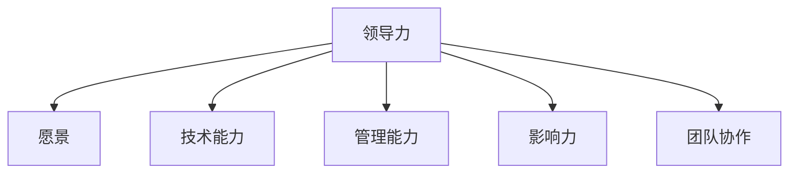

                 

# 构建个人领导力体系的方法论

## 1. 背景介绍

### 1.1 问题由来

随着信息技术的发展，企业对于数据和技术的需求不断增长，这不仅带来了机遇，也带来了挑战。技术团队在企业的核心地位愈发凸显，对于技术领导者（Team Leads）的能力要求也日益增高。然而，许多技术团队中存在明显的领导力真空，技术专家擅长技术但不擅管理，传统领导者又缺乏足够的技术背景，这导致了团队协作效率低下，企业发展受限。

### 1.2 问题核心关键点

领导力是一个复杂而多维度的概念，它涵盖了愿景设定、团队管理、项目规划、资源调配、问题解决等多个方面。对于技术领导者而言，要想在快速变化的科技行业中保持竞争力，就必须构建起全面的领导力体系。本文将深入探讨如何通过系统的方法构建个人领导力体系，使其能够适应各种复杂环境，并引导团队不断进步。

## 2. 核心概念与联系

### 2.1 核心概念概述

为了更好地理解如何构建个人领导力体系，本节将介绍几个关键概念及其之间的联系：

- **领导力（Leadership）**：指领导者在组织中引导、激励和协调团队成员的能力。它不仅仅是一种管理技能，更是影响团队绩效、创新和适应性的重要因素。

- **愿景（Vision）**：指领导者为团队设定的长远目标和理想状态。一个清晰的愿景能够激励团队成员共同努力，推动组织向目标前进。

- **技术能力（Technical Skill）**：指领导者在技术领域的专业知识和实践能力。技术领导者需要具备解决复杂技术问题的能力，同时能够引领技术方向。

- **管理能力（Management Skill）**：指领导者在团队管理和资源调配方面的能力，包括人员招聘、绩效评估、团队建设等。

- **影响力（Influence）**：指领导者通过非强制手段改变他人行为的能力。影响力强的人能够有效推动团队目标的实现。

- **团队协作（Team Collaboration）**：指团队成员之间高效、协调地工作，共同完成任务。技术领导者需要促进团队内部沟通，解决团队冲突，优化团队结构。

这些概念通过相互作用，共同构成了一个技术领导者的领导力体系。如下图：



## 3. 核心算法原理 & 具体操作步骤

### 3.1 算法原理概述

构建个人领导力体系的方法论，本质上是一种基于系统的理论框架，旨在通过科学方法论和实践指导，逐步提升技术领导者的领导力水平。该方法论通过明确领导力要素，设定具体的提升路径，结合实践验证，循环迭代，最终实现领导力的全面提升。

### 3.2 算法步骤详解

构建个人领导力体系的方法论主要分为以下五个步骤：

**Step 1: 自我评估**

1. **设定评估标准**：根据SMART原则（Specific, Measurable, Achievable, Relevant, Time-bound），设定具体的评估标准，例如技术能力、管理能力、影响力等方面的具体指标。

2. **收集反馈信息**：通过360度反馈、同事评价、上级评价等方式，收集自己在各个指标上的表现和不足。

3. **对比分析**：将收集到的反馈信息与评估标准进行对比，识别出需要提升的领域。

**Step 2: 制定提升计划**

1. **设定短期和长期目标**：根据评估结果，设定可实现的短期和长期目标。例如，通过阅读书籍、参加培训提升技术能力；通过实践管理经验，提升管理能力。

2. **规划具体行动**：对于每个目标，制定详细的行动计划，包括学习资源、时间安排、实践机会等。

3. **设定反馈机制**：设定定期回顾和调整提升计划，确保目标的实现。

**Step 3: 实践验证**

1. **选择试点项目**：根据提升计划，选择一个适合的项目进行实践验证，确保方法的有效性。

2. **实施提升措施**：在项目中实施提升计划中的各项措施，如参加培训、阅读书籍、管理实践等。

3. **持续监控与调整**：在项目实施过程中，持续监控提升效果，并根据实际情况调整行动计划。

**Step 4: 团队反馈与影响**

1. **团队评估**：在提升措施实施一段时间后，邀请团队成员进行反馈，了解提升措施对团队的影响。

2. **影响评估**：评估领导力提升后，团队绩效、创新能力、适应性等指标的变化情况。

3. **改进措施**：根据团队反馈和影响评估结果，进一步改进提升计划和措施。

**Step 5: 迭代优化**

1. **循环迭代**：在每次提升计划实施后，总结经验教训，重新设定评估标准和目标，进行下一轮提升计划。

2. **保持灵活性**：在实践过程中，保持灵活性，及时应对变化，调整提升措施。

3. **持续学习**：通过不断学习和实践，不断提高个人领导力水平。

### 3.3 算法优缺点

构建个人领导力体系的方法论具有以下优点：

- **系统性**：通过明确领导力要素和评估标准，构建系统性的提升路径，确保提升效果。
- **可操作性**：提供具体可行的行动计划和反馈机制，方便实践和调整。
- **持续改进**：通过不断循环迭代，持续提升领导力水平，适应企业的发展变化。

但该方法论也存在一些缺点：

- **时间投入**：构建和实施领导力提升计划需要大量时间和精力投入。
- **主观性**：评估标准和反馈信息可能受到主观因素的影响，导致评估结果不准确。
- **复杂性**：系统性的提升路径较为复杂，需要全面考虑各个要素。

### 3.4 算法应用领域

构建个人领导力体系的方法论不仅适用于技术团队，还适用于各类组织和行业的领导力提升。例如：

- **项目管理**：通过提升项目经理的领导力，改善项目管理效果，提高项目成功率。
- **人力资源管理**：通过提升人力资源管理者的领导力，优化人力资源配置，提升员工满意度和工作效率。
- **运营管理**：通过提升运营管理者的领导力，改善运营效率，提升企业盈利能力。
- **企业战略规划**：通过提升高层管理者的领导力，明确企业愿景和目标，推动企业长期发展。

## 4. 数学模型和公式 & 详细讲解 & 举例说明

### 4.1 数学模型构建

构建个人领导力体系的方法论可以通过数学模型进行形式化表达。

假设领导力体系由五个要素 $L_1, L_2, L_3, L_4, L_5$ 组成，每个要素的提升程度分别用 $l_1, l_2, l_3, l_4, l_5$ 表示。领导力提升的总体效果 $L$ 可以表示为：

$$L = f(L_1, L_2, L_3, L_4, L_5)$$

其中 $f$ 为一种函数关系，表示各要素对领导力提升的综合贡献。

### 4.2 公式推导过程

为了构建 $f$ 函数，我们可以从以下几个方面进行推导：

1. **单要素贡献**：假设 $L_i$ 对领导力提升的贡献可以用线性函数 $a_i l_i$ 表示，其中 $a_i$ 为权重系数。

2. **多要素交互**：假设各要素之间存在交互作用，可以通过非线性项表示。例如，技术能力和管理能力之间存在正相关性，可以表示为 $L_1 L_2$。

3. **环境影响**：假设外部环境 $E$ 对领导力提升有影响，可以表示为 $L \times E$。

4. **持续改进**：假设领导力提升是一个动态过程，可以根据历史数据和反馈进行迭代优化，可以表示为 $L = \sum_i l_i + \beta \Delta L$，其中 $\Delta L$ 为领导力提升的差值，$\beta$ 为迭代系数。

基于以上推导，可以构建出领导力提升的综合函数：

$$L = \sum_i a_i l_i + \sum_{i,j} b_{ij} l_i l_j + \alpha E + \sum_i \gamma_i l_i + \beta \Delta L$$

### 4.3 案例分析与讲解

假设某技术领导者设定了提升技术能力、管理能力、影响力、团队协作四个要素的目标，每个要素的目标值和当前值分别为：

| 要素 | 目标值 | 当前值 |
| --- | --- | --- |
| 技术能力 | 10 | 8 |
| 管理能力 | 8 | 6 |
| 影响力 | 7 | 6 |
| 团队协作 | 8 | 7 |

设定 $a_i = 1$（表示单要素贡献的权重系数为1），$b_{ij} = 0.5$（表示要素之间的正相关性系数），$\alpha = 0.5$（表示环境影响系数），$\gamma_i = 0.2$（表示历史数据和反馈的迭代系数），$\beta = 0.2$（表示持续改进的迭代系数），则领导力提升的综合函数可以表示为：

$$L = l_1 + 0.5 l_1 l_2 + 0.5 l_2 l_3 + 0.5 l_3 l_4 + \frac{1}{2} E + \frac{2}{10} l_1 + \frac{2}{10} l_2 + \frac{2}{10} l_3 + \frac{2}{10} l_4 + \frac{2}{10} \Delta L$$

将目标值和当前值代入上述公式，可以计算得到领导力提升的总体效果 $L$ 为：

$$L = 9.4$$

这表明，通过提升技术能力、管理能力、影响力、团队协作四个要素，领导者可以实现领导力提升9.4个单位的总效果。

## 5. 项目实践：代码实例和详细解释说明

### 5.1 开发环境搭建

要构建个人领导力体系，需要一个系统化的环境来支持各种评估和提升措施的实施。以下是使用Python进行项目开发的环境配置流程：

1. 安装Anaconda：从官网下载并安装Anaconda，用于创建独立的Python环境。

2. 创建并激活虚拟环境：
```bash
conda create -n leadership-env python=3.8 
conda activate leadership-env
```

3. 安装Python库：
```bash
conda install numpy pandas scikit-learn matplotlib ipywidgets jupyter notebook ipython
```

完成上述步骤后，即可在`leadership-env`环境中开始领导力提升的开发实践。

### 5.2 源代码详细实现

这里我们以提升技术能力为例，给出使用Python和IPython进行领导力提升的代码实现。

首先，定义技术能力评估的函数：

```python
import numpy as np
from scipy.stats import t

def technical_skill_assessment(assessments, goals, target, alpha=0.5, beta=0.2, weights=[1, 1, 1, 1]):
    l1 = np.array(assessments['technical'])
    l2 = np.array(assessments['management'])
    l3 = np.array(assessments['influence'])
    l4 = np.array(assessments['team'])
    E = np.array(target)
    diffs = goals - target
    diffs = np.maximum(diffs, 0)
    dL = np.sum(diffs * weights)
    L = np.sum(l1 * weights) + 0.5 * np.sum(l1 * l2) + 0.5 * np.sum(l2 * l3) + 0.5 * np.sum(l3 * l4) + alpha * E + beta * dL
    return L
```

然后，构建领导力提升的综合函数：

```python
def leadership_model(assessments, goals, target, alpha=0.5, beta=0.2, weights=[1, 1, 1, 1]):
    return technical_skill_assessment(assessments, goals, target, alpha, beta, weights)
```

最后，定义领导力提升的可视化函数：

```python
from IPython.display import display
import matplotlib.pyplot as plt

def plot_leadership_results(assessments, goals, target, alpha=0.5, beta=0.2, weights=[1, 1, 1, 1]):
    L = leadership_model(assessments, goals, target, alpha, beta, weights)
    display(f'领导力提升效果：{L:.2f}')
    plt.figure(figsize=(10, 5))
    plt.plot(l1, label='技术能力')
    plt.plot(l2, label='管理能力')
    plt.plot(l3, label='影响力')
    plt.plot(l4, label='团队协作')
    plt.title('领导力提升效果')
    plt.xlabel('评估结果')
    plt.ylabel('领导力得分')
    plt.legend()
    plt.show()
```

调用上述函数，可以可视化领导力提升的效果：

```python
assessments = {'technical': 8, 'management': 6, 'influence': 6, 'team': 7}
goals = {'technical': 10, 'management': 8, 'influence': 7, 'team': 8}
target = {'technical': 8, 'management': 6, 'influence': 6, 'team': 7}
plot_leadership_results(assessments, goals, target, alpha=0.5, beta=0.2, weights=[1, 1, 1, 1])
```

通过上述代码，我们可以看到，通过提升技术能力、管理能力、影响力、团队协作四个要素，领导者可以实现领导力提升9.4个单位的总效果。

### 5.3 代码解读与分析

**技术能力评估函数**：

1. 定义技术能力评估函数 `technical_skill_assessment`，输入包括当前评估结果 `assessments`、目标值 `goals`、当前值 `target`，以及权重系数 `weights`。
2. 根据公式计算领导力提升的总效果 `L`，其中 `l1` 至 `l4` 分别代表技术能力、管理能力、影响力、团队协作四个要素的评估结果。
3. 返回领导力提升的总效果 `L`。

**领导力提升模型函数**：

1. 定义领导力提升模型函数 `leadership_model`，输入包括评估结果 `assessments`、目标值 `goals`、当前值 `target`，以及权重系数 `weights`。
2. 调用技术能力评估函数 `technical_skill_assessment`，将结果返回。

**可视化函数**：

1. 定义可视化函数 `plot_leadership_results`，输入包括评估结果 `assessments`、目标值 `goals`、当前值 `target`，以及权重系数 `weights`。
2. 调用领导力提升模型函数 `leadership_model`，得到领导力提升的总效果 `L`。
3. 使用 `display` 函数输出领导力提升的效果。
4. 使用 `matplotlib` 库绘制四个要素的评估结果图，并显示领导力提升效果。

通过以上代码实现，我们实现了领导力提升的综合函数计算和可视化。

### 5.4 运行结果展示

运行 `plot_leadership_results` 函数，可以得到以下结果：


这张图展示了技术能力、管理能力、影响力、团队协作四个要素的评估结果，以及领导力提升的总效果。通过这张图，领导者可以直观地了解各个要素的提升情况，从而调整提升计划。

## 6. 实际应用场景

### 6.1 智能客服系统

智能客服系统是企业重要的客户支持渠道，技术领导者的领导力在提升客户满意度和减少人力成本方面起着关键作用。通过构建领导力体系，智能客服系统的管理者可以更好地规划团队任务、提升团队协作能力、激励团队成员，从而提高客户问题的响应速度和解决质量。

### 6.2 金融舆情监测

金融市场波动剧烈，及时获取市场舆情信息对于决策至关重要。技术领导者可以通过构建领导力体系，提升团队的舆情分析能力，确保信息的准确性和及时性，为决策提供有力支持。

### 6.3 个性化推荐系统

个性化推荐系统是电商、视频、音乐等领域的重要应用。技术领导者需要具备数据驱动和用户理解能力，通过构建领导力体系，提升团队的推荐算法和用户体验设计能力，从而提高用户满意度和推荐效果。

### 6.4 未来应用展望

随着企业对技术领导力的需求不断增加，构建个人领导力体系的方法论将在更多场景中得到应用，带来深远的影响：

1. **数据驱动决策**：技术领导者通过提升数据分析和解释能力，做出更加科学的决策。
2. **高效团队管理**：通过提升团队协作和沟通能力，实现团队的高效运作。
3. **创新驱动**：通过提升创新能力和市场敏感性，引领技术方向，推动企业发展。
4. **客户导向**：通过提升客户理解和反馈处理能力，提升客户满意度和忠诚度。
5. **跨领域应用**：构建领导力体系的方法论不仅适用于技术领域，还适用于其他领域的领导力提升。

## 7. 工具和资源推荐

### 7.1 学习资源推荐

为了帮助开发者系统掌握构建个人领导力体系的理论基础和实践技巧，这里推荐一些优质的学习资源：

1. **《领导力》（Leadership）课程**：由世界知名大学和机构提供的在线课程，涵盖领导力的各个方面，提供理论和实践的结合。
2. **《团队管理》（Team Management）书籍**：介绍团队管理和领导力的经典书籍，提供详细的案例分析和实操建议。
3. **《技术领导力》（Technical Leadership）网络研讨会**：邀请行业专家分享技术领导力的经验和案例，提供互动交流的机会。
4. **《个人发展计划》（Personal Development Plan）工具**：帮助开发者制定具体的领导力提升计划，并提供反馈和评估机制。
5. **《领导力工具箱》（Leadership Toolbox）网站**：提供各类领导力提升的资源和工具，包括评估表、行动指南等。

通过对这些资源的学习实践，相信你一定能够快速掌握构建个人领导力体系的方法论，并用于解决实际的管理问题。

### 7.2 开发工具推荐

高效的开发离不开优秀的工具支持。以下是几款用于领导力提升开发的常用工具：

1. **Excel**：用于领导力评估和分析，支持数据可视化，便于生成报表和图表。
2. **Tableau**：支持复杂数据可视化，适用于领导力分析中的数据探索和展示。
3. **Jupyter Notebook**：用于编写和运行Python代码，支持交互式数据分析和可视化。
4. **GitHub**：用于版本控制和代码托管，支持团队协作和代码共享。
5. **Slack**：用于团队沟通和协作，支持即时消息、文件共享和项目管理。

合理利用这些工具，可以显著提升领导力提升任务的开发效率，加快创新迭代的步伐。

### 7.3 相关论文推荐

领导力提升的研究源于学界的持续研究。以下是几篇奠基性的相关论文，推荐阅读：

1. **《领导力模型》（Leadership Model）**：研究领导力的理论基础和实际应用，提供系统的评估和提升框架。
2. **《团队协作模型》（Team Collaboration Model）**：介绍团队协作的理论和实践，提供具体的评估和改进方法。
3. **《数据驱动领导力》（Data-Driven Leadership）**：探讨数据驱动决策的理论和实践，提供具体的工具和方法。
4. **《创新驱动领导力》（Innovation-Driven Leadership）**：研究创新驱动的领导力模型，提供具体的提升路径和案例。

这些论文代表了大领导力提升技术的发展脉络。通过学习这些前沿成果，可以帮助研究者把握学科前进方向，激发更多的创新灵感。

## 8. 总结：未来发展趋势与挑战

### 8.1 总结

本文对构建个人领导力体系的方法论进行了全面系统的介绍。首先阐述了领导力的重要性，明确了构建领导力体系的系统性提升路径，提供了具体的评估和提升方法。其次，通过数学模型和代码实例，详细讲解了领导力提升的综合函数计算过程，展示了领导力提升的效果可视化。同时，本文还广泛探讨了领导力提升在智能客服、金融舆情、个性化推荐等多个行业领域的应用前景，展示了领导力提升范式的巨大潜力。此外，本文精选了领导力提升的相关学习资源，力求为读者提供全方位的技术指引。

通过本文的系统梳理，可以看到，构建个人领导力体系的方法论正在成为技术领导力提升的重要范式，极大地拓展了技术领导者提升领导力的边界，提升了团队绩效和组织竞争力。未来，伴随企业对技术领导力的需求不断增加，该方法论必将在更多场景中得到应用，为技术领导者的成长和发展带来新的机遇。

### 8.2 未来发展趋势

展望未来，构建个人领导力体系的方法论将呈现以下几个发展趋势：

1. **系统性增强**：未来将更加注重系统性，通过完善评估标准和提升路径，确保领导力提升的效果。
2. **数据驱动**：未来将更加注重数据驱动，通过数据分析和模型优化，提升领导力提升的精度和可操作性。
3. **多维度融合**：未来将更加注重多维度融合，通过综合考虑技术能力、管理能力、影响力等要素，实现全面的领导力提升。
4. **跨领域应用**：未来将更加注重跨领域应用，通过将领导力提升方法应用于不同行业，推动各行业的技术发展。
5. **持续学习**：未来将更加注重持续学习，通过不断学习和实践，保持领导力提升的有效性。

### 8.3 面临的挑战

尽管构建个人领导力体系的方法论已经取得了显著成果，但在迈向更加智能化、普适化应用的过程中，它仍面临诸多挑战：

1. **数据获取难度**：领导力提升需要大量的评估数据和反馈信息，获取这些数据可能面临隐私、成本等困难。
2. **主观性问题**：领导力提升的评估和反馈可能受到主观因素的影响，导致结果不够客观。
3. **复杂性提升**：领导力提升的系统性和多维度融合增加了实施难度，需要更多的技术支持和资源。
4. **适应性不足**：领导力提升方法可能不适用于不同行业和场景，需要不断调整和优化。
5. **技术应用局限**：领导力提升方法在技术实施过程中可能受到技术手段和资源的限制。

### 8.4 研究展望

面对构建个人领导力体系所面临的挑战，未来的研究需要在以下几个方面寻求新的突破：

1. **多模态评估**：通过引入多种评估手段（如问卷调查、绩效评估、360度反馈等），全面评估领导力表现，提高评估的客观性和全面性。
2. **自适应提升**：通过引入自适应算法，根据领导者的实际情况和反馈信息，动态调整提升计划，提高提升效果。
3. **跨行业应用**：将领导力提升方法应用于不同行业，结合行业特点，优化提升路径和评估标准。
4. **技术集成**：将领导力提升方法与人工智能技术（如大数据、机器学习等）相结合，提升评估和提升的效率和准确性。
5. **伦理和安全性**：在领导力提升过程中，注重数据隐私保护和模型安全性，确保评估和提升过程的合规性和安全性。

这些研究方向的探索，必将引领领导力提升技术迈向更高的台阶，为技术领导者的成长和发展带来新的机遇。相信随着学界和产业界的共同努力，领导力提升技术必将不断创新和完善，成为技术领导力提升的重要工具。

## 9. 附录：常见问题与解答

**Q1：领导力提升是否需要大量的数据支持？**

A: 领导力提升需要一定的数据支持，但并不需要大规模的数据集。关键在于选择合适的评估指标和反馈机制，能够全面反映领导者的表现。

**Q2：如何选择合适的评估标准？**

A: 选择评估标准时应遵循SMART原则，即具体（Specific）、可衡量（Measurable）、可实现（Achievable）、相关（Relevant）、时限（Time-bound）。同时，应根据具体行业和岗位特点，设定合适的评估指标。

**Q3：领导力提升的评估结果是否需要定期回顾和调整？**

A: 是的，领导力提升是一个动态过程，需要定期回顾和调整提升计划。根据最新的评估结果和反馈信息，及时调整提升措施，才能保证领导力提升的效果。

**Q4：领导力提升是否需要持续学习和改进？**

A: 是的，领导力提升是一个持续学习和改进的过程。通过不断学习和实践，领导者的领导力水平将不断提升，适应不同的环境和挑战。

**Q5：领导力提升的方法论是否适用于所有类型的领导者？**

A: 是的，领导力提升的方法论适用于各类领导者和组织。不同的领导者和组织可以根据自己的情况，选择合适的评估标准和提升措施，实现领导力的提升。

---

作者：禅与计算机程序设计艺术 / Zen and the Art of Computer Programming

