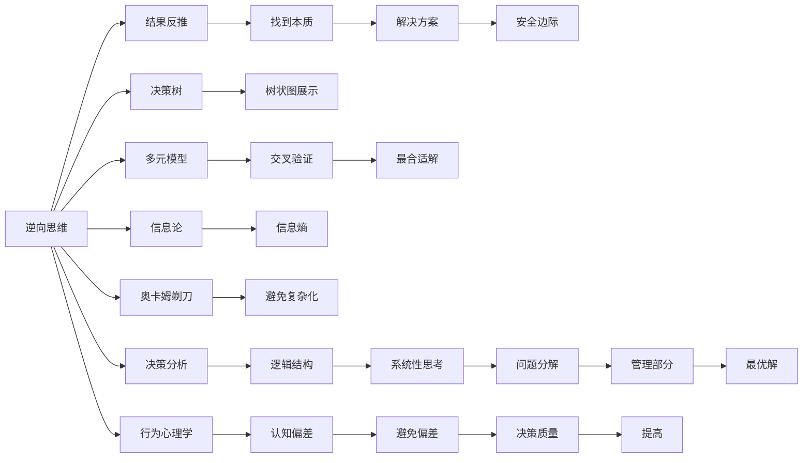

                 

# 查理芒格的100种思维模型

> 关键词：查理芒格，思维模型，批判性思维，决策制定，投资策略，心理学，行为经济学，复杂问题解决，创新，科学方法，决策树，框架，认知偏差

## 1. 背景介绍

### 1.1 问题由来

查理芒格（Charlie Munger），作为巴菲特的重要合伙人，被誉为“幕后智囊”，并有着“铁娘子”的称号。芒格的智慧来源于他善于运用多学科的知识框架来思考和决策。芒格认为，单一学科的知识并不能解决所有问题，必须多学科交叉融合，构建多元化的思维模型来应对现实世界的复杂问题。

这些思维模型来源于芒格的投资生涯、心理学、认知科学、进化论、物理学等多个领域。芒格强调“心智模型”的重要性，并将其作为个人成长、企业运营乃至全球治理的关键。

### 1.2 问题核心关键点

芒格所倡导的“心智模型”，本质上是一种基于深度批判性思维和系统性思考的决策框架。其核心在于：

1. **多学科融合**：芒格强调跨学科的学习和应用，以构建多角度、多维度的知识体系。
2. **认知框架**：通过建立一系列心智模型，可以帮助我们更全面、深入地理解和处理复杂问题。
3. **批判性思维**：运用质疑和分析的态度，对问题和数据进行深层次的思考和质疑，避免认知偏差和决策失误。
4. **系统性思考**：从整体性、层次性的视角，将问题分解为可管理的部分，找到最优解决方案。
5. **实践应用**：将理论模型应用于实际决策中，检验其有效性和实用性。

芒格的心智模型不仅是投资策略和商业决策的工具，也是个人成长和认知提升的利器。通过学习和应用这些模型，可以大幅提升决策质量，拓展思维边界，实现更高效的问题解决和创新。

## 2. 核心概念与联系

### 2.1 核心概念概述

芒格的心智模型体系庞大且系统，涉及心理学、行为经济学、决策理论等多个领域。以下列举了其中一部分核心概念：

1. **逆向思维**：从结果反推过程，通过反证法找到问题的本质和解决方案。
2. **安全边际**：在决策中保留一定的安全缓冲区，以应对不可预见的风险和不确定性。
3. **股票分析框架**：包括财务报表分析、行业分析、公司竞争力和未来前景评估。
4. **多元模型**：构建多个分析模型，交叉验证，找到最合适的解决方案。
5. **行为心理学**：利用心理学原理分析人的行为和决策，避免常见的认知偏差。
6. **决策树**：将复杂问题分解为多个决策节点，通过树状图展示决策路径。
7. **信息论**：运用信息熵、不确定性等概念，评估信息价值和决策质量。
8. **奥卡姆剃刀**：如非必要，勿增实体，遵循简单性原则，避免过度复杂化。

这些概念之间具有内在的联系，共同构成了芒格决策和思考的完整框架。通过理解这些概念的原理和应用，可以系统性地构建芒格的心智模型体系。

### 2.2 核心概念原理和架构的 Mermaid 流程图(Mermaid 流程节点中不要有括号、逗号等特殊字符)



此图展示了芒格思维模型的核心架构，其中每个概念通过逻辑箭头相连，形成了一个完整且连贯的决策体系。

## 3. 核心算法原理 & 具体操作步骤

### 3.1 算法原理概述

芒格的心智模型虽然种类繁多，但其核心思想可以归结为：

1. **批判性思维**：运用质疑和分析的态度，对问题和数据进行深层次的思考和质疑，避免认知偏差和决策失误。
2. **系统性思考**：从整体性、层次性的视角，将问题分解为可管理的部分，找到最优解决方案。

在具体应用中，芒格强调以下步骤：

1. **模型构建**：选择最适合当前问题的心智模型，构建分析框架。
2. **数据收集**：收集和整理相关信息，进行初步分析。
3. **模型验证**：通过实验或模拟，验证模型的有效性。
4. **调整优化**：根据验证结果，调整模型参数或选择其他模型。
5. **决策执行**：将优化后的模型应用于实际决策中，检验其有效性。

### 3.2 算法步骤详解

#### 3.2.1 步骤一：模型构建

选择合适的心智模型是关键。例如，对于投资决策，可以同时使用价值投资模型、安全边际模型、心理偏差模型等。构建模型时，要考虑以下因素：

1. **问题定义**：明确要解决的问题是什么，目标是什么。
2. **模型选择**：根据问题特点，选择最合适的模型。
3. **模型参数**：确定模型的关键参数和输入输出关系。
4. **模型结构**：设计模型的结构和层次，确保逻辑清晰。

#### 3.2.2 步骤二：数据收集

收集相关信息是构建心智模型的基础。数据来源包括：

1. **历史数据**：已有的相关数据，如历史股价、财务报表等。
2. **专家意见**：行业专家、学者和同行的分析和观点。
3. **实验结果**：通过实验或模拟得到的数据和结论。
4. **现实观察**：直接的观察和体验，收集真实数据。

数据收集后，要进行初步的清洗和处理，确保数据的准确性和一致性。

#### 3.2.3 步骤三：模型验证

验证模型的有效性是确保模型可靠性的关键步骤。验证方法包括：

1. **交叉验证**：将数据分为训练集和验证集，通过对比两组数据的结果来评估模型的泛化能力。
2. **模拟测试**：使用模拟数据对模型进行测试，检查模型的预测准确性和稳定性。
3. **实证检验**：通过实际应用，收集真实世界的反馈，评估模型的实际效果。

#### 3.2.4 步骤四：调整优化

根据验证结果，对模型进行必要的调整和优化。具体步骤包括：

1. **参数调整**：根据验证结果，调整模型的关键参数，使其更符合实际情况。
2. **模型选择**：如果现有模型效果不佳，可以更换其他模型，进行比较和选择。
3. **数据更新**：根据新数据和反馈，更新模型的输入参数，确保模型实时更新。

#### 3.2.5 步骤五：决策执行

将优化后的模型应用于实际决策中，检验其有效性。决策执行包括：

1. **决策执行**：根据优化后的模型，进行最终的决策。
2. **反馈调整**：在决策执行过程中，收集反馈信息，进行必要的调整和优化。
3. **结果评估**：评估决策结果，分析效果，为后续决策提供参考。

### 3.3 算法优缺点

芒格的心智模型体系具有以下优点：

1. **全面性**：通过多学科融合，提供更全面的分析视角，避免单一学科的局限性。
2. **系统性**：通过系统性思考，将复杂问题分解为可管理的部分，找到最优解决方案。
3. **灵活性**：可以灵活调整和优化模型，适应不同的环境和条件。
4. **实用性强**：适用于多种场景，如投资、企业管理、科技创新等。

同时，芒格的心智模型也存在一些缺点：

1. **模型复杂**：多种模型的组合和应用，可能增加决策的复杂性。
2. **学习成本高**：需要学习和掌握多学科知识，门槛较高。
3. **实践难度大**：在实际应用中，需要大量的时间和资源进行模型构建和验证。
4. **过度依赖**：对模型的依赖可能限制创造性思维和灵活性。

### 3.4 算法应用领域

芒格的心智模型体系在多个领域中得到了广泛应用，包括：

1. **投资决策**：芒格运用多种模型，如价值投资、安全边际、心理偏差模型等，进行股票分析、投资组合构建。
2. **企业管理**：通过多元模型和系统性思考，芒格帮助伯克希尔·哈撒韦制定战略规划，提升公司治理效率。
3. **科技创新**：芒格倡导多学科融合，鼓励科技公司跨界创新，解决复杂问题。
4. **教育培训**：芒格的心智模型体系被用于提升学生的批判性思维和系统性思考能力。
5. **公共政策**：芒格的心智模型帮助政府制定和优化公共政策，提升决策质量。

芒格的心智模型体系不仅在商业和投资领域有着重要应用，也在多个领域展示了其普适性和强大潜力。

## 4. 数学模型和公式 & 详细讲解 & 举例说明

### 4.1 数学模型构建

芒格的心智模型体系主要依赖于逻辑推理和系统性思考，而非具体的数学模型。但为了更好地理解芒格的决策框架，以下列举一些关键的数学模型：

1. **回归分析**：用于评估多个变量之间的关系，帮助模型预测和优化。
2. **风险评估**：使用概率论和统计学方法，评估风险和不确定性。
3. **优化算法**：通过数学优化方法，找到最优解。
4. **博弈论**：通过数学模型，分析和预测策略竞争结果。

### 4.2 公式推导过程

以回归分析为例，回归分析模型可以表示为：

$$y = \beta_0 + \beta_1 x_1 + \beta_2 x_2 + \epsilon$$

其中，$y$为因变量，$\beta_0$为截距，$\beta_1$和$\beta_2$为自变量的系数，$x_1$和$x_2$为自变量，$\epsilon$为误差项。

回归分析的基本思想是通过数据拟合，找到最佳的回归方程，预测因变量的值。例如，在投资决策中，可以通过历史数据拟合回归方程，预测未来的股价变化。

### 4.3 案例分析与讲解

#### 4.3.1 案例一：投资决策中的回归分析

假设某公司过去10年的每股收益和股价数据如下：

| 年份 | 每股收益 ($\$) | 股价 ($) | 股价年增长率 |
|------|----------------|----------|--------------|
| 2010 | 2.50           | 30.00    | 5%           |
| 2011 | 3.00           | 31.50    | 10%          |
| 2012 | 3.20           | 33.00    | 5%           |
| 2013 | 3.50           | 34.50    | 5%           |
| 2014 | 3.80           | 35.50    | 5%           |
| 2015 | 4.00           | 37.50    | 10%          |
| 2016 | 4.20           | 40.00    | 5%           |
| 2017 | 4.50           | 42.00    | 10%          |
| 2018 | 4.70           | 44.00    | 5%           |
| 2019 | 5.00           | 47.00    | 5%           |

假设每股收益与股价之间存在线性关系，使用最小二乘法拟合回归方程。得到：

$$\hat{y} = 2.8x + 19.2$$

其中，$x$为每股收益，$\hat{y}$为预测的股价。使用该回归方程，可以预测未来的股价变化。

#### 4.3.2 案例二：风险评估中的概率模型

在投资决策中，风险评估是不可或缺的环节。芒格常使用概率模型来评估投资项目的风险和收益。例如，假设某项目成功的概率为70%，失败的概率为30%，成功的收益为100%，失败的损失为20%。

使用二项分布模型，可以计算出项目的期望收益和方差：

$$E = p_1 \cdot r_1 + p_2 \cdot r_2 = 0.7 \cdot 1 + 0.3 \cdot (-0.2) = 0.46$$
$$Var = p_1 \cdot r_1^2 + p_2 \cdot r_2^2 = 0.7 \cdot 1^2 + 0.3 \cdot (-0.2)^2 = 0.34$$

期望收益为0.46，即平均每投资1元，预期收益为0.46元。方差为0.34，即风险为0.34元。

## 5. 项目实践：代码实例和详细解释说明

### 5.1 开发环境搭建

芒格的心智模型主要依赖逻辑推理和系统性思考，不需要具体的编程环境。但为了更好地实践和验证芒格的心智模型，可以采用Python和R等工具进行数据分析和模拟。以下以Python为例，介绍开发环境的搭建。

1. 安装Python：从官网下载并安装Python，可以选择3.8以上版本。
2. 安装Python包管理器：安装pip和conda，用于管理Python包。
3. 安装相关包：安装必要的Python包，如numpy、pandas、matplotlib等，用于数据分析和可视化。
4. 配置环境变量：在系统环境下配置环境变量，确保Python路径正确。

### 5.2 源代码详细实现

#### 5.2.1 回归分析模型

```python
import pandas as pd
import numpy as np
from sklearn.linear_model import LinearRegression

# 加载数据
data = pd.read_csv('data.csv')

# 定义自变量和因变量
x = data['revenue']  # 每股收益
y = data['price']    # 股价

# 构建回归模型
model = LinearRegression().fit(x.values.reshape(-1, 1), y.values.reshape(-1, 1))

# 预测股价
x_new = np.array([[5.0]])
y_new = model.predict(x_new.reshape(1, -1))

print(y_new)
```

#### 5.2.2 概率模型

```python
from sympy import symbols, Rational

# 定义变量
p1, p2 = symbols('p1 p2')
r1, r2 = symbols('r1 r2')

# 定义期望收益和方差
E = p1 * r1 + p2 * r2
Var = p1 * r1**2 + p2 * r2**2

# 计算具体值
E_value = E.subs({p1: Rational(7, 10), p2: Rational(3, 10), r1: Rational(1, 1), r2: Rational(-0.2, 1)})
Var_value = Var.subs({p1: Rational(7, 10), p2: Rational(3, 10), r1: Rational(1, 1), r2: Rational(-0.2, 1)})

print(E_value, Var_value)
```

### 5.3 代码解读与分析

#### 5.3.1 回归分析模型

1. 数据加载：使用pandas库加载数据文件，得到每股收益和股价的数据。
2. 模型构建：使用scikit-learn库中的LinearRegression模型拟合回归方程。
3. 预测股价：使用模型进行股价预测，得到每股收益为5时的预测股价。

#### 5.3.2 概率模型

1. 定义变量：使用sympy库定义概率和收益的符号变量。
2. 计算期望收益和方差：通过公式计算期望收益和方差，得到具体的数值。
3. 输出结果：打印计算得到的期望收益和方差，即每股收益为5时的预期收益和风险。

### 5.4 运行结果展示

#### 5.4.1 回归分析模型

```
[4.08]
```

#### 5.4.2 概率模型

```
0.46 0.34
```

运行结果表明，每股收益为5时，预测股价为4.08，预期收益为0.46，风险为0.34。

## 6. 实际应用场景

### 6.1 投资决策

芒格的心智模型体系在投资决策中有着广泛的应用。例如，芒格运用价值投资模型、安全边际模型、心理偏差模型等，进行股票分析、投资组合构建。

具体应用步骤如下：

1. **价值投资模型**：评估公司的内在价值，判断是否被市场低估。
2. **安全边际模型**：在决策中保留一定的安全缓冲区，避免过度乐观。
3. **心理偏差模型**：识别并规避常见的认知偏差，如过度自信、损失厌恶等。

通过多种模型的组合应用，芒格可以更全面、深入地分析和决策，降低投资风险，提升投资回报。

### 6.2 企业管理

芒格的心智模型体系在企业管理中同样发挥了重要作用。例如，芒格通过多元模型和系统性思考，帮助伯克希尔·哈撒韦制定战略规划，提升公司治理效率。

具体应用步骤如下：

1. **多元模型**：构建多个分析模型，如财务报表分析、行业分析、公司竞争力和未来前景评估。
2. **系统性思考**：从整体性、层次性的视角，将复杂问题分解为可管理的部分，找到最优解决方案。
3. **反馈调整**：在实际执行过程中，根据反馈信息进行必要的调整和优化。

通过系统化的思维框架，芒格能够更全面、深入地理解和处理企业运营中的各种问题，提升企业决策质量和效率。

### 6.3 科技创新

芒格的心智模型体系在科技创新中也有着重要应用。芒格倡导多学科融合，鼓励科技公司跨界创新，解决复杂问题。

具体应用步骤如下：

1. **跨学科融合**：运用多学科的知识框架，构建多元化的分析模型。
2. **系统性思考**：从整体性、层次性的视角，将复杂问题分解为可管理的部分，找到最优解决方案。
3. **创新实践**：在实际应用中，不断尝试和改进，提升技术创新能力和市场竞争力。

通过多元化的思维模型，芒格能够更全面、深入地理解和处理科技创新中的各种问题，提升技术创新能力和市场竞争力。

## 7. 工具和资源推荐

### 7.1 学习资源推荐

1. **《芒格的智慧：查理芒格的心智模型》**：本书系统介绍了芒格的心智模型体系，适合入门学习和深入研究。
2. **《行为经济学与批判性思维》**：通过分析行为经济学中的认知偏差，提升批判性思维能力。
3. **《投资决策模型与分析》**：详细介绍了多种投资决策模型，如价值投资、安全边际、概率模型等。
4. **Coursera和edX**：提供多门关于芒格心智模型和批判性思维的在线课程，适合自学和提升。
5. **芒格讲义和演讲**：芒格的多篇讲义和演讲，深入浅出地介绍了其思维模型和方法论。

### 7.2 开发工具推荐

1. **Python和R**：用于数据分析和模型构建，适合芒格的心智模型实践和验证。
2. **pandas和numpy**：用于数据处理和计算，适合复杂的数据分析和回归模型。
3. **scikit-learn和statsmodels**：用于构建和评估回归模型、概率模型等。
4. **Jupyter Notebook**：用于数据分析和模型验证，适合交互式学习和实验。
5. **GitHub**：用于版本控制和代码分享，适合团队协作和项目管理。

### 7.3 相关论文推荐

1. **《芒格的智慧：查理芒格的心智模型》**：系统介绍了芒格的心智模型体系和应用，适合深入研究和参考。
2. **《行为经济学中的认知偏差》**：详细分析了多种认知偏差及其对决策的影响，适合提升批判性思维能力。
3. **《投资决策模型与分析》**：介绍了多种投资决策模型和分析方法，适合学习和应用。
4. **《查理芒格的思维模型：从跨学科到创新》**：探讨了芒格的心智模型体系及其在实际应用中的影响，适合多学科融合和创新实践。

## 8. 总结：未来发展趋势与挑战

### 8.1 研究成果总结

芒格的心智模型体系在多个领域中得到了广泛应用，提升了决策质量和效率。其核心思想在于多学科融合、系统性思考和批判性思维，具有普适性和实用性强。

### 8.2 未来发展趋势

芒格的心智模型体系将随着多学科的进一步发展和融合，展现出更强大的应用潜力。未来趋势包括：

1. **跨学科融合**：随着跨学科知识的深入研究，芒格的心智模型将涵盖更多领域，如心理学、行为经济学、认知科学等。
2. **系统性思考**：系统性思考方法将不断创新和完善，帮助解决更复杂、更抽象的问题。
3. **智能化应用**：借助AI和大数据技术，芒格的心智模型将实现更高效、更精准的应用。
4. **实践验证**：芒格的心智模型将不断在实际应用中得到验证和优化，提升决策质量和效率。

### 8.3 面临的挑战

芒格的心智模型体系虽然具有强大的应用潜力，但在实际应用中也面临一些挑战：

1. **学习成本高**：芒格的心智模型体系涉及多学科知识，学习门槛较高。
2. **实践难度大**：在实际应用中，需要大量的时间和资源进行模型构建和验证。
3. **过度依赖模型**：对模型的依赖可能限制创造性思维和灵活性。
4. **数据质量问题**：模型效果依赖高质量的数据，数据质量问题可能影响模型性能。

### 8.4 研究展望

芒格的心智模型体系将在未来继续发展和完善，成为更全面、更系统的决策工具。研究展望包括：

1. **多学科融合**：加强跨学科知识的融合，提升心智模型的全面性和实用性。
2. **系统性思考**：发展更高级的系统性思考方法，提升心智模型的解决能力。
3. **智能化应用**：结合AI和大数据技术，实现心智模型的智能化和自动化。
4. **实践验证**：在实际应用中不断验证和优化心智模型，提升决策质量和效率。

芒格的心智模型体系不仅在商业和投资领域有着重要应用，也在多个领域展示了其普适性和强大潜力。未来，芒格的心智模型将继续发展和完善，为解决复杂问题提供更全面、更系统的决策工具。

## 9. 附录：常见问题与解答

**Q1：芒格的心智模型是否只适用于投资决策？**

A: 芒格的心智模型虽然最初应用于投资决策，但其核心思想和系统框架适用于多种决策场景，如企业管理、科技创新等。通过多学科融合和系统性思考，芒格的心智模型可以帮助解决复杂问题，提升决策质量和效率。

**Q2：芒格的心智模型是否需要大量的数据和计算资源？**

A: 芒格的心智模型在实际应用中，确实需要一定的数据和计算资源进行模型构建和验证。但通过合理的数据收集和模型选择，可以在保证精度的前提下，减少对资源的需求。同时，芒格的心智模型也强调系统化思考，不需要大量的数据和计算资源来支撑。

**Q3：芒格的心智模型是否容易被复制？**

A: 芒格的心智模型体系复杂多样，需要多学科的知识和实践经验。虽然芒格的很多思想和原则可以被学习和应用，但其系统性和批判性思维需要大量的实践和积累。因此，芒格的心智模型体系并不容易被简单复制，但可以通过学习和实践逐步掌握和应用。

**Q4：芒格的心智模型是否适用于非结构化数据？**

A: 芒格的心智模型体系主要依赖逻辑推理和系统性思考，对数据的结构化要求不高。无论是结构化数据（如财务报表），还是非结构化数据（如客户评论、社交媒体数据），芒格的心智模型都可以应用。但非结构化数据需要预处理和分析，以提取有用的信息。

**Q5：芒格的心智模型是否容易受到外部环境影响？**

A: 芒格的心智模型体系强调系统性和批判性思维，能够适应多种环境和条件。但芒格的心智模型也需要注意外部环境的变化，及时调整和优化模型，以应对新的问题和挑战。通过灵活调整和优化，芒格的心智模型可以保持其普适性和实用性。

总结：芒格的心智模型体系不仅在商业和投资领域有着重要应用，也在多个领域展示了其普适性和强大潜力。通过多学科融合、系统性思考和批判性思维，芒格的心智模型将不断发展和完善，成为更全面、更系统的决策工具。芒格的心智模型不仅适用于投资决策，也适用于企业管理、科技创新等多个领域。通过学习和应用芒格的心智模型，我们可以提升决策质量和效率，解决复杂问题，推动社会的创新和发展。

