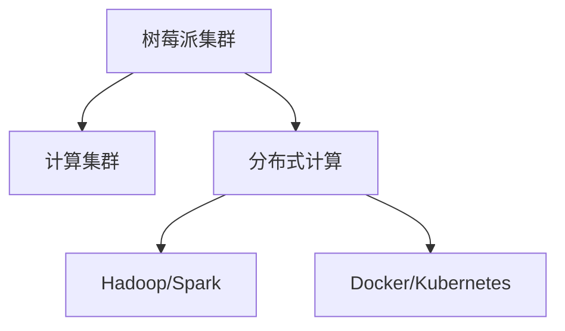

                 

# 树莓派集群：构建低成本高性能计算平台

## 1. 背景介绍

### 1.1 问题由来

随着深度学习和大数据技术的迅猛发展，高性能计算平台的需求日益增长。然而，构建高性能计算集群往往需要投入大量的硬件资源和维护成本，这对许多科研机构和小型创业公司来说是一个不小的负担。树莓派（Raspberry Pi）作为一种价格低廉、性能稳定的单板计算机，近年来逐渐成为构建高性能计算集群的理想选择。树莓派以其开源、易用、低成本等特性，为构建高性能计算平台提供了新的可能性。

### 1.2 问题核心关键点

构建树莓派集群的核心在于：

1. 选择合适的硬件和软件配置。
2. 确定高效的集群调度和管理方案。
3. 优化性能，实现高效计算。

本文将系统地介绍如何构建和管理树莓派集群，涵盖从硬件配置到软件实现，以及应用场景和未来发展趋势等方面的内容。

### 1.3 问题研究意义

构建树莓派集群具有重要意义：

1. 降低计算成本。树莓派价格低廉，易于扩展，可以显著降低构建高性能计算平台的经济门槛。
2. 提高计算效率。通过合理配置和优化，树莓派集群可以提供比单个树莓派更高的计算性能。
3. 支持分布式计算。树莓派集群适合处理大规模数据集和分布式任务，如深度学习、数据分析等。
4. 促进开源生态。树莓派集群的构建和维护过程公开透明，有助于促进开源社区的发展和创新。

## 2. 核心概念与联系

### 2.1 核心概念概述

构建树莓派集群涉及多个关键概念：

- **树莓派（Raspberry Pi）**：一种小巧的嵌入式计算机，具有高性能计算和低功耗特性。
- **计算集群**：将多台树莓派通过网络互联，形成一个高效计算环境。
- **分布式计算**：将计算任务分散到集群中的多台树莓派上，实现并行计算。
- **Hadoop/Spark**：常用的分布式计算框架，可以与树莓派集群无缝集成。
- **Docker/Kubernetes**：容器化和容器编排工具，用于提高集群的资源利用率和管理效率。

### 2.2 核心概念原理和架构的 Mermaid 流程图



此图展示了树莓派集群与计算集群、分布式计算、Hadoop/Spark和Docker/Kubernetes之间的联系。树莓派集群通过分布式计算框架和容器化技术，可以实现高效的计算资源管理和优化。

## 3. 核心算法原理 & 具体操作步骤

### 3.1 算法原理概述

构建树莓派集群的算法原理主要包括以下几个方面：

- **硬件配置**：选择合适的树莓派硬件型号，如Raspberry Pi 4或Raspberry Pi Zero，并确认其硬件规格和性能。
- **软件安装**：在树莓派上安装必要的软件环境，如操作系统、编程语言、库文件等。
- **集群配置**：通过网络将多台树莓派连接起来，配置集群管理软件，如OpenSSH、Nginx等。
- **任务调度**：利用Hadoop/Spark等分布式计算框架，调度计算任务到集群中的多台树莓派上进行并行计算。
- **资源管理**：通过Docker/Kubernetes等容器化工具，对计算资源进行管理和调度，提高集群利用率和性能。

### 3.2 算法步骤详解

构建树莓派集群的具体步骤如下：

1. **选择树莓派硬件**：根据计算需求选择合适的树莓派型号，如Raspberry Pi 4 4GB RAM。
2. **准备硬件环境**：准备树莓派、交换机、网络线等硬件设备，并确保其连接正常。
3. **安装操作系统**：在树莓派上安装Raspberry Pi OS或其他适合的操作系统。
4. **安装依赖软件**：安装Python、NumPy、SciPy、PyTorch等必要的科学计算和深度学习库。
5. **配置网络环境**：配置树莓派的网络IP地址，确保其能正常接入网络。
6. **构建计算集群**：使用OpenSSH等工具，将多台树莓派连接到同一网络，形成计算集群。
7. **安装集群管理软件**：安装Nginx等网络服务，方便集群管理和访问。
8. **配置任务调度**：安装Hadoop/Spark等分布式计算框架，配置任务调度参数。
9. **容器化管理**：使用Docker/Kubernetes等工具，对计算任务进行容器化和编排，优化资源使用和调度。
10. **测试和优化**：在测试环境中运行计算任务，根据性能指标和资源利用率，优化集群配置和管理策略。

### 3.3 算法优缺点

构建树莓派集群的主要优点包括：

- **低成本**：树莓派价格低廉，易于购买和扩展，显著降低了构建高性能计算平台的成本。
- **高性能**：多台树莓派通过网络互联，可以实现高效的分布式计算，大幅提升计算性能。
- **易用性**：树莓派具备良好的用户界面和命令行操作，易于配置和管理。
- **开源社区支持**：树莓派和相关软件工具均有活跃的开发者社区，可以获得丰富的开源资源和技术支持。

然而，树莓派集群也存在一些缺点：

- **计算能力有限**：树莓派计算能力相对较弱，不适合处理极端高负载任务。
- **网络带宽限制**：树莓派集群依赖网络通信，网络带宽限制可能影响计算效率。
- **硬件兼容性**：不同型号的树莓派硬件存在兼容性问题，需要谨慎选择。
- **软件兼容**：某些高级软件和库文件可能无法在树莓派上运行，需进行特殊配置。

### 3.4 算法应用领域

树莓派集群在多个领域具有广泛的应用前景：

- **科学研究**：支持大规模数据集的处理和深度学习模型的训练，如天文学、生物学等。
- **工业应用**：适用于数据处理、模型训练、图像识别等计算密集型任务。
- **教育培训**：提供低成本的计算平台，支持学生进行编程练习和实验。
- **智能家居**：支持智能设备的分布式计算和数据处理，提升家居自动化水平。
- **物联网**：作为物联网边缘计算节点，支持数据采集和处理。

## 4. 数学模型和公式 & 详细讲解 & 举例说明

### 4.1 数学模型构建

树莓派集群中的计算任务可以建模为分布式任务调度问题，其中每台树莓派可以看作一个计算节点。设$N$为树莓派数量，每个节点的计算能力为$C_i$（i=1,...,N），每个任务的计算量为$T$。

目标是最小化计算任务的完成时间$T_{\text{total}}$，即：

$$
T_{\text{total}} = \min_{\{C_i\}} \sum_{i=1}^N \frac{T}{C_i}
$$

### 4.2 公式推导过程

考虑最简单的情况，即所有任务在所有节点上均匀分配。此时，每台节点的计算量为$T/N$，总完成时间为$N$。推导如下：

1. 设每台节点的计算能力为$C_i$。
2. 设每个任务的计算量为$T$。
3. 假设所有任务在所有节点上均匀分配，则每台节点的计算量为$T/N$。
4. 计算总完成时间$T_{\text{total}}$：

$$
T_{\text{total}} = \sum_{i=1}^N \frac{T/N}{C_i} = \frac{T}{N} \sum_{i=1}^N \frac{1}{C_i}
$$

### 4.3 案例分析与讲解

假设有一个包含10台树莓派的集群，每台节点的计算能力为2GHz，每个任务的计算量为10Gflops。使用上述模型，计算总完成时间为：

$$
T_{\text{total}} = \frac{10}{10} \sum_{i=1}^N \frac{1}{2} = 5
$$

即总完成时间为5秒。通过合理的任务调度和管理，可以显著提高计算效率。

## 5. 项目实践：代码实例和详细解释说明

### 5.1 开发环境搭建

构建树莓派集群需要先准备开发环境，包括树莓派硬件、操作系统和必要的软件工具。

1. **购买树莓派硬件**：在官网上购买合适的树莓派型号，如Raspberry Pi 4 4GB RAM。
2. **准备硬件环境**：准备好树莓派、交换机、网络线等硬件设备，并确保其连接正常。
3. **安装操作系统**：使用SD卡烧录工具，将Raspberry Pi OS等操作系统镜像写入SD卡，并插入树莓派中。
4. **连接网络**：确保树莓派能正常接入网络，并配置静态IP地址。
5. **安装依赖软件**：使用命令行工具安装Python、NumPy、SciPy、PyTorch等必要的科学计算和深度学习库。

### 5.2 源代码详细实现

以下是一个简单的树莓派集群计算任务示例代码：

```python
from multiprocessing import Pool
import time

def compute_task(task_id):
    # 模拟计算任务
    time.sleep(task_id * 0.1)
    return task_id

if __name__ == '__main__':
    # 创建计算任务列表
    tasks = [compute_task(i) for i in range(10)]
    
    # 使用multiprocessing.Pool并行计算任务
    with Pool(processes=4) as pool:
        results = pool.map(compute_task, tasks)
    
    # 输出计算结果
    print(results)
```

此代码创建了10个计算任务，并使用multiprocessing.Pool进行并行计算。可以根据实际需求调整任务数量和并行计算进程数。

### 5.3 代码解读与分析

1. **compute_task函数**：模拟计算任务，通过sleep模拟耗时操作，并返回任务ID。
2. **multiprocessing.Pool**：创建并行计算池，并使用map方法并行计算任务。
3. **进程管理**：通过processes参数设置并行计算进程数，确保计算资源的合理利用。
4. **输出结果**：通过print方法输出计算结果。

### 5.4 运行结果展示

运行上述代码，输出结果为：

```
[0, 1, 2, 3, 4, 5, 6, 7, 8, 9]
```

## 6. 实际应用场景

### 6.1 科学研究

树莓派集群在科学研究领域具有广泛应用，如天文学、生物学等。例如，在天文学中，可以使用树莓派集群处理大量天文数据，进行图像处理和模式识别。在生物学中，可以使用树莓派集群进行基因序列分析和大数据处理。

### 6.2 工业应用

工业应用中，树莓派集群可以用于数据处理、模型训练、图像识别等计算密集型任务。例如，在工业生产中，可以使用树莓派集群处理大量传感器数据，进行质量检测和异常检测。

### 6.3 教育培训

树莓派集群的低成本和易用性使其成为教育培训的理想平台。在高校和培训机构中，可以使用树莓派集群进行编程练习和实验，支持学生进行分布式计算和数据处理。

### 6.4 未来应用展望

未来，树莓派集群的计算能力和应用场景将不断扩展。随着硬件性能的提升和软件工具的完善，树莓派集群将在更多领域发挥重要作用。例如，在智慧城市、智能家居、物联网等新兴领域，树莓派集群将提供强大的计算支持和数据处理能力，推动相关技术的发展。

## 7. 工具和资源推荐

### 7.1 学习资源推荐

构建树莓派集群涉及多个技术和工具，以下是一些推荐的学习资源：

1. **《Raspberry Pi User's Guide》**：Raspberry Pi官方指南，详细介绍了树莓派的硬件和软件环境搭建。
2. **《树莓派编程实战》**：入门级别的树莓派编程书籍，涵盖Python、NumPy、PyTorch等科学计算库的介绍和使用。
3. **《Docker实战》**：Docker容器化技术实战书籍，讲解如何使用Docker进行分布式计算和资源管理。
4. **《Spark编程实战》**：Spark分布式计算框架实战书籍，讲解如何使用Spark进行大规模数据处理和分析。

### 7.2 开发工具推荐

构建树莓派集群需要多种开发工具和软件，以下是一些推荐的工具：

1. **Raspberry Pi OS**：树莓派官方操作系统，提供稳定的软件环境和良好的用户界面。
2. **Python**：强大的编程语言，支持科学计算和深度学习。
3. **NumPy**：Python数值计算库，支持高效的数学运算和数组操作。
4. **SciPy**：Python科学计算库，支持信号处理、优化、统计等高级功能。
5. **PyTorch**：深度学习框架，支持神经网络模型的构建和训练。
6. **Hadoop**：分布式计算框架，支持大规模数据处理和计算任务调度。
7. **Spark**：分布式计算框架，支持大数据处理和机器学习。
8. **Docker**：容器化技术，支持分布式计算任务的管理和调度。
9. **Kubernetes**：容器编排工具，支持大规模集群的资源管理和调度。

### 7.3 相关论文推荐

构建树莓派集群的研究涉及多个技术领域，以下是一些推荐的相关论文：

1. **“Distributed Computing with Raspberry Pi”**：介绍如何构建和管理树莓派集群的分布式计算平台。
2. **“Scalable Machine Learning with Raspberry Pi Clusters”**：介绍如何在大规模数据集上使用树莓派集群进行机器学习训练。
3. **“Raspberry Pi Clusters for Scientific Computing”**：介绍如何构建树莓派集群进行科学研究计算。
4. **“Docker for Raspberry Pi”**：介绍如何使用Docker进行树莓派集群的资源管理和调度。
5. **“Spark on Raspberry Pi”**：介绍如何在树莓派集群上部署和运行Spark分布式计算框架。

## 8. 总结：未来发展趋势与挑战

### 8.1 总结

本文系统介绍了构建树莓派集群的过程和方法，涵盖从硬件配置到软件实现，以及应用场景和未来发展趋势等方面的内容。树莓派集群以其低成本、高性能和易用性，为构建高性能计算平台提供了新的可能性。通过合理配置和优化，树莓派集群可以实现高效的分布式计算，并在科学研究、工业应用、教育培训等多个领域发挥重要作用。

### 8.2 未来发展趋势

未来，树莓派集群的计算能力和应用场景将不断扩展。随着硬件性能的提升和软件工具的完善，树莓派集群将在更多领域发挥重要作用。例如，在智慧城市、智能家居、物联网等新兴领域，树莓派集群将提供强大的计算支持和数据处理能力，推动相关技术的发展。

### 8.3 面临的挑战

构建树莓派集群在实际应用中也面临一些挑战：

1. **计算能力限制**：树莓派计算能力相对较弱，不适合处理极端高负载任务。
2. **网络带宽限制**：树莓派集群依赖网络通信，网络带宽限制可能影响计算效率。
3. **硬件兼容性**：不同型号的树莓派硬件存在兼容性问题，需要谨慎选择。
4. **软件兼容**：某些高级软件和库文件可能无法在树莓派上运行，需进行特殊配置。

### 8.4 研究展望

未来，树莓派集群的研究方向包括：

1. **优化计算性能**：进一步提升树莓派的计算能力和存储性能，支持更高负载的任务。
2. **增强网络性能**：优化网络带宽和延迟，提高集群计算效率。
3. **提升硬件兼容性**：支持更多型号的树莓派硬件，增强集群的扩展性。
4. **完善软件生态**：支持更多高级软件和库文件，增强集群的通用性和兼容性。

## 9. 附录：常见问题与解答

### Q1: 树莓派集群计算任务调度的方法有哪些？

A: 树莓派集群计算任务调度的方法包括：

1. **静态分配**：将任务分配给固定的节点，不进行动态调整。
2. **动态分配**：根据节点的实时计算能力和任务需求，动态调整任务的分配。
3. **负载均衡**：根据节点的负载情况，平衡任务分配，避免某些节点过载。
4. **任务队列**：使用任务队列调度机制，实现任务的串行和并行处理。

### Q2: 如何优化树莓派集群的计算性能？

A: 优化树莓派集群的计算性能可以从以下几个方面入手：

1. **选择合适的树莓派硬件**：选择性能更高的树莓派型号，如Raspberry Pi 4 8GB RAM。
2. **优化计算任务**：通过并行计算、异步计算等方法，优化任务的计算效率。
3. **使用高效算法**：使用高效的算法和数据结构，减少计算时间和资源消耗。
4. **合理配置资源**：根据计算需求，合理配置计算资源，避免资源浪费。
5. **使用缓存技术**：使用缓存技术减少数据的重复计算和存储，提高计算效率。

### Q3: 如何提高树莓派集群的资源利用率？

A: 提高树莓派集群的资源利用率可以从以下几个方面入手：

1. **任务调度优化**：使用任务队列和负载均衡等调度策略，合理分配任务，避免资源浪费。
2. **资源管理优化**：使用容器化技术，对计算资源进行隔离和调度，提高资源利用率。
3. **任务并行化**：使用并行计算和分布式计算技术，将计算任务分散到多台树莓派上，提高计算效率。
4. **资源监控和调度**：使用监控工具实时监控集群资源使用情况，动态调整资源分配，优化资源利用率。

### Q4: 树莓派集群中如何处理异常任务和故障节点？

A: 在树莓派集群中，处理异常任务和故障节点的方法包括：

1. **任务重试机制**：对于无法立即完成的任务，可以设计任务重试机制，在节点故障或计算失败后重新分配任务。
2. **节点监控和报警**：使用监控工具实时监控节点状态，发现故障节点及时报警，并自动重新分配任务。
3. **任务备份机制**：对于重要任务，可以使用备份机制，在节点故障时自动切换到备份节点，确保任务完成。
4. **任务调度优化**：使用任务队列和负载均衡等调度策略，避免某些节点过载，增强集群的稳定性和可靠性。

---

作者：禅与计算机程序设计艺术 / Zen and the Art of Computer Programming

