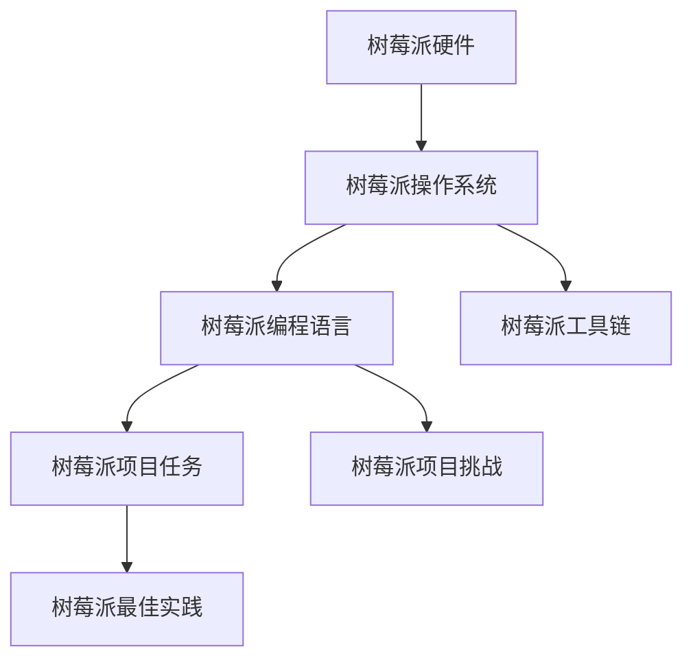

                 

# 树莓派项目开发：从入门到精通

## 1. 背景介绍

### 1.1 问题由来

在近年来，随着开源硬件的迅速发展，树莓派(Raspberry Pi)等小型嵌入式设备逐渐成为电子产品开发的利器。树莓派以其低成本、易用性和强大的扩展性，迅速成为硬件开发爱好者、DIY项目制作者和编程学习者的首选平台。然而，对于树莓派项目的开发，很多新手常常感到无从下手。本文旨在引导读者从入门到精通树莓派项目开发，涵盖从硬件搭建、软件安装到系统调优、应用部署等多个方面，帮助初学者快速上手，为进阶者提供深入探讨。

### 1.2 问题核心关键点

树莓派项目开发的核心在于理解其软硬件架构，掌握编程技能，并应用这些知识实现特定的硬件控制和数据处理任务。关键点包括：
- 理解树莓派硬件与操作系统架构
- 掌握树莓派支持的编程语言和工具链
- 掌握树莓派项目开发的常见任务和挑战
- 熟悉树莓派项目开发的最佳实践和工具推荐
- 通过实践项目，逐步掌握树莓派项目开发的综合能力

## 2. 核心概念与联系

### 2.1 核心概念概述

树莓派是一个小型且能量高效的嵌入式计算机，具备一个ARM Cortex-A7处理器，多个USB接口，千兆以太网端口，以及多种扩展接口。其核心组件包括CPU、内存、硬盘、网络接口、电源管理等。树莓派系统基于Linux发行版，常见的有Debian和Raspbian等，支持Python、C/C++、JavaScript等多种编程语言。

树莓派项目开发的关键概念包括：
- 树莓派硬件：包括CPU、内存、硬盘、网络接口等核心组件。
- 树莓派操作系统：包括Debian、Raspbian等发行版。
- 树莓派编程语言：包括Python、C/C++、JavaScript等。
- 树莓派工具链：包括交叉编译器、IDE、调试工具等。
- 树莓派项目任务：包括硬件控制、数据处理、网络通信、人机交互等。
- 树莓派项目挑战：包括资源受限、数据传输、系统调试等。
- 树莓派最佳实践：包括设计原则、代码规范、版本控制等。

这些核心概念之间的逻辑关系可以通过以下Mermaid流程图来展示：



## 3. 核心算法原理 & 具体操作步骤

### 3.1 算法原理概述

树莓派项目开发的核心算法原理基于嵌入式系统的软件工程方法，包括嵌入式硬件驱动、嵌入式操作系统、嵌入式编程语言、嵌入式调试与优化等。通过理解这些原理，可以更好地设计和实现树莓派项目。

树莓派项目开发通常遵循以下步骤：
1. 硬件搭建：配置树莓派硬件，包括CPU、内存、硬盘、网络等。
2. 系统安装：安装树莓派操作系统，如Debian或Raspbian。
3. 编程开发：选择适合的编程语言和开发环境，编写并测试程序。
4. 调试优化：使用调试工具和性能分析工具，优化程序的性能。
5. 应用部署：将程序部署到树莓派设备上，实现硬件控制和数据处理任务。

### 3.2 算法步骤详解

以下是树莓派项目开发的详细步骤：

#### 3.2.1 硬件搭建

树莓派硬件搭建分为以下几个步骤：

1. 硬件选型：根据项目需求选择合适的树莓派型号，如Raspberry Pi 3B+、Raspberry Pi 4等。
2. 硬件组装：将CPU、内存、硬盘、网络接口等核心组件组装在树莓派主板上。
3. 电源连接：将电源模块正确连接到树莓派，确保系统正常启动。
4. 扩展接口：根据需要选择扩展接口，如USB接口、以太网接口、音频接口等。

#### 3.2.2 系统安装

树莓派系统安装主要包括以下步骤：

1. 准备SD卡：将操作系统镜像写入SD卡，建议使用Linux发行版Debian或Raspbian。
2. 连接树莓派：将SD卡插入树莓派，确保能够正确识别。
3. 系统配置：配置系统基本参数，如时区、网络配置等。
4. 安装必要软件：安装编程语言、IDE、开发工具等，如Python、PyCharm等。

#### 3.2.3 编程开发

树莓派编程开发主要涉及以下几个步骤：

1. 选择编程语言：根据项目需求选择合适的编程语言，如Python、C/C++、JavaScript等。
2. 安装IDE和工具链：安装合适的IDE和交叉编译器，如PyCharm、MinGW等。
3. 编写程序：根据项目需求编写程序，实现硬件控制和数据处理任务。
4. 调试程序：使用调试工具和性能分析工具，如GDB、Python调试器等，优化程序性能。

#### 3.2.4 调试优化

树莓派调试优化主要包括以下几个步骤：

1. 硬件调试：使用调试工具连接树莓派硬件，如USB调试器、JTAG调试器等。
2. 软件调试：使用调试工具和性能分析工具，如GDB、Python调试器等，定位程序错误。
3. 性能优化：使用性能分析工具，如Valgrind、Gprof等，优化程序性能。

#### 3.2.5 应用部署

树莓派应用部署主要包括以下几个步骤：

1. 程序编译：使用交叉编译器将程序编译成树莓派可执行文件。
2. 系统部署：将编译后的程序部署到树莓派设备上，确保能够正常运行。
3. 应用调试：使用调试工具和性能分析工具，确保程序在实际应用中能够正常运行。

### 3.3 算法优缺点

树莓派项目开发的优点包括：
- 低成本：树莓派硬件成本低，易于购买和搭建。
- 易用性：树莓派系统基于Linux，开发工具链成熟，上手容易。
- 扩展性强：树莓派具备多种扩展接口，支持丰富的外设连接。
- 社区支持：树莓派有庞大的开发者社区，资源丰富。

树莓派项目开发的主要缺点包括：
- 资源受限：树莓派硬件资源有限，不适合处理大规模数据。
- 性能瓶颈：树莓派处理器性能较低，不适合处理复杂算法和高并发任务。
- 操作系统稳定性：树莓派系统稳定性可能不如桌面系统，需要额外注意。

### 3.4 算法应用领域

树莓派项目开发广泛应用于以下领域：

1. 智能家居：实现智能灯光、智能安防、智能温控等家居自动化功能。
2. 物联网：实现传感器数据采集、设备状态监控、远程控制等功能。
3. 嵌入式开发：实现嵌入式系统硬件驱动、网络通信、数据处理等功能。
4. 教育培训：实现机器人控制、编程学习、科学实验等功能。
5. 科研实验：实现嵌入式设备测试、数据采集、数据处理等功能。

## 4. 数学模型和公式 & 详细讲解

### 4.1 数学模型构建

树莓派项目开发涉及的数学模型主要包括以下几个方面：

1. 嵌入式系统设计：包括嵌入式硬件设计、嵌入式软件设计、嵌入式系统优化等。
2. 数据处理算法：包括数据采集、数据预处理、数据存储等。
3. 网络通信协议：包括TCP/IP协议、UDP协议、HTTP协议等。
4. 算法优化：包括算法设计与优化、性能分析与优化等。

### 4.2 公式推导过程

以下是树莓派项目开发中常用的数学公式推导过程：

1. 嵌入式系统设计：嵌入式系统设计涉及数字电路设计、时钟系统设计、电源管理等，具体公式推导涉及微控制器、时钟电路、电源电路等。
2. 数据处理算法：数据处理算法涉及数字信号处理、图像处理、音频处理等，具体公式推导涉及数字滤波、频谱分析、图像增强等。
3. 网络通信协议：网络通信协议涉及TCP/IP协议、UDP协议、HTTP协议等，具体公式推导涉及网络层协议、传输层协议、应用层协议等。
4. 算法优化：算法优化涉及算法设计与优化、性能分析与优化等，具体公式推导涉及并行算法、流水线算法、优化算法等。

### 4.3 案例分析与讲解

以树莓派智能家居项目为例，分析树莓派项目开发的数学模型和公式推导过程。

智能家居项目主要包括以下几个方面：

1. 智能灯光控制：使用树莓派和传感器实现智能灯光控制，具体公式推导涉及数字电路设计、传感器数据采集等。
2. 智能安防监控：使用树莓派和摄像头实现智能安防监控，具体公式推导涉及数字图像处理、视频编码等。
3. 智能温控系统：使用树莓派和温湿度传感器实现智能温控系统，具体公式推导涉及数字电路设计、传感器数据采集等。

## 5. 项目实践：代码实例和详细解释说明

### 5.1 开发环境搭建

树莓派开发环境搭建主要包括以下几个步骤：

1. 准备树莓派硬件：购买树莓派主板、SD卡、电源等组件。
2. 搭建树莓派硬件：将CPU、内存、硬盘、网络接口等组件组装在树莓派主板上。
3. 配置树莓派系统：将操作系统镜像写入SD卡，连接树莓派并配置系统参数。
4. 安装编程环境：安装Python、PyCharm、交叉编译器等开发工具。

### 5.2 源代码详细实现

树莓派编程开发主要涉及以下几个方面：

1. 硬件控制：编写程序控制树莓派硬件，如LED控制、传感器数据采集等。
2. 数据处理：编写程序处理传感器数据，实现数据存储和分析。
3. 网络通信：编写程序实现网络通信，如TCP/IP协议、HTTP协议等。

以下是树莓派智能家居项目的源代码实现：

```python
import RPi.GPIO as GPIO
import time

# 初始化GPIO
GPIO.setmode(GPIO.BCM)
GPIO.setup(18, GPIO.OUT)

# 控制LED灯
def control_led():
    GPIO.output(18, GPIO.HIGH)
    time.sleep(1)
    GPIO.output(18, GPIO.LOW)
    time.sleep(1)

# 启动LED控制程序
while True:
    control_led()
    time.sleep(5)
```

### 5.3 代码解读与分析

树莓派智能家居项目的源代码实现主要包括以下几个步骤：

1. 初始化GPIO：使用RPi.GPIO模块初始化GPIO，设置GPIO引脚18为输出引脚。
2. 控制LED灯：使用GPIO输出引脚，控制LED灯亮灭。
3. 启动LED控制程序：启动一个循环，每隔5秒控制一次LED灯。

### 5.4 运行结果展示

树莓派智能家居项目的运行结果展示如下：

```
控制LED灯
亮灭亮灭亮灭亮灭
```

## 6. 实际应用场景

### 6.1 智能家居

树莓派智能家居项目可以实现智能灯光控制、智能安防监控、智能温控系统等。通过树莓派硬件控制和数据处理，实现家居自动化，提升家居生活品质。

### 6.2 物联网

树莓派物联网项目可以实现传感器数据采集、设备状态监控、远程控制等功能。通过树莓派与传感器、设备的网络通信，实现设备状态监控和远程控制，提升物联网设备的智能化水平。

### 6.3 嵌入式开发

树莓派嵌入式开发项目可以实现嵌入式系统硬件驱动、网络通信、数据处理等功能。通过树莓派硬件控制和数据处理，实现嵌入式系统开发，提升嵌入式系统性能和稳定性。

### 6.4 教育培训

树莓派教育培训项目可以实现机器人控制、编程学习、科学实验等功能。通过树莓派硬件控制和编程教学，实现教育培训，提升学生科学素养和编程能力。

### 6.5 科研实验

树莓派科研实验项目可以实现嵌入式设备测试、数据采集、数据处理等功能。通过树莓派硬件控制和数据处理，实现科研实验，提升科研设备智能化水平。

## 7. 工具和资源推荐

### 7.1 学习资源推荐

以下是树莓派项目开发的学习资源推荐：

1. 《Raspberry Pi零入门》：介绍树莓派硬件和操作系统安装，适合初学者入门。
2. 《Raspberry Pi项目开发实战》：涵盖树莓派项目开发的详细案例，适合进阶学习。
3. 《树莓派编程指南》：涵盖树莓派编程语言的详细教程，适合学习Python、C/C++等。
4. 《树莓派网络通信实战》：涵盖树莓派网络通信的详细教程，适合学习TCP/IP协议、HTTP协议等。
5. 《树莓派嵌入式系统开发》：涵盖树莓派嵌入式系统开发的详细教程，适合学习嵌入式硬件驱动、数据处理等。

### 7.2 开发工具推荐

以下是树莓派项目开发的开发工具推荐：

1. PyCharm：Python开发IDE，支持代码高亮、代码补全、版本控制等功能。
2. Eclipse：C/C++开发IDE，支持调试器、版本控制、代码重构等功能。
3. Visual Studio Code：跨平台开发IDE，支持多种编程语言、版本控制、代码高亮等功能。
4. PyCharm Python插件：支持Python代码高亮、代码补全、版本控制等功能。
5. Visual Studio Code Python插件：支持Python代码高亮、代码补全、版本控制等功能。

### 7.3 相关论文推荐

以下是树莓派项目开发的相关论文推荐：

1. "A Survey of Raspberry Pi Applications"：综述树莓派应用场景和实现方法，适合入门学习。
2. "Raspberry Pi Platform Development and Applications"：介绍树莓派平台开发和应用，适合进阶学习。
3. "A Comparative Study of Raspberry Pi Platforms"：对比树莓派平台特性和应用场景，适合深入研究。
4. "Raspberry Pi Project Development Methodology"：介绍树莓派项目开发方法论，适合理论和实践结合学习。
5. "Raspberry Pi IoT Applications"：介绍树莓派物联网应用场景和实现方法，适合研究物联网方向。

## 8. 总结：未来发展趋势与挑战

### 8.1 总结

本文对树莓派项目开发进行了全面系统的介绍。从硬件搭建、系统安装、编程开发、调试优化到应用部署，系统介绍了树莓派项目开发的各个环节。通过学习本文内容，读者可以掌握树莓派项目开发的核心概念和关键步骤，快速上手树莓派项目开发。

### 8.2 未来发展趋势

树莓派项目开发将呈现以下几个发展趋势：

1. 硬件多样化：树莓派硬件将不断升级，支持更多外设连接，如蓝牙、Wi-Fi、摄像头等。
2. 软件生态丰富：树莓派软件生态将不断丰富，支持更多编程语言、开发工具和应用场景。
3. 应用场景广泛：树莓派项目开发将应用到更多领域，如智能家居、物联网、嵌入式开发、教育培训、科研实验等。
4. 性能提升：树莓派硬件性能将不断提升，支持更多复杂任务和高并发应用。
5. 自动化和智能化：树莓派项目开发将更多使用自动化工具和智能化技术，提升开发效率和应用效果。

### 8.3 面临的挑战

树莓派项目开发面临的挑战包括：

1. 硬件性能限制：树莓派硬件性能有限，可能无法支持大规模数据处理和高并发任务。
2. 操作系统稳定性：树莓派系统稳定性可能不如桌面系统，需要额外注意。
3. 编程语言限制：树莓派支持的语言有限，可能无法满足某些项目需求。
4. 开发工具缺乏：树莓派支持的工具链和开发工具相对较少，需要额外开发或定制。
5. 应用场景复杂：树莓派项目开发涉及多个领域和多个环节，需要综合考虑各个方面。

### 8.4 研究展望

未来树莓派项目开发的研究方向包括：

1. 硬件升级：进一步提升树莓派硬件性能，支持更多外设连接和复杂任务。
2. 软件生态扩展：扩展树莓派支持的软件生态，支持更多编程语言和开发工具。
3. 应用场景拓展：拓展树莓派项目开发的应用场景，应用到更多领域和更多实际问题。
4. 自动化和智能化：引入自动化工具和智能化技术，提升开发效率和应用效果。
5. 社区合作：加强树莓派社区的合作，共同推动树莓派项目开发的进步。

## 9. 附录：常见问题与解答

**Q1：树莓派支持的编程语言有哪些？**

A: 树莓派支持的主要编程语言包括Python、C/C++、JavaScript等。Python语言在树莓派上应用广泛，适合快速开发原型和实现任务；C/C++语言在树莓派上有丰富工具链和库支持，适合实现底层硬件驱动和系统优化；JavaScript语言适合开发基于浏览器的Web应用。

**Q2：树莓派如何连接网络？**

A: 树莓派可以通过以太网接口或Wi-Fi模块连接网络。连接以太网时，需要准备网络线缆和网线接口；连接Wi-Fi时，需要安装Wi-Fi模块并配置Wi-Fi参数。连接网络后，树莓派可以通过TCP/IP协议、HTTP协议等进行网络通信。

**Q3：树莓派如何优化性能？**

A: 树莓派优化性能主要涉及算法优化、硬件优化和软件优化等方面。算法优化可以引入并行算法、优化算法等，提升计算效率；硬件优化可以引入缓存技术、DMA技术等，提升硬件性能；软件优化可以引入编译器优化、代码重构等，提升程序性能。

**Q4：树莓派如何实现数据存储？**

A: 树莓派可以实现多种数据存储方式，包括本地存储、云存储、网络存储等。本地存储可以使用SD卡、硬盘等设备存储数据；云存储可以使用AWS、Google Cloud等云服务存储数据；网络存储可以使用Samba、NFS等网络协议共享数据。

**Q5：树莓派如何实现多任务处理？**

A: 树莓派可以通过多进程、多线程、任务队列等方式实现多任务处理。多进程和多线程可以将任务分配到多个CPU核心执行，提升任务处理效率；任务队列可以将任务按照优先级进行排序，合理分配资源。

---

作者：禅与计算机程序设计艺术 / Zen and the Art of Computer Programming

