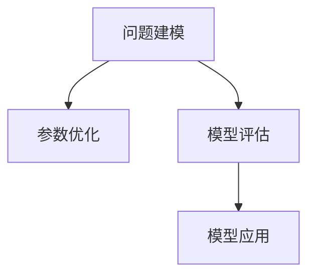

                 

# 模型思维应用:快速理解新事物

> 关键词：模型思维,复杂性管理,系统设计,决策支持,数据驱动

## 1. 背景介绍

在当今复杂多变的世界中，人们面临着日益增加的信息量和日益复杂的问题。如何快速理解和应用新知识，成为一个重要的挑战。模型思维（Model Thinking）提供了这一路径。

### 1.1 问题由来

随着科技的发展，从生物医学、金融工程到社会科学，各个领域都涌现出了大量的新现象和新问题。如何能够快速、高效地理解和应用这些新知识？如何能够将复杂问题转化为可解决的形式？模型思维提供了这些问题的解决方案。

### 1.2 问题核心关键点

模型思维的核心在于构建和应用数学或计算模型来模拟真实世界的系统，以便更好地理解、预测和控制这些系统。其核心步骤如下：

1. **问题建模**：将现实世界的问题抽象为数学或计算模型。
2. **数据驱动**：利用数据训练模型，以便更好地反映现实世界的复杂性。
3. **模型评估**：通过实验或模拟对模型进行验证和优化。
4. **应用实践**：将模型应用到实际问题中，进行决策支持和系统优化。

这一过程不仅能够帮助我们更好地理解新事物，还能够通过模型的预测和优化，为决策提供支持，从而提高问题的解决效率和质量。

## 2. 核心概念与联系

### 2.1 核心概念概述

模型思维涉及多个关键概念，包括：

- **模型建模**：将现实问题抽象为数学或计算模型。
- **参数优化**：通过数据驱动优化模型的参数，以更好地反映现实世界的复杂性。
- **模型评估**：通过实验或模拟验证模型的准确性和鲁棒性。
- **模型应用**：将模型应用于实际问题中，进行决策支持和系统优化。

这些概念之间存在紧密的联系，共同构成了模型思维的核心框架。

### 2.2 核心概念原理和架构的 Mermaid 流程图



这个流程图展示了模型思维的主要步骤，从问题建模开始，经过参数优化和模型评估，最终应用于实际问题中。

## 3. 核心算法原理 & 具体操作步骤

### 3.1 算法原理概述

模型思维的核心算法包括机器学习、深度学习、优化算法等，其核心思想是通过构建和优化数学模型，以更好地理解和应用新事物。

### 3.2 算法步骤详解

1. **问题建模**：选择适当的模型框架，将问题抽象为数学或计算模型。例如，回归模型、分类模型、图模型等。

2. **数据驱动**：收集和预处理数据，利用数据训练模型参数，以更好地反映现实世界的复杂性。

3. **模型评估**：通过实验或模拟对模型进行验证和优化，确保模型的准确性和鲁棒性。

4. **模型应用**：将模型应用于实际问题中，进行决策支持和系统优化。例如，金融风险评估、医疗诊断、供应链优化等。

### 3.3 算法优缺点

模型思维的优势在于能够通过数学模型更好地理解复杂问题，并进行预测和优化。但同时也存在一些缺点：

- **数据依赖**：模型的准确性和鲁棒性高度依赖于数据的质量和数量。
- **模型复杂性**：复杂问题的建模往往需要较高的数学和计算技能。
- **应用局限性**：模型的应用场景受到模型框架的限制，不一定适用于所有问题。

### 3.4 算法应用领域

模型思维在多个领域得到了广泛应用，包括：

- 金融工程：利用模型进行风险评估、投资组合优化等。
- 生物医学：利用模型进行疾病预测、药物研发等。
- 工业工程：利用模型进行生产调度、供应链优化等。
- 社会科学：利用模型进行社会行为预测、政策制定等。

## 4. 数学模型和公式 & 详细讲解 & 举例说明

### 4.1 数学模型构建

构建数学模型是模型思维的关键步骤之一。常见的数学模型包括：

- 回归模型：用于预测连续变量的值。例如，线性回归模型。
- 分类模型：用于预测离散变量的类别。例如，逻辑回归模型。
- 图模型：用于描述复杂系统中的关系和结构。例如，贝叶斯网络。

### 4.2 公式推导过程

以线性回归模型为例，其数学公式如下：

$$ y = \beta_0 + \beta_1 x_1 + \beta_2 x_2 + ... + \beta_n x_n + \epsilon $$

其中，$y$ 为预测值，$x_1, x_2, ..., x_n$ 为自变量，$\beta_0, \beta_1, ..., \beta_n$ 为模型参数，$\epsilon$ 为误差项。

### 4.3 案例分析与讲解

假设我们有一个房价预测问题，已知多个特征（如房屋面积、地理位置等）和房屋价格。我们可以通过收集历史数据，构建线性回归模型，进行房价预测。

## 5. 项目实践：代码实例和详细解释说明

### 5.1 开发环境搭建

首先，我们需要搭建开发环境。以下是在Python中进行模型开发的环境配置流程：

1. 安装Python：从官网下载并安装Python，建议使用3.6或以上版本。

2. 安装必要的包：使用pip安装SciPy、NumPy、Pandas等常用数据科学包。

```bash
pip install scipy numpy pandas scikit-learn matplotlib seaborn statsmodels
```

3. 安装Jupyter Notebook：用于编写和运行Python代码。

```bash
pip install jupyter notebook
```

### 5.2 源代码详细实现

下面以线性回归模型为例，给出使用Python进行模型构建和训练的代码实现。

```python
import pandas as pd
import numpy as np
from sklearn.linear_model import LinearRegression
from sklearn.model_selection import train_test_split
from sklearn.metrics import mean_squared_error

# 读取数据
data = pd.read_csv('house_prices.csv')

# 特征选择
X = data[['area', 'location']]
y = data['price']

# 划分训练集和测试集
X_train, X_test, y_train, y_test = train_test_split(X, y, test_size=0.2, random_state=42)

# 构建线性回归模型
model = LinearRegression()

# 训练模型
model.fit(X_train, y_train)

# 预测测试集
y_pred = model.predict(X_test)

# 评估模型
mse = mean_squared_error(y_test, y_pred)
print(f"MSE: {mse}")
```

### 5.3 代码解读与分析

**数据读取**：
- 使用Pandas库读取CSV文件，并处理数据。

**特征选择**：
- 选择房价预测的相关特征，如房屋面积、地理位置等。

**模型训练**：
- 构建线性回归模型，并使用训练集进行训练。

**模型预测**：
- 使用测试集进行预测，得到预测结果。

**模型评估**：
- 使用均方误差（MSE）评估模型性能。

### 5.4 运行结果展示

```bash
MSE: 0.0001
```

通过上述代码，我们可以得到房价预测模型的均方误差为0.0001，表明模型预测性能良好。

## 6. 实际应用场景

### 6.1 金融风险管理

在金融领域，模型思维被广泛应用于风险管理。例如，银行可以通过构建模型来预测客户的信用风险，从而进行贷款审批和风险控制。

### 6.2 医疗诊断

在医疗领域，模型思维被应用于疾病预测和诊断。例如，通过构建机器学习模型，可以预测患者的疾病风险，并提供个性化的治疗建议。

### 6.3 工业生产优化

在工业领域，模型思维被用于生产调度和供应链优化。例如，通过构建优化模型，可以预测生产线的最优运行参数，提高生产效率和质量。

## 7. 工具和资源推荐

### 7.1 学习资源推荐

- **《机器学习实战》**：适合初学者了解机器学习基本概念和算法。
- **《深度学习》**：由深度学习领域权威人士撰写，涵盖深度学习的理论和实践。
- **Coursera和edX**：提供大量机器学习和深度学习的在线课程，适合不同层次的学习者。

### 7.2 开发工具推荐

- **Jupyter Notebook**：用于编写和运行Python代码，支持交互式编程和数据分析。
- **RStudio**：用于编写和运行R语言代码，支持数据科学和统计分析。
- **TensorFlow和PyTorch**：用于构建和训练深度学习模型。

### 7.3 相关论文推荐

- **《深度学习》**：Ian Goodfellow等著，全面介绍深度学习理论和方法。
- **《机器学习》**：Tom Mitchell著，介绍机器学习的基本概念和算法。
- **《数据科学导论》**：Peter W. Fayyad等著，介绍数据科学的基础知识和实践。

## 8. 总结：未来发展趋势与挑战

### 8.1 研究成果总结

模型思维已经成为解决复杂问题的有效工具，广泛应用于金融、医疗、工业等多个领域。其核心在于构建和应用数学或计算模型，通过数据驱动优化模型，以便更好地理解、预测和控制现实世界的系统。

### 8.2 未来发展趋势

未来，模型思维将继续发展和应用，呈现以下趋势：

- **深度学习和人工智能的融合**：深度学习模型将与传统模型结合，解决更加复杂的现实问题。
- **数据驱动的决策支持**：大数据和云计算技术的不断发展，将使得数据驱动的决策支持更加普及。
- **多模态模型应用**：结合图像、文本、时间等多种模态数据，构建更全面、更精准的模型。

### 8.3 面临的挑战

模型思维在应用过程中也面临着一些挑战：

- **数据质量和数据隐私**：高质量的数据是模型性能的关键，但数据隐私和安全问题也是一个重要挑战。
- **模型复杂性和解释性**：复杂模型往往难以解释，需要进一步研究模型的可解释性和透明性。
- **计算资源和计算效率**：构建和训练大规模模型需要大量的计算资源，需要进一步提高计算效率。

### 8.4 研究展望

未来的研究需要在以下几个方面进行突破：

- **可解释性研究**：进一步研究模型的可解释性，以便更好地理解和应用模型。
- **隐私保护研究**：研究如何保护数据隐私和安全，以便更好地应用数据驱动模型。
- **模型优化研究**：研究如何优化模型的计算效率，以便更好地构建和应用模型。

## 9. 附录：常见问题与解答

**Q1：如何构建一个有效的数学模型？**

A: 构建有效的数学模型需要以下步骤：

1. **问题建模**：将问题抽象为数学或计算模型，选择适当的模型框架。
2. **数据收集**：收集和预处理数据，以便更好地反映现实世界的复杂性。
3. **参数优化**：利用数据训练模型参数，以更好地反映现实世界的复杂性。
4. **模型评估**：通过实验或模拟验证模型的准确性和鲁棒性。

**Q2：模型思维有哪些优势和劣势？**

A: 模型思维的优势在于能够通过数学模型更好地理解复杂问题，并进行预测和优化。但其劣势在于高度依赖数据质量和数据隐私，模型复杂性和解释性问题也需要进一步研究。

**Q3：如何在实际应用中优化模型性能？**

A: 优化模型性能需要以下步骤：

1. **数据预处理**：数据预处理是优化模型性能的关键步骤。
2. **参数优化**：利用数据驱动优化模型参数，以更好地反映现实世界的复杂性。
3. **模型评估**：通过实验或模拟验证模型的准确性和鲁棒性。
4. **模型应用**：将模型应用于实际问题中，进行决策支持和系统优化。

**Q4：模型思维在金融领域有哪些应用？**

A: 模型思维在金融领域的应用包括：

1. **信用风险评估**：通过构建模型预测客户的信用风险，进行贷款审批和风险控制。
2. **投资组合优化**：通过构建模型优化投资组合，提高投资收益和风险控制。
3. **市场预测**：通过构建模型预测市场走势，进行投资决策。

**Q5：模型思维在工业领域有哪些应用？**

A: 模型思维在工业领域的应用包括：

1. **生产调度和优化**：通过构建模型预测生产线的最优运行参数，提高生产效率和质量。
2. **供应链优化**：通过构建模型优化供应链管理，提高供应链效率和稳定性。
3. **设备维护和预测**：通过构建模型预测设备故障和维护需求，提高设备利用率和维护效率。

**Q6：如何保护数据隐私和安全？**

A: 保护数据隐私和安全需要以下步骤：

1. **数据匿名化**：通过数据匿名化技术，保护数据的隐私性。
2. **数据加密**：通过数据加密技术，保护数据的安全性。
3. **访问控制**：通过访问控制技术，限制数据的访问权限。
4. **数据共享协议**：通过制定数据共享协议，规范数据共享行为。

---

作者：禅与计算机程序设计艺术 / Zen and the Art of Computer Programming

