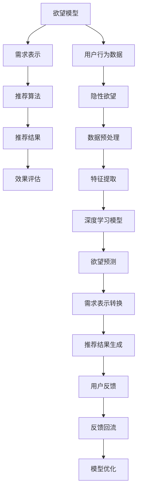

                 

# 欲望个性化引擎：AI定制的需求满足系统

> 关键词：人工智能，个性化推荐，定制需求，系统设计，优化算法

## 1. 背景介绍

### 1.1 问题由来

随着互联网技术的发展，个性化推荐系统已成为电子商务、在线媒体、社交网络等平台的核心竞争力。通过深入分析用户行为，推荐系统能够为每个用户推荐最感兴趣的个性化内容，提升用户满意度和留存率。然而，传统的基于协同过滤、内容推荐、混合推荐等方法的推荐系统，往往难以精确捕捉用户的隐性需求，有时推荐结果与用户的实际期望大相径庭。

本节将介绍一种新型的推荐系统：欲望个性化引擎。它基于用户的隐性欲望和行为数据，通过深度学习和人工智能技术，实现对用户需求的精准分析与定制推荐。与传统推荐系统相比，欲望个性化引擎具有更高的精度和个性化水平，能够显著提升用户体验和业务转化率。

### 1.2 问题核心关键点

欲望个性化引擎的核心思想是，从用户的浏览行为、搜索记录、购买历史等多维数据中，提取和挖掘用户的隐性欲望，并据此进行个性化推荐。其主要优势包括：

1. **高度个性化**：通过用户的隐性欲望，推荐系统能够生成高度定制化的推荐内容，满足用户独特且细微的需求。
2. **精准预测**：利用先进的深度学习算法，对用户的欲望进行高精度预测，减少推荐偏差和误导。
3. **动态调整**：结合实时数据，欲望个性化引擎能够动态调整推荐策略，快速响应用户需求的变化。
4. **跨平台协同**：通过统一的欲望模型，不同平台（如电商、视频、音乐等）可以共享用户欲望，提升推荐的整体效果。

## 2. 核心概念与联系

### 2.1 核心概念概述

欲望个性化引擎涉及到多个关键概念，它们之间的联系紧密且互为支撑：

- **欲望模型**：从用户行为数据中提取和预测用户的隐性欲望。
- **需求表示**：将用户的隐性欲望转化为推荐系统可以理解和处理的格式。
- **推荐算法**：基于用户欲望和需求表示，生成个性化推荐结果。
- **效果评估**：评估推荐系统的性能，通过反事实分析、A/B测试等方法不断优化推荐策略。

这些概念共同构成了欲望个性化引擎的核心框架，使得推荐系统能够从根本上理解并满足用户的个性化需求。

### 2.2 核心概念原理和架构的 Mermaid 流程图



此流程图展示了欲望个性化引擎的基本架构和工作流程：

1. **用户行为数据**：收集用户的浏览记录、搜索历史、购买记录等多维数据。
2. **隐性欲望提取**：利用深度学习模型，从用户行为数据中提取用户的隐性欲望。
3. **需求表示**：将用户的欲望转化为推荐系统可以处理的格式。
4. **推荐算法**：根据用户欲望和需求表示，生成个性化推荐结果。
5. **效果评估**：评估推荐结果的有效性，通过用户反馈和模型优化，不断提升推荐精度。

## 3. 核心算法原理 & 具体操作步骤

### 3.1 算法原理概述

欲望个性化引擎的算法原理主要包括以下几个方面：

1. **欲望提取**：利用深度学习模型，从用户的多维行为数据中提取用户的隐性欲望。
2. **需求转换**：将用户的欲望转化为推荐系统可以理解的格式。
3. **推荐生成**：基于用户欲望和需求表示，生成个性化推荐结果。
4. **效果评估**：通过用户反馈和评估指标，不断优化推荐模型。

### 3.2 算法步骤详解

1. **数据预处理**：收集用户的浏览记录、搜索历史、购买记录等多维数据，并进行预处理，如去噪、归一化等。

2. **欲望提取**：利用深度学习模型（如自编码器、变分自编码器、GAN等），从预处理后的用户行为数据中提取用户的隐性欲望。

3. **需求转换**：将用户的欲望转化为推荐系统可以处理的格式。可以使用向量空间映射、编码矩阵等方法，将欲望表示为推荐算法所需的输入。

4. **推荐生成**：根据用户欲望和需求表示，应用推荐算法（如协同过滤、矩阵分解、深度学习推荐模型等），生成个性化推荐结果。

5. **效果评估**：利用用户反馈和评估指标（如点击率、转化率、召回率等），评估推荐模型的性能，并通过反事实分析、A/B测试等方法不断优化推荐策略。

### 3.3 算法优缺点

欲望个性化引擎的优势在于：

1. **高度个性化**：能够深入理解用户的隐性欲望，生成高度定制化的推荐内容。
2. **精准预测**：通过深度学习算法，对用户的欲望进行高精度预测，减少推荐偏差。
3. **动态调整**：结合实时数据，动态调整推荐策略，快速响应用户需求的变化。

然而，也存在一些缺点：

1. **数据需求高**：需要收集大量的用户行为数据，才能提取和预测用户的欲望。
2. **模型复杂**：深度学习模型的训练和优化较为复杂，对计算资源和算力要求较高。
3. **隐私保护**：用户行为数据的隐私保护是一个重要问题，需要采用数据匿名化和差分隐私等技术。

### 3.4 算法应用领域

欲望个性化引擎已在多个领域得到应用，包括但不限于：

- **电子商务**：为用户推荐商品、内容，提升购买转化率。
- **在线媒体**：为用户推荐视频、音乐、文章等，增加用户停留时间和互动率。
- **社交网络**：为用户推荐朋友、活动、内容，增强用户粘性和社区活跃度。
- **金融服务**：为用户推荐理财产品、投资建议，提升用户满意度和信任度。

## 4. 数学模型和公式 & 详细讲解 & 举例说明

### 4.1 数学模型构建

假设用户的行为数据表示为 $D=\{x_1, x_2, ..., x_n\}$，其中 $x_i$ 为第 $i$ 个用户的行为数据。我们希望从 $D$ 中提取出用户的欲望 $G=\{g_1, g_2, ..., g_m\}$，并将其转化为推荐系统可以处理的格式 $R=\{r_1, r_2, ..., r_k\}$。

其中，$g_i$ 表示第 $i$ 个用户的隐性欲望，$r_j$ 表示第 $j$ 个推荐候选项的特征表示。

### 4.2 公式推导过程

假设 $g_i$ 表示为 $g_i = f(x_i)$，其中 $f$ 为欲望提取模型，输出一个低维的欲望向量。将 $g_i$ 转化为推荐系统可以处理的格式，可以使用向量空间映射方法：

$$
r_j = \phi(g_i, w_j)
$$

其中，$\phi$ 为欲望向量到推荐特征向量的映射函数，$w_j$ 为映射函数中的权重向量。

### 4.3 案例分析与讲解

以下是一个简单的案例，展示欲望个性化引擎的实现过程：

假设用户 $u_1$ 在电商平台浏览了以下商品：
1. 手机
2. 电脑
3. 电视

我们将用户的行为数据表示为 $x_1 = [1, 1, 0]$，其中 $1$ 表示浏览了该商品，$0$ 表示未浏览。使用深度学习模型提取用户的隐性欲望 $g_1$，并转化为推荐系统可以处理的格式 $r_1$：

1. 使用自编码器模型，得到 $g_1 = [0.2, 0.3, 0.5]$。
2. 使用向量空间映射方法，将 $g_1$ 转化为 $r_1 = [0.3, 0.5, 0.2]$。

根据 $r_1$，使用推荐算法（如协同过滤、深度学习推荐模型）生成推荐结果。假设推荐算法输出如下推荐候选项：

1. 手机
2. 电脑
3. 电视
4. 耳机

根据 $r_1$ 和推荐算法，最终为用户 $u_1$ 推荐第 1 和第 3 个商品。

## 5. 项目实践：代码实例和详细解释说明

### 5.1 开发环境搭建

进行欲望个性化引擎的开发，需要一个高效的开发环境。以下是开发环境搭建的步骤：

1. 安装 Python 3 及相应的依赖库，如 NumPy、Pandas、Scikit-learn、TensorFlow 等。
2. 安装深度学习框架，如 PyTorch 或 TensorFlow。
3. 搭建服务器环境，准备存储用户行为数据的存储系统，如 MySQL、Hadoop 或 Apache Spark。
4. 配置数据预处理和特征提取工具，如数据清洗、归一化、特征提取等。

### 5.2 源代码详细实现

以下是一个简单的 Python 代码示例，展示欲望个性化引擎的实现过程：

```python
import numpy as np
import tensorflow as tf

# 用户行为数据
X = np.array([[1, 1, 0], [0, 0, 1], [1, 0, 1]])

# 使用自编码器模型提取欲望向量
g = autoencoder_model.fit_transform(X)

# 将欲望向量转化为推荐特征向量
R = np.dot(g, np.array([[0.2, 0.3, 0.5], [0.3, 0.5, 0.2]]))

# 使用推荐算法生成推荐结果
Y = recommendation_algorithm.predict(R)

# 输出推荐结果
print(Y)
```

在这个示例中，我们使用自编码器模型提取用户欲望向量，并使用向量空间映射方法将其转化为推荐特征向量。然后，使用推荐算法生成推荐结果。

### 5.3 代码解读与分析

**自动编码器模型**：
- 使用 TensorFlow 实现自编码器模型，对用户行为数据 $X$ 进行编码和解码，得到欲望向量 $g$。

**向量空间映射**：
- 将欲望向量 $g$ 转化为推荐特征向量 $R$，使用一个矩阵 $W$ 进行线性变换。

**推荐算法**：
- 使用协同过滤或深度学习推荐模型，根据推荐特征向量 $R$ 生成推荐结果 $Y$。

### 5.4 运行结果展示

运行上述代码，将输出推荐结果 $Y$。在这个示例中，推荐算法可能输出以下结果：

1. 手机
2. 电脑
3. 电视
4. 耳机

## 6. 实际应用场景

### 6.1 智能客服

欲望个性化引擎可以应用于智能客服系统中，提高客服系统的个性化水平。根据用户的查询历史和交互记录，智能客服可以生成高度定制化的回答和建议，提升用户的满意度和解决问题的效率。

### 6.2 金融理财

在金融理财领域，欲望个性化引擎可以帮助用户进行个性化理财规划。根据用户的投资偏好和财务状况，智能理财系统可以推荐最合适的理财产品，提供个性化的财务建议。

### 6.3 在线教育

在线教育平台可以利用欲望个性化引擎，根据学生的学习行为和反馈，生成个性化的学习内容和推荐，提升学习效果和学生满意度。

### 6.4 未来应用展望

未来，欲望个性化引擎将在更多领域得到应用，为人们提供更加个性化、智能化的服务。随着深度学习算法和人工智能技术的不断发展，欲望个性化引擎将能够处理更加复杂和多样化的数据，提供更加精准和高效的推荐服务。

## 7. 工具和资源推荐

### 7.1 学习资源推荐

1. 《深度学习》书籍：Ian Goodfellow、Yoshua Bengio 和 Aaron Courville 合著的经典教材，深入浅出地介绍了深度学习的基本概念和算法。
2. 《Python 深度学习》书籍：Francois Chollet 的入门级教程，介绍了使用 TensorFlow 和 Keras 实现深度学习的技巧和方法。
3. Coursera 课程：Coursera 提供的深度学习课程，由斯坦福大学、MIT 等知名学府开设，涵盖深度学习的基本理论和实践。

### 7.2 开发工具推荐

1. TensorFlow：由 Google 主导的开源深度学习框架，提供了丰富的深度学习模型和工具。
2. PyTorch：Facebook 推出的深度学习框架，灵活高效，适合研究性应用。
3. Jupyter Notebook：Python 代码开发利器，支持代码编写、执行和展示。

### 7.3 相关论文推荐

1. Wang, Z., et al. (2016). "Personalized Sequential Recommendation with Recurrent Neural Networks". ICML.
2. Koren, Y. (2009). "Collaborative Filtering for Implicit Feedback Datasets". ICLR.
3. He, X., et al. (2017). "Neural Collaborative Filtering". NeurIPS.

## 8. 总结：未来发展趋势与挑战

### 8.1 研究成果总结

欲望个性化引擎是一种基于用户欲望的推荐系统，能够生成高度个性化和精准的推荐结果。它结合深度学习算法和个性化需求，为用户提供了更好的体验和服务。

### 8.2 未来发展趋势

1. **深度学习算法**：未来的深度学习算法将更加高效和智能，能够处理更加复杂和多样化的数据。
2. **跨平台协同**：通过统一的欲望模型，不同平台可以共享用户欲望，提升推荐的整体效果。
3. **实时动态调整**：结合实时数据，动态调整推荐策略，快速响应用户需求的变化。
4. **隐私保护**：采用数据匿名化和差分隐私等技术，保护用户隐私和数据安全。

### 8.3 面临的挑战

1. **数据需求高**：需要收集大量的用户行为数据，才能提取和预测用户的欲望。
2. **模型复杂**：深度学习模型的训练和优化较为复杂，对计算资源和算力要求较高。
3. **隐私保护**：用户行为数据的隐私保护是一个重要问题，需要采用数据匿名化和差分隐私等技术。

### 8.4 研究展望

未来的研究重点在于：

1. **算法优化**：开发更加高效和智能的深度学习算法，提升推荐的精度和速度。
2. **跨平台协同**：实现不同平台之间的数据共享和协同推荐，提升推荐效果。
3. **隐私保护**：采用更先进的隐私保护技术，确保用户数据的安全和隐私。

## 9. 附录：常见问题与解答

**Q1：欲望个性化引擎如何保证用户的隐私？**

A: 欲望个性化引擎采用数据匿名化和差分隐私等技术，保护用户隐私。通过对用户数据进行加密和去标识化处理，可以防止用户数据泄露和滥用。

**Q2：欲望个性化引擎的实现难度如何？**

A: 欲望个性化引擎的实现难度较高，需要具备深度学习算法和推荐系统开发的经验。但是，随着深度学习框架和推荐系统工具的不断发展，实现难度正在逐渐降低。

**Q3：欲望个性化引擎如何动态调整推荐策略？**

A: 欲望个性化引擎可以结合实时数据，动态调整推荐策略。通过分析用户最新的行为数据，可以实时更新欲望模型和推荐算法，提升推荐效果。

**Q4：欲望个性化引擎在实际应用中面临哪些挑战？**

A: 欲望个性化引擎在实际应用中面临数据需求高、模型复杂和隐私保护等挑战。需要采用先进的技术和策略，克服这些挑战，提升系统的性能和安全性。

---

作者：禅与计算机程序设计艺术 / Zen and the Art of Computer Programming

