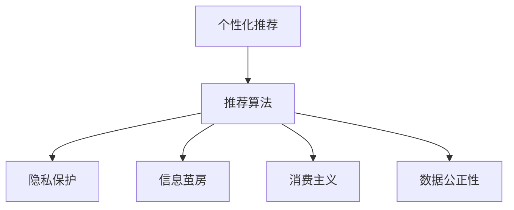

                 

# 欲望的持续化：AI时代的消费伦理

## 1. 背景介绍

### 1.1 问题由来
在人工智能(AI)高速发展的今天，算法驱动的消费行为模式正在逐渐改变着我们的消费习惯和伦理观念。推荐算法通过分析消费者的行为数据，预测其偏好，推送个性化的广告和商品信息，不仅提升了消费体验，也在一定程度上激发了更多非理性的冲动性消费。然而，算法虽然能够带来更多的选择，但同时也可能加剧了消费者的选择困难和决策疲劳，引发一系列伦理问题，如隐私泄露、信息茧房、消费主义等。

### 1.2 问题核心关键点
AI时代下的消费伦理问题，主要集中在以下几个方面：
- **隐私保护**：AI推荐算法如何平衡个性化推荐与用户隐私保护，避免侵犯用户的知情权和选择权。
- **信息茧房**：个性化推荐算法是否会加剧用户的信息茧房，限制用户的信息获取范围，引发“回音室效应”。
- **消费主义**：推荐算法是否会加剧消费主义的盛行，促进过度消费和浪费，影响社会的可持续发展和资源分配。
- **数据公正性**：算法是否会加剧数据偏见，对不同群体进行不公平的消费决策，引发社会不公。

## 2. 核心概念与联系

### 2.1 核心概念概述

为更好地理解AI时代下的消费伦理问题，本节将介绍几个关键概念：

- **推荐算法**：通过分析用户的历史行为数据，预测用户未来的需求和偏好，实现个性化推荐。常见的推荐算法包括协同过滤、基于内容的推荐、矩阵分解等。
- **个性化推荐**：针对不同用户设计个性化的广告和商品推荐，提升用户体验，激发消费需求。
- **隐私保护**：在推荐算法的设计和实现中，如何保障用户数据的隐私和安全，避免信息泄露。
- **信息茧房**：用户长期处于个性化推荐中，可能陷入信息茧房，难以接触到多样化的信息。
- **消费主义**：由个性化推荐驱动的过度消费和浪费行为，可能加剧消费主义的盛行。
- **数据公正性**：算法应避免引入和放大数据偏见，确保公平、公正的消费决策。

这些概念之间的逻辑关系可以通过以下Mermaid流程图来展示：



这个流程图展示了个性化推荐系统的核心概念及其之间的关系：

1. 个性化推荐系统基于推荐算法对用户进行个性化推荐。
2. 推荐算法的设计和实现需要考虑隐私保护、信息茧房、消费主义和数据公正性等多个因素。

## 3. 核心算法原理 & 具体操作步骤
### 3.1 算法原理概述

个性化推荐系统的核心思想是利用用户的过往行为数据，预测其未来的需求和偏好，实现精准推荐。其基本流程如下：

1. **数据收集**：收集用户的历史行为数据，如浏览记录、购买历史、搜索关键词等。
2. **特征工程**：对收集到的数据进行预处理，提取用户和商品的相关特征。
3. **模型训练**：使用机器学习或深度学习算法训练推荐模型，如协同过滤、矩阵分解等。
4. **个性化推荐**：根据模型预测，对不同用户推送个性化的广告和商品信息。

### 3.2 算法步骤详解

以协同过滤为例，个性化推荐的具体操作步骤如下：

1. **数据准备**：
   - 收集用户的历史行为数据，如用户ID、商品ID、评分、时间戳等。
   - 将用户和商品映射为高维特征向量，如itemCF中使用tf-idf权重向量。

2. **用户-商品评分矩阵**：
   - 构造用户-商品评分矩阵，每个元素为用户的评分或打分。

3. **计算相似度**：
   - 根据评分矩阵计算用户之间的相似度，常用的有余弦相似度、皮尔逊相关系数等。

4. **生成推荐列表**：
   - 对每个用户，根据相似度计算排序，推荐评分较高的商品。

5. **推荐效果评估**：
   - 使用平均准确率(Average Precision)、点击率(CTR)等指标评估推荐效果，持续优化模型。

### 3.3 算法优缺点

个性化推荐系统的优点包括：
- **提升用户体验**：个性化推荐能够根据用户偏好推荐商品，提升购物体验。
- **提升转化率**：推荐系统通过精准匹配，提升用户的购买率。
- **降低用户选择难度**：推荐算法能够缩小商品选择范围，减轻用户决策疲劳。

然而，个性化推荐系统也存在以下缺点：
- **隐私泄露**：推荐系统需要收集用户行为数据，可能侵犯用户隐私。
- **信息茧房**：个性化推荐可能导致用户陷入信息茧房，获取信息范围受限。
- **消费主义**：过度推荐可能加剧消费主义，促成过度消费和浪费。
- **数据偏见**：推荐系统可能放大数据偏见，导致不公平的消费决策。

### 3.4 算法应用领域

个性化推荐算法已经广泛应用于电商平台、视频平台、社交网络等众多领域，具体应用场景包括：

- **电商推荐**：亚马逊、淘宝等电商平台通过个性化推荐提升用户转化率和购物体验。
- **视频推荐**：YouTube、Netflix等平台通过个性化推荐提升用户粘性和观看时长。
- **社交推荐**：Facebook、微博等社交平台通过个性化推荐推荐朋友动态、热门话题等。
- **智能广告**：谷歌、百度等搜索引擎通过个性化推荐推送精准广告，提升广告效果。
- **内容推荐**：音乐、书籍、新闻等平台通过个性化推荐推荐内容，提升用户满意度。

## 4. 数学模型和公式 & 详细讲解
### 4.1 数学模型构建

假设用户集为 $U$，商品集为 $I$，用户对商品的评分矩阵为 $R \in \mathbb{R}^{n \times m}$，其中 $n$ 为用户数，$m$ 为商品数。协同过滤算法的核心是计算用户之间的相似度，并对商品进行评分预测。

设用户 $u$ 和 $v$ 的评分向量分别为 $r_u \in \mathbb{R}^m$ 和 $r_v \in \mathbb{R}^m$，$u$ 和 $v$ 的相似度为 $s_{uv} \in [-1,1]$。使用余弦相似度计算用户之间的相似度：

$$
s_{uv} = \cos(r_u, r_v) = \frac{\langle r_u, r_v \rangle}{\|r_u\|_2 \|r_v\|_2}
$$

其中 $\langle \cdot, \cdot \rangle$ 表示向量的点积，$\|\cdot\|_2$ 表示向量的模。

### 4.2 公式推导过程

用户 $u$ 对商品 $i$ 的评分预测值 $r_{ui}$ 可以表示为：

$$
r_{ui} = \sum_{v \in U} s_{uv} \cdot r_{vi}
$$

其中 $r_{vi}$ 表示用户 $v$ 对商品 $i$ 的评分。在矩阵形式中，可以表示为：

$$
R_u = \sum_{v \in U} S_{uv} \cdot R_v
$$

其中 $S_{uv}$ 表示用户 $u$ 和 $v$ 的相似度矩阵，$R_v$ 表示用户 $v$ 对商品的评分矩阵。

### 4.3 案例分析与讲解

以Netflix的个性化推荐系统为例，Netflix通过收集用户观看历史、评分数据等行为数据，使用协同过滤算法预测用户对未观看视频的评分，并进行个性化推荐。Netflix在推荐系统中加入了基于用户的协同过滤和基于物品的协同过滤，还引入了物品-物品的协同过滤和基于内容的推荐，提升推荐效果。

## 5. 项目实践：代码实例和详细解释说明
### 5.1 开发环境搭建

在进行个性化推荐系统开发前，我们需要准备好开发环境。以下是使用Python进行Scikit-learn和TensorFlow开发的环境配置流程：

1. 安装Anaconda：从官网下载并安装Anaconda，用于创建独立的Python环境。

2. 创建并激活虚拟环境：
```bash
conda create -n recommendation-env python=3.8 
conda activate recommendation-env
```

3. 安装Scikit-learn和TensorFlow：
```bash
pip install scikit-learn tensorflow
```

4. 安装各类工具包：
```bash
pip install numpy pandas scikit-learn matplotlib tqdm jupyter notebook ipython
```

完成上述步骤后，即可在`recommendation-env`环境中开始推荐系统开发。

### 5.2 源代码详细实现

这里我们以协同过滤算法为例，给出使用Scikit-learn库对用户-商品评分矩阵进行推荐预测的PyTorch代码实现。

首先，定义用户-商品评分矩阵：

```python
import numpy as np

# 用户ID和商品ID
user_ids = np.array([1, 2, 3, 4, 5])
item_ids = np.array([1, 2, 3, 4, 5])

# 用户对商品的评分
ratings = np.array([[5, 3, 1, 2, 4],
                   [3, 2, 4, 5, 1],
                   [1, 4, 2, 5, 3],
                   [2, 5, 3, 1, 4],
                   [4, 1, 3, 2, 5]])

# 构造用户-商品评分矩阵
user_item_ratings = pd.DataFrame(data=ratings, index=user_ids, columns=item_ids)
```

然后，定义协同过滤模型的类：

```python
from sklearn.metrics.pairwise import cosine_similarity
from sklearn.metrics import mean_squared_error
from sklearn.decomposition import TruncatedSVD

class CollaborativeFiltering:
    def __init__(self, num_factors=10):
        self.num_factors = num_factors
        self.model = TruncatedSVD(n_components=num_factors)
        
    def fit(self, ratings):
        self.model.fit(ratings)
        
    def predict(self, user, item):
        predictions = self.model.transform(ratings)
        return predictions[user] @ item
    
    def evaluate(self, ratings, user_item_ratings):
        predictions = []
        for u in user_item_ratings.index:
            for i in user_item_ratings.columns:
                predictions.append(self.predict(u, i))
        mse = mean_squared_error(ratings.values.flatten(), predictions)
        return mse
```

接着，训练模型并进行推荐预测：

```python
# 创建协同过滤模型
model = CollaborativeFiltering(num_factors=10)

# 训练模型
model.fit(ratings)

# 推荐预测
user_id = 2
item_id = 1
prediction = model.predict(user_id, item_id)
print(f"User {user_id} predicted rating for item {item_id}: {prediction}")
```

以上就是使用Scikit-learn库对用户-商品评分矩阵进行推荐预测的完整代码实现。可以看到，借助Scikit-learn库的强大封装，我们能够以相对简洁的代码完成协同过滤算法的开发。

### 5.3 代码解读与分析

让我们再详细解读一下关键代码的实现细节：

**user_item_ratings DataFrame类**：
- 用于存储用户-商品评分矩阵，包含用户ID和商品ID作为索引，评分作为数据。

**CollaborativeFiltering类**：
- `__init__`方法：初始化协同过滤模型的超参数，如因子数。
- `fit`方法：使用评分矩阵训练协同过滤模型。
- `predict`方法：根据用户ID和商品ID，预测该用户对商品的真实评分。
- `evaluate`方法：计算模型预测评分与真实评分之间的均方误差。

**训练流程**：
- 创建协同过滤模型实例。
- 使用评分矩阵训练模型。
- 对用户和商品ID进行推荐预测。
- 输出推荐结果。

可以看到，Scikit-learn库使得协同过滤算法的开发变得简洁高效。开发者可以将更多精力放在数据处理、模型改进等高层逻辑上，而不必过多关注底层的实现细节。

当然，工业级的系统实现还需考虑更多因素，如模型的保存和部署、超参数的自动搜索、更灵活的任务适配层等。但核心的协同过滤算法基本与此类似。

## 6. 实际应用场景
### 6.1 电商平台推荐

基于协同过滤算法的推荐系统，可以广泛应用于电商平台，提升用户购物体验和转化率。传统电商推荐往往依赖人工经验和规则，难以适应多样化的用户需求。而使用协同过滤算法，可以自动分析用户行为数据，发现用户偏好和相似用户，推荐用户可能感兴趣的商品。

在技术实现上，可以收集用户浏览、点击、购买等行为数据，构建用户-商品评分矩阵，在此基础上训练协同过滤模型，对用户进行个性化推荐。推荐系统还可以结合热门商品、限时优惠等特征，动态调整推荐列表。

### 6.2 视频平台推荐

视频平台如Netflix、YouTube等，通过协同过滤算法推荐用户可能感兴趣的视频，提升观看率和用户粘性。在推荐过程中，需要考虑用户观看历史、评分数据、点击行为等多种特征，进行多维度建模。

在Netflix的例子中，其推荐系统还引入了基于用户的协同过滤、基于物品的协同过滤、基于内容的推荐等多种算法，提升推荐效果。此外，Netflix还通过动态调整推荐算法，及时响应用户反馈，进一步提升推荐精准度。

### 6.3 社交网络推荐

社交网络平台如Facebook、微博等，通过协同过滤算法推荐用户可能感兴趣的内容，提升用户活跃度和内容消费。在推荐过程中，需要考虑用户的关注动态、互动行为、社交关系等多种因素。

Facebook的推荐系统通过协同过滤算法推荐新闻、视频、广告等，同时引入基于用户社交网络关系的推荐，提升推荐的多样性和准确性。此外，Facebook还通过A/B测试等手段，不断优化推荐策略。

### 6.4 未来应用展望

随着协同过滤算法的不断发展，基于其的推荐系统将在更多领域得到应用，为各行各业带来变革性影响。

在智慧医疗领域，推荐系统可以推荐个性化医疗方案、健康建议、用药指导等，提升医疗服务的个性化和精准度。

在智能教育领域，推荐系统可以推荐个性化的学习内容、课程推荐、学习伙伴等，提升教育质量和效率。

在智慧城市治理中，推荐系统可以推荐智能交通、能源管理、公共服务等方面的解决方案，提升城市治理的智能化水平。

此外，在企业生产、社会治理、文娱传媒等众多领域，基于协同过滤算法的推荐系统也将不断涌现，为各行各业提供更精准、更高效的智能服务。

## 7. 工具和资源推荐
### 7.1 学习资源推荐

为了帮助开发者系统掌握协同过滤算法的理论基础和实践技巧，这里推荐一些优质的学习资源：

1. 《推荐系统原理与实现》系列博文：由推荐系统专家撰写，深入浅出地介绍了推荐系统的基本原理和多种算法。

2. CS235《推荐系统》课程：斯坦福大学开设的推荐系统课程，有Lecture视频和配套作业，带你深入推荐系统的核心思想。

3. 《推荐系统实战》书籍：推荐系统从业者必读，详细介绍了推荐系统的实现方法和应用案例。

4. Kaggle推荐系统竞赛：参与Kaggle上的推荐系统竞赛，实战练习推荐算法，提升算法实践能力。

5. Github上的开源推荐系统项目：学习开源项目如何实现推荐算法，如TensorFlow的Recommenders库等。

通过对这些资源的学习实践，相信你一定能够快速掌握协同过滤算法的精髓，并用于解决实际的推荐问题。
###  7.2 开发工具推荐

高效的开发离不开优秀的工具支持。以下是几款用于协同过滤算法开发的常用工具：

1. Python：作为推荐系统开发的语言，Python拥有丰富的库和工具，如Scikit-learn、TensorFlow等。

2. TensorFlow：由Google主导开发的开源深度学习框架，生产部署方便，适合大规模工程应用。

3. Scikit-learn：强大的机器学习库，提供了多种协同过滤算法的实现。

4. H2O.ai：提供可视化界面和自动化调参功能，适合快速搭建和优化推荐系统。

5. FastFM：基于深度学习的多维稀疏矩阵分解推荐系统，性能优异。

6. LightFM：深度学习推荐系统，可以处理大规模稀疏数据，支持多种优化算法。

合理利用这些工具，可以显著提升协同过滤算法的开发效率，加快创新迭代的步伐。

### 7.3 相关论文推荐

协同过滤算法的理论基础来源于机器学习和数据挖掘领域，以下是几篇奠基性的相关论文，推荐阅读：

1. Collaborative Filtering for Recommendation in Social Network Platforms：提出了基于矩阵分解的协同过滤算法，是协同过滤算法的经典方法。

2. Beyond Matrix Factorization: A Canonical Decomposition Framework for Nonnegative Matrix Factorization with Corruption Tolerance：提出了基于非负矩阵分解的协同过滤算法，增强了对异常值的容忍度。

3. Item-Based Collaborative Filtering Recommendation Algorithms Based on Cosine Similarity with Cutting-Plane Approximation Algorithm：介绍了基于余弦相似度的协同过滤算法，并提出了剪枝平面近似算法提高计算效率。

4. Matrix Factorization Techniques for Recommender Systems：详细介绍了矩阵分解方法，包括奇异值分解、非负矩阵分解等，是推荐系统中的重要工具。

5. Fast Matrix Factorization Techniques for Recommender Systems：介绍了高效的矩阵分解方法，如DARwin、ALS等，提升推荐系统性能。

这些论文代表了大规模推荐系统的发展脉络。通过学习这些前沿成果，可以帮助研究者把握学科前进方向，激发更多的创新灵感。

## 8. 总结：未来发展趋势与挑战

### 8.1 总结

本文对基于协同过滤算法的推荐系统进行了全面系统的介绍。首先阐述了推荐系统的发展背景和应用意义，明确了推荐系统在提升用户体验和转化率方面的独特价值。其次，从原理到实践，详细讲解了协同过滤算法的数学原理和关键步骤，给出了推荐系统开发的完整代码实例。同时，本文还广泛探讨了推荐系统在电商平台、视频平台、社交网络等众多领域的应用前景，展示了协同过滤算法的巨大潜力。此外，本文精选了推荐系统的各类学习资源，力求为读者提供全方位的技术指引。

通过本文的系统梳理，可以看到，协同过滤算法在推荐系统中扮演了重要角色，显著提升了用户体验和转化率。推荐系统正逐渐成为互联网产品设计的重要组成部分，推动着用户体验的不断优化。

### 8.2 未来发展趋势

展望未来，协同过滤算法的不断发展将呈现以下几个趋势：

1. **多模态融合**：推荐系统将越来越多地融合多模态信息，如文本、图像、视频等，提升推荐的多样性和精准度。

2. **深度学习**：随着深度学习技术的不断成熟，推荐系统将越来越多地使用深度学习模型，提升推荐的准确性和个性化程度。

3. **个性化推荐**：推荐系统将更加注重个性化推荐，使用户能够获得更加符合其兴趣和需求的内容。

4. **动态调整**：推荐系统将更加注重动态调整和优化，实时响应用户反馈和行为变化。

5. **模型压缩和优化**：推荐系统需要处理大规模数据，模型压缩和优化技术将逐渐普及。

6. **隐私保护**：推荐系统需要加强隐私保护，确保用户数据的安全性和隐私性。

以上趋势凸显了协同过滤算法的发展方向。这些方向的探索发展，必将进一步提升推荐系统的性能和应用范围，为各行各业提供更智能、更高效的服务。

### 8.3 面临的挑战

尽管协同过滤算法已经取得了显著成就，但在迈向更加智能化、普适化应用的过程中，它仍面临着诸多挑战：

1. **数据稀疏性**：推荐系统需要处理大规模稀疏数据，存在数据稀疏性和冷启动问题。如何有效处理稀疏数据，提升推荐系统的初始化和冷启动能力，仍是一大难题。

2. **推荐多样性**：推荐系统需要平衡推荐多样性和个性化，避免陷入信息茧房。如何设计更高效的多样性控制算法，提升推荐的多样性，仍是重要研究方向。

3. **模型鲁棒性**：推荐系统需要具备较高的鲁棒性，避免对异常数据和噪音的敏感。如何设计更稳健的推荐模型，提高系统的鲁棒性，是一大挑战。

4. **公平性**：推荐系统需要保证公平性，避免对特定群体进行不公平的推荐。如何设计公平、公正的推荐模型，是一大研究方向。

5. **隐私保护**：推荐系统需要加强隐私保护，确保用户数据的安全性和隐私性。如何在推荐过程中保护用户隐私，是一大重要挑战。

6. **实时性**：推荐系统需要具备较高的实时性，能够快速响应用户行为变化。如何优化推荐系统的实时性和计算效率，是一大挑战。

7. **跨领域适用性**：推荐系统需要具备跨领域适用性，能够应对不同领域和场景的推荐需求。如何设计更通用的推荐算法，是一大挑战。

这些挑战凸显了协同过滤算法的复杂性和应用难度。未来的研究需要在多个方向上进行探索，才能克服这些挑战，实现推荐系统的持续发展和优化。

### 8.4 研究展望

面对协同过滤算法所面临的种种挑战，未来的研究需要在以下几个方面寻求新的突破：

1. **多模态融合**：通过融合多模态信息，提升推荐系统的多样性和精准度。

2. **深度学习**：利用深度学习技术，提升推荐系统的准确性和个性化程度。

3. **动态调整**：设计更加动态和自适应的推荐模型，实时响应用户反馈和行为变化。

4. **隐私保护**：加强隐私保护技术，确保用户数据的安全性和隐私性。

5. **公平性**：设计公平、公正的推荐模型，避免对特定群体进行不公平的推荐。

6. **实时性**：优化推荐系统的实时性和计算效率，提升响应速度。

7. **跨领域适用性**：设计更加通用的推荐算法，应对不同领域和场景的推荐需求。

这些研究方向将引领协同过滤算法走向更高的台阶，为推荐系统带来更多的创新和突破。只有勇于创新、敢于突破，才能不断拓展推荐系统的边界，为各行各业提供更加智能、高效的服务。

## 9. 附录：常见问题与解答

**Q1：协同过滤算法是否适用于所有推荐场景？**

A: 协同过滤算法在大多数推荐场景中都能取得不错的效果，特别是对于用户行为数据较多的场景。但对于一些特定领域的推荐场景，如医疗、法律等，仅仅依靠用户行为数据进行推荐，可能难以获得理想效果。此时需要结合领域知识进行推荐。

**Q2：协同过滤算法如何避免数据稀疏性问题？**

A: 协同过滤算法容易遇到数据稀疏性问题，即用户和商品的评分矩阵中存在大量缺失值。为解决这一问题，可以采用多种方法，如基于矩阵补全的方法，如矩阵分解、基于稀疏矩阵的推荐算法等。

**Q3：协同过滤算法如何提高推荐多样性？**

A: 推荐系统需要平衡推荐多样性和个性化，避免陷入信息茧房。常见的多样性控制方法包括多样性采样、双向推荐、标签推荐等。

**Q4：协同过滤算法如何提高模型鲁棒性？**

A: 推荐系统需要具备较高的鲁棒性，避免对异常数据和噪音的敏感。常见的方法包括异常检测、剪枝算法、多模型集成等。

**Q5：协同过滤算法如何保护用户隐私？**

A: 推荐系统需要加强隐私保护，确保用户数据的安全性和隐私性。常见的隐私保护方法包括差分隐私、联邦学习等。

这些问题的解答，希望能帮助你更好地理解协同过滤算法的发展和应用，解决实际推荐系统开发中的常见问题。

---

作者：禅与计算机程序设计艺术 / Zen and the Art of Computer Programming

