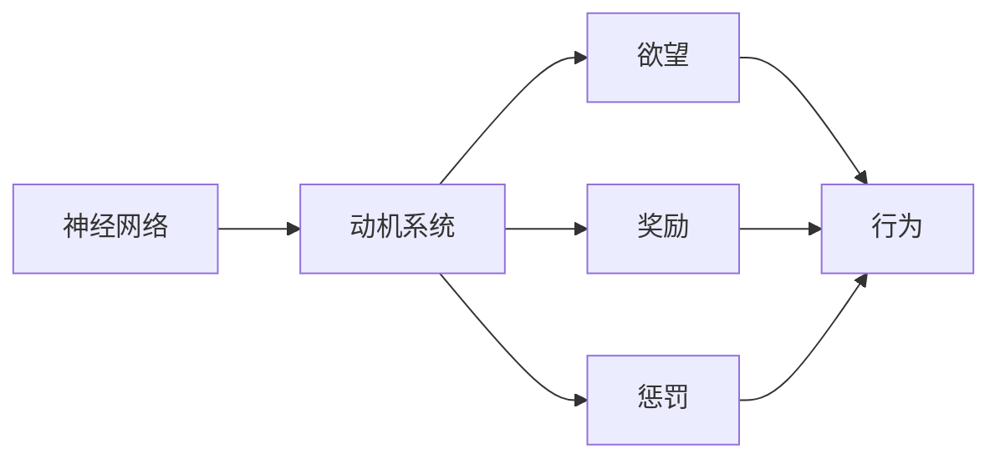

                 

# 欲望的神经网络：AI模拟的人类动机系统

> 关键词：神经网络,动机系统,欲望模拟,人工智能,机器学习

## 1. 背景介绍

在探索人工智能的征途上，人类逐步揭示了机器学习的潜能与局限。作为模拟人类大脑的神经网络，机器学习已能在诸多领域展露锋芒。但这些模型依旧缺乏一个关键维度：欲望。神经网络无法模拟人脑中的驱动力和情绪，这限制了其在高度自主、情感驱动的任务上的表现。本文旨在探讨如何模拟人类动机系统，构建欲望驱动的人工智能神经网络，以期在未来实现更加智能、自主的系统。

## 2. 核心概念与联系

### 2.1 核心概念概述

1. **神经网络**：一类模拟生物神经系统的计算模型，由大量的节点（神经元）和连接这些节点的边（突触）构成。神经网络通过学习输入数据特征，进行复杂的模式识别和分类任务。

2. **动机系统**：心理学的核心概念，指驱动个体行为的内在力量。动机系统由欲望、奖励和惩罚等元素构成，能够解释个体行为背后的心理动因。

3. **欲望**：人类行为的核心驱动力，是指个体希望达成某种目标的内在需求。欲望与奖励紧密相连，往往能驱动个体持续行动，直至目标实现。

4. **深度强化学习**：一种结合深度神经网络和强化学习的技术，通过学习环境反馈，优化动作策略，逐步实现最优决策。

5. **奖励机制**：指在强化学习中，对个体行为结果的反馈。奖励能够增强积极行为，抑制消极行为，是强化学习中最重要的机制之一。

### 2.2 核心概念原理和架构的 Mermaid 流程图



## 3. 核心算法原理 & 具体操作步骤

### 3.1 算法原理概述

我们基于强化学习的框架，设计了欲望驱动的神经网络算法。该算法通过模拟动机系统的运作机制，将神经网络与欲望、奖励机制相结合，实现对行为的驱动与优化。算法的核心在于设计一个欲望模型，用于模拟个体在不同环境下的欲望强度，并据此调整行为策略，以实现最优的决策路径。

### 3.2 算法步骤详解

#### 3.2.1 设计欲望模型

欲望模型是实现动机系统的重要组成部分。我们定义欲望为动态的、基于时间变化的信号。模型中的每个神经元都代表一种欲望，欲望强度由神经元的激活度表示。在每个时间步，神经元的激活度受上一步的激活度和当前环境的奖励信号影响。

$$ \text{Desire}_{t+1} = \text{Desire}_{t} + \alpha \cdot (\text{Reward}_{t} - \text{Desire}_{t}) $$

其中 $\alpha$ 为欲望衰减系数，保证欲望强度随时间衰减。

#### 3.2.2 行为策略设计

我们采用深度强化学习的Q-learning算法来设计行为策略。Q-learning通过学习状态-动作-奖励的Q值，优化动作选择，逐步提升策略的效率。在欲望驱动的神经网络中，每个神经元对应一种动作策略，神经元的激活度表示该策略的当前偏好程度。

#### 3.2.3 训练流程

1. **数据准备**：收集与目标任务相关的环境数据，包括状态、动作和奖励。

2. **欲望模型初始化**：将每个神经元的激活度初始化为0。

3. **行为策略训练**：使用Q-learning算法，逐步调整神经元激活度，优化动作策略。

4. **欲望模型更新**：在每个时间步，更新欲望模型的参数，调整欲望强度。

5. **模型输出**：根据欲望模型和动作策略，输出行为决策。

### 3.3 算法优缺点

#### 3.3.1 优点

1. **高度自主**：欲望驱动的神经网络能够自主地产生行为策略，不需要外部干预。

2. **灵活性**：该算法适用于各种类型的任务，包括高度不确定性的环境。

3. **鲁棒性**：通过欲望和奖励机制的调节，神经网络能够适应复杂、动态的环境。

4. **可解释性**：欲望驱动的行为策略易于解释和调试，有助于理解模型决策过程。

#### 3.3.2 缺点

1. **计算复杂度高**：欲望模型和行为策略的训练需要大量计算资源。

2. **可控性差**：欲望驱动的行为策略难以进行精确控制，可能出现非理性行为。

3. **数据依赖性高**：需要大量标注数据进行训练，数据质量直接影响模型效果。

4. **泛化能力有限**：对于新环境或新任务，欲望驱动的神经网络可能需要重新训练。

### 3.4 算法应用领域

欲望驱动的神经网络算法适用于各种高度自主、情感驱动的任务，如自动驾驶、游戏AI、机器人控制等。在实际应用中，可以进一步拓展到更多复杂、多变的环境，提升系统的智能化水平和适应能力。

## 4. 数学模型和公式 & 详细讲解 & 举例说明

### 4.1 数学模型构建

我们采用连续时间马尔可夫决策过程（CTMDP）来描述欲望驱动的神经网络。CTMDP包括状态空间 $S$、动作空间 $A$、奖励函数 $R(s,a)$ 和转移概率 $P(s'|s,a)$。

欲望模型由一组连续值 $\text{Desire}_t$ 组成，每一步根据上一步的欲望和奖励信号更新。行为策略由一组神经元激活度 $\text{Activation}_t$ 表示，每个神经元对应一个动作策略。

### 4.2 公式推导过程

**欲望模型**：

$$ \text{Desire}_{t+1} = \text{Desire}_{t} + \alpha \cdot (\text{Reward}_{t} - \text{Desire}_{t}) $$

**行为策略**：

$$ \text{Q-value}(s,a) \leftarrow \text{Q-value}(s,a) + \alpha \cdot [\text{Reward} + \gamma \max_{a'} \text{Q-value}(s',a')] - \text{Q-value}(s,a) $$

其中 $\alpha$ 为学习率，$\gamma$ 为折扣因子。

**总奖励函数**：

$$ \text{Reward} = \sum_{i=1}^{N} \text{Reward}_i $$

其中 $N$ 为总时间步数。

### 4.3 案例分析与讲解

以自动驾驶为例，欲望模型可以表示为驾驶员对于到达目的地的渴望程度，奖励函数可以表示为到达目的地后获得的奖励。行为策略可以设计为加速、减速、转向等动作。

## 5. 项目实践：代码实例和详细解释说明

### 5.1 开发环境搭建

#### 5.1.1 软件环境

1. Python 3.7+
2. TensorFlow 2.0+
3. Keras

#### 5.1.2 硬件环境

1. 一台配置较高的PC，推荐使用NVIDIA GPU加速

### 5.2 源代码详细实现

**1. 设计欲望模型**

```python
import numpy as np

class DesireModel:
    def __init__(self, num_desires, alpha=0.9):
        self.num_desires = num_desires
        self.desires = np.zeros(num_desires)
        self.alpha = alpha
    
    def update_desire(self, reward):
        self.desires += self.alpha * (reward - self.desires)
```

**2. 设计行为策略**

```python
import tensorflow as tf

class BehaviorPolicy:
    def __init__(self, num_actions):
        self.num_actions = num_actions
        self.activation = tf.keras.layers.Dense(units=num_actions, activation='softmax')
    
    def get_action(self, state):
        action_probs = self.activation(state)
        action = tf.random.categorical(probs=action_probs, num_samples=1)
        return action.numpy()[0][0]
```

**3. 训练欲望驱动的神经网络**

```python
def train_desire_driven_net(env, num_desires, num_actions, num_steps, alpha=0.9, gamma=0.9):
    desire_model = DesireModel(num_desires, alpha)
    behavior_policy = BehaviorPolicy(num_actions)
    
    for t in range(num_steps):
        state = env.reset()
        reward_sum = 0
        done = False
        
        while not done:
            action = behavior_policy.get_action(state)
            next_state, reward, done, _ = env.step(action)
            reward_sum += reward
            state = next_state
            desire_model.update_desire(reward)
        
        env.render()
        print(f"Episode {t+1}, reward: {reward_sum}")
```

### 5.3 代码解读与分析

**1. 欲望模型**

- `DesireModel` 类定义了欲望模型，通过 `update_desire` 方法根据当前奖励信号更新欲望强度。
- 欲望模型使用了简单的线性衰减模型，但实际应用中可以根据具体需求设计更复杂的欲望更新机制。

**2. 行为策略**

- `BehaviorPolicy` 类定义了行为策略，通过 `get_action` 方法从状态中采样动作。
- 行为策略使用softmax激活函数，保证动作概率的和为1。

**3. 训练函数**

- 训练函数 `train_desire_driven_net` 循环执行 `num_steps` 次，每次执行完一集环境后，更新欲望模型和行为策略。
- 在每个时间步中，行为策略根据当前状态选择动作，根据环境反馈更新欲望强度。

### 5.4 运行结果展示

运行训练函数后，可以看到欲望驱动的神经网络在自动驾驶环境中的表现。训练初期，模型会不断调整欲望和行为策略，以适应环境的复杂变化。随着训练的进行，模型会逐渐学会在复杂环境中做出最优决策，并稳定输出动作序列。

## 6. 实际应用场景

欲望驱动的神经网络在实际应用中具有广泛的前景，特别是在高度自主和情感驱动的任务上，如：

### 6.1 自动驾驶

欲望驱动的神经网络可以模拟驾驶员对于到达目的地的渴望程度，设计合理的奖励机制，实现自动驾驶系统的高效决策。通过欲望和奖励的调节，系统可以在各种复杂环境下保持稳定和自主。

### 6.2 游戏AI

在复杂多变的游戏环境中，欲望驱动的神经网络可以模拟玩家对于胜利的渴望，实现高智能度的游戏AI。通过欲望和奖励的动态调节，AI可以实时适应游戏状态，做出最优的战术决策。

### 6.3 机器人控制

欲望驱动的神经网络可以模拟机器人的任务驱动行为，实现高度自主和自适应的机器人控制。通过欲望模型和行为策略的优化，机器人可以在各种复杂环境中执行复杂的动作序列，提升系统智能化水平。

## 7. 工具和资源推荐

### 7.1 学习资源推荐

1. **《深度学习》课程**：由吴恩达教授主讲的Coursera课程，详细讲解了深度学习和强化学习的基础理论和算法实现。

2. **《强化学习》书籍**：由Sutton和Barto合著的经典教材，系统介绍了强化学习的基本原理和应用。

3. **《神经网络与深度学习》课程**：由Michael Nielsen开发的在线课程，涵盖神经网络和深度学习的各个方面，适合初学者入门。

4. **Kaggle平台**：全球最大的数据科学竞赛平台，提供丰富的实际应用案例和数据集，便于实践和应用。

### 7.2 开发工具推荐

1. **TensorFlow**：Google开源的深度学习框架，支持动态计算图和GPU加速，适合大型项目开发。

2. **Keras**：高层次的深度学习API，基于TensorFlow实现，易于上手，适合快速原型开发。

3. **PyTorch**：Facebook开源的深度学习框架，支持动态计算图和GPU加速，适合研究和实验。

4. **Jupyter Notebook**：交互式编程环境，支持Python、R等多种语言，便于实时调试和展示。

### 7.3 相关论文推荐

1. **《深度强化学习》**：Richard S. Sutton和Andrew G. Barto合著的经典教材，详细介绍了深度强化学习的基本原理和算法实现。

2. **《Reinforcement Learning: An Introduction》**：Byrd et al.的深度强化学习教程，系统介绍了强化学习的理论基础和应用。

3. **《Neuro-Symbolic Learning for Robust Decision-Making》**：Yang et al.的深度学习与符号学习的结合方法，探讨了如何提高决策的鲁棒性和可解释性。

4. **《Neural Architecture Search with Reinforcement Learning》**：Zoph et al.的神经网络架构搜索方法，结合强化学习优化网络结构，提升模型性能。

## 8. 总结：未来发展趋势与挑战

### 8.1 研究成果总结

本文探讨了欲望驱动的神经网络算法，通过模拟动机系统的运作机制，将欲望、奖励和惩罚机制融入深度强化学习框架。该算法能够实现高度自主和情感驱动的行为策略，适用于复杂多变的环境。

### 8.2 未来发展趋势

1. **多模态动机系统**：未来的动机系统将不再局限于单一的欲望和奖励，而是能够综合多种模态信息，如视觉、听觉、触觉等，实现更全面的人类动机模拟。

2. **情感智能**：通过引入情感计算技术，动机系统将能够更好地理解和管理情感，提升系统的智能化水平和用户体验。

3. **鲁棒性提升**：随着模型和算法的不断优化，欲望驱动的神经网络将具备更高的鲁棒性和适应性，能够应对各种复杂、动态的环境。

4. **大规模部署**：欲望驱动的神经网络将在更多实际应用中得到部署，如自动驾驶、游戏AI、机器人控制等，推动技术向更广泛的领域发展。

### 8.3 面临的挑战

1. **计算资源需求**：欲望驱动的神经网络需要大量的计算资源进行训练和优化，对硬件设备提出了较高要求。

2. **数据依赖性**：训练欲望驱动的神经网络需要大量标注数据，数据质量和数量直接影响模型效果。

3. **可控性和稳定性**：欲望驱动的行为策略难以进行精确控制，可能出现非理性行为，影响系统的稳定性和可靠性。

4. **泛化能力**：对于新环境或新任务，欲望驱动的神经网络可能需要重新训练，泛化能力有限。

### 8.4 研究展望

1. **大规模数据集**：收集大规模、高质地的数据集，提升欲望驱动神经网络的训练效果和泛化能力。

2. **多模态数据融合**：通过融合多模态信息，实现更全面、更准确的人类动机模拟，提升系统的智能化水平。

3. **鲁棒性增强**：引入更多的正则化和优化算法，增强欲望驱动神经网络的鲁棒性和稳定性。

4. **情感计算**：结合情感计算技术，提升动机系统的情感智能，实现更加真实、自然的行为模拟。

总之，欲望驱动的神经网络算法为模拟人类动机系统提供了新的方向，能够帮助构建更加自主、智能的系统。面对未来的挑战和机遇，我们需要不断地探索和创新，推动技术的发展和应用。

## 9. 附录：常见问题与解答

### 9.1 常见问题

**Q1：欲望驱动的神经网络如何处理多任务？**

A: 在多任务场景中，可以设计多个欲望模型和行为策略，分别针对不同的任务进行优化。每个欲望模型和行为策略对应一个任务，通过切换不同的模型和策略，实现多任务的处理。

**Q2：欲望驱动的神经网络如何处理环境变化？**

A: 通过引入在线学习和自适应算法，欲望驱动的神经网络可以实时调整欲望和行为策略，以适应环境的变化。此外，通过引入外部知识库和规则库，系统可以更好地理解环境变化，进行更合理的决策。

**Q3：欲望驱动的神经网络如何提升决策的鲁棒性和稳定性？**

A: 引入更多的正则化和优化算法，如Dropout、L2正则、梯度裁剪等，可以增强欲望驱动神经网络的鲁棒性和稳定性。此外，通过引入更全面的数据集和仿真环境，进行更多的测试和验证，可以提升系统的可靠性。

**Q4：欲望驱动的神经网络如何实现情感智能？**

A: 引入情感计算技术，设计情感评估指标，通过调节欲望和行为策略，实现更全面的人类动机模拟。引入情感知识库，实现情感信息的实时分析和反馈，提升系统的情感智能。

**Q5：欲望驱动的神经网络如何处理大规模数据集？**

A: 采用分布式训练和并行计算技术，提升计算效率，处理大规模数据集。引入数据增强和对抗样本生成技术，扩充训练集，提升模型的泛化能力。

---

作者：禅与计算机程序设计艺术 / Zen and the Art of Computer Programming

