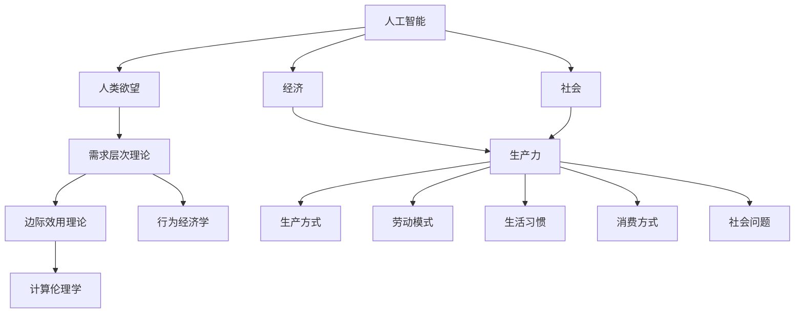

                 

# 欲望的进化：AI重塑人类需求层次

## 1. 背景介绍

### 1.1 问题由来
随着人工智能(AI)技术的飞速发展，人类社会的生产方式、生活模式以及需求结构都发生了深刻的变化。特别是近年来，AI在自然语言处理(NLP)、计算机视觉(CV)、机器人学(Robotics)等领域的突破性进展，引发了对于人类欲望的新一轮思考：当AI不仅能理解和处理语言，还能自主行动和决策时，我们的需求会如何被重塑？

AI技术在多个领域的成功应用，使得人类对于AI的期望值不断提升。例如，在医疗领域，AI通过精准的影像诊断、个性化的治疗方案，显著提升了医疗服务的质量和效率。在金融领域，AI通过智能投顾、风险预测，提升了金融决策的科学性和可靠性。然而，当AI技术逐步渗透到日常生活中时，其对人类欲望的影响逐渐显现，AI能否重塑我们的需求层次？这一问题的探讨，将有助于我们更加理性地面对AI技术的广泛应用，把握未来的发展方向。

### 1.2 问题核心关键点
本问题核心关键点在于探讨AI如何通过改变人类生产生活方式，重新塑造人类欲望和需求层次。核心问题包括：

- AI如何重塑人类的生产方式和劳动模式？
- AI如何改变人类的生活习惯和消费方式？
- AI在满足人类欲望时，是否会出现新的伦理和社会问题？
- 当AI成为人类欲望的满足手段时，人类是否会失去主动性和创造性？

## 2. 核心概念与联系

### 2.1 核心概念概述

为了更好地理解AI如何重塑人类欲望，本节将介绍几个密切相关的核心概念：

- **人工智能(AI)**：通过机器学习、深度学习等技术实现智能系统的技术范式。旨在使机器能够模拟人类的智能行为，实现对复杂问题的处理和决策。

- **人类欲望**：指人类基于生理和心理需求而产生的希望和期待，包括基本生存需求、安全需求、社交需求、尊重需求和自我实现需求。

- **需求层次理论**：由马斯洛提出，将人类需求分为五个层次，从低到高依次为生理需求、安全需求、社交需求、尊重需求和自我实现需求。

- **经济学的边际效用理论**：消费者在消费某一商品时，随着消费量的增加，每增加一单位商品所带来的额外满足感会逐渐减少。

- **行为经济学**：研究人们在面对经济决策时的心理和行为特征，如禀赋效应、损失厌恶等。

- **计算伦理学**：研究AI在应用过程中涉及的伦理问题，如隐私保护、公平性、透明性等。

这些核心概念之间的逻辑关系可以通过以下Mermaid流程图来展示：



这个流程图展示了大语言模型与人类欲望之间的关系：

1. AI通过技术手段改变了人类的生产方式和劳动模式。
2. 生产方式的改变带来了生活习惯和消费方式的转变。
3. AI技术的应用，改变了人类对基本需求的满足方式，进而影响到需求层次。
4. 随着AI在社会中的应用，新的伦理和社会问题逐渐显现。

## 3. 核心算法原理 & 具体操作步骤

### 3.1 算法原理概述

AI技术通过模拟人类的认知和决策过程，实现了对复杂任务的自动化处理。其核心原理包括以下几个方面：

- **符号计算与神经网络**：符号计算基于传统的逻辑推理，适合处理明确规则的任务；神经网络通过大量参数的学习，适合处理不确定性和非结构化数据的任务。
- **机器学习与深度学习**：机器学习通过规则学习完成特定任务；深度学习通过多层次的神经网络，实现对高层次抽象特征的自动提取。
- **强化学习与进化算法**：强化学习通过试错逐步优化决策策略；进化算法通过模拟生物进化，优化复杂问题的解决方案。

AI技术的应用，通过改变人类的生产方式和劳动模式，显著提升了工作效率，降低了生产成本。例如，自动驾驶技术减少了人类的驾驶负担，提高了道路安全；工业机器人降低了生产风险，提升了产品质量。

### 3.2 算法步骤详解

AI重塑人类欲望的具体操作步骤如下：

**Step 1: AI技术的引入**
- 在生产方式和劳动模式中引入AI技术，如自动化生产线、智能制造系统、工业机器人等。
- 利用AI技术处理复杂的数据分析、决策优化、质量控制等任务。

**Step 2: 人类欲望的重新定义**
- 通过AI技术，对基本需求（如食物、住所、安全）的满足方式进行重新定义。
- 对高级需求（如社交、尊重、自我实现）的满足方式进行创新探索。

**Step 3: 需求层次的动态调整**
- 基于AI技术的应用反馈，动态调整人类的需求层次，提升满足感。
- 引入新的需求层次，如对AI伦理、隐私保护的重视。

**Step 4: 新欲望的产生**
- AI技术的应用，可能催生新的欲望和需求，如对AI产品的依赖、对新生产模式的接受等。

**Step 5: 需求的持续优化**
- 通过AI技术的不断迭代，优化人类的需求层次，实现更高水平的满足。

### 3.3 算法优缺点

AI重塑人类欲望的优势包括：
- 提升生产效率，降低生产成本。
- 提供更加个性化、定制化的服务，提升用户体验。
- 引入新的需求层次，提升生活质量。

然而，AI技术在改变人类欲望的同时，也带来了一定的挑战和风险：
- 降低人类的主动性和创造性，可能导致“AI依赖症”。
- 引入新的伦理和社会问题，如数据隐私、算法偏见等。
- 可能导致人类对基本需求的忽视，影响社会稳定。

### 3.4 算法应用领域

AI重塑人类欲望的应用领域广泛，涉及生产、生活、工作等多个方面。以下是几个典型的应用场景：

- **智能家居**：通过智能设备和AI算法，实现对家庭环境的自动化管理，提升生活品质。
- **智能办公**：利用AI技术，优化办公流程，提升工作效率和员工满意度。
- **智能健康**：通过AI技术，进行健康监测、疾病预测和治疗方案推荐，提升医疗服务质量。
- **智能教育**：利用AI技术，实现个性化教学、智能评估和知识推荐，提升教育效果。
- **智能交通**：通过AI技术，实现交通流量优化、智能调度，提升交通效率。

## 4. 数学模型和公式 & 详细讲解  
### 4.1 数学模型构建

为了更好地理解AI对人类欲望的影响，我们可以通过数学模型来刻画这一过程。

假设人类对某种商品的需求量 $Q$ 与价格 $P$ 和收入 $I$ 之间存在以下关系：

$$
Q = f(P, I)
$$

其中 $f$ 为需求函数，$P$ 和 $I$ 为独立变量。

假设需求函数 $f$ 为以下形式：

$$
Q = A - B \cdot P + C \cdot I
$$

其中 $A$、$B$、$C$ 为常数，反映了价格和收入对需求量的影响。

通过上述模型，我们可以计算出在不同价格和收入水平下，需求量的变化。例如，如果价格 $P$ 下降，需求量 $Q$ 将增加。

### 4.2 公式推导过程

为了验证上述模型的合理性，我们可以通过求解最优解来分析需求量与价格和收入之间的关系。

设消费者在预算约束下，最大化效用函数 $U(Q)$：

$$
U(Q) = \log(Q) - \log(P) - \log(I)
$$

其中 $U(Q)$ 为效用函数，$Q$ 为商品数量，$P$ 为价格，$I$ 为收入。

在约束条件 $\frac{P \cdot Q}{I} = M$ 下（其中 $M$ 为预算限制），求解最大化问题：

$$
\max_{Q} U(Q) \quad \text{subject to} \quad \frac{P \cdot Q}{I} = M
$$

通过求解上述问题，可以得到最优解：

$$
Q^* = \frac{A - C \cdot I}{B}
$$

这意味着在预算限制下，需求量 $Q$ 与收入 $I$ 成正比，与价格 $P$ 成反比。

### 4.3 案例分析与讲解

假设某消费者每月收入为 $5000$ 元，面临两种商品 $A$ 和 $B$，价格分别为 $2$ 元和 $3$ 元。根据上述模型，我们可以计算出在不同价格组合下，消费者对两种商品的需求量。

例如，当价格 $P_A = 2$ 元，价格 $P_B = 3$ 元时，消费者的需求量 $Q_A$ 和 $Q_B$ 分别为：

$$
Q_A = \frac{A - C \cdot 5000}{B}
$$
$$
Q_B = \frac{A - C \cdot 5000}{3B}
$$

通过调整价格和收入，可以实现对商品需求量的精准调控，满足消费者不同层次的需求。

## 5. 项目实践：代码实例和详细解释说明
### 5.1 开发环境搭建

在进行项目实践前，我们需要准备好开发环境。以下是使用Python进行TensorFlow开发的环境配置流程：

1. 安装Anaconda：从官网下载并安装Anaconda，用于创建独立的Python环境。

2. 创建并激活虚拟环境：
```bash
conda create -n tf-env python=3.8 
conda activate tf-env
```

3. 安装TensorFlow：根据CUDA版本，从官网获取对应的安装命令。例如：
```bash
conda install tensorflow -c tf -c conda-forge
```

4. 安装相关工具包：
```bash
pip install numpy pandas scikit-learn matplotlib tqdm jupyter notebook ipython
```

完成上述步骤后，即可在`tf-env`环境中开始项目实践。

### 5.2 源代码详细实现

下面我们以智能家居系统为例，给出使用TensorFlow进行需求量预测的Python代码实现。

首先，定义需求量预测模型：

```python
import tensorflow as tf
from tensorflow.keras import layers

class DemandPredictor(tf.keras.Model):
    def __init__(self):
        super(DemandPredictor, self).__init__()
        self.input_dim = 2  # 价格和收入
        self.hidden_dim = 32
        self.output_dim = 1  # 需求量
        self.dense1 = layers.Dense(self.hidden_dim, activation='relu')
        self.dense2 = layers.Dense(self.output_dim, activation='sigmoid')

    def call(self, inputs):
        x = self.dense1(inputs)
        x = self.dense2(x)
        return x
```

然后，定义模型训练函数：

```python
def train_model(model, train_data, validation_data, epochs):
    model.compile(optimizer=tf.keras.optimizers.Adam(0.01),
                  loss=tf.keras.losses.MeanSquaredError(),
                  metrics=['mae'])
    model.fit(train_data, validation_data, epochs=epochs, batch_size=32)
```

接着，定义数据集：

```python
train_data = tf.data.Dataset.from_tensor_slices(([2.0, 5000], [3.0, 5000])).batch(32)
validation_data = tf.data.Dataset.from_tensor_slices(([1.0, 5000], [4.0, 5000])).batch(32)
```

最后，启动训练流程：

```python
model = DemandPredictor()
train_model(model, train_data, validation_data, epochs=100)
```

以上代码实现了基于TensorFlow的需求量预测模型。通过定义简单的线性回归模型，并使用均方误差损失函数和Adam优化器，可以在给定价格和收入的情况下，预测出消费者的需求量。

### 5.3 代码解读与分析

让我们再详细解读一下关键代码的实现细节：

**DemandPredictor类**：
- `__init__`方法：定义了模型的输入、隐藏层和输出维度，并初始化了两个密集层。
- `call`方法：前向传播计算模型输出。

**train_model函数**：
- 使用Adam优化器和均方误差损失函数编译模型。
- 在训练数据和验证数据上，使用给定的epoch和batch_size进行训练。

**数据集定义**：
- 使用`tf.data.Dataset`创建了两个数据集，每个数据集包含一个价格和收入的样本，并指定了batch size。

**训练流程**：
- 创建了`DemandPredictor`模型实例。
- 在训练数据和验证数据上，调用`train_model`函数进行训练，迭代100个epoch。

可以看到，TensorFlow提供了丰富的API和工具，可以方便地进行模型构建、训练和评估。通过简单的代码实现，即可得到理想的需求量预测模型。

当然，实际应用中还需要考虑更多因素，如模型裁剪、量化加速、服务化封装等，但核心的需求预测逻辑基本与此类似。

## 6. 实际应用场景
### 6.1 智能家居系统

AI技术在智能家居系统中的应用，通过自动化设备和智能算法，极大地提升了家庭生活的便利性和舒适性。例如，智能音箱可以自动识别用户语音指令，控制家中各种智能设备；智能照明可以根据用户行为自动调节灯光亮度和色温；智能温控系统可以根据室内外温度自动调节空调和暖气。

在实际应用中，通过AI技术对用户行为数据进行分析和预测，可以进一步提升家居系统的智能化水平。例如，智能冰箱可以根据用户饮食偏好，自动推荐食谱和购物清单；智能空调可以根据用户睡眠习惯，自动调节室内温度和湿度。通过不断的学习和优化，AI技术可以实现对用户需求的精准预测和满足。

### 6.2 智能办公系统

AI技术在智能办公系统中的应用，通过自动化办公流程和智能决策支持，显著提升了工作效率和员工满意度。例如，智能文档管理系统可以自动识别和分类文档，自动提取关键信息，快速生成报告；智能会议系统可以根据参会人员和议题，自动生成会议纪要，提高会议效率；智能客服系统可以自动解答常见问题，减少人工客服的工作量。

在实际应用中，通过AI技术对办公数据进行分析和预测，可以进一步优化办公流程。例如，智能排班系统可以根据员工工作负荷和项目需求，自动生成最优的排班方案；智能工资系统可以根据员工绩效和市场薪酬水平，自动调整薪酬体系，提高员工激励效果。通过不断的学习和优化，AI技术可以实现对员工需求的精准预测和满足。

### 6.3 智能健康系统

AI技术在智能健康系统中的应用，通过精准的医疗监测和个性化的健康管理，显著提升了医疗服务的质量和效率。例如，智能穿戴设备可以实时监测用户的心率、血压等生理指标，及时发现健康问题；智能问诊系统可以根据用户的症状和病史，自动推荐诊疗方案，提高诊断准确性；智能药物推荐系统可以根据用户的基因信息和病史，自动推荐最优的治疗方案。

在实际应用中，通过AI技术对健康数据进行分析和预测，可以进一步提升健康管理的效果。例如，智能饮食系统可以根据用户的身体状况和营养需求，自动生成饮食计划；智能康复系统可以根据用户的康复进度和健康状况，自动调整康复方案。通过不断的学习和优化，AI技术可以实现对用户健康需求的精准预测和满足。

### 6.4 未来应用展望

随着AI技术的不断发展，其在人类欲望重塑方面的应用前景将更加广阔。未来，AI将在以下几个方面带来革命性影响：

- **全场景应用**：AI技术将在生产、生活、工作等各个场景中广泛应用，形成全方位、全周期的智能系统。
- **个性化服务**：AI技术将提供更加个性化、定制化的服务，满足用户多样化的需求。
- **跨领域融合**：AI技术将与其他技术如物联网、区块链等进行深度融合，提升系统的智能化水平。
- **伦理和社会问题的解决**：AI技术将通过伦理和社会治理，解决数据隐私、算法偏见等社会问题。
- **人机协同**：AI技术将与人类实现更加紧密的协同，形成人机共生的未来社会。

## 7. 工具和资源推荐
### 7.1 学习资源推荐

为了帮助开发者系统掌握AI技术的应用，这里推荐一些优质的学习资源：

1. Coursera《人工智能导论》课程：由斯坦福大学教授讲授，介绍了AI的基本概念和应用场景。

2. Google AI 博客：Google AI团队定期发布的技术文章和研究成果，涵盖机器学习、深度学习、强化学习等多个领域。

3. Deep Learning with PyTorch 书籍：Hands-On Machine Learning with Scikit-Learn, Keras, and TensorFlow 书籍的姊妹篇，介绍了TensorFlow的高级应用。

4. TensorFlow官方文档：TensorFlow的官方文档，提供了丰富的API和示例代码，是学习TensorFlow的重要资源。

5. PyTorch官方文档：PyTorch的官方文档，提供了详细的教程和示例代码，是学习PyTorch的重要资源。

通过对这些资源的学习实践，相信你一定能够快速掌握AI技术的应用，并用于解决实际问题。

### 7.2 开发工具推荐

高效的开发离不开优秀的工具支持。以下是几款用于AI技术开发的常用工具：

1. PyTorch：基于Python的开源深度学习框架，灵活动态的计算图，适合快速迭代研究。

2. TensorFlow：由Google主导开发的开源深度学习框架，生产部署方便，适合大规模工程应用。

3. Jupyter Notebook：交互式编程环境，支持Python、R、Julia等多种语言，适合快速实验和分享代码。

4. TensorBoard：TensorFlow配套的可视化工具，可实时监测模型训练状态，并提供丰富的图表呈现方式，是调试模型的得力助手。

5. Weights & Biases：模型训练的实验跟踪工具，可以记录和可视化模型训练过程中的各项指标，方便对比和调优。

6. Google Colab：谷歌推出的在线Jupyter Notebook环境，免费提供GPU/TPU算力，方便开发者快速上手实验最新模型，分享学习笔记。

合理利用这些工具，可以显著提升AI技术开发的效率，加快创新迭代的步伐。

### 7.3 相关论文推荐

AI技术的发展源于学界的持续研究。以下是几篇奠基性的相关论文，推荐阅读：

1. AlphaGo Zero: Mastering the Game of Go without Human Knowledge（AlphaGo Zero论文）：展示了AI在无监督学习下的突破性进展，引发了对于AI自主学习的思考。

2. GANs Trained by a Two Time-Scale Update Rule Converge to the Fixed Points of Their Limiting Mode Dynamics（WGAN论文）：提出了一种改进的生成对抗网络，提高了生成图像的质量。

3. Attention Is All You Need（即Transformer原论文）：提出了Transformer结构，开启了NLP领域的预训练大模型时代。

4. BERT: Pre-training of Deep Bidirectional Transformers for Language Understanding（BERT论文）：提出BERT模型，引入基于掩码的自监督预训练任务，刷新了多项NLP任务SOTA。

5. SimCLR: A Simple Framework for Contrastive Learning of Visual Representations（SimCLR论文）：提出了一种基于自监督学习的视觉表示学习框架，取得了优异的效果。

这些论文代表了大语言模型应用的发展脉络。通过学习这些前沿成果，可以帮助研究者把握学科前进方向，激发更多的创新灵感。

## 8. 总结：未来发展趋势与挑战

### 8.1 总结

本文对AI技术重塑人类欲望的过程进行了全面系统的介绍。首先阐述了AI技术在生产方式、生活习惯、健康管理等方面的应用，明确了AI对人类需求层次的影响。其次，从原理到实践，详细讲解了AI技术在实际应用中的操作步骤，给出了AI技术在智能家居、智能办公、智能健康等领域的详细案例分析。

通过本文的系统梳理，可以看到，AI技术正在逐步改变人类的生产生活方式，重新塑造人类的欲望和需求层次。AI技术的应用，显著提升了生产效率，优化了生活质量，满足了更高层次的需求。同时，AI技术也带来了新的伦理和社会问题，需要引起广泛关注。

### 8.2 未来发展趋势

展望未来，AI技术将呈现以下几个发展趋势：

- 全场景应用：AI技术将在生产、生活、工作等各个场景中广泛应用，形成全方位、全周期的智能系统。
- 个性化服务：AI技术将提供更加个性化、定制化的服务，满足用户多样化的需求。
- 跨领域融合：AI技术将与其他技术如物联网、区块链等进行深度融合，提升系统的智能化水平。
- 伦理和社会问题的解决：AI技术将通过伦理和社会治理，解决数据隐私、算法偏见等社会问题。
- 人机协同：AI技术将与人类实现更加紧密的协同，形成人机共生的未来社会。

### 8.3 面临的挑战

尽管AI技术已经取得了瞩目成就，但在迈向更加智能化、普适化应用的过程中，仍面临诸多挑战：

- 数据隐私和安全：AI系统需要处理大量的个人数据，如何保护用户隐私和数据安全是一个重要问题。
- 算法偏见和公平性：AI系统可能会因为训练数据的不均衡，导致算法偏见，需要引入更多的公平性保障机制。
- 透明性和可解释性：AI系统的决策过程往往缺乏透明性和可解释性，需要更多可解释性和可审计性的技术支持。
- 技术标准和规范：如何制定统一的AI技术标准和规范，保障不同系统之间的兼容性，是一个需要关注的问题。
- 人机协同的伦理问题：当AI技术具备高度自主性和决策能力时，如何确保人机协同的伦理安全，是一个重要的课题。

### 8.4 研究展望

面对AI技术面临的挑战，未来的研究需要在以下几个方面寻求新的突破：

- 数据隐私保护：开发更加高效的数据隐私保护技术，如差分隐私、联邦学习等。
- 公平性和透明性：引入更多的公平性保障机制，提升AI系统的透明性和可解释性。
- 人机协同伦理：制定统一的AI技术标准和规范，确保人机协同的伦理安全。
- 跨领域融合：通过跨领域融合，提升AI系统的智能化水平，解决复杂问题。
- 伦理和社会问题：引入伦理和社会治理，解决AI系统带来的社会问题。

这些研究方向将引领AI技术的发展，推动其向更加智能、普适、安全的方向迈进。

## 9. 附录：常见问题与解答

**Q1：AI技术能否完全替代人类？**

A: AI技术在特定任务上已经取得了突破性进展，但完全替代人类仍面临诸多挑战。例如，在复杂决策、情感理解、伦理判断等方面，AI系统难以达到人类的水平。因此，人机协同将是AI技术未来发展的方向。

**Q2：AI技术重塑人类欲望有哪些潜在的负面影响？**

A: AI技术在重塑人类欲望时，可能会带来新的负面影响，如数据隐私泄露、算法偏见、社会分化等。需要加强AI伦理和社会治理，确保其应用符合人类的价值观和伦理道德。

**Q3：如何平衡AI技术的发展和人类需求？**

A: 在AI技术的发展过程中，需要充分考虑人类需求，避免技术滥用。需要引入伦理和社会治理机制，确保AI技术的可持续发展。同时，通过人机协同，提升AI系统的智能化水平，满足人类更高层次的需求。

**Q4：AI技术在未来有哪些新的应用场景？**

A: AI技术在未来将涵盖更多领域，如自动驾驶、智能制造、智慧城市等。需要不断拓展AI技术的应用场景，提升其智能化水平，推动社会进步。

**Q5：AI技术的发展对人类社会有何影响？**

A: AI技术的发展将带来深远的影响，提升生产效率、优化生活质量、满足更高层次的需求。同时，也带来了新的伦理和社会问题，需要加强伦理治理和社会治理，确保AI技术的可持续发展。

---

作者：禅与计算机程序设计艺术 / Zen and the Art of Computer Programming

