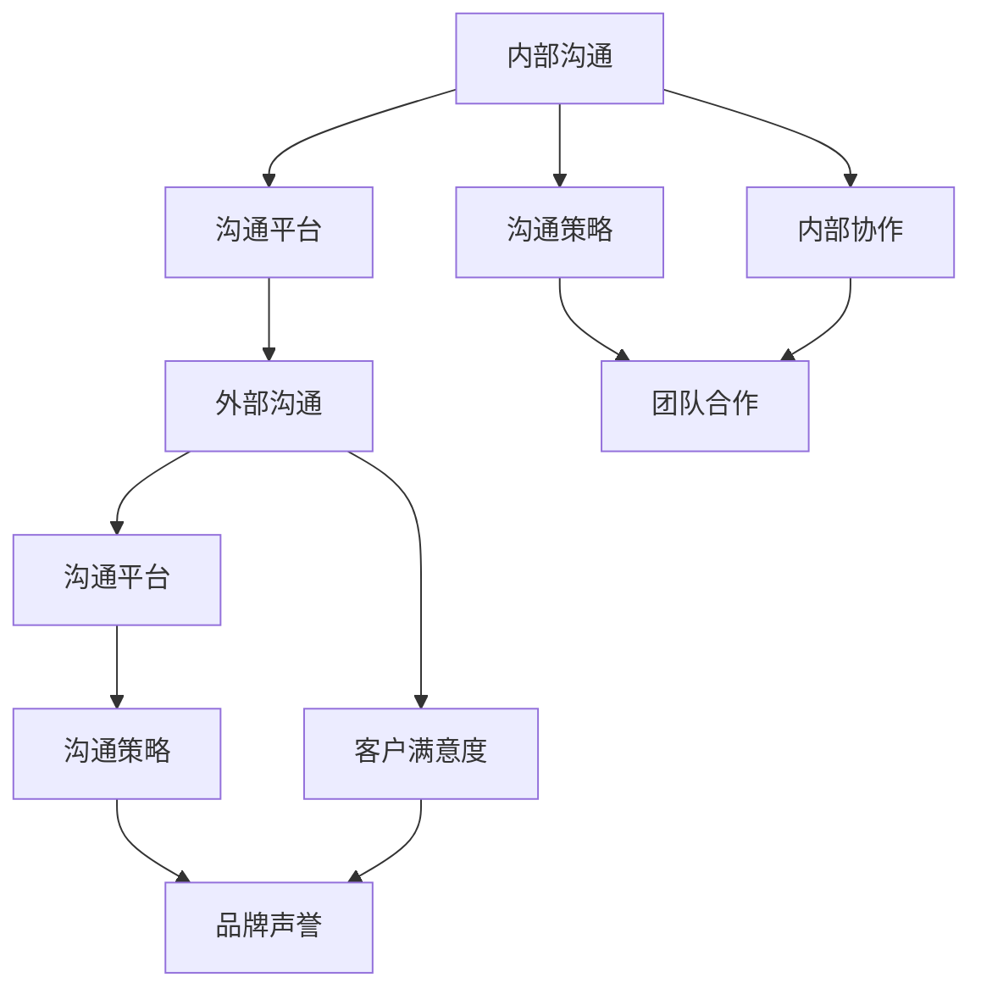

                 

# 沟通管理：改善内部和外部沟通

## 1. 背景介绍

### 1.1 问题由来
在当今快速变化的商业环境中，沟通已经成为企业成功的关键因素。有效的沟通不仅能够促进团队协作，还能提升客户满意度，驱动创新和增长。然而，随着全球化和数字化进程的加快，企业面临着日益复杂的外部环境和内部管理的挑战。

- 外部环境：市场竞争激烈，客户期望不断变化，企业需要快速响应市场需求，提高品牌知名度和客户忠诚度。
- 内部管理：跨部门协作困难，员工沟通不畅，创新能力受限，导致企业无法灵活应对市场变化。

因此，有效的沟通管理不仅能够改善企业内部和外部的沟通，还能够提升企业的整体竞争力。

### 1.2 问题核心关键点
沟通管理的核心关键点包括：

- 内部沟通：员工之间的信息交流和协作，影响团队合作效率和工作满意度。
- 外部沟通：企业与客户、合作伙伴和媒体之间的信息传递，影响品牌声誉和市场表现。

有效的沟通管理需要从多个层面进行改进，包括内部协作平台、客户关系管理系统、市场调研工具等。

## 2. 核心概念与联系

### 2.1 核心概念概述

为更好地理解沟通管理的核心概念，本节将介绍几个密切相关的核心概念：

- 内部沟通：指企业内部员工之间的信息交流和协作。高效的内部沟通能够提高团队合作效率和工作满意度。
- 外部沟通：指企业与客户、合作伙伴和媒体之间的信息传递。有效的外部沟通能够提升品牌声誉和市场表现。
- 沟通平台：指用于支持内部和外部沟通的软件工具，如企业内部通讯平台、客户关系管理系统等。
- 沟通策略：指企业对内部和外部沟通进行的战略规划和战术部署。

这些核心概念之间的逻辑关系可以通过以下Mermaid流程图来展示：



这个流程图展示了她核沟通概念及其之间的关系：

1. 内部沟通通过沟通平台实现，受沟通策略的指导。
2. 外部沟通同样通过沟通平台实现，受沟通策略的指导。
3. 沟通策略指导内部沟通和外部沟通的具体实践。
4. 内部协作和客户满意度直接影响外部沟通的效果。
5. 品牌声誉通过外部沟通最终体现。

这些概念共同构成了企业沟通管理的核心框架，指导着沟通实践的每一个环节。

## 3. 核心算法原理 & 具体操作步骤
### 3.1 算法原理概述

沟通管理的核心在于提高信息传递的效率和质量。基于监督学习的沟通管理方法，通过分析沟通数据的特征，预测未来沟通效果，从而优化沟通策略。

形式化地，假设企业内部和外部沟通的数据集为 $D=\{(x_i,y_i)\}_{i=1}^N$，其中 $x_i$ 为沟通信息，$y_i$ 为沟通效果，如员工满意度、客户满意度等。沟通管理的优化目标是最小化预测误差：

$$
\hat{y}=\mathop{\arg\min}_{y} \mathcal{L}(y,D)
$$

其中 $\mathcal{L}$ 为损失函数，用于衡量预测值与真实值之间的差异。常见的损失函数包括均方误差、交叉熵等。

### 3.2 算法步骤详解

基于监督学习的沟通管理一般包括以下几个关键步骤：

**Step 1: 数据准备**
- 收集企业内部和外部的沟通数据，包含沟通信息、沟通效果等属性。
- 对数据进行清洗、处理和标注，形成可用于训练和评估的监督数据集。

**Step 2: 特征工程**
- 提取和构造沟通数据的特征，如文本情感、语义理解、关键词提取等。
- 应用机器学习模型（如NLP、图像处理等）对沟通数据进行预处理，形成适合训练的格式。

**Step 3: 模型选择与训练**
- 选择合适的机器学习模型，如回归模型、分类模型等。
- 使用训练数据对模型进行训练，最小化损失函数。
- 根据验证集性能，调整模型参数，防止过拟合。

**Step 4: 模型评估与部署**
- 使用测试集对模型进行评估，计算预测准确率、召回率等指标。
- 根据模型评估结果，优化沟通策略和沟通平台。
- 部署模型到生产环境，实时监控沟通效果，及时调整。

### 3.3 算法优缺点

基于监督学习的沟通管理方法具有以下优点：

1. 简单高效：通过数据分析和模型训练，能够快速提升沟通效果。
2. 通用适用：适用于各种沟通场景，包括内部协作、客户关系管理等。
3. 可解释性：模型训练过程和结果都具有明确的数学解释，便于理解和调试。

同时，该方法也存在一定的局限性：

1. 依赖标注数据：模型的性能很大程度上取决于标注数据的质量和数量。
2. 模型泛化能力有限：当训练数据和测试数据分布差异较大时，模型效果可能不理想。
3. 高成本：数据收集、清洗和标注需要大量人力和时间投入。

尽管存在这些局限性，但就目前而言，基于监督学习的沟通管理方法仍是大企业沟通管理的主流范式。未来相关研究的重点在于如何进一步降低数据标注成本，提高模型的泛化能力，同时兼顾可解释性和经济性等因素。

### 3.4 算法应用领域

基于监督学习的沟通管理方法在多个领域得到了广泛应用，例如：

- 企业内部协作：通过分析员工沟通数据，优化团队合作效率和工作满意度。
- 客户关系管理：通过分析客户反馈数据，提升客户满意度和忠诚度。
- 市场调研：通过分析市场数据，预测市场趋势和客户需求。
- 品牌声誉管理：通过分析社交媒体数据，提升品牌声誉和市场表现。
- 创新管理：通过分析跨部门沟通数据，激发员工创新潜力，提升企业竞争力。

这些应用场景展示了基于监督学习的沟通管理方法的多样性和广泛性，进一步证明了其在实际应用中的价值。

## 4. 数学模型和公式 & 详细讲解 & 举例说明
### 4.1 数学模型构建

本节将使用数学语言对基于监督学习的沟通管理方法进行更加严格的刻画。

假设企业内部和外部沟通的数据集为 $D=\{(x_i,y_i)\}_{i=1}^N$，其中 $x_i$ 为沟通信息，$y_i$ 为沟通效果，如员工满意度、客户满意度等。定义模型 $M_{\theta}$ 为通信效果预测模型，$\theta$ 为模型参数。

沟通管理的优化目标是最小化预测误差：

$$
\hat{y}=\mathop{\arg\min}_{y} \mathcal{L}(y,D)
$$

其中 $\mathcal{L}$ 为损失函数，用于衡量预测值与真实值之间的差异。常见的损失函数包括均方误差、交叉熵等。

### 4.2 公式推导过程

以下我们以二分类任务为例，推导回归模型的损失函数及其梯度的计算公式。

假设模型 $M_{\theta}$ 在输入 $x$ 上的输出为 $\hat{y}=M_{\theta}(x)$，表示沟通效果预测。真实标签 $y \in \{0,1\}$。则二分类交叉熵损失函数定义为：

$$
\ell(M_{\theta}(x),y) = -[y\log \hat{y} + (1-y)\log (1-\hat{y})]
$$

将其代入经验风险公式，得：

$$
\mathcal{L}(\theta) = -\frac{1}{N}\sum_{i=1}^N [y_i\log M_{\theta}(x_i)+(1-y_i)\log(1-M_{\theta}(x_i))]
$$

根据链式法则，损失函数对参数 $\theta_k$ 的梯度为：

$$
\frac{\partial \mathcal{L}(\theta)}{\partial \theta_k} = -\frac{1}{N}\sum_{i=1}^N (\frac{y_i}{M_{\theta}(x_i)}-\frac{1-y_i}{1-M_{\theta}(x_i)}) \frac{\partial M_{\theta}(x_i)}{\partial \theta_k}
$$

其中 $\frac{\partial M_{\theta}(x_i)}{\partial \theta_k}$ 可进一步递归展开，利用自动微分技术完成计算。

在得到损失函数的梯度后，即可带入参数更新公式，完成模型的迭代优化。重复上述过程直至收敛，最终得到适应沟通任务的最优模型参数 $\theta^*$。

## 5. 项目实践：代码实例和详细解释说明
### 5.1 开发环境搭建

在进行沟通管理实践前，我们需要准备好开发环境。以下是使用Python进行Scikit-learn开发的环境配置流程：

1. 安装Anaconda：从官网下载并安装Anaconda，用于创建独立的Python环境。

2. 创建并激活虚拟环境：
```bash
conda create -n communication-env python=3.8 
conda activate communication-env
```

3. 安装Scikit-learn：从官网获取对应的安装命令。例如：
```bash
conda install scikit-learn
```

4. 安装各类工具包：
```bash
pip install numpy pandas scikit-learn matplotlib tqdm jupyter notebook ipython
```

完成上述步骤后，即可在`communication-env`环境中开始沟通管理实践。

### 5.2 源代码详细实现

这里我们以员工满意度预测为例，给出使用Scikit-learn对回归模型进行训练的PyTorch代码实现。

首先，定义员工满意度预测的任务：

```python
from sklearn.datasets import make_regression
from sklearn.model_selection import train_test_split

X, y = make_regression(n_samples=1000, n_features=5, n_informative=4, noise=0.2)
X_train, X_test, y_train, y_test = train_test_split(X, y, test_size=0.2, random_state=42)

# 特征工程
from sklearn.preprocessing import StandardScaler
from sklearn.feature_selection import SelectKBest
from sklearn.ensemble import RandomForestRegressor

scaler = StandardScaler()
X_train_scaled = scaler.fit_transform(X_train)
X_test_scaled = scaler.transform(X_test)

selector = SelectKBest(k=2, score_func='f_classif')
X_train_selected = selector.fit_transform(X_train_scaled, y_train)
X_test_selected = selector.transform(X_test_scaled)

# 模型训练
from sklearn.ensemble import RandomForestRegressor
model = RandomForestRegressor(n_estimators=100, random_state=42)
model.fit(X_train_selected, y_train)
```

然后，使用模型对员工满意度进行预测：

```python
from sklearn.metrics import mean_squared_error
from sklearn.ensemble import RandomForestRegressor

# 预测
y_pred = model.predict(X_test_selected)

# 评估
mse = mean_squared_error(y_test, y_pred)
print(f"Mean Squared Error: {mse:.2f}")
```

以上就是使用Scikit-learn对员工满意度预测模型进行训练和评估的完整代码实现。可以看到，通过Scikit-learn提供的标准数据集和机器学习库，我们能够快速构建并测试一个基本的回归模型。

### 5.3 代码解读与分析

让我们再详细解读一下关键代码的实现细节：

**make_regression函数**：
- 生成一个包含1000个样本、5个特征和4个有信息特征的回归数据集，引入0.2的噪声。

**train_test_split函数**：
- 将数据集划分为训练集和测试集，测试集占20%，随机种子为42。

**StandardScaler类**：
- 对特征进行标准化，使得特征均值为0，标准差为1，便于机器学习模型进行训练。

**SelectKBest类**：
- 通过方差选择法选择最重要的2个特征，用于后续的模型训练。

**RandomForestRegressor类**：
- 构建一个随机森林回归器，用于员工满意度的预测。

在得到员工满意度预测模型的基础上，企业可以根据预测结果，优化沟通策略和沟通平台，提升团队合作效率和工作满意度。

## 6. 实际应用场景
### 6.1 智能客服系统

基于监督学习的沟通管理方法可以应用于智能客服系统的构建。传统的客服往往需要大量人力，高峰期响应缓慢，且无法处理复杂的客户咨询。而使用基于监督学习的沟通管理方法，可以构建一个智能客服系统，实时监测和响应客户咨询，提升客户满意度。

在技术实现上，可以收集企业内部的历史客服对话记录，将问题和最佳答复构建成监督数据，在此基础上对模型进行训练。训练后的模型能够自动理解客户意图，匹配最合适的答案模板进行回复。对于客户提出的新问题，还可以接入检索系统实时搜索相关内容，动态组织生成回答。

### 6.2 金融舆情监测

金融机构需要实时监测市场舆论动向，以便及时应对负面信息传播，规避金融风险。传统的人工监测方式成本高、效率低，难以应对网络时代海量信息爆发的挑战。基于监督学习的沟通管理方法，可以构建一个金融舆情监测系统，实时抓取网络文本数据，自动判断舆情主题和情感倾向，一旦发现负面信息激增等异常情况，系统便会自动预警，帮助金融机构快速应对潜在风险。

### 6.3 个性化推荐系统

当前的推荐系统往往只依赖用户的历史行为数据进行物品推荐，无法深入理解用户的真实兴趣偏好。基于监督学习的沟通管理方法，可以构建一个个性化推荐系统，更好地挖掘用户行为背后的语义信息，从而提供更精准、多样的推荐内容。

在实践中，可以收集用户浏览、点击、评论、分享等行为数据，提取和用户交互的物品标题、描述、标签等文本内容。将文本内容作为模型输入，用户的后续行为（如是否点击、购买等）作为监督信号，在此基础上训练模型。训练后的模型能够从文本内容中准确把握用户的兴趣点。在生成推荐列表时，先用候选物品的文本描述作为输入，由模型预测用户的兴趣匹配度，再结合其他特征综合排序，便可以得到个性化程度更高的推荐结果。

### 6.4 未来应用展望

随着监督学习的沟通管理方法不断发展，其在更多领域得到应用，为传统行业带来变革性影响。

在智慧医疗领域，基于监督学习的沟通管理方法可以用于医疗问答、病历分析、药物研发等应用，提升医疗服务的智能化水平，辅助医生诊疗，加速新药开发进程。

在智能教育领域，监督学习的沟通管理方法可以应用于作业批改、学情分析、知识推荐等方面，因材施教，促进教育公平，提高教学质量。

在智慧城市治理中，监督学习的沟通管理方法可以用于城市事件监测、舆情分析、应急指挥等环节，提高城市管理的自动化和智能化水平，构建更安全、高效的未来城市。

此外，在企业生产、社会治理、文娱传媒等众多领域，基于监督学习的沟通管理方法也将不断涌现，为传统行业数字化转型升级提供新的技术路径。

## 7. 工具和资源推荐
### 7.1 学习资源推荐

为了帮助开发者系统掌握监督学习的沟通管理方法的理论基础和实践技巧，这里推荐一些优质的学习资源：

1. 《机器学习实战》系列博文：由机器学习专家撰写，深入浅出地介绍了监督学习的基本概念和经典算法，包括回归、分类、聚类等。

2. Coursera《机器学习》课程：由斯坦福大学开设的机器学习明星课程，有Lecture视频和配套作业，带你入门机器学习领域的基本概念和经典模型。

3. 《Python机器学习》书籍：由机器学习领域的知名专家撰写，全面介绍了使用Python进行机器学习的应用，包括监督学习在内的新兴技术。

4. Kaggle：全球最大的数据科学竞赛平台，提供海量机器学习竞赛数据集，并通过竞赛促进学习交流。

5. Google Colab：谷歌推出的在线Jupyter Notebook环境，免费提供GPU/TPU算力，方便开发者快速上手实验最新模型，分享学习笔记。

通过对这些资源的学习实践，相信你一定能够快速掌握监督学习的沟通管理方法的精髓，并用于解决实际的NLP问题。
###  7.2 开发工具推荐

高效的开发离不开优秀的工具支持。以下是几款用于监督学习沟通管理开发的常用工具：

1. Python：基于Python的开源编程语言，灵活动态的计算图，适合快速迭代研究。

2. Scikit-learn：基于Python的机器学习库，提供了丰富的监督学习算法，包括回归、分类、聚类等。

3. TensorFlow：由Google主导开发的开源深度学习框架，生产部署方便，适合大规模工程应用。

4. PyTorch：基于Python的开源深度学习框架，灵活动态的计算图，适合快速迭代研究。

5. Weights & Biases：模型训练的实验跟踪工具，可以记录和可视化模型训练过程中的各项指标，方便对比和调优。

6. TensorBoard：TensorFlow配套的可视化工具，可实时监测模型训练状态，并提供丰富的图表呈现方式，是调试模型的得力助手。

合理利用这些工具，可以显著提升监督学习沟通管理任务的开发效率，加快创新迭代的步伐。

### 7.3 相关论文推荐

监督学习的沟通管理方法的发展源于学界的持续研究。以下是几篇奠基性的相关论文，推荐阅读：

1. Support Vector Machines: Algorithms, Modelling and Applications：提出了支持向量机算法，用于分类和回归问题的解决。

2. Random Forests：提出随机森林算法，通过集成多个决策树提高模型的泛化能力。

3. Gradient Boosting Machines：提出梯度提升算法，通过多轮迭代逐步提升模型性能。

4. XGBoost: A Scalable Tree Boosting System：提出XGBoost算法，进一步提升梯度提升算法的计算效率和模型性能。

5. LightGBM: A Highly Efficient Gradient Boosting Decision Tree：提出LightGBM算法，通过优化树结构、内存管理等技术，提升梯度提升算法的计算效率和模型性能。

这些论文代表了大规模语言模型微调技术的发展脉络。通过学习这些前沿成果，可以帮助研究者把握学科前进方向，激发更多的创新灵感。

## 8. 总结：未来发展趋势与挑战
### 8.1 总结

本文对基于监督学习的沟通管理方法进行了全面系统的介绍。首先阐述了沟通管理的背景和意义，明确了监督学习在提高沟通效率和质量方面的独特价值。其次，从原理到实践，详细讲解了监督学习的数学原理和关键步骤，给出了监督学习沟通管理实践的完整代码实例。同时，本文还广泛探讨了监督学习沟通管理方法在多个行业领域的应用前景，展示了其广泛的适用性和潜力。

通过本文的系统梳理，可以看到，基于监督学习的沟通管理方法正在成为企业沟通管理的重要范式，极大地改善了企业内部和外部的沟通效率。得益于机器学习技术的不断进步，监督学习沟通管理必将在更广阔的应用领域大放异彩，深刻影响企业的信息化建设和发展。

### 8.2 未来发展趋势

展望未来，监督学习的沟通管理方法将呈现以下几个发展趋势：

1. 数据规模持续增大。随着数据的不断积累和收集，监督学习模型的性能将进一步提升，能够更好地挖掘沟通数据背后的隐含信息。

2. 模型复杂度提高。通过引入深度学习等先进技术，监督学习模型将变得更加复杂和强大，能够处理更加多样化和复杂的沟通数据。

3. 可解释性增强。未来模型将更加注重可解释性，能够更好地理解沟通数据的本质，提升模型的决策透明度和可解释性。

4. 自动化水平提升。自动化的特征工程、模型选择和调参将使得监督学习沟通管理更加便捷高效。

5. 跨领域融合。监督学习沟通管理将与其他技术领域进行更深入的融合，如NLP、计算机视觉等，实现多模态信息的协同建模。

6. 实时性提升。通过分布式计算和模型优化，监督学习沟通管理将更加实时高效，能够快速响应沟通数据的动态变化。

以上趋势凸显了监督学习沟通管理的广阔前景。这些方向的探索发展，必将进一步提升沟通管理的智能化水平，为构建人机协同的智能系统铺平道路。面向未来，监督学习沟通管理还需要与其他人工智能技术进行更深入的融合，如知识表示、因果推理、强化学习等，多路径协同发力，共同推动自然语言理解和智能交互系统的进步。

### 8.3 面临的挑战

尽管监督学习的沟通管理方法已经取得了瞩目成就，但在迈向更加智能化、普适化应用的过程中，它仍面临着诸多挑战：

1. 数据隐私和安全：大规模数据的收集和处理可能带来隐私泄露和安全问题，企业需要采取严格的隐私保护措施。

2. 模型偏见和歧视：监督学习模型可能学习到数据中的偏见，产生歧视性输出，影响公正性。

3. 高成本：数据收集、清洗和标注需要大量人力和时间投入，成本较高。

4. 模型泛化能力有限：当训练数据和测试数据分布差异较大时，模型效果可能不理想。

5. 实时性要求高：对于实时性要求高的应用场景，监督学习模型需要进行分布式计算和实时优化，以提高响应速度。

6. 解释性和可理解性：监督学习模型通常缺乏可解释性，难以理解其内部工作机制和决策逻辑。

正视监督学习沟通管理面临的这些挑战，积极应对并寻求突破，将是大规模语言模型微调走向成熟的必由之路。相信随着学界和产业界的共同努力，这些挑战终将一一被克服，监督学习沟通管理必将在构建安全、可靠、可解释、可控的智能系统铺平道路。总之，监督学习沟通管理技术还需要从数据、算法、工程、业务等多个维度进行优化和提升，方能真正实现其应用价值。

### 8.4 研究展望

面向未来，监督学习沟通管理技术的研究展望如下：

1. 探索无监督和半监督学习：摆脱对大规模标注数据的依赖，利用自监督学习、主动学习等无监督和半监督范式，最大限度利用非结构化数据，实现更加灵活高效的沟通管理。

2. 研究参数高效和计算高效的沟通管理方法：开发更加参数高效的沟通管理方法，在固定大部分预训练参数的情况下，只更新极少量的任务相关参数。同时优化沟通管理模型的计算图，减少前向传播和反向传播的资源消耗，实现更加轻量级、实时性的部署。

3. 融合因果和对比学习范式：通过引入因果推断和对比学习思想，增强沟通管理模型建立稳定因果关系的能力，学习更加普适、鲁棒的语言表征，从而提升模型泛化性和抗干扰能力。

4. 引入更多先验知识：将符号化的先验知识，如知识图谱、逻辑规则等，与神经网络模型进行巧妙融合，引导沟通管理过程学习更准确、合理的语言模型。同时加强不同模态数据的整合，实现视觉、语音等多模态信息与文本信息的协同建模。

5. 结合因果分析和博弈论工具：将因果分析方法引入沟通管理模型，识别出模型决策的关键特征，增强输出解释的因果性和逻辑性。借助博弈论工具刻画人机交互过程，主动探索并规避模型的脆弱点，提高系统稳定性。

6. 纳入伦理道德约束：在沟通管理目标中引入伦理导向的评估指标，过滤和惩罚有偏见、有害的输出倾向。同时加强人工干预和审核，建立沟通管理行为的监管机制，确保输出符合人类价值观和伦理道德。

这些研究方向的探索，必将引领监督学习沟通管理技术迈向更高的台阶，为构建安全、可靠、可解释、可控的智能系统铺平道路。面向未来，监督学习沟通管理技术还需要与其他人工智能技术进行更深入的融合，如知识表示、因果推理、强化学习等，多路径协同发力，共同推动自然语言理解和智能交互系统的进步。只有勇于创新、敢于突破，才能不断拓展语言模型的边界，让智能技术更好地造福人类社会。

## 9. 附录：常见问题与解答
**Q1：监督学习沟通管理是否适用于所有沟通场景？**

A: 监督学习沟通管理适用于大部分沟通场景，但一些特定场景如低频高维度数据、数据分布严重不均等问题，可能使得模型泛化能力受限。此时需要进行数据预处理、特征工程、模型选择等优化，以提升模型性能。

**Q2：如何选择适合监督学习的沟通管理模型？**

A: 选择适合监督学习的沟通管理模型需要考虑数据类型、任务类型、模型复杂度等因素。对于数据量较小、特征较多的场景，可以选择决策树、随机森林等简单模型；对于数据量大、复杂任务，可以选择深度学习模型如XGBoost、LightGBM等。

**Q3：监督学习沟通管理在落地部署时需要注意哪些问题？**

A: 将监督学习沟通管理模型部署到实际应用时，需要注意以下问题：

1. 模型裁剪：去除不必要的层和参数，减小模型尺寸，加快推理速度。
2. 量化加速：将浮点模型转为定点模型，压缩存储空间，提高计算效率。
3. 服务化封装：将模型封装为标准化服务接口，便于集成调用。
4. 弹性伸缩：根据请求流量动态调整资源配置，平衡服务质量和成本。
5. 监控告警：实时采集系统指标，设置异常告警阈值，确保服务稳定性。
6. 安全防护：采用访问鉴权、数据脱敏等措施，保障数据和模型安全。

通过合理解决这些问题，可以确保监督学习沟通管理模型能够高效、稳定地服务于实际应用。

**Q4：如何缓解监督学习沟通管理过程中的过拟合问题？**

A: 缓解监督学习沟通管理过程中的过拟合问题需要采取以下措施：

1. 数据增强：通过回译、近义替换等方式扩充训练集，增加数据多样性。
2. 正则化：使用L2正则、Dropout、Early Stopping等避免过拟合。
3. 对抗训练：引入对抗样本，提高模型鲁棒性。
4. 参数高效：只调整少量参数，固定大部分预训练权重不变，以提高过拟合效率。

这些措施可以结合使用，根据具体场景进行调整，以最大化提升监督学习沟通管理模型的泛化能力和性能。

