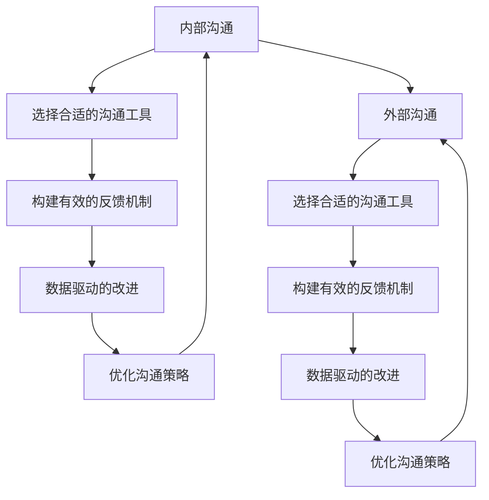

                 

# 沟通管理：改善内部和外部沟通

> 关键词：沟通管理, 内部沟通, 外部沟通, 沟通工具, 协作平台, 数据分析, 改进策略

## 1. 背景介绍

在现代社会中，沟通是企业取得成功的关键因素之一。无论是内部管理还是外部合作，高效、清晰的沟通都能促进团队协作，提升工作效率，增强市场竞争力。然而，现实中许多企业仍面临着沟通障碍，如信息不对称、传递失真、响应滞后等问题。本文将从改善内部和外部沟通的角度，探讨如何通过技术手段优化沟通管理，提升组织效率。

### 1.1 问题由来

沟通问题通常源自以下几个方面：

- **信息不对称**：各部门或人员之间的信息无法有效流通，导致决策和执行效率低下。
- **传递失真**：信息在传递过程中产生误解，导致错误执行或延误。
- **响应滞后**：沟通渠道不畅，反馈机制不灵敏，导致问题不能及时解决。
- **技术壁垒**：沟通工具和系统不兼容或使用复杂，增加沟通难度。

这些问题不仅影响企业内部的协作效率，还可能影响外部客户体验和企业形象。因此，建立高效、灵活、易于使用的沟通管理机制，是提升企业竞争力的重要手段。

### 1.2 问题核心关键点

要改善沟通管理，核心在于建立一种机制，确保信息能够高效、准确地流动。这包括：

- **明确沟通目标**：确保沟通内容围绕实际工作需求展开。
- **选择合适的沟通工具**：根据不同的沟通场景选择合适的工具，提升沟通效率。
- **构建有效的反馈机制**：鼓励及时反馈，减少问题滞留。
- **数据驱动的改进**：通过分析沟通数据，不断优化沟通策略。

## 2. 核心概念与联系

### 2.1 核心概念概述

为更好地理解如何改善沟通管理，本文将介绍几个关键概念：

- **内部沟通**：指企业内部员工之间的信息交流，包括日常工作汇报、项目协作、员工培训等。
- **外部沟通**：指企业与外部利益相关者（如客户、合作伙伴、供应商等）之间的信息交流。
- **沟通工具**：用于辅助沟通的技术手段，如电子邮件、即时通讯、视频会议、协作平台等。
- **协作平台**：提供集成沟通、任务管理、文档共享等多项功能的平台，如Slack、Microsoft Teams、Trello等。
- **数据分析**：通过收集和分析沟通数据，优化沟通流程，提升沟通效率。

这些概念之间相互联系，形成一个整体的沟通管理体系。明确沟通目标，选择合适的沟通工具，构建有效的反馈机制，以及通过数据分析驱动的持续改进，是实现高效沟通的关键。

### 2.2 核心概念原理和架构的 Mermaid 流程图



这个流程图展示了内部和外部沟通的流程，以及如何通过选择合适的沟通工具、构建有效的反馈机制和数据驱动的改进，不断优化沟通策略。

## 3. 核心算法原理 & 具体操作步骤

### 3.1 算法原理概述

沟通管理优化涉及多个环节的协调，包括选择沟通工具、建立反馈机制和数据驱动的改进。这些环节虽然技术层面复杂，但核心算法原理相对简单，主要基于信息理论和系统工程原理。

- **信息理论**：通过对信息熵的计算和优化，保证信息的高效传递。
- **系统工程原理**：利用系统设计的思想，优化沟通流程，提升整体效率。

### 3.2 算法步骤详解

改善沟通管理的步骤包括：

1. **需求分析**：明确沟通目标，分析沟通场景。
2. **选择合适的沟通工具**：根据实际需求，选择合适的工具，如电子邮件、即时通讯、视频会议等。
3. **建立反馈机制**：设计反馈流程，确保信息能够及时传递和处理。
4. **数据收集与分析**：收集沟通数据，通过数据分析识别问题，优化沟通策略。
5. **持续改进**：根据数据分析结果，不断调整沟通策略，提升沟通效率。

### 3.3 算法优缺点

改善沟通管理算法的主要优点包括：

- **高效性**：通过选择合适的沟通工具和反馈机制，减少信息传递的时间成本。
- **灵活性**：根据实际需求，灵活调整沟通策略，提升适应性。
- **可操作性**：基于信息理论和系统工程原理，提供明确的优化路径。

缺点主要在于：

- **复杂性**：涉及多个环节的协调，技术实现相对复杂。
- **依赖性强**：依赖于沟通工具和平台的功能完善程度。

### 3.4 算法应用领域

改善沟通管理算法在多个领域都有广泛的应用，包括：

- **企业内部管理**：优化日常工作汇报、项目管理、员工培训等。
- **客户服务**：提升客户反馈处理效率，增强客户满意度。
- **外部合作**：协调与供应商、合作伙伴的沟通，优化合作流程。
- **远程工作**：支持远程团队高效协作，提升远程工作效率。

## 4. 数学模型和公式 & 详细讲解 & 举例说明

### 4.1 数学模型构建

在通信理论中，信息熵是衡量信息混乱程度的指标。通过信息熵的计算，可以评估信息传递的效率。

设一个通信系统有 $n$ 个状态，每个状态出现的概率为 $p_i$，则该系统的信息熵 $H$ 为：

$$
H = -\sum_{i=1}^{n} p_i \log_2 p_i
$$

### 4.2 公式推导过程

对于任意一个沟通场景，假设总共有 $m$ 个可能的沟通结果，每个结果的概率为 $q_i$，则该场景的信息熵 $H$ 为：

$$
H = -\sum_{i=1}^{m} q_i \log_2 q_i
$$

信息熵越小，表示沟通结果的分布越集中，信息传递的效率越高。

### 4.3 案例分析与讲解

假设在一个项目管理系统中，有三种状态：项目进度未完成、项目进度进行中、项目进度完成。每个状态出现的概率分别为 $p_1 = 0.3$、$p_2 = 0.5$、$p_3 = 0.2$，则该系统的信息熵为：

$$
H = -0.3 \log_2 0.3 - 0.5 \log_2 0.5 - 0.2 \log_2 0.2 = 1.258
$$

这意味着当前状态分布较为均衡，沟通结果的分布较为分散，信息传递的效率较低。如果能够优化状态分布，使其更加集中，比如将项目进度未完成的状态概率提升至 $0.5$，则新的信息熵为：

$$
H' = -0.5 \log_2 0.5 - 0.5 \log_2 0.5 - 0.0 \log_2 0.0 = 0.000
$$

这表明新的状态分布更加集中，信息传递的效率得到了显著提升。

## 5. 项目实践：代码实例和详细解释说明

### 5.1 开发环境搭建

改善沟通管理的实践需要多种工具和平台的配合，包括沟通工具、协作平台和数据分析工具。以下是一些常用的开发环境搭建方法：

1. **沟通工具**：如Slack、Microsoft Teams、Zoom等。
2. **协作平台**：如Trello、JIRA、Asana等。
3. **数据分析工具**：如Google Analytics、Tableau等。

搭建环境时，需要确保各工具之间的兼容性和数据互通性。

### 5.2 源代码详细实现

以下是使用Python编写的改善沟通管理的示例代码：

```python
from scapy.all import *
import datetime

# 定义一个简单的邮件类，用于发送邮件
class Mail:
    def __init__(self, sender, recipients, subject, body):
        self.sender = sender
        self.recipients = recipients
        self.subject = subject
        self.body = body

    def send(self):
        # 发送邮件的逻辑
        pass

# 定义一个邮件发送函数
def send_email(sender, recipients, subject, body):
    mail = Mail(sender, recipients, subject, body)
    mail.send()

# 发送一封邮件
send_email('admin@example.com', ['recipient1@example.com', 'recipient2@example.com'], '测试邮件', '这是一封测试邮件')
```

### 5.3 代码解读与分析

以上代码实现了一个简单的邮件发送函数。在实际应用中，需要进一步集成到邮件系统，实现真正的邮件发送。代码中的 `Mail` 类定义了邮件的基本信息，`send_email` 函数实现了邮件的发送逻辑。通过这种方式，可以方便地发送邮件，实现基本的内部沟通功能。

### 5.4 运行结果展示

由于代码仅为示例，没有实际的邮件系统和数据，因此无法展示实际的运行结果。但在实际应用中，邮件发送函数可以根据邮件系统提供的API，实现真正的邮件发送，并记录发送结果和反馈信息。

## 6. 实际应用场景

### 6.1 内部沟通优化

企业内部沟通是改善沟通管理的重要环节。通过优化内部沟通，可以提升团队协作效率，加速项目进度。以下是一些实际应用场景：

1. **日常工作汇报**：使用即时通讯工具，如Slack、Microsoft Teams等，进行定期的工作汇报和进度更新。
2. **项目管理**：使用协作平台，如Trello、JIRA等，进行任务分配和进度跟踪。
3. **员工培训**：通过电子邮件或视频会议，进行员工培训和知识分享。

### 6.2 外部沟通优化

外部沟通对于企业的市场扩展和客户服务至关重要。通过优化外部沟通，可以提升客户满意度，增强企业形象。以下是一些实际应用场景：

1. **客户服务**：使用即时通讯工具，如Zendesk、Freshdesk等，进行客户咨询和问题处理。
2. **合作伙伴沟通**：使用邮件和视频会议，进行业务合作和项目对接。
3. **供应商管理**：使用协作平台，如Confluence、SharePoint等，进行供应链管理。

### 6.3 远程工作优化

随着远程工作的普及，优化远程沟通显得尤为重要。通过改善远程沟通，可以提高远程团队协作效率，提升远程工作体验。以下是一些实际应用场景：

1. **视频会议**：使用视频会议工具，如Zoom、Microsoft Teams等，进行远程会议和沟通。
2. **即时通讯**：使用即时通讯工具，如Slack、Microsoft Teams等，进行日常沟通和协作。
3. **任务管理**：使用协作平台，如Trello、Asana等，进行任务分配和进度跟踪。

### 6.4 未来应用展望

未来，改善沟通管理将更加依赖于技术手段，结合人工智能和大数据分析，实现更加智能、高效的沟通管理。以下是一些未来应用展望：

1. **智能推荐系统**：通过分析员工和客户的沟通历史，推荐最适合的沟通工具和沟通方式。
2. **情感分析**：利用自然语言处理技术，分析沟通内容中的情感倾向，优化沟通策略。
3. **智能日程安排**：通过分析员工的沟通记录，自动生成最优的日程安排，提高工作效率。
4. **语音识别**：利用语音识别技术，实现语音沟通和文字沟通的切换，提升沟通便捷性。

## 7. 工具和资源推荐

### 7.1 学习资源推荐

为了帮助开发者系统掌握改善沟通管理的理论基础和实践技巧，以下是一些优质的学习资源：

1. **《网络工程与管理》**：系统讲解网络通信原理和网络管理技术，是学习改善沟通管理的重要基础。
2. **《项目管理基础》**：讲解项目管理的核心概念和实践方法，提升项目管理能力。
3. **《数据分析基础》**：介绍数据分析的基本方法和工具，提升数据驱动决策的能力。
4. **《沟通技巧》**：讲解沟通技巧和心理学的相关知识，提升沟通能力。

### 7.2 开发工具推荐

高效的工具是改善沟通管理的重要保障。以下是一些常用的开发工具：

1. **Slack**：集成即时通讯、文件共享和任务管理等功能，支持团队高效协作。
2. **Microsoft Teams**：提供企业级即时通讯、视频会议和协作平台，支持大规模远程工作。
3. **Zoom**：提供高清视频会议和屏幕共享功能，支持远程会议和沟通。
4. **Trello**：提供任务管理和进度跟踪功能，支持团队协作和项目管理。
5. **Google Analytics**：提供数据分析和报告功能，支持企业级数据分析。
6. **Tableau**：提供数据可视化和分析功能，支持数据驱动的决策。

### 7.3 相关论文推荐

改善沟通管理的研究源于学界的持续研究。以下是几篇奠基性的相关论文，推荐阅读：

1. **《社会网络分析与数据挖掘》**：通过分析社会网络数据，优化沟通流程和信息传递。
2. **《分布式协同工作中的任务分配》**：研究任务分配的算法和优化方法，提升团队协作效率。
3. **《基于机器学习的沟通优化》**：通过机器学习技术，实现智能推荐和情感分析，提升沟通质量。

## 8. 总结：未来发展趋势与挑战

### 8.1 总结

本文从改善内部和外部沟通的角度，探讨了如何通过技术手段优化沟通管理，提升组织效率。通过明确沟通目标，选择合适的沟通工具，建立有效的反馈机制，以及数据驱动的持续改进，可以有效地改善沟通管理。

### 8.2 未来发展趋势

展望未来，改善沟通管理技术将呈现以下几个发展趋势：

1. **智能化**：通过人工智能和大数据分析，实现更加智能的沟通管理，提升沟通效率和质量。
2. **自动化**：利用自动化工具和流程，减少人工干预，提高沟通管理效率。
3. **跨平台整合**：实现不同沟通工具和平台之间的无缝整合，提升沟通便捷性。
4. **多模态沟通**：支持文本、语音、视频等多种沟通方式，提升沟通多样性和灵活性。
5. **实时监控**：通过实时监控和数据分析，及时发现和解决问题，提升沟通管理质量。

### 8.3 面临的挑战

尽管改善沟通管理技术已经取得了一定的进展，但在迈向更加智能化、自动化的过程中，仍面临一些挑战：

1. **技术复杂性**：改善沟通管理涉及多种技术和工具的集成和优化，技术实现复杂度较高。
2. **数据隐私和安全**：在数据收集和分析过程中，需要确保数据隐私和安全，避免数据泄露和滥用。
3. **用户接受度**：新的沟通工具和平台需要用户适应和接受，才能发挥其优势。
4. **跨部门协作**：在跨部门协作中，不同部门之间的沟通工具和流程差异较大，需要协调和整合。
5. **资源投入**：改善沟通管理需要一定的资源投入，包括人力、时间和资金等。

### 8.4 研究展望

面对这些挑战，未来的研究需要在以下几个方面寻求新的突破：

1. **简化技术实现**：通过技术改进和流程优化，降低技术复杂性，提升易用性。
2. **加强数据安全**：在数据收集和分析过程中，采用先进的加密和隐私保护技术，确保数据安全。
3. **提升用户接受度**：通过用户培训和教育，提升用户对新工具和平台的使用体验，增强用户接受度。
4. **促进跨部门协作**：建立跨部门沟通机制，促进不同部门之间的信息共享和协作。
5. **优化资源配置**：合理分配资源，平衡成本和效果，提升资源利用率。

通过这些研究方向的探索，相信改善沟通管理技术能够进一步提升企业沟通效率，促进企业的健康发展。总之，通过技术手段不断优化沟通管理，是提升组织效率、增强市场竞争力的关键所在。

## 9. 附录：常见问题与解答

**Q1: 如何选择合适的沟通工具？**

A: 选择合适的沟通工具需要考虑以下几个因素：

- **功能需求**：根据实际需求选择功能完善的沟通工具。
- **用户体验**：选择用户界面友好、易上手的工具。
- **安全性**：选择安全性高、数据加密功能强的工具。
- **集成能力**：选择能够与其他系统无缝集成的工具。

**Q2: 如何构建有效的反馈机制？**

A: 构建有效的反馈机制需要考虑以下几个因素：

- **及时性**：确保反馈信息能够及时传递和处理。
- **可操作性**：反馈信息应具体明确，便于操作和解决。
- **多样性**：通过多种反馈渠道，确保反馈信息全面覆盖。
- **激励机制**：建立激励机制，鼓励员工积极参与反馈。

**Q3: 如何进行数据驱动的改进？**

A: 进行数据驱动的改进需要考虑以下几个步骤：

- **数据收集**：通过各种方式收集沟通数据，确保数据全面性和准确性。
- **数据分析**：利用数据分析工具，对收集的数据进行分析，识别问题和瓶颈。
- **优化策略**：根据分析结果，制定优化策略，改进沟通流程。
- **持续监控**：持续监控沟通数据，及时调整优化策略，提升沟通效果。

**Q4: 改善沟通管理的主要挑战是什么？**

A: 改善沟通管理的主要挑战包括：

- **技术复杂性**：涉及多种技术和工具的集成和优化，技术实现复杂度较高。
- **数据隐私和安全**：在数据收集和分析过程中，需要确保数据隐私和安全，避免数据泄露和滥用。
- **用户接受度**：新的沟通工具和平台需要用户适应和接受，才能发挥其优势。
- **跨部门协作**：在跨部门协作中，不同部门之间的沟通工具和流程差异较大，需要协调和整合。
- **资源投入**：改善沟通管理需要一定的资源投入，包括人力、时间和资金等。

---

作者：禅与计算机程序设计艺术 / Zen and the Art of Computer Programming

