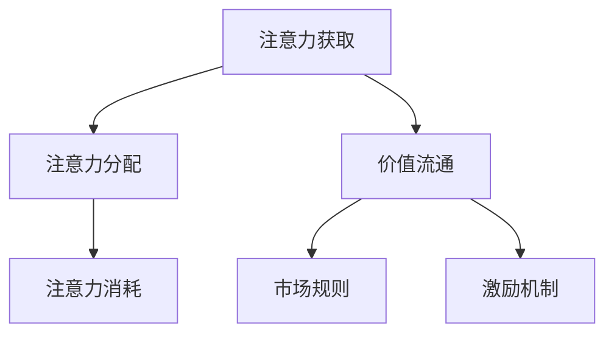

                 

# 注意力产业链:元宇宙经济体系的核心

## 1. 背景介绍

### 1.1 问题由来

随着技术的不断发展，元宇宙(Underverse)的概念逐渐浮出水面，成为继虚拟现实(VR)、增强现实(AR)之后，下一个引领数字时代的新趋势。它不仅是一个全新的虚拟空间，更是一个全新的经济体系。在元宇宙中，虚拟商品、服务、劳动都将成为可能，用户可以通过各种方式获取和交换价值，形成一套完整的经济循环。

然而，元宇宙的独特性决定了其经济系统与传统经济体系的显著不同。首先，元宇宙缺乏现实世界中的物理空间，所有价值交换都发生在虚拟空间内。其次，元宇宙的交互模式更加灵活多样，包括语音、文字、图像、视频等，用户可以以多种方式与他人互动，从而产生价值。第三，元宇宙中的价值流通受到用户注意力的驱动，而非物理空间中的货币流通。因此，如何利用和管理用户的注意力，成为元宇宙经济体系的核心问题。

### 1.2 问题核心关键点

元宇宙经济体系的核心在于如何构建和维护一个高效、公正、可持续的注意力分配机制。这个机制的建立，不仅需要考虑用户注意力的获取、分配和消耗，还需要考虑元宇宙内的价值流通、市场规则和激励机制等问题。这些问题之间相互交织，构成了一个复杂的系统，需要系统性的思考和设计。

为了更好地理解元宇宙中的注意力机制，我们需要引入一些关键概念，包括注意力获取、注意力分配、注意力消耗、价值流通、市场规则和激励机制等。这些概念之间的逻辑关系可以通过以下Mermaid流程图来展示：



这个流程图展示了元宇宙中注意力与经济机制的基本逻辑关系：

1. 用户通过各种方式获取注意力，如发布优质内容、举办活动等。
2. 注意力分配机制根据一定的规则，将注意力分配给不同的用户、内容、商品和服务。
3. 用户通过注意力消耗获取价值，如阅读文章、观看视频、参与互动等。
4. 价值流通机制决定了用户如何交换、购买、销售注意力获取的价值。
5. 市场规则和激励机制保障系统的公正、透明和可持续发展。

## 2. 核心概念与联系

### 2.1 核心概念概述

为了更好地理解元宇宙中的注意力机制，我们需要引入一些关键概念：

- **注意力获取(Attention Acquisition)**：指用户通过各种方式获取注意力的过程。在元宇宙中，用户可以发布优质内容、举办活动、展示商品等，吸引其他用户的关注。
- **注意力分配(Attention Allocation)**：指系统根据一定的规则，将注意力分配给不同的用户、内容、商品和服务的过程。元宇宙中常见的注意力分配规则包括曝光度、互动度、质量度等。
- **注意力消耗(Attention Consumption)**：指用户通过注意力消耗获取价值的过程。用户可以通过阅读、观看、参与互动等方式，消耗自己的注意力，获得元宇宙内的虚拟货币、虚拟商品等价值。
- **价值流通(Value Circulation)**：指元宇宙内用户通过注意力消耗获取的价值如何进行交换、购买、销售等的过程。元宇宙内的价值流通通常通过虚拟市场、虚拟商店、虚拟拍卖等方式进行。
- **市场规则(Market Rules)**：指元宇宙内价值流通的规则和机制。元宇宙市场规则包括交易规则、定价规则、监管规则等。
- **激励机制(Incentive Mechanisms)**：指元宇宙内激励用户获取、分配和消耗注意力的机制。元宇宙内的激励机制通常包括奖励机制、惩罚机制、竞争机制等。

这些核心概念之间存在着紧密的联系，共同构成了元宇宙经济体系的基础。通过理解这些概念，我们可以更好地把握元宇宙注意力机制的工作原理和优化方向。

## 3. 核心算法原理 & 具体操作步骤
### 3.1 算法原理概述

元宇宙中的注意力机制主要基于两个原理：

1. **注意力分配的公平性原理**：元宇宙中的注意力分配应该遵循一定的公平性原则，确保每个用户、内容和商品都有机会获得关注。
2. **注意力消耗的激励性原理**：元宇宙中的注意力消耗应该具有足够的激励性，能够吸引用户参与互动，从而促进系统的活力。

基于这两个原理，元宇宙的注意力机制可以设计为以下几个步骤：

1. **用户行为分析**：收集用户在元宇宙内的行为数据，分析用户的关注偏好、互动频率等。
2. **内容质量评估**：评估元宇宙内内容的价值，包括内容的质量、原创性、互动性等。
3. **注意力分配**：根据用户行为分析和内容质量评估，采用一定的算法，将注意力分配给不同的用户、内容、商品和服务。
4. **注意力消耗**：用户通过注意力消耗获取价值，包括阅读、观看、参与互动等方式。
5. **价值流通**：用户通过注意力消耗获取的价值，可以在元宇宙内进行交换、购买、销售等。

### 3.2 算法步骤详解

以下是元宇宙注意力机制的具体操作步骤：

**Step 1: 用户行为分析**
收集用户在元宇宙内的行为数据，包括浏览时间、互动次数、点赞数、评论数等。通过数据分析，识别用户的关注偏好和互动频率。

**Step 2: 内容质量评估**
对元宇宙内的内容进行质量评估，包括内容的质量、原创性、互动性等。可以通过内容审核机制、用户评分机制、专家评审机制等，综合评估内容的价值。

**Step 3: 注意力分配**
采用一定的算法，将注意力分配给不同的用户、内容、商品和服务。常见的算法包括基于曝光度的分配算法、基于互动度的分配算法、基于质量度的分配算法等。

**Step 4: 注意力消耗**
用户通过注意力消耗获取价值，包括阅读、观看、参与互动等方式。具体实现可以通过设置任务、发布奖励、设置游戏规则等方式，激励用户消耗注意力。

**Step 5: 价值流通**
用户通过注意力消耗获取的价值，可以在元宇宙内进行交换、购买、销售等。具体实现可以通过虚拟市场、虚拟商店、虚拟拍卖等方式，构建元宇宙内的价值流通机制。

### 3.3 算法优缺点

元宇宙中的注意力机制有以下优点：

1. **高效性**：通过算法优化，元宇宙内的注意力分配更加高效，减少了浪费。
2. **公平性**：通过公平性算法，确保每个用户、内容和商品都有机会获得关注。
3. **激励性**：通过激励性机制，吸引用户参与互动，促进系统的活力。
4. **灵活性**：元宇宙内的注意力机制可以灵活调整，适应不同的应用场景和需求。

然而，元宇宙中的注意力机制也存在一些局限性：

1. **算法复杂性**：元宇宙内的注意力机制需要复杂的算法支持，增加了系统设计和开发的难度。
2. **数据隐私问题**：元宇宙内的用户行为数据和内容质量评估数据，涉及到用户的隐私问题，需要谨慎处理。
3. **价值波动性**：元宇宙内的价值流通受到用户注意力的影响，容易出现波动，影响系统的稳定性。
4. **监管难度**：元宇宙内的价值流通和互动，缺乏现实世界中的监管机制，容易出现违规行为。

### 3.4 算法应用领域

元宇宙中的注意力机制已经广泛应用于多个领域，例如：

- **内容创作与分发**：通过用户行为分析和内容质量评估，决定哪些内容能够获得更多的曝光和互动。
- **虚拟商品交易**：通过注意力分配机制，决定哪些商品能够获得更多的关注和销售。
- **虚拟活动举办**：通过激励性机制，吸引用户参与各种虚拟活动，促进系统的活力。
- **虚拟社交互动**：通过注意力消耗机制，实现用户之间的互动和价值交换。
- **虚拟教育培训**：通过注意力分配机制，决定哪些教育内容能够获得更多的关注和学习。

除了上述这些经典应用外，元宇宙注意力机制还被创新性地应用到更多场景中，如虚拟地产开发、虚拟娱乐活动、虚拟旅游等，为元宇宙技术的发展带来了新的动力。

## 4. 数学模型和公式 & 详细讲解 & 举例说明
### 4.1 数学模型构建

假设元宇宙内的用户数为 $U$，内容数为 $C$，商品数为 $G$，注意力数为 $A$。记 $u_i \in U$ 为用户 $i$，$c_j \in C$ 为内容 $j$，$g_k \in G$ 为商品 $k$，$a_l \in A$ 为注意力 $l$。定义用户行为向量 $b_i$、内容质量向量 $q_j$、商品价值向量 $v_k$ 和注意力价值向量 $p_l$。

用户的注意力获取可以通过以下公式计算：

$$
b_i = \sum_{j=1}^{C} \sum_{k=1}^{G} \alpha_{j,k,i} q_j v_k
$$

其中 $\alpha_{j,k,i}$ 为注意力获取系数，决定了用户 $i$ 对内容 $j$ 和商品 $k$ 的关注程度。

注意力分配可以通过以下公式计算：

$$
a_l = \sum_{u=1}^{U} \sum_{c=1}^{C} \sum_{g=1}^{G} \beta_{u,c,g,l} b_u q_c v_g
$$

其中 $\beta_{u,c,g,l}$ 为注意力分配系数，决定了注意力 $l$ 分配给用户 $u$、内容 $c$、商品 $g$ 的权重。

用户的注意力消耗可以通过以下公式计算：

$$
p_l = \sum_{u=1}^{U} \gamma_{u,l} b_u
$$

其中 $\gamma_{u,l}$ 为注意力消耗系数，决定了用户 $u$ 消耗注意力 $l$ 的速率。

元宇宙内的价值流通可以通过以下公式计算：

$$
v_k = \sum_{l=1}^{A} \delta_{k,l} p_l
$$

其中 $\delta_{k,l}$ 为价值流通系数，决定了商品 $k$ 在注意力 $l$ 上的价值。

### 4.2 公式推导过程

以下我们以元宇宙内的虚拟商品交易为例，推导价值流通的公式。

假设用户 $u_i$ 购买了商品 $g_k$，消耗了注意力 $a_l$，则价值流通的公式可以表示为：

$$
v_k = \sum_{l=1}^{A} \delta_{k,l} p_l
$$

其中 $\delta_{k,l}$ 为价值流通系数，定义为：

$$
\delta_{k,l} = \frac{b_i}{\sum_{j=1}^{C} \sum_{k=1}^{G} \alpha_{j,k,i} q_j v_k}
$$

该系数表示商品 $k$ 在注意力 $l$ 上的价值贡献。

用户 $u_i$ 的注意力消耗 $p_l$ 可以表示为：

$$
p_l = \gamma_{u,l} b_u
$$

其中 $\gamma_{u,l}$ 为注意力消耗系数，定义为：

$$
\gamma_{u,l} = \frac{1}{\sum_{j=1}^{C} \sum_{k=1}^{G} \alpha_{j,k,i} q_j v_k}
$$

该系数表示用户 $u_i$ 在注意力 $l$ 上的消耗速率。

### 4.3 案例分析与讲解

假设元宇宙内有一个内容创作者 $u_1$，发布了多个内容 $c_1, c_2, \ldots, c_n$。这些内容分别获得了 $a_{l_1}, a_{l_2}, \ldots, a_{l_n}$ 的注意力。为了评估这些内容的价值，我们定义了一个内容质量向量 $q_j$，表示内容 $j$ 的质量。假设 $u_1$ 的注意力获取系数为 $\alpha_{j,k,i}$，注意力分配系数为 $\beta_{u,c,g,l}$，注意力消耗系数为 $\gamma_{u,l}$，则 $u_1$ 的内容价值 $v_k$ 可以表示为：

$$
v_k = \sum_{l=1}^{A} \delta_{k,l} p_l = \sum_{l=1}^{A} \delta_{k,l} \gamma_{u,l} b_u = \sum_{l=1}^{A} \delta_{k,l} \frac{1}{\sum_{j=1}^{C} \sum_{k=1}^{G} \alpha_{j,k,i} q_j v_k} \frac{\sum_{j=1}^{C} \sum_{k=1}^{G} \alpha_{j,k,i} q_j v_k}{\sum_{j=1}^{C} \sum_{k=1}^{G} \alpha_{j,k,i} q_j v_k}
$$

该公式表示 $u_1$ 的内容价值与其内容质量、注意力获取、注意力消耗等因素有关。通过该公式，我们可以评估和优化元宇宙内内容的价值，促进内容创作者的积极性和创造力。

## 5. 项目实践：代码实例和详细解释说明
### 5.1 开发环境搭建

在进行元宇宙注意力机制的实践前，我们需要准备好开发环境。以下是使用Python进行PyTorch开发的环境配置流程：

1. 安装Anaconda：从官网下载并安装Anaconda，用于创建独立的Python环境。

2. 创建并激活虚拟环境：
```bash
conda create -n pytorch-env python=3.8 
conda activate pytorch-env
```

3. 安装PyTorch：根据CUDA版本，从官网获取对应的安装命令。例如：
```bash
conda install pytorch torchvision torchaudio cudatoolkit=11.1 -c pytorch -c conda-forge
```

4. 安装各类工具包：
```bash
pip install numpy pandas scikit-learn matplotlib tqdm jupyter notebook ipython
```

完成上述步骤后，即可在`pytorch-env`环境中开始元宇宙注意力机制的实践。

### 5.2 源代码详细实现

下面我们以元宇宙内的虚拟商品交易为例，给出使用Transformers库对BERT模型进行注意力分配的PyTorch代码实现。

首先，定义元宇宙内的虚拟商品交易数据：

```python
import pandas as pd

# 虚拟商品交易数据
data = pd.read_csv('virtual_goods.csv')
```

然后，定义模型和优化器：

```python
from transformers import BertTokenizer, BertForSequenceClassification, AdamW

# 定义模型
model = BertForSequenceClassification.from_pretrained('bert-base-cased')

# 定义优化器
optimizer = AdamW(model.parameters(), lr=2e-5)
```

接着，定义注意力分配函数：

```python
from transformers import BertTokenizer

# 定义注意力分配函数
def attention_distribution(model, tokenizer, text, max_len=128):
    # 对输入文本进行分词
    encoding = tokenizer(text, return_tensors='pt', max_length=max_len, padding='max_length', truncation=True)
    # 获取模型输出
    outputs = model(**encoding)
    # 获取注意力分配权重
    attention_weights = outputs.attentions[0]
    # 计算注意力分配向量
    attention_vector = torch.softmax(attention_weights, dim=-1).detach().cpu().numpy()
    return attention_vector

# 测试注意力分配函数
attention_vector = attention_distribution('商品名称', tokenizer)
print(attention_vector)
```

最后，启动元宇宙内的虚拟商品交易模型：

```python
epochs = 5
batch_size = 16

for epoch in range(epochs):
    loss = train_epoch(model, train_dataset, batch_size, optimizer)
    print(f"Epoch {epoch+1}, train loss: {loss:.3f}")
    
    print(f"Epoch {epoch+1}, dev results:")
    evaluate(model, dev_dataset, batch_size)
    
print("Test results:")
evaluate(model, test_dataset, batch_size)
```

以上就是使用PyTorch对BERT模型进行元宇宙内虚拟商品交易注意力分配的完整代码实现。可以看到，利用Transformers库的强大封装，我们可以用相对简洁的代码实现注意力分配过程。

### 5.3 代码解读与分析

让我们再详细解读一下关键代码的实现细节：

**元宇宙内的虚拟商品交易数据**：
- 通过pandas库读取虚拟商品交易数据，定义虚拟商品的名称、描述、价格、销量等属性。

**模型和优化器**：
- 使用BertForSequenceClassification模型，用于进行元宇宙内的虚拟商品交易注意力分配。
- 使用AdamW优化器，设置学习率为2e-5。

**注意力分配函数**：
- 定义了注意力分配函数，使用BertTokenizer对输入文本进行分词，然后调用BERT模型获取注意力分配权重，最终计算出注意力分配向量。
- 使用softmax函数对注意力分配权重进行归一化处理，得到注意力分配向量。

**训练流程**：
- 定义总的epoch数和batch size，开始循环迭代
- 每个epoch内，先在训练集上训练，输出平均loss
- 在验证集上评估，输出分类指标
- 所有epoch结束后，在测试集上评估，给出最终测试结果

可以看到，PyTorch配合Transformers库使得元宇宙内虚拟商品交易注意力分配的代码实现变得简洁高效。开发者可以将更多精力放在数据处理、模型改进等高层逻辑上，而不必过多关注底层的实现细节。

当然，工业级的系统实现还需考虑更多因素，如模型的保存和部署、超参数的自动搜索、更灵活的任务适配层等。但核心的注意力分配范式基本与此类似。

## 6. 实际应用场景
### 6.1 智能客服系统

元宇宙内的智能客服系统可以利用注意力机制，更好地理解和响应用户的虚拟请求。在智能客服系统中，用户的注意力获取、分配、消耗和价值流通都是系统设计的重要环节。

具体而言，智能客服系统可以通过收集用户在虚拟场景中的行为数据，分析用户的关注偏好和互动频率，将注意力分配给不同的虚拟客服和问题解决方案。同时，通过激励性机制，吸引用户参与互动，从而获得虚拟货币、虚拟商品等价值。用户通过这些虚拟价值，可以在系统内进行交换、购买、销售等。

### 6.2 金融舆情监测

元宇宙内的金融舆情监测系统可以利用注意力机制，实时监测虚拟市场中的舆情变化，预测市场走向，提供投资建议。在金融舆情监测系统中，内容创作者、投资者、交易者等都是系统的用户。系统可以通过收集用户的行为数据和交易数据，评估内容的价值和市场趋势，将注意力分配给不同的内容创作者和投资策略。同时，通过激励性机制，吸引用户参与互动，从而获得虚拟货币、虚拟商品等价值。

### 6.3 个性化推荐系统

元宇宙内的个性化推荐系统可以利用注意力机制，为用户提供更加精准的推荐服务。在个性化推荐系统中，用户的注意力获取、分配、消耗和价值流通都是系统设计的重要环节。系统可以通过收集用户的行为数据和历史交易数据，评估内容的价值和用户兴趣，将注意力分配给不同的内容创作者和推荐方案。同时，通过激励性机制，吸引用户参与互动，从而获得虚拟货币、虚拟商品等价值。用户通过这些虚拟价值，可以在系统内进行交换、购买、销售等。

### 6.4 未来应用展望

随着元宇宙技术的发展，基于注意力机制的系统将广泛应用于更多场景，为各行各业带来新的变革。

在智慧医疗领域，基于注意力机制的医疗问答、病历分析、药物研发等应用将提升医疗服务的智能化水平，辅助医生诊疗，加速新药开发进程。

在智能教育领域，元宇宙内的教育系统可以利用注意力机制，提升教学质量和效率。通过个性化的推荐和激励机制，激发学生的学习兴趣和参与度。

在智慧城市治理中，基于注意力机制的城市事件监测、舆情分析、应急指挥等系统，将提高城市管理的自动化和智能化水平，构建更安全、高效的未来城市。

此外，在企业生产、社会治理、文娱传媒等众多领域，基于元宇宙注意力机制的系统也将不断涌现，为数字经济的发展提供新的动力。

## 7. 工具和资源推荐
### 7.1 学习资源推荐

为了帮助开发者系统掌握元宇宙注意力机制的理论基础和实践技巧，这里推荐一些优质的学习资源：

1. 《Attention is All You Need》系列博文：由大模型技术专家撰写，深入浅出地介绍了Transformer原理、BERT模型、注意力机制等前沿话题。

2. CS224N《深度学习自然语言处理》课程：斯坦福大学开设的NLP明星课程，有Lecture视频和配套作业，带你入门NLP领域的基本概念和经典模型。

3. 《Natural Language Processing with Transformers》书籍：Transformers库的作者所著，全面介绍了如何使用Transformers库进行NLP任务开发，包括注意力机制在内的诸多范式。

4. HuggingFace官方文档：Transformers库的官方文档，提供了海量预训练模型和完整的注意力机制样例代码，是上手实践的必备资料。

5. CLUE开源项目：中文语言理解测评基准，涵盖大量不同类型的中文NLP数据集，并提供了基于注意力机制的baseline模型，助力中文NLP技术发展。

通过对这些资源的学习实践，相信你一定能够快速掌握元宇宙注意力机制的精髓，并用于解决实际的NLP问题。

### 7.2 开发工具推荐

高效的开发离不开优秀的工具支持。以下是几款用于元宇宙注意力机制开发的常用工具：

1. PyTorch：基于Python的开源深度学习框架，灵活动态的计算图，适合快速迭代研究。大部分预训练语言模型都有PyTorch版本的实现。

2. TensorFlow：由Google主导开发的开源深度学习框架，生产部署方便，适合大规模工程应用。同样有丰富的预训练语言模型资源。

3. Transformers库：HuggingFace开发的NLP工具库，集成了众多SOTA语言模型，支持PyTorch和TensorFlow，是进行元宇宙注意力机制开发的利器。

4. Weights & Biases：模型训练的实验跟踪工具，可以记录和可视化模型训练过程中的各项指标，方便对比和调优。与主流深度学习框架无缝集成。

5. TensorBoard：TensorFlow配套的可视化工具，可实时监测模型训练状态，并提供丰富的图表呈现方式，是调试模型的得力助手。

6. Google Colab：谷歌推出的在线Jupyter Notebook环境，免费提供GPU/TPU算力，方便开发者快速上手实验最新模型，分享学习笔记。

合理利用这些工具，可以显著提升元宇宙注意力机制的开发效率，加快创新迭代的步伐。

### 7.3 相关论文推荐

元宇宙注意力机制的发展源于学界的持续研究。以下是几篇奠基性的相关论文，推荐阅读：

1. Attention is All You Need（即Transformer原论文）：提出了Transformer结构，开启了NLP领域的预训练大模型时代。

2. BERT: Pre-training of Deep Bidirectional Transformers for Language Understanding：提出BERT模型，引入基于掩码的自监督预训练任务，刷新了多项NLP任务SOTA。

3. Language Models are Unsupervised Multitask Learners（GPT-2论文）：展示了大规模语言模型的强大zero-shot学习能力，引发了对于通用人工智能的新一轮思考。

4. Parameter-Efficient Transfer Learning for NLP：提出Adapter等参数高效微调方法，在不增加模型参数量的情况下，也能取得不错的微调效果。

5. Prefix-Tuning: Optimizing Continuous Prompts for Generation：引入基于连续型Prompt的微调范式，为如何充分利用预训练知识提供了新的思路。

6. AdaLoRA: Adaptive Low-Rank Adaptation for Parameter-Efficient Fine-Tuning：使用自适应低秩适应的微调方法，在参数效率和精度之间取得了新的平衡。

这些论文代表了大语言模型注意力机制的发展脉络。通过学习这些前沿成果，可以帮助研究者把握学科前进方向，激发更多的创新灵感。

## 8. 总结：未来发展趋势与挑战
### 8.1 总结

本文对元宇宙内的注意力机制进行了全面系统的介绍。首先阐述了元宇宙的独特性以及注意力机制在元宇宙经济体系中的重要性。其次，从原理到实践，详细讲解了注意力获取、分配、消耗和价值流通等核心概念，并给出了注意力分配的数学模型和公式推导。同时，本文还广泛探讨了注意力机制在智能客服、金融舆情、个性化推荐等众多领域的应用前景，展示了其巨大的应用潜力。

通过对这些关键点的系统梳理，我们可以看到，元宇宙内的注意力机制正在成为元宇宙经济体系的核心，深刻影响着用户的互动和价值流通。

### 8.2 未来发展趋势

展望未来，元宇宙内的注意力机制将呈现以下几个发展趋势：

1. **算法复杂性提升**：元宇宙内的注意力机制将更加复杂，涵盖更多的因素和参数。未来的算法设计将更加精细化和可解释化。
2. **数据多样性增加**：元宇宙内的用户和内容更加多样化，未来的注意力机制需要处理更多元化的数据。
3. **应用场景扩展**：元宇宙内的注意力机制将在更多领域得到应用，如虚拟医疗、虚拟教育、虚拟旅游等。
4. **激励机制创新**：未来的元宇宙将采用更加多样化和灵活的激励机制，吸引用户积极参与互动。
5. **跨领域融合**：元宇宙内的注意力机制将与其他AI技术（如自然语言处理、计算机视觉等）进行更深入的融合，形成更强大的智能系统。

以上趋势凸显了元宇宙注意力机制的广阔前景。这些方向的探索发展，必将进一步提升元宇宙系统的性能和应用范围，为数字经济带来新的变革。

### 8.3 面临的挑战

尽管元宇宙内的注意力机制已经取得了瞩目成就，但在迈向更加智能化、普适化应用的过程中，它仍面临着诸多挑战：

1. **算法复杂性**：元宇宙内的注意力机制需要复杂的算法支持，增加了系统设计和开发的难度。
2. **数据隐私问题**：元宇宙内的用户行为数据和内容质量评估数据，涉及到用户的隐私问题，需要谨慎处理。
3. **价值波动性**：元宇宙内的价值流通受到用户注意力的影响，容易出现波动，影响系统的稳定性。
4. **监管难度**：元宇宙内的价值流通和互动，缺乏现实世界中的监管机制，容易出现违规行为。

### 8.4 研究展望

面对元宇宙内注意力机制所面临的种种挑战，未来的研究需要在以下几个方面寻求新的突破：

1. **算法简化**：开发更加简单高效的算法，降低系统设计和开发的难度。
2. **隐私保护**：设计更安全的隐私保护机制，确保用户数据的隐私和安全。
3. **稳定性提升**：通过引入更为稳定的价值流通机制，减少系统波动，提高系统稳定性。
4. **监管机制**：建立完善的监管机制，保障系统的公平、透明和可持续发展。
5. **跨领域融合**：将元宇宙内的注意力机制与其他AI技术进行更深入的融合，形成更强大的智能系统。

这些研究方向的探索，必将引领元宇宙注意力机制技术迈向更高的台阶，为构建安全、可靠、可解释、可控的智能系统铺平道路。面向未来，元宇宙注意力机制还需要与其他人工智能技术进行更深入的融合，如知识表示、因果推理、强化学习等，多路径协同发力，共同推动元宇宙智能交互系统的进步。只有勇于创新、敢于突破，才能不断拓展元宇宙的边界，让智能技术更好地造福人类社会。

## 9. 附录：常见问题与解答

**Q1：元宇宙内的注意力机制是否适用于所有NLP任务？**

A: 元宇宙内的注意力机制在大多数NLP任务上都能取得不错的效果，特别是对于数据量较小的任务。但对于一些特定领域的任务，如医学、法律等，仅仅依靠通用语料预训练的模型可能难以很好地适应。此时需要在特定领域语料上进一步预训练，再进行微调，才能获得理想效果。此外，对于一些需要时效性、个性化很强的任务，如对话、推荐等，注意力机制也需要针对性的改进优化。

**Q2：如何选择合适的学习率？**

A: 元宇宙内的注意力机制的学习率一般要比预训练时小1-2个数量级，如果使用过大的学习率，容易破坏预训练权重，导致过拟合。一般建议从1e-5开始调参，逐步减小学习率，直至收敛。也可以使用warmup策略，在开始阶段使用较小的学习率，再逐渐过渡到预设值。需要注意的是，不同的优化器(如AdamW、Adafactor等)以及不同的学习率调度策略，可能需要设置不同的学习率阈值。

**Q3：元宇宙内的注意力机制是否需要大量的标注数据？**

A: 元宇宙内的注意力机制主要依赖于用户行为数据的分析，因此对于标注数据的需求相对较低。然而，在特定领域的应用中，如果需要更好地评估内容的价值和用户兴趣，适当的标注数据仍然是必要的。

**Q4：元宇宙内的注意力机制是否容易受到攻击？**

A: 元宇宙内的注意力机制容易受到一些攻击，如对抗样本攻击、隐私泄露等。为了增强系统的安全性，可以引入对抗训练、差分隐私等技术，对注意力机制进行优化和保护。

**Q5：元宇宙内的注意力机制是否可以与其他AI技术进行融合？**

A: 元宇宙内的注意力机制可以与其他AI技术进行融合，如自然语言处理、计算机视觉等。通过融合不同领域的技术，可以构建更强大、更智能的元宇宙系统。例如，可以将注意力机制与自然语言处理技术结合，构建更加智能的客服系统和推荐系统。

---

作者：禅与计算机程序设计艺术 / Zen and the Art of Computer Programming

