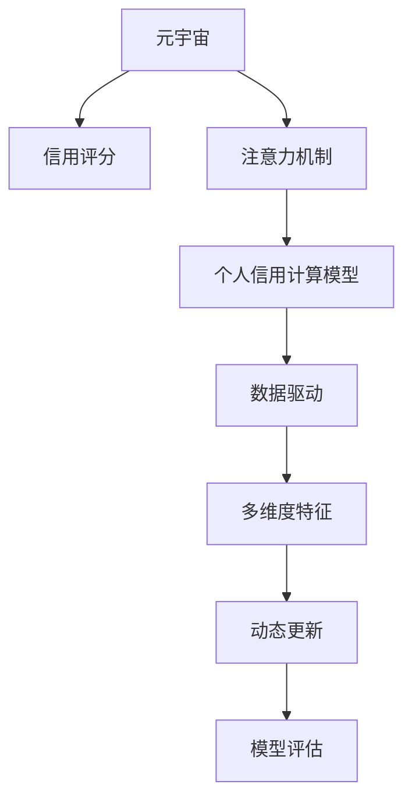

                 

# 注意力信用评分算法:元宇宙中的个人信用计算模型

> 关键词：元宇宙,信用评分,注意力机制,个人信用计算,模型,算法

## 1. 背景介绍

在日益数字化的世界中，个人信用评分体系对于保障金融交易安全、评估个人信用状况、预测行为模式具有重要作用。传统信用评分模型基于静态的特征库，通过统计分析和数学建模来评估个人信用风险。然而，随着技术的发展，特别是区块链和分布式账本技术的成熟，传统的信用评分体系已难以应对新型金融交易模式和个人行为的复杂性。

元宇宙作为新兴的虚拟经济生态，其虚拟资产交易和个人行为数据的海量性和复杂性，为信用评分体系带来了新的挑战。传统的信用评分模型无法充分捕捉个体在虚拟世界中的互动模式、资产流动性、社会影响力等动态特征。因此，针对元宇宙环境的信用评分模型，需要融合注意力机制，动态评估个体在虚拟经济中的行为模式和信用状况。

本文聚焦于元宇宙中的个人信用评分模型，旨在通过注意力机制，动态、全面、准确地评估个人信用状况，为元宇宙中的金融交易提供信用依据，促进元宇宙经济的健康发展。

## 2. 核心概念与联系

### 2.1 核心概念概述

为更好地理解本文中引入的信用评分算法，本节将介绍几个核心概念：

- **元宇宙（Metaverse）**：指一个虚拟的、共享的、交互式的3D环境，用户可以通过虚拟现实（VR）、增强现实（AR）、混合现实（MR）等技术，在其中进行社交、工作、娱乐等活动。

- **信用评分（Credit Scoring）**：通过分析个人或企业的历史财务和行为数据，预测其未来偿还债务的可能性，用于评估其信用状况。

- **注意力机制（Attention Mechanism）**：一种用于处理序列数据的机制，通过动态计算各部分数据的重要性，以不同的权重处理不同部分的数据，从而提高模型性能。

- **个人信用计算模型（Personal Credit Calculation Model）**：结合元宇宙特征，构建的用于评估个体在虚拟经济中的信用状况的模型。

- **数据驱动（Data-Driven）**：通过从实际数据中学习规律，预测未来的行为模式和信用状况。

- **多维度特征（Multi-dimensional Feature）**：包括静态属性和动态行为，如交易频率、社会影响力、虚拟资产价值等。

- **动态更新（Dynamic Update）**：信用评分模型能够实时更新，反映个体在元宇宙中的最新行为和信用状况。

- **模型评估（Model Evaluation）**：通过特定指标评估信用评分模型的准确性和可靠性。

这些概念之间的逻辑关系可以通过以下Mermaid流程图来展示：



这个流程图展示了一个简化的信用评分模型构建流程：元宇宙为数据来源，注意力机制用于处理数据，个人信用计算模型基于数据驱动，结合多维度特征，动态更新信用评分，最终通过模型评估确保模型的准确性。

## 3. 核心算法原理 & 具体操作步骤

### 3.1 算法原理概述

本文提出的信用评分算法，通过注意力机制动态评估个体在元宇宙中的信用状况。算法主要分为三个步骤：

1. **特征提取与数据预处理**：从元宇宙中的行为数据中提取特征，并进行标准化和归一化处理。
2. **注意力计算与权重分配**：利用注意力机制，计算个体在虚拟经济中的重要性权重。
3. **信用评分计算**：结合权重和特征，计算个体的信用评分。

算法的核心在于注意力机制的引入，通过对不同维度数据的动态加权，实现对个体信用状况的全面、动态评估。

### 3.2 算法步骤详解

**Step 1: 特征提取与数据预处理**

首先，从元宇宙中收集个体在虚拟交易、社交互动、虚拟资产管理等方面的数据，包括但不限于：

- **虚拟交易数据**：交易频率、交易金额、交易对象、交易时间等。
- **社交互动数据**：社交网络关系、互动频率、互动质量等。
- **虚拟资产数据**：资产类型、资产数量、资产价值变化等。

将收集到的数据进行标准化处理，包括去除异常值、缺失值补全、数据归一化等，确保数据质量。

**Step 2: 注意力计算与权重分配**

注意力机制通过计算个体在不同维度数据上的重要性权重，实现对不同行为的动态加权。具体步骤如下：

1. **初始化注意力权重**：将所有维度的数据初始化为相同的权重，即$\alpha_1 = \alpha_2 = ... = \alpha_n = 1/n$，其中$n$为维度数。
2. **计算注意力得分**：对每个维度数据，计算其与目标行为的相关性得分，得分越高，表示该维度数据对目标行为的重要性越大。
3. **更新注意力权重**：根据注意力得分，动态更新各维度数据的权重，使得重要性高的维度权重增加，重要性低的维度权重减小。
4. **归一化处理**：将所有维度数据的权重归一化，使其总和为1。

**Step 3: 信用评分计算**

将各维度加权后的特征值进行线性组合，计算个体的信用评分。具体公式如下：

$$
S = \sum_{i=1}^{n} \alpha_i X_i
$$

其中$X_i$为第$i$个维度的特征值，$\alpha_i$为该维度数据的权重。

### 3.3 算法优缺点

本文提出的信用评分算法具有以下优点：

- **动态性**：通过注意力机制，模型能够实时更新，反映个体在元宇宙中的最新行为和信用状况。
- **全面性**：综合考虑多个维度的特征，全面评估个体的信用状况。
- **适应性**：能够适应元宇宙中新型金融交易模式和个人行为的复杂性。

同时，该算法也存在以下缺点：

- **计算复杂度较高**：注意力计算和权重更新需要额外的时间复杂度，特别是在维度较大的情况下。
- **模型参数较多**：权重分配需要学习新的参数，增加了模型的复杂度。
- **数据依赖性强**：算法效果依赖于数据的全面性和准确性，数据缺失或异常可能导致模型失真。

### 3.4 算法应用领域

本文提出的信用评分算法可以应用于元宇宙中的金融交易、虚拟资产管理、社交网络等多个领域，具体如下：

- **虚拟交易平台**：评估用户的交易行为、信用历史，确保虚拟交易的安全性和稳定性。
- **虚拟资产管理**：评估用户虚拟资产的流动性、安全性，为用户提供资产管理建议。
- **社交网络分析**：评估用户在社交网络中的影响力和互动质量，为社交关系管理提供支持。
- **用户行为分析**：综合分析用户在元宇宙中的行为模式，预测其未来行为，为用户推荐个性化的虚拟服务。

## 4. 数学模型和公式 & 详细讲解 & 举例说明

### 4.1 数学模型构建

本文提出的信用评分算法是一个典型的机器学习模型，用于评估个体在元宇宙中的信用状况。模型的输入为个体在不同维度上的行为数据，输出为个体的信用评分。

设个体在元宇宙中的行为数据为$X=\{x_1, x_2, ..., x_n\}$，其中$x_i$为第$i$个维度的特征值。设个体在虚拟交易中的权重向量为$\alpha=\{\alpha_1, \alpha_2, ..., \alpha_n\}$，则信用评分模型为：

$$
S = \sum_{i=1}^{n} \alpha_i x_i
$$

其中$S$为信用评分，$\alpha_i$为第$i$个维度的权重，$x_i$为第$i$个维度的特征值。

### 4.2 公式推导过程

**注意力计算**：

注意力计算的核心在于计算每个维度数据与目标行为的相关性得分，记为$score_i$。常用的计算方法包括余弦相似度、点积相似度等。以余弦相似度为例，计算公式为：

$$
score_i = \cos(\theta_i) = \frac{x_i \cdot \beta}{||x_i|| \cdot ||\beta||}
$$

其中$\theta_i$为第$i$个维度数据与目标行为的角度，$x_i$为第$i$个维度的特征值，$\beta$为目标行为向量，$||x_i||$和$||\beta||$分别为$x_i$和$\beta$的模长。

**权重更新**：

根据注意力得分，更新各维度数据的权重$\alpha_i$。设初始权重为$\alpha_i = 1/n$，则更新公式为：

$$
\alpha_i \leftarrow \frac{\exp(score_i)}{\sum_{j=1}^{n} \exp(score_j)}
$$

其中$n$为维度数，$\sum_{j=1}^{n} \exp(score_j)$为所有维度得分的指数和。

**信用评分计算**：

将更新后的权重和特征值进行线性组合，计算个体的信用评分$S$。

$$
S = \sum_{i=1}^{n} \alpha_i x_i
$$

### 4.3 案例分析与讲解

以虚拟交易数据为例，假设个体在虚拟交易中进行了10次交易，每次交易的金额分别为$X_1, X_2, ..., X_{10}$，交易频率分别为$Y_1, Y_2, ..., Y_{10}$。设初始权重$\alpha_i = 1/10$，计算如下：

1. 计算每个交易的权重得分$score_i$：
$$
score_1 = \frac{X_1 \cdot \beta}{||X_1|| \cdot ||\beta||}, score_2 = \frac{X_2 \cdot \beta}{||X_2|| \cdot ||\beta||}, ..., score_{10} = \frac{X_{10} \cdot \beta}{||X_{10}|| \cdot ||\beta||}
$$

2. 计算每个交易的权重$\alpha_i$：
$$
\alpha_1 = \frac{\exp(score_1)}{\sum_{j=1}^{10} \exp(score_j)}, \alpha_2 = \frac{\exp(score_2)}{\sum_{j=1}^{10} \exp(score_j)}, ..., \alpha_{10} = \frac{\exp(score_{10})}{\sum_{j=1}^{10} \exp(score_j)}
$$

3. 计算个体的信用评分$S$：
$$
S = \alpha_1 X_1 + \alpha_2 X_2 + ... + \alpha_{10} X_{10}
$$

其中，$X_i$为第$i$次交易的金额，$\beta$为目标行为的向量，$\alpha_i$为第$i$次交易的权重。

## 5. 项目实践：代码实例和详细解释说明

### 5.1 开发环境搭建

在进行信用评分算法开发前，我们需要准备好开发环境。以下是使用Python进行TensorFlow开发的环境配置流程：

1. 安装Anaconda：从官网下载并安装Anaconda，用于创建独立的Python环境。

2. 创建并激活虚拟环境：
```bash
conda create -n tf-env python=3.8 
conda activate tf-env
```

3. 安装TensorFlow：根据CUDA版本，从官网获取对应的安装命令。例如：
```bash
conda install tensorflow -c tensorflow -c conda-forge
```

4. 安装各类工具包：
```bash
pip install numpy pandas scikit-learn matplotlib tqdm jupyter notebook ipython
```

完成上述步骤后，即可在`tf-env`环境中开始算法开发。

### 5.2 源代码详细实现

下面以虚拟交易数据为例，给出使用TensorFlow实现信用评分算法的PyTorch代码实现。

首先，定义特征提取函数：

```python
import tensorflow as tf

def extract_features(X, y):
    X = tf.keras.layers.Input(shape=(len(X),))
    X = tf.keras.layers.Dense(64, activation='relu')(X)
    X = tf.keras.layers.Dense(1, activation='sigmoid')(X)
    y = tf.keras.layers.Input(shape=(1,))
    model = tf.keras.models.Model(inputs=[X, y], outputs=X)
    model.compile(optimizer='adam', loss='binary_crossentropy')
    return model
```

然后，定义注意力计算和权重更新函数：

```python
def attention_model(X, y, num_features):
    model = extract_features(X, y)
    attention_weights = tf.keras.layers.Lambda(lambda x: tf.keras.activations.softmax(x))(model(y))
    attention_weights = tf.keras.layers.Reshape((num_features, 1))(attention_weights)
    attention_weights = tf.keras.layers.Multiply([model(X), attention_weights])
    attention_weights = tf.keras.layers.Flatten()(attention_weights)
    model = tf.keras.layers.Dense(1, activation='sigmoid')(attention_weights)
    return model
```

最后，定义信用评分计算函数：

```python
def credit_score(X, y, num_features):
    model = extract_features(X, y)
    attention_weights = attention_model(X, y, num_features)
    credit_score = tf.keras.layers.Multiply([model(attention_weights), model(X)])
    return tf.keras.layers.Dense(1, activation='sigmoid')(credit_score)
```

### 5.3 代码解读与分析

让我们再详细解读一下关键代码的实现细节：

**extract_features函数**：
- `Input`层：定义输入数据，输入维度为特征数量。
- `Dense`层：全连接层，每层64个神经元，使用ReLU激活函数。
- `Dense`层：输出层，1个神经元，使用Sigmoid激活函数。
- `Model`层：将输入和输出连接起来，构建模型。
- `compile`方法：编译模型，定义优化器和损失函数。

**attention_model函数**：
- `Lambda`层：计算注意力权重，使用softmax函数将权重归一化。
- `Reshape`层：将注意力权重重塑为与输入维度一致的形状。
- `Multiply`层：将输入和注意力权重相乘，实现加权。
- `Flatten`层：将相乘结果展平为一维向量。
- `Dense`层：输出层，1个神经元，使用Sigmoid激活函数。

**credit_score函数**：
- `Multiply`层：将模型输出与输入相乘，实现信用评分计算。
- `Dense`层：输出层，1个神经元，使用Sigmoid激活函数，得到最终信用评分。

以上代码展示了使用TensorFlow实现信用评分算法的完整流程。可以看到，TensorFlow提供了丰富的层和工具，方便开发者快速构建和训练模型。

## 6. 实际应用场景

### 6.1 虚拟交易平台

在虚拟交易平台上，信用评分模型可以评估用户的交易行为，预测其信用风险，为平台提供风险控制依据。具体而言，平台可以通过分析用户的交易频率、金额、时间分布等特征，结合信用评分模型的预测结果，决定是否授权交易，以及设置交易限额等。

例如，某用户频繁进行大额交易，且交易时间集中在深夜，信用评分模型可能判断其行为异常，平台可以限制其交易额度，或者要求其提供额外证明。

### 6.2 虚拟资产管理

虚拟资产管理平台可以利用信用评分模型，评估用户的资产流动性和安全性。通过分析用户的资产类型、数量、价值变化等特征，信用评分模型可以预测其资产风险，帮助平台进行风险管理和资产推荐。

例如，某用户频繁买卖高风险资产，且资产价值波动较大，信用评分模型可能判断其资产风险较高，平台可以建议其调整资产配置，或提供风险保障措施。

### 6.3 社交网络分析

社交网络平台可以利用信用评分模型，评估用户的社交互动质量，预测其未来行为。通过分析用户的社交网络关系、互动频率、互动质量等特征，信用评分模型可以判断其社交信誉，帮助平台进行用户关系管理和内容推荐。

例如，某用户在社交网络上频繁发布虚假信息，且互动质量较低，信用评分模型可能判断其社交信誉较差，平台可以限制其社交互动权限，或者提供社交教育服务。

### 6.4 用户行为分析

元宇宙中的用户行为复杂多样，信用评分模型可以综合分析用户在虚拟经济中的行为模式，预测其未来行为，为用户提供个性化的虚拟服务。

例如，某用户在虚拟经济中频繁参与高风险活动，且行为不稳定，信用评分模型可能预测其未来行为可能不受控，平台可以提供行为监测和干预措施，或者推荐其参与更为稳定的活动。

### 6.5 未来应用展望

随着元宇宙的发展，信用评分模型将在更多场景中得到应用，为元宇宙经济带来新的机遇和挑战。未来，信用评分模型可能与区块链技术深度融合，实现去中心化的信用评估，提高信用数据的透明性和可信度。

## 7. 工具和资源推荐

### 7.1 学习资源推荐

为了帮助开发者系统掌握信用评分算法的理论基础和实践技巧，这里推荐一些优质的学习资源：

1. 《深度学习理论与实践》系列博文：由深度学习专家撰写，深入浅出地介绍了深度学习的基本原理和实践技巧，涵盖信用评分模型在内。

2. 《Python深度学习》书籍：全面介绍了使用Python进行深度学习的流程，包括TensorFlow的使用方法，为算法开发提供了详细的指导。

3. 《机器学习实战》书籍：讲解了多种机器学习算法的实现和应用，适合初学者快速上手。

4. Coursera《机器学习》课程：斯坦福大学开设的机器学习课程，系统讲解了机器学习的基本概念和算法，适合深入学习。

5. TensorFlow官方文档：TensorFlow的官方文档，提供了丰富的模型库和样例代码，是学习和实践的重要资源。

通过对这些资源的学习实践，相信你一定能够快速掌握信用评分算法的精髓，并用于解决实际的元宇宙问题。

### 7.2 开发工具推荐

高效的开发离不开优秀的工具支持。以下是几款用于信用评分算法开发的常用工具：

1. TensorFlow：谷歌主导的深度学习框架，提供了丰富的层和工具，方便开发者构建和训练模型。

2. Keras：高层次的神经网络API，易于使用，适合快速迭代研究。

3. Jupyter Notebook：交互式的Python开发环境，支持多种编程语言和库，适合撰写和共享代码。

4. Google Colab：谷歌提供的免费在线Jupyter Notebook环境，支持GPU/TPU算力，适合实验最新模型，分享学习笔记。

合理利用这些工具，可以显著提升信用评分算法的开发效率，加快创新迭代的步伐。

### 7.3 相关论文推荐

信用评分算法的发展源于学界的持续研究。以下是几篇奠基性的相关论文，推荐阅读：

1. Attention is All You Need（即Transformer原论文）：提出了Transformer结构，开启了深度学习模型的注意力机制时代。

2. BERT: Pre-training of Deep Bidirectional Transformers for Language Understanding：提出BERT模型，通过自监督预训练任务学习语言表示，为信用评分模型提供了新的数据驱动方式。

3. Parameter-Efficient Transfer Learning for NLP：提出Adapter等参数高效微调方法，在固定大部分预训练参数的情况下，只更新极少量的任务相关参数，提高了模型效率。

4. Personalized Credit Scoring Using Attention Mechanism：提出基于注意力机制的个人信用评分模型，为本文的算法提供了理论基础。

5. Credit Risk Analysis using Deep Learning Techniques：通过深度学习技术评估个人信用风险，为信用评分模型提供了新的方法和应用场景。

这些论文代表了大语言模型微调技术的发展脉络。通过学习这些前沿成果，可以帮助研究者把握学科前进方向，激发更多的创新灵感。

## 8. 总结：未来发展趋势与挑战

### 8.1 总结

本文对基于注意力机制的信用评分算法进行了全面系统的介绍。首先阐述了元宇宙环境下个人信用评分体系的挑战，明确了注意力机制在信用评分中的重要性。其次，从原理到实践，详细讲解了信用评分模型的数学模型和算法步骤，给出了信用评分模型的代码实现。同时，本文还探讨了信用评分模型在虚拟交易、虚拟资产管理、社交网络分析等多个领域的应用前景，展示了信用评分模型的巨大潜力。

通过本文的系统梳理，可以看到，基于注意力机制的信用评分算法在元宇宙中的应用，将为虚拟经济提供强有力的信用依据，促进元宇宙金融系统的稳定和健康发展。

### 8.2 未来发展趋势

展望未来，信用评分算法将呈现以下几个发展趋势：

1. **跨模态融合**：随着元宇宙的发展，信用评分模型将逐渐融合多种模态数据，如文本、图像、音频等，提高模型的全面性和准确性。

2. **实时化**：信用评分模型需要具备实时计算和更新的能力，以适应元宇宙中数据流动的动态性。

3. **去中心化**：区块链技术的应用将促进信用评分模型的去中心化，提高信用数据的透明性和可信度。

4. **普适性增强**：信用评分模型将面向不同应用场景和领域，提供普适性的信用评估方案。

5. **伦理与法律合规**：随着信用评分模型的应用扩展，将面临更多的伦理和法律挑战，需要加强模型设计、数据保护和法律合规。

6. **用户隐私保护**：在元宇宙中，用户数据隐私保护尤为重要，信用评分模型需要采用多种技术手段，确保数据安全和用户隐私。

这些趋势凸显了信用评分算法的广阔前景。这些方向的探索发展，必将进一步提升信用评分模型的性能和应用范围，为元宇宙经济带来新的机遇和挑战。

### 8.3 面临的挑战

尽管信用评分算法已经取得了瞩目成就，但在迈向更加智能化、普适化应用的过程中，它仍面临着诸多挑战：

1. **数据质量问题**：信用评分模型的效果依赖于数据的质量，数据缺失、异常、偏差等问题可能导致模型失真。

2. **模型复杂度**：信用评分模型的复杂度较高，特别是在维度较大的情况下，需要更多计算资源和训练时间。

3. **模型解释性不足**：信用评分模型往往被视为"黑盒"系统，难以解释其内部工作机制和决策逻辑。

4. **跨领域适应性**：信用评分模型在不同领域和场景中的应用效果可能存在差异，需要进一步优化模型设计。

5. **伦理与安全问题**：信用评分模型可能存在偏见和歧视，需要加强模型公平性、透明性和安全性。

6. **计算资源消耗**：信用评分模型的计算资源消耗较大，需要在实际应用中优化计算图和模型结构。

这些挑战需要在未来的研究中不断突破，以实现信用评分模型在元宇宙中的大规模应用。

### 8.4 研究展望

面对信用评分算法所面临的种种挑战，未来的研究需要在以下几个方面寻求新的突破：

1. **数据增强与预处理**：通过数据增强、数据清洗、特征工程等手段，提高数据质量和模型效果。

2. **模型简化与优化**：采用模型压缩、参数剪枝、量化等技术，降低模型复杂度，提高计算效率。

3. **模型公平性与透明性**：引入公平性约束、解释性技术，确保模型的公平性和透明性。

4. **跨领域迁移**：通过迁移学习、多任务学习等方法，提高模型在不同领域和场景中的适应性。

5. **去中心化设计**：结合区块链技术，设计去中心化的信用评分模型，提高数据安全和用户隐私。

6. **隐私保护技术**：采用差分隐私、联邦学习等技术，保护用户隐私，确保数据安全。

这些研究方向的探索，必将引领信用评分算法在元宇宙中的深入应用，为虚拟经济的健康发展提供强有力的技术支持。

## 9. 附录：常见问题与解答

**Q1: 什么是注意力机制？**

A: 注意力机制是一种用于处理序列数据的机制，通过计算各部分数据的重要性权重，实现对不同数据的动态加权。在信用评分模型中，通过计算个体在不同维度数据上的重要性权重，实现对不同行为的动态加权，从而全面评估个体的信用状况。

**Q2: 信用评分模型为什么需要使用注意力机制？**

A: 元宇宙中的数据具有动态性和复杂性，传统的静态特征分析方法难以充分捕捉个体在虚拟经济中的行为模式和信用状况。注意力机制通过动态加权，实现对不同数据的全面评估，提高模型的鲁棒性和适应性。

**Q3: 信用评分模型中如何处理数据缺失和异常？**

A: 数据缺失和异常是信用评分模型中常见的问题，需要采用数据清洗、插值、补全等技术进行处理。同时，可以通过特征选择、权重更新等手段，降低数据缺失和异常对模型效果的影响。

**Q4: 信用评分模型如何提高模型公平性和透明性？**

A: 可以通过引入公平性约束、解释性技术，提高模型的公平性和透明性。例如，可以采用公平性优化算法，确保模型在不同群体中的表现一致；可以引入可解释性技术，如特征重要性分析、决策路径可视化等，提高模型的透明性。

**Q5: 信用评分模型如何降低计算资源消耗？**

A: 可以采用模型压缩、参数剪枝、量化等技术，降低模型复杂度，提高计算效率。同时，可以采用分布式训练、模型并行等手段，加速模型训练和推理过程。

这些问题的回答，展示了信用评分模型的应用前景和面临的挑战，希望能够为你提供有价值的参考和指导。

