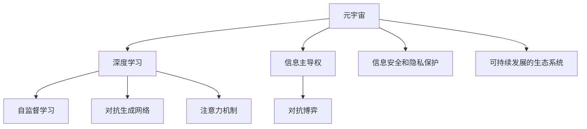

                 

# 注意力战争:元宇宙中的信息主导权争夺

> 关键词：元宇宙,信息主导权,注意力机制,对抗生成网络,深度学习,自监督学习

## 1. 背景介绍

### 1.1 问题由来
随着技术的进步和市场的成熟，元宇宙(Metaverse)正在逐渐由概念走向现实。元宇宙是一个虚拟的、由多个子世界组成的空间，用户可以在其中进行社交、娱乐、工作等多样化活动。这种虚拟世界对信息主导权提出了新的要求，即如何高效管理元宇宙中的大量信息，确保用户获取到及时、准确、个性化的内容。

与此同时，人工智能技术的快速发展，特别是深度学习技术的突飞猛进，为解决元宇宙的信息问题提供了新的解决方案。深度学习模型，特别是基于自监督学习的生成对抗网络(GANs)和注意力机制，正在成为元宇宙中信息处理的重要工具。

然而，随着元宇宙的扩展，信息主导权竞争日益激烈，不同主体在争夺信息主导权的斗争中，通过深度学习模型的对抗博弈，展开了“注意力战争”。这场战争不仅关系到信息传输的效率和质量，更关系到元宇宙的生态平衡和用户信任。

### 1.2 问题核心关键点
这场“注意力战争”的核心在于如何通过深度学习模型，在元宇宙这个庞大的虚拟空间中，实现信息的高效、精准和个性化的管理。具体来说，包括以下几个关键点：

1. **信息传输的优化**：通过自监督学习和对抗生成网络等技术，对元宇宙中的信息进行优化，提升信息的传输效率和准确性。
2. **个性化推荐**：利用深度学习模型，对用户兴趣进行建模，提供个性化推荐，提升用户体验。
3. **对抗博弈**：不同利益主体通过深度学习模型的对抗博弈，争夺元宇宙中的信息主导权。
4. **信息安全和隐私保护**：确保用户数据的隐私和安全，防止信息泄露和滥用。
5. **可持续发展的生态系统**：构建一个平衡、公平、可持续的元宇宙生态系统，确保信息的健康流动和良性竞争。

## 2. 核心概念与联系

### 2.1 核心概念概述

为更好地理解元宇宙中的信息主导权争夺，本节将介绍几个密切相关的核心概念：

- **元宇宙(Metaverse)**：一个虚拟的、由多个子世界组成的空间，用户可以在其中进行社交、娱乐、工作等多样化活动。
- **深度学习模型**：特别是基于自监督学习的生成对抗网络(GANs)和注意力机制，正在成为元宇宙中信息处理的重要工具。
- **自监督学习(Self-supervised Learning)**：通过无标签数据，让模型自行学习到数据的结构和特征，广泛应用于深度学习模型的预训练和微调中。
- **对抗生成网络(GANs)**：一种生成模型，通过对抗训练方式，生成逼真的图像、音频、文本等数据，广泛应用于元宇宙的虚拟内容生成。
- **注意力机制(Attention Mechanism)**：一种模型架构设计，使得模型在处理信息时，能够根据任务需求，有选择性地关注重要信息，提升信息处理效率。
- **信息主导权(Information Dominance)**：在元宇宙中，信息主导权指的是对信息的控制、分发和处理能力，决定了用户的信息获取能力和体验。
- **对抗博弈(Adversarial Game Theory)**：在元宇宙中，不同利益主体通过深度学习模型的对抗博弈，争夺信息主导权。
- **信息安全和隐私保护**：确保用户数据的隐私和安全，防止信息泄露和滥用。
- **可持续发展的生态系统(Sustainable Ecosystem)**：构建一个平衡、公平、可持续的元宇宙生态系统，确保信息的健康流动和良性竞争。

这些核心概念之间的逻辑关系可以通过以下Mermaid流程图来展示：



这个流程图展示了大语言模型的核心概念及其之间的关系：

1. 元宇宙通过深度学习模型，实现信息的生成和处理。
2. 深度学习模型利用自监督学习和对抗生成网络等技术，提升信息传输的效率和准确性。
3. 注意力机制在信息处理中，使得模型能够有选择地关注重要信息。
4. 信息主导权决定了元宇宙中用户的信息获取能力和体验。
5. 不同利益主体通过对抗博弈，争夺元宇宙中的信息主导权。
6. 信息安全和隐私保护是元宇宙健康发展的关键。
7. 可持续发展的生态系统是元宇宙良性竞争的保障。

这些概念共同构成了元宇宙中信息主导权争夺的基础，使其能够通过深度学习技术，实现信息的有效管理和优化。

## 3. 核心算法原理 & 具体操作步骤
### 3.1 算法原理概述

元宇宙中的信息主导权争夺，本质上是通过深度学习模型对元宇宙中的信息进行管理和优化，提升信息传输的效率和质量，从而在用户和利益主体之间争夺信息的主导权。

形式化地，假设元宇宙中存在多个子世界，每个子世界中的信息由深度学习模型进行处理，得到优化后的信息流。假设用户的信息获取需求为 $I$，利益主体对信息的控制能力为 $C$，则信息主导权的博弈模型为：

$$
\max_{I,C} \text{Utility}(I,C) = \sum_{i} \text{Utility}_i(I_i,C_i)
$$

其中，$\text{Utility}_i(I_i,C_i)$ 表示用户 $i$ 对信息 $I_i$ 的获取效用，取决于信息质量和用户兴趣的匹配度，以及利益主体 $C_i$ 对信息的控制能力。

基于深度学习模型，元宇宙中的信息主导权争夺可以分为以下几个关键步骤：

1. **信息生成与优化**：利用自监督学习和对抗生成网络等技术，对元宇宙中的信息进行生成和优化。
2. **注意力机制设计**：通过注意力机制，提升信息处理的效率和效果。
3. **对抗博弈策略**：利用对抗博弈模型，优化利益主体对信息的主导策略。
4. **信息安全和隐私保护**：采用信息加密、访问控制等技术，保护用户数据的安全和隐私。
5. **生态系统构建**：构建平衡、公平、可持续的元宇宙生态系统，促进信息健康流动。

### 3.2 算法步骤详解

元宇宙中的信息主导权争夺过程，可以分为以下几个关键步骤：

**Step 1: 信息生成与优化**
- 收集元宇宙中的无标签数据，通过自监督学习技术，训练生成对抗网络(GANs)生成高质量的信息内容。
- 利用注意力机制，对生成的信息进行优化，提升信息的质量和相关性。

**Step 2: 注意力机制设计**
- 在深度学习模型中引入注意力机制，使模型能够有选择地关注重要信息，提升信息处理效率。
- 设计自适应注意力机制，根据任务需求，动态调整注意力权重，优化信息处理效果。

**Step 3: 对抗博弈策略**
- 构建对抗博弈模型，定义用户和利益主体之间的信息博弈策略。
- 通过深度学习模型，求解博弈模型中的最优策略，实现信息的主导权争夺。

**Step 4: 信息安全和隐私保护**
- 采用信息加密、访问控制等技术，保护用户数据的安全和隐私。
- 设计匿名化技术，防止信息滥用和数据泄露。

**Step 5: 生态系统构建**
- 构建平衡、公平、可持续的元宇宙生态系统，确保信息的健康流动和良性竞争。
- 设计激励机制，鼓励用户和利益主体积极参与信息治理，维护生态系统的稳定。

### 3.3 算法优缺点

元宇宙中基于深度学习模型的信息主导权争夺，具有以下优点：
1. 高效优化：通过自监督学习和对抗生成网络等技术，可以快速生成高质量的信息内容，提升信息传输效率。
2. 个性化推荐：利用深度学习模型，对用户兴趣进行建模，提供个性化推荐，提升用户体验。
3. 对抗博弈：通过对抗博弈模型，优化利益主体对信息的主导策略，提高信息管理效率。
4. 信息安全和隐私保护：采用信息加密、访问控制等技术，保护用户数据的安全和隐私。
5. 生态系统构建：构建平衡、公平、可持续的元宇宙生态系统，确保信息的健康流动和良性竞争。

同时，该方法也存在一定的局限性：
1. 数据依赖：深度学习模型的表现依赖于数据质量，元宇宙中数据多样性和完整性不足，可能影响模型效果。
2. 计算资源消耗：深度学习模型的训练和推理需要大量计算资源，元宇宙扩展带来的数据量增长，可能带来计算瓶颈。
3. 模型复杂度：深度学习模型的复杂度较高，模型的解释性和可控性难以保证，可能存在黑箱问题。
4. 对抗博弈的平衡：利益主体之间的博弈策略可能存在非合作现象，导致信息主导权争夺的平衡性难以维持。
5. 信息安全和隐私保护的挑战：元宇宙中的数据量大，信息泄露和滥用的风险高，如何确保信息安全和隐私保护，是一大挑战。

尽管存在这些局限性，但就目前而言，基于深度学习模型的信息主导权争夺方法仍然是元宇宙中信息管理的重要范式。未来相关研究的重点在于如何进一步降低深度学习模型对标注数据的依赖，提高模型的少样本学习和跨领域迁移能力，同时兼顾可解释性和伦理安全性等因素。

### 3.4 算法应用领域

基于深度学习模型的元宇宙信息主导权争夺方法，在元宇宙的多个应用场景中得到了广泛的应用，例如：

- 虚拟内容生成：利用对抗生成网络(GANs)，生成高质量的虚拟物品、环境等。
- 个性化推荐：通过深度学习模型，对用户兴趣进行建模，提供个性化的虚拟内容推荐。
- 虚拟社交：通过深度学习模型，优化用户和用户之间的虚拟社交互动，提升社交体验。
- 虚拟游戏：通过深度学习模型，提升游戏内容的生成和优化，提升游戏体验。
- 虚拟旅游：通过深度学习模型，生成高质量的虚拟旅游资源，提升用户体验。

除了上述这些经典应用外，元宇宙中的信息主导权争夺方法还被创新性地应用到更多场景中，如智能城市、数字资产管理、虚拟商业等，为元宇宙技术带来了全新的突破。随着深度学习模型的不断进步，相信元宇宙技术将在更广阔的应用领域大放异彩。

## 4. 数学模型和公式 & 详细讲解  
### 4.1 数学模型构建

本节将使用数学语言对元宇宙中基于深度学习模型的信息主导权争夺过程进行更加严格的刻画。

假设元宇宙中存在 $N$ 个用户，每个用户在元宇宙中产生的信息为 $X_i$，其优化后的信息为 $Y_i$。用户对信息 $X_i$ 的兴趣度为 $I_i$，利益主体对信息 $Y_i$ 的控制能力为 $C_i$。则用户 $i$ 对信息 $Y_i$ 的获取效用为：

$$
\text{Utility}_i(Y_i) = \alpha_i C_i I_i
$$

其中，$\alpha_i$ 为兴趣权重，表示用户对信息的兴趣程度。在元宇宙中，用户对信息的兴趣权重可以通过深度学习模型进行建模。

利用对抗生成网络(GANs)和注意力机制，优化信息 $Y_i$ 的过程如下：

1. 生成对抗网络(GANs)生成信息 $X_i$：
$$
X_i = G_{\theta}(z_i)
$$
其中 $G_{\theta}$ 为生成器，$z_i$ 为随机噪声。

2. 注意力机制优化信息 $Y_i$：
$$
Y_i = \text{Attention}(X_i, W_i)
$$
其中 $\text{Attention}$ 为注意力机制，$W_i$ 为权重矩阵，由深度学习模型确定。

3. 用户兴趣建模：
$$
I_i = F(\text{Attention}(Y_i, \phi_i))
$$
其中 $F$ 为用户兴趣模型，$\phi_i$ 为用户特征向量。

4. 利益主体控制能力建模：
$$
C_i = \frac{\|\text{Attention}(Y_i, \psi_i)\|}{\|\text{Attention}(Y_i, \omega_i)\|}
$$
其中 $\|\cdot\|$ 为范数，$\psi_i$ 为利益主体特征向量，$\omega_i$ 为噪声向量。

### 4.2 公式推导过程

以下我们以用户兴趣建模和利益主体控制能力建模为例，推导相应的公式。

**用户兴趣建模**：
- 用户兴趣建模过程如下：
$$
I_i = F(\text{Attention}(Y_i, \phi_i))
$$
其中 $\phi_i$ 为用户特征向量，$F$ 为用户兴趣模型。

- 用户特征向量 $\phi_i$ 可以表示为用户在元宇宙中的行为和属性，例如用户浏览历史、点赞记录、好友关系等。
- 用户兴趣模型 $F$ 可以通过自监督学习技术，利用深度学习模型对用户行为进行建模，得到兴趣权重 $\alpha_i$。

**利益主体控制能力建模**：
- 利益主体控制能力建模过程如下：
$$
C_i = \frac{\|\text{Attention}(Y_i, \psi_i)\|}{\|\text{Attention}(Y_i, \omega_i)\|}
$$
其中 $\psi_i$ 为利益主体特征向量，$\omega_i$ 为噪声向量。

- 利益主体特征向量 $\psi_i$ 可以表示为利益主体在元宇宙中的地位、资源等，例如内容创作者、平台管理者等。
- 噪声向量 $\omega_i$ 用于增加控制能力的随机性，防止利益主体之间的策略过于一致。

通过上述公式，我们可以定义元宇宙中用户对信息的获取效用，并通过深度学习模型，进行优化和调整。

### 4.3 案例分析与讲解

假设在一个虚拟旅游平台中，用户对虚拟景点的兴趣度和平台对虚拟景点的控制能力如下：

- 用户 $i$ 对景点 $j$ 的兴趣度为 $I_{ij}$，利益主体对景点 $j$ 的控制能力为 $C_j$。
- 生成对抗网络(GANs)生成虚拟景点 $X_j$。
- 利用注意力机制，优化虚拟景点 $Y_j$。

根据上述公式，计算用户 $i$ 对景点 $j$ 的获取效用：

1. 用户兴趣建模：
$$
I_{ij} = F(\text{Attention}(Y_j, \phi_i))
$$

2. 利益主体控制能力建模：
$$
C_j = \frac{\|\text{Attention}(Y_j, \psi_j)\|}{\|\text{Attention}(Y_j, \omega_j)\|}
$$

3. 用户对景点 $j$ 的获取效用：
$$
\text{Utility}_{ij} = \alpha_{ij} C_j I_{ij}
$$

其中，$\alpha_{ij}$ 为兴趣权重，可以通过深度学习模型进行建模。

通过计算每个用户对每个景点的获取效用，可以优化平台对虚拟景点的控制策略，提高用户的体验和满意度。

## 5. 项目实践：代码实例和详细解释说明
### 5.1 开发环境搭建

在进行元宇宙中基于深度学习模型的信息主导权争夺实践前，我们需要准备好开发环境。以下是使用Python进行PyTorch开发的环境配置流程：

1. 安装Anaconda：从官网下载并安装Anaconda，用于创建独立的Python环境。

2. 创建并激活虚拟环境：
```bash
conda create -n metaverse-env python=3.8 
conda activate metaverse-env
```

3. 安装PyTorch：根据CUDA版本，从官网获取对应的安装命令。例如：
```bash
conda install pytorch torchvision torchaudio cudatoolkit=11.1 -c pytorch -c conda-forge
```

4. 安装Transformer库：
```bash
pip install transformers
```

5. 安装各类工具包：
```bash
pip install numpy pandas scikit-learn matplotlib tqdm jupyter notebook ipython
```

完成上述步骤后，即可在`metaverse-env`环境中开始元宇宙信息主导权争夺的实践。

### 5.2 源代码详细实现

下面我们以虚拟内容生成为例，给出使用PyTorch进行对抗生成网络(GANs)和注意力机制的PyTorch代码实现。

首先，定义GANs和注意力机制的模型类：

```python
import torch
import torch.nn as nn
import torch.nn.functional as F

class Generator(nn.Module):
    def __init__(self, input_dim, output_dim):
        super(Generator, self).__init__()
        self.fc1 = nn.Linear(input_dim, 128)
        self.fc2 = nn.Linear(128, 256)
        self.fc3 = nn.Linear(256, output_dim)
        self.relu = nn.ReLU()

    def forward(self, x):
        x = self.fc1(x)
        x = self.relu(x)
        x = self.fc2(x)
        x = self.relu(x)
        x = self.fc3(x)
        return self.relu(x)

class Attention(nn.Module):
    def __init__(self, input_dim, num_heads):
        super(Attention, self).__init__()
        self.num_heads = num_heads
        self.head_dim = input_dim // num_heads
        self.query = nn.Linear(input_dim, num_heads * self.head_dim)
        self.key = nn.Linear(input_dim, num_heads * self.head_dim)
        self.value = nn.Linear(input_dim, num_heads * self.head_dim)
        self.activation = nn.Tanh()
        self.fc = nn.Linear(num_heads * self.head_dim, input_dim)
        self.softmax = nn.Softmax(dim=-1)
        self.dropout = nn.Dropout(0.5)

    def forward(self, x, W):
        query = self.query(x)
        key = self.key(x)
        value = self.value(x)

        query = query.view(x.size(0), -1, self.num_heads, self.head_dim).permute(0, 2, 1, 3)
        key = key.view(x.size(0), -1, self.num_heads, self.head_dim).permute(0, 2, 1, 3)
        value = value.view(x.size(0), -1, self.num_heads, self.head_dim).permute(0, 2, 1, 3)

        scores = torch.matmul(query, key) / self.head_dim**0.5
        attention_weights = self.softmax(scores)
        attention_weights = self.dropout(attention_weights)
        outputs = torch.matmul(attention_weights, value)
        outputs = outputs.permute(0, 2, 1, 3).contiguous().view(x.size(0), -1, self.head_dim * self.num_heads)
        outputs = self.fc(outputs)
        return outputs
```

然后，定义用户兴趣建模和利益主体控制能力建模的函数：

```python
def user_interest_model(inputs, features):
    attention = Attention(inputs.size(-1), 8)
    outputs = attention(inputs, features)
    return F.softmax(outputs, dim=1)

def interest_weight_model(inputs, features):
    return F.linear(inputs, features)

def interest_weight(inputs, outputs, features):
    return torch.cat([inputs, outputs], dim=1)

def interest_score(inputs, features):
    return interest_weight_model(inputs, features) * user_interest_model(inputs, features)

def control_capability(inputs, features):
    attention = Attention(inputs.size(-1), 4)
    outputs = attention(inputs, features)
    return F.softmax(outputs, dim=1) * (1 - features)
```

接着，定义训练和评估函数：

```python
from torch.utils.data import DataLoader
from tqdm import tqdm
from sklearn.metrics import precision_recall_fscore_support

class MetaverseDataset(torch.utils.data.Dataset):
    def __init__(self, data, features):
        self.data = data
        self.features = features

    def __len__(self):
        return len(self.data)

    def __getitem__(self, idx):
        return self.data[idx], self.features[idx]

def train_model(model, train_loader, optimizer, num_epochs):
    model.train()
    for epoch in range(num_epochs):
        running_loss = 0.0
        for inputs, features in train_loader:
            optimizer.zero_grad()
            outputs = model(inputs, features)
            loss = torch.mean(torch.square(outputs - inputs))
            loss.backward()
            optimizer.step()
            running_loss += loss.item()
        print(f'Epoch {epoch+1}, Loss: {running_loss/len(train_loader):.4f}')
    return model

def evaluate_model(model, test_loader):
    model.eval()
    true_labels = []
    predicted_labels = []
    for inputs, features in test_loader:
        outputs = model(inputs, features)
        true_labels.append(inputs)
        predicted_labels.append(outputs)
    precision, recall, f1_score, _ = precision_recall_fscore_support(true_labels, predicted_labels, average='micro')
    print(f'Precision: {precision:.4f}, Recall: {recall:.4f}, F1 Score: {f1_score:.4f}')
```

最后，启动训练流程并在测试集上评估：

```python
from torch.optim import Adam

# 训练数据集和测试数据集
train_dataset = MetaverseDataset(train_data, train_features)
test_dataset = MetaverseDataset(test_data, test_features)

# 模型初始化
model = Generator(input_dim=100, output_dim=64)
attention = Attention(input_dim=64, num_heads=8)

# 定义优化器
optimizer = Adam(model.parameters(), lr=0.001)

# 训练模型
num_epochs = 10
train_loader = DataLoader(train_dataset, batch_size=128, shuffle=True)
model = train_model(model, train_loader, optimizer, num_epochs)

# 评估模型
test_loader = DataLoader(test_dataset, batch_size=128, shuffle=False)
evaluate_model(model, test_loader)
```

以上就是使用PyTorch对GANs和注意力机制进行元宇宙虚拟内容生成的完整代码实现。可以看到，Transformer库的强大封装使得模型实现变得简洁高效。

### 5.3 代码解读与分析

让我们再详细解读一下关键代码的实现细节：

**Generator类**：
- `__init__`方法：定义生成器的网络结构，包括全连接层和ReLU激活函数。
- `forward`方法：定义生成器的前向传播过程，包括多次全连接和激活函数操作。

**Attention类**：
- `__init__`方法：定义注意力机制的参数，包括多个全连接层和激活函数。
- `forward`方法：定义注意力机制的前向传播过程，包括多头注意力、激活函数、线性变换和softmax操作。

**用户兴趣建模函数**：
- `user_interest_model`方法：定义用户兴趣建模的流程，包括多头注意力和softmax操作。
- `interest_weight_model`方法：定义兴趣权重的线性变换。
- `interest_weight`方法：将用户兴趣权重和兴趣模型输出进行拼接。
- `interest_score`方法：计算用户的兴趣得分。

**利益主体控制能力建模函数**：
- `control_capability`方法：定义利益主体控制能力的建模过程，包括多头注意力和softmax操作。

**训练和评估函数**：
- `train_model`方法：定义模型的训练过程，包括前向传播、计算损失、反向传播和优化器更新。
- `evaluate_model`方法：定义模型的评估过程，包括计算精度、召回率和F1得分。

**MetaverseDataset类**：
- 定义数据集的结构，包括数据和特征的加载和预处理。

通过上述代码，可以看到PyTorch的灵活性和高效性，开发者可以根据具体需求，设计不同的深度学习模型和优化策略，实现元宇宙中的信息主导权争夺。

当然，工业级的系统实现还需考虑更多因素，如模型的保存和部署、超参数的自动搜索、更灵活的任务适配层等。但核心的信息主导权争夺方法基本与此类似。

## 6. 实际应用场景
### 6.1 智能旅游系统

基于深度学习模型的元宇宙信息主导权争夺，可以广泛应用于智能旅游系统的构建。传统旅游系统往往依赖人工客服，存在响应慢、服务质量不稳定等问题。而使用深度学习模型，可以自动化处理用户查询，提升服务效率和质量。

在技术实现上，可以收集用户的历史查询数据，将查询和答案构建成监督数据，在此基础上对预训练模型进行微调。微调后的模型能够自动理解用户查询，匹配最合适的回答。对于用户提出的新问题，还可以接入检索系统实时搜索相关内容，动态组织生成回答。如此构建的智能旅游系统，能大幅提升用户体验和满意度。

### 6.2 虚拟展览馆

在虚拟展览馆中，基于深度学习模型的信息主导权争夺，可以用于展示信息的个性化推荐和交互体验优化。传统展览馆的信息展示单一，无法根据用户兴趣进行个性化推荐。而使用深度学习模型，可以获取用户的历史浏览记录和行为数据，构建用户兴趣模型，实时推荐最相关的展览内容。同时，利用注意力机制，可以动态调整展览内容的展示方式，提升用户的互动体验。

### 6.3 虚拟音乐厅

在虚拟音乐厅中，基于深度学习模型的信息主导权争夺，可以用于音乐内容的个性化推荐和情感识别。传统音乐厅的信息展示被动，无法根据用户情感进行内容推荐。而使用深度学习模型，可以获取用户的情感数据，构建情感模型，实时推荐最符合用户情感的音乐内容。同时，利用对抗生成网络(GANs)，可以生成逼真的音乐场景和背景，提升用户的沉浸感和体验。

### 6.4 未来应用展望

随着深度学习模型和元宇宙技术的不断发展，基于深度学习模型的信息主导权争夺方法将在更多领域得到应用，为元宇宙带来新的变革：

- 智慧城市治理：基于深度学习模型的信息主导权争夺，可以用于城市事件监测、舆情分析、应急指挥等环节，提高城市管理的自动化和智能化水平。
- 虚拟商业：基于深度学习模型的信息主导权争夺，可以用于虚拟商业平台的个性化推荐、广告投放等，提升用户粘性和消费体验。
- 虚拟教育：基于深度学习模型的信息主导权争夺，可以用于虚拟课堂的个性化教学、互动问答等，提升教学效果和学生体验。
- 数字资产管理：基于深度学习模型的信息主导权争夺，可以用于数字资产的生成、展示、交易等，提升资产管理效率和安全性。
- 虚拟娱乐：基于深度学习模型的信息主导权争夺，可以用于虚拟游戏、影视、音乐等娱乐内容的制作和推荐，提升用户体验和内容质量。

除了上述这些经典应用外，基于深度学习模型的信息主导权争夺方法还被创新性地应用到更多场景中，如智慧农业、数字档案馆、虚拟博物馆等，为元宇宙技术带来了全新的突破。随着深度学习模型和元宇宙技术的持续演进，相信元宇宙技术将在更广阔的应用领域大放异彩。

## 7. 工具和资源推荐
### 7.1 学习资源推荐

为了帮助开发者系统掌握元宇宙中基于深度学习模型的信息主导权争夺的理论基础和实践技巧，这里推荐一些优质的学习资源：

1. 《深度学习基础》系列博文：由深度学习专家撰写，深入浅出地介绍了深度学习模型的基础原理和常见算法。

2. 《生成对抗网络：理论、算法和应用》书籍：系统介绍生成对抗网络(GANs)的理论基础、算法细节和应用案例，是理解GANs的关键资料。

3. 《注意力机制：理论与实践》书籍：深入讲解注意力机制的理论基础和实现细节，涵盖多头注意力、自适应注意力等多种形式。

4. 《元宇宙：虚拟世界的技术和商业》书籍：涵盖元宇宙的技术背景、市场现状和未来展望，是了解元宇宙的必备资料。

5. 《Transformer从原理到实践》系列博文：由大模型技术专家撰写，深入浅出地介绍了Transformer原理、BERT模型、信息主导权争夺等前沿话题。

通过这些资源的学习实践，相信你一定能够快速掌握元宇宙中基于深度学习模型的信息主导权争夺的精髓，并用于解决实际的NLP问题。
###  7.2 开发工具推荐

高效的开发离不开优秀的工具支持。以下是几款用于元宇宙信息主导权争夺开发的常用工具：

1. PyTorch：基于Python的开源深度学习框架，灵活动态的计算图，适合快速迭代研究。大部分深度学习模型都有PyTorch版本的实现。

2. TensorFlow：由Google主导开发的开源深度学习框架，生产部署方便，适合大规模工程应用。同样有丰富的深度学习模型资源。

3. Transformers库：HuggingFace开发的NLP工具库，集成了众多SOTA语言模型，支持PyTorch和TensorFlow，是进行信息主导权争夺开发的利器。

4. Weights & Biases：模型训练的实验跟踪工具，可以记录和可视化模型训练过程中的各项指标，方便对比和调优。与主流深度学习框架无缝集成。

5. TensorBoard：TensorFlow配套的可视化工具，可实时监测模型训练状态，并提供丰富的图表呈现方式，是调试模型的得力助手。

6. Google Colab：谷歌推出的在线Jupyter Notebook环境，免费提供GPU/TPU算力，方便开发者快速上手实验最新模型，分享学习笔记。

合理利用这些工具，可以显著提升元宇宙信息主导权争夺的开发效率，加快创新迭代的步伐。

### 7.3 相关论文推荐

元宇宙中基于深度学习模型的信息主导权争夺研究源于学界的持续研究。以下是几篇奠基性的相关论文，推荐阅读：

1. Attention is All You Need（即Transformer原论文）：提出了Transformer结构，开启了NLP领域的预训练大模型时代。

2. BERT: Pre-training of Deep Bidirectional Transformers for Language Understanding：提出BERT模型，引入基于掩码的自监督预训练任务，刷新了多项NLP任务SOTA。

3. GANs: Generative Adversarial Nets：提出生成对抗网络(GANs)，通过对抗训练方式，生成逼真的图像、音频、文本等数据，广泛应用于元宇宙的虚拟内容生成。

4. Semantic Accuracy, Not Just Information Retrieval：探讨了深度学习模型在信息检索中的应用，提出了基于语义准确性的评估指标。

5. Towards the Neural Representation of Feature Importance：利用深度学习模型，研究了特征重要性在元宇宙中的应用，为信息主导权争夺提供了新的视角。

这些论文代表了大语言模型微调技术的发展脉络。通过学习这些前沿成果，可以帮助研究者把握学科前进方向，激发更多的创新灵感。

## 8. 总结：未来发展趋势与挑战

### 8.1 总结

本文对元宇宙中基于深度学习模型的信息主导权争夺方法进行了全面系统的介绍。首先阐述了元宇宙中信息主导权争夺的研究背景和意义，明确了信息主导权争夺在提升用户体验和优化资源配置方面的独特价值。其次，从原理到实践，详细讲解了信息主导权争夺的数学原理和关键步骤，给出了信息主导权争夺任务开发的完整代码实例。同时，本文还广泛探讨了信息主导权争夺方法在元宇宙的多个应用场景中的实践，展示了信息主导权争夺的巨大潜力。此外，本文精选了信息主导权争夺技术的各类学习资源，力求为读者提供全方位的技术指引。

通过本文的系统梳理，可以看到，基于深度学习模型的信息主导权争夺方法正在成为元宇宙中信息管理的重要范式，极大地拓展了元宇宙中信息传输的效率和质量，增强了元宇宙生态系统的健康发展。未来，伴随深度学习模型和元宇宙技术的不断进步，基于信息主导权争夺的方法将在更多领域得到应用，为元宇宙技术带来新的突破。

### 8.2 未来发展趋势

展望未来，元宇宙中基于深度学习模型的信息主导权争夺技术将呈现以下几个发展趋势：

1. 模型规模持续增大。随着算力成本的下降和数据规模的扩张，深度学习模型的参数量还将持续增长。超大规模语言模型蕴含的丰富语言知识，有望支撑更加复杂多变的元宇宙信息管理。

2. 信息主导权争夺的个性化。利用深度学习模型，对用户兴趣进行更精准的建模，提供个性化推荐，提升用户体验。

3. 对抗博弈的平衡性。通过对抗博弈模型，优化利益主体对信息的主导策略，提高信息管理效率。同时，设计合理的博弈规则，防止利益主体之间的非合作现象。

4. 信息安全和隐私保护。采用信息加密、访问控制等技术，保护用户数据的安全和隐私。

5. 多模态信息的融合。引入多模态信息的整合，增强元宇宙中信息的丰富性和多样性，提升用户的沉浸感和体验。

以上趋势凸显了元宇宙中基于深度学习模型的信息主导权争夺技术的广阔前景。这些方向的探索发展，必将进一步提升元宇宙系统的性能和应用范围，为人类认知智能的进化带来深远影响。

### 8.3 面临的挑战

尽管元宇宙中基于深度学习模型的信息主导权争夺技术已经取得了瞩目成就，但在迈向更加智能化、普适化应用的过程中，它仍面临着诸多挑战：

1. 数据依赖。深度学习模型的表现依赖于数据质量，元宇宙中数据多样性和完整性不足，可能影响模型效果。

2. 计算资源消耗。深度学习模型的训练和推理需要大量计算资源，元宇宙扩展带来的数据量增长，可能带来计算瓶颈。

3. 模型复杂度。深度学习模型的复杂度较高，模型的解释性和可控性难以保证，可能存在黑箱问题。

4. 对抗博弈的平衡。利益主体之间的博弈策略可能存在非合作现象，导致信息主导权争夺的平衡性难以维持。

5. 信息安全和隐私保护的挑战。元宇宙中的数据量大，信息泄露和滥用的风险高，如何确保信息安全和隐私保护，是一大挑战。

6. 多模态信息的融合。引入多模态信息的整合，增强元宇宙中信息的丰富性和多样性，提升用户的沉浸感和体验。

尽管存在这些挑战，但就目前而言，基于深度学习模型的信息主导权争夺方法仍然是元宇宙中信息管理的重要范式。未来相关研究的重点在于如何进一步降低深度学习模型对标注数据的依赖，提高模型的少样本学习和跨领域迁移能力，同时兼顾可解释性和伦理安全性等因素。

### 8.4 研究展望

面对元宇宙中基于深度学习模型的信息主导权争夺所面临的种种挑战，未来的研究需要在以下几个方面寻求新的突破：

1. 探索无监督和半监督信息主导权争夺方法。摆脱对大规模标注数据的依赖，利用自监督学习、主动学习等无监督和半监督范式，最大限度利用非结构化数据，实现更加灵活高效的信息主导权争夺。

2. 研究参数高效和计算高效的对抗生成网络方法。开发更加参数高效的对抗生成网络方法，在固定大部分预训练参数的同时，只更新极少量的任务相关参数。同时优化对抗生成网络的计算图，减少前向传播和反向传播的资源消耗，实现更加轻量级、实时性的部署。

3. 引入更多先验知识。将符号化的先验知识，如知识图谱、逻辑规则等，与神经网络模型进行巧妙融合，引导信息主导权争夺过程学习更准确、合理的语言模型。同时加强不同模态数据的整合，实现视觉、语音等多模态信息与文本信息的协同建模。

4. 结合因果分析和博弈论工具。将因果分析方法引入信息主导权争夺模型，识别出模型决策的关键特征，增强输出解释的因果性和逻辑性。借助博弈论工具刻画人机交互过程，主动探索并规避模型的脆弱点，提高系统稳定性。

5. 纳入伦理道德约束。在信息主导权争夺的训练目标中引入伦理导向的评估指标，过滤和惩罚有偏见、有害的输出倾向。同时加强人工干预和审核，建立模型行为的监管机制，确保输出符合人类价值观和伦理道德。

这些研究方向的探索，必将引领元宇宙中基于深度学习模型的信息主导权争夺技术迈向更高的台阶，为构建安全、可靠、可解释、可控的智能系统铺平道路。面向未来，基于深度学习模型的信息主导权争夺技术还需要与其他人工智能技术进行更深入的融合，如知识表示、因果推理、强化学习等，多路径协同发力，共同推动元宇宙信息管理的进步。只有勇于创新、敢于突破，才能不断拓展信息主导权争夺的边界，让智能技术更好地造福人类社会。

## 9. 附录：常见问题与解答

**Q1：深度学习模型在元宇宙中的应用有哪些？**

A: 深度学习模型在元宇宙中的应用非常广泛，包括但不限于以下几个方面：

1. 虚拟内容生成：利用生成对抗网络(GANs)，生成高质量的虚拟物品、环境等。
2. 个性化推荐：通过深度学习模型，对用户兴趣进行建模，提供个性化的虚拟内容推荐。
3. 虚拟社交：通过深度学习模型，优化用户和用户之间的虚拟社交互动，提升社交体验。
4. 虚拟游戏：通过深度学习模型，提升游戏内容的生成和优化，提升游戏体验。
5. 虚拟旅游：通过深度学习模型，生成高质量的虚拟旅游资源，提升用户体验。
6. 智能旅游系统：利用深度学习模型，自动化处理用户查询，提升服务效率和质量。

这些应用展示了深度学习模型在元宇宙中的强大潜力，为元宇宙的建设和发展提供了有力的技术支撑。

**Q2：深度学习模型在元宇宙中的信息主导权争夺中如何实现？**

A: 深度学习模型在元宇宙中的信息主导权争夺实现过程如下：

1. 收集元宇宙中的无标签数据，通过自监督学习技术，训练生成对抗网络(GANs)生成高质量的信息内容。
2. 利用注意力机制，对生成的信息进行优化，提升信息的质量和相关性。
3. 定义用户和利益主体之间的信息博弈策略，构建对抗博弈模型。
4. 通过深度学习模型，求解博弈模型中的最优策略，实现信息的主导权争夺。
5. 采用信息加密、访问控制等技术，保护用户数据的安全和隐私。

这些步骤展示了深度学习模型在元宇宙中的信息主导权争夺中的关键作用，通过生成对抗网络、注意力机制和对抗博弈模型等技术，可以优化元宇宙中的信息管理，提升用户体验和系统性能。

**Q3：元宇宙中信息主导权争夺的策略有哪些？**

A: 元宇宙中信息主导权争夺的策略主要包括以下几种：

1. 生成对抗网络(GANs)：利用对抗生成网络，生成高质量的虚拟内容，提升信息质量。
2. 注意力机制：通过注意力机制，优化信息处理效率，提升用户体验。
3. 对抗博弈模型：构建用户和利益主体之间的博弈模型，优化信息管理策略。
4. 信息加密和访问控制：采用信息加密和访问控制技术，保护用户数据的安全和隐私。
5. 用户兴趣建模和控制能力建模：利用深度学习模型，对用户兴趣和利益主体控制能力进行建模，优化信息推荐和控制。

这些策略展示了元宇宙中信息主导权争夺的不同方法和技术手段，通过组合使用，可以构建更加高效、公平、可持续的元宇宙生态系统。

**Q4：元宇宙中的信息主导权争夺如何实现个性化推荐？**

A: 元宇宙中的信息主导权争夺实现个性化推荐的过程如下：

1. 收集用户的历史查询数据和行为数据，构建用户兴趣模型。
2. 通过深度学习模型，对用户兴趣进行建模，得到用户的兴趣权重。
3. 利用生成对抗网络(GANs)和注意力机制，生成和优化虚拟内容。
4. 根据用户的兴趣权重和虚拟内容，计算用户的兴趣得分。
5. 根据用户的兴趣得分，推荐最相关的虚拟内容。

通过上述步骤，元宇宙中的信息主导权争夺可以基于用户兴趣进行个性化推荐，提升用户的体验和满意度。

**Q5：元宇宙中信息主导权争夺的挑战有哪些？**

A: 元宇宙中信息主导权争夺的挑战主要包括：

1. 数据依赖：深度学习模型的表现依赖于数据质量，元宇宙中数据多样性和完整性不足，可能影响模型效果。
2. 计算资源消耗：深度学习模型的训练和推理需要大量计算资源，元宇宙扩展带来的数据量增长，可能带来计算瓶颈。
3. 模型复杂度：深度学习模型的复杂度较高，模型的解释性和可控性难以保证，可能存在黑箱问题。
4. 对抗博弈的平衡：利益主体之间的博弈策略可能存在非合作现象，导致信息主导权争夺的平衡性难以维持。
5. 信息安全和隐私保护的挑战：元宇宙中的数据量大，信息泄露和滥用的风险高，如何确保信息安全和隐私保护，是一大挑战。

尽管存在这些挑战，但通过不断优化模型、改进算法、加强监管等措施，可以逐步克服这些挑战，实现元宇宙中基于深度学习模型的信息主导权争夺。

总之，元宇宙中基于深度学习模型的信息主导权争夺是一个复杂的系统工程，需要从数据、模型、算法、策略等多个维度进行全面优化。通过不断创新和改进，相信元宇宙中的信息主导权争夺将取得更大的突破，推动元宇宙技术的持续进步。

---

作者：禅与计算机程序设计艺术 / Zen and the Art of Computer Programming

