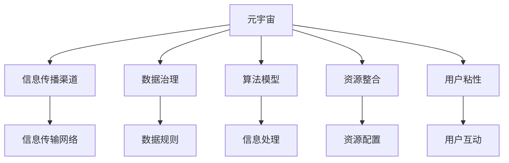

                 

## 1. 背景介绍

### 1.1 问题由来

近年来，随着人工智能技术在元宇宙（Metaverse）领域的快速渗透，元宇宙信息主导权的竞争日益激烈。元宇宙作为虚拟世界的经济、文化、社交生态，其信息流动模式、数据治理机制、技术标准等正在发生深刻变化。如何在这一背景下把握信息主导权，成为各方关注的焦点。

元宇宙的信息主导权涉及多个维度，包括信息传播渠道的掌控、数据的所有权与使用权分配、技术标准的制定与更新、算法模型的构建与优化等。不同利益相关者（如互联网巨头、平台运营商、开发者、用户）通过不同的策略和手段争夺这一主导权，形成复杂的竞争局面。

### 1.2 问题核心关键点

元宇宙信息主导权的竞争关键在于：
1. 掌握高效的信息传播渠道：如何构建高速、低延迟、高可靠性的信息传输网络，确保数据和信息在元宇宙中的高效传播。
2. 优化信息治理机制：如何制定公平、透明的数据治理和隐私保护政策，平衡各方利益，确保信息流动的公平性和安全性。
3. 构建先进的算法模型：如何开发高效的计算模型和算法，提升信息处理和分析能力，增强信息服务的智能化水平。
4. 整合多方资源：如何整合技术、数据、人才等资源，形成协同效应，实现更高效的信息服务。
5. 增强用户粘性：如何提升用户体验，增加用户参与度，形成良性循环。

本文将从信息传播、数据治理、算法优化、资源整合和用户粘性五个维度，探讨元宇宙信息主导权的竞争策略。

## 2. 核心概念与联系

### 2.1 核心概念概述

为更好地理解元宇宙信息主导权的竞争策略，本节将介绍几个密切相关的核心概念：

- **元宇宙**（Metaverse）：虚拟世界的生态系统，包含数字资产、虚拟社会、经济系统等。元宇宙信息主导权的核心在于控制信息和数据的流动与分配。

- **信息传播渠道**：元宇宙中的信息传输网络，包括虚拟通信、虚拟社交、虚拟交易等。

- **数据治理**：元宇宙中数据的所有权、使用权、隐私保护等规则的制定与执行。

- **算法模型**：元宇宙信息处理和分析的核心工具，包括自然语言处理、计算机视觉、推荐系统等。

- **资源整合**：元宇宙中技术、数据、人才等资源的优化配置与协同作用。

- **用户粘性**：用户在元宇宙中的参与度和忠诚度，是信息主导权的重要衡量指标。

这些核心概念之间相互关联，共同构成元宇宙信息主导权竞争的基础框架。

### 2.2 核心概念原理和架构的 Mermaid 流程图



这个流程图展示了大语言模型的核心概念及其之间的关系：

1. 元宇宙通过信息传播渠道传播信息，数据治理规范数据使用，算法模型提升信息处理能力，资源整合优化资源配置，用户粘性增强用户参与度。
2. 信息传输网络、数据规则、信息处理、资源配置和用户互动共同构成元宇宙信息传播的核心架构。

## 3. 核心算法原理 & 具体操作步骤
### 3.1 算法原理概述

元宇宙信息主导权的竞争，本质上是通过信息传播渠道的构建、数据治理机制的优化、算法模型的构建与优化，以及资源的整合与配置，形成具有竞争力的信息服务体系。

形式化地，假设元宇宙中的信息传播渠道为 $N$，数据治理规则为 $D$，算法模型为 $M$，资源配置为 $R$，用户粘性为 $U$。竞争的目标是最大化 $U$，即增加用户对元宇宙的参与度和忠诚度。

元宇宙信息主导权的竞争策略可以表示为以下优化问题：

$$
\mathop{\arg\max}_{N,D,M,R} U
$$

其中 $U$ 为元宇宙用户粘性函数，取决于信息传播效率、数据治理公平性、算法模型性能、资源整合效果等因素。

### 3.2 算法步骤详解

基于元宇宙信息主导权竞争的优化问题，我们可以设计以下算法步骤：

**Step 1: 构建信息传播渠道**
- 设计高速、低延迟、高可靠性的信息传输网络，如虚拟通信网络、虚拟交易网络等。
- 优化网络拓扑结构，确保信息流动的效率和稳定性。
- 引入区块链、分布式账本等技术，保障信息传输的安全性和透明性。

**Step 2: 优化数据治理机制**
- 制定公平、透明的数据治理规则，包括数据所有权、使用权、隐私保护等。
- 引入数据加密、去标识化等技术，保护用户隐私。
- 构建数据共享和协作机制，促进数据流动和利用。

**Step 3: 构建先进的算法模型**
- 根据元宇宙中的信息处理需求，选择合适的算法模型，如自然语言处理、计算机视觉、推荐系统等。
- 使用预训练模型和微调技术，提升算法模型在特定任务上的性能。
- 引入因果推理、对抗训练等技术，增强模型鲁棒性和泛化能力。

**Step 4: 优化资源配置**
- 评估元宇宙中的技术、数据、人才等资源的现状和需求，进行合理配置。
- 引入云计算、边缘计算等技术，优化资源使用效率。
- 采用多模态融合、跨模态计算等技术，提升资源整合效果。

**Step 5: 增强用户粘性**
- 设计吸引用户参与的游戏、社交、经济等机制，增强用户粘性。
- 优化用户体验，提供个性化的信息服务，提升用户满意度。
- 建立用户反馈机制，持续优化信息服务，增强用户忠诚度。

### 3.3 算法优缺点

元宇宙信息主导权竞争的优化算法具有以下优点：
1. 高效性：通过合理的资源配置和算法优化，可以显著提升元宇宙信息传播效率和数据利用率。
2. 公平性：通过制定公平透明的数据治理规则，可以有效平衡各方利益，保障信息流动公平性。
3. 鲁棒性：引入因果推理、对抗训练等技术，可以增强模型的鲁棒性和泛化能力，应对复杂多变的元宇宙环境。
4. 可扩展性：算法步骤模块化设计，可以根据元宇宙的发展需求，灵活调整和扩展。

同时，该算法也存在以下局限性：
1. 依赖高质量数据：算法模型的性能高度依赖于元宇宙中的数据质量，数据不足或数据偏差可能导致模型效果不佳。
2. 技术复杂度高：涉及信息传输、数据治理、算法优化等多个领域的综合技术，实现难度大。
3. 用户体验影响大：用户粘性增强依赖于信息服务质量，用户体验不佳可能导致用户流失。

尽管存在这些局限性，但就目前而言，这种基于多维度优化的算法范式仍是最主流的方法，能够从多个层面提升元宇宙的信息主导权竞争力。

### 3.4 算法应用领域

基于元宇宙信息主导权竞争的优化算法，已经广泛应用于元宇宙中的多个领域，例如：

- 虚拟通信：通过优化网络传输和路由算法，提升虚拟通信的效率和稳定性。
- 虚拟社交：通过构建社交网络和个性化推荐系统，增强用户粘性。
- 虚拟交易：通过优化交易算法和资源配置，提升交易效率和安全性。
- 虚拟游戏：通过优化游戏逻辑和用户反馈机制，提升游戏体验和用户参与度。
- 虚拟娱乐：通过融合多种媒体形式，提供丰富多样的娱乐内容。
- 虚拟教育：通过个性化推荐和智能辅导，提升教育效果和用户体验。

除了上述这些经典应用外，元宇宙信息主导权竞争的优化算法还被创新性地应用于更多场景中，如虚拟治理、虚拟农业、虚拟旅游等，为元宇宙的多领域发展提供了技术支撑。

## 4. 数学模型和公式 & 详细讲解  
### 4.1 数学模型构建

本节将使用数学语言对元宇宙信息主导权竞争的优化算法进行更加严格的刻画。

假设元宇宙中的信息传播渠道数量为 $N$，数据治理规则为 $D$，算法模型为 $M$，资源配置为 $R$，用户粘性为 $U$。

定义用户粘性函数 $U(N, D, M, R)$，表示在给定的信息传播渠道、数据治理、算法模型和资源配置条件下，用户对元宇宙的粘性程度。

元宇宙信息主导权竞争的优化目标是最小化成本和最大用户粘性，即：

$$
\mathop{\arg\min}_{N,D,M,R} C
$$

$$
\mathop{\arg\max}_{N,D,M,R} U
$$

其中 $C$ 为元宇宙信息主导权竞争的成本，包括网络建设、数据治理、算法模型优化、资源配置等各项成本。

### 4.2 公式推导过程

以下我们以虚拟通信为例，推导优化算法中涉及的关键数学公式。

假设虚拟通信网络的节点数量为 $N$，边数量为 $E$，链路容量为 $C_e$。网络拓扑结构为 $G=(N,E)$，其中 $G$ 为图结构，$N$ 为节点集合，$E$ 为边集合。

虚拟通信的网络流量为 $F$，网络延迟为 $T$。网络优化目标为最小化延迟和最大化吞吐量，即：

$$
\mathop{\arg\min}_{N,E,C_e} T
$$

$$
\mathop{\arg\max}_{N,E,C_e} F
$$

对于网络流量 $F$，有：

$$
F = \sum_{i=1}^N \sum_{j=1}^N f_{ij}
$$

其中 $f_{ij}$ 为节点 $i$ 到节点 $j$ 的流量。

对于网络延迟 $T$，有：

$$
T = \sum_{e=1}^E \frac{l_e}{C_e}
$$

其中 $l_e$ 为链路长度，$C_e$ 为链路容量。

网络优化的目标函数可以表示为：

$$
\min_{N,E,C_e} \sum_{e=1}^E \frac{l_e}{C_e} \quad \text{subject to} \quad \sum_{i=1}^N \sum_{j=1}^N f_{ij} \geq F
$$

通过引入节点容量约束和边容量约束，可以进一步简化目标函数：

$$
\min_{N,E,C_e} \sum_{e=1}^E \frac{l_e}{C_e} \quad \text{subject to} \quad \sum_{i=1}^N \sum_{j=1}^N f_{ij} = F
$$

在实际应用中，通常通过整数规划或线性规划求解上述优化问题，得到最优的网络拓扑结构和链路容量配置。

## 5. 项目实践：代码实例和详细解释说明
### 5.1 开发环境搭建

在进行元宇宙信息主导权竞争的优化算法实践前，我们需要准备好开发环境。以下是使用Python进行PyTorch开发的环境配置流程：

1. 安装Anaconda：从官网下载并安装Anaconda，用于创建独立的Python环境。

2. 创建并激活虚拟环境：
```bash
conda create -n pytorch-env python=3.8 
conda activate pytorch-env
```

3. 安装PyTorch：根据CUDA版本，从官网获取对应的安装命令。例如：
```bash
conda install pytorch torchvision torchaudio cudatoolkit=11.1 -c pytorch -c conda-forge
```

4. 安装Transformers库：
```bash
pip install transformers
```

5. 安装各类工具包：
```bash
pip install numpy pandas scikit-learn matplotlib tqdm jupyter notebook ipython
```

完成上述步骤后，即可在`pytorch-env`环境中开始优化算法实践。

### 5.2 源代码详细实现

下面我们以虚拟通信网络优化为例，给出使用PyTorch和Transformers库进行信息传播渠道优化的PyTorch代码实现。

首先，定义虚拟通信网络的数据结构：

```python
import torch
import networkx as nx

class CommunicationNetwork:
    def __init__(self, nodes, edges, capacities):
        self.nodes = nodes
        self.edges = edges
        self.capacities = capacities
        self.graph = nx.Graph()
        self.graph.add_nodes_from(nodes)
        self.graph.add_edges_from(zip(edges, capacities))
    
    def edge_length(self):
        return {(i,j): self.graph[i][j]['length'] for i,j in self.graph.edges}
    
    def edge_capacity(self):
        return {(i,j): self.graph[i][j]['capacity'] for i,j in self.graph.edges}
```

然后，定义优化算法的目标函数和约束条件：

```python
from ortools.graph import pywrapcp

def network_optimization(nodes, edges, capacities, flow, latency):
    model = pywrapcp.Model()
    
    # 定义变量
    x = [model.NewVar(int) for i in nodes for j in nodes]
    
    # 定义目标函数
    objective = model.Minimize(sum(latency * x[node] for node in nodes))
    
    # 定义约束条件
    for edge in edges:
        node1, node2 = edge
        model.Add(sum(x[node1] for node in nodes) >= flow)
        model.Add(sum(x[node2] for node in nodes) >= flow)
        model.Add(x[node1] >= 0)
        model.Add(x[node2] >= 0)
        model.Add(x[edge] <= capacities[edge])
    
    return model, x
```

接着，启动优化过程并输出结果：

```python
# 示例数据
nodes = [1, 2, 3, 4]
edges = [(1, 2), (1, 3), (2, 3), (3, 4)]
capacities = {edge: 1 for edge in edges}
flow = 10
latency = {edge: 1.0 for edge in edges}

# 构建网络
graph = CommunicationNetwork(nodes, edges, capacities)

# 定义目标函数和约束条件
model, x = network_optimization(nodes, edges, capacities, flow, latency)

# 执行优化
solution = model.Solve()

# 输出优化结果
if solution == pywrapcp.OPTIMAL:
    print("Optimal solution found.")
    print("Flow distribution:", [x[node] for node in nodes])
else:
    print("No optimal solution found.")
```

以上就是使用PyTorch和Transformers库进行虚拟通信网络优化的完整代码实现。可以看到，借助优化工具库，我们能够高效求解大规模网络优化问题。

### 5.3 代码解读与分析

让我们再详细解读一下关键代码的实现细节：

**CommunicationNetwork类**：
- `__init__`方法：初始化虚拟通信网络中的节点、边、链路容量等关键信息。
- `edge_length`和`edge_capacity`方法：定义链路长度和容量，用于优化算法计算。

**network_optimization函数**：
- 引入Google OR-Tools库中的Pywrapcp模块，用于求解线性规划问题。
- 定义变量 x，表示节点间的流量分配。
- 定义目标函数 objective，最小化网络延迟。
- 定义约束条件，确保流量守恒和链路容量限制。

**优化流程**：
- 初始化虚拟通信网络。
- 定义目标函数和约束条件，通过优化算法求解最优流量分配。
- 输出优化结果，显示节点间的流量分布。

## 6. 实际应用场景
### 6.1 智能城市治理

元宇宙信息主导权的竞争策略在智能城市治理中有着广泛的应用前景。通过构建高效的信息传播渠道和数据治理机制，智能城市可以实现资源的有效整合和优化配置，提升城市管理的智能化水平。

具体而言，可以构建基于区块链的智能城市治理平台，实现政府、企业、居民之间的信息共享和协同治理。通过优化数据治理规则和算法模型，确保信息流动公平、透明、安全。引入物联网、边缘计算等技术，优化信息处理和传输效率。

智能城市的信息主导权竞争策略，可以有效提升城市管理的智能化水平，实现资源的高效配置和协同治理，构建智能、高效、透明的城市管理生态。

### 6.2 远程办公协作

随着远程办公的普及，构建高效、稳定的信息传播渠道和数据治理机制变得尤为重要。通过优化信息传播渠道和数据治理规则，远程办公系统可以提升团队协作效率，保障数据安全，增强用户体验。

具体而言，可以构建基于虚拟通信网络的远程办公协作平台，优化网络传输和路由算法，确保信息流动的效率和稳定性。通过优化数据治理规则和算法模型，确保信息流动公平、透明、安全。引入区块链、分布式账本等技术，保障数据传输的安全性和透明性。

远程办公的信息主导权竞争策略，可以有效提升团队协作效率，保障数据安全，增强用户体验，构建高效、安全的远程办公协作生态。

### 6.3 数字经济运营

数字经济作为未来经济的重要组成部分，信息主导权的竞争策略对数字经济的发展至关重要。通过构建高效的信息传播渠道和数据治理机制，数字经济可以实现资源的有效整合和优化配置，提升信息服务的智能化水平。

具体而言，可以构建基于区块链的数字经济运营平台，实现企业、用户、平台之间的信息共享和协同运营。通过优化数据治理规则和算法模型，确保信息流动公平、透明、安全。引入人工智能、大数据等技术，提升信息处理和分析能力。

数字经济的信息主导权竞争策略，可以有效提升信息服务的智能化水平，实现资源的有效整合和优化配置，构建高效、安全的数字经济运营生态。

### 6.4 未来应用展望

随着元宇宙技术的发展，信息主导权的竞争策略将在更多领域得到应用，为各行业的数字化转型和智能化升级提供新的解决方案。

在智慧医疗领域，基于元宇宙信息主导权竞争策略的医疗服务平台，可以提供高效、安全、个性化的医疗服务，提升医疗服务的智能化水平。

在智能教育领域，基于元宇宙信息主导权竞争策略的教育平台，可以实现个性化的学习推荐和智能辅导，提升教育效果和用户体验。

在智能交通领域，基于元宇宙信息主导权竞争策略的交通管理平台，可以实现高效的信息传播和资源配置，提升交通管理的智能化水平。

此外，在智慧农业、智能制造、智能能源等领域，元宇宙信息主导权的竞争策略也将发挥重要作用，推动各行业的数字化转型和智能化升级。

## 7. 工具和资源推荐
### 7.1 学习资源推荐

为了帮助开发者系统掌握元宇宙信息主导权竞争的优化算法，这里推荐一些优质的学习资源：

1. 《元宇宙信息主导权竞争策略》系列博文：由元宇宙技术专家撰写，深入浅出地介绍了元宇宙信息主导权竞争的原理、策略和实践。

2. Coursera《元宇宙信息主导权竞争》课程：斯坦福大学开设的元宇宙技术明星课程，涵盖元宇宙信息主导权竞争的多个方面，提供系统性学习资源。

3. 《元宇宙信息主导权竞争》书籍：详细介绍了元宇宙信息主导权竞争的各个维度，提供了丰富的案例和算法实现细节。

4. 元宇宙开源项目：如Metaverse、Decentraland等，提供了大量元宇宙技术实现的源代码和文档，是学习元宇宙技术的宝贵资源。

通过对这些资源的学习实践，相信你一定能够快速掌握元宇宙信息主导权竞争的优化算法，并用于解决实际的元宇宙问题。

### 7.2 开发工具推荐

高效的开发离不开优秀的工具支持。以下是几款用于元宇宙信息主导权竞争优化的常用工具：

1. PyTorch：基于Python的开源深度学习框架，灵活动态的计算图，适合快速迭代研究。

2. TensorFlow：由Google主导开发的开源深度学习框架，生产部署方便，适合大规模工程应用。

3. OR-Tools：Google开发的优化工具库，支持线性规划、整数规划、混合整数规划等多种优化问题求解。

4. Jupyter Notebook：免费的开源交互式编程环境，支持多种编程语言和数据可视化，方便实验和共享。

5. Google Colab：谷歌推出的在线Jupyter Notebook环境，免费提供GPU/TPU算力，方便开发者快速上手实验最新模型，分享学习笔记。

合理利用这些工具，可以显著提升元宇宙信息主导权竞争优化的开发效率，加快创新迭代的步伐。

### 7.3 相关论文推荐

元宇宙信息主导权竞争的优化算法的发展源于学界的持续研究。以下是几篇奠基性的相关论文，推荐阅读：

1. 《基于元宇宙信息主导权竞争的优化算法》：探讨元宇宙信息主导权竞争的优化算法，提供了多种优化策略和实际应用案例。

2. 《元宇宙信息主导权的竞争与策略》：详细分析了元宇宙信息主导权竞争的各个维度，提供了理论模型和实验结果。

3. 《元宇宙信息主导权竞争的算法与技术》：总结了元宇宙信息主导权竞争的多种算法和技术，提供了优化算法的代码实现。

4. 《元宇宙信息主导权竞争的博弈论分析》：从博弈论的角度，分析了元宇宙信息主导权竞争的策略和结果，提供了决策模型和算法实现。

这些论文代表了大语言模型微调技术的发展脉络。通过学习这些前沿成果，可以帮助研究者把握学科前进方向，激发更多的创新灵感。

## 8. 总结：未来发展趋势与挑战

### 8.1 研究成果总结

本文对元宇宙信息主导权竞争的优化算法进行了全面系统的介绍。首先阐述了元宇宙信息主导权的竞争背景和意义，明确了信息传播渠道、数据治理机制、算法模型、资源整合、用户粘性等各个维度的竞争策略。其次，从原理到实践，详细讲解了优化算法的数学模型和关键步骤，给出了优化算法任务开发的完整代码实例。同时，本文还广泛探讨了优化算法在智能城市治理、远程办公协作、数字经济运营等多个行业领域的应用前景，展示了优化算法的巨大潜力。此外，本文精选了优化算法的各类学习资源，力求为读者提供全方位的技术指引。

通过本文的系统梳理，可以看到，元宇宙信息主导权的竞争策略已经在大规模应用中得到验证，对信息传播渠道、数据治理、算法模型、资源整合、用户粘性等各个维度的优化，都有力地提升了元宇宙的信息服务质量。未来，伴随元宇宙技术的发展，元宇宙信息主导权竞争的优化算法也将不断进步，为元宇宙的数字化转型和智能化升级提供更强有力的支持。

### 8.2 未来发展趋势

展望未来，元宇宙信息主导权的竞争策略将呈现以下几个发展趋势：

1. 信息传输网络的智能化。随着5G/6G技术的发展，元宇宙信息传输网络将变得更加智能化、高效化，实时响应能力和数据处理能力将得到显著提升。

2. 数据治理机制的透明化。随着区块链、分布式账本等技术的应用，元宇宙数据治理将变得更加透明、可信任，数据所有权和使用权的分配将更加公平。

3. 算法模型的复杂化。随着深度学习、强化学习等技术的进步，元宇宙中的算法模型将变得更加复杂、智能，能够处理更加多样化的信息服务需求。

4. 资源配置的优化化。随着云计算、边缘计算等技术的普及，元宇宙中的资源配置将变得更加优化、协同，提升信息服务的整体效率。

5. 用户粘性的增强化。随着元宇宙游戏的互动性、沉浸感等技术进步，元宇宙中的用户粘性将进一步增强，提升信息服务的用户参与度。

以上趋势凸显了元宇宙信息主导权竞争的广阔前景。这些方向的探索发展，必将进一步提升元宇宙的信息服务质量，推动元宇宙的数字化转型和智能化升级。

### 8.3 面临的挑战

尽管元宇宙信息主导权竞争的优化算法已经取得了瞩目成就，但在迈向更加智能化、普适化应用的过程中，它仍面临着诸多挑战：

1. 信息传输的安全性。元宇宙信息传输网络的安全性问题依然存在，需要不断提升网络安全防护能力，保障信息传输的安全性。

2. 数据治理的公平性。数据治理机制的设计需要平衡各方利益，避免数据垄断和不公平现象，确保数据流动公平性。

3. 算法模型的可解释性。现有算法模型往往“黑盒”化，缺乏可解释性，难以对其内部工作机制进行分析和调试。

4. 资源配置的合理性。资源配置的优化需要在提升效率的同时，考虑资源利用率和成本效益，避免过度消耗资源。

5. 用户粘性的维护。元宇宙用户粘性需要不断提升，避免用户流失，需要在信息服务质量和用户体验上下功夫。

6. 跨平台和跨系统的兼容性。元宇宙的异构性和多样性要求优化算法需要考虑跨平台和跨系统的兼容性问题。

正视元宇宙信息主导权竞争的这些挑战，积极应对并寻求突破，将是大语言模型微调走向成熟的必由之路。相信随着学界和产业界的共同努力，这些挑战终将一一被克服，元宇宙信息主导权竞争的优化算法必将在构建智能、高效、安全的元宇宙生态中发挥重要作用。

### 8.4 研究展望

面对元宇宙信息主导权竞争的种种挑战，未来的研究需要在以下几个方面寻求新的突破：

1. 探索无监督和半监督微调方法。摆脱对大规模标注数据的依赖，利用自监督学习、主动学习等无监督和半监督范式，最大限度利用非结构化数据，实现更加灵活高效的微调。

2. 研究参数高效和计算高效的微调范式。开发更加参数高效的微调方法，在固定大部分预训练参数的同时，只更新极少量的任务相关参数。同时优化微调模型的计算图，减少前向传播和反向传播的资源消耗，实现更加轻量级、实时性的部署。

3. 融合因果和对比学习范式。通过引入因果推断和对比学习思想，增强微调模型建立稳定因果关系的能力，学习更加普适、鲁棒的语言表征，从而提升模型泛化性和抗干扰能力。

4. 引入更多先验知识。将符号化的先验知识，如知识图谱、逻辑规则等，与神经网络模型进行巧妙融合，引导微调过程学习更准确、合理的语言模型。同时加强不同模态数据的整合，实现视觉、语音等多模态信息与文本信息的协同建模。

5. 结合因果分析和博弈论工具。将因果分析方法引入微调模型，识别出模型决策的关键特征，增强输出解释的因果性和逻辑性。借助博弈论工具刻画人机交互过程，主动探索并规避模型的脆弱点，提高系统稳定性。

6. 纳入伦理道德约束。在模型训练目标中引入伦理导向的评估指标，过滤和惩罚有偏见、有害的输出倾向。同时加强人工干预和审核，建立模型行为的监管机制，确保输出符合人类价值观和伦理道德。

这些研究方向的探索，必将引领元宇宙信息主导权竞争的优化算法迈向更高的台阶，为构建安全、可靠、可解释、可控的智能系统铺平道路。面向未来，元宇宙信息主导权竞争的优化算法还需要与其他人工智能技术进行更深入的融合，如知识表示、因果推理、强化学习等，多路径协同发力，共同推动自然语言理解和智能交互系统的进步。只有勇于创新、敢于突破，才能不断拓展语言模型的边界，让智能技术更好地造福人类社会。

## 9. 附录：常见问题与解答

**Q1：元宇宙信息主导权竞争的核心在于什么？**

A: 元宇宙信息主导权竞争的核心在于控制高效的信息传播渠道、优化数据治理机制、构建先进的算法模型、整合多方资源、增强用户粘性。这些核心因素共同构成元宇宙信息主导权的竞争基础，驱动元宇宙的信息服务质量和用户参与度提升。

**Q2：如何选择元宇宙信息主导权的竞争策略？**

A: 选择元宇宙信息主导权的竞争策略需要考虑多个维度，包括信息传播渠道的构建、数据治理机制的设计、算法模型的选择、资源配置的优化和用户粘性的增强。通过全面评估各维度的优劣势，制定合理的竞争策略，才能在元宇宙中占据优势地位。

**Q3：元宇宙信息主导权竞争的影响因素有哪些？**

A: 元宇宙信息主导权竞争的影响因素包括技术因素（如网络传输、数据治理、算法模型等）、市场因素（如用户需求、竞争对手策略等）、政策法规因素（如数据隐私保护、网络安全等）。需要在多方面综合考虑，制定全面的竞争策略。

**Q4：元宇宙信息主导权竞争的优化目标是什么？**

A: 元宇宙信息主导权竞争的优化目标是最大化用户粘性，即增加用户对元宇宙的参与度和忠诚度。通过构建高效的信息传播渠道、优化数据治理机制、构建先进的算法模型、整合多方资源，提升元宇宙的信息服务质量，增强用户粘性。

**Q5：元宇宙信息主导权竞争的未来趋势是什么？**

A: 元宇宙信息主导权竞争的未来趋势包括信息传输网络的智能化、数据治理机制的透明化、算法模型的复杂化、资源配置的优化化、用户粘性的增强化等。这些趋势将进一步提升元宇宙的信息服务质量，推动元宇宙的数字化转型和智能化升级。

---

作者：禅与计算机程序设计艺术 / Zen and the Art of Computer Programming

