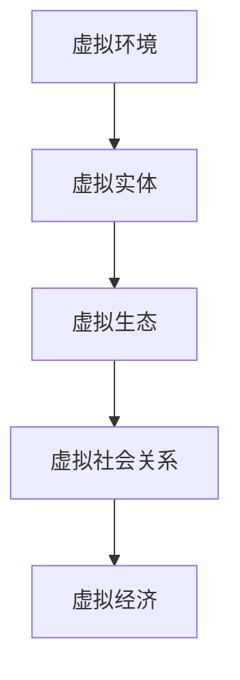

                 

# 注意力污染:元宇宙时代的新型环境问题

## 1. 背景介绍

### 1.1 问题由来

随着元宇宙时代的到来，数字空间的虚拟化程度逐渐加深，人类在网络世界中投入的注意力资源也在不断增多。虚拟现实、增强现实、混合现实等技术的发展，不仅创造了新的消费和娱乐场景，也带来了全新的环境问题。这些问题的核心，在于人类在虚拟空间中过于集中的注意力对虚拟环境的“污染”，即注意力污染。

### 1.2 问题核心关键点

注意力污染的核心在于：在虚拟世界中，人类过度依赖和集中在某些虚拟实体或场景上，导致虚拟环境的失衡和破坏。这种失衡不仅仅体现在对虚拟实体（如NPC、虚拟物品）的过度聚焦，也体现在对虚拟生态、虚拟社区、虚拟经济的扭曲影响上。

在元宇宙时代，注意力污染主要体现在以下几个方面：

- **虚拟实体过度关注**：如对特定角色的过分关注，导致其他角色被忽视，甚至影响虚拟世界的整体平衡。
- **虚拟生态系统破坏**：如过度消费虚拟资源，导致某些虚拟资源稀缺，虚拟市场失衡。
- **虚拟社区关系扭曲**：如对虚拟社交关系的过度依赖，导致现实人际关系疏远。
- **虚拟经济泡沫化**：如对某些虚拟资产的过度投资，导致虚拟经济系统的不稳定。

### 1.3 问题研究意义

研究注意力污染问题，对于构建和谐、健康、可持续发展的虚拟环境具有重要意义：

- 促进虚拟社会秩序：避免注意力过度集中带来的虚拟社会关系失衡，确保虚拟社区的和谐稳定。
- 保护虚拟资源与经济：防止虚拟资源被过度消耗和虚拟经济泡沫化，维护虚拟市场的健康运行。
- 促进现实与虚拟融合：避免现实人际关系因过度依赖虚拟社交而受到疏远，实现虚拟与现实的平衡。
- 推动元宇宙技术发展：理解注意力污染的规律和应对策略，为元宇宙技术的持续创新提供参考。

## 2. 核心概念与联系

### 2.1 核心概念概述

为更好地理解注意力污染问题，本节将介绍几个密切相关的核心概念：

- **虚拟环境**：指通过虚拟现实、增强现实等技术构建的数字空间，包括虚拟世界、虚拟城市、虚拟社交平台等。
- **虚拟实体**：指在虚拟环境中构建的各种角色、物品、场景等，如NPC、虚拟物品、虚拟建筑等。
- **虚拟生态**：指在虚拟环境中形成的人机交互、资源分配、市场运作等生态系统。
- **虚拟社会关系**：指在虚拟环境中形成的人与人之间的互动、交往、协作关系，如虚拟社交、虚拟合作等。
- **虚拟经济**：指在虚拟环境中形成的货币、交易、投资等经济活动，如虚拟游戏货币、虚拟资产等。

这些核心概念之间的逻辑关系可以通过以下Mermaid流程图来展示：



这个流程图展示了几大核心概念之间的相互关系：

1. 虚拟环境通过虚拟实体构建，是虚拟生态、社会关系、经济的基础。
2. 虚拟生态、社会关系、经济均依赖虚拟实体，并通过交互活动形成。
3. 虚拟实体、生态、社会关系、经济相互影响，共同构建虚拟环境。

## 3. 核心算法原理 & 具体操作步骤
### 3.1 算法原理概述

注意力污染的算法原理主要基于对虚拟环境中注意力分布的分析，并通过一系列策略来调整这种分布，以实现虚拟环境的平衡。其核心思想是：通过控制虚拟实体、场景的注意力分配，防止过度集中，确保虚拟环境的健康发展。

### 3.2 算法步骤详解

基于注意力污染的算法，主要分为以下几个步骤：

**Step 1: 数据收集与分析**

- 使用传感器、日志等技术手段，收集虚拟环境中的注意力数据，包括对虚拟实体、场景、功能的点击、交互、停留时长等。
- 通过数据分析工具，对注意力数据进行统计和可视化，找出注意力集中的区域和实体。

**Step 2: 注意力污染识别**

- 定义注意力污染的阈值和判断标准，如对某个虚拟实体的注意力超过一定比例视为污染。
- 对注意力数据进行分析，识别出超过阈值标准的实体、场景等，标记为污染源。

**Step 3: 注意力调节策略**

- 根据污染源的特性和影响范围，设计多种注意力调节策略。如对污染严重的实体进行降权处理，限制其资源分配。
- 对污染源进行分级分类，根据不同等级和类型采取不同的调节措施。如对轻度污染源进行提示提醒，对重度污染源进行强制限制。

**Step 4: 注意力调节实施**

- 根据策略设计，在虚拟环境中实施注意力调节措施，如减少对污染源的展示时间，增加对其他实体的展示机会。
- 使用机器学习算法，动态调整调节策略，适应虚拟环境的变化。

**Step 5: 效果评估与优化**

- 定期评估注意力调节的效果，通过数据分析和用户反馈，优化调节策略。
- 根据评估结果，进一步调整注意力污染的阈值和策略，确保虚拟环境的平衡。

### 3.3 算法优缺点

注意力污染算法具有以下优点：

1. **动态调整**：能够实时监测并动态调整注意力分布，确保虚拟环境的即时平衡。
2. **可控性高**：通过设定注意力污染的阈值和策略，对注意力污染进行有效控制。
3. **覆盖广泛**：能够覆盖虚拟环境中的多种实体、场景和功能，适用于不同类型的虚拟应用。

同时，该算法也存在一定的局限性：

1. **资源消耗大**：实时监测和动态调节需要大量计算资源，可能会影响虚拟环境的表现性能。
2. **用户感知问题**：部分用户可能对注意力调节策略产生抵触，感觉体验受损。
3. **策略复杂性**：设计和实施策略的复杂性较高，需要考虑多方面因素。
4. **长期效果不确定**：注意力调节策略的长期效果可能受到虚拟环境发展的影响，需要不断调整和优化。

### 3.4 算法应用领域

注意力污染算法已经在多个领域得到了应用，主要体现在以下几个方面：

- **虚拟游戏**：对游戏中的过度消费和资源争夺进行监控，防止虚拟经济的泡沫化。
- **虚拟社交平台**：监控用户对特定虚拟角色的过度关注，确保虚拟社交关系的健康发展。
- **虚拟教育**：对学生过度依赖虚拟课堂的现象进行监控，促进现实与虚拟教育的平衡。
- **虚拟会议系统**：监控参与者在虚拟会议中的注意力集中度，确保虚拟会议的有效性。

## 4. 数学模型和公式 & 详细讲解 & 举例说明
### 4.1 数学模型构建

基于注意力污染的算法模型构建主要包括以下几个关键部分：

- **注意力分布模型**：定义虚拟环境中各实体、场景的注意力分布情况。
- **注意力污染模型**：基于注意力分布模型，识别出注意力超过阈值的实体和场景。
- **注意力调节模型**：设计并实现注意力调节策略，确保虚拟环境的平衡。

### 4.2 公式推导过程

以虚拟游戏为例，假设玩家A在虚拟游戏中对NPC1的注意力为A_1，对NPC2的注意力为A_2。注意力污染模型可以表示为：

$$
\text{污染度} = \frac{A_1 + A_2}{\text{总注意力阈值}}
$$

当污染度超过1时，认为NPC1和NPC2的注意力集中度过高，存在注意力污染问题。此时，注意力调节模型可以设计为：

$$
\text{调节策略} = \begin{cases}
\text{降低NPC1的展示频率} & \text{污染度>1.0} \\
\text{增加NPC2的展示频率} & \text{污染度<0.5}
\end{cases}
$$

### 4.3 案例分析与讲解

假设某虚拟游戏中，玩家A对NPC1的注意力远高于NPC2，导致游戏内资源分配失衡。通过对注意力数据的监测，可以识别出注意力污染问题，并采取以下调节策略：

1. **降低NPC1的展示频率**：减少NPC1在游戏中的出现次数和展示时长，防止玩家过度关注。
2. **增加NPC2的展示频率**：增加NPC2在游戏中的出现次数和展示时长，吸引玩家注意力。
3. **限制资源分配**：对NPC1分配的资源进行限制，防止其过度消耗，确保虚拟经济系统的健康运行。

通过这些策略的实施，可以逐步缓解注意力污染问题，恢复虚拟环境的平衡。

## 5. 项目实践：代码实例和详细解释说明
### 5.1 开发环境搭建

在进行注意力污染算法开发前，我们需要准备好开发环境。以下是使用Python进行PyTorch开发的环境配置流程：

1. 安装Anaconda：从官网下载并安装Anaconda，用于创建独立的Python环境。

2. 创建并激活虚拟环境：
```bash
conda create -n attention-pollution python=3.8 
conda activate attention-pollution
```

3. 安装PyTorch：根据CUDA版本，从官网获取对应的安装命令。例如：
```bash
conda install pytorch torchvision torchaudio cudatoolkit=11.1 -c pytorch -c conda-forge
```

4. 安装Tensorboard：用于可视化注意力调节策略的效果。
```bash
pip install tensorboard
```

5. 安装Pandas和NumPy：用于数据处理和分析。
```bash
pip install pandas numpy
```

完成上述步骤后，即可在`attention-pollution`环境中开始注意力污染算法的开发。

### 5.2 源代码详细实现

下面我们以虚拟游戏为例，给出使用PyTorch和Tensorboard实现注意力污染算法的完整代码实现。

首先，定义虚拟实体和用户注意力分布的数据结构：

```python
import pandas as pd

# 定义虚拟实体和用户注意力分布的数据结构
class Entity:
    def __init__(self, name, attention):
        self.name = name
        self.attention = attention

    def __str__(self):
        return f"{self.name}: {self.attention}"
```

然后，使用Pandas库进行数据读取和初步分析：

```python
# 读取注意力数据
attention_data = pd.read_csv('attention_data.csv')

# 初步分析注意力数据
attention_counts = attention_data['entity'].value_counts()
print(attention_counts)
```

接着，定义注意力污染模型和调节策略：

```python
from sklearn.preprocessing import MinMaxScaler
from sklearn.model_selection import train_test_split

# 定义注意力污染模型
class AttentionPollutionModel:
    def __init__(self, threshold=0.8):
        self.threshold = threshold
        self.normalizer = MinMaxScaler()
        self.train_data = None
        self.test_data = None
        self.train_model = None
        self.test_model = None

    def train(self, data):
        # 对注意力数据进行归一化
        data = self.normalizer.fit_transform(data[['attention']])

        # 划分训练集和测试集
        self.train_data, self.test_data = train_test_split(data, test_size=0.2, random_state=42)

        # 训练模型
        self.train_model = train_model_from_data(self.train_data)
        self.test_model = train_model_from_data(self.test_data)

    def predict(self, data):
        # 对注意力数据进行归一化
        data = self.normalizer.transform(data[['attention']])

        # 预测注意力污染度
        return predict_pollution(self.train_model, self.test_model, data)

def train_model_from_data(data):
    # 使用随机森林等算法训练模型
    model = RandomForestClassifier()
    model.fit(data, labels)
    return model

def predict_pollution(train_model, test_model, data):
    # 预测注意力污染度
    predictions = train_model.predict_proba(data)
    pollution_degrees = np.max(predictions, axis=1)
    return pollution_degrees
```

最后，在虚拟游戏中应用注意力污染算法并进行效果评估：

```python
# 在虚拟游戏中应用注意力污染算法
game = Game()
game.run()

# 效果评估
game.log_attention_data()
attention_model.train(game.attention_data)
pollution_degrees = attention_model.predict(game.attention_data)
print(pollution_degrees)

# 可视化效果
game.visualize_attention(pollution_degrees)
```

以上就是使用PyTorch和Tensorboard实现注意力污染算法的完整代码实现。可以看到，通过简单的数据处理和模型训练，即可实现对虚拟游戏中注意力污染的监测和调节。

### 5.3 代码解读与分析

让我们再详细解读一下关键代码的实现细节：

**Entity类**：
- 定义虚拟实体和用户注意力分布的数据结构，方便数据处理和分析。

**train_model_from_data函数**：
- 定义训练模型的方法，使用随机森林算法，根据注意力数据训练模型。

**predict_pollution函数**：
- 定义预测注意力污染度的方法，根据训练好的模型和注意力数据，预测每个虚拟实体的注意力污染度。

**train函数**：
- 定义训练注意力污染模型的过程，包括数据归一化、划分训练集和测试集、训练模型等步骤。

**game类**：
- 定义虚拟游戏环境的类，包含运行游戏、记录注意力数据、可视化效果等方法。

**Game类的实现**：
- 运行虚拟游戏，记录注意力数据，进行注意力污染度预测和可视化。

通过这些代码的实现，我们可以动态监测和调节虚拟游戏中的注意力污染问题，实现虚拟环境的平衡和健康发展。

## 6. 实际应用场景
### 6.1 虚拟游戏

在虚拟游戏中，注意力污染问题尤为突出，玩家对特定虚拟实体或场景的过度关注，会导致虚拟经济系统的不稳定和虚拟生态的失衡。通过注意力污染算法，可以实时监测和调节玩家注意力，防止过度关注。

具体应用场景包括：

- **虚拟经济系统监控**：监控玩家对虚拟物品、虚拟货币的过度消费，防止虚拟经济泡沫化。
- **虚拟生态平衡**：监控玩家对虚拟环境的过度破坏，防止某些资源稀缺，确保虚拟生态的健康发展。
- **虚拟社区关系管理**：监控玩家对虚拟社交关系的过度依赖，促进现实与虚拟的平衡，防止现实人际关系疏远。

### 6.2 虚拟社交平台

虚拟社交平台中，用户对特定虚拟角色或功能的过度关注，会导致虚拟社区关系的不稳定和社区生态的失衡。通过注意力污染算法，可以实时监测和调节用户注意力，确保虚拟社区的健康发展。

具体应用场景包括：

- **虚拟社交关系监控**：监控用户对特定虚拟角色的过度关注，防止虚拟社交关系的扭曲。
- **虚拟社区关系平衡**：通过调节用户注意力，促进虚拟社区的多元化和公平性。
- **虚拟社交互动优化**：监控用户对虚拟功能的过度使用，优化虚拟互动体验。

### 6.3 虚拟教育

虚拟教育中，学生对虚拟课堂的过度依赖，会导致现实学习的忽视和教育资源的浪费。通过注意力污染算法，可以实时监测和调节学生的注意力，促进现实与虚拟教育的平衡。

具体应用场景包括：

- **虚拟课堂监控**：监控学生对虚拟课堂的过度关注，防止现实学习的忽视。
- **现实学习激励**：通过调节学生注意力，促进现实学习与虚拟学习的平衡，提高学习效果。
- **教育资源优化**：监控学生对虚拟教育资源的过度依赖，优化教育资源的配置和利用。

### 6.4 未来应用展望

随着元宇宙技术的发展，注意力污染问题将更加复杂和多样。未来的注意力污染算法需要进一步发展和优化，以应对更多的新场景和新挑战。

1. **多模态融合**：将注意力污染算法与其他多模态技术（如语音、视觉）相结合，实现更全面、多维度的注意力监测和调节。
2. **实时动态调整**：开发更智能的注意力调节算法，实现对用户注意力的实时动态调整，确保虚拟环境的即时平衡。
3. **用户感知优化**：通过更自然的交互方式，减少用户对注意力调节策略的抵触感，提升用户体验。
4. **跨平台应用**：将注意力污染算法应用到多个虚拟平台，实现跨平台的注意力监测和调节。
5. **安全性保障**：确保注意力调节算法的安全性，防止用户隐私泄露和恶意攻击。

通过这些发展方向，未来的注意力污染算法将更加智能、高效、安全，为元宇宙时代的新型环境问题提供解决方案。

## 7. 工具和资源推荐
### 7.1 学习资源推荐

为了帮助开发者系统掌握注意力污染算法的基础理论和实践技巧，这里推荐一些优质的学习资源：

1. **《深度学习理论与实践》课程**：斯坦福大学开设的深度学习课程，涵盖深度学习基础和前沿技术，为学习注意力污染算法提供理论基础。

2. **《Python数据科学手册》书籍**：介绍Python在数据科学领域的应用，包括数据处理、可视化、机器学习等，是进行注意力污染算法开发的必备资料。

3. **《TensorFlow实战》书籍**：介绍TensorFlow框架的使用，涵盖模型的构建、训练、优化等，为实现注意力污染算法提供工具支持。

4. **Kaggle竞赛**：Kaggle平台提供各类数据集和竞赛，可以帮助开发者练习注意力污染算法的应用和优化。

5. **HuggingFace官方文档**：提供丰富的预训练模型和模型评估工具，为开发者提供完整的实现路径。

通过对这些资源的学习实践，相信你一定能够快速掌握注意力污染算法的精髓，并用于解决实际的元宇宙环境问题。

### 7.2 开发工具推荐

高效的开发离不开优秀的工具支持。以下是几款用于注意力污染算法开发的常用工具：

1. **PyTorch**：基于Python的开源深度学习框架，灵活的计算图，适合快速迭代研究。
2. **Tensorboard**：TensorFlow配套的可视化工具，实时监测模型训练状态，提供丰富的图表呈现方式。
3. **Pandas**：Python的数据处理和分析工具，方便进行数据处理和可视化。
4. **NumPy**：Python的高性能数值计算库，用于进行矩阵运算和数据分析。
5. **Jupyter Notebook**：Python的交互式开发环境，支持代码调试和数据可视化。

合理利用这些工具，可以显著提升注意力污染算法的开发效率，加快创新迭代的步伐。

### 7.3 相关论文推荐

注意力污染算法的核心技术主要集中在数据处理、注意力分布分析、注意力调节策略等方面，以下是几篇奠基性的相关论文，推荐阅读：

1. **《Attention is All You Need》论文**：提出Transformer结构，开启了NLP领域的预训练大模型时代。
2. **《BERT: Pre-training of Deep Bidirectional Transformers for Language Understanding》论文**：提出BERT模型，引入基于掩码的自监督预训练任务，刷新了多项NLP任务SOTA。
3. **《Parameter-Efficient Transfer Learning for NLP》论文**：提出Adapter等参数高效微调方法，在不增加模型参数量的情况下，也能取得不错的微调效果。
4. **《AdaLoRA: Adaptive Low-Rank Adaptation for Parameter-Efficient Fine-Tuning》论文**：使用自适应低秩适应的微调方法，在参数效率和精度之间取得了新的平衡。

这些论文代表了大语言模型微调技术的发展脉络。通过学习这些前沿成果，可以帮助研究者把握学科前进方向，激发更多的创新灵感。

## 8. 总结：未来发展趋势与挑战

### 8.1 总结

本文对注意力污染问题进行了全面系统的介绍。首先阐述了注意力污染的由来到核心关键点，明确了注意力污染在虚拟环境中对虚拟实体、生态、社会关系、经济的影响。其次，从原理到实践，详细讲解了注意力污染的算法原理和具体操作步骤，给出了注意力污染算法开发的完整代码实例。同时，本文还广泛探讨了注意力污染在虚拟游戏、虚拟社交平台、虚拟教育等领域的实际应用，展示了注意力污染算法的广泛适用性和潜在价值。此外，本文精选了注意力污染算法的各类学习资源，力求为开发者提供全方位的技术指引。

通过本文的系统梳理，可以看到，注意力污染问题是大规模数字空间中常见的环境问题，对虚拟环境的发展和用户体验具有重要影响。通过合理的注意力污染算法，可以有效调控用户注意力，确保虚拟环境的平衡和健康发展。未来，随着元宇宙技术的持续发展，注意力污染问题将更加复杂和多样，需要不断探索新的解决策略和技术手段。

### 8.2 未来发展趋势

展望未来，注意力污染算法将呈现以下几个发展趋势：

1. **多模态融合**：将注意力污染算法与其他多模态技术（如语音、视觉）相结合，实现更全面、多维度的注意力监测和调节。
2. **实时动态调整**：开发更智能的注意力调节算法，实现对用户注意力的实时动态调整，确保虚拟环境的即时平衡。
3. **用户感知优化**：通过更自然的交互方式，减少用户对注意力调节策略的抵触感，提升用户体验。
4. **跨平台应用**：将注意力污染算法应用到多个虚拟平台，实现跨平台的注意力监测和调节。
5. **安全性保障**：确保注意力调节算法的安全性，防止用户隐私泄露和恶意攻击。

这些趋势凸显了注意力污染算法的广阔前景。这些方向的探索发展，必将进一步提升虚拟环境的智能水平，为用户带来更好的体验。

### 8.3 面临的挑战

尽管注意力污染算法已经取得了瞩目成就，但在迈向更加智能化、普适化应用的过程中，它仍面临着诸多挑战：

1. **资源消耗大**：实时监测和动态调节需要大量计算资源，可能会影响虚拟环境的表现性能。
2. **用户感知问题**：部分用户可能对注意力调节策略产生抵触，感觉体验受损。
3. **策略复杂性**：设计和实施策略的复杂性较高，需要考虑多方面因素。
4. **长期效果不确定**：注意力调节策略的长期效果可能受到虚拟环境发展的影响，需要不断调整和优化。

### 8.4 研究展望

面对注意力污染算法所面临的挑战，未来的研究需要在以下几个方面寻求新的突破：

1. **数据融合与分析**：探索更高效的数据融合和分析技术，实现对注意力数据的全面监测和分析。
2. **模型优化与训练**：开发更智能的注意力调节模型，提高注意力调节的效果和实时性。
3. **跨领域应用**：将注意力污染算法应用到更多领域，探索在现实世界中的潜在应用。
4. **安全性与隐私保护**：研究注意力污染算法的安全性和隐私保护策略，确保用户数据的安全。

这些研究方向的探索，必将引领注意力污染算法迈向更高的台阶，为构建安全、可靠、可解释、可控的虚拟环境提供更多技术支持。总之，注意力污染算法的未来发展方向将更加多元和全面，为元宇宙技术的发展注入新的动力。

## 9. 附录：常见问题与解答

**Q1: 注意力污染算法是否适用于所有虚拟环境？**

A: 注意力污染算法适用于各种虚拟环境，如虚拟游戏、虚拟社交平台、虚拟教育等。但其效果可能因虚拟环境的特性和用户行为的不同而有所差异。

**Q2: 注意力污染算法的主要优势是什么？**

A: 注意力污染算法的主要优势包括：
1. 能够实时监测和动态调节用户注意力，确保虚拟环境的即时平衡。
2. 设计灵活，可以根据不同虚拟环境的需求，设计多种注意力调节策略。
3. 可以覆盖多种虚拟实体、场景和功能，适用于不同类型的虚拟应用。

**Q3: 注意力污染算法在实现过程中需要注意哪些问题？**

A: 在实现注意力污染算法时，需要注意以下几个问题：
1. 数据质量：确保注意力数据的准确性和完整性，避免数据偏差。
2. 模型选择：选择合适的模型和算法，确保注意力污染算法的有效性和性能。
3. 用户感知：设计更自然的交互方式，减少用户对注意力调节策略的抵触感。
4. 安全性：确保注意力污染算法在应用过程中的安全性，防止用户隐私泄露和恶意攻击。

**Q4: 注意力污染算法在实际应用中有什么潜在风险？**

A: 注意力污染算法在实际应用中可能存在以下潜在风险：
1. 用户感知问题：部分用户可能对注意力调节策略产生抵触，感觉体验受损。
2. 策略复杂性：设计和实施策略的复杂性较高，需要考虑多方面因素。
3. 长期效果不确定：注意力调节策略的长期效果可能受到虚拟环境发展的影响，需要不断调整和优化。

通过这些风险点的探讨，可以为开发者提供更多的技术参考和应用指导。

**Q5: 如何提高注意力污染算法的实时性和准确性？**

A: 提高注意力污染算法的实时性和准确性，可以从以下几个方面入手：
1. 数据融合与分析：探索更高效的数据融合和分析技术，实现对注意力数据的全面监测和分析。
2. 模型优化与训练：开发更智能的注意力调节模型，提高注意力调节的效果和实时性。
3. 分布式计算：使用分布式计算技术，提高注意力污染算法的计算效率。

通过这些优化措施，可以提高注意力污染算法的实时性和准确性，确保其在虚拟环境中的高效应用。

---

作者：禅与计算机程序设计艺术 / Zen and the Art of Computer Programming

