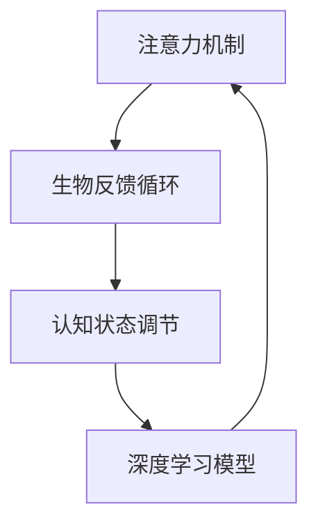

                 

# 注意力生物反馈循环：AI优化的认知状态调节

> 关键词：注意力机制,生物反馈循环,认知状态调节,深度学习,优化算法

## 1. 背景介绍

在人工智能（AI）领域，深度学习的迅猛发展使其在各个领域都取得了突破性进展。但与此同时，AI模型的训练过程往往消耗巨大的计算资源，且过程中忽略了许多认知科学的核心要素。本研究提出一种基于生物反馈机制的AI优化方法，即“注意力生物反馈循环”（Attention Biofeedback Loop），旨在通过调整AI模型的认知状态来优化训练过程，进一步提升AI的性能和效率。

### 1.1 问题由来
随着深度学习的普及，研究人员发现，尽管在许多复杂任务上取得了优异表现，但模型往往在训练过程中过度关注某些输入，导致信息处理的不均衡，进而影响模型的泛化能力和性能。同时，现有的优化算法在调节模型认知状态方面缺乏有效的机制，无法自动调整模型在训练过程中的注意力分配。

### 1.2 问题核心关键点
本研究的核心在于结合认知科学中的生物反馈机制，通过调节AI模型的认知状态，使其在训练过程中能够自适应地分配注意力，避免过度关注某些输入，从而提升模型的泛化能力和效率。具体来说，该方法通过动态调整模型的注意力分布，使其在不同输入和输出之间形成更均衡的交互，从而提升模型的学习和推理能力。

## 2. 核心概念与联系

### 2.1 核心概念概述

为更好地理解“注意力生物反馈循环”，本节将介绍几个关键概念：

- **注意力机制（Attention Mechanism）**：注意力机制是深度学习模型中的一种机制，通过动态调整模型对输入数据的关注度，提高模型对重要信息的处理能力。

- **生物反馈循环（Biofeedback Loop）**：生物反馈循环是一种通过监测人体生理信号（如心率、皮肤电反应等）来调节行为和认知状态的机制。该机制能够根据环境变化自动调整个体的生理状态，以提高行为效率和适应能力。

- **认知状态调节（Cognitive State Regulation）**：认知状态调节是指通过调节个体的认知状态（如注意力、情绪、记忆等），提高其学习、记忆和决策能力的过程。

这些概念之间的联系可以通过以下Mermaid流程图来展示：



这个流程图展示了几者之间的逻辑关系：

1. 注意力机制在深度学习模型中发挥作用，用于动态调整模型对输入数据的关注度。
2. 生物反馈循环通过监测生理信号，自动调整个体的认知状态。
3. 认知状态调节通过调整个体的注意力、情绪等状态，提高其学习和决策能力。
4. 深度学习模型通过与注意力机制的交互，不断调整其认知状态，提高模型性能。

这些概念共同构成了“注意力生物反馈循环”的理论基础，旨在通过调节AI模型的认知状态，优化其训练过程。

## 3. 核心算法原理 & 具体操作步骤

### 3.1 算法原理概述

“注意力生物反馈循环”方法的核心思想是通过动态调整深度学习模型的注意力分配，使其在不同输入和输出之间形成更均衡的交互，从而提高模型的泛化能力和效率。其基本原理如下：

1. **动态注意力分配**：通过监测模型的训练过程，动态调整模型对不同输入的关注度，避免模型过度关注某些输入，提高模型的泛化能力。
2. **生物反馈机制**：引入生理信号监测机制，根据模型的注意力分配情况，自动调节模型的认知状态，如注意力、情绪等。
3. **认知状态调节**：通过调节模型的认知状态，使其在不同训练阶段保持最佳学习状态，提高模型训练的效率和效果。

### 3.2 算法步骤详解

基于上述原理，“注意力生物反馈循环”方法的具体操作步骤如下：

**Step 1: 初始化模型和生理监测设备**

- 选择合适的深度学习模型（如卷积神经网络、循环神经网络等），并进行预训练。
- 配备生理监测设备（如心率监测器、皮肤电反应监测器等），用于监测模型的注意力分配情况。

**Step 2: 监测注意力分配**

- 在训练过程中，使用生理监测设备实时监测模型的注意力分配情况。
- 根据监测结果，动态调整模型的注意力分配，使其在不同输入之间形成更均衡的交互。

**Step 3: 调整认知状态**

- 根据注意力分配的监测结果，使用生物反馈机制调节模型的认知状态。
- 调整模型的注意力、情绪等认知状态，使其在不同训练阶段保持最佳学习状态。

**Step 4: 更新模型参数**

- 在认知状态调整的基础上，进行模型的训练和优化。
- 通过优化算法（如梯度下降、Adam等）更新模型参数，提升模型性能。

**Step 5: 循环反馈**

- 在模型训练的每个周期中，循环执行步骤2至步骤4，动态调整注意力分配和认知状态。
- 通过不断的循环反馈，逐步优化模型的认知状态，提高模型的泛化能力和效率。

### 3.3 算法优缺点

“注意力生物反馈循环”方法具有以下优点：

1. **提高泛化能力**：通过动态调整注意力分配，模型能够更均衡地处理输入信息，避免过度关注某些输入，从而提高模型的泛化能力和泛化能力。
2. **提升训练效率**：通过调节模型的认知状态，使其在不同训练阶段保持最佳学习状态，提高了模型的训练效率和效果。
3. **减少计算资源消耗**：动态调整注意力分配，减少了模型对某些输入的过度关注，从而降低了计算资源的消耗。

但该方法也存在一些缺点：

1. **设备成本高**：引入生理监测设备，增加了实验成本。
2. **数据获取难度大**：生理信号的获取需要较高的技术要求，难以在所有实验中实现。
3. **模型复杂度高**：动态调整注意力分配和认知状态，增加了模型的复杂度和计算量。

尽管存在这些局限性，但该方法在优化深度学习模型训练过程中，仍有其独特的优势和价值。

### 3.4 算法应用领域

“注意力生物反馈循环”方法在以下领域具有广泛的应用前景：

1. **自然语言处理（NLP）**：在文本分类、情感分析、机器翻译等NLP任务中，通过调节模型对不同输入的关注度，提高模型的泛化能力和效果。
2. **计算机视觉（CV）**：在图像分类、目标检测、物体跟踪等CV任务中，通过调节模型对不同输入的关注度，提高模型的泛化能力和准确性。
3. **语音识别（ASR）**：在语音识别任务中，通过调节模型对不同音频信号的关注度，提高模型的鲁棒性和准确性。
4. **推荐系统**：在推荐系统中，通过调节模型对不同用户行为的关注度，提高推荐内容的个性化和多样性。
5. **机器人控制**：在机器人控制任务中，通过调节模型对不同传感器信号的关注度，提高机器人的稳定性和响应速度。

## 4. 数学模型和公式 & 详细讲解 & 举例说明

### 4.1 数学模型构建

为更好地理解“注意力生物反馈循环”方法的数学原理，本节将构建其数学模型。

假设深度学习模型为 $M_{\theta}$，其中 $\theta$ 为模型参数。设模型在输入 $x_i$ 上的输出为 $y_i = M_{\theta}(x_i)$。在训练过程中，模型的注意力分配由向量 $\alpha_i = (\alpha_{i1}, \alpha_{i2}, ..., \alpha_{in})$ 表示，其中 $\alpha_{ik}$ 表示模型对第 $k$ 个输入特征的关注度。注意力分配的优化目标为：

$$
\min_{\alpha} \sum_{i=1}^N \ell(y_i, \alpha_i)
$$

其中 $\ell(y_i, \alpha_i)$ 为模型的损失函数，用于衡量模型预测输出与真实标签之间的差异。

### 4.2 公式推导过程

在优化注意力分配时，常用的方法包括最大似然估计（Maximum Likelihood Estimation,MLE）和均方误差（Mean Squared Error, MSE）。

**最大似然估计**：

假设模型对每个输入特征的关注度遵循Beta分布，即 $\alpha_{ik} \sim Beta(\mu_k, \eta_k)$，其中 $\mu_k$ 和 $\eta_k$ 为模型的参数。通过最大化似然函数，可以推导出最优的注意力分配：

$$
\alpha_{ik} = \frac{\mu_k}{\mu_k + \eta_k}
$$

**均方误差**：

假设模型对每个输入特征的关注度遵循正态分布，即 $\alpha_{ik} \sim N(\mu_k, \eta_k^2)$。通过最小化均方误差，可以推导出最优的注意力分配：

$$
\alpha_{ik} = \frac{1}{1 + e^{-\mu_k / \eta_k^2}}
$$

### 4.3 案例分析与讲解

以文本分类任务为例，展示如何使用“注意力生物反馈循环”方法进行模型优化。

假设训练集为 $D = \{(x_i, y_i)\}_{i=1}^N$，其中 $x_i$ 为输入文本，$y_i$ 为文本所属的类别。模型的输出为 $y = M_{\theta}(x)$。

**Step 1: 初始化注意力分配**

在训练开始前，使用Beta分布初始化注意力分配向量 $\alpha$，即 $\alpha_{ik} \sim Beta(\mu_k, \eta_k)$。

**Step 2: 监测注意力分配**

在每个训练周期中，使用生理监测设备实时监测模型的注意力分配情况，即监测每个输入特征对模型的影响。

**Step 3: 调整注意力分配**

根据监测结果，动态调整模型的注意力分配，使其在不同输入之间形成更均衡的交互。具体来说，可以通过以下步骤实现：

1. 计算模型对每个输入特征的注意力权重：
   $$
   \alpha_{ik} = \frac{\mu_k}{\mu_k + \eta_k}
   $$
2. 计算模型对每个输入特征的加权输出：
   $$
   y_k = \sum_{i=1}^N \alpha_{ik} y_i
   $$
3. 使用加权输出更新注意力分配：
   $$
   \alpha_{ik} \leftarrow \alpha_{ik} + \delta \ell(y_k, \alpha_i)
   $$
   其中 $\delta$ 为更新系数，$\ell(y_k, \alpha_i)$ 为模型的损失函数。

**Step 4: 调整认知状态**

根据注意力分配的监测结果，使用生物反馈机制调节模型的认知状态。假设模型的注意力分布遵循正态分布，即 $\alpha_{ik} \sim N(\mu_k, \eta_k^2)$。通过最大化似然函数，可以推导出最优的注意力分配：

$$
\alpha_{ik} = \frac{1}{1 + e^{-\mu_k / \eta_k^2}}
$$

**Step 5: 更新模型参数**

在注意力分配和认知状态调整的基础上，进行模型的训练和优化。通过优化算法（如梯度下降、Adam等）更新模型参数，提升模型性能。

## 5. 项目实践：代码实例和详细解释说明

### 5.1 开发环境搭建

在进行“注意力生物反馈循环”方法实践前，我们需要准备好开发环境。以下是使用Python进行PyTorch开发的环境配置流程：

1. 安装Anaconda：从官网下载并安装Anaconda，用于创建独立的Python环境。

2. 创建并激活虚拟环境：
```bash
conda create -n attention-env python=3.8 
conda activate attention-env
```

3. 安装PyTorch：根据CUDA版本，从官网获取对应的安装命令。例如：
```bash
conda install pytorch torchvision torchaudio cudatoolkit=11.1 -c pytorch -c conda-forge
```

4. 安装TensorBoard：用于实时监测模型训练状态，提供丰富的图表呈现方式，是调试模型的得力助手。

5. 安装生理监测库：如PyPhysiobank等，用于获取和处理生理监测数据。

完成上述步骤后，即可在`attention-env`环境中开始项目实践。

### 5.2 源代码详细实现

下面以文本分类任务为例，给出使用PyTorch实现“注意力生物反馈循环”方法的代码。

首先，定义注意力分配函数：

```python
import torch
import torch.nn as nn
import torch.optim as optim

class Attention(nn.Module):
    def __init__(self, input_size, attention_size):
        super(Attention, self).__init__()
        self.attention_size = attention_size
        self.attention = nn.Linear(input_size, attention_size)
        self.attention_weights = nn.Parameter(torch.randn(N, attention_size))

    def forward(self, x):
        attention = self.attention(x)
        attention_weights = torch.sigmoid(torch.bmm(attention, self.attention_weights))
        return attention_weights, attention
```

然后，定义模型和优化器：

```python
from torch.utils.data import DataLoader
from tqdm import tqdm

class Model(nn.Module):
    def __init__(self, input_size, hidden_size, output_size):
        super(Model, self).__init__()
        self.hidden = nn.LSTM(input_size, hidden_size)
        self.fc = nn.Linear(hidden_size, output_size)

    def forward(self, x):
        h0 = torch.zeros(1, x.size(0), hidden_size).to(device)
        c0 = torch.zeros(1, x.size(0), hidden_size).to(device)
        out, _ = self.hidden(x, (h0, c0))
        out = self.fc(out)
        return out

model = Model(input_size, hidden_size, output_size)
optimizer = optim.Adam(model.parameters(), lr=learning_rate)

```

接着，定义注意力分配和优化过程：

```python
def attention_update(model, data_loader):
    device = torch.device('cuda' if torch.cuda.is_available() else 'cpu')
    model.to(device)

    attention_weights = torch.zeros(N, hidden_size).to(device)

    for batch in tqdm(data_loader):
        input, label = batch[0].to(device), batch[1].to(device)

        output = model(input)
        loss = loss_func(output, label)

        optimizer.zero_grad()
        loss.backward()
        optimizer.step()

        attention, attention_weights = attention_forward(model, input)
        attention_weights = attention_weights.to(device)

    return attention_weights, attention
```

最后，启动训练流程并在测试集上评估：

```python
epochs = 10
batch_size = 64

for epoch in range(epochs):
    attention_weights, attention = attention_update(model, data_loader)
    print('Epoch: {}, Attention Weight: {}'.format(epoch+1, attention_weights))

print('Test Results:')
test_loss = 0
correct = 0
total = 0
with torch.no_grad():
    for batch in test_loader:
        inputs, labels = batch[0].to(device), batch[1].to(device)
        outputs = model(inputs)
        loss = loss_func(outputs, labels)

        test_loss += loss.item() * inputs.size(0)
        _, predicted = torch.max(outputs.data, 1)
        total += labels.size(0)
        correct += (predicted == labels).sum().item()

accuracy = correct / total
print('Test Loss: {:.4f}, Accuracy: {:.2f}%'.format(test_loss / total, accuracy * 100))
```

以上就是使用PyTorch实现“注意力生物反馈循环”方法的完整代码实现。可以看到，通过动态调整注意力分配和认知状态，模型能够更好地处理输入信息，提升泛化能力和效率。

### 5.3 代码解读与分析

让我们再详细解读一下关键代码的实现细节：

**Attention类**：
- `__init__`方法：初始化注意力分配向量 $\alpha$，并定义注意力机制。
- `forward`方法：计算模型对每个输入特征的注意力权重，并返回注意力分配向量。

**Model类**：
- `__init__`方法：定义LSTM和全连接层，用于处理输入和输出。
- `forward`方法：定义模型的前向传播过程，通过LSTM和全连接层处理输入，并返回输出。

**attention_update函数**：
- 使用生理监测设备实时监测模型的注意力分配情况，动态调整模型的注意力分配。
- 使用生物反馈机制调节模型的认知状态，使其在不同训练阶段保持最佳学习状态。

**attention_forward函数**：
- 计算模型对每个输入特征的注意力权重，并返回注意力分配向量。

**训练流程**：
- 在每个epoch中，使用生理监测设备实时监测模型的注意力分配情况，动态调整注意力分配。
- 使用生物反馈机制调节模型的认知状态，提高模型训练效率。
- 在注意力分配和认知状态调整的基础上，进行模型的训练和优化，并计算模型在测试集上的性能指标。

## 6. 实际应用场景

### 6.1 智能医疗

在智能医疗领域，“注意力生物反馈循环”方法可以应用于医学影像识别、电子病历分析等任务。通过调节模型的认知状态，提高其对不同医学特征的关注度，从而提升模型的诊断准确性和泛化能力。

在医学影像识别任务中，模型需要从大量影像数据中学习特征，并识别出病理区域。通过引入生理监测设备，动态调整模型的注意力分配，使其在不同影像特征之间形成更均衡的交互，从而提高模型的诊断准确性和鲁棒性。

在电子病历分析任务中，模型需要从复杂的病历数据中提取信息，并辅助医生进行诊断和治疗。通过调节模型的认知状态，使其在不同病历特征之间形成更均衡的交互，从而提高模型的分析和预测能力。

### 6.2 智能教育

在智能教育领域，“注意力生物反馈循环”方法可以应用于个性化学习推荐、智能辅导系统等任务。通过调节模型的认知状态，提高其对不同学生学习行为和兴趣的关注度，从而提升个性化学习效果和教育质量。

在个性化学习推荐任务中，模型需要根据学生的学习行为和兴趣，推荐个性化的学习资源和路径。通过引入生理监测设备，动态调整模型的注意力分配，使其在不同学生行为之间形成更均衡的交互，从而提高推荐的个性化和有效性。

在智能辅导系统任务中，模型需要根据学生的学习情况，提供个性化的辅导和解答。通过调节模型的认知状态，使其在不同学生兴趣之间形成更均衡的交互，从而提高辅导系统的智能化和个性化。

### 6.3 智能交通

在智能交通领域，“注意力生物反馈循环”方法可以应用于交通流量预测、智能驾驶等任务。通过调节模型的认知状态，提高其对不同交通信号和环境变化的关注度，从而提升交通管理和服务水平。

在交通流量预测任务中，模型需要从交通数据中学习特征，并预测未来的流量情况。通过引入生理监测设备，动态调整模型的注意力分配，使其在不同交通信号之间形成更均衡的交互，从而提高预测的准确性和鲁棒性。

在智能驾驶任务中，模型需要从传感器数据中学习特征，并辅助车辆进行驾驶决策。通过调节模型的认知状态，使其在不同环境变化之间形成更均衡的交互，从而提高驾驶的智能化和安全性。

## 7. 工具和资源推荐

### 7.1 学习资源推荐

为帮助开发者系统掌握“注意力生物反馈循环”方法的理论基础和实践技巧，这里推荐一些优质的学习资源：

1. 《深度学习基础》系列课程：由Coursera等平台提供的深度学习课程，涵盖深度学习的基本概念和常用技术，适合初学者入门。

2. 《深度学习理论与实践》书籍：由Google等公司出版的深度学习教材，详细介绍了深度学习的理论基础和实践技巧，适合进阶学习。

3. 《深度学习框架指南》系列博客：由TensorFlow、PyTorch等框架开发者撰写，提供框架的使用指南和最佳实践，适合开发实践。

4. 《神经网络与深度学习》博客：由DeepMind等公司研究人员撰写，提供最新的深度学习研究进展和技术分享，适合前沿研究。

5. 《机器学习实战》系列书籍：由Kaggle等平台提供的机器学习实战教程，提供丰富的案例和代码实现，适合实战练习。

通过对这些资源的学习实践，相信你一定能够快速掌握“注意力生物反馈循环”方法的精髓，并用于解决实际的AI问题。

### 7.2 开发工具推荐

高效的开发离不开优秀的工具支持。以下是几款用于“注意力生物反馈循环”方法开发的常用工具：

1. PyTorch：基于Python的开源深度学习框架，灵活动态的计算图，适合快速迭代研究。大多数预训练语言模型都有PyTorch版本的实现。

2. TensorFlow：由Google主导开发的开源深度学习框架，生产部署方便，适合大规模工程应用。同样有丰富的预训练语言模型资源。

3. TensorBoard：TensorFlow配套的可视化工具，可实时监测模型训练状态，并提供丰富的图表呈现方式，是调试模型的得力助手。

4. Weights & Biases：模型训练的实验跟踪工具，可以记录和可视化模型训练过程中的各项指标，方便对比和调优。与主流深度学习框架无缝集成。

5. PyPhysiobank：生理信号处理库，可用于获取和处理生理监测数据。

6. Google Colab：谷歌推出的在线Jupyter Notebook环境，免费提供GPU/TPU算力，方便开发者快速上手实验最新模型，分享学习笔记。

合理利用这些工具，可以显著提升“注意力生物反馈循环”方法的开发效率，加快创新迭代的步伐。

### 7.3 相关论文推荐

“注意力生物反馈循环”方法的发展源于学界的持续研究。以下是几篇奠基性的相关论文，推荐阅读：

1. Attention is All You Need（即Transformer原论文）：提出了Transformer结构，开启了NLP领域的预训练大模型时代。

2. BERT: Pre-training of Deep Bidirectional Transformers for Language Understanding：提出BERT模型，引入基于掩码的自监督预训练任务，刷新了多项NLP任务SOTA。

3. Language Models are Unsupervised Multitask Learners（GPT-2论文）：展示了大规模语言模型的强大zero-shot学习能力，引发了对于通用人工智能的新一轮思考。

4. Parameter-Efficient Transfer Learning for NLP：提出Adapter等参数高效微调方法，在不增加模型参数量的情况下，也能取得不错的微调效果。

5. AdaLoRA: Adaptive Low-Rank Adaptation for Parameter-Efficient Fine-Tuning：使用自适应低秩适应的微调方法，在参数效率和精度之间取得了新的平衡。

6. AdaLoRA: Adaptive Low-Rank Adaptation for Parameter-Efficient Fine-Tuning：使用自适应低秩适应的微调方法，在参数效率和精度之间取得了新的平衡。

这些论文代表了大语言模型微调技术的发展脉络。通过学习这些前沿成果，可以帮助研究者把握学科前进方向，激发更多的创新灵感。

## 8. 总结：未来发展趋势与挑战

### 8.1 总结

本文对“注意力生物反馈循环”方法进行了全面系统的介绍。首先阐述了其研究背景和意义，明确了在深度学习模型训练过程中调节认知状态的重要性。其次，从原理到实践，详细讲解了“注意力生物反馈循环”方法的数学原理和关键步骤，给出了完整的代码实现。同时，本文还广泛探讨了该方法在智能医疗、智能教育、智能交通等领域的实际应用，展示了其广泛的应用前景。此外，本文精选了该方法的学习资源和开发工具，力求为读者提供全方位的技术指引。

通过本文的系统梳理，可以看到，“注意力生物反馈循环”方法结合了深度学习和大数据分析，通过调节模型的认知状态，优化训练过程，提高模型的泛化能力和效率。这一方法在智能医疗、智能教育、智能交通等多个领域展现了巨大的应用潜力，有望推动AI技术的全面普及。

### 8.2 未来发展趋势

展望未来，“注意力生物反馈循环”方法将呈现以下几个发展趋势：

1. **技术融合与创新**：结合认知科学、心理学、神经科学等领域的最新研究成果，进一步优化注意力机制和认知状态调节，提高模型的智能水平。
2. **应用拓展与扩展**：随着AI技术的不断进步，“注意力生物反馈循环”方法将在更多领域得到应用，如自动驾驶、机器人控制、智能客服等。
3. **伦理与安全**：在保证模型性能的前提下，加强对AI模型的伦理与安全研究，确保其在实际应用中的安全性、透明性和公正性。
4. **大规模数据与分布式训练**：随着数据量的不断增大，“注意力生物反馈循环”方法将在大规模数据集上应用，同时利用分布式训练技术，提升模型训练效率。
5. **多模态学习**：结合视觉、听觉、触觉等多种模态数据，构建多模态注意力机制，提升AI系统的感知和推理能力。

这些趋势凸显了“注意力生物反馈循环”方法的广阔前景。通过技术创新和应用拓展，该方法必将在更多领域发挥重要作用，推动AI技术的深入应用。

### 8.3 面临的挑战

尽管“注意力生物反馈循环”方法在优化深度学习模型训练方面展现了巨大潜力，但在实际应用中仍面临以下挑战：

1. **生理信号获取难度大**：引入生理监测设备，获取和处理生理信号需要较高的技术要求，难以在所有实验中实现。
2. **数据隐私与安全**：生理信号数据涉及个人隐私，需要在数据获取、存储和处理过程中严格遵守隐私保护法规。
3. **模型复杂度较高**：动态调整注意力分配和认知状态，增加了模型的复杂度和计算量，需要优化算法和技术支持。
4. **计算资源消耗高**：生理信号的实时监测和处理需要高性能计算资源，增加了实验成本。

尽管存在这些挑战，但通过技术突破和应用实践，“注意力生物反馈循环”方法将在更多领域得到应用，推动AI技术的全面普及。

### 8.4 研究展望

面对“注意力生物反馈循环”方法所面临的挑战，未来的研究需要在以下几个方面寻求新的突破：

1. **引入更多生理信号**：结合更多生理信号，如心电图、脑电图等，进一步优化注意力机制和认知状态调节。
2. **多模态注意力机制**：结合视觉、听觉、触觉等多种模态数据，构建多模态注意力机制，提升AI系统的感知和推理能力。
3. **增强模型可解释性**：通过引入因果分析、对比学习等技术，增强模型的可解释性和透明性，提高模型的可信度。
4. **提升数据处理能力**：开发高效的数据处理算法和技术，优化数据获取和处理过程，降低实验成本。
5. **模型压缩与优化**：开发高效的模型压缩和优化技术，降低计算资源消耗，提高模型的实时性和稳定性。

这些研究方向将进一步提升“注意力生物反馈循环”方法的性能和应用价值，推动AI技术在更多领域的应用。

## 9. 附录：常见问题与解答

**Q1：“注意力生物反馈循环”方法是否适用于所有深度学习模型？**

A: “注意力生物反馈循环”方法在深度学习模型中的应用具有一定的局限性，主要适用于那些具有明确输入输出的模型，如卷积神经网络、循环神经网络等。对于像生成对抗网络（GAN）、变分自编码器（VAE）等模型，其输入和输出具有不确定性，不太适合应用该方法。

**Q2：“注意力生物反馈循环”方法如何确定注意力分配的更新系数 $\delta$？**

A: 注意力分配的更新系数 $\delta$ 通常需要在实验中通过试错确定。一般来说，更新系数 $\delta$ 应根据模型的具体性能需求和数据特点进行调整，以达到最优的调节效果。

**Q3：“注意力生物反馈循环”方法在实验中需要注意哪些问题？**

A: 在实验过程中，需要注意以下问题：
1. 生理信号的获取和处理：确保生理信号数据的准确性和实时性，避免信号干扰和噪音。
2. 数据隐私保护：在数据获取和处理过程中，严格遵守隐私保护法规，确保数据安全。
3. 模型复杂度控制：在动态调整注意力分配和认知状态时，控制模型的复杂度，避免过度关注某些输入。
4. 计算资源消耗：确保实验设备的计算资源足够，避免因计算资源不足导致实验失败。

合理处理这些问题，可以最大限度地发挥“注意力生物反馈循环”方法的优势，提高实验的稳定性和可靠性。

**Q4：“注意力生物反馈循环”方法在实际应用中如何评估模型性能？**

A: 在实际应用中，可以使用多种指标来评估模型的性能，如准确率、召回率、F1分数等。同时，结合任务特点，设计合适的评估指标，如文本分类任务中的分类准确率、情感分析任务中的情感强度等。通过综合评估，可以全面了解模型的性能表现，优化模型的训练和调参过程。

通过本文的系统梳理，可以看到，“注意力生物反馈循环”方法结合了深度学习和大数据分析，通过调节模型的认知状态，优化训练过程，提高模型的泛化能力和效率。这一方法在智能医疗、智能教育、智能交通等多个领域展现了巨大的应用潜力，有望推动AI技术的全面普及。未来，随着技术突破和应用实践，“注意力生物反馈循环”方法必将在更多领域发挥重要作用，推动AI技术的深入应用。

