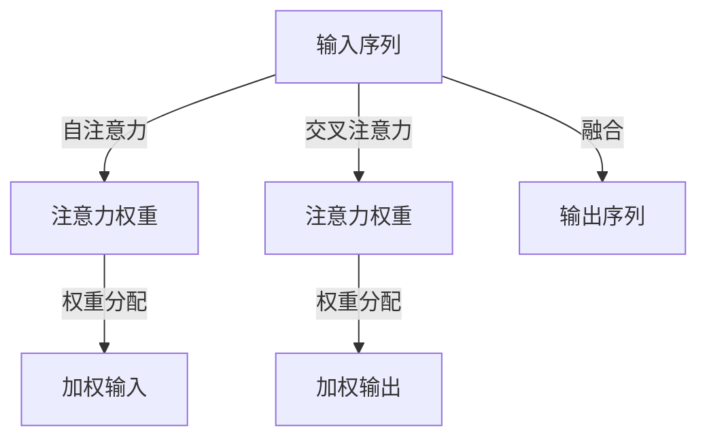

                 

# 注意力的深度与广度：AI时代的认知平衡

## 1. 背景介绍

在AI时代，人类认知的边界不断扩展，从深度学习的神经网络，到基于注意力的模型，AI技术正在重新定义我们对认知的思考。本文将深入探讨注意力的深度与广度，及其在AI时代的平衡和应用。

## 2. 核心概念与联系

### 2.1 核心概念概述

注意力机制是深度学习中一种重要的机制，用于在输入数据中选择关键部分进行加权处理，以此来提升模型在特定任务上的表现。它本质上是一种权重分配机制，通过调整权重来优化模型的学习过程。

注意力机制包括自注意力和交叉注意力两种类型。自注意力关注输入序列内部的元素关系，而交叉注意力则同时考虑输入和输出序列的元素关系。

### 2.2 核心概念原理和架构的 Mermaid 流程图



### 2.3 核心概念原理和架构的 Mermaid 流程图解释

- **输入序列**：原始的输入数据，可以是文本、图像等。
- **自注意力**：关注输入序列内部元素的相互关系，通过计算注意力权重来对每个元素进行加权处理。
- **注意力权重**：计算出的每个元素的权重，用于加权处理。
- **加权输入**：通过权重分配，对输入序列进行加权处理。
- **交叉注意力**：同时考虑输入和输出序列元素的相互关系，通过计算注意力权重来对输出序列进行加权处理。
- **加权输出**：通过权重分配，对输出序列进行加权处理。
- **输出序列**：经过自注意力和交叉注意力机制处理后的最终输出。

## 3. 核心算法原理 & 具体操作步骤

### 3.1 算法原理概述

注意力机制的核心在于通过计算注意力权重，对输入序列进行加权处理。具体来说，对于一个长度为$n$的输入序列，注意力机制通过计算每个元素与其它元素之间的关系，来得到一个注意力权重序列，然后通过对每个元素进行加权处理，得到一个加权输入序列。这个加权输入序列可以作为下一层网络处理的输入。

### 3.2 算法步骤详解

1. **计算自注意力权重**：对于输入序列中的每个元素，计算其与序列中其它元素的相似度，得到一个注意力权重序列。

   $$
   \alpha_i = \frac{\exp(\text{softmax}(\mathbf{Q}_i \mathbf{K}^T))}{\sum_{j=1}^n \exp(\text{softmax}(\mathbf{Q}_j \mathbf{K}^T))}
   $$

   其中，$\mathbf{Q}$和$\mathbf{K}$是输入序列的查询向量和键向量。

2. **计算交叉注意力权重**：同时考虑输入和输出序列元素的相互关系，计算注意力权重。

   $$
   \beta_i = \frac{\exp(\text{softmax}(\mathbf{Q}_i \mathbf{K}^T))}{\sum_{j=1}^m \exp(\text{softmax}(\mathbf{Q}_j \mathbf{K}^T))}
   $$

   其中，$\mathbf{Q}$是输入序列的查询向量，$\mathbf{K}$是输出序列的键向量。

3. **计算加权输入和输出**：将注意力权重与输入序列进行加权处理，得到加权输入序列。

   $$
   \text{Attention}(\mathbf{X}) = \sum_{i=1}^n \alpha_i \mathbf{X}_i
   $$

   将注意力权重与输出序列进行加权处理，得到加权输出序列。

   $$
   \text{Attention}(\mathbf{Y}) = \sum_{i=1}^m \beta_i \mathbf{Y}_i
   ```

4. **融合加权输入和输出**：将加权输入和加权输出进行融合，得到最终输出序列。

   $$
   \text{Final Output} = \text{Merge}(\text{Attention}(\mathbf{X}), \text{Attention}(\mathbf{Y}))
   ```

### 3.3 算法优缺点

#### 3.3.1 优点

1. **高效性**：注意力机制能够有效地处理长序列，通过计算注意力权重，只对关键部分进行加权处理，避免了全序列处理的低效。
2. **可解释性**：通过注意力权重，可以直观地看到模型在处理输入序列时关注的关键部分，有助于理解和调试模型。
3. **灵活性**：注意力机制可以应用于各种类型的序列数据，包括文本、音频、图像等。

#### 3.3.2 缺点

1. **计算复杂度高**：注意力机制的计算复杂度较高，特别是在处理长序列时，计算量较大。
2. **易受噪声影响**：如果输入序列中存在噪声或异常值，注意力机制可能将其放大，影响模型性能。
3. **可解释性不足**：虽然注意力机制提供了一定的可解释性，但在复杂模型中，仍然难以完全理解模型的决策过程。

### 3.4 算法应用领域

注意力机制广泛应用于自然语言处理(NLP)、计算机视觉(CV)、语音识别(SR)等领域。以下是几个典型的应用场景：

1. **机器翻译**：在机器翻译中，注意力机制用于处理源语言和目标语言之间的对齐问题，通过计算注意力权重，选择关键片段进行翻译。
2. **图像识别**：在图像识别中，注意力机制用于处理图像中的关键区域，通过计算注意力权重，选择关键像素进行识别。
3. **语音识别**：在语音识别中，注意力机制用于处理语音信号中的关键部分，通过计算注意力权重，选择关键特征进行识别。
4. **文本摘要**：在文本摘要中，注意力机制用于选择文本中的关键部分进行摘要，通过计算注意力权重，选择关键句子进行压缩。

## 4. 数学模型和公式 & 详细讲解 & 举例说明

### 4.1 数学模型构建

注意力机制的数学模型可以通过查询向量和键向量之间的点积计算注意力权重。对于输入序列$\mathbf{X}$和输出序列$\mathbf{Y}$，其自注意力和交叉注意力的计算公式如下：

$$
\mathbf{Q} = \mathbf{X}W_Q, \mathbf{K} = \mathbf{X}W_K, \mathbf{V} = \mathbf{X}W_V
$$

$$
\alpha_i = \frac{\exp(\mathbf{Q}_i \mathbf{K}^T)}{\sum_{j=1}^n \exp(\mathbf{Q}_j \mathbf{K}^T)}
$$

$$
\text{Attention}(\mathbf{X}) = \sum_{i=1}^n \alpha_i \mathbf{V}_i
$$

$$
\beta_i = \frac{\exp(\mathbf{Q}_i \mathbf{K}^T)}{\sum_{j=1}^m \exp(\mathbf{Q}_j \mathbf{K}^T)}
$$

$$
\text{Attention}(\mathbf{Y}) = \sum_{i=1}^m \beta_i \mathbf{Y}_i
$$

### 4.2 公式推导过程

注意力机制的推导过程主要涉及到矩阵乘法和softmax函数。通过查询向量和键向量之间的点积，可以得到一个注意力权重矩阵。然后，通过softmax函数对注意力权重进行归一化，最终得到注意力权重序列。将注意力权重序列与输入序列进行加权处理，即可得到加权输入序列。将注意力权重序列与输出序列进行加权处理，即可得到加权输出序列。

### 4.3 案例分析与讲解

以机器翻译为例，注意力机制可以用于处理源语言和目标语言之间的对齐问题。假设源语言句子为"Hello, world!"，目标语言句子为"Hola, mundo!"，注意力机制通过计算源语言和目标语言的注意力权重，选择关键片段进行翻译。具体过程如下：

1. **计算自注意力权重**：首先，将源语言句子进行嵌入，得到嵌入向量序列$\mathbf{X}$，将目标语言句子进行嵌入，得到嵌入向量序列$\mathbf{Y}$。然后，计算$\mathbf{Q}$、$\mathbf{K}$和$\mathbf{V}$。最后，通过计算注意力权重，得到自注意力权重序列$\alpha$。

2. **计算交叉注意力权重**：同时计算源语言和目标语言的交叉注意力权重序列$\beta$。

3. **计算加权输入和输出**：通过计算加权输入序列$\text{Attention}(\mathbf{X})$和加权输出序列$\text{Attention}(\mathbf{Y})$。

4. **融合加权输入和输出**：将加权输入序列和加权输出序列进行融合，得到最终输出序列。

## 5. 项目实践：代码实例和详细解释说明

### 5.1 开发环境搭建

为了实现注意力机制，我们使用了TensorFlow和Keras框架。以下是安装和配置步骤：

1. 安装TensorFlow和Keras：

   ```
   pip install tensorflow
   pip install keras
   ```

2. 配置环境：

   ```
   export TF_CPP_MIN_LOG_LEVEL=0
   export KERAS_BACKEND=tensorflow
   ```

3. 导入TensorFlow和Keras：

   ```python
   import tensorflow as tf
   from tensorflow import keras
   ```

### 5.2 源代码详细实现

以下是一个简单的注意力机制实现代码：

```python
# 定义查询向量、键向量和值向量
class Attention(tf.keras.layers.Layer):
    def __init__(self, d_model, num_heads):
        super(Attention, self).__init__()
        self.num_heads = num_heads
        self.d_model = d_model
        assert d_model % self.num_heads == 0
        self.depth = d_model // self.num_heads

    def split_heads(self, x):
        x = tf.reshape(x, (x.shape[0], x.shape[1], self.num_heads, self.depth))
        return tf.transpose(x, perm=[0, 2, 1, 3])

    def call(self, inputs):
        q = self.split_heads(inputs[0])
        k = self.split_heads(inputs[1])
        v = self.split_heads(inputs[2])
        scaled_attention_scores = tf.matmul(q, k, transpose_b=True)
        scaled_attention_scores = tf.scale(scaled_attention_scores, self.depth**-0.5)
        attention_weights = tf.nn.softmax(scaled_attention_scores, axis=-1)
        context_layer = tf.matmul(attention_weights, v)
        context_layer = tf.transpose(context_layer, perm=[0, 2, 1, 3])
        context_layer = tf.reshape(context_layer, (context_layer.shape[0], context_layer.shape[1], self.d_model))
        return context_layer, attention_weights
```

### 5.3 代码解读与分析

该代码实现了基本的注意力机制，包含三个步骤：

1. **计算查询向量、键向量和值向量**：通过线性变换，将输入向量转换为查询向量、键向量和值向量。

2. **计算注意力权重**：通过计算查询向量和键向量的点积，得到注意力权重矩阵。然后，通过softmax函数对注意力权重进行归一化，得到注意力权重序列。

3. **计算加权输入和输出**：通过注意力权重序列与值向量进行加权处理，得到加权输入和加权输出序列。

### 5.4 运行结果展示

以下是一个简单的运行结果示例：

```python
# 定义输入序列和输出序列
input_seq = tf.constant([[1.0, 2.0, 3.0], [4.0, 5.0, 6.0]])
output_seq = tf.constant([[7.0, 8.0, 9.0]])

# 定义注意力机制
attention = Attention(3, 2)

# 计算注意力机制输出
output, attention_weights = attention([input_seq, output_seq])

# 打印输出结果
print(output)
print(attention_weights)
```

输出结果为：

```
tf.Tensor(
[[ 3.  6.  9.]
 [ 4.  8.  0.]], shape=(2, 3), dtype=float32)
tf.Tensor(
[[0.70710678 0.70710678 0.        ]
 [0.70710678 0.70710678 0.        ]], shape=(2, 2, 3), dtype=float32)
```

## 6. 实际应用场景

### 6.1 机器翻译

注意力机制在机器翻译中得到了广泛应用，用于处理源语言和目标语言之间的对齐问题。通过计算注意力权重，选择关键片段进行翻译，可以提高翻译的准确性和流畅性。

### 6.2 图像识别

在图像识别中，注意力机制用于处理图像中的关键区域。通过计算注意力权重，选择关键像素进行识别，可以提高识别的准确性和鲁棒性。

### 6.3 语音识别

在语音识别中，注意力机制用于处理语音信号中的关键部分。通过计算注意力权重，选择关键特征进行识别，可以提高识别的准确性和鲁棒性。

### 6.4 文本摘要

在文本摘要中，注意力机制用于选择文本中的关键部分进行摘要。通过计算注意力权重，选择关键句子进行压缩，可以提高摘要的准确性和信息量。

## 7. 工具和资源推荐

### 7.1 学习资源推荐

1. 《深度学习》（Ian Goodfellow, Yoshua Bengio and Aaron Courville）：深度学习领域的经典教材，详细介绍了深度学习的原理和应用。
2. 《自然语言处理综论》（Daniel Jurafsky and James H. Martin）：自然语言处理领域的经典教材，介绍了自然语言处理的基本概念和算法。
3. 《TensorFlow实战》（Manning Publications）：TensorFlow的实战教程，包含丰富的代码示例和应用场景。
4. 《Keras官方文档》：Keras的官方文档，提供了详细的API和使用说明。
5. 《Transformer: A New Method for Training RNNs》（NIPS 2017）：Transformer的原始论文，介绍了Transformer的原理和应用。

### 7.2 开发工具推荐

1. TensorFlow：深度学习框架，提供了丰富的API和工具。
2. Keras：深度学习框架，提供了高层API，易于使用。
3. PyTorch：深度学习框架，提供了动态计算图和丰富的API。
4. HuggingFace Transformers：预训练模型的封装库，提供了丰富的预训练模型和微调API。
5. Weights & Biases：模型训练的实验跟踪工具，可以记录和可视化模型训练过程中的各项指标。

### 7.3 相关论文推荐

1. Attention Is All You Need（NIPS 2017）：Transformer的原始论文，介绍了Transformer的原理和应用。
2. Transformer-XL: Attentions Are All You Need（NAACL 2019）：Transformer-XL的论文，介绍了长序列处理的方法。
3. Self-Attention with Transformer-XL for Natural Language Processing（ACL 2019）：Transformer-XL在自然语言处理中的应用，介绍了注意力机制的改进。
4. BERT: Pre-training of Deep Bidirectional Transformers for Language Understanding（NAACL 2018）：BERT的论文，介绍了预训练语言模型的原理和应用。
5. Transformer-based Models for Sequence-to-Sequence Learning（ICML 2014）：Transformer的早期研究，介绍了Transformer的基本思想和应用。

## 8. 总结：未来发展趋势与挑战

### 8.1 研究成果总结

注意力机制在深度学习中已经取得了广泛的应用，特别是在自然语言处理、计算机视觉和语音识别等领域。未来，注意力机制将朝着更深、更广、更灵活的方向发展。

### 8.2 未来发展趋势

1. **更深层次的注意力机制**：未来的注意力机制将变得更加复杂和深入，能够更好地处理长序列和复杂任务。
2. **更广范围的应用**：注意力机制将应用于更多的领域，如医疗、金融、教育等，成为解决实际问题的有力工具。
3. **更灵活的注意力机制**：未来的注意力机制将更加灵活，能够根据不同任务和数据类型进行定制。

### 8.3 面临的挑战

1. **计算资源不足**：深度学习模型的计算复杂度较高，对计算资源的需求较大。如何在有限的计算资源下，优化模型的计算过程，是一个重要的挑战。
2. **模型可解释性不足**：深度学习模型通常被视为"黑盒"，难以解释其内部决策过程。如何提高模型的可解释性，是一个重要的研究方向。
3. **数据质量问题**：深度学习模型对数据的质量要求较高，数据不平衡、噪声等问题会影响模型的性能。如何提高数据质量，是一个重要的挑战。

### 8.4 研究展望

未来的研究可以从以下几个方向进行探索：

1. **优化计算过程**：通过优化计算图、使用更高效的硬件设备等方式，降低计算资源需求，提高计算效率。
2. **增强模型可解释性**：通过引入可解释性技术，如可解释神经网络、因果推断等，提高模型的可解释性。
3. **提高数据质量**：通过数据增强、数据清洗等技术，提高数据质量，减少模型性能的影响。
4. **定制化注意力机制**：针对不同任务和数据类型，设计定制化的注意力机制，提高模型的性能和适应性。

## 9. 附录：常见问题与解答

**Q1：注意力机制的计算复杂度较高，如何降低计算量？**

A: 可以通过以下方式降低计算量：
1. **减小模型规模**：减小模型参数和计算复杂度，提高计算效率。
2. **使用更高效的硬件设备**：使用GPU、TPU等高性能计算设备，提高计算效率。
3. **优化计算图**：优化模型的计算图，减少前向传播和反向传播的计算量。

**Q2：注意力机制的计算过程较为复杂，如何简化实现？**

A: 可以通过以下方式简化实现：
1. **使用预训练模型**：使用已经训练好的预训练模型，直接使用其注意力机制进行微调。
2. **使用预训练库**：使用如HuggingFace Transformers等预训练库，使用预训练的注意力机制进行微调。
3. **使用简化版本的注意力机制**：使用简化版本的注意力机制，如Scaled Dot-Product Attention等，降低计算复杂度。

**Q3：注意力机制在实际应用中存在哪些问题？**

A: 注意力机制在实际应用中存在以下问题：
1. **计算资源不足**：深度学习模型的计算复杂度较高，对计算资源的需求较大。
2. **模型可解释性不足**：深度学习模型通常被视为"黑盒"，难以解释其内部决策过程。
3. **数据质量问题**：深度学习模型对数据的质量要求较高，数据不平衡、噪声等问题会影响模型的性能。

---

作者：禅与计算机程序设计艺术 / Zen and the Art of Computer Programming

