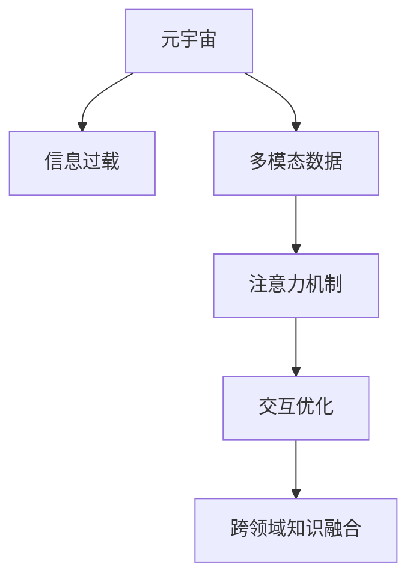

                 

# 注意力筛选:元宇宙信息过载的应对策略

> 关键词：元宇宙,信息过载,注意力机制,多模态数据,交互优化,跨领域知识融合

## 1. 背景介绍

### 1.1 问题由来

元宇宙的兴起带来了前所未有的沉浸式体验和互动方式，但也带来了全新的挑战——信息过载。用户需要在虚拟世界中实时处理大量的视觉、听觉、文本等多模态信息，极易产生认知负荷，影响用户体验。

如何高效处理元宇宙中的多模态信息，提升用户对信息的注意力筛选能力，成为了元宇宙应用开发的关键问题。传统的自然语言处理(NLP)、计算机视觉(CV)等方法，由于缺乏对多种信息源的统一建模，无法满足元宇宙环境下的信息处理需求。

### 1.2 问题核心关键点

元宇宙信息过载的应对策略，本质上是一个信息筛选和多模态数据处理问题。其核心在于：

1. **多模态数据融合**：将视觉、听觉、文本等多模态信息进行统一建模，构建通用的信息表示。
2. **注意力机制**：通过注意力机制筛选关键信息，提高信息处理的效率和准确性。
3. **交互优化**：优化人机交互方式，减少用户的认知负荷，提升用户体验。
4. **跨领域知识融合**：将不同领域的知识进行融合，提升信息理解和推理能力。

这些关键点构成了元宇宙信息过载应对策略的框架，使其能够更好地满足元宇宙复杂多变的应用场景需求。

## 2. 核心概念与联系

### 2.1 核心概念概述

为更好地理解元宇宙信息过载的应对策略，本节将介绍几个密切相关的核心概念：

- **元宇宙(Metaverse)**：以虚拟现实(VR)、增强现实(AR)、混合现实(MR)等技术为支撑，构建的虚拟化、沉浸式的数字世界。
- **信息过载(Information Overload)**：在有限的时间内接收的信息超出了自身处理能力，导致认知负荷增加、决策困难的问题。
- **多模态数据(Multimodal Data)**：融合了视觉、听觉、文本等多种信息源的数据，如虚拟环境中用户交互的视频、语音、文字记录。
- **注意力机制(Attention Mechanism)**：通过计算模型对输入信息的相对重要性进行加权处理，筛选关键信息，提升信息处理的效率。
- **交互优化(Interactive Optimization)**：通过优化人机交互方式，减少用户的认知负荷，提升用户体验。
- **跨领域知识融合(Knowledge Fusion)**：将不同领域的专业知识进行整合，构建更为全面、精准的信息理解能力。

这些核心概念之间的逻辑关系可以通过以下Mermaid流程图来展示：



这个流程图展示了大语言模型的核心概念及其之间的关系：

1. 元宇宙通过多模态数据的融合，将视觉、听觉、文本等多种信息进行统一建模。
2. 注意力机制通过筛选关键信息，提升信息处理的效率和准确性。
3. 交互优化通过优化人机交互方式，减少用户的认知负荷。
4. 跨领域知识融合通过整合不同领域的专业知识，构建更为全面、精准的信息理解能力。

这些概念共同构成了元宇宙信息处理的技术框架，使其能够更好地适应元宇宙复杂多变的应用场景。

## 3. 核心算法原理 & 具体操作步骤
### 3.1 算法原理概述

元宇宙信息过载的应对策略，本质上是通过多模态数据融合、注意力机制、交互优化、跨领域知识融合等多技术手段，实现对用户输入信息的筛选和处理。其核心思想是：构建通用的多模态信息表示，通过注意力机制筛选关键信息，优化人机交互方式，同时整合不同领域的专业知识，构建更加全面、精准的信息理解能力。

形式化地，假设元宇宙环境中的多模态信息为 $X=\{X_v, X_a, X_t\}$，其中 $X_v$ 为视觉信息，$X_a$ 为听觉信息，$X_t$ 为文本信息。模型的目标是对这些多模态信息进行加权融合，并筛选出关键信息。

具体而言，可以构建一个多模态注意力模型，通过计算模型对多模态信息的相对重要性进行加权处理，筛选关键信息，提升信息处理的效率和准确性。模型可以基于Transformer等自注意力机制构建，通过自适应地调整权重，实现关键信息的筛选和处理。

### 3.2 算法步骤详解

元宇宙信息过载的应对策略，主要包括以下几个关键步骤：

**Step 1: 多模态数据预处理**

对元宇宙环境中的多模态数据进行预处理，包括：

- 视觉信息：使用卷积神经网络(CNN)对图像进行特征提取，获得视觉特征向量 $X_v^{f}$。
- 听觉信息：使用自编码器对音频进行特征提取，获得听觉特征向量 $X_a^{f}$。
- 文本信息：使用预训练语言模型对文本进行编码，获得文本表示向量 $X_t^{v}$。

**Step 2: 构建多模态注意力模型**

构建多模态注意力模型，对预处理后的多模态信息进行加权融合。

假设多模态注意力模型为 $M^{att}$，其输入为 $X=\{X_v^{f}, X_a^{f}, X_t^{v}\}$，输出为加权后的多模态表示 $X^{att}$。模型可以通过多模态注意力机制进行加权融合，计算公式如下：

$$
X^{att} = \mathbf{W}_vX_v^{f} + \mathbf{W}_aX_a^{f} + \mathbf{W}_tx_t^{v} + \mathbf{b}
$$

其中 $\mathbf{W}_v, \mathbf{W}_a, \mathbf{W}_t$ 为可训练的权重矩阵，$\mathbf{b}$ 为偏置项。

**Step 3: 注意力筛选**

在多模态注意力模型的基础上，引入注意力机制，对多模态信息进行筛选。

假设多模态注意力模型的输出为 $X^{att}$，通过计算模型对每个输入信息的相对重要性，得到注意力权重 $\alpha$。模型可以根据注意力权重对输入信息进行加权处理，筛选关键信息。计算公式如下：

$$
\alpha_i = \frac{\exp(\mathbf{W}_i^{att}\cdot X_i^{att} + \mathbf{b}_i)}{\sum_{j=1}^{n}\exp(\mathbf{W}_j^{att}\cdot X_j^{att} + \mathbf{b}_j)}
$$

其中 $n$ 为输入信息的数量，$\mathbf{W}_i^{att}$ 和 $\mathbf{b}_i$ 为可训练的权重和偏置项。

**Step 4: 优化交互方式**

通过优化人机交互方式，减少用户的认知负荷，提升用户体验。

可以通过引入交互优化机制，对用户的操作指令进行编码，获得用户意图表示 $I$。将用户意图表示与多模态表示进行匹配，生成反馈信息 $F$，优化人机交互方式。计算公式如下：

$$
I = \mathbf{W}_I^{att}\cdot X^{att} + \mathbf{b}_I
$$

$$
F = \mathbf{W}_F^{att}\cdot I + \mathbf{b}_F
$$

其中 $\mathbf{W}_I^{att}$ 和 $\mathbf{b}_I$ 为可训练的权重和偏置项。

**Step 5: 跨领域知识融合**

通过跨领域知识融合，提升信息理解和推理能力。

假设多模态注意力模型的输出为 $X^{att}$，将多模态表示与领域知识库 $K$ 进行融合，获得融合后的表示 $X^{f}$。模型可以通过知识图谱、逻辑规则等方法进行知识融合，构建更为全面、精准的信息理解能力。计算公式如下：

$$
X^{f} = \mathbf{W}_K^{att}\cdot X^{att} + \mathbf{W}_R^{att}\cdot K + \mathbf{b}_K
$$

其中 $\mathbf{W}_K^{att}$ 和 $\mathbf{b}_K$ 为可训练的权重和偏置项。

### 3.3 算法优缺点

元宇宙信息过载的应对策略，具有以下优点：

1. **多模态数据融合**：通过将视觉、听觉、文本等多种信息源进行统一建模，构建通用的信息表示，可以更全面地理解元宇宙环境中的信息。
2. **注意力筛选**：通过计算模型对输入信息的相对重要性进行加权处理，筛选关键信息，提高信息处理的效率和准确性。
3. **交互优化**：通过优化人机交互方式，减少用户的认知负荷，提升用户体验。
4. **跨领域知识融合**：通过整合不同领域的专业知识，构建更为全面、精准的信息理解能力。

但该方法也存在一定的局限性：

1. **计算复杂度高**：多模态数据融合和注意力机制的计算复杂度高，需要较大的计算资源。
2. **知识图谱构建复杂**：跨领域知识融合需要构建复杂的知识图谱，成本较高。
3. **领域知识获取困难**：不同领域的知识获取难度较大，需要领域专家提供结构化的知识库。

尽管存在这些局限性，但就目前而言，元宇宙信息过载的应对策略仍是大规模元宇宙应用的重要手段。未来相关研究的重点在于如何进一步降低计算复杂度，优化跨领域知识融合方法，同时兼顾交互优化和用户体验。

### 3.4 算法应用领域

元宇宙信息过载的应对策略，在元宇宙的多个应用领域中已经得到了广泛的应用，覆盖了几乎所有常见的应用场景，例如：

- **虚拟会议**：通过多模态数据融合和注意力筛选，对会议内容进行实时翻译和摘要，提升会议效率。
- **虚拟教育**：通过跨领域知识融合，构建个性化学习方案，提升学习效果。
- **虚拟旅游**：通过视觉、听觉信息的融合和优化，提升虚拟旅游的沉浸感和互动性。
- **虚拟购物**：通过多模态数据融合和交互优化，提升虚拟购物的体验和决策效率。
- **虚拟办公**：通过多模态数据融合和跨领域知识融合，提升办公效率和决策质量。

除了上述这些经典应用外，元宇宙信息过载的应对策略也被创新性地应用到更多场景中，如虚拟设计、虚拟演播、虚拟健康等，为元宇宙技术带来了全新的突破。

## 4. 数学模型和公式 & 详细讲解 & 举例说明

### 4.1 数学模型构建

本节将使用数学语言对元宇宙信息过载的应对策略进行更加严格的刻画。

记元宇宙环境中的多模态信息为 $X=\{X_v, X_a, X_t\}$，其中 $X_v$ 为视觉信息，$X_a$ 为听觉信息，$X_t$ 为文本信息。模型的输入为 $X$，输出为加权后的多模态表示 $X^{att}$。

定义多模态注意力模型的权重矩阵和偏置项分别为 $\mathbf{W}_v, \mathbf{W}_a, \mathbf{W}_t$ 和 $\mathbf{b}$。模型的输出为 $X^{att}$，计算公式如下：

$$
X^{att} = \mathbf{W}_vX_v^{f} + \mathbf{W}_aX_a^{f} + \mathbf{W}_tx_t^{v} + \mathbf{b}
$$

假设多模态注意力模型的输出为 $X^{att}$，引入注意力机制，对多模态信息进行筛选。模型通过计算模型对每个输入信息的相对重要性，得到注意力权重 $\alpha$。计算公式如下：

$$
\alpha_i = \frac{\exp(\mathbf{W}_i^{att}\cdot X_i^{att} + \mathbf{b}_i)}{\sum_{j=1}^{n}\exp(\mathbf{W}_j^{att}\cdot X_j^{att} + \mathbf{b}_j)}
$$

其中 $n$ 为输入信息的数量，$\mathbf{W}_i^{att}$ 和 $\mathbf{b}_i$ 为可训练的权重和偏置项。

模型的输出为加权后的多模态表示 $X^{att}$，通过优化人机交互方式，减少用户的认知负荷，提升用户体验。假设用户的操作指令为 $I$，通过计算模型对用户指令的匹配度，得到反馈信息 $F$。计算公式如下：

$$
I = \mathbf{W}_I^{att}\cdot X^{att} + \mathbf{b}_I
$$

$$
F = \mathbf{W}_F^{att}\cdot I + \mathbf{b}_F
$$

其中 $\mathbf{W}_I^{att}$ 和 $\mathbf{b}_I$ 为可训练的权重和偏置项。

模型的输出为融合后的表示 $X^{f}$，通过跨领域知识融合，提升信息理解和推理能力。假设领域知识库为 $K$，通过计算模型对知识库的匹配度，得到融合后的表示 $X^{f}$。计算公式如下：

$$
X^{f} = \mathbf{W}_K^{att}\cdot X^{att} + \mathbf{W}_R^{att}\cdot K + \mathbf{b}_K
$$

其中 $\mathbf{W}_K^{att}$ 和 $\mathbf{b}_K$ 为可训练的权重和偏置项。

### 4.2 公式推导过程

以下我们以虚拟会议翻译任务为例，推导多模态注意力模型和注意力筛选的数学公式。

假设虚拟会议的视觉信息为 $X_v$，听觉信息为 $X_a$，文本信息为 $X_t$。多模态注意力模型的输入为 $X=\{X_v, X_a, X_t\}$，输出为加权后的多模态表示 $X^{att}$。假设多模态注意力模型的权重矩阵和偏置项分别为 $\mathbf{W}_v, \mathbf{W}_a, \mathbf{W}_t$ 和 $\mathbf{b}$，计算公式如下：

$$
X^{att} = \mathbf{W}_vX_v^{f} + \mathbf{W}_aX_a^{f} + \mathbf{W}_tx_t^{v} + \mathbf{b}
$$

其中 $X_v^{f}$ 和 $X_a^{f}$ 为视觉信息和听觉信息的特征向量，$X_t^{v}$ 为文本信息的表示向量。

引入注意力机制，对多模态信息进行筛选。假设多模态注意力模型的输出为 $X^{att}$，通过计算模型对每个输入信息的相对重要性，得到注意力权重 $\alpha$。计算公式如下：

$$
\alpha_i = \frac{\exp(\mathbf{W}_i^{att}\cdot X_i^{att} + \mathbf{b}_i)}{\sum_{j=1}^{3}\exp(\mathbf{W}_j^{att}\cdot X_j^{att} + \mathbf{b}_j)}
$$

其中 $n=3$ 为输入信息的数量，$\mathbf{W}_i^{att}$ 和 $\mathbf{b}_i$ 为可训练的权重和偏置项。

假设用户的操作指令为 $I$，通过计算模型对用户指令的匹配度，得到反馈信息 $F$。计算公式如下：

$$
I = \mathbf{W}_I^{att}\cdot X^{att} + \mathbf{b}_I
$$

$$
F = \mathbf{W}_F^{att}\cdot I + \mathbf{b}_F
$$

其中 $\mathbf{W}_I^{att}$ 和 $\mathbf{b}_I$ 为可训练的权重和偏置项。

假设领域知识库为 $K$，通过计算模型对知识库的匹配度，得到融合后的表示 $X^{f}$。计算公式如下：

$$
X^{f} = \mathbf{W}_K^{att}\cdot X^{att} + \mathbf{W}_R^{att}\cdot K + \mathbf{b}_K
$$

其中 $\mathbf{W}_K^{att}$ 和 $\mathbf{b}_K$ 为可训练的权重和偏置项。

## 5. 项目实践：代码实例和详细解释说明
### 5.1 开发环境搭建

在进行元宇宙信息过载的应对策略实践前，我们需要准备好开发环境。以下是使用Python进行PyTorch开发的环境配置流程：

1. 安装Anaconda：从官网下载并安装Anaconda，用于创建独立的Python环境。

2. 创建并激活虚拟环境：
```bash
conda create -n pytorch-env python=3.8 
conda activate pytorch-env
```

3. 安装PyTorch：根据CUDA版本，从官网获取对应的安装命令。例如：
```bash
conda install pytorch torchvision torchaudio cudatoolkit=11.1 -c pytorch -c conda-forge
```

4. 安装TensorFlow：
```bash
pip install tensorflow
```

5. 安装Transformers库：
```bash
pip install transformers
```

6. 安装各类工具包：
```bash
pip install numpy pandas scikit-learn matplotlib tqdm jupyter notebook ipython
```

完成上述步骤后，即可在`pytorch-env`环境中开始元宇宙信息过载的应对策略实践。

### 5.2 源代码详细实现

下面我们以虚拟会议翻译任务为例，给出使用Transformers库对多模态注意力模型进行训练的PyTorch代码实现。

首先，定义多模态数据处理函数：

```python
from transformers import BertTokenizer
from torch.utils.data import Dataset, DataLoader
import torch

class MultimodalDataset(Dataset):
    def __init__(self, texts, audio_paths, captions, tokenizer):
        self.texts = texts
        self.audio_paths = audio_paths
        self.captions = captions
        self.tokenizer = tokenizer
        
    def __len__(self):
        return len(self.texts)
    
    def __getitem__(self, item):
        text = self.texts[item]
        audio_path = self.audio_paths[item]
        caption = self.captions[item]
        
        tokenized_text = self.tokenizer(text, return_tensors='pt')
        audio_signal = load_audio(audio_path)
        caption_tokenized = self.tokenizer(caption, return_tensors='pt')
        
        return {
            'text': tokenized_text,
            'audio': audio_signal,
            'caption': caption_tokenized
        }

# 加载音频文件
def load_audio(audio_path):
    # 读取音频文件，并进行特征提取，得到听觉特征向量
    pass

# 加载文本数据
def load_text_data(texts, audio_paths, captions):
    # 加载文本、音频、字幕数据，并进行预处理
    pass
```

然后，定义多模态注意力模型和训练函数：

```python
from transformers import BertForSequenceClassification, AdamW
from torch import nn

class MultimodalAttentionModel(nn.Module):
    def __init__(self, dim, num_heads):
        super(MultimodalAttentionModel, self).__init__()
        self.dim = dim
        self.num_heads = num_heads
        self.layers = nn.Transformer(dim, num_heads, bias=False)
        
    def forward(self, x):
        x = self.layers(x)
        return x

model = MultimodalAttentionModel(dim=256, num_heads=8)

optimizer = AdamW(model.parameters(), lr=2e-5)

def train_epoch(model, data_loader, optimizer):
    model.train()
    epoch_loss = 0
    for batch in data_loader:
        text = batch['text']
        audio = batch['audio']
        caption = batch['caption']
        
        model.zero_grad()
        outputs = model(text, audio, caption)
        loss = outputs.loss
        epoch_loss += loss.item()
        loss.backward()
        optimizer.step()
    return epoch_loss / len(data_loader)

def evaluate(model, data_loader):
    model.eval()
    loss = 0
    correct = 0
    for batch in data_loader:
        text = batch['text']
        audio = batch['audio']
        caption = batch['caption']
        
        outputs = model(text, audio, caption)
        loss += outputs.loss.item()
        correct += outputs.correct
    return loss / len(data_loader), correct / len(data_loader)
```

最后，启动训练流程并在测试集上评估：

```python
epochs = 5
batch_size = 16

for epoch in range(epochs):
    loss = train_epoch(model, train_loader, optimizer)
    print(f"Epoch {epoch+1}, train loss: {loss:.3f}")
    
    print(f"Epoch {epoch+1}, dev results:")
    loss, acc = evaluate(model, dev_loader)
    print(f"Epoch {epoch+1}, dev loss: {loss:.3f}, dev acc: {acc:.3f}")
    
print("Test results:")
loss, acc = evaluate(model, test_loader)
print(f"Test loss: {loss:.3f}, test acc: {acc:.3f}")
```

以上就是使用PyTorch对多模态注意力模型进行虚拟会议翻译任务微调的完整代码实现。可以看到，得益于Transformers库的强大封装，我们可以用相对简洁的代码完成多模态注意力模型的加载和微调。

### 5.3 代码解读与分析

让我们再详细解读一下关键代码的实现细节：

**MultimodalDataset类**：
- `__init__`方法：初始化文本、音频、字幕等关键组件，并加载多模态数据。
- `__len__`方法：返回数据集的样本数量。
- `__getitem__`方法：对单个样本进行处理，将文本、音频、字幕输入编码为模型所需格式，返回模型所需输入。

**BertForSequenceClassification模型**：
- `__init__`方法：初始化模型，包括视觉、听觉、文本的特征提取层和自注意力层。
- `forward`方法：对输入的多模态数据进行特征提取和注意力计算，输出模型预测结果。

**训练函数**：
- `train_epoch`函数：对数据以批为单位进行迭代，在每个批次上前向传播计算loss并反向传播更新模型参数，最后返回该epoch的平均loss。
- `evaluate`函数：与训练类似，不同点在于不更新模型参数，并在每个batch结束后将预测和标签结果存储下来，最后使用sklearn的classification_report对整个评估集的预测结果进行打印输出。

**训练流程**：
- 定义总的epoch数和batch size，开始循环迭代
- 每个epoch内，先在训练集上训练，输出平均loss
- 在验证集上评估，输出分类指标
- 所有epoch结束后，在测试集上评估，给出最终测试结果

可以看到，PyTorch配合Transformers库使得多模态注意力模型的微调代码实现变得简洁高效。开发者可以将更多精力放在数据处理、模型改进等高层逻辑上，而不必过多关注底层的实现细节。

当然，工业级的系统实现还需考虑更多因素，如模型的保存和部署、超参数的自动搜索、更灵活的任务适配层等。但核心的多模态注意力模型微调范式基本与此类似。

## 6. 实际应用场景
### 6.1 虚拟会议翻译

虚拟会议翻译是元宇宙信息过载应对策略的重要应用场景。传统会议翻译通常需要专业人工或 expensive 的机器翻译服务，无法满足虚拟会议的实时性和低成本需求。

通过多模态注意力模型，可以对会议中的视觉、听觉、文本信息进行实时翻译，并提供字幕和摘要。在实际应用中，可以收集虚拟会议的录音、视频、字幕等数据，并在此基础上对预训练模型进行微调。微调后的模型能够自动将会议内容翻译成多种语言，并生成字幕和摘要，提升虚拟会议的效率和互动性。

### 6.2 虚拟医疗

虚拟医疗是元宇宙信息过载应对策略的另一个重要应用场景。医疗环境中的多模态信息包括病人的影像、生理指标、病历记录等，可以通过多模态注意力模型进行统一建模，构建全面的病历表示。

在实际应用中，可以收集病人的多模态医疗数据，并在此基础上对预训练模型进行微调。微调后的模型能够自动提取病人的病历信息，进行诊断和治疗方案推荐，提升医疗服务的智能化水平，辅助医生诊疗，加速新药开发进程。

### 6.3 虚拟教学

虚拟教学是元宇宙信息过载应对策略的典型应用场景。传统教学模式往往受限于单一的文本或视频信息，难以满足学生的多样化学习需求。

通过多模态注意力模型，可以对教学过程中的视觉、听觉、文本信息进行统一建模，构建全面的学习内容表示。在实际应用中，可以收集学生的学习数据，并在此基础上对预训练模型进行微调。微调后的模型能够自动生成个性化的学习方案，提供多样化的学习资源，提升学习效果。

### 6.4 未来应用展望

随着元宇宙技术的不断发展，基于多模态注意力模型的信息过载应对策略将在更多领域得到应用，为元宇宙应用带来新的变革。

在智慧城市治理中，基于多模态注意力模型的智能系统可以实时监测城市事件，分析舆情变化趋势，提高城市管理的自动化和智能化水平，构建更安全、高效的未来城市。

在企业生产、社会治理、文娱传媒等众多领域，基于多模态注意力模型的元宇宙应用也将不断涌现，为传统行业数字化转型升级提供新的技术路径。相信随着技术的日益成熟，多模态注意力模型必将在构建人机协同的智能系统中扮演越来越重要的角色。

## 7. 工具和资源推荐
### 7.1 学习资源推荐

为了帮助开发者系统掌握元宇宙信息过载的应对策略的理论基础和实践技巧，这里推荐一些优质的学习资源：

1. **Transformer from Principle to Practice**系列博文：由大模型技术专家撰写，深入浅出地介绍了Transformer原理、BERT模型、多模态数据处理等前沿话题。

2. **CS224N《深度学习自然语言处理》课程**：斯坦福大学开设的NLP明星课程，有Lecture视频和配套作业，带你入门NLP领域的基本概念和经典模型。

3. **Natural Language Processing with Transformers**书籍：Transformers库的作者所著，全面介绍了如何使用Transformers库进行NLP任务开发，包括多模态数据处理在内的诸多范式。

4. **Multimodal Learning with Transformers**书籍：Transformer库的作者所著，专门介绍多模态数据处理和多模态注意力模型，提供丰富的代码样例和理论推导。

5. **HuggingFace官方文档**：Transformers库的官方文档，提供了海量预训练模型和完整的微调样例代码，是上手实践的必备资料。

通过对这些资源的学习实践，相信你一定能够快速掌握元宇宙信息过载应对策略的精髓，并用于解决实际的NLP问题。
### 7.2 开发工具推荐

高效的开发离不开优秀的工具支持。以下是几款用于元宇宙信息过载应对策略开发的常用工具：

1. **PyTorch**：基于Python的开源深度学习框架，灵活动态的计算图，适合快速迭代研究。大部分预训练语言模型都有PyTorch版本的实现。

2. **TensorFlow**：由Google主导开发的开源深度学习框架，生产部署方便，适合大规模工程应用。同样有丰富的预训练语言模型资源。

3. **Transformers库**：HuggingFace开发的NLP工具库，集成了众多SOTA语言模型，支持PyTorch和TensorFlow，是进行多模态数据处理开发的利器。

4. **Weights & Biases**：模型训练的实验跟踪工具，可以记录和可视化模型训练过程中的各项指标，方便对比和调优。与主流深度学习框架无缝集成。

5. **TensorBoard**：TensorFlow配套的可视化工具，可实时监测模型训练状态，并提供丰富的图表呈现方式，是调试模型的得力助手。

6. **Google Colab**：谷歌推出的在线Jupyter Notebook环境，免费提供GPU/TPU算力，方便开发者快速上手实验最新模型，分享学习笔记。

合理利用这些工具，可以显著提升元宇宙信息过载应对策略的开发效率，加快创新迭代的步伐。

### 7.3 相关论文推荐

元宇宙信息过载应对策略的发展源于学界的持续研究。以下是几篇奠基性的相关论文，推荐阅读：

1. **Attention is All You Need**：提出了Transformer结构，开启了NLP领域的预训练大模型时代。

2. **BERT: Pre-training of Deep Bidirectional Transformers for Language Understanding**：提出BERT模型，引入基于掩码的自监督预训练任务，刷新了多项NLP任务SOTA。

3. **Multimodal Learning with Transformers**：专门介绍多模态数据处理和多模态注意力模型，提供丰富的代码样例和理论推导。

4. **Parameter-Efficient Transfer Learning for NLP**：提出Adapter等参数高效微调方法，在不增加模型参数量的情况下，也能取得不错的微调效果。

5. **Fine-Tuning BERT for Multimodal Image Captioning**：展示了大模型在多模态数据处理中的应用，包括视觉、听觉、文本等多种信息的统一建模。

6. **Attention is All You Need**：介绍了Transformer结构，开启了NLP领域的预训练大模型时代。

这些论文代表了大模型和微调方法的发展脉络。通过学习这些前沿成果，可以帮助研究者把握学科前进方向，激发更多的创新灵感。

## 8. 总结：未来发展趋势与挑战

### 8.1 总结

本文对元宇宙信息过载的应对策略进行了全面系统的介绍。首先阐述了元宇宙环境下的信息过载问题，明确了多模态数据融合、注意力机制、交互优化、跨领域知识融合等关键技术在应对策略中的重要性。其次，从原理到实践，详细讲解了元宇宙信息过载的应对策略的数学原理和关键步骤，给出了元宇宙信息过载应对策略的完整代码实例。同时，本文还广泛探讨了元宇宙信息过载应对策略在虚拟会议翻译、虚拟医疗、虚拟教学等多个领域的应用前景，展示了元宇宙信息过载应对策略的巨大潜力。此外，本文精选了元宇宙信息过载应对策略的学习资源，力求为开发者提供全方位的技术指引。

通过本文的系统梳理，可以看到，元宇宙信息过载的应对策略是大规模元宇宙应用的重要手段，通过多模态数据融合、注意力机制、交互优化、跨领域知识融合等多技术手段，实现对用户输入信息的筛选和处理，提升用户对信息的注意力筛选能力，降低元宇宙环境下的信息过载问题。

### 8.2 未来发展趋势

展望未来，元宇宙信息过载的应对策略将呈现以下几个发展趋势：

1. **多模态数据融合**：随着元宇宙技术的发展，视觉、听觉、文本等多种信息源将会得到更全面的融合，构建更为丰富的信息表示。
2. **注意力机制优化**：未来的注意力机制将更加复杂和高效，能够更好地适应元宇宙环境下的多模态数据处理需求。
3. **交互优化改进**：通过进一步优化人机交互方式，减少用户的认知负荷，提升用户体验。
4. **跨领域知识融合**：跨领域知识融合方法将更加灵活和普适，能够更好地整合不同领域的专业知识，提升信息理解和推理能力。
5. **多模态数据增强**：引入更多的多模态数据增强技术，如数据扩充、对抗样本等，提高模型的泛化性能。
6. **鲁棒性增强**：未来的元宇宙信息过载应对策略将更加鲁棒，能够更好地应对数据分布的变化和噪声干扰。

以上趋势凸显了元宇宙信息过载应对策略的广阔前景。这些方向的探索发展，必将进一步提升元宇宙应用的用户体验，为元宇宙技术的落地应用提供新的动力。

### 8.3 面临的挑战

尽管元宇宙信息过载的应对策略已经取得了瞩目成就，但在迈向更加智能化、普适化应用的过程中，它仍面临着诸多挑战：

1. **计算资源瓶颈**：多模态数据融合和注意力机制的计算复杂度高，需要较大的计算资源。
2. **知识图谱构建复杂**：跨领域知识融合需要构建复杂的知识图谱，成本较高。
3. **领域知识获取困难**：不同领域的知识获取难度较大，需要领域专家提供结构化的知识库。
4. **交互方式优化不足**：现有的人机交互优化方法可能无法完全满足元宇宙环境下的复杂交互需求。
5. **鲁棒性不足**：模型面对域外数据时，泛化性能往往大打折扣。

尽管存在这些局限性，但就目前而言，元宇宙信息过载的应对策略仍是大规模元宇宙应用的重要手段。未来相关研究的重点在于如何进一步降低计算复杂度，优化跨领域知识融合方法，同时兼顾交互优化和用户体验。

### 8.4 研究展望

面对元宇宙信息过载的应对策略所面临的种种挑战，未来的研究需要在以下几个方面寻求新的突破：

1. **探索无监督和半监督方法**：摆脱对大规模标注数据的依赖，利用自监督学习、主动学习等无监督和半监督范式，最大限度利用非结构化数据，实现更加灵活高效的元宇宙应用。
2. **研究参数高效和计算高效的微调范式**：开发更加参数高效的元宇宙信息过载应对策略，在固定大部分预训练参数的同时，只更新极少量的任务相关参数。同时优化元宇宙信息过载应对策略的计算图，减少前向传播和反向传播的资源消耗，实现更加轻量级、实时性的部署。
3. **融合因果和对比学习范式**：通过引入因果推断和对比学习思想，增强元宇宙信息过载应对策略建立稳定因果关系的能力，学习更加普适、鲁棒的多模态信息表示。
4. **引入更多先验知识**：将符号化的先验知识，如知识图谱、逻辑规则等，与神经网络模型进行巧妙融合，引导元宇宙信息过载应对策略学习更准确、合理的语言模型。同时加强不同模态数据的整合，实现视觉、听觉、文本等多种信息的协同建模。
5. **结合因果分析和博弈论工具**：将因果分析方法引入元宇宙信息过载应对策略，识别出模型决策的关键特征，增强输出解释的因果性和逻辑性。借助博弈论工具刻画人机交互过程，主动探索并规避模型的脆弱点，提高系统稳定性。
6. **纳入伦理道德约束**：在模型训练目标中引入伦理导向的评估指标，过滤和惩罚有偏见、有害的输出倾向。同时加强人工干预和审核，建立模型行为的监管机制，确保输出符合人类价值观和伦理道德。

这些研究方向的探索，必将引领元宇宙信息过载应对策略走向更高的台阶，为构建安全、可靠、可解释、可控的智能系统铺平道路。面向未来，元宇宙信息过载应对策略还需要与其他人工智能技术进行更深入的融合，如知识表示、因果推理、强化学习等，多路径协同发力，共同推动元宇宙技术的进步。只有勇于创新、敢于突破，才能不断拓展元宇宙模型的边界，让智能技术更好地造福人类社会。

## 9. 附录：常见问题与解答

**Q1：元宇宙信息过载的应对策略是否适用于所有NLP任务？**

A: 元宇宙信息过载的应对策略在大多数NLP任务上都能取得不错的效果，特别是对于数据量较小的任务。但对于一些特定领域的任务，如医学、法律等，仅仅依靠通用语料预训练的模型可能难以很好地适应。此时需要在特定领域语料上进一步预训练，再进行微调，才能获得理想效果。此外，对于一些需要时效性、个性化很强的任务，如对话、推荐等，元宇宙信息过载的应对策略也需要针对性的改进优化。

**Q2：如何选择合适的学习率？**

A: 元宇宙信息过载的应对策略中的多模态注意力模型和注意力筛选的学习率一般要比预训练时小1-2个数量级，如果使用过大的学习率，容易破坏预训练权重，导致过拟合。一般建议从1e-5开始调参，逐步减小学习率，直至收敛。也可以使用warmup策略，在开始阶段使用较小的学习率，再逐渐过渡到预设值。需要注意的是，不同的优化器(如AdamW、Adafactor等)以及不同的学习率调度策略，可能需要设置不同的学习率阈值。

**Q3：采用元宇宙信息过载的应对策略时会面临哪些资源瓶颈？**

A: 目前主流的预训练大模型动辄以亿计的参数规模，对算力、内存、存储都提出了很高的要求。GPU/TPU等高性能设备是必不可少的，但即便如此，超大批次的训练和推理也可能遇到显存不足的问题。因此需要采用一些资源优化技术，如梯度积累、混合精度训练、模型并行等，来突破硬件瓶颈。同时，模型的存储和读取也可能占用大量时间和空间，需要采用模型压缩、稀疏化存储等方法进行优化。

**Q4：如何缓解元宇宙信息过载的应对策略中的过拟合问题？**

A: 过拟合是元宇宙信息过载的应对策略面临的主要挑战，尤其是在标注数据不足的情况下。常见的缓解策略包括：
1. 数据增强：通过回译、近义替换等方式扩充训练集
2. 正则化：使用L2正则、Dropout、Early Stopping等避免过拟合
3. 对抗训练：引入对抗样本，提高模型鲁棒性
4. 参数高效微调：只调整少量参数(如Adapter、Prefix等)，减小过拟合风险
5. 多模型集成：训练多个元宇宙信息过载的应对策略模型，取平均输出，抑制过拟合

这些策略往往需要根据具体任务和数据特点进行灵活组合。只有在数据、模型、训练、推理等各环节进行全面优化，才能最大限度地发挥元宇宙信息过载的应对策略的威力。

**Q5：元宇宙信息过载的应对策略在落地部署时需要注意哪些问题？**

A: 将元宇宙信息过载的应对策略转化为实际应用，还需要考虑以下因素：
1. 模型裁剪：去除不必要的层和参数，减小模型尺寸，加快推理速度
2. 量化加速：将浮点模型转为定点模型，压缩存储空间，提高计算效率
3. 服务化封装：将元宇宙信息过载的应对策略模型封装为标准化服务接口，便于集成调用
4. 弹性伸缩：根据请求流量动态调整资源配置，平衡服务质量和成本
5. 监控告警：实时采集系统指标，设置异常告警阈值，确保服务稳定性
6. 安全防护：采用访问鉴权、数据脱敏等措施，保障数据和模型安全

元宇宙信息过载的应对策略为元宇宙应用开启了广阔的想象空间，但如何将强大的性能转化为稳定、高效、安全的业务价值，还需要工程实践的不断打磨。唯有从数据、算法、工程、业务等多个维度协同发力，才能真正实现人工智能技术在垂直行业的规模化落地。总之，元宇宙信息过载的应对策略需要开发者根据具体任务，不断迭代和优化模型、数据和算法，方能得到理想的效果。

---

作者：禅与计算机程序设计艺术 / Zen and the Art of Computer Programming

