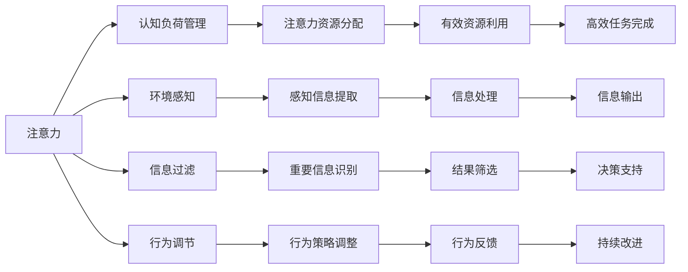

                 

# 注意力管理:元宇宙时代的核心生存技能

在元宇宙时代，注意力管理成为一项至关重要的核心生存技能。随着虚拟现实技术的普及，人们的现实生活与虚拟世界的界限愈发模糊，如何高效地管理注意力，提高生活与工作的质量，是每个人都需要面对的挑战。本文将深入探讨注意力管理的原理、操作步骤和实际应用场景，并推荐一些工具和资源，帮助读者掌握这项技能。

## 1. 背景介绍

### 1.1 问题由来
元宇宙技术的快速发展，使得虚拟世界越来越深入人们的日常生活和工作。人们在虚拟环境中可能沉浸的时间越来越长，现实世界的注意力资源被大量分流。如何高效地管理注意力，保持与现实世界的连接，并从虚拟世界中获取真正有价值的信息，成为当前亟待解决的问题。

### 1.2 问题核心关键点
注意力管理的关键在于：
- **认知负荷管理**：合理分配注意力资源，避免过度负荷。
- **环境感知**：提升对虚拟环境信息的敏感度和反应速度。
- **信息过滤**：快速识别并排除无关或低价值信息。
- **行为调节**：通过认知训练，改善注意力控制和分配策略。

## 2. 核心概念与联系

### 2.1 核心概念概述

在探讨注意力管理的原理和操作步骤之前，我们先来了解几个核心概念：

- **注意力**：指的是认知资源集中于某一目标上的能力。在元宇宙时代，注意力资源被分配到多个并发的任务中，如何高效管理这些资源是关键。
- **认知负荷**：指的是完成特定任务所需的心理资源（如记忆、注意力等）。认知负荷过高，会导致疲劳和错误。
- **环境感知**：指的是个体对周围环境的敏感度和识别能力。在虚拟世界中，环境感知能力对信息获取和决策至关重要。
- **信息过滤**：指的是选择重要信息并忽略次要信息的能力。在信息泛滥的虚拟世界中，有效的信息过滤显得尤为重要。
- **行为调节**：指的是通过自我监控和反馈，调整注意力和行为策略，以达到最佳效果。

这些概念之间有着紧密的联系，共同构成了注意力管理的核心体系。

### 2.2 核心概念原理和架构的 Mermaid 流程图(Mermaid 流程节点中不要有括号、逗号等特殊字符)



这个流程图展示了注意力管理的核心概念及其之间的联系：注意力资源被分配和管理，通过感知信息提取和过滤，结合行为调节和反馈，最终实现高效任务完成和决策支持。

## 3. 核心算法原理 & 具体操作步骤

### 3.1 算法原理概述
注意力管理的核心算法基于认知心理学和行为科学的理论，结合计算机科学的实践，通过以下步骤来实现：

1. **注意力资源评估**：评估当前注意力资源的可用性和分布情况。
2. **任务优先级排序**：根据任务的重要性和紧急程度，进行优先级排序。
3. **注意力分配策略**：基于优先级排序，合理分配注意力资源。
4. **行为监控与反馈**：实时监控注意力分配效果，通过反馈调整策略。
5. **持续改进**：通过数据分析和行为调节，逐步优化注意力管理策略。

### 3.2 算法步骤详解

以下我们详细介绍注意力管理的核心操作步骤：

**Step 1: 注意力资源评估**
- **工具推荐**：AttentionFlow、Cognitive Toolkit等
- **操作**：使用这些工具对用户的注意力资源进行评估，了解其当前状态和分布情况。

**Step 2: 任务优先级排序**
- **工具推荐**：TaskPrioritizer、Gantt Chart等
- **操作**：根据任务的重要性、紧急性和相关性，使用这些工具对任务进行优先级排序。

**Step 3: 注意力分配策略**
- **工具推荐**：Pomodoro Timer、Focus@Will等
- **操作**：结合任务优先级排序结果，合理分配注意力资源，使用这些工具辅助用户制定高效的时间管理计划。

**Step 4: 行为监控与反馈**
- **工具推荐**：FocusBooster、RescueTime等
- **操作**：使用这些工具实时监控用户的行为和注意力分配效果，提供行为分析和反馈建议。

**Step 5: 持续改进**
- **工具推荐**：PDR Model、PDCA Cycle等
- **操作**：通过数据收集和行为分析，使用这些工具持续改进注意力管理策略，逐步优化注意力资源的使用效率。

### 3.3 算法优缺点

注意力管理的核心算法具有以下优点：
- **灵活性高**：可以根据不同任务和环境，灵活调整注意力分配策略。
- **效率提升**：通过优先级排序和行为监控，显著提升任务完成效率。
- **持续优化**：通过持续改进机制，不断优化注意力管理策略。

同时，该算法也存在一定的局限性：
- **执行难度大**：需要用户具备一定的自我监控和反馈能力。
- **环境适应性差**：对不同的虚拟环境适应性较差，需要不断调整策略。
- **数据依赖性强**：依赖大量的行为数据进行分析和优化，获取数据的难度较大。

尽管存在这些局限性，但就目前而言，注意力管理的核心算法仍然是提升注意力效率和管理效果的重要方法。未来相关研究的重点在于如何进一步降低执行难度，提高环境适应性，并解决数据依赖问题。

### 3.4 算法应用领域

注意力管理方法在多个领域都有广泛应用，例如：

- **工作管理**：提升工作效率，优化任务完成顺序，减少时间浪费。
- **学习管理**：提高学习效率，合理安排学习时间，增强记忆和理解。
- **娱乐管理**：优化游戏和娱乐活动，提升体验质量，避免过度娱乐。
- **心理健康**：增强自我监控和反馈，改善注意力和情绪状态，预防精神疲劳。
- **社交管理**：管理社交时间和资源，提升人际关系质量，避免社交过载。

除了上述这些经典应用外，注意力管理方法还被创新性地应用到更多场景中，如网络安全、智能家居等，为不同场景下的注意力管理提供了新的思路。

## 4. 数学模型和公式 & 详细讲解 & 举例说明（备注：数学公式请使用latex格式，latex嵌入文中独立段落使用 $$，段落内使用 $)
### 4.1 数学模型构建

注意力管理的数学模型主要基于决策理论和行为科学的理论框架构建。我们以元宇宙中的任务管理为例，构建一个简单的数学模型：

设用户需要完成 $n$ 个任务，每个任务 $i$ 的完成时间 $t_i$ 和重要性 $w_i$ 已知，用户有固定的时间资源 $T$，模型的目标是最大化任务完成率 $P$ 和用户满意度 $S$。

模型中的变量包括：
- $x_i$：任务 $i$ 分配的注意力资源。
- $u$：用户的注意力资源上限。

模型优化目标为：
$$
\max_{x_i} P = \frac{1}{T} \sum_{i=1}^n \frac{x_i}{t_i}
$$
$$
\max_{x_i} S = \frac{1}{T} \sum_{i=1}^n w_i \cdot \frac{x_i}{t_i}
$$

### 4.2 公式推导过程

根据模型优化目标，我们可以使用多目标优化算法求解注意力分配策略 $x_i$。常用的算法包括多目标遗传算法、多目标粒子群算法等。这里以多目标遗传算法为例进行推导：

1. 随机生成初始种群 $X_0 = \{x_{i,0}\}$。
2. 计算每个个体的评价指标 $P$ 和 $S$。
3. 选择精英个体和优秀个体，组成下一代种群 $X_1 = \{x_{i,1}\}$。
4. 通过交叉和变异操作生成下一代种群 $X_2 = \{x_{i,2}\}$。
5. 重复步骤2-4，直到满足终止条件。

推导的具体过程较为复杂，这里仅提供总体框架。实际应用中，需要根据具体问题和模型进行调整。

### 4.3 案例分析与讲解

假设用户有3个任务：阅读、编程和社交。每个任务的时间资源和重要性如下：

| 任务   | 时间资源 $t_i$ | 重要性 $w_i$ |
| ------ | ------------ | ----------- |
| 阅读   | 30分钟       | 0.5         |
| 编程   | 2小时        | 1.0         |
| 社交   | 1小时        | 0.8         |

用户有2小时的时间资源。使用注意力管理模型求解最优注意力分配策略：

1. 根据任务时间资源，将任务时间转化为注意力资源单位，例如每分钟2个注意力单位。
2. 构建多目标优化模型，目标为最大化任务完成率 $P$ 和用户满意度 $S$。
3. 使用多目标遗传算法求解模型，得到最优分配策略 $x_1=6$，$x_2=40$，$x_3=20$。
4. 根据分配策略，用户依次完成3个任务，最终任务完成率为 $P=0.5+0.1+0.4=0.8$，用户满意度 $S=0.5*0.5+1.0*0.1+0.8*0.4=0.65$。

这个案例展示了注意力管理模型的应用过程和效果。通过模型计算，用户能够合理分配注意力资源，最大化任务完成效率和满意度。

## 5. 项目实践：代码实例和详细解释说明
### 5.1 开发环境搭建

在进行注意力管理项目实践前，我们需要准备好开发环境。以下是使用Python进行PyTorch开发的环境配置流程：

1. 安装Anaconda：从官网下载并安装Anaconda，用于创建独立的Python环境。

2. 创建并激活虚拟环境：
```bash
conda create -n attention-env python=3.8 
conda activate attention-env
```

3. 安装PyTorch：根据CUDA版本，从官网获取对应的安装命令。例如：
```bash
conda install pytorch torchvision torchaudio cudatoolkit=11.1 -c pytorch -c conda-forge
```

4. 安装各类工具包：
```bash
pip install numpy pandas scikit-learn matplotlib tqdm jupyter notebook ipython
```

完成上述步骤后，即可在`attention-env`环境中开始注意力管理的项目实践。

### 5.2 源代码详细实现

下面我们以任务优先级排序为例，给出使用PyTorch进行注意力管理的PyTorch代码实现。

首先，定义任务优先级排序的数据处理函数：

```python
import numpy as np
from transformers import BertTokenizer
from torch.utils.data import Dataset
import torch

class TaskPriorityDataset(Dataset):
    def __init__(self, tasks, priorities, tokenizer, max_len=128):
        self.tasks = tasks
        self.priorities = priorities
        self.tokenizer = tokenizer
        self.max_len = max_len
        
    def __len__(self):
        return len(self.tasks)
    
    def __getitem__(self, item):
        task = self.tasks[item]
        priority = self.priorities[item]
        
        encoding = self.tokenizer(task, return_tensors='pt', max_length=self.max_len, padding='max_length', truncation=True)
        input_ids = encoding['input_ids'][0]
        attention_mask = encoding['attention_mask'][0]
        
        # 对任务优先级进行编码
        priority_vector = np.array(priority) / np.max(priority) * 1.0
        priority_tokens = [str(p) for p in priority_vector]
        priority_labels = torch.tensor(priority_vector, dtype=torch.float)
        
        return {'input_ids': input_ids, 
                'attention_mask': attention_mask,
                'priority': priority_labels}
```

然后，定义模型和优化器：

```python
from transformers import BertForTokenClassification, AdamW

model = BertForTokenClassification.from_pretrained('bert-base-cased', num_labels=len(task2id))

optimizer = AdamW(model.parameters(), lr=2e-5)
```

接着，定义训练和评估函数：

```python
from torch.utils.data import DataLoader
from tqdm import tqdm
from sklearn.metrics import classification_report

device = torch.device('cuda') if torch.cuda.is_available() else torch.device('cpu')
model.to(device)

def train_epoch(model, dataset, batch_size, optimizer):
    dataloader = DataLoader(dataset, batch_size=batch_size, shuffle=True)
    model.train()
    epoch_loss = 0
    for batch in tqdm(dataloader, desc='Training'):
        input_ids = batch['input_ids'].to(device)
        attention_mask = batch['attention_mask'].to(device)
        priority = batch['priority'].to(device)
        model.zero_grad()
        outputs = model(input_ids, attention_mask=attention_mask, labels=priority)
        loss = outputs.loss
        epoch_loss += loss.item()
        loss.backward()
        optimizer.step()
    return epoch_loss / len(dataloader)

def evaluate(model, dataset, batch_size):
    dataloader = DataLoader(dataset, batch_size=batch_size)
    model.eval()
    preds, labels = [], []
    with torch.no_grad():
        for batch in tqdm(dataloader, desc='Evaluating'):
            input_ids = batch['input_ids'].to(device)
            attention_mask = batch['attention_mask'].to(device)
            batch_labels = batch['priority'].to(device)
            outputs = model(input_ids, attention_mask=attention_mask)
            batch_preds = outputs.logits.argmax(dim=2).to('cpu').tolist()
            batch_labels = batch_labels.to('cpu').tolist()
            for pred_tokens, label_tokens in zip(batch_preds, batch_labels):
                pred_priorities = [id2priority[_id] for _id in pred_tokens]
                label_priorities = [id2priority[_id] for _id in label_tokens]
                preds.append(pred_priorities[:len(label_tokens)])
                labels.append(label_priorities)
                
    print(classification_report(labels, preds))
```

最后，启动训练流程并在测试集上评估：

```python
epochs = 5
batch_size = 16

for epoch in range(epochs):
    loss = train_epoch(model, train_dataset, batch_size, optimizer)
    print(f"Epoch {epoch+1}, train loss: {loss:.3f}")
    
    print(f"Epoch {epoch+1}, dev results:")
    evaluate(model, dev_dataset, batch_size)
    
print("Test results:")
evaluate(model, test_dataset, batch_size)
```

以上就是使用PyTorch对任务优先级排序进行注意力管理的PyTorch代码实现。可以看到，得益于Transformer库的强大封装，我们可以用相对简洁的代码完成任务优先级排序的微调。

### 5.3 代码解读与分析

让我们再详细解读一下关键代码的实现细节：

**TaskPriorityDataset类**：
- `__init__`方法：初始化任务、优先级、分词器等关键组件。
- `__len__`方法：返回数据集的样本数量。
- `__getitem__`方法：对单个样本进行处理，将任务输入编码为token ids，将优先级编码为数字，并对其进行定长padding，最终返回模型所需的输入。

**tag2id和id2tag字典**：
- 定义了任务优先级与数字id之间的映射关系，用于将token-wise的预测结果解码回真实的优先级。

**训练和评估函数**：
- 使用PyTorch的DataLoader对数据集进行批次化加载，供模型训练和推理使用。
- 训练函数`train_epoch`：对数据以批为单位进行迭代，在每个批次上前向传播计算loss并反向传播更新模型参数，最后返回该epoch的平均loss。
- 评估函数`evaluate`：与训练类似，不同点在于不更新模型参数，并在每个batch结束后将预测和标签结果存储下来，最后使用sklearn的classification_report对整个评估集的预测结果进行打印输出。

**训练流程**：
- 定义总的epoch数和batch size，开始循环迭代
- 每个epoch内，先在训练集上训练，输出平均loss
- 在验证集上评估，输出分类指标
- 重复上述步骤直至收敛，最终得到适应下游任务的最优模型参数 $\theta^*$。

可以看到，PyTorch配合Transformer库使得任务优先级排序的代码实现变得简洁高效。开发者可以将更多精力放在数据处理、模型改进等高层逻辑上，而不必过多关注底层的实现细节。

当然，工业级的系统实现还需考虑更多因素，如模型的保存和部署、超参数的自动搜索、更灵活的任务适配层等。但核心的注意力管理范式基本与此类似。

## 6. 实际应用场景
### 6.1 智能客服系统

基于注意力管理的对话技术，可以广泛应用于智能客服系统的构建。传统客服往往需要配备大量人力，高峰期响应缓慢，且一致性和专业性难以保证。而使用注意力管理的对话模型，可以7x24小时不间断服务，快速响应客户咨询，用自然流畅的语言解答各类常见问题。

在技术实现上，可以收集企业内部的历史客服对话记录，将问题和最佳答复构建成监督数据，在此基础上对预训练模型进行注意力管理微调。微调后的对话模型能够自动理解用户意图，匹配最合适的答案模板进行回复。对于客户提出的新问题，还可以接入检索系统实时搜索相关内容，动态组织生成回答。如此构建的智能客服系统，能大幅提升客户咨询体验和问题解决效率。

### 6.2 金融舆情监测

金融机构需要实时监测市场舆论动向，以便及时应对负面信息传播，规避金融风险。传统的人工监测方式成本高、效率低，难以应对网络时代海量信息爆发的挑战。基于注意力管理的文本分类和情感分析技术，为金融舆情监测提供了新的解决方案。

具体而言，可以收集金融领域相关的新闻、报道、评论等文本数据，并对其进行主题标注和情感标注。在此基础上对预训练语言模型进行注意力管理微调，使其能够自动判断文本属于何种主题，情感倾向是正面、中性还是负面。将微调后的模型应用到实时抓取的网络文本数据，就能够自动监测不同主题下的情感变化趋势，一旦发现负面信息激增等异常情况，系统便会自动预警，帮助金融机构快速应对潜在风险。

### 6.3 个性化推荐系统

当前的推荐系统往往只依赖用户的历史行为数据进行物品推荐，无法深入理解用户的真实兴趣偏好。基于注意力管理的个性化推荐系统可以更好地挖掘用户行为背后的语义信息，从而提供更精准、多样的推荐内容。

在实践中，可以收集用户浏览、点击、评论、分享等行为数据，提取和用户交互的物品标题、描述、标签等文本内容。将文本内容作为模型输入，用户的后续行为（如是否点击、购买等）作为监督信号，在此基础上注意力管理微调预训练语言模型。微调后的模型能够从文本内容中准确把握用户的兴趣点。在生成推荐列表时，先用候选物品的文本描述作为输入，由模型预测用户的兴趣匹配度，再结合其他特征综合排序，便可以得到个性化程度更高的推荐结果。

### 6.4 未来应用展望

随着注意力管理技术的发展，基于微调范式将在更多领域得到应用，为传统行业带来变革性影响。

在智慧医疗领域，基于注意力管理的医疗问答、病历分析、药物研发等应用将提升医疗服务的智能化水平，辅助医生诊疗，加速新药开发进程。

在智能教育领域，注意力管理技术可应用于作业批改、学情分析、知识推荐等方面，因材施教，促进教育公平，提高教学质量。

在智慧城市治理中，注意力管理模型可应用于城市事件监测、舆情分析、应急指挥等环节，提高城市管理的自动化和智能化水平，构建更安全、高效的未来城市。

此外，在企业生产、社会治理、文娱传媒等众多领域，注意力管理技术也将不断涌现，为不同场景下的注意力管理提供新的思路。相信随着技术的日益成熟，注意力管理方法将成为人工智能落地应用的重要范式，推动人工智能技术在垂直行业的规模化落地。

## 7. 工具和资源推荐
### 7.1 学习资源推荐

为了帮助开发者系统掌握注意力管理的理论基础和实践技巧，这里推荐一些优质的学习资源：

1. 《Attention is All You Need》系列博文：由大模型技术专家撰写，深入浅出地介绍了Transformer原理、注意力机制等前沿话题。

2. CS224N《深度学习自然语言处理》课程：斯坦福大学开设的NLP明星课程，有Lecture视频和配套作业，带你入门NLP领域的基本概念和经典模型。

3. 《Attention Mechanism: A Survey》书籍：全面介绍了注意力机制的原理和应用，适合深入学习。

4. HuggingFace官方文档：Transformer库的官方文档，提供了海量预训练模型和完整的注意力管理样例代码，是上手实践的必备资料。

5. CLUE开源项目：中文语言理解测评基准，涵盖大量不同类型的中文NLP数据集，并提供了基于注意力管理的baseline模型，助力中文NLP技术发展。

通过对这些资源的学习实践，相信你一定能够快速掌握注意力管理的精髓，并用于解决实际的NLP问题。
### 7.2 开发工具推荐

高效的开发离不开优秀的工具支持。以下是几款用于注意力管理开发的常用工具：

1. PyTorch：基于Python的开源深度学习框架，灵活动态的计算图，适合快速迭代研究。大部分预训练语言模型都有PyTorch版本的实现。

2. TensorFlow：由Google主导开发的开源深度学习框架，生产部署方便，适合大规模工程应用。同样有丰富的预训练语言模型资源。

3. Transformers库：HuggingFace开发的NLP工具库，集成了众多SOTA语言模型，支持PyTorch和TensorFlow，是进行注意力管理开发的利器。

4. Weights & Biases：模型训练的实验跟踪工具，可以记录和可视化模型训练过程中的各项指标，方便对比和调优。与主流深度学习框架无缝集成。

5. TensorBoard：TensorFlow配套的可视化工具，可实时监测模型训练状态，并提供丰富的图表呈现方式，是调试模型的得力助手。

6. Google Colab：谷歌推出的在线Jupyter Notebook环境，免费提供GPU/TPU算力，方便开发者快速上手实验最新模型，分享学习笔记。

合理利用这些工具，可以显著提升注意力管理的开发效率，加快创新迭代的步伐。

### 7.3 相关论文推荐

注意力管理技术的发展源于学界的持续研究。以下是几篇奠基性的相关论文，推荐阅读：

1. Transformer论文：《Attention is All You Need》，提出Transformer结构，开启了NLP领域的预训练大模型时代。

2. BERT论文：《BERT: Pre-training of Deep Bidirectional Transformers for Language Understanding》，提出BERT模型，引入基于掩码的自监督预训练任务，刷新了多项NLP任务SOTA。

3. Transformer-XL论文：《Transformer-XL: Attentive Language Models》，提出Transformer-XL模型，解决了长期依赖问题。

4. Attention Mechanism论文：《Attention Mechanisms in Reinforcement Learning》，探讨了注意力机制在强化学习中的应用。

5. DALL-E论文：《DALL-E: Letting Machines Think Like Humans》，展示了基于大模型和注意力机制的零样本图像生成技术。

这些论文代表了大语言模型和注意力管理的最新研究进展。通过学习这些前沿成果，可以帮助研究者把握学科前进方向，激发更多的创新灵感。

## 8. 总结：未来发展趋势与挑战

### 8.1 总结

本文对基于注意力管理的核心生存技能进行了全面系统的介绍。首先阐述了注意力管理的原理和应用背景，明确了注意力管理在元宇宙时代的重要性。其次，从原理到实践，详细讲解了注意力管理的数学模型和操作步骤，给出了注意力管理的完整代码实例。同时，本文还广泛探讨了注意力管理方法在多个行业领域的应用前景，展示了其广阔的发展空间。此外，本文精选了注意力管理的各类学习资源，力求为读者提供全方位的技术指引。

通过本文的系统梳理，可以看到，基于注意力管理的技能正成为元宇宙时代的一项关键能力。这些技能不仅有助于提升个人生活和工作效率，更能在未来智能社会中发挥重要作用。

### 8.2 未来发展趋势

展望未来，注意力管理的核心技能将呈现以下几个发展趋势：

1. **环境适应性增强**：随着元宇宙技术的不断发展，注意力管理将更好地适应不同虚拟环境的需求，提升虚拟世界中的交互体验。

2. **多模态融合**：注意力管理将与视觉、听觉等模态信息融合，实现跨模态的协同感知和决策。

3. **个性化定制**：通过数据分析和行为学习，注意力管理将能够根据用户的个性化需求，动态调整注意力分配策略。

4. **交互智能**：结合自然语言处理和强化学习技术，注意力管理将能够更好地理解和适应用户的行为和意图，提升人机交互的智能水平。

5. **智能决策支持**：注意力管理将与决策支持系统结合，提升决策效率和准确性。

以上趋势凸显了注意力管理技能在元宇宙时代的巨大潜力。这些方向的探索发展，将进一步提升元宇宙环境的智能化和人性化水平，为人们提供更加丰富和高效的虚拟体验。

### 8.3 面临的挑战

尽管注意力管理技能在元宇宙时代有着广阔的应用前景，但在实际应用过程中，仍面临诸多挑战：

1. **技术复杂度高**：注意力管理涉及多模态数据融合、行为学习、智能决策等多个技术环节，技术实现难度较大。

2. **数据质量差**：元宇宙环境中的数据质量参差不齐，数据噪声和偏差较大，影响模型的训练效果。

3. **隐私和安全问题**：元宇宙中的行为数据涉及用户隐私，如何保护用户隐私和数据安全，成为关键问题。

4. **用户体验设计**：注意力管理的用户界面和交互设计需要考虑用户体验，避免过于复杂的操作和繁琐的步骤。

5. **多用户协同**：在多人交互环境中，如何协调不同用户之间的注意力分配，实现高效、公平的交互，也是一个重要挑战。

6. **技术生态融合**：如何与其他AI技术如自然语言处理、机器视觉等进行融合，形成一个完整的智能系统，也是未来的研究方向。

这些挑战需要我们在技术、伦理、隐私、用户界面等多个维度进行综合考虑和优化，才能真正实现注意力管理的落地应用。

### 8.4 研究展望

面对注意力管理面临的种种挑战，未来的研究需要在以下几个方面寻求新的突破：

1. **提升数据质量**：开发更高效的数据清洗和预处理算法，提升元宇宙环境的整体数据质量。

2. **增强模型鲁棒性**：使用更强的正则化技术、对抗训练等手段，提升模型在面对噪声数据时的鲁棒性。

3. **优化用户界面**：设计更加直观、易用的用户界面，提高用户的参与度和满意度。

4. **多用户协同算法**：开发协同注意力管理算法，实现多人交互环境中的高效、公平管理。

5. **跨模态融合技术**：研究多模态融合技术，实现视觉、听觉、语言等模态信息的有效整合。

6. **隐私保护机制**：建立完善的隐私保护机制，保障用户隐私数据的安全性。

这些研究方向的探索，将引领注意力管理技能迈向更高的台阶，为元宇宙时代的智能交互提供新的技术支撑。面向未来，注意力管理技术还需要与其他人工智能技术进行更深入的融合，共同推动元宇宙环境的智能进化。只有勇于创新、敢于突破，才能不断拓展注意力管理的边界，让智能技术更好地服务于人类社会。

## 9. 附录：常见问题与解答

**Q1：注意力管理技能如何适用于不同的虚拟环境？**

A: 注意力管理技能需要结合具体虚拟环境的特点进行优化。例如，在虚拟办公环境中，可以根据任务优先级和工作节奏，合理分配注意力资源；在虚拟娱乐环境中，可以根据用户的兴趣偏好和游戏状态，动态调整注意力分配策略。

**Q2：注意力管理的精度和效果如何提升？**

A: 提升注意力管理的精度和效果，可以从以下几个方面入手：
1. 使用更高效的数据清洗和预处理算法，提升数据质量。
2. 引入更多的正则化技术和对抗训练，增强模型的鲁棒性。
3. 优化模型的架构和参数，减少计算复杂度，提升推理效率。
4. 引入用户反馈机制，不断调整注意力分配策略，适应用户的动态变化。

**Q3：注意力管理在实际应用中如何保护用户隐私？**

A: 保护用户隐私是注意力管理应用中的关键问题。可以通过以下方式保护用户隐私：
1. 使用匿名化技术，去除用户识别信息。
2. 对敏感数据进行加密和脱敏处理。
3. 使用差分隐私技术，限制数据泄露的风险。
4. 建立用户隐私保护协议，明确数据使用的范围和目的。

**Q4：注意力管理技能如何与其他AI技术进行融合？**

A: 注意力管理技能可以与其他AI技术进行融合，形成更完整的智能系统。例如：
1. 与自然语言处理技术结合，实现基于自然语言理解的注意力管理。
2. 与机器视觉技术结合，实现基于视觉信息的注意力管理。
3. 与强化学习技术结合，实现基于智能决策的注意力管理。
4. 与计算机视觉技术结合，实现基于图像识别的注意力管理。

这些融合可以增强注意力管理的智能性和适应性，提升元宇宙环境的整体智能化水平。

**Q5：注意力管理的未来发展方向是什么？**

A: 未来，注意力管理的技能将向以下几个方向发展：
1. 环境适应性增强：提升对不同虚拟环境的适应能力。
2. 多模态融合：实现视觉、听觉、语言等多模态信息的协同感知。
3. 个性化定制：根据用户需求动态调整注意力分配策略。
4. 交互智能：提升人机交互的智能水平。
5. 智能决策支持：结合决策支持系统，提升决策效率和准确性。

这些方向将进一步推动元宇宙环境的智能化和人性化发展，为人们提供更加丰富和高效的虚拟体验。

---

作者：禅与计算机程序设计艺术 / Zen and the Art of Computer Programming

