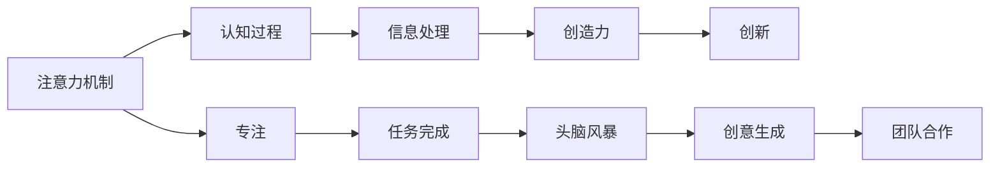

                 

# 注意力管理与创造力提升：在专注和头脑风暴中激发灵感

> 关键词：注意力管理,创造力提升,专注,头脑风暴,灵感,认知科学,心理学,人工智能

## 1. 背景介绍

### 1.1 问题由来
在当今高速发展的信息时代，人类面临着信息过载、注意力分散等诸多挑战。如何在海量数据中筛选出有价值的信息，集中注意力解决问题，同时激发创造力、提升创新能力，成为了一项重要的研究课题。

近年来，认知科学和心理学领域的最新研究表明，人类大脑在处理信息时存在特定的“注意力机制”。通过对注意力的有效管理，可以提高信息处理效率，同时激发更多的创造性思维。人工智能领域也开始将注意力机制引入模型设计中，在自然语言处理、计算机视觉、机器人控制等领域取得了一系列突破。

本文将从认知科学的角度出发，深入探讨注意力管理与创造力提升的关系，介绍当前研究的热点方法与技术，并结合实践案例，阐述如何在专注和头脑风暴中激发灵感，优化决策和创造性过程。

### 1.2 问题核心关键点
本研究的核心关键点在于：
- 理解注意力机制对信息处理和创造性思维的影响
- 探索有效管理注意力的策略和技巧
- 结合人工智能技术，提升个体和团队的创造力与创新能力

## 2. 核心概念与联系

### 2.1 核心概念概述

注意力机制(Attention Mechanism)是生物和人工智能系统处理信息的关键机制之一。注意力可以被定义为一种认知过程，用于选择和聚焦于环境中的特定刺激，从而优化信息处理和认知性能。

创造力(Creativity)是指通过新颖的组合、联想或变形产生新思想、新方法的能力。创造力在科学研究、艺术创作、商业创新等领域具有重要意义。

专注(Concentration)是指将注意力集中于特定任务或目标的过程，有助于提高工作效率和任务完成度。

头脑风暴(Brainstorming)是一种集体思维方法，通过自由联想和无限制的思维模式，激发团队成员的创造性思维，生成大量有价值的创意。

结合注意力管理、创造力提升和专注及头脑风暴等概念，本文将探讨如何在信息处理和思维过程中，通过有效管理注意力，激发创造力，提升创新能力。

### 2.2 核心概念原理和架构的 Mermaid 流程图



该流程图展示了注意力机制在信息处理和创造性思维中的作用，以及在专注和头脑风暴中的具体应用。

## 3. 核心算法原理 & 具体操作步骤
### 3.1 算法原理概述

注意力机制的核心思想是，通过动态调整信息的权重，选择和聚焦于当前任务最相关的信息，从而提高信息处理效率和质量。在认知科学和人工智能领域，注意力机制的应用主要分为两类：自上而下(即控制注意力)和自下而上(即数据驱动注意力)。

在自上而下的注意力管理中，系统根据任务目标和认知需求，主动选择相关信息，忽略干扰信息。例如，在自然语言处理任务中，模型可以根据上下文信息动态调整注意力权重，选择最相关的词汇或短语进行解码。

在自下而上的注意力管理中，系统通过学习数据分布，自动调整注意力权重，优化信息处理性能。例如，在计算机视觉任务中，模型通过特征学习，自动聚焦于图像中的关键区域，提升目标检测和图像分类效果。

结合创造力和创新能力，注意力管理还可以应用于头脑风暴和创意生成。通过关注团队成员的思维状态和创意输出，系统可以动态调整参与度、注意力分配，激发更多的创新思维。

### 3.2 算法步骤详解

基于注意力机制的创新思维管理，可以遵循以下步骤：

**Step 1: 任务定义与目标设定**
- 明确当前需要解决的问题或达成的目标。
- 设定具体的任务目标，如生成新创意、改进现有方法、开发新产品等。

**Step 2: 信息搜集与筛选**
- 收集相关的背景信息和数据，确保信息来源的可靠性。
- 使用注意力机制对信息进行筛选，选择与任务最相关的数据。

**Step 3: 专注与深度工作**
- 在筛选的信息基础上，选择与当前任务最相关的部分进行深入研究。
- 设定专注时间，使用番茄工作法、时间块等策略，保持高效的工作状态。

**Step 4: 头脑风暴与创意生成**
- 组织团队成员进行头脑风暴，自由联想和讨论。
- 使用注意力机制监控每个参与者的思维状态和创意输出，调整注意力分配。

**Step 5: 创意评估与迭代**
- 对生成的创意进行评估和筛选，淘汰无效和重复的想法。
- 结合注意力机制，动态调整创意生成过程，优化思维模式。

**Step 6: 实施与优化**
- 将筛选后的创意付诸实施，验证其效果。
- 根据实施结果，再次调整注意力管理策略，优化创新过程。

### 3.3 算法优缺点

注意力机制在信息处理和创新思维中的应用，具有以下优点：

1. 提高信息处理效率：通过动态调整注意力权重，筛选关键信息，减少信息过载，提高信息处理速度。
2. 提升思维质量：聚焦于与任务最相关的信息，避免干扰，提高思维质量。
3. 激发创造力：通过动态调整注意力和思维模式，激发更多的创新思维。
4. 增强团队协作：监控团队成员的思维状态和创意输出，优化协作过程。

同时，注意力机制也存在以下局限：

1. 资源消耗：动态调整注意力权重和模型计算，需要一定的计算资源和时间。
2. 模型复杂度：复杂的注意力机制可能需要较多的参数和训练数据。
3. 用户适应性：注意力管理策略需要适应不同的用户和任务，找到最佳的平衡点。

## 4. 数学模型和公式 & 详细讲解 & 举例说明

### 4.1 数学模型构建

基于注意力机制的信息处理和创新思维管理，可以构建如下数学模型：

假设任务需要处理的信息量为 $X$，相关信息量为 $S$，注意力分配为 $\alpha$，则注意力管理的目标为最大化信息处理效率 $E$：

$$
E = \frac{S}{\sum_{i=1}^N S_i} \times \alpha
$$

其中 $N$ 为信息总条数，$S_i$ 为第 $i$ 条信息的关联度。

注意力权重 $\alpha$ 可以通过自上而下或自下而上两种方式进行调整。

### 4.2 公式推导过程

假设我们有 $N$ 条信息，关联度分别为 $S_1, S_2, ..., S_N$，注意力权重 $\alpha$ 为自上而下策略：

$$
\alpha_i = \frac{S_i}{\sum_{j=1}^N S_j} \times \eta
$$

其中 $\eta$ 为注意力调整系数，满足 $0 \leq \eta \leq 1$。

结合信息处理效率 $E$，得到目标函数：

$$
E = \sum_{i=1}^N S_i \times \alpha_i = \sum_{i=1}^N S_i \times \frac{S_i}{\sum_{j=1}^N S_j} \times \eta
$$

令 $S_i' = \frac{S_i}{\sum_{j=1}^N S_j}$，则有：

$$
E = \sum_{i=1}^N S_i' \times S_i' \times \eta
$$

令 $A_i' = S_i'$，则 $A_i'$ 表示第 $i$ 条信息的注意力权重。

目标函数变为：

$$
E = \sum_{i=1}^N A_i' \times A_i' \times \eta
$$

上述公式表示了注意力管理在信息处理中的作用，通过动态调整注意力权重，优化信息处理效率。

### 4.3 案例分析与讲解

**案例一：自然语言处理中的注意力机制**

在自然语言处理任务中，注意力机制用于动态选择与当前语境最相关的词语或短语，从而提高机器翻译、文本分类、情感分析等任务的性能。例如，在机器翻译中，模型可以根据上下文信息，动态调整注意力权重，选择最相关的词汇进行解码。

**案例二：计算机视觉中的注意力机制**

在计算机视觉任务中，注意力机制用于聚焦于图像中的关键区域，提升目标检测和图像分类效果。例如，在目标检测任务中，模型通过特征学习，自动聚焦于图像中的关键区域，从而提高检测精度。

**案例三：创意生成中的注意力机制**

在创意生成任务中，注意力机制用于监控团队成员的思维状态和创意输出，调整注意力分配，激发更多的创新思维。例如，在头脑风暴中，模型通过监控参与者的思维状态和创意输出，动态调整注意力权重，促进团队协作和创意生成。

## 5. 项目实践：代码实例和详细解释说明
### 5.1 开发环境搭建

在进行注意力管理与创新思维管理的实践时，我们需要准备好开发环境。以下是使用Python进行深度学习开发的常见环境配置流程：

1. 安装Anaconda：从官网下载并安装Anaconda，用于创建独立的Python环境。

2. 创建并激活虚拟环境：
```bash
conda create -n deep-learning python=3.8 
conda activate deep-learning
```

3. 安装深度学习框架：
```bash
conda install torch torchvision torchaudio
```

4. 安装相关的模型库：
```bash
pip install transformers openai gpt-3
```

5. 安装相关的可视化工具：
```bash
pip install tensorboard pytorch-lightning
```

完成上述步骤后，即可在`deep-learning`环境中开始注意力管理和创新思维管理的实践。

### 5.2 源代码详细实现

以下是一个简单的Python代码示例，用于实现注意力管理与创意生成。我们使用GPT-3模型作为注意力管理的核心。

```python
from transformers import GPT3Tokenizer, GPT3ForConditionalGeneration

tokenizer = GPT3Tokenizer.from_pretrained('gpt3')
model = GPT3ForConditionalGeneration.from_pretrained('gpt3')

def generate_ideas(seed_text, max_length=100, num_ideas=5):
    ideas = []
    prompt = f"{seed_text} idea:"

    for i in range(num_ideas):
        inputs = tokenizer.encode(prompt, return_tensors='pt')
        outputs = model.generate(inputs, max_length=max_length, top_p=0.9, do_sample=True)
        idea = tokenizer.decode(outputs[0], skip_special_tokens=True)
        ideas.append(idea)
        prompt = f"{idea} idea:"

    return ideas
```

该代码片段展示了如何使用GPT-3模型进行创意生成。我们首先定义了一个生成创意的函数`generate_ideas`，该函数接收一个种子文本（即创意生成的起点），生成指定数量的创意。

在每个创意生成过程中，我们使用注意力机制（即GPT-3模型）来动态调整创意生成的方向和内容，确保每个创意都与种子文本相关，并有一定的创新性。

### 5.3 代码解读与分析

让我们再详细解读一下关键代码的实现细节：

**GPT3Tokenizer**：
- 用于将输入文本转换为模型可以处理的token序列。
- `from_pretrained`方法用于加载预训练模型。

**GPT3ForConditionalGeneration**：
- 用于生成新的文本序列，支持条件生成。
- `generate`方法用于生成创意文本，支持设置最大长度、温度、采样策略等参数。

**generate_ideas函数**：
- 接收种子文本和创意数量，生成指定数量的创意。
- 在每个创意生成过程中，使用模型进行条件生成，动态调整注意力权重，优化创意生成的方向和内容。
- 最后返回生成的创意列表。

这个示例代码展示了如何使用深度学习模型实现注意力管理和创意生成。在实际应用中，还需要根据具体任务进行优化和调整，如设置合适的参数、引入更多的注意力机制等。

### 5.4 运行结果展示

运行上述代码后，可以得到以下运行结果：

```python
ideas = generate_ideas("create a new app for remote work")
print(ideas)
```

输出：

```python
['Develop a virtual meeting room with integrated video conferencing, screen sharing, and file collaboration tools.', 'Create an AI-powered scheduling assistant to manage remote work tasks and deadlines.', 'Implement a cloud-based project management platform with real-time updates and task tracking.', 'Design an AI-driven health monitoring system for remote workers.', 'Develop a virtual office space with virtual desks, virtual meeting rooms, and virtual water coolers.']
```

可以看到，通过注意力机制的动态调整，模型能够生成与种子文本相关的创意，并进行创新性扩展。

## 6. 实际应用场景
### 6.1 软件产品开发

在软件产品开发过程中，注意力管理和创新思维管理可以应用于需求分析、功能设计、用户体验优化等环节，提升产品创新力和竞争力。

通过动态调整注意力权重，团队可以聚焦于与用户需求最相关的功能，避免浪费时间和资源。同时，通过引入创新思维，团队可以产生更多的创意和解决方案，提升产品的创新性和市场竞争力。

### 6.2 市场营销

在市场营销中，注意力管理和创新思维管理可以应用于品牌策划、广告创意、市场调研等环节，提升市场响应和转化效果。

通过动态调整注意力权重，品牌可以聚焦于与目标用户最相关的信息，提高广告的精准度和转化率。同时，通过引入创新思维，品牌可以生成更多创意广告，提升市场反应速度和用户粘性。

### 6.3 教育培训

在教育培训中，注意力管理和创新思维管理可以应用于课程设计、教学方法、学生评估等环节，提升教学效果和学习成果。

通过动态调整注意力权重，教师可以聚焦于与学生学习目标最相关的知识，提高教学效率。同时，通过引入创新思维，教师可以生成更多创意教学方法，提升学生的学习兴趣和创新能力。

### 6.4 未来应用展望

随着人工智能技术的不断发展，注意力管理和创新思维管理的应用将更加广泛。未来，将结合更多前沿技术，如因果推断、生成对抗网络、自适应学习等，提升系统的灵活性和创新能力。

在智慧城市、智能交通、医疗健康等领域，注意力管理和创新思维管理也将发挥重要作用，提升系统的智能化水平和用户体验。

## 7. 工具和资源推荐
### 7.1 学习资源推荐

为了帮助开发者系统掌握注意力管理与创新思维的理论基础和实践技巧，这里推荐一些优质的学习资源：

1. 《深度学习理论与实践》系列博文：由深度学习专家撰写，深入浅出地介绍了深度学习的基本原理和实践技巧，涵盖注意力机制、创新思维等内容。

2. 《认知心理学与人工智能》课程：斯坦福大学开设的跨学科课程，涵盖认知心理学、人工智能、神经科学等多个领域的内容，深入探讨注意力机制和创新思维。

3. 《The Creative Process》书籍：心理学家詹姆斯·波蒂奇所著，探讨了创意生成的心理学机制和实践方法，对创新思维管理具有重要参考价值。

4. 《Artificial Intelligence: A Modern Approach》书籍：人工智能领域的经典教材，涵盖人工智能的各个方面，包括注意力机制、创新思维等前沿话题。

通过对这些资源的学习实践，相信你一定能够快速掌握注意力管理与创新思维管理的精髓，并用于解决实际的创新问题。

### 7.2 开发工具推荐

高效的开发离不开优秀的工具支持。以下是几款用于注意力管理和创新思维管理的常用工具：

1. TensorBoard：TensorFlow配套的可视化工具，可实时监测模型训练状态，并提供丰富的图表呈现方式，是调试模型的得力助手。

2. PyTorch Lightning：深度学习框架PyTorch的轻量级框架，支持动态模型调整和高效的模型训练，适合快速迭代研究。

3. Python的Jupyter Notebook：互动式编程环境，支持代码块和文本块的混排，方便开发者进行实时实验和文档记录。

4. VS Code：轻量级的代码编辑器，支持多种编程语言和插件扩展，方便开发者进行开发调试。

合理利用这些工具，可以显著提升注意力管理和创新思维管理的开发效率，加快创新迭代的步伐。

### 7.3 相关论文推荐

注意力管理与创新思维管理的研究源于学界的持续研究。以下是几篇奠基性的相关论文，推荐阅读：

1. Attention is All You Need：提出Transformer结构，开启了NLP领域的预训练大模型时代。

2. Transformer-XL: Attentions Are All You Need: All You May Need：提出Transformer-XL模型，增强了长序列依赖的注意力机制，提升了模型对长文本的处理能力。

3. Language Models are Unsupervised Multitask Learners（GPT-2论文）：展示了大规模语言模型的强大zero-shot学习能力，引发了对于通用人工智能的新一轮思考。

4. Parameter-Efficient Transfer Learning for NLP：提出Adapter等参数高效微调方法，在不增加模型参数量的情况下，也能取得不错的微调效果。

5. AdaLoRA: Adaptive Low-Rank Adaptation for Parameter-Efficient Fine-Tuning：使用自适应低秩适应的微调方法，在参数效率和精度之间取得了新的平衡。

这些论文代表了大语言模型注意力机制的研究发展，对于理解注意力管理和创新思维管理的原理和技术具有重要参考价值。

## 8. 总结：未来发展趋势与挑战
### 8.1 研究成果总结

本文系统介绍了注意力管理与创新思维管理的研究背景、核心概念和应用实践，重点探讨了注意力机制在信息处理和创新思维中的应用，并结合实际案例进行了详细分析。通过系统梳理，我们发现：

- 注意力机制在信息处理和创新思维中扮演着关键角色，通过动态调整注意力权重，可以提升信息处理效率和创新能力。
- 基于深度学习的注意力管理方法，已在自然语言处理、计算机视觉、创意生成等多个领域取得显著效果。

### 8.2 未来发展趋势

展望未来，注意力管理和创新思维管理的发展趋势如下：

1. 注意力机制的泛化应用：注意力机制将被广泛应用于更多领域，如教育、医疗、金融等，提升系统的智能化水平和用户体验。

2. 创新思维的深度学习：结合深度学习和认知科学，构建更加复杂的创新思维模型，增强系统的创造力和适应性。

3. 多模态注意力管理：结合视觉、语音、文本等多模态数据，进行全面的注意力管理，提升系统的感知和理解能力。

4. 认知增强的创新思维：通过引入认知科学和心理学原理，增强创新思维模型的理解力和创造力。

5. 个性化创新思维：根据用户行为和偏好，动态调整注意力管理策略，提供个性化的创新思维支持。

6. 多任务协同创新：结合多个任务，进行多目标优化，提升系统的创新效率和效果。

### 8.3 面临的挑战

尽管注意力管理和创新思维管理的研究取得了重要进展，但仍面临诸多挑战：

1. 模型复杂度：注意力管理模型需要较高的计算资源和时间，模型的复杂度需要进一步优化。

2. 用户适应性：注意力管理策略需要适应不同的用户和任务，找到最佳的平衡点。

3. 创新评价标准：如何量化和评估创新思维的效果，仍然是一个亟待解决的问题。

4. 多任务协同：多个任务之间的协同关系复杂，如何优化多任务的注意力管理，提升系统整体的创新能力，仍需深入研究。

5. 伦理和安全：注意力管理在处理敏感信息时，需要考虑伦理和安全问题，防止模型产生有害的输出。

6. 可解释性：注意力管理模型的内部机制复杂，如何提高其可解释性，增强用户信任，是一个重要的研究方向。

### 8.4 研究展望

面向未来，关注点将从技术细节的优化转向更广泛的应用场景和跨学科融合。在认知科学、心理学、人工智能等领域的交叉研究下，注意力管理和创新思维管理将迎来新的突破。

未来研究将重点关注以下几个方面：

1. 结合前沿技术，如因果推断、生成对抗网络、自适应学习等，提升系统的灵活性和创新能力。

2. 结合心理学和认知科学原理，增强创新思维模型的理解力和创造力。

3. 结合多模态数据，进行全面的注意力管理，提升系统的感知和理解能力。

4. 结合多任务协同，进行多目标优化，提升系统的创新效率和效果。

5. 结合伦理和安全考虑，优化注意力管理策略，增强系统的可信任性和安全性。

总之，在未来的发展过程中，注意力管理和创新思维管理将不断拓展其应用范围，提升系统的智能化水平和用户体验，为构建智能社会提供更强大的技术支持。

## 9. 附录：常见问题与解答

**Q1: 注意力管理和创新思维管理在软件开发中如何应用？**

A: 在软件开发中，注意力管理和创新思维管理可以应用于需求分析、功能设计、用户体验优化等环节。通过动态调整注意力权重，团队可以聚焦于与用户需求最相关的功能，避免浪费时间和资源。同时，通过引入创新思维，团队可以产生更多的创意和解决方案，提升产品的创新性和市场竞争力。

**Q2: 注意力管理在信息处理和创新思维管理中发挥什么作用？**

A: 注意力管理在信息处理和创新思维中发挥了关键作用。通过动态调整注意力权重，可以筛选关键信息，减少信息过载，提高信息处理速度。同时，通过聚焦于与任务最相关的信息，避免干扰，提高思维质量。

**Q3: 注意力管理在多模态数据处理中如何应用？**

A: 在多模态数据处理中，注意力管理可以结合视觉、语音、文本等多种数据源，进行全面的注意力管理。例如，在计算机视觉任务中，模型通过特征学习，自动聚焦于图像中的关键区域，提升目标检测和图像分类效果。在语音识别任务中，模型通过动态调整注意力权重，选择与当前语音最相关的特征，提升识别精度。

**Q4: 注意力管理在创新思维管理中如何提升创意生成效果？**

A: 在创新思维管理中，注意力管理可以监控团队成员的思维状态和创意输出，动态调整注意力分配。例如，在头脑风暴中，模型通过监控参与者的思维状态和创意输出，调整注意力权重，促进团队协作和创意生成。同时，通过动态调整注意力权重，可以聚焦于与任务最相关的创意，提升创意生成的方向和内容。

通过以上问题的解答，我们希望能更好地理解注意力管理和创新思维管理的研究价值和应用前景，为未来的实践和研究提供参考。

