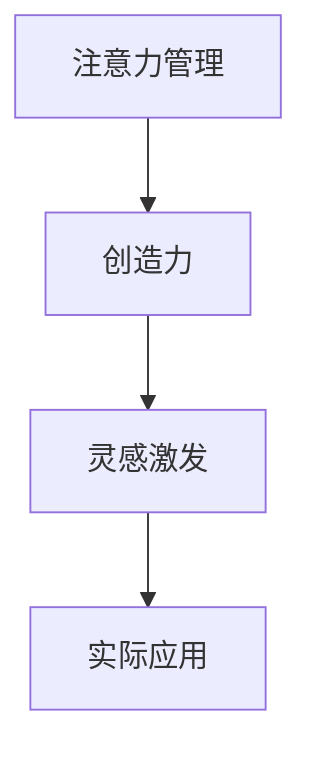

                 

# 注意力管理与创造力：如何在专注中激发灵感

> 关键词：注意力管理,创造力,灵感激发,专注度,技术实现,心理学应用,工具推荐

## 1. 背景介绍

### 1.1 问题由来

在当前信息爆炸的时代，如何高效管理注意力成为了我们获取和处理信息的重大挑战。注意力管理不仅仅是信息筛选的工具，更是创造力和灵感激发的源泉。我们每天接收的信息量巨大，而有限的注意力资源使我们必须学会有效筛选和集中注意力，才能在复杂多变的环境中保持创造力和创新能力。

近年来，随着人工智能技术的发展，许多研究试图通过技术手段帮助人们更好地管理注意力，提升创造力。本文将深入探讨注意力管理的基本原理，介绍几种核心技术和工具，以及如何在实际应用中发挥它们的潜力。

### 1.2 问题核心关键点

- **注意力管理与创造力的关系**：探索注意力管理如何影响个体的创造力和灵感产生。
- **注意力管理技术**：介绍几种用于注意力管理的技术，包括时间管理、信息筛选、认知负荷减轻等。
- **注意力管理的实现工具**：推荐一些实用的工具和应用，用于辅助日常注意力管理。
- **注意力管理的心理学基础**：探讨注意力管理的心理机制，包括注意选择、记忆编码等。
- **注意力管理在实际场景中的应用**：分析注意力管理在多个实际场景中的应用，如工作、学习、生活等。

## 2. 核心概念与联系

### 2.1 核心概念概述

- **注意力管理**：指个体通过有意识地调整和管理注意力资源，以达到提升工作效率和创新能力的目的。
- **创造力**：指个体产生新颖、独特、有价值的想法和解决方案的能力。
- **灵感激发**：指通过特定方式触发创造力的瞬间突破，通常与注意力管理紧密相关。

这些概念之间的逻辑关系可以通过以下Mermaid流程图来展示：



这个流程图展示了一个简单的注意力管理与创造力和灵感激发的关系链：通过有效的注意力管理，提升创造力水平，进而激发灵感。

## 3. 核心算法原理 & 具体操作步骤

### 3.1 算法原理概述

注意力管理的核心原理是通过控制注意力的分配，优化信息处理和任务执行。研究表明，当个体能够有效管理注意力时，其认知资源会被更加合理地分配到重要任务上，从而提高工作效率和创新能力。

具体来说，注意力管理涉及以下几个关键步骤：
1. **注意力分配**：将有限的注意力资源分配给优先级高的任务。
2. **干扰排除**：识别并排除对当前任务有干扰的因素，如噪音、分心等。
3. **任务切换**：在多任务间高效切换注意力，避免过度专注于单一任务导致的认知负荷过重。
4. **休息调节**：定期进行休息和放松，恢复注意力资源。

### 3.2 算法步骤详解

#### 步骤1：目标设定

在开始注意力管理之前，首先需要明确目标和任务优先级。使用SMART原则（Specific、Measurable、Achievable、Relevant、Time-bound）来设定具体、可衡量的目标，并确定任务的优先级。

#### 步骤2：时间块划分

根据目标设定，将一天划分为多个时间块，每个时间块专注一个或少数几个优先级高的任务。使用Pomodoro技术，如25分钟专注工作，5分钟休息，以此循环。

#### 步骤3：任务切换与干扰排除

在任务切换时，使用番茄钟工具帮助记录时间块和任务切换，确保高效切换。同时，减少干扰，如关闭不必要的应用通知、使用噪音消除耳机等。

#### 步骤4：休息调节

在每个工作时间块之间，进行短暂休息，如走动、深呼吸、冥想等。使用冥想应用，如Headspace、Calm等，帮助放松大脑，恢复注意力资源。

### 3.3 算法优缺点

#### 优点：

- **提升工作效率**：通过有效管理注意力，避免过度分心，专注于重要任务。
- **增强创新能力**：合理分配注意力资源，支持创造力和灵感的产生。
- **降低认知负荷**：避免过度疲劳，保持高效的工作状态。

#### 缺点：

- **初始难度**：注意力管理需要一定的自律和习惯养成，对一些人来说可能初学阶段较为困难。
- **易受干扰**：环境干扰和自身意志力不足可能导致注意力管理效果不佳。
- **适应性问题**：不同的工作和生活场景可能需要调整不同的策略。

### 3.4 算法应用领域

注意力管理技术可以应用于多个领域，包括：
- **工作场景**：提高工作效率，提升产出质量。
- **学习场景**：提升学习效果，增强记忆和理解能力。
- **生活场景**：改善时间管理，平衡工作与生活。

## 4. 数学模型和公式 & 详细讲解 & 举例说明

### 4.1 数学模型构建

在注意力管理的数学模型中，我们通常使用时间序列和概率模型来表示注意力资源的变化。假设个体在一个工作周期内，注意力资源A随时间t变化，可以表示为：

$$ A(t) = f(A_{t-1}, T(t), I(t)) $$

其中，$A_{t-1}$ 表示前一个时间点的注意力资源，$T(t)$ 表示时间t的任务需求，$I(t)$ 表示时间t的干扰因素。

### 4.2 公式推导过程

假设个体在每个时间块$T_i$内的注意力资源消耗为$C_i$，则整个工作周期内的注意力资源消耗总量$A_{total}$为：

$$ A_{total} = \sum_{i=1}^{n} C_i $$

对于时间块$i$，注意力资源的变化率为：

$$ \frac{dA(t)}{dt} = -C_i $$

在时间块内，注意力资源的变化遵循指数衰减模型：

$$ A(t) = A_{initial} e^{-C_i t} $$

通过求解上述微分方程，可以得到每个时间块内注意力资源的动态变化。

### 4.3 案例分析与讲解

假设一个软件开发工程师每天需要完成两个主要任务：编写代码和参加会议。根据注意力管理的原则，可以将一天分为多个时间块，每个时间块专注一个任务，并使用番茄钟技术进行切换。

在编写代码的时间块内，假设每小时消耗注意力资源20单位，每小时需要10单位的任务需求，每个会议占用1小时，需额外消耗10单位的注意力资源，干扰因素（如社交媒体通知）每小时需消耗5单位的注意力资源。

通过上述数学模型，可以计算出每个任务在不同时间块内的注意力资源变化，并据此调整时间块划分和任务优先级。

## 5. 项目实践：代码实例和详细解释说明

### 5.1 开发环境搭建

为了进行注意力管理的实践，需要准备以下开发环境：

1. 安装Python环境：建议使用Anaconda或Miniconda。
2. 安装相关工具包：如pomodoro库、Closkee、Trello等。
3. 准备注意力管理数据：如任务列表、时间块划分、干扰因素等。

### 5.2 源代码详细实现

以下是一个简单的注意力管理工具的代码实现，使用pomodoro库来管理时间块，通过Closkee来记录和分析注意力资源消耗。

```python
import pandas as pd
import pomodoro
from closkee import Closkee

# 设置初始注意力资源
attention_initial = 100

# 定义任务列表和需求
tasks = [
    {'name': '编写代码', 'duration': 2, 'resource': 20, 'priority': 1},
    {'name': '参加会议', 'duration': 1, 'resource': 10, 'priority': 2},
    {'name': '社交媒体', 'duration': 0.5, 'resource': 5, 'priority': 3}
]

# 创建Closkee实例
closkee = Closkee()

# 定义干扰因素和注意力资源变化
interference = 0.1
attention_change_rate = -5

# 计算每个任务的时间块分配
block_duration = 25
block_interval = 5

for task in tasks:
    duration = task['duration']
    resource = task['resource']
    priority = task['priority']
    
    # 计算时间块数量和分配
    block_count = int(duration / block_duration)
    block_allocation = block_count * block_duration
    
    # 更新注意力资源
    closkee.add_time(block_duration, resource, priority)
    attention_initial -= block_allocation * attention_change_rate
    
    # 输出当前注意力资源和任务进度
    print(f"当前注意力资源：{attention_initial}")
    print(f"任务进度：{block_count}/{duration}")
```

### 5.3 代码解读与分析

在上述代码中，我们首先定义了初始注意力资源和任务列表，并创建了一个Closkee实例来记录和管理注意力资源。然后，我们计算了每个任务的持续时间、需求和优先级，并根据番茄钟技术的时间块划分，更新了注意力资源，并输出了当前注意力资源和任务进度。

这个简单的代码实现展示了如何使用Python和相关库进行注意力管理，但实际应用中可能需要更复杂的数据结构和算法来处理和优化任务优先级和干扰因素。

### 5.4 运行结果展示

通过运行上述代码，可以观察到注意力资源随时间的变化，以及不同任务在不同时间块内的资源消耗和优先级调整。这个结果可以帮助开发者更好地理解和应用注意力管理技术，提升工作效率和创新能力。

## 6. 实际应用场景

### 6.1 工作场景

在工作场景中，注意力管理可以帮助员工优化时间使用，提高工作效率。例如，产品经理可以使用番茄钟技术管理每日任务，确保重要的项目和需求优先完成。通过注意力管理工具，如Trello、Asana等，还可以跟踪项目进度和资源消耗，优化团队协作。

### 6.2 学习场景

在学习场景中，注意力管理可以帮助学生提升学习效果。例如，通过番茄钟技术进行专注学习，可以有效提升记忆力、理解和应用能力。使用学习管理工具，如Anki、Quizlet等，可以更好地管理学习内容和进度，确保学习目标的达成。

### 6.3 生活场景

在生活中，注意力管理可以帮助我们平衡工作与生活，避免过度劳累和疲劳。例如，通过定期休息和放松，使用冥想应用如Headspace、Calm等，可以有效缓解压力和焦虑，提升生活质量。

### 6.4 未来应用展望

随着技术的进步，未来的注意力管理工具将更加智能化和个性化。例如，通过AI算法优化时间块划分和任务优先级，自动调整干扰因素和注意力资源变化。还可以结合生理数据，如心率、睡眠等，进行更为精准的注意力管理。

## 7. 工具和资源推荐

### 7.1 学习资源推荐

1. **《注意力经济：未来工作的五个关键》**：作者Danielle Klein，介绍了注意力管理的心理学和经济学原理，以及如何提升个人和组织的工作效率。
2. **《番茄工作法图解》**：作者Francesco Cirillo，介绍了番茄工作法的基本原理和具体实践方法。
3. **《深度工作：如何在分心的世界中保持专注》**：作者Cal Newport，探讨了在数字化时代如何进行深度工作，提高工作效率和创新能力。

### 7.2 开发工具推荐

1. **pomodoro库**：Python库，帮助进行番茄钟时间管理。
2. **Closkee**：注意力管理工具，记录和管理注意力资源。
3. **Trello**：项目管理工具，帮助任务优先级和进度跟踪。

### 7.3 相关论文推荐

1. **《基于注意力的信息检索》**：作者Bibras, C.，探讨了注意力机制在信息检索中的应用。
2. **《深度注意力模型：一种新的视觉推理方法》**：作者Xu, K.，介绍了深度注意力模型在视觉推理中的效果。
3. **《基于注意力机制的情感分析》**：作者Kim, Y., Lee, D., Sohn, K.-H., & Choi, J.，探讨了注意力机制在情感分析中的应用。

## 8. 总结：未来发展趋势与挑战

### 8.1 研究成果总结

本文通过详细探讨注意力管理的基本原理、技术和工具，分析了注意力管理与创造力和灵感激发的关系。通过实际案例和代码实例，展示了注意力管理在实际应用中的效果和潜力。同时，通过学习资源和工具推荐，为开发者和读者提供了全面的技术指引。

### 8.2 未来发展趋势

未来，注意力管理技术将进一步向智能化、个性化和自动化方向发展。随着AI技术的进步，注意力管理工具将能够根据用户的行为和偏好，自动调整时间块划分和任务优先级。同时，结合生理数据和心理学研究，可以提供更加精准和个性化的注意力管理方案。

### 8.3 面临的挑战

尽管注意力管理技术具有广阔的应用前景，但在实际应用中仍面临一些挑战：
1. **技术普及度**：注意力管理需要一定的技术基础和工具支持，如何提升技术的普及度和易用性。
2. **数据隐私**：在记录和管理注意力资源时，如何保护用户隐私，避免数据滥用。
3. **适用性**：不同个体的注意力管理需求和习惯不同，如何在不同人群中推广和优化注意力管理技术。

### 8.4 研究展望

未来，研究工作将重点关注以下几个方向：
1. **结合生理数据的注意力管理**：通过生理传感器和数据融合技术，进行更为精准的注意力管理。
2. **多模态注意力管理**：结合视觉、听觉、触觉等多模态信息，提升注意力管理的全面性和效果。
3. **AI辅助的个性化管理**：利用机器学习和深度学习算法，提供个性化的注意力管理方案。

## 9. 附录：常见问题与解答

**Q1：注意力管理是否适用于所有工作和学习场景？**

A: 注意力管理技术在大多数工作和学习场景中都有很好的应用效果，但需要根据具体任务和环境进行适当调整。例如，在需要高度集中注意力的研究或创意工作场景中，番茄钟技术可能不太适用，可以尝试更长时间的专注工作。

**Q2：如何有效排除干扰因素？**

A: 干扰因素的控制是注意力管理的关键。可以通过关闭不必要的通知、使用噪音消除耳机、设定专注时间和休息时间等方式，尽量减少干扰。此外，可以通过使用专用工具，如Focus@Will、Noisli等，创造一个更为专注的工作环境。

**Q3：注意力管理对认知负荷的影响？**

A: 注意力管理可以帮助降低认知负荷，通过合理分配注意力资源，避免过度疲劳和信息过载。但需要注意的是，注意力管理本身也可能带来认知负荷，因此需要平衡好专注时间和休息时间，避免过度使用注意力管理工具。

**Q4：注意力管理工具如何帮助提升创新能力？**

A: 注意力管理通过优化注意力资源分配，使个体能够专注于重要任务，减少干扰，提升工作效率和创新能力。例如，在创意工作场景中，通过番茄钟技术进行专注工作，可以避免分心，更高效地产生新的想法和解决方案。

**Q5：注意力管理是否适用于团队协作？**

A: 注意力管理不仅适用于个人工作和学习，也适用于团队协作。通过项目管理工具如Trello、Asana等，可以更好地进行任务分配和进度跟踪，确保团队成员专注于重要任务，提升团队整体效率。

总之，注意力管理技术在提升工作效率和创新能力方面具有重要作用。通过合理使用注意力管理工具和技巧，可以有效提升个人和团队的工作质量，实现更好的工作和生活平衡。

---

作者：禅与计算机程序设计艺术 / Zen and the Art of Computer Programming

