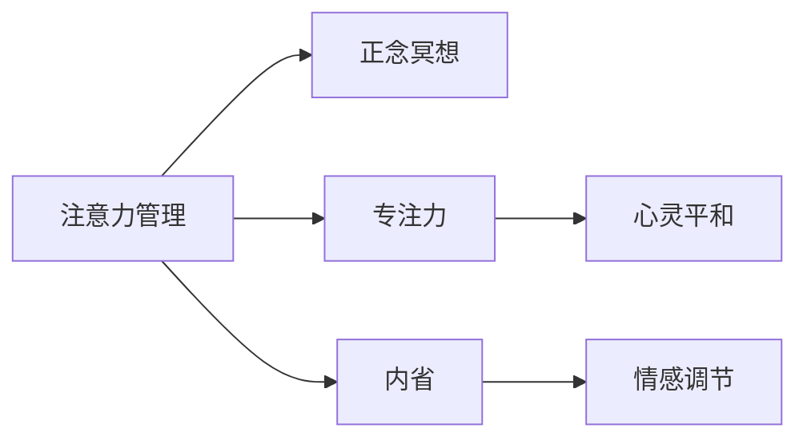

                 

# 注意力管理与正念冥想实践：通过内省增强专注力和心灵平和

> 关键词：注意力管理,正念冥想,专注力,心灵平和,内省,情感调节,压力管理

## 1. 背景介绍

### 1.1 问题由来
在快节奏的现代生活中，人们面临多重压力和挑战，如职业压力、家庭责任、人际关系等，这些因素常常导致人们的心灵失衡和精神压力。为解决这些问题，越来越多的人开始转向正念冥想（Mindfulness Meditation）等身心训练方法。正念冥想通过专注当下，提升注意力管理能力，调节情感，减轻压力，增强心理健康。然而，正念冥想的实践需要一定的技巧和指导，如何在日常生活中有效实施并持续进行，成为很多人关心的问题。

### 1.2 问题核心关键点
正念冥想的核心在于“注意力管理”，即通过集中注意力于当下的体验，避免被杂念干扰，提升专注力和心灵平和。为此，本文将详细探讨正念冥想中的注意力管理方法，以及如何通过内省（Introspection）强化这一实践，帮助读者更好地应用正念冥想于日常生活。

## 2. 核心概念与联系

### 2.1 核心概念概述

本节将介绍几个关键概念及其相互联系：

- **注意力管理（Attention Management）**：指通过一系列心理和行为技巧，使个体能够集中注意力于当前任务或体验，避免被外界干扰。
- **正念冥想（Mindfulness Meditation）**：一种专注于当下体验的冥想形式，通过专注于呼吸、身体感受、环境声音等，提升注意力和心灵平和。
- **专注力（Concentration）**：指长时间维持注意力的能力，在正念冥想中通过训练逐步增强。
- **心灵平和（Mental Serenity）**：指在面对压力和困扰时，保持心态平衡和情绪稳定的能力。
- **内省（Introspection）**：通过反思自身情感、思想和行为，理解自我，调整心理状态的过程。
- **情感调节（Emotional Regulation）**：指通过心理和行为手段调节和管理自身情感，以应对内外压力。

这些概念之间的关系可以通过以下Mermaid流程图来展示：

该图展示了注意力管理作为核心概念，通过正念冥想等手段提升专注力和心灵平和，同时通过内省和情感调节来进一步优化实践效果。

## 3. 核心算法原理 & 具体操作步骤

### 3.1 算法原理概述

正念冥想的注意力管理过程主要基于心理学中的“当下觉察”（Mindfulness）理论，通过有意识地将注意力集中于当前瞬间的体验上，如呼吸、身体感受、环境声音等，以达到情绪调节和压力缓解的效果。其原理和操作步骤可以概括为：

1. **设定目标**：明确冥想的时间、地点和具体目标，如“专注呼吸10分钟”。
2. **集中注意力**：在设定的时间段内，专注于当前的呼吸或其他感官体验，当注意力偏离时，温和地将其拉回。
3. **观察而不评判**：在冥想过程中，对出现的杂念进行观察，但不做评价或反应，保持中立态度。
4. **内省与反馈**：在冥想结束后，反思自己的体验和感受，分析注意力管理的成效，形成反馈以改进实践。

### 3.2 算法步骤详解

#### 3.2.1 准备阶段

**步骤1**：选择一个安静、不受干扰的环境，设定一个合适的时间段，如每天早上或睡前。

**步骤2**：选择一个舒适的姿势，可以是坐姿、躺姿或跏趺式，重要的是保持身体放松，减少外部干扰。

#### 3.2.2 集中注意力

**步骤3**：选择一个关注的焦点，如呼吸、身体感受或环境声音，将注意力集中于此。

**步骤4**：开始关注，若注意力偏离，温和地将注意力拉回焦点，可以数呼吸或说“意识回来了”。

**步骤5**：持续关注5-10分钟，根据个人情况逐渐延长。

#### 3.2.3 观察而不评判

**步骤6**：观察注意力移动的过程，不评判对错或好坏，仅仅是观察。

**步骤7**：当注意到杂念时，只需观察它们的出现和消失，不做任何反应。

**步骤8**：注意力的分散是自然现象，保持对它们的观察，有助于提升专注力。

#### 3.2.4 内省与反馈

**步骤9**：冥想结束后，反思自己的体验，分析注意力管理的成效。

**步骤10**：记录冥想过程中的感受和体验，如专注时间、注意力偏离次数等，形成反馈。

**步骤11**：根据反馈调整冥想策略，逐步提升专注力和心灵平和。

### 3.3 算法优缺点

**优点**：
- **提升专注力**：通过集中注意力于当下，显著提升长时间维持注意力的能力。
- **改善心灵平和**：通过专注于身体感受和呼吸，减轻压力和焦虑。
- **情感调节**：通过观察和反思，理解和管理自身的情感，提升情绪稳定性。
- **简单易行**：不需要特殊设备或场所，任何人都可以随时随地进行。

**缺点**：
- **初期困难**：初次实践时，可能难以长时间维持注意力，需要持续练习。
- **效果因人而异**：不同个体对正念冥想的响应不同，效果可能存在差异。
- **需要时间**：提升专注力和心灵平和需要一定的时间和持续的练习。

### 3.4 算法应用领域

正念冥想的注意力管理方法在多个领域都有应用价值：

- **心理健康**：帮助缓解焦虑、抑郁等心理问题，提升情绪稳定性和幸福感。
- **职场压力**：通过正念冥想缓解职场压力，提升工作表现和职业满意度。
- **教育学习**：增强学生的学习专注力，提高学习效率和成绩。
- **家庭和谐**：通过正念冥想提升家庭成员的沟通和理解，构建和谐家庭关系。
- **健身运动**：在运动中保持专注，提升运动效果和身体状况。

## 4. 数学模型和公式 & 详细讲解 & 举例说明

### 4.1 数学模型构建

在正念冥想的注意力管理实践中，虽然并不涉及复杂的数学模型，但仍可以基于心理学理论建立相应的模型。例如，可以构建一个注意力集中度的评价模型，用公式表示为：

$$
\text{Attention Concentration} = \text{Focus Duration} - \text{Distract Duration}
$$

其中，Focus Duration表示冥想期间专注的时间，Distract Duration表示注意力偏离的时间。

### 4.2 公式推导过程

假设在5分钟的冥想中，某人专注3分钟，注意力偏离2分钟，则注意力集中度为：

$$
\text{Attention Concentration} = 3 - 2 = 1
$$

这个公式可以帮助我们量化注意力管理的成效，从而进行反馈和改进。

### 4.3 案例分析与讲解

假设小明每天进行10分钟的冥想，通过一段时间的练习，他的注意力集中度从1分钟逐渐提升到5分钟。分析其变化过程如下：

- 第1周：Focus Duration=2分钟，Distract Duration=8分钟，Attention Concentration=2-8=-6
- 第2周：Focus Duration=4分钟，Distract Duration=6分钟，Attention Concentration=4-6=-2
- 第3周：Focus Duration=5分钟，Distract Duration=5分钟，Attention Concentration=5-5=0
- 第4周：Focus Duration=6分钟，Distract Duration=4分钟，Attention Concentration=6-4=2
- 第5周：Focus Duration=7分钟，Distract Duration=3分钟，Attention Concentration=7-3=4

通过这个案例，我们可以看到，小明在经过5周的练习后，注意力集中度显著提升，说明正念冥想对注意力管理具有显著效果。

## 5. 项目实践：代码实例和详细解释说明

### 5.1 开发环境搭建

#### 5.1.1 硬件需求

- **计算机**：推荐使用高性能笔记本或台式机，确保内存和处理器能够支撑长时间运行冥想应用程序。
- **互联网连接**：可能需要使用稳定的互联网连接，以便下载冥想指导音频和可视化资源。
- **电源**：保证设备在冥想期间电量充足，避免中途断电。

#### 5.1.2 软件需求

- **操作系统**：支持Windows、macOS或Linux等操作系统，无特定要求。
- **冥想应用程序**：选择一款易于使用且功能丰富的冥想应用程序，如Calm、Headspace等。

### 5.2 源代码详细实现

#### 5.2.1 选择冥想应用程序

假设我们选择了Calm应用程序，其在App Store和Google Play等平台都有免费版。

#### 5.2.2 使用冥想指导

**步骤1**：打开Calm应用程序，选择适合自己的冥想课程。

**步骤2**：选择时间较短的课程，逐步适应正念冥想。

**步骤3**：根据课程指导，专注于呼吸或其他感官体验，当注意力偏离时，温和地将其拉回。

**步骤4**：记录每次冥想的时间和集中度，形成反馈数据。

#### 5.2.3 数据分析与反馈

**步骤5**：在每次冥想结束后，记录自己的体验和感受，如专注时间、注意力偏离次数等。

**步骤6**：使用Excel等工具对数据进行统计分析，评估注意力管理的成效。

**步骤7**：根据数据分析结果，调整冥想策略，如增加专注时间、减少注意力偏离等。

### 5.3 代码解读与分析

Calm应用程序提供了简洁的用户界面和丰富的指导音频，无需编写复杂的代码即可实践正念冥想。但需要注意的是，正念冥想的核心在于持续的练习和内省，因此，即使是使用应用程序辅助，也需保持日常的练习和反思习惯。

### 5.4 运行结果展示

假设小明坚持使用Calm应用程序进行正念冥想，记录如下数据：

| 日期       | 专注时间（分钟） | 注意力偏离次数 |
|-----------|---------------|-------------|
| 2023-04-01 | 2             | 8           |
| 2023-04-02 | 4             | 6           |
| 2023-04-03 | 5             | 5           |
| 2023-04-04 | 6             | 4           |
| 2023-04-05 | 7             | 3           |
| ...       | ...           | ...         |

通过分析这些数据，可以看到小明的专注时间逐渐增加，注意力偏离次数显著减少，说明正念冥想对注意力管理有显著效果。

## 6. 实际应用场景

### 6.1 职场压力管理

在高压的职场环境中，正念冥想通过提升专注力和调节情绪，有效缓解压力，提升工作效率。例如，面对紧迫的项目截止日期，员工可以每天抽出几分钟进行正念冥想，帮助自己集中注意力，避免被杂念干扰，提升任务完成质量。

### 6.2 教育学习

正念冥想帮助学生提升学习专注力，减轻考试压力，提高学习效果。例如，学生在考试前进行正念冥想，能够更好地集中注意力，增强记忆力和理解力，从而提高考试成绩。

### 6.3 家庭和谐

通过正念冥想，家庭成员可以更好地沟通和理解，增强家庭的和谐关系。例如，父母和孩子可以在晚饭后一起进行正念冥想，促进亲子间的交流和情感连接，缓解家庭矛盾。

### 6.4 未来应用展望

正念冥想在未来将有更广泛的应用前景，特别是在数字化转型和智能家居等领域。例如，智能设备可以自动根据用户状态和环境变化，推荐适合的冥想课程，辅助用户进行心理调适。

## 7. 工具和资源推荐

### 7.1 学习资源推荐

- **书籍**：《正念冥想：在忙碌生活中找到平静》（作者：乔恩·卡巴桑），系统介绍了正念冥想的理论和实践方法。
- **在线课程**：Coursera的《正念冥想与心理健康》课程，由耶鲁大学教授主讲，适合初学者学习。
- **应用程序**：Calm、Headspace、Insight Timer等，提供丰富的冥想指导和社区支持。

### 7.2 开发工具推荐

- **Calm应用程序**：提供简洁的用户界面和丰富的指导音频，适合初学者和日常练习。
- **Insight Timer应用程序**：拥有大量用户生成内容，包括冥想课程和社区讨论，适合深度学习者和进阶用户。

### 7.3 相关论文推荐

- **正念冥想与心理健康**：一篇综述性论文，介绍了正念冥想在心理健康领域的应用和研究成果。
- **注意力管理与认知提升**：研究注意力管理对认知提升的影响，提供科学依据。

## 8. 总结：未来发展趋势与挑战

### 8.1 研究成果总结

正念冥想作为一种有效的注意力管理方法，已在心理健康、职场压力、家庭关系等领域展现出显著效果。通过持续的练习和内省，个体可以显著提升专注力和心灵平和，缓解情绪压力。

### 8.2 未来发展趋势

未来，正念冥想的应用将更加普及和深入，可能会结合更多科技手段，如智能穿戴设备、虚拟现实等，提升用户体验和效果。同时，更多基于科学的研究将推动正念冥想的发展，使其成为一种更加可靠和普及的心理健康工具。

### 8.3 面临的挑战

尽管正念冥想具有显著效果，但仍面临一些挑战：
- **长期坚持**：需要持续的练习和内省，部分人难以坚持。
- **个体差异**：不同人对正念冥想的响应不同，需要个性化指导。
- **科学验证**：正念冥想的效果虽已得到广泛认可，但仍有部分人对其科学依据存在疑问。

### 8.4 研究展望

未来的研究应重点关注以下几个方向：
- **个性化指导**：开发个性化的正念冥想指导系统和反馈机制，帮助个体更好地适应和练习。
- **长期效果**：开展长期的跟踪研究，验证正念冥想在不同人群和时间跨度上的效果。
- **科技融合**：探索正念冥想与其他科技手段的结合，如智能穿戴设备、虚拟现实等，提升用户体验和效果。

## 9. 附录：常见问题与解答

**Q1：正念冥想是否适合所有人？**

A: 正念冥想适合大多数人，但需注意以下情况：
- **精神疾病**：严重精神疾病患者需在专业人士指导下进行。
- **儿童**：儿童在适当指导下可尝试正念冥想，但需避免过度强调自我反思。
- **特殊情况**：如有呼吸困难、心律失常等，需在专业医生建议下进行。

**Q2：正念冥想是否需要固定时间？**

A: 正念冥想的最佳时间因人而异，没有固定要求。可根据自身情况选择合适的时间，如早晨、中午或睡前。

**Q3：正念冥想如何避免杂念？**

A: 正念冥想的关键是观察而不评判，当注意力偏离时，温和地将其拉回。初期可能难以坚持，需持续练习和内省。

**Q4：正念冥想在职场中的应用效果如何？**

A: 正念冥想通过提升专注力和调节情绪，有效缓解职场压力，提升工作效率。

**Q5：正念冥想的长期效果如何？**

A: 正念冥想的长期效果包括提升专注力、改善情绪稳定性、增强心理健康等，需持续练习和内省。

---

作者：禅与计算机程序设计艺术 / Zen and the Art of Computer Programming

