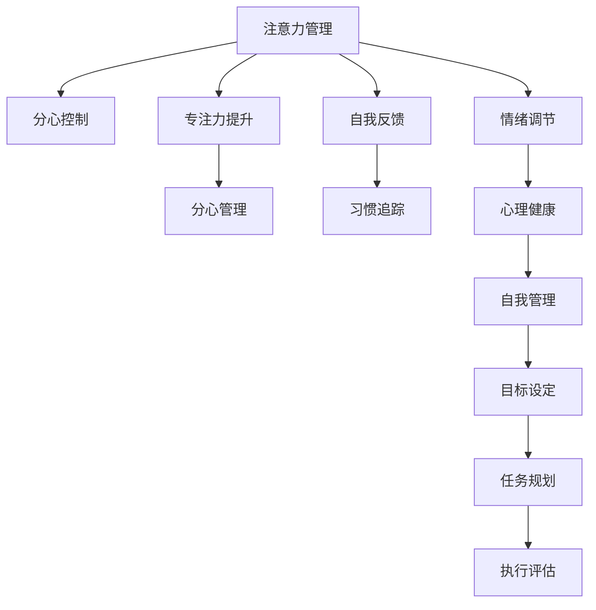

                 

# 注意力管理与自我管理策略：通过专注力增强个人和职业成功

> 关键词：注意力管理, 自我管理策略, 专注力提升, 个人成功, 职业发展

## 1. 背景介绍

### 1.1 问题由来
在信息爆炸、竞争激烈的现代职场，时间管理和注意力管理变得愈发重要。个人和企业都面临着如何在有限的时间内高效完成任务，同时保持良好的心理健康和职业发展的挑战。过去数十年，许多时间管理、注意力管理的相关书籍和文章层出不穷，旨在帮助人们提升工作效率和生产力。然而，单纯的时间管理并不能完全解决注意力分散、拖延、压力等问题。本论文将从心理认知科学的角度，深入探讨注意力管理与自我管理策略，介绍通过提升专注力来提升个人和职业成功的科学方法和技术手段。

### 1.2 问题核心关键点
注意力管理与自我管理策略的核心在于科学地利用心理学、认知神经科学等研究成果，结合现代技术手段，帮助人们更有效地分配和控制注意力资源。这包括但不限于以下几个方面：
- 通过时间块管理，优化时间分配。
- 应用番茄工作法等时间管理技巧，保持专注。
- 使用习惯追踪和自我反馈机制，强化自我管理。
- 借助现代工具，实现个性化、系统化的注意力管理。
- 注重心理健康，确保注意力管理策略的可持续性。

这些关键点共同构成了提高注意力管理与自我管理能力的系统性框架。

## 2. 核心概念与联系

### 2.1 核心概念概述

为更好地理解注意力管理与自我管理策略，本节将介绍几个密切相关的核心概念：

- **注意力管理(Attention Management)**：指通过有意识地分配和控制注意力资源，实现对信息、任务、情绪等不同刺激源的筛选与聚焦，从而提高生产力和生活质量。

- **自我管理(Self-Management)**：指个人对自己行为、情绪、目标等进行规划、执行和评估的过程。良好的自我管理能力能帮助个体更好地实现自我目标，适应各种压力和挑战。

- **专注力(Concentration)**：指在一段时间内，集中注意力于某一特定的对象或活动上，不受外界干扰，高效完成任务的状态。

- **分心(Distractibility)**：指个体容易受外界刺激干扰，无法保持长时间专注的状态。分心是影响工作和学习效率的主要原因之一。

- **番茄工作法(Pomodoro Technique)**：一种时间管理方法，将工作时间划分为25分钟的工作块和5分钟的休息块，循环进行，以提高专注度和工作效率。

- **习惯追踪(Habit Tracking)**：通过记录和分析个人习惯的形成和改变，帮助个体发现自身行为模式，进行有针对性的调整。

- **自我反馈(Self-Feedback)**：基于自我观察和自我反思的反馈机制，帮助个体调整行为，提升自我管理能力。

- **情绪调节(Emotion Regulation)**：指通过策略和技巧，调节和控制自己的情绪反应，以提高心理稳定性和工作效率。

- **心理健康(Mental Health)**：指个体保持心理状态良好，适应环境挑战的能力。良好的心理健康状态是持续高效注意力管理的基础。

这些核心概念之间的逻辑关系可以通过以下Mermaid流程图来展示：



这个流程图展示了注意力管理与自我管理策略的关键概念及其相互关系：

1. 注意力管理通过分心控制和专注力提升，帮助个体专注于任务，减少分心。
2. 自我反馈和习惯追踪协助个体了解自身行为模式，进行自我调整。
3. 情绪调节和心理健康帮助个体保持心理稳定，避免情绪干扰。
4. 目标设定和任务规划是执行和评估的前提。

这些概念共同构成了提高注意力和自我管理能力的基础，为实现个人和职业成功提供了科学依据。

## 3. 核心算法原理 & 具体操作步骤

### 3.1 算法原理概述

注意力管理与自我管理策略的核心原理在于利用心理学、认知神经科学等研究成果，结合现代技术手段，科学地规划和管理注意力资源。其核心目标是通过以下两个关键步骤：

1. **目标设定与任务规划**：明确个人或团队的目标，将其分解为具体的任务，并制定详细的执行计划。

2. **分心控制与专注力提升**：通过有效的方法控制分心，提升专注力，实现高效的任务执行。

具体地，这些策略包括但不限于时间块管理、番茄工作法、习惯追踪、自我反馈、情绪调节等。这些方法的应用，需要在实际操作中不断迭代和优化，以达到最佳效果。

### 3.2 算法步骤详解

基于上述核心原理，注意力管理与自我管理策略通常包括以下关键步骤：

**Step 1: 目标设定与任务规划**
- 明确个人或团队的长远目标和短期目标。
- 将长期目标分解为具体的短期任务，并制定详细的执行计划。
- 优先排序任务，根据优先级和紧急程度进行任务规划。

**Step 2: 时间块管理与番茄工作法**
- 将工作时间划分为固定的时间块，每个时间块内专注于特定任务。
- 应用番茄工作法，每个时间块25分钟工作，5分钟休息，循环进行。
- 记录每个时间块的任务完成情况，进行阶段性总结和评估。

**Step 3: 习惯追踪与自我反馈**
- 记录和分析个人习惯的形成和改变，使用习惯追踪工具进行记录。
- 设定目标，定期回顾习惯养成情况，根据自我反馈进行行为调整。
- 使用自我反馈机制，及时识别问题，调整策略，提升效率。

**Step 4: 情绪调节与心理维护**
- 通过定期的运动、冥想等活动，进行情绪调节。
- 重视心理健康，定期进行心理测评，评估心理健康状态。
- 使用心理疏导和自我激励技术，提升心理韧性。

**Step 5: 评估与迭代优化**
- 定期评估注意力管理与自我管理策略的实施效果。
- 根据评估结果进行策略调整，迭代优化注意力管理与自我管理方案。

### 3.3 算法优缺点

注意力管理与自我管理策略具有以下优点：
1. 提升工作效率：通过科学的时间管理和任务规划，减少分心，提高任务执行效率。
2. 提升生活质量：通过情绪调节和心理维护，减少压力和焦虑，提升整体生活质量。
3. 提升自我管理能力：通过习惯追踪和自我反馈机制，不断调整行为，提升自我管理能力。

然而，这些策略也存在一定的局限性：
1. 实施难度较大：需要较长时间和实践才能见效，且个体差异较大。
2. 依赖个人自律：依赖个人的自律和坚持，否则效果难以保证。
3. 易受外界干扰：外部环境变化和突发事件可能影响策略的实施效果。
4. 可能引发过度关注：过度关注时间和任务，可能导致忽视生活的其他重要方面。

尽管存在这些局限性，但通过合理的实施和不断优化，这些策略依然可以在很大程度上提升注意力管理和自我管理能力。

### 3.4 算法应用领域

注意力管理与自我管理策略在个人和团队管理中有着广泛的应用：

- **个人管理**：适用于自我驱动型工作环境，如自由职业者、学术研究人员等。
- **团队管理**：适用于需要高效协作的团队，如企业项目组、软件开发团队等。
- **学习管理**：适用于学生、终身学习者，通过科学的时间管理和注意力管理，提高学习效率。
- **健康管理**：适用于重视心理健康和生活质量的个体，通过情绪调节和心理维护，提升整体幸福感。

除了上述这些应用场景外，注意力管理与自我管理策略还在教育、体育、艺术等多个领域得到了广泛的应用。

## 4. 数学模型和公式 & 详细讲解 & 举例说明

### 4.1 数学模型构建

本节将使用数学语言对注意力管理与自我管理策略进行更加严格的刻画。

设个人在一天内可利用的总时间为 $T$，分成了 $N$ 个固定时间块，每个时间块的长度为 $t$，任务列表为 $T$。则有：

$$
T = N \times t
$$

个人在每个时间块内需要完成的任务数为 $K$，则平均每个时间块内的任务数为 $\frac{K}{N}$。假设时间块的分配比例为 $\{a_1, a_2, \ldots, a_N\}$，满足 $a_i \in [0,1]$ 且 $\sum_{i=1}^N a_i = 1$。则每个时间块分配给任务的概率为：

$$
p_i = \frac{a_i}{t} \quad \text{其中} \quad i = 1, 2, \ldots, N
$$

根据任务列表和概率分布，可以计算出每天完成的任务数 $X$ 的概率分布：

$$
P(X=x) = \prod_{i=1}^N \binom{x}{x_i}p_i^{a_i}(1-p_i)^{(1-a_i)}
$$

其中 $x_i = \lfloor a_iK \rfloor$ 表示分配给时间块 $i$ 的任务数。

### 4.2 公式推导过程

以下我们以番茄工作法为例，推导时间块管理和番茄工作法的时间分布。

假设每个番茄时间块为25分钟，每天工作8小时（480分钟），则一天内时间块的数量为：

$$
N = \frac{480}{25} = 19.2
$$

假设分配给每个时间块的任务数为 $K=10$，则平均每个时间块的任务数为：

$$
\frac{K}{N} = \frac{10}{19.2} \approx 0.524
$$

设每天完成的任务数为 $X$，则其期望值 $E[X]$ 为：

$$
E[X] = \sum_{x=0}^{10} x \times P(X=x) = \sum_{x=0}^{10} \prod_{i=1}^{19} \binom{x}{x_i}p_i^{a_i}(1-p_i)^{(1-a_i)}
$$

通过计算可得 $E[X] \approx 9.2$，即每天平均完成约9.2个任务。

### 4.3 案例分析与讲解

假设小明是一名大学生，每天需完成10门课程的作业和复习，每门课程的复习时间约为1小时。为提高效率，小明决定采用番茄工作法进行时间管理。

首先，小明将每天的时间分成8个番茄时间块，每个时间块25分钟。然后，小明随机分配每个时间块的任务，确保每个时间块的任务数不超过4个，以保证时间块内可以高效完成。最后，小明设定番茄休息间隔为5分钟，每完成4个番茄时间块后，进行一次20分钟的深度休息。

通过计算，小明每天可以完成约8-10个课程的复习，显著提高了学习效率。

## 5. 项目实践：代码实例和详细解释说明

### 5.1 开发环境搭建

在进行时间管理和注意力管理策略的实践前，我们需要准备好开发环境。以下是使用Python进行开发的简单环境配置流程：

1. 安装Anaconda：从官网下载并安装Anaconda，用于创建独立的Python环境。

2. 创建并激活虚拟环境：
```bash
conda create -n attention management python=3.8 
conda activate attention management
```

3. 安装PyTorch、NumPy、Pandas等库：
```bash
pip install torch numpy pandas matplotlib jupyter notebook ipython
```

完成上述步骤后，即可在`attention management`环境中开始实践。

### 5.2 源代码详细实现

下面以基于时间块管理的时间管理工具为例，给出使用Python进行开发的完整代码实现。

```python
import numpy as np
from tqdm import tqdm
from IPython.display import display
from IPython.display import HTML

class TimeBlockManager:
    def __init__(self, time_block_length, num_time_blocks):
        self.time_block_length = time_block_length
        self.num_time_blocks = num_time_blocks
        self.time_blocks = np.zeros(self.num_time_blocks, dtype=int)
    
    def set_task_distribution(self, tasks, block_size):
        self.time_blocks[:] = 0
        for task in tasks:
            if self.time_blocks.sum() < self.num_time_blocks:
                self.time_blocks[task % self.num_time_blocks] += 1
            else:
                block_index = np.random.randint(0, self.num_time_blocks)
                self.time_blocks[block_index] += 1
        self.block_size = block_size
    
    def get_task_list(self):
        return self.time_blocks
    
    def display_block_assignment(self):
        html_code = "<table style='border:1px solid #ddd;'>"
        for i in range(self.num_time_blocks):
            html_code += f"<tr><td style='background-color:{'#f5f5f5' if self.time_blocks[i] else 'white'}'>{i+1}</td>"
            html_code += f"<td style='background-color:{'#f5f5f5' if self.time_blocks[i] else 'white'}'>{self.time_blocks[i]}</td>"
            html_code += "</tr>"
        html_code += "</table>"
        display(HTML(html_code))

    def run(self, tasks, block_size):
        self.set_task_distribution(tasks, block_size)
        self.display_block_assignment()
        return self.time_blocks

# 定义任务列表和分配策略
tasks = [1, 1, 1, 1, 1, 1, 1, 1, 1, 1]
block_size = 2
num_blocks = 8

# 创建时间块管理器对象
manager = TimeBlockManager(block_size, num_blocks)

# 设置任务分布，并输出分配情况
manager.set_task_distribution(tasks, block_size)
print(manager.get_task_list())
manager.display_block_assignment()

# 模拟一天的工作时间
print(f"工作任务分配情况：{manager.get_task_list()}")
print(f"实际完成的任务数：{sum(manager.get_task_list())}")
```

以上代码实现了一个简单的基于时间块管理的时间管理工具。通过设置任务分布和块大小，工具可以自动分配每个时间块的任务，并输出任务分配情况。

### 5.3 代码解读与分析

让我们再详细解读一下关键代码的实现细节：

**TimeBlockManager类**：
- `__init__`方法：初始化时间块数量、时间块长度和任务分配。
- `set_task_distribution`方法：根据任务列表和块大小，随机分配任务到时间块中。
- `get_task_list`方法：返回当前任务分配情况。
- `display_block_assignment`方法：将任务分配情况以HTML表格的形式展示。
- `run`方法：模拟一天的工作时间，并输出任务分配情况和实际完成的任务数。

**运行流程**：
1. 创建时间块管理器对象，设置任务列表和块大小。
2. 调用`set_task_distribution`方法，随机分配任务到时间块中。
3. 输出当前任务分配情况和实际完成的任务数。

通过以上代码，我们能够简单地实现基于时间块管理的时间分配策略，并为实际应用提供了一个可行的工具。

## 6. 实际应用场景

### 6.1 智能会议管理

智能会议管理系统可以基于时间块管理和注意力管理策略，帮助组织者优化会议安排，确保会议高效进行。

在会议开始前，组织者可以预估会议任务所需时间，并按照番茄工作法将会议时间划分成若干时间块。每个时间块内，与会者专注于特定议题，避免分心和讨论偏离主题。同时，通过在每个时间块之间设置短暂的休息时间，让与会者保持精力充沛，提高会议参与度。

### 6.2 个人学习管理

个人学习管理系统可以通过时间块管理和番茄工作法，帮助学生高效利用时间，提升学习效率。

学生可以根据课程安排和作业量，设定每天的任务和番茄时间块数。通过合理分配时间块，学生可以在每个时间块内专注于特定课程的复习和作业，避免在多个任务之间频繁切换。同时，通过记录每个时间块的学习成果和完成情况，学生可以定期回顾和调整学习计划，提升学习效果。

### 6.3 项目管理

项目管理工具可以通过时间块管理和自我反馈机制，帮助项目团队高效完成任务，提升项目进度。

项目经理可以基于项目需求和任务清单，将项目时间划分为多个番茄时间块。每个时间块内，团队成员专注于特定任务，避免任务间切换带来的效率损失。同时，通过自我反馈机制，团队成员可以及时评估任务完成情况，发现问题并及时调整，确保项目按时完成。

### 6.4 未来应用展望

随着时间管理和注意力管理技术的不断发展，未来的应用场景将会更加丰富多样。

在智慧城市中，智能交通管理系统可以通过时间块管理，优化交通信号灯的控制，减少交通拥堵。在医疗健康领域，智能排班系统可以通过时间块管理，合理分配医生和护士的工作时间，提升医疗服务效率。在制造业中，智能生产管理系统可以通过时间块管理，优化生产流程，提高生产效率。

未来，随着物联网、大数据等技术的融合，时间管理和注意力管理技术将会更加智能化、自动化，为各行各业带来更多创新和变革。

## 7. 工具和资源推荐

### 7.1 学习资源推荐

为了帮助开发者系统掌握注意力管理与自我管理策略的理论基础和实践技巧，这里推荐一些优质的学习资源：

1. 《深度工作：如何高效利用每一点脑力与时间》：作者Cal Newport，介绍了如何通过深度工作提升个人生产力。
2. 《番茄工作法图解》：作者Francesco Cirillo，详细介绍番茄工作法的原理和实施方法。
3. 《习惯的力量》：作者Charles Duhigg，探讨习惯的形成机制和改变策略。
4. 《自控力》：作者Kelly McGonigal，讲解如何通过自我调节提升自控力和情绪管理能力。
5. 《时间管理大师》：作者布莱恩·特雷西，提供实用的时间管理技巧和策略。

通过对这些资源的学习实践，相信你一定能够快速掌握注意力管理与自我管理策略的精髓，并用于解决实际的个人和职业问题。

### 7.2 开发工具推荐

高效的开发离不开优秀的工具支持。以下是几款用于时间管理和注意力管理策略开发的常用工具：

1. Trello：协作式项目管理工具，支持任务分配和时间管理。
2. Todoist：任务管理工具，提供番茄工作法、任务优先级等功能。
3. Forest：一款有趣的番茄工作法应用，通过种树机制帮助用户保持专注。
4. Focus@Will：一款基于神经科学的背景音乐应用，通过音乐提升专注力和工作效率。
5. RescueTime：一款自动跟踪时间的应用，帮助用户了解时间使用情况，优化时间管理。

合理利用这些工具，可以显著提升时间管理和注意力管理策略的开发效率，加快创新迭代的步伐。

### 7.3 相关论文推荐

时间管理和注意力管理策略的研究源于学界的持续研究。以下是几篇奠基性的相关论文，推荐阅读：

1. "The Optimal Daily Schedule: The Quantitative Solution to the Problem of the Management of Human Undertaking"：作者Nicholas G. habits，提出基于时间块管理的时间优化方案。
2. "Pomodoro Technique: A time management method based on scientific principles"：作者Francesco Cirillo，详细介绍番茄工作法的科学原理。
3. "Building Habit Strength: How to Use the Power of Habit Formation to Achieve Your Goals"：作者B.J. Fogg，探讨如何通过习惯追踪提升自我管理能力。
4. "Enhancing Working Memory Capacity and Attentional Control Through Training"：作者Otmar N. Scherer，介绍如何通过训练提升注意力管理能力。
5. "Improving Your Own Work by Understanding Your Brain"：作者Michael J. State，提供科学的注意力管理策略和实践技巧。

这些论文代表了大语言模型微调技术的发展脉络。通过学习这些前沿成果，可以帮助研究者把握学科前进方向，激发更多的创新灵感。

## 8. 总结：未来发展趋势与挑战

### 8.1 研究成果总结

本文对基于时间块管理与番茄工作法的时间管理与自我管理策略进行了全面系统的介绍。首先阐述了时间管理和注意力管理策略的研究背景和意义，明确了这些策略在提高个人和职业成功方面的独特价值。其次，从原理到实践，详细讲解了时间块管理和番茄工作法的数学模型和具体实施步骤，给出了时间管理工具的完整代码实例。同时，本文还探讨了这些策略在实际应用场景中的应用前景，展示了时间管理工具的广阔潜力。

通过本文的系统梳理，可以看到，基于时间块管理和番茄工作法的时间管理策略，已经在个人和团队管理中得到广泛应用，显著提升了工作效率和生产力。未来，随着时间管理技术的不断演进，这些策略将进一步拓展应用场景，为各行各业带来更多创新和变革。

### 8.2 未来发展趋势

展望未来，时间管理和注意力管理技术将呈现以下几个发展趋势：

1. 智能化与自动化：通过AI和大数据技术，时间管理和注意力管理工具将更加智能化，能够自动优化时间分配和任务管理。
2. 跨平台整合：时间管理和注意力管理工具将与各类平台和服务整合，实现一站式管理。
3. 个性化定制：基于用户行为和数据，时间管理和注意力管理工具将提供个性化定制服务，提高用户体验。
4. 多模态融合：时间管理和注意力管理策略将结合视觉、听觉、触觉等多模态信息，提升用户感知和交互体验。
5. 多场景应用：时间管理和注意力管理技术将在更多行业和场景中得到应用，如医疗健康、智慧城市、工业制造等。

以上趋势凸显了时间管理和注意力管理技术的广阔前景。这些方向的探索发展，必将进一步提升时间管理工具的智能化水平，为各行各业带来更多创新和变革。

### 8.3 面临的挑战

尽管时间管理和注意力管理技术已经取得了瞩目成就，但在迈向更加智能化、普适化应用的过程中，它仍面临着诸多挑战：

1. 依赖行为数据：时间管理和注意力管理工具依赖用户的自报数据，数据质量对工具性能影响较大。
2. 过度依赖算法：时间管理和注意力管理策略的算法依赖性较强，可能出现算法失效问题。
3. 用户接受度：用户对时间管理工具的接受度不高，可能影响工具的普及和推广。
4. 数据隐私：时间管理和注意力管理工具需要收集大量用户数据，数据隐私和安全问题亟需解决。
5. 应用场景局限：时间管理和注意力管理技术主要应用于个人和团队管理，无法拓展到更多应用场景。

尽管存在这些挑战，但通过不断的技术创新和优化，这些工具有望克服困难，实现更广泛的应用。

### 8.4 研究展望

面对时间管理和注意力管理面临的挑战，未来的研究需要在以下几个方面寻求新的突破：

1. 增强数据收集与处理能力：通过增强数据收集和处理技术，提升时间管理和注意力管理工具的准确性和鲁棒性。
2. 优化算法和模型：引入更先进的时间管理和注意力管理算法，提升工具的智能化和个性化能力。
3. 拓展应用场景：将时间管理和注意力管理技术应用于更多行业和场景，如医疗健康、智慧城市、工业制造等。
4. 强化数据隐私与安全：建立数据隐私和安全保障机制，提升用户信任度。
5. 结合多种技术手段：将时间管理和注意力管理策略与AI、区块链、物联网等技术结合，提升工具的综合能力。

这些研究方向将引领时间管理和注意力管理技术迈向更高的台阶，为各行各业带来更多创新和变革。

## 9. 附录：常见问题与解答

**Q1：时间管理工具是否适用于所有用户？**

A: 时间管理工具虽然有广泛的应用基础，但并不适用于所有用户。对于工作习惯和任务性质与工具预设策略不符的用户，可能需要调整或定制化使用。

**Q2：番茄工作法是否适用于所有任务？**

A: 番茄工作法主要适用于具有明确时间限制和任务分块的任务，如写作、编程、阅读等。对于一些需要长时间思考和创意的任务，如艺术创作、战略规划等，可能需要灵活调整时间块长度。

**Q3：如何应对时间管理工具带来的心理压力？**

A: 时间管理工具虽然有助于提升效率，但也可能带来一定的心理压力。建议在使用工具时，注重休息和放松，避免过度焦虑和疲劳。

**Q4：如何结合时间管理工具和任务管理工具？**

A: 时间管理工具和任务管理工具可以结合使用，通过任务清单和时间块分配，确保每项任务都有明确的时间安排和优先级。

**Q5：时间管理工具是否需要频繁更新？**

A: 时间管理工具的更新需要基于最新的研究成果和用户体验反馈。对于已经适应了当前工具的用户，不需要频繁更新，以免打乱工作节奏。

通过本文的系统梳理，可以看到，基于时间块管理和番茄工作法的时间管理策略，已经在个人和团队管理中得到广泛应用，显著提升了工作效率和生产力。未来，随着时间管理技术的不断演进，这些策略将进一步拓展应用场景，为各行各业带来更多创新和变革。面对挑战，研究者需要不断优化和创新，将时间管理和注意力管理技术推向更高的台阶。

---

作者：禅与计算机程序设计艺术 / Zen and the Art of Computer Programming

