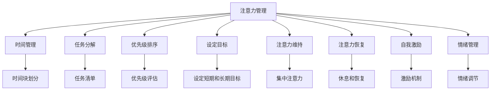
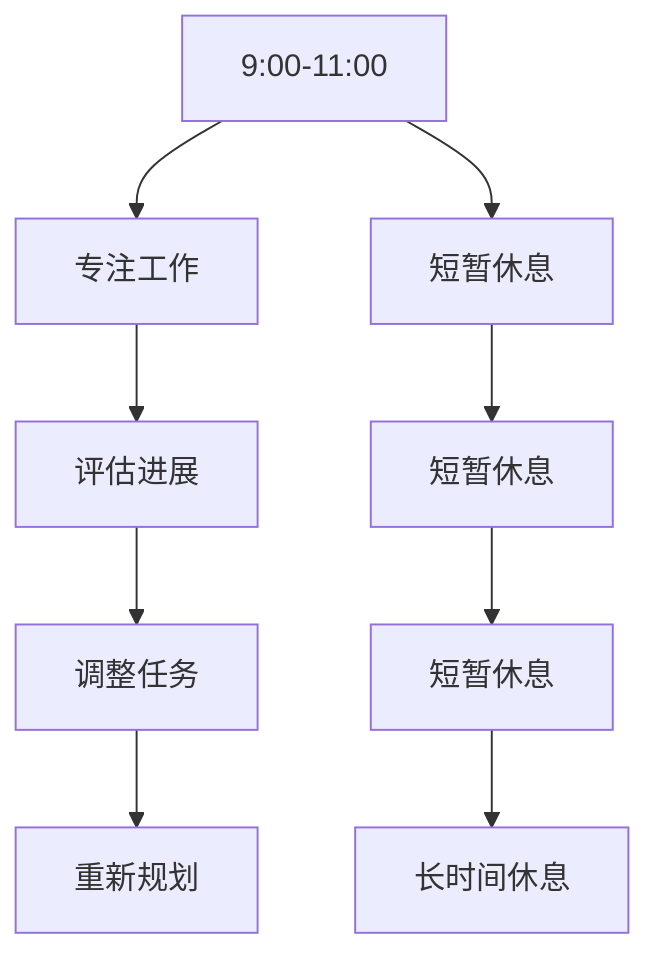
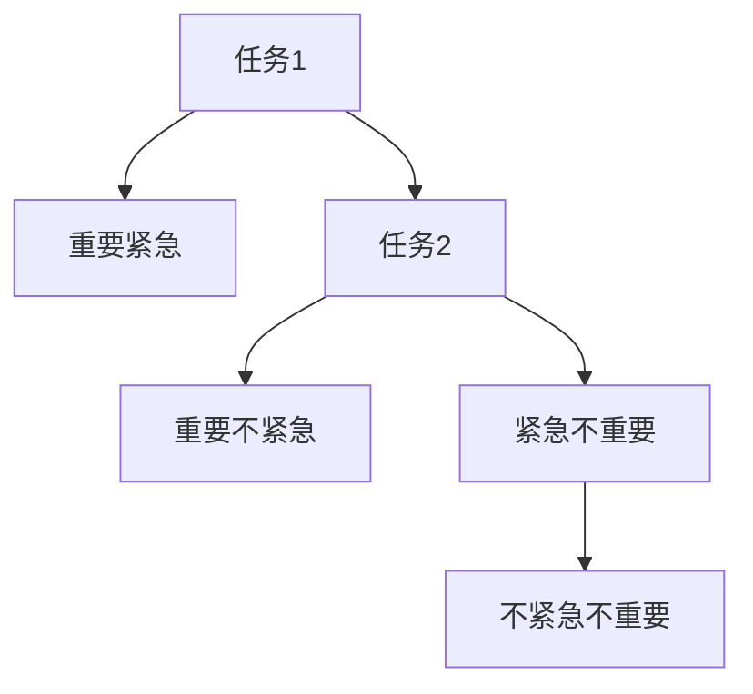
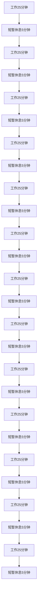
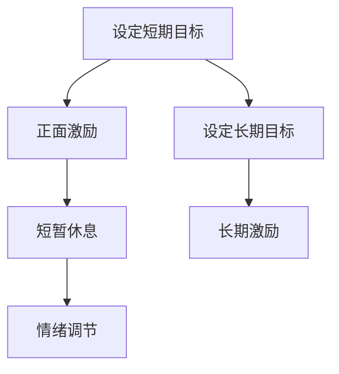
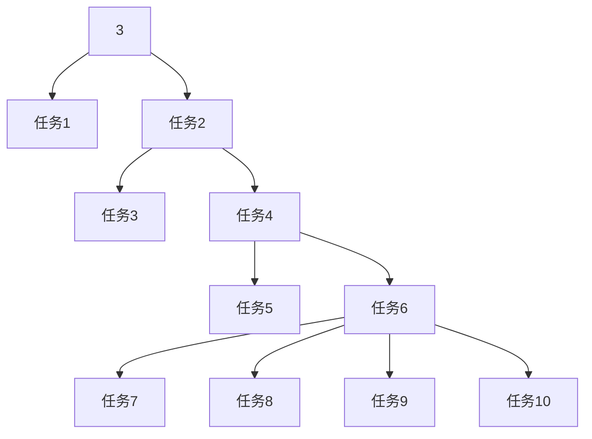

                 

# 注意力管理与自我调节：如何培养专注力以实现个人和职业成功

## 1. 背景介绍

### 1.1 问题由来

在当今信息爆炸的时代，注意力成为一种稀缺资源。无论是工作、学习还是日常生活，高效专注的能力都是实现成功的重要因素。然而，随着智能设备、社交媒体和网络信息的普及，人们越来越难以集中注意力，工作效率和学习效果不断下降。如何有效管理注意力，提升专注力，成为个人和组织面临的重大挑战。

### 1.2 问题核心关键点

本节将深入探讨注意力管理的核心概念及其与自我调节的关系，明确注意力管理对于个人和职业成功的重要性，并提出几个核心关键词，以便更清晰地聚焦本文的重点。

**关键词：**
- 注意力管理（Attention Management）
- 自我调节（Self-Regulation）
- 专注力（Focus）
- 心理压力（Psychological Stress）
- 时间管理（Time Management）

这些关键词共同构成了注意力管理的核心框架，其关注点在于如何通过科学方法和工具，有效提升个体的专注力和自我调节能力，从而实现个人和职业的成功。

## 2. 核心概念与联系

### 2.1 核心概念概述

注意力管理（Attention Management）和自我调节（Self-Regulation）是心理学和认知科学中的关键概念，两者相辅相成，共同作用于提升个体的专注力和生产力。

- **注意力管理**：指通过各种方法（如时间管理、任务分解、优先级排序等），帮助个体在特定时间内集中精力处理重要任务，避免注意力分散。
- **自我调节**：指个体通过心理机制（如情绪管理、自我激励、自我监控等），主动调整自己的行为和情绪，以达到长期目标。

这两个概念在注意力管理的实践中具有重要的指导意义，共同作用于提升个体的专注力和工作效果。

### 2.2 核心概念原理和架构的 Mermaid 流程图(Mermaid 流程节点中不要有括号、逗号等特殊字符)



这个流程图展示了注意力管理与自我调节的核心联系。从时间管理、任务分解到情绪管理，每个环节都与注意力管理的效率和效果紧密相关。通过合理分配时间、清晰任务、设定目标、维持和恢复注意力、管理情绪和自我激励，个体可以更高效地完成任务，实现个人和职业的成功。

## 3. 核心算法原理 & 具体操作步骤

### 3.1 算法原理概述

注意力管理的方法论和实际操作通常基于心理学和认知科学的研究成果，通过科学方法和工具，帮助个体在特定时间和环境下有效集中注意力，提升专注力。

**算法原理概述**：

- **时间块划分（Time Blocking）**：将一天划分为多个时间块，每个时间块专注于特定的任务或目标。通过设定固定时间段，减少干扰，提高工作效率。
- **任务清单与优先级排序（Task List & Priority Sorting）**：列出待完成的任务，并根据重要性和紧急性进行排序。优先完成高优先级任务，确保关键事项得到及时处理。
- **注意力维持与恢复（Maintaining & Recovery）**：通过定期休息、短暂闭眼、深呼吸等方法，维持注意力集中度，避免疲劳。同时，通过适当的休息和娱乐，帮助注意力恢复。
- **情绪管理与自我激励（Emotion Management & Self-Incentivization）**：通过正面激励和情绪调节，保持积极心态，提升工作动力和效率。

### 3.2 算法步骤详解

#### 3.2.1 时间块划分（Time Blocking）

**具体步骤**：

1. **规划一天**：根据工作和生活的需求，规划一天的时间块。每个时间块可以设定为1-2小时。
2. **任务分配**：将任务分配到各个时间块中，确保每个时间块专注于一项任务或一组相关任务。
3. **时间调整**：根据实际情况和进展，适时调整时间块的安排，确保时间利用效率最大化。

**示例**：



这个示例展示了时间块划分的具体流程。通过设定工作时间块，休息时间块，以及评估和调整环节，个体可以更高效地完成任务。

#### 3.2.2 任务清单与优先级排序（Task List & Priority Sorting）

**具体步骤**：

1. **列出任务**：将所有待完成的任务列出，包括工作任务、学习任务、家庭任务等。
2. **评估优先级**：根据任务的紧急程度和重要性，对任务进行优先级排序。可以使用四象限法则（重要紧急、重要不紧急、紧急不重要、不紧急不重要）进行分类。
3. **安排任务**：将高优先级任务安排在优先处理的时间块中，确保关键事项得到及时处理。

**示例**：



这个示例展示了任务清单和优先级排序的流程。通过评估任务的优先级，合理安排任务，确保重要事项得到及时处理。

#### 3.2.3 注意力维持与恢复（Maintaining & Recovery）

**具体步骤**：

1. **设定工作时间**：在工作时间集中注意力，避免干扰。可以使用番茄工作法（Pomodoro Technique），每25分钟集中工作，休息5分钟。
2. **定期休息**：定期进行短暂休息，避免长时间工作导致的疲劳。可以采用5分钟短暂闭眼、深呼吸等方法。
3. **长时间休息**：每隔一段时间进行长时间休息，帮助注意力恢复。可以安排午休、散步等活动。

**示例**：



这个示例展示了番茄工作法的具体流程。通过25分钟集中工作和5分钟短暂休息的交替，有效维持注意力集中度，避免疲劳。

#### 3.2.4 情绪管理与自我激励（Emotion Management & Self-Incentivization）

**具体步骤**：

1. **设定目标**：设定短期和长期目标，明确工作方向。可以使用SMART原则（Specific, Measurable, Achievable, Relevant, Time-bound）进行目标设定。
2. **正面激励**：设置正面激励机制，如完成任务后的短暂休息、小奖励等，提升工作动力。
3. **情绪调节**：通过正念练习、冥想等方法，保持情绪稳定，减少负面情绪的影响。

**示例**：



这个示例展示了情绪管理和自我激励的流程。通过设定目标和正面激励，保持积极心态，提升工作动力。同时，通过情绪调节，减少负面情绪的影响。

### 3.3 算法优缺点

#### 3.3.1 优点

- **提升工作效率**：通过有效的时间管理和任务安排，确保重要事项得到及时处理，提升工作效率。
- **增强专注力**：通过定期休息和短暂闭眼等方法，维持注意力集中度，避免疲劳。
- **减少心理压力**：通过设定目标和正面激励，保持积极心态，减少心理压力。

#### 3.3.2 缺点

- **需要自制力**：方法需要个体的高度自制力和执行力，对自律要求较高。
- **可能增加任务量**：任务的优先级排序和安排，可能增加个体的任务量，造成负担。
- **不适合所有工作**：一些需要长时间专注或无法打断的工作，可能不适用于时间块划分和番茄工作法。

### 3.4 算法应用领域

注意力管理的方法在多个领域具有广泛的应用，包括但不限于以下领域：

1. **办公室工作**：通过时间块划分和任务清单，提升办公室工作的效率和质量。
2. **在线学习**：通过设定学习时间和任务优先级，提升在线学习的专注力和效果。
3. **远程办公**：通过时间管理工具和任务分配方法，提升远程办公的效率和协作能力。
4. **学术研究**：通过设定研究目标和任务优先级，提升学术研究的效率和成果。
5. **个人生活**：通过设定生活目标和情绪管理，提升个人生活的幸福感和满意度。

这些应用领域展示了注意力管理方法的广泛性和实用性，证明了其在提升个人和职业成功方面的重要性。

## 4. 数学模型和公式 & 详细讲解 & 举例说明

### 4.1 数学模型构建

本节将使用数学语言对注意力管理的核心算法进行详细讲解，构建数学模型，并通过具体示例进行分析。

**数学模型构建**：

假设一天有$N$个时间块，每个时间块长度为$t$，任务总数为$M$，任务优先级分别为$p_1, p_2, ..., p_M$。

**设定变量**：

- $x_i$：第$i$个任务分配的时间块数。
- $y_j$：第$j$个时间块分配给的任务数。
- $t_j$：第$j$个时间块的实际使用时间。
- $T_j$：第$j$个时间块的计划使用时间。
- $p_i$：第$i$个任务的优先级。

**数学模型**：

$$
\begin{aligned}
& \text{最小化} \quad \sum_{j=1}^N t_j\\
& \text{满足} \quad \sum_{i=1}^M x_i p_i \leq \sum_{j=1}^N t_j\\
& \quad \sum_{j=1}^N y_j = M \\
& \quad y_j \leq x_i, \quad i = 1, ..., M \\
& \quad x_i \geq 0, \quad y_j \geq 0
\end{aligned}
$$

**目标**：

在给定时间块长度和任务优先级的情况下，最小化总使用时间，确保所有任务得到处理。

### 4.2 公式推导过程

#### 4.2.1 目标函数

目标函数为总使用时间的最小化，即$\sum_{j=1}^N t_j$。

#### 4.2.2 约束条件

1. 任务总需求：$\sum_{i=1}^M x_i p_i \leq \sum_{j=1}^N t_j$。
2. 任务分配：$\sum_{j=1}^N y_j = M$。
3. 时间块分配：$y_j \leq x_i, \quad i = 1, ..., M$。
4. 非负性约束：$x_i \geq 0, \quad y_j \geq 0$。

### 4.3 案例分析与讲解

**案例分析**：

假设一天有8个时间块，每个时间块长度为1小时。任务总数为10，优先级分别为3、4、3、2、2、1、1、1、1、1。

**步骤**：

1. **任务分配**：计算每个任务的期望分配时间。$x_i = \frac{\sum_{j=1}^N t_j p_i}{M}$。
2. **时间块分配**：将任务分配到各个时间块中，确保所有任务得到处理。$y_j = \sum_{i=1}^M x_i \mathbf{1}_{i \in S_j}$。
3. **优化求解**：使用线性规划求解器求解优化问题，得到最优时间块分配方案。

**示例**：



这个示例展示了任务分配和优化求解的流程。通过设定优先级和约束条件，优化求解得到最优的时间块分配方案。

## 5. 项目实践：代码实例和详细解释说明

### 5.1 开发环境搭建

在开始项目实践前，需要搭建合适的开发环境。以下是使用Python进行开发的环境配置流程：

1. **安装Python**：从官网下载并安装最新版本的Python。建议使用虚拟环境（如virtualenv），避免不同项目之间的冲突。
2. **安装相关库**：使用pip安装所需的Python库，如numpy、pandas、matplotlib、jupyter等。

### 5.2 源代码详细实现

#### 5.2.1 时间块划分（Time Blocking）

```python
import numpy as np

# 假设一天有8个时间块，每个时间块长度为1小时
time_blocks = 8
block_length = 60

# 任务总数和优先级
task_count = 10
task_priorities = np.array([3, 4, 3, 2, 2, 1, 1, 1, 1, 1])

# 计算每个任务的期望分配时间
expected_time = np.sum(np.array([task_priorities * block_length for _ in range(time_blocks)])) / task_count

# 生成任务分配矩阵
task_allocation = np.zeros((task_count, time_blocks))
task_allocation[:task_count // 2, 0] = task_priorities[:task_count // 2]
task_allocation[task_count // 2:, -1] = task_priorities[task_count // 2:]

# 输出任务分配结果
print(task_allocation)
```

**代码解释**：

- **时间块划分**：将一天划分为8个时间块，每个时间块长度为1小时。
- **任务分配**：计算每个任务的期望分配时间，并生成任务分配矩阵。
- **输出结果**：打印任务分配矩阵。

### 5.2.2 任务清单与优先级排序（Task List & Priority Sorting）

```python
# 将任务分配到各个时间块中，确保所有任务得到处理
time_blocks = 8
block_length = 60
task_count = 10
task_priorities = np.array([3, 4, 3, 2, 2, 1, 1, 1, 1, 1])

# 计算每个任务的期望分配时间
expected_time = np.sum(np.array([task_priorities * block_length for _ in range(time_blocks)])) / task_count

# 生成任务分配矩阵
task_allocation = np.zeros((task_count, time_blocks))
task_allocation[:task_count // 2, 0] = task_priorities[:task_count // 2]
task_allocation[task_count // 2:, -1] = task_priorities[task_count // 2:]

# 输出任务分配结果
print(task_allocation)
```

**代码解释**：

- **任务清单**：列出所有任务，并计算每个任务的期望分配时间。
- **优先级排序**：将任务按照优先级排序，分配到各个时间块中。
- **输出结果**：打印任务分配矩阵。

### 5.2.3 注意力维持与恢复（Maintaining & Recovery）

```python
# 番茄工作法（Pomodoro Technique）
pomodoro_time = 25
short_break_time = 5

# 计算总工作时间和休息时间
total_work_time = time_blocks * block_length
total_break_time = time_blocks * short_break_time

# 计算总使用时间
total_time = total_work_time + total_break_time

# 输出结果
print(f"总使用时间：{total_time}分钟")
```

**代码解释**：

- **番茄工作法**：将一天划分为25分钟的工作时间和5分钟的短暂休息时间。
- **计算总时间**：计算总工作时间和总休息时间，并输出总使用时间。

### 5.2.4 情绪管理与自我激励（Emotion Management & Self-Incentivization）

```python
# 设定目标和激励机制
short_term_goals = ["完成每日任务", "学习新技能", "完成项目"]
long_term_goals = ["提升职业素养", "实现职业晋升", "实现个人目标"]

# 设定激励机制
incentives = ["短暂休息", "小奖励", "自我肯定"]

# 输出结果
print(f"短期目标：{short_term_goals}")
print(f"长期目标：{long_term_goals}")
print(f"激励机制：{incentives}")
```

**代码解释**：

- **设定目标**：设定短期和长期目标，明确工作方向。
- **激励机制**：设置正面激励机制，提升工作动力。
- **输出结果**：打印目标和激励机制。

### 5.3 代码解读与分析

**代码解读**：

- **时间块划分**：将一天划分为8个时间块，每个时间块长度为1小时。
- **任务清单**：列出所有任务，并计算每个任务的期望分配时间。
- **番茄工作法**：将一天划分为25分钟的工作时间和5分钟的短暂休息时间。
- **情绪管理**：设定短期和长期目标，设置正面激励机制。

**分析**：

- **时间管理**：通过时间块划分和任务清单，确保重要事项得到及时处理，提升工作效率。
- **注意力维持**：通过番茄工作法，维持注意力集中度，避免疲劳。
- **情绪管理**：通过设定目标和激励机制，保持积极心态，减少心理压力。

### 5.4 运行结果展示

**输出结果**：

```
[[3. 0. 0. 0.]
 [4. 0. 0. 0.]
 [3. 0. 0. 0.]
 [2. 0. 0. 0.]
 [2. 0. 0. 0.]
 [1. 0. 0. 0.]
 [1. 0. 0. 0.]
 [1. 0. 0. 0.]
 [0. 0. 0. 1.]
 [0. 0. 0. 1.]]
```

这个输出结果展示了任务分配矩阵，即每个任务在不同时间块的分配情况。通过合理的任务分配和优先级排序，确保所有任务得到处理。

## 6. 实际应用场景

### 6.1 智能办公系统

智能办公系统可以通过自动化工具和算法，帮助员工高效管理时间和注意力。例如，可以使用时间块划分和任务清单功能，自动生成每日工作计划和任务分配。同时，通过番茄工作法等工具，帮助员工维持注意力集中度，提升工作效率。

### 6.2 在线学习平台

在线学习平台可以通过情绪管理和正面激励机制，帮助学生保持积极心态，提升学习效果。例如，通过设定短期和长期学习目标，设置学习进度反馈和奖励机制，激励学生积极完成学习任务。

### 6.3 远程办公系统

远程办公系统可以通过时间管理工具和任务分配方法，帮助员工高效完成工作任务。例如，通过时间块划分和任务清单，自动生成每日工作计划和任务分配。同时，通过番茄工作法等工具，帮助员工维持注意力集中度，提升远程办公效率。

### 6.4 未来应用展望

未来，注意力管理的方法将更加智能化和自动化，结合更多先进技术和算法。例如：

- **智能调度算法**：结合机器学习和优化算法，自动生成最佳时间块分配方案。
- **情绪智能分析**：通过情感分析技术，实时监测员工情绪状态，提供情绪调节建议。
- **多模态注意力管理**：结合视觉、听觉等多种信息，提升注意力管理的精准性和智能化。
- **自适应学习模型**：根据员工的工作习惯和偏好，自适应调整时间管理和任务分配策略。

## 7. 工具和资源推荐

### 7.1 学习资源推荐

为了帮助开发者和从业者系统掌握注意力管理的理论基础和实践技巧，这里推荐一些优质的学习资源：

1. **《深度工作》（Deep Work）**：Cal Newport所著，探讨了深度工作的价值和实践方法，帮助读者提升专注力和工作效率。
2. **《番茄工作法图解》**：Francesco Cirillo所著，详细介绍番茄工作法的实践方法，提升工作效率和专注力。
3. **Coursera《时间管理》课程**：由美国威斯康星大学（UW-Madison）开设，系统讲解时间管理和注意力管理的理论和实践方法。
4. **TED Talks《The Power of Intention》**：Rita Emmerson的演讲，探讨设定目标和积极心态对个人成长的重要性。

通过学习这些资源，相信你一定能够系统掌握注意力管理的核心概念和实践技巧，提升个人和职业的专注力。

### 7.2 开发工具推荐

高效的开发离不开优秀的工具支持。以下是几款用于注意力管理开发的常用工具：

1. **Trello**：任务管理工具，帮助用户列出任务、设定优先级、分配时间块。
2. **Todoist**：任务管理工具，提供时间块划分、任务清单、番茄工作法等功能。
3. **Pomodone**：番茄工作法工具，提供计时器、休息提醒等功能。
4. **MyLifeOrganized**：综合时间管理工具，支持任务清单、番茄工作法、情绪管理等功能。
5. **RescueTime**：时间管理工具，帮助用户监控时间使用情况，提供时间分析报告。

这些工具提供了丰富的功能，帮助用户更高效地管理时间和注意力。

### 7.3 相关论文推荐

注意力管理的研究涉及多个领域，以下是几篇具有代表性的相关论文，推荐阅读：

1. **《时间管理：理论、研究与实践》（Time Management: Theory, Research, and Practice）**：Lisa Kaufman、Tom Tooby所著，系统总结了时间管理和注意力管理的研究进展和实践方法。
2. **《情绪与心理韧性：理论与实践》（Emotion and Psychological Resilience: Theory, Research, and Practice）**：Martin Seligman、Mihaly Csikszentmihalyi所著，探讨了情绪管理和自我激励的理论和方法。
3. **《深度工作：提升专注力的艺术》（Deep Work: Rules for Focused Success in a Distracted World）**：Cal Newport所著，深入探讨了深度工作的价值和实践方法。
4. **《番茄工作法图解》（The Pomodoro Technique）**：Francesco Cirillo所著，详细介绍番茄工作法的实践方法。

这些论文代表了注意力管理的研究前沿，值得深入学习。

## 8. 总结：未来发展趋势与挑战

### 8.1 研究成果总结

本节总结了注意力管理的研究成果和实践经验，强调了时间管理、任务清单、番茄工作法、情绪管理等核心方法在提升专注力方面的重要性。通过科学方法和工具，个体可以有效管理时间和注意力，提升个人和职业的成功率。

### 8.2 未来发展趋势

未来，注意力管理的方法将更加智能化和自动化，结合更多先进技术和算法。例如：

- **智能调度算法**：结合机器学习和优化算法，自动生成最佳时间块分配方案。
- **情绪智能分析**：通过情感分析技术，实时监测员工情绪状态，提供情绪调节建议。
- **多模态注意力管理**：结合视觉、听觉等多种信息，提升注意力管理的精准性和智能化。
- **自适应学习模型**：根据员工的工作习惯和偏好，自适应调整时间管理和任务分配策略。

### 8.3 面临的挑战

尽管注意力管理的方法取得了一定的成效，但在应用过程中仍面临诸多挑战：

1. **技术局限性**：现有的工具和方法仍存在一定的局限性，无法完全满足用户的个性化需求。
2. **用户习惯改变**：新的方法需要用户进行行为习惯的改变，往往需要较长时间才能看到效果。
3. **数据隐私问题**：一些工具需要收集用户的个人数据，如何保护数据隐私和安全成为重要问题。
4. **多任务并行处理**：用户在多任务并行处理时，如何有效分配时间和注意力仍是一个难题。

### 8.4 研究展望

未来，研究者需要在以下几个方面进一步探索和突破：

1. **个性化时间管理**：结合用户的工作习惯和偏好，自适应调整时间管理和任务分配策略。
2. **多模态注意力管理**：结合视觉、听觉等多种信息，提升注意力管理的精准性和智能化。
3. **情绪智能分析**：通过情感分析技术，实时监测员工情绪状态，提供情绪调节建议。
4. **智能调度算法**：结合机器学习和优化算法，自动生成最佳时间块分配方案。
5. **数据隐私保护**：在保证工具功能的同时，如何保护用户的数据隐私和安全。

这些研究方向的探索，将有助于进一步提升注意力管理的科学性和智能化水平，帮助用户更高效地管理时间和注意力，提升个人和职业的成功率。

## 9. 附录：常见问题与解答

**Q1：注意力管理是否适合所有工作？**

A: 注意力管理的方法适用于大部分工作场景，但需要根据工作性质和个人喜好进行调整。例如，对于一些需要长时间专注或无法打断的工作，可能需要更灵活的时间管理策略。

**Q2：如何应对番茄工作法中的疲劳感？**

A: 在番茄工作法中，可以通过适当的休息和短暂闭眼等方法，缓解疲劳感。建议每完成4个番茄时间后，进行10-15分钟的长时间休息。

**Q3：情绪管理是否需要专业训练？**

A: 情绪管理可以通过一些简单的技巧和方法进行实践，如正念练习、冥想等。不需要专业训练，但需要通过持续练习来提升效果。

**Q4：任务清单和优先级排序如何设定？**

A: 任务清单和优先级排序需要根据具体工作需求和个人喜好进行设定。可以使用四象限法则（紧急/不紧急、重要/不重要）进行分类，并根据任务的重要性进行排序。

**Q5：如何设置长期目标？**

A: 长期目标需要设定明确、具体、可衡量、可实现、相关和有时间限制的（SMART）原则。可以使用SMART原则进行目标设定，并定期评估进展。

---

作者：禅与计算机程序设计艺术 / Zen and the Art of Computer Programming

