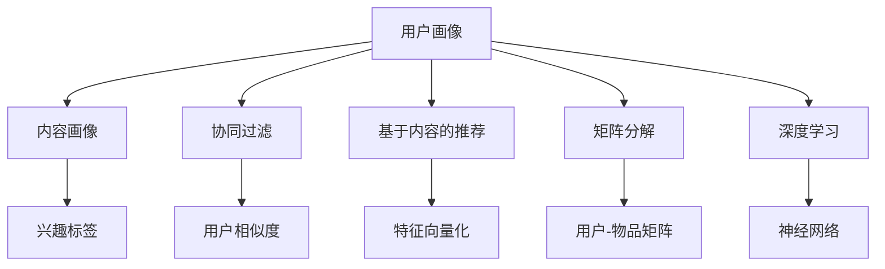

                 

# 注意力经济与个性化推荐系统：为受众提供定制、有针对性的内容和体验

## 1. 背景介绍

### 1.1 问题由来

在信息爆炸的时代，人们每天都面临着海量信息的冲击。从传统媒体到社交网络，从搜索引擎到内容平台，每时每刻都有新的内容产生，用户该如何筛选出真正有价值的信息？如何提升用户体验和平台收益？

个性化推荐系统应运而生。通过分析用户的历史行为和偏好，预测用户可能感兴趣的内容，为用户推荐个性化的信息。这种基于用户兴趣和行为的推荐方式，能够极大地提升用户的参与度和满意度，同时为平台带来更高的点击率、转化率和收益。

个性化推荐系统是注意力经济的核心，能够帮助平台聚焦用户注意力，实现信息与用户需求的精准匹配。但随着用户对内容的个性化需求越来越高，推荐系统也面临着新的挑战：如何更好地理解用户需求，提供更丰富、更精准的个性化体验？

### 1.2 问题核心关键点

个性化推荐系统的工作原理是预测用户对某个内容的兴趣，然后为其推荐该内容。核心的技术问题包括：

- 如何表示用户行为和兴趣？常用的表示方法包括用户-物品交互矩阵、用户画像、兴趣向量等。
- 如何刻画内容属性和质量？常用的方法包括内容标签、文本摘要、情感分析等。
- 如何选择推荐模型？常用的模型包括协同过滤、基于内容的推荐、矩阵分解、深度学习等。
- 如何衡量推荐效果？常用的指标包括点击率、转化率、覆盖率、多样性等。

个性化推荐系统经过数十年的发展，已经成为互联网企业不可或缺的核心竞争力之一。但随着技术的发展和用户需求的提升，推荐系统也需要不断创新和改进，以实现更高效、更精准、更个性化的推荐。

## 2. 核心概念与联系

### 2.1 核心概念概述

个性化推荐系统依赖于大量数据和模型算法，其核心概念包括：

- 用户画像(User Profile)：对用户的行为和兴趣进行建模，一般由兴趣向量、用户画像图谱、用户标签等组成。
- 内容画像(Content Profile)：对内容的属性和质量进行建模，一般由内容标签、情感分析、文本摘要等组成。
- 协同过滤(Collaborative Filtering)：基于用户-物品交互矩阵，通过用户相似度或物品相似度进行推荐。
- 基于内容的推荐(Content-Based Recommendation)：通过内容的属性特征进行推荐，与用户画像无关。
- 矩阵分解(Matrix Factorization)：通过分解用户-物品交互矩阵，得到低维用户和物品表示，进行推荐。
- 深度学习(Deep Learning)：通过构建深度神经网络，对用户行为和内容特征进行建模，进行推荐。

这些概念之间的逻辑关系可以通过以下Mermaid流程图来展示：



这个流程图展示了个性化推荐系统的主要概念及其之间的关系：

1. 用户画像和内容画像分别对用户和内容的属性进行建模。
2. 协同过滤、基于内容的推荐、矩阵分解、深度学习等不同推荐算法可以基于用户画像和内容画像进行推荐。
3. 推荐系统通常会融合多种算法，提升推荐效果。

## 3. 核心算法原理 & 具体操作步骤
### 3.1 算法原理概述

个性化推荐系统的核心算法是推荐模型，其主要原理是通过用户画像和内容画像，预测用户对某内容的兴趣，并为其推荐该内容。推荐模型的训练过程通常包含以下步骤：

1. 数据准备：收集用户行为数据，包括点击、浏览、购买等。同时收集内容数据，如文本、图片、评分等。
2. 特征工程：将用户行为和内容数据转化为特征向量，用于模型训练。常用的特征包括用户ID、物品ID、时间戳、内容标签等。
3. 模型训练：选择合适的推荐算法，使用训练数据训练推荐模型。
4. 模型评估：使用测试数据评估推荐模型的效果，常见的评估指标包括点击率、转化率、覆盖率等。
5. 在线推荐：将训练好的模型应用到线上环境，为每个用户实时推荐内容。

### 3.2 算法步骤详解

以基于协同过滤的推荐算法为例，其具体步骤包括：

**Step 1: 数据准备**
- 收集用户行为数据，如用户ID、物品ID、时间戳、行为类型等。
- 收集内容数据，如物品ID、物品名称、内容标签等。

**Step 2: 特征工程**
- 对用户行为数据进行编码，如将点击行为编码为1，浏览行为编码为0。
- 对内容数据进行特征提取，如将物品名称进行分词，提取关键词作为特征。
- 构建用户-物品交互矩阵，记录用户对不同物品的行为。

**Step 3: 模型训练**
- 将用户-物品交互矩阵转化为矩阵形式。
- 对用户画像和内容画像进行编码，如将用户ID转化为向量表示。
- 选择协同过滤算法，如基于用户的协同过滤或基于物品的协同过滤，训练推荐模型。

**Step 4: 模型评估**
- 使用测试集评估推荐模型的效果，计算点击率、覆盖率等指标。
- 使用用户反馈数据评估推荐效果，如通过用户满意度调查等方式获取用户反馈。

**Step 5: 在线推荐**
- 实时获取用户行为数据，使用训练好的推荐模型预测用户可能感兴趣的内容。
- 将预测结果推荐给用户，并记录用户反馈数据。
- 定期更新推荐模型，提高推荐效果。

### 3.3 算法优缺点

基于协同过滤的推荐算法具有以下优点：
1. 简单易用：协同过滤算法实现简单，计算复杂度低，适合大规模应用。
2. 高效准确：在用户-物品交互数据充足的情况下，协同过滤能够准确预测用户兴趣，提供高质量推荐。
3. 可扩展性好：协同过滤算法可以应用于不同类型的数据，如文本、图片、视频等。

同时，该算法也存在一些缺点：
1. 冷启动问题：对于新用户和新物品，协同过滤难以准确预测其兴趣，推荐效果不佳。
2. 数据稀疏性：当用户和物品数量较大时，用户-物品交互矩阵往往很稀疏，推荐效果会下降。
3. 对抗攻击：协同过滤算法对恶意对抗行为敏感，容易被攻击者利用。

### 3.4 算法应用领域

个性化推荐系统已经在各个领域得到了广泛应用，包括但不限于：

- 电子商务：为电商用户推荐商品、折扣、活动等。
- 视频平台：为用户推荐视频内容、创作者等。
- 音乐平台：为用户推荐歌曲、专辑、歌手等。
- 新闻媒体：为用户推荐新闻、文章、评论等。
- 社交网络：为用户推荐好友、内容、事件等。
- 出行服务：为用户推荐交通方式、路线、住宿等。

除了上述这些常见应用场景，个性化推荐系统还在教育、医疗、金融、旅游等众多领域发挥着重要作用，为用户的个性化需求提供全面、精准的解决方案。

## 4. 数学模型和公式 & 详细讲解  
### 4.1 数学模型构建

个性化推荐系统的数学模型通常包括用户画像模型、内容画像模型和推荐模型。以基于协同过滤的推荐系统为例，其数学模型可以表示为：

设 $U$ 为所有用户集合，$I$ 为所有物品集合。$R_{ui}$ 表示用户 $u$ 对物品 $i$ 的评分或交互次数。$P_u$ 表示用户 $u$ 的兴趣向量，$P_i$ 表示物品 $i$ 的属性向量。推荐模型 $M$ 的输出为 $R_{ui}$ 的预测值，即 $R_{ui}^{\hat{}}$。则推荐模型可以表示为：

$$
R_{ui}^{\hat{}} = P_u \cdot P_i^T
$$

其中 $\cdot$ 表示向量点乘，$T$ 表示矩阵转置。

### 4.2 公式推导过程

以基于协同过滤的推荐算法为例，其推荐公式可以表示为：

设 $P_u$ 为用户 $u$ 的兴趣向量，$P_i$ 为物品 $i$ 的属性向量。用户 $u$ 对物品 $i$ 的评分 $R_{ui}$ 可以表示为：

$$
R_{ui} = P_u \cdot P_i^T
$$

其中 $P_u$ 和 $P_i$ 是用户画像和内容画像的低维表示。推荐模型 $M$ 的输出为 $R_{ui}$ 的预测值，即 $R_{ui}^{\hat{}}$。则推荐模型可以表示为：

$$
R_{ui}^{\hat{}} = P_u \cdot P_i^T
$$

在实际应用中，上述公式可以进一步扩展为：

$$
R_{ui}^{\hat{}} = \sum_{j=1}^D (P_u[j] \cdot P_i[j])
$$

其中 $D$ 为特征向量的维度。

### 4.3 案例分析与讲解

以电子商务推荐系统为例，其推荐流程可以简单表示为：

1. 数据准备：收集用户行为数据，如用户ID、物品ID、时间戳、行为类型等。
2. 特征工程：将用户行为数据进行编码，如将点击行为编码为1，浏览行为编码为0。
3. 模型训练：使用协同过滤算法，训练推荐模型。
4. 模型评估：使用测试集评估推荐模型的效果，计算点击率、覆盖率等指标。
5. 在线推荐：实时获取用户行为数据，使用训练好的推荐模型预测用户可能感兴趣的商品，并推荐给用户。

具体实现代码如下：

```python
import pandas as pd
from surprise import Dataset
from surprise import Reader
from surprise import KNNBasic

# 准备数据
data = pd.read_csv('user_behavior.csv')
reader = Reader(rating_scale=(1, 5))
dataset = Dataset.load_from_df(data, reader)

# 特征工程
user_item = dataset.build_full_trainset().user_item
user_labels = dataset.build_full_trainset().user_labels

# 模型训练
algo = KNNBasic(sim_options={'metric': 'pearson', 'user_based': False})
algo.fit(user_item, user_labels)

# 模型评估
trainset = dataset.build_full_trainset()
testset = Dataset.load_from_df(data.drop('user_behavior', axis=1), reader)
algo.test(testset)

# 在线推荐
def recommend(user_id, n=5):
    testset = Dataset.load_from_df(data.loc[data['user_id'] == user_id], reader)
    testset = testset.build_full_testset()
    predictions = algo.test(testset)
    results = pd.DataFrame(predictions.as_dict())
    results['item_id'] = results['iid']
    results = results.sort_values(by='score', ascending=False)
    return results.head(n)
```

## 5. 项目实践：代码实例和详细解释说明
### 5.1 开发环境搭建

在进行个性化推荐系统开发前，我们需要准备好开发环境。以下是使用Python进行推荐系统开发的常见开发环境配置流程：

1. 安装Anaconda：从官网下载并安装Anaconda，用于创建独立的Python环境。

2. 创建并激活虚拟环境：
```bash
conda create -n recsys python=3.8 
conda activate recsys
```

3. 安装推荐系统库：
```bash
conda install scikit-learn pandas numpy scipy scikit-mindflow recsys
```

4. 安装相关依赖包：
```bash
pip install tqdm plotly scikit-image torch torchvision
```

5. 安装其他工具包：
```bash
pip install numpy pandas scikit-learn scikit-mindflow matplotlib seaborn plotly scikit-image torch torchvision
```

完成上述步骤后，即可在`recsys`环境中开始推荐系统开发。

### 5.2 源代码详细实现

下面我们以电子商务推荐系统为例，给出使用Python和Scikit-Learn库进行推荐系统开发的详细代码实现。

首先，定义推荐系统的输入数据和评分预测函数：

```python
from surprise import Dataset
from surprise import Reader
from surprise import KNNBasic

# 准备数据
data = pd.read_csv('user_behavior.csv')
reader = Reader(rating_scale=(1, 5))
dataset = Dataset.load_from_df(data, reader)

# 特征工程
user_item = dataset.build_full_trainset().user_item
user_labels = dataset.build_full_trainset().user_labels

# 模型训练
algo = KNNBasic(sim_options={'metric': 'pearson', 'user_based': False})
algo.fit(user_item, user_labels)

# 模型评估
trainset = dataset.build_full_trainset()
testset = Dataset.load_from_df(data.drop('user_behavior', axis=1), reader)
algo.test(testset)

# 在线推荐
def recommend(user_id, n=5):
    testset = Dataset.load_from_df(data.loc[data['user_id'] == user_id], reader)
    testset = testset.build_full_testset()
    predictions = algo.test(testset)
    results = pd.DataFrame(predictions.as_dict())
    results['item_id'] = results['iid']
    results = results.sort_values(by='score', ascending=False)
    return results.head(n)
```

然后，使用Matplotlib库绘制推荐结果的直方图：

```python
import matplotlib.pyplot as plt

# 绘制推荐结果的直方图
user_id = 1
results = recommend(user_id, n=5)
plt.hist(results['item_id'], bins=100, range=[1, 1000])
plt.xlabel('Item ID')
plt.ylabel('Frequency')
plt.show()
```

最后，输出推荐结果：

```python
print(results.head(n=5))
```

以上代码实现了基于协同过滤的电子商务推荐系统，能够为用户推荐感兴趣的电商商品，并通过Matplotlib库绘制推荐结果的直方图。通过这个例子，可以看到推荐系统开发的简单高效。

### 5.3 代码解读与分析

让我们再详细解读一下关键代码的实现细节：

**Dataset类**：
- `Dataset.load_from_df`方法：将数据集加载为Surprise数据集，方便进行推荐算法训练和测试。

**KNNBasic类**：
- `KNNBasic`类：基于协同过滤算法的推荐模型，可以指定不同的相似度度量方法。

**recommend函数**：
- `recommend`函数：根据用户ID，获取推荐结果，并返回前n个推荐商品ID。

**绘制推荐结果的直方图**：
- `plt.hist`方法：绘制推荐结果的直方图，用于可视化推荐效果。

通过这些代码，我们可以看到推荐系统的基本实现流程：

1. 数据准备：加载用户行为数据和评分数据。
2. 特征工程：对数据进行编码，构建用户-物品交互矩阵。
3. 模型训练：使用协同过滤算法，训练推荐模型。
4. 模型评估：使用测试集评估推荐模型效果。
5. 在线推荐：实时获取用户行为数据，使用训练好的推荐模型预测用户可能感兴趣的物品，并推荐给用户。

## 6. 实际应用场景
### 6.1 智能电商推荐

智能电商推荐系统能够帮助电商企业更好地理解用户需求，提高用户体验和转化率。通过分析用户的浏览、点击、购买等行为，电商推荐系统可以为每个用户推荐个性化的商品、活动、折扣等，显著提升电商平台的销售额和用户满意度。

具体应用场景包括：
- 商品推荐：根据用户的浏览和购买历史，推荐相似的商品。
- 活动推荐：根据用户的兴趣，推荐促销活动、新商品、限时优惠等。
- 个性化服务：根据用户的兴趣，推荐定制化服务，如个性化推荐、专属客服等。

### 6.2 视频平台推荐

视频平台推荐系统能够为用户推荐感兴趣的视频内容、创作者等，提升用户的观看体验和满意度。通过分析用户的观看历史、点赞、评论等行为，视频推荐系统可以为每个用户推荐相关的视频、频道、创作者等，帮助用户发现更多精彩内容。

具体应用场景包括：
- 视频推荐：根据用户的观看历史，推荐相似的视频内容。
- 频道推荐：根据用户的兴趣，推荐相关频道。
- 创作者推荐：根据用户的兴趣，推荐创作者和作品。

### 6.3 音乐平台推荐

音乐平台推荐系统能够为用户推荐感兴趣的音乐、专辑、歌手等，提升用户的听歌体验和满意度。通过分析用户的听歌历史、收藏、点赞等行为，音乐推荐系统可以为每个用户推荐相似的音乐、专辑、歌手等，帮助用户发现更多喜欢的音乐作品。

具体应用场景包括：
- 音乐推荐：根据用户的听歌历史，推荐相似的音乐。
- 专辑推荐：根据用户的听歌历史，推荐相关专辑。
- 歌手推荐：根据用户的听歌历史，推荐相关歌手。

### 6.4 未来应用展望

随着推荐算法的不断进步和数据量的不断增长，个性化推荐系统将迎来更广阔的应用场景：

1. 跨媒体推荐：通过多模态数据融合，实现视频、音频、文本等多媒体内容的推荐。
2. 个性化服务：通过用户画像和内容画像，提供个性化服务，如定制化推荐、个性化问答等。
3. 深度学习推荐：通过深度神经网络模型，提高推荐系统的准确性和多样性。
4. 实时推荐：通过在线推荐引擎，实时获取用户行为数据，为用户推荐最新内容。
5. 场景推荐：通过实时环境数据，为用户提供更符合当前场景的推荐内容，如旅游推荐、社交推荐等。

## 7. 工具和资源推荐
### 7.1 学习资源推荐

为了帮助开发者系统掌握推荐系统的理论基础和实践技巧，这里推荐一些优质的学习资源：

1. 《推荐系统实战》书籍：深度介绍推荐系统的基本概念、算法实现和应用案例，适合初学者入门。
2. 《Recommender Systems: Algorithms and Applications》书籍：由推荐系统领域专家编写，全面介绍推荐系统的理论基础和应用实践。
3 CS 5021《推荐系统》课程：由斯坦福大学开设的推荐系统课程，涵盖推荐算法、评估指标、数据处理等方面。
4. Kaggle推荐系统竞赛：Kaggle平台提供的推荐系统竞赛，能够帮助开发者积累实战经验。
5. PyTorch推荐系统库：PyTorch提供的高性能推荐系统库，支持多种推荐算法和模型。

通过对这些资源的学习实践，相信你一定能够快速掌握推荐系统的精髓，并用于解决实际的推荐问题。

### 7.2 开发工具推荐

高效的开发离不开优秀的工具支持。以下是几款用于推荐系统开发的常用工具：

1. PyTorch：基于Python的开源深度学习框架，灵活动态的计算图，适合快速迭代研究。
2. TensorFlow：由Google主导开发的开源深度学习框架，生产部署方便，适合大规模工程应用。
3. Scikit-learn：Python机器学习库，提供多种常用机器学习算法和模型。
4. Surprise：Python推荐系统库，提供多种推荐算法和模型，方便训练和评估推荐系统。
5. HuggingFace Transformers库：提供多种预训练语言模型，支持NLP任务，包括推荐系统。
6. Jupyter Notebook：开源笔记本环境，方便进行数据分析和模型训练。

合理利用这些工具，可以显著提升推荐系统的开发效率，加快创新迭代的步伐。

### 7.3 相关论文推荐

推荐系统经过多年的发展，已经成为学术界和工业界的重点研究方向。以下是几篇奠基性的相关论文，推荐阅读：

1. "Collaborative Filtering for Implicit Feedback Datasets"：Rendle等，提出基于矩阵分解的协同过滤算法，解决隐式反馈数据推荐问题。
2. "Item Similarity Estimation Using Alternating Least Squares"：Nystroem等，提出交替最小二乘法，提高协同过滤算法的收敛速度。
3. "Item-based Collaborative Filtering Algorithm for Re-ranking and Ranking Applications"：Choi等，提出基于物品的协同过滤算法，提高推荐系统的多样性。
4. "A Factorization Approach to Recommendation"：Covington等，提出基于矩阵分解的推荐系统，提高推荐系统的准确性和多样性。
5. "Deep Personalized Recommendation Using Factorization Machines"：He等，提出深度因子机模型，将深度学习引入推荐系统，提升推荐效果。

这些论文代表了大规模推荐系统的研究脉络。通过学习这些前沿成果，可以帮助研究者把握学科前进方向，激发更多的创新灵感。

## 8. 总结：未来发展趋势与挑战

### 8.1 总结

本文对个性化推荐系统进行了全面系统的介绍。首先阐述了推荐系统在注意力经济中的重要性，明确了推荐系统在提升用户体验和平台收益方面的关键作用。其次，从原理到实践，详细讲解了推荐系统的数学模型和算法实现，给出了推荐系统开发的完整代码实例。同时，本文还广泛探讨了推荐系统在电商、视频、音乐等众多领域的应用前景，展示了推荐系统技术的巨大潜力。

通过本文的系统梳理，可以看到，个性化推荐系统正在成为互联网企业的重要竞争力，能够为平台的精准营销、用户留存和收益增长提供有力支持。未来，伴随推荐算法的不断创新和优化，推荐系统必将实现更高效、更精准、更个性化的推荐，全面提升用户体验和平台价值。

### 8.2 未来发展趋势

个性化推荐系统的未来发展趋势如下：

1. 数据融合：通过融合不同来源的数据，如用户行为数据、社交网络数据、物联网数据等，提升推荐系统的准确性和多样性。
2. 跨领域推荐：通过跨领域推荐，实现不同领域内容之间的协同推荐，如电商与视频、音乐与新闻等。
3. 深度学习推荐：通过深度神经网络模型，提高推荐系统的泛化能力和个性化水平。
4. 实时推荐：通过在线推荐引擎，实时获取用户行为数据，为用户提供最新推荐内容。
5. 增强推荐：通过增强学习算法，提升推荐系统的智能程度，实现更加个性化和智能化的推荐。
6. 用户隐私保护：通过数据隐私保护技术，保护用户隐私，提升用户信任度。

这些趋势将推动个性化推荐系统迈向更高的层次，为用户带来更丰富、更精准、更智能的推荐体验。

### 8.3 面临的挑战

尽管个性化推荐系统已经取得了显著成效，但在迈向更广泛应用的过程中，它仍面临诸多挑战：

1. 数据隐私：推荐系统需要收集大量的用户数据，如何保护用户隐私，防止数据泄露，是亟需解决的问题。
2. 冷启动问题：对于新用户和新物品，推荐系统难以准确预测其兴趣，推荐效果不佳。
3. 对抗攻击：推荐系统对恶意对抗行为敏感，容易被攻击者利用，需要防范和应对。
4. 计算资源：推荐系统需要大量的计算资源进行模型训练和推理，如何降低计算成本，提高系统效率，是未来研究的重点。
5. 可解释性：推荐系统往往被视为"黑盒"系统，难以解释其内部工作机制和决策逻辑，需要提高系统的可解释性。

这些挑战凸显了推荐系统技术发展的复杂性和多维度性，需要从数据、算法、工程、伦理等多个方面进行综合考虑和优化。

### 8.4 研究展望

为了解决推荐系统面临的挑战，未来的研究需要在以下几个方面寻求新的突破：

1. 多模态融合：通过融合不同模态的数据，如视频、音频、文本等，提升推荐系统的泛化能力和个性化水平。
2. 深度学习推荐：通过深度神经网络模型，提高推荐系统的泛化能力和个性化水平。
3. 实时推荐：通过在线推荐引擎，实时获取用户行为数据，为用户提供最新推荐内容。
4. 增强推荐：通过增强学习算法，提升推荐系统的智能程度，实现更加个性化和智能化的推荐。
5. 用户隐私保护：通过数据隐私保护技术，保护用户隐私，提升用户信任度。

这些研究方向的探索，必将引领推荐系统技术迈向更高的台阶，为构建安全、可靠、可解释、可控的智能推荐系统铺平道路。面向未来，推荐系统需要与其他人工智能技术进行更深入的融合，如知识表示、因果推理、强化学习等，多路径协同发力，共同推动智能推荐系统的进步。只有勇于创新、敢于突破，才能不断拓展推荐系统的边界，让智能推荐系统更好地服务于人类社会。

## 9. 附录：常见问题与解答

**Q1: 推荐系统的主要数据来源有哪些？**

A: 推荐系统的数据主要来源于用户行为数据和内容数据。用户行为数据包括点击、浏览、购买等行为，内容数据包括商品描述、视频标签、文章摘要等。通过分析这些数据，推荐系统可以预测用户对不同内容的兴趣，为其推荐个性化的内容。

**Q2: 如何处理推荐系统中的冷启动问题？**

A: 推荐系统中的冷启动问题可以通过以下方法解决：
1. 基于内容的推荐：利用物品的属性特征，为没有历史行为的用户推荐相关物品。
2. 新用户引导：通过向新用户推荐热门物品或随机物品，帮助用户建立初步的兴趣。
3. 实时推荐：通过在线推荐引擎，实时获取用户行为数据，为未交互用户提供个性化推荐。
4. 多模态推荐：通过融合用户的多模态数据，如社交网络数据、物联网数据等，提高推荐系统的准确性和多样性。

**Q3: 推荐系统如何评估推荐效果？**

A: 推荐系统常用的评估指标包括点击率、覆盖率、多样性等。点击率表示用户点击推荐物品的概率，覆盖率表示推荐系统中物品的覆盖度，多样性表示推荐物品的多样性。常用的评估方法包括A/B测试、离线评估、在线测试等。

**Q4: 推荐系统中的相似度度量方法有哪些？**

A: 推荐系统常用的相似度度量方法包括余弦相似度、皮尔逊相关系数、欧几里得距离等。余弦相似度通过计算向量之间的夹角，度量用户和物品之间的相似度。皮尔逊相关系数通过计算两个向量之间的相关性，度量用户和物品之间的相似度。欧几里得距离通过计算向量之间的距离，度量用户和物品之间的相似度。

**Q5: 推荐系统中的正则化技术有哪些？**

A: 推荐系统常用的正则化技术包括L1正则、L2正则、Dropout等。L1正则通过在损失函数中加入L1范数，防止过拟合。L2正则通过在损失函数中加入L2范数，防止过拟合。Dropout通过在训练过程中随机丢弃部分神经元，防止过拟合。

这些问题的解答，能够帮助开发者更好地理解和解决推荐系统中的实际问题，提升推荐系统的性能和用户满意度。通过本文的系统梳理，可以看到，个性化推荐系统正在成为互联网企业的重要竞争力，能够为平台的精准营销、用户留存和收益增长提供有力支持。未来，伴随推荐算法的不断创新和优化，推荐系统必将实现更高效、更精准、更个性化的推荐，全面提升用户体验和平台价值。

