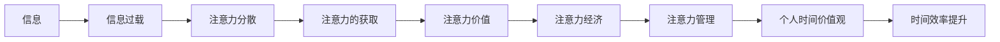

                 

# 注意力经济与个人时间价值观的转变

在信息爆炸的时代，注意力成为一种稀缺资源，其价值不断攀升。从传统媒体到社交平台，再到现代互联网，注意力经济已经深入到人们生活的方方面面。本文将探讨注意力经济与个人时间价值观转变的内在联系，并提出一些基于技术的解决方案，旨在帮助人们更好地管理注意力，提升个人时间利用效率。

## 1. 背景介绍

### 1.1 信息过载与注意力危机
现代社会的数字化转型，极大地丰富了人们获取信息的方式，但也带来了前所未有的信息过载问题。人们面临的是“信息泛滥，注意力稀缺”的悖论。信息的无限增长与人们注意力的有限性之间的矛盾，成为时代的一大挑战。

### 1.2 注意力的价值
注意力是一种有限的资源，其稀缺性使其成为经济活动中的关键要素。在注意力经济时代，企业通过吸引和引导用户的注意力，获取商业价值。与此同时，个人也需要有效管理自己的注意力，以提升生产力和生活质量。

## 2. 核心概念与联系

### 2.1 核心概念概述
- **注意力经济**：指在信息过载时代，企业和个人通过吸引和有效利用注意力，获取商业价值和个人效益的经济活动。
- **个人时间价值观**：指个人对时间的使用和管理的价值观念，包括时间分配、优先级排序、任务处理等方面的态度和行为。
- **信息过载**：指信息量超出个人处理能力的极限，导致注意力分散，影响工作效率和生活质量。
- **注意力管理**：指通过技术手段帮助个人有效分配和管理注意力的过程。

### 2.2 核心概念原理和架构的 Mermaid 流程图(Mermaid 流程节点中不要有括号、逗号等特殊字符)


## 3. 核心算法原理 & 具体操作步骤

### 3.1 算法原理概述
注意力经济与个人时间价值观转变的核心在于，如何通过技术手段优化注意力的获取、分配和管理，从而提升个人时间利用效率。这涉及到以下几个关键点：

1. **注意力吸引**：企业通过各种手段吸引用户注意力，如内容创新、社交互动、个性化推荐等。
2. **注意力引导**：通过技术手段引导用户注意力向高价值内容倾斜，如推荐算法、社交网络算法等。
3. **注意力聚焦**：帮助用户专注于高价值任务，如任务管理工具、时间管理应用等。

### 3.2 算法步骤详解
1. **数据收集**：收集用户在平台上的行为数据，如浏览记录、点击次数、互动时间等。
2. **用户画像建立**：通过机器学习算法分析用户数据，建立用户画像，识别用户的兴趣、行为模式和需求。
3. **内容推荐**：根据用户画像，利用推荐算法推荐高价值内容，如新闻、视频、文章等，吸引用户注意力。
4. **任务管理**：利用任务管理工具，帮助用户设置任务优先级、分配时间，专注于高价值任务。
5. **注意力监控**：通过注意力监控工具，实时分析用户的注意力使用情况，提供反馈和优化建议。

### 3.3 算法优缺点
**优点**：
- 提高信息获取效率，减少信息过载带来的注意力分散。
- 通过个性化推荐和内容优化，提升用户满意度。
- 任务管理和监控工具，帮助用户有效分配时间和注意力，提升工作效率。

**缺点**：
- 对用户数据的过度收集和分析，可能侵犯隐私。
- 推荐算法和内容优化可能带来信息泡泡效应，限制用户视野。
- 任务管理工具可能增加用户心理负担，影响用户体验。

### 3.4 算法应用领域
注意力经济与个人时间价值观转变的实践，广泛应用于以下几个领域：

- **内容平台**：如新闻、视频、社交媒体等，通过推荐算法吸引用户注意力，提升用户粘性。
- **电子商务**：如电商平台，通过个性化推荐和广告投放，提高转化率。
- **教育**：如在线课程平台，通过任务管理和时间规划，帮助学生高效学习。
- **工作管理**：如任务管理工具，帮助职场人士提升工作效率，管理时间。

## 4. 数学模型和公式 & 详细讲解 & 举例说明

### 4.1 数学模型构建
基于注意力经济与个人时间价值观转变的模型，通常包括用户行为模型、推荐模型、任务管理模型等。这里以推荐模型为例，构建推荐系统的基础数学模型。

假设用户集为 $U=\{u_1,u_2,\cdots,u_n\}$，物品集为 $I=\{i_1,i_2,\cdots,i_m\}$，用户对物品的评分矩阵为 $R\in \mathbb{R}^{n \times m}$。推荐系统目标是通过最大化用户满意度，学习评分矩阵 $R$。

推荐模型的目标函数为：
$$
\min_{R} \frac{1}{2} \| R - R_{\text{true}} \|^2_F + \lambda \| R \|_F
$$

其中 $R_{\text{true}}$ 为真实评分矩阵，$\| \cdot \|_F$ 为矩阵的 Frobenius 范数，$\lambda$ 为正则化参数。

### 4.2 公式推导过程
推荐模型的优化过程通常采用矩阵分解的方法，将评分矩阵 $R$ 分解为 $R \approx \hat{R} = P Q^T$，其中 $P \in \mathbb{R}^{n \times k}, Q \in \mathbb{R}^{m \times k}$，$k$ 为分解的维度。

通过最小化损失函数：
$$
\min_{P,Q} \frac{1}{2} \| \hat{R} - R_{\text{true}} \|_F^2 + \lambda \| P \|_F^2 + \lambda \| Q \|_F^2
$$

可以求解出最优的 $P$ 和 $Q$，从而得到推荐的评分矩阵 $\hat{R}$。

### 4.3 案例分析与讲解
假设我们要为用户 $u_1$ 推荐物品 $i_1$。首先，我们通过用户行为数据，对 $u_1$ 进行画像，识别出其兴趣偏好。然后，利用推荐模型，计算 $u_1$ 对 $i_1$ 的推荐评分 $\hat{r}_{1,1}$。如果 $\hat{r}_{1,1}$ 较高，则推荐 $i_1$ 给 $u_1$。

## 5. 项目实践：代码实例和详细解释说明

### 5.1 开发环境搭建
要实现推荐系统，首先需要搭建开发环境。以下是使用 Python 和 TensorFlow 搭建推荐系统的环境配置流程：

1. 安装 Anaconda：从官网下载并安装 Anaconda，用于创建独立的 Python 环境。
2. 创建并激活虚拟环境：
```bash
conda create -n recommendation-env python=3.8 
conda activate recommendation-env
```

3. 安装 TensorFlow：根据 CUDA 版本，从官网获取对应的安装命令。例如：
```bash
conda install tensorflow -c tensorflow -c conda-forge
```

4. 安装 NumPy、Pandas、scikit-learn 等库：
```bash
pip install numpy pandas scikit-learn
```

5. 安装 TensorFlow Addons：提供额外的推荐算法库：
```bash
pip install tensorflow-addons
```

完成上述步骤后，即可在 `recommendation-env` 环境中开始推荐系统开发。

### 5.2 源代码详细实现
以下是推荐系统的 Python 代码实现，具体以协同过滤算法为例：

```python
import numpy as np
import tensorflow as tf
from tensorflow_addons.recommendations import CollaborativeFilteringModel

# 准备数据集
users = np.array(['u1', 'u2', 'u3', 'u4', 'u5'])
items = np.array(['i1', 'i2', 'i3', 'i4', 'i5'])
ratings = np.array([[4.5, 2.5, 3.5, 5.0, 4.0],
                   [2.0, 5.0, 4.0, 2.5, 3.0],
                   [3.5, 3.0, 4.5, 5.0, 3.5],
                   [2.0, 3.5, 4.0, 5.0, 2.5],
                   [3.0, 4.5, 2.5, 3.5, 3.0]])

# 定义协同过滤模型
model = CollaborativeFilteringModel(rank=10, use_bias=False, loss=tf.keras.losses.MeanSquaredError())

# 准备数据集
train_data = tf.data.Dataset.from_tensor_slices((np.array(users), np.array(items), np.array(ratings)))
train_data = train_data.shuffle(buffer_size=1000).batch(batch_size=32)

# 训练模型
model.fit(train_data, epochs=10)

# 预测推荐
user = 'u1'
item = 'i1'
predicted_rating = model.predict([user], [item])[0]
print(f'推荐评分：{predicted_rating}')
```

### 5.3 代码解读与分析
上述代码实现了一个简单的协同过滤推荐系统，主要步骤如下：

1. **数据准备**：定义用户、物品和评分矩阵。
2. **模型定义**：定义协同过滤模型，设置排名数和损失函数。
3. **数据准备**：将数据集转换为 TensorFlow 的 Dataset 格式。
4. **模型训练**：使用训练数据集训练模型。
5. **预测推荐**：输入用户和物品，预测推荐评分。

### 5.4 运行结果展示
训练完成后，预测用户 `u1` 对物品 `i1` 的推荐评分。例如，假设训练模型后的预测评分为 4.8，则推荐给用户 `u1` 物品 `i1`。

## 6. 实际应用场景

### 6.1 个性化推荐系统
在电商平台、视频平台等，通过个性化推荐系统，帮助用户发现感兴趣的商品或内容，提升用户体验和满意度。推荐系统需要实时分析用户行为数据，动态调整推荐策略，满足用户的个性化需求。

### 6.2 社交网络
在社交网络平台上，通过关注推荐算法，引导用户关注高质量内容，提升平台活跃度和用户粘性。社交网络还可以利用用户画像，推荐相关好友或群组，帮助用户发现新的社交关系。

### 6.3 内容分发平台
在新闻、视频、音乐等内容分发平台，通过个性化推荐，提升内容的曝光率和用户满意度。平台可以根据用户兴趣，推荐相关内容，扩大内容的影响力。

### 6.4 未来应用展望
未来，随着深度学习和大数据技术的不断发展，推荐系统将更加智能化、个性化。基于多模态数据的推荐，将更加精准地预测用户偏好，提升推荐效果。同时，推荐系统的透明度和可解释性也将成为重要的研究方向。

## 7. 工具和资源推荐

### 7.1 学习资源推荐
为了帮助开发者系统掌握推荐系统的理论基础和实践技巧，这里推荐一些优质的学习资源：

1. **《推荐系统》（王宏志）**：国内权威的推荐系统教材，详细介绍了推荐系统的基本概念、算法和实现。
2. **Coursera 推荐系统课程**：由斯坦福大学开设的推荐系统课程，涵盖了推荐系统的各个方面，从基础到高级都有讲解。
3. **Kaggle 推荐系统竞赛**：参加 Kaggle 推荐系统竞赛，通过实际项目提升推荐系统开发能力。
4. **推荐系统开源项目**：如 TensorFlow Recommenders、PyTorch Recommenders 等，提供了推荐系统的开源实现和示例代码，方便学习和实践。

### 7.2 开发工具推荐
高效的开发离不开优秀的工具支持。以下是几款用于推荐系统开发的常用工具：

1. **TensorFlow**：基于 Python 的开源深度学习框架，支持大规模分布式训练和部署。
2. **PyTorch**：基于 Python 的开源深度学习框架，支持动态计算图和高效内存管理。
3. **Scikit-learn**：Python 的机器学习库，提供了简单易用的机器学习算法和工具。
4. **Keras**：基于 TensorFlow 和 Theano 的高级神经网络 API，简化了深度学习模型的构建和训练。
5. **TensorFlow Addons**：提供额外的机器学习和推荐算法库，支持分布式训练和模型压缩等。

### 7.3 相关论文推荐
推荐系统的发展源于学界的持续研究。以下是几篇奠基性的相关论文，推荐阅读：

1. **Netflix Prize**：Netflix 公司在 2006 年发起的推荐系统竞赛，推动了推荐系统研究的快速发展。
2. **Matrix Factorization Techniques for Recommender Systems**：提出了矩阵分解算法，成为推荐系统中的经典方法。
3. **Neural Collaborative Filtering**：提出了基于神经网络的协同过滤算法，提升了推荐系统的性能和效果。
4. **Deep Matrix Factorization**：提出了深度学习与矩阵分解的结合，提升了推荐系统的复杂性和效果。
5. **An Introduction to Collaborative Filtering**：详细介绍了协同过滤算法的基本原理和实现。

## 8. 总结：未来发展趋势与挑战

### 8.1 总结
本文对注意力经济与个人时间价值观转变的内在联系进行了深入探讨，并提出了基于技术的解决方案。从数据收集、用户画像、推荐算法到任务管理，一步步揭示了如何通过技术手段优化注意力和时间的利用效率。

通过本文的系统梳理，可以看到，注意力经济和个性化推荐系统在现代信息社会中扮演了越来越重要的角色。这些技术不仅提升了用户体验和满意度，也促进了商业模式的创新和经济价值的提升。

### 8.2 未来发展趋势
展望未来，推荐系统将呈现以下几个发展趋势：

1. **多模态数据融合**：未来的推荐系统将充分利用视觉、语音、文本等多模态数据，提升推荐的精准度和个性化程度。
2. **跨平台推荐**：未来的推荐系统将实现跨平台、跨设备的无缝衔接，提供一致的用户体验。
3. **实时推荐引擎**：未来的推荐系统将具备实时分析用户行为数据的能力，动态调整推荐策略。
4. **推荐算法的透明化**：未来的推荐系统将更加注重可解释性，提升算法的透明度和可信度。
5. **隐私保护**：未来的推荐系统将更加注重隐私保护，保障用户数据的隐私和安全。

### 8.3 面临的挑战
尽管推荐系统已经取得了显著的进展，但在迈向更加智能化、个性化应用的过程中，仍然面临诸多挑战：

1. **数据隐私和安全**：用户数据的隐私和安全问题一直是推荐系统的重要瓶颈，如何在保障用户隐私的同时，提升推荐效果，是一个亟待解决的难题。
2. **算法的可解释性**：推荐算法的复杂性和不透明性，导致难以解释其决策过程和推荐结果，增加了用户的心理负担。
3. **个性化和多样性**：如何在保证个性化推荐的同时，避免信息泡泡效应，提供多样化的内容推荐，是一个值得深入研究的课题。
4. **计算效率**：随着数据规模的不断扩大，推荐系统需要处理的数据量和计算量将大幅增加，如何提升计算效率，优化资源利用，是一个重要的研究方向。

### 8.4 研究展望
面对推荐系统面临的这些挑战，未来的研究需要在以下几个方面寻求新的突破：

1. **隐私保护技术**：开发新的隐私保护算法和技术，保障用户数据的隐私和安全。
2. **推荐算法的可解释性**：引入可解释性技术，提升推荐算法的透明度和可信度。
3. **个性化和多样性的平衡**：通过推荐系统的多臂强盗模型，探索个性化和多样性之间的平衡。
4. **分布式计算**：开发分布式计算框架，提升推荐系统的计算效率和处理能力。
5. **推荐系统理论研究**：加强推荐系统的理论研究，探索更加高效、公平、透明的推荐算法。

## 9. 附录：常见问题与解答

**Q1：推荐系统为什么需要大量的用户数据？**

A: 推荐系统需要大量的用户数据，以建立准确的用户画像和物品画像。用户画像包含了用户的兴趣、行为、偏好等信息，而物品画像则描述了物品的属性、特征和受欢迎程度。通过分析这些数据，推荐系统能够精准地预测用户对物品的兴趣，从而实现个性化推荐。

**Q2：如何应对推荐系统的冷启动问题？**

A: 冷启动问题是推荐系统中的常见问题，指在用户和物品信息不足的情况下，无法提供有效的推荐。解决冷启动问题的方法包括：
- 利用已有用户的相似行为，进行冷启动推荐。
- 通过物品的属性信息，进行基于内容的推荐。
- 利用用户的少量行为数据，进行基于协同过滤的推荐。

**Q3：推荐系统的公平性和偏见问题如何解决？**

A: 推荐系统的公平性和偏见问题是一个重要的研究方向。解决这些问题的方法包括：
- 引入公平性算法，确保推荐系统的公平性。
- 定期审查推荐算法，检测和纠正偏见。
- 增加多样性约束，确保推荐结果的多样性和平衡性。

**Q4：推荐系统如何处理信息过载问题？**

A: 推荐系统可以通过以下方法处理信息过载问题：
- 引入主动学习算法，动态选择高质量物品进行推荐。
- 采用多臂强盗算法，平衡推荐多样性和个性化。
- 引入信息屏蔽机制，让用户能够选择屏蔽不感兴趣的内容。

**Q5：推荐系统如何应对新物品和老物品的不同推荐策略？**

A: 推荐系统应对新物品和老物品的推荐策略，通常分为两种：
- 对于新物品，主要利用物品的属性信息，进行基于内容的推荐。
- 对于老物品，主要利用用户的历史行为数据，进行基于协同过滤的推荐。

通过本文的系统梳理，可以看到，推荐系统在现代信息社会中扮演了越来越重要的角色。这些技术不仅提升了用户体验和满意度，也促进了商业模式的创新和经济价值的提升。未来，随着深度学习和大数据技术的不断发展，推荐系统将更加智能化、个性化，为人类社会带来更多的便利和价值。

