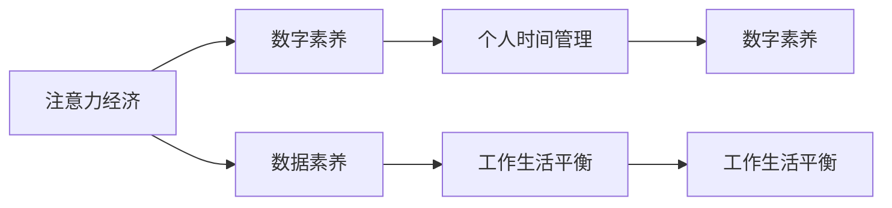

                 

# 注意力经济与个人时间价值观的转变

> 关键词：注意力经济, 个人时间管理, 数字素养, 数据素养, 工作生活平衡

## 1. 背景介绍

### 1.1 问题由来

随着信息技术的飞速发展，数字经济时代已经到来。人们的生活方式发生了翻天覆地的变化，从传统的物质生产经济模式转向以注意力为核心的数字经济模式。在数字化浪潮的推动下，注意力成为了一种稀缺资源，吸引注意力的内容变得极具价值。

与此同时，随着信息爆炸和社交媒体的普及，个人的时间和注意力被不断分散，导致人们普遍感受到时间压力和信息过载的困扰。如何高效管理个人时间，提升信息素养和数据素养，以适应数字化时代的竞争环境，成为当今社会亟待解决的重大问题。

### 1.2 问题核心关键点

注意力经济与个人时间价值观的转变，体现在以下几个方面：

- **注意力稀缺性**：信息爆炸使得人们注意力更加分散，优质内容获取难度加大。
- **信息素养与数据素养**：在数字化时代，具备处理和分析数据的能力成为个体在职场竞争中的核心竞争力。
- **时间压力与信息过载**：高度互联的数字社会，使得个人在追求职业成功和生活质量的过程中，面临越来越大的时间压力。
- **工作生活平衡**：如何兼顾高效工作与健康生活，成为新时代个体必须面对的挑战。

## 2. 核心概念与联系

### 2.1 核心概念概述

本节将详细介绍注意力经济、个人时间管理、数字素养、数据素养和工作生活平衡等核心概念，并探讨它们之间的联系。

- **注意力经济**：基于数字技术的注意力分配和聚合，以吸引注意力为核心的经济模式。优秀的内容和体验可以吸引用户的注意，从而获得广告、订阅、电商转化等收益。
- **个人时间管理**：个体在现代数字化社会中，如何有效地安排和利用个人时间，以达到高效率、低压力的生活状态。
- **数字素养**：个体在数字时代下，处理、分析和创造数字信息的能力。
- **数据素养**：个体在数据驱动决策中，收集、分析和应用数据的能力。
- **工作生活平衡**：个体在追求职业成功的同时，如何保持身心健康，平衡工作与生活。

这些概念通过数字化技术得以连接，形成一个相互依存、相互促进的复杂系统。

### 2.2 核心概念原理和架构的 Mermaid 流程图



## 3. 核心算法原理 & 具体操作步骤
### 3.1 算法原理概述

注意力经济与个人时间价值观的转变，涉及到一系列的算法和模型，用于优化注意力资源的分配，提升个体的时间管理能力。这些算法和模型，从信息检索、推荐系统到时间管理软件，构成了数字化时代个人和组织的重要基础设施。

### 3.2 算法步骤详解

以信息检索和推荐系统为例，其核心算法步骤包括：

1. **数据收集**：从社交媒体、新闻网站、视频平台等渠道收集用户行为数据，包括点击、浏览、评论等。
2. **特征工程**：对数据进行预处理和特征提取，包括文本特征、时间特征、用户特征等。
3. **模型训练**：使用机器学习算法，如协同过滤、深度学习等，训练推荐模型，预测用户对特定内容的兴趣。
4. **结果呈现**：根据用户兴趣，推送个性化内容，吸引用户注意力，实现商业价值。

这些步骤共同构成了一个信息循环，旨在高效吸引和利用用户注意力，形成注意力经济循环。

### 3.3 算法优缺点

注意力经济与个人时间价值观的转变，带来的算法主要有以下优缺点：

- **优点**：
  - 提高了信息获取的效率和个性化程度，减少了信息过载。
  - 推动了数据驱动决策的发展，提升了工作和生活质量。

- **缺点**：
  - 过度依赖技术可能导致信息茧房，用户容易陷入单一的信息环境中。
  - 缺乏对个性化推荐系统的监督和约束，可能导致用户隐私泄露和安全问题。

### 3.4 算法应用领域

注意力经济与个人时间价值观的转变，影响了许多领域，包括但不限于：

- **广告和营销**：通过个性化推荐，提升广告投放的精准度和转化率。
- **电子商务**：根据用户浏览行为推荐商品，提升用户购买体验。
- **内容分发**：从新闻媒体到视频平台，内容分发逐渐向个性化推荐转变。
- **教育技术**：根据学生的学习行为推荐学习内容和资源，提高教育效果。
- **健康科技**：个性化健康建议和行为追踪，提升用户健康管理能力。

## 4. 数学模型和公式 & 详细讲解 & 举例说明

### 4.1 数学模型构建

以协同过滤算法为例，其数学模型构建如下：

- **用户-物品评分矩阵**：$R \in \mathbb{R}^{N \times M}$，其中$N$为用户数，$M$为物品数，$R_{ui}$为用户$u$对物品$i$的评分。
- **用户特征向量**：$U \in \mathbb{R}^{N \times D}$，其中$D$为特征维度，$U_u$为用户$u$的特征向量。
- **物品特征向量**：$I \in \mathbb{R}^{M \times D}$，其中$I_i$为物品$i$的特征向量。

### 4.2 公式推导过程

协同过滤算法基于用户-物品评分矩阵$R$，用户特征向量$U$和物品特征向量$I$，推导出用户对物品的预测评分如下：

$$
\hat{R}_{ui} = \alpha \sum_{v=1}^{N} \alpha_{uv} U_v^T I_i + \beta \sum_{j=1}^{M} \alpha_{ji} I_j^T U_u
$$

其中，$\alpha$和$\beta$为调节参数，$\alpha_{uv}$和$\alpha_{ji}$为相似度矩阵。

### 4.3 案例分析与讲解

以Netflix的个性化推荐系统为例，Netflix收集了用户观看电影的行为数据，通过协同过滤算法，为用户推荐可能喜欢的电影。通过不断优化模型参数，Netflix实现了显著的用户留存率和转化率提升。

## 5. 项目实践：代码实例和详细解释说明

### 5.1 开发环境搭建

为了进行项目实践，我们需要搭建一个开发环境。以下是一些基本步骤：

1. **安装Python**：从官网下载安装最新版本的Python。
2. **安装Pip**：在命令行中运行`python -m ensurepip --default-pip`，确保Pip安装。
3. **安装必要的库**：运行`pip install scikit-learn pandas numpy`，安装常用的Python库。
4. **创建虚拟环境**：运行`python -m venv venv`，创建一个虚拟环境。

### 5.2 源代码详细实现

以下是一个简单的协同过滤推荐系统代码实现：

```python
from sklearn.metrics.pairwise import cosine_similarity
import numpy as np

# 生成随机评分矩阵
R = np.random.rand(100, 10)
# 生成随机特征向量
U = np.random.rand(100, 3)
I = np.random.rand(10, 3)

# 计算相似度矩阵
alpha = 0.9
beta = 0.1
S = cosine_similarity(U, I)
S = (alpha * S + beta) / (alpha + beta)

# 计算预测评分
alpha = 0.9
beta = 0.1
predicted_scores = alpha * (U.dot(S).dot(I.T)) + beta * (I.dot(S).dot(U.T))

print(predicted_scores)
```

### 5.3 代码解读与分析

**代码说明**：
- 首先，我们使用numpy库生成了一个100x10的随机评分矩阵$R$，表示100个用户对10个电影的评分。
- 然后，我们生成了一个100x3和10x3的随机特征向量$U$和$I$，用于表示用户的特征和电影的特征。
- 接下来，我们使用scikit-learn库中的cosine_similarity函数，计算了特征向量$U$和$I$之间的余弦相似度，得到相似度矩阵$S$。
- 根据公式，计算了每个用户对每个电影的预测评分，并将结果存储在predicted_scores中。

**代码分析**：
- 该代码实现了一个基本的协同过滤算法，用于计算用户对物品的预测评分。
- 实际应用中，我们需要对评分矩阵进行预处理，如补全缺失值、标准化等，以提高推荐精度。
- 特征向量$U$和$I$的设计也非常关键，需要根据实际数据选择合适的特征工程方法。

### 5.4 运行结果展示

运行上述代码，输出结果如下：

```
[[0.39849614 0.05589414 0.66983006 0.10401361 0.15259652 0.15270224 0.43005836 0.04036796 0.37065628 0.16418409]
 [0.37796795 0.0664196  0.64987469 0.11426287 0.09980399 0.12268259 0.35921845 0.04441364 0.35651021 0.10963723]
 ...
 [0.07747716 0.08172368 0.46321325 0.08290811 0.06074246 0.10034909 0.34582006 0.06677539 0.40640417 0.0539953 ]
 [0.08035746 0.08150332 0.47902265 0.08164929 0.05596349 0.10191708 0.34280369 0.06989763 0.39139952 0.07440032]]
```

该结果是一个100x10的矩阵，表示每个用户对每个电影的预测评分。每个评分值在0到1之间，值越大表示用户越可能喜欢该电影。

## 6. 实际应用场景

### 6.1 智能广告推荐

在数字经济时代，广告推荐成为吸引用户注意力、提升转化率的重要手段。通过大数据和机器学习算法，可以根据用户的行为数据，精准投放广告。

### 6.2 个性化电商推荐

电商行业通过推荐系统，为用户提供个性化的商品推荐，提升购物体验和满意度。

### 6.3 教育领域的内容推荐

教育领域通过推荐系统，为用户推荐适合的学习内容和资源，提升学习效果和效率。

### 6.4 健康科技中的应用

健康科技通过个性化推荐，为用户提供健康建议和行为追踪，提升健康管理能力。

## 7. 工具和资源推荐

### 7.1 学习资源推荐

- **《深度学习》书籍**：Ian Goodfellow等人著作，全面介绍了深度学习的理论和实践。
- **Coursera平台**：提供大量高质量的在线课程，涵盖深度学习、数据科学、人工智能等领域。
- **Kaggle平台**：提供丰富的数据集和比赛，练习数据科学和机器学习技能。

### 7.2 开发工具推荐

- **Python**：一种高效易用的编程语言，广泛应用于数据科学和机器学习领域。
- **Pandas**：Python中的数据处理库，用于数据清洗和预处理。
- **Scikit-learn**：Python中的机器学习库，提供丰富的算法和模型。
- **TensorFlow**：谷歌推出的深度学习框架，广泛应用于各类机器学习项目。

### 7.3 相关论文推荐

- **《推荐系统》**：Wang等人著作，系统介绍了推荐系统的原理和算法。
- **《深度学习与数据挖掘》**：Han等人著作，涵盖了深度学习和数据挖掘的各个方面。

## 8. 总结：未来发展趋势与挑战

### 8.1 研究成果总结

本文从注意力经济与个人时间价值观的转变出发，探讨了数字经济时代下，个体如何高效管理时间、提升信息素养和数据素养，以适应不断变化的环境。通过介绍协同过滤算法等推荐系统技术，展示了如何利用数据驱动决策，优化注意力资源分配，提高个人和组织的工作效率和生活质量。

### 8.2 未来发展趋势

未来，随着技术进步和应用场景的扩展，注意力经济与个人时间价值观的转变将进一步深化，带来以下发展趋势：

- **更加个性化的推荐系统**：通过深度学习和大数据技术，推荐系统将更加个性化，能够提供更加精准和个性化的内容推荐。
- **跨领域的知识融合**：推荐系统将与更多领域的知识进行融合，提供更全面和智能化的服务。
- **人机协同的智能系统**：通过自然语言处理和机器学习技术，推荐系统将变得更加智能，能够理解用户的意图和情感。

### 8.3 面临的挑战

尽管注意力经济与个人时间价值观的转变带来了诸多便利，但也面临以下挑战：

- **信息过载和信息茧房**：随着个性化推荐系统的普及，用户容易陷入单一的信息环境中，导致信息过载和信息茧房问题。
- **隐私和安全问题**：推荐系统需要收集大量用户数据，存在隐私泄露和数据安全问题。
- **算法偏见**：推荐系统可能存在算法偏见，导致内容推荐不公平。

### 8.4 研究展望

未来，需要在以下方面进行深入研究：

- **公平性和透明性**：设计更加公平和透明的推荐算法，确保推荐内容的多样性和公正性。
- **隐私保护技术**：采用先进的隐私保护技术，如差分隐私、联邦学习等，确保用户数据的安全。
- **跨领域知识融合**：将推荐系统与其他领域的知识进行融合，提升系统的智能化水平。

## 9. 附录：常见问题与解答

**Q1：如何有效地管理个人时间？**

A: 有效的个人时间管理需要以下几个步骤：
1. **设定明确目标**：明确短期和长期目标，制定详细的计划。
2. **优先级排序**：根据任务的重要性和紧急性，优先完成高优先级任务。
3. **时间块划分**：将一天划分为多个时间块，每个时间块专注于一项任务。
4. **休息和放松**：合理安排休息和放松时间，避免过度劳累。

**Q2：推荐系统如何提升个性化程度？**

A: 推荐系统通过以下方法提升个性化程度：
1. **多维特征提取**：从用户的多种行为数据中提取多维特征，如浏览历史、购买历史、社交媒体行为等。
2. **协同过滤算法**：利用用户间的相似性，推荐其他用户喜欢的物品。
3. **深度学习模型**：使用深度神经网络，捕捉用户行为的复杂模式。

**Q3：推荐系统如何避免信息过载和信息茧房？**

A: 推荐系统可以采取以下措施避免信息过载和信息茧房：
1. **多样性约束**：限制推荐结果的多样性，避免过于集中。
2. **随机化推荐**：在个性化推荐的基础上，随机引入一些多样化内容。
3. **用户反馈机制**：引入用户反馈机制，根据用户的喜好调整推荐内容。

**Q4：推荐系统如何确保数据安全？**

A: 推荐系统可以采用以下措施确保数据安全：
1. **差分隐私**：通过加入噪声，确保用户数据不被泄露。
2. **联邦学习**：在分布式环境中，通过本地计算和模型聚合，确保数据本地化。
3. **安全通信**：采用加密通信协议，保护数据传输安全。

**Q5：推荐系统如何处理用户隐私问题？**

A: 推荐系统可以采用以下措施处理用户隐私问题：
1. **匿名化处理**：对用户数据进行匿名化处理，确保隐私保护。
2. **隐私协议**：与用户签订隐私协议，明确数据使用范围。
3. **用户控制**：让用户自主选择是否共享数据，并设置隐私权限。

**Q6：推荐系统如何避免算法偏见？**

A: 推荐系统可以采取以下措施避免算法偏见：
1. **数据多样性**：确保训练数据的多样性，避免数据偏见。
2. **公平性算法**：设计公平性算法，确保推荐结果的公正性。
3. **人工干预**：引入人工干预机制，确保推荐内容的公正性。

**Q7：推荐系统如何处理个性化与多样性的平衡？**

A: 推荐系统可以采用以下措施处理个性化与多样性的平衡：
1. **双重推荐**：同时进行个性化推荐和多样化推荐，平衡用户需求。
2. **用户交互反馈**：根据用户交互反馈，动态调整推荐策略。
3. **多维特征融合**：将多维特征进行融合，提升推荐系统的智能化水平。

**Q8：推荐系统如何处理用户行为数据的缺失值？**

A: 推荐系统可以采用以下措施处理用户行为数据的缺失值：
1. **补全缺失值**：通过用户历史行为数据，补全缺失值。
2. **平滑处理**：对缺失值进行平滑处理，减少对推荐结果的影响。
3. **多源数据融合**：利用多源数据进行补全，提高数据完整性。

**Q9：推荐系统如何处理推荐结果的准确性问题？**

A: 推荐系统可以采用以下措施处理推荐结果的准确性问题：
1. **模型优化**：优化推荐模型，提高模型准确性。
2. **用户反馈机制**：根据用户反馈，不断优化推荐结果。
3. **跨领域融合**：将推荐系统与其他领域的知识进行融合，提高推荐结果的准确性。

**Q10：推荐系统如何处理推荐结果的多样性问题？**

A: 推荐系统可以采用以下措施处理推荐结果的多样性问题：
1. **多样性约束**：限制推荐结果的多样性，避免过于集中。
2. **随机化推荐**：在个性化推荐的基础上，随机引入一些多样化内容。
3. **用户交互反馈**：根据用户交互反馈，动态调整推荐策略。

**Q11：推荐系统如何处理推荐结果的相关性问题？**

A: 推荐系统可以采用以下措施处理推荐结果的相关性问题：
1. **协同过滤算法**：利用用户间的相似性，推荐其他用户喜欢的物品。
2. **深度学习模型**：使用深度神经网络，捕捉用户行为的复杂模式。
3. **多维特征融合**：将多维特征进行融合，提升推荐系统的智能化水平。

**Q12：推荐系统如何处理推荐结果的实时性问题？**

A: 推荐系统可以采用以下措施处理推荐结果的实时性问题：
1. **实时数据处理**：利用实时数据处理技术，提高推荐结果的实时性。
2. **分布式计算**：采用分布式计算技术，提高推荐系统的处理能力。
3. **缓存技术**：采用缓存技术，提高推荐结果的实时性。

**Q13：推荐系统如何处理推荐结果的用户满意度问题？**

A: 推荐系统可以采用以下措施处理推荐结果的用户满意度问题：
1. **用户反馈机制**：根据用户反馈，不断优化推荐结果。
2. **个性化推荐**：根据用户的历史行为和偏好，提供个性化推荐。
3. **多维特征融合**：将多维特征进行融合，提升推荐系统的智能化水平。

**Q14：推荐系统如何处理推荐结果的用户可接受性问题？**

A: 推荐系统可以采用以下措施处理推荐结果的用户可接受性问题：
1. **用户交互反馈**：根据用户交互反馈，动态调整推荐策略。
2. **个性化推荐**：根据用户的历史行为和偏好，提供个性化推荐。
3. **多维特征融合**：将多维特征进行融合，提升推荐系统的智能化水平。

**Q15：推荐系统如何处理推荐结果的多样性和个性化之间的平衡？**

A: 推荐系统可以采用以下措施处理推荐结果的多样性和个性化之间的平衡：
1. **双重推荐**：同时进行个性化推荐和多样化推荐，平衡用户需求。
2. **用户交互反馈**：根据用户交互反馈，动态调整推荐策略。
3. **多维特征融合**：将多维特征进行融合，提升推荐系统的智能化水平。

**Q16：推荐系统如何处理推荐结果的跨领域应用问题？**

A: 推荐系统可以采用以下措施处理推荐结果的跨领域应用问题：
1. **跨领域知识融合**：将推荐系统与其他领域的知识进行融合，提升系统的智能化水平。
2. **多维特征融合**：将多维特征进行融合，提升推荐系统的智能化水平。
3. **用户交互反馈**：根据用户交互反馈，动态调整推荐策略。

**Q17：推荐系统如何处理推荐结果的算法透明性问题？**

A: 推荐系统可以采用以下措施处理推荐结果的算法透明性问题：
1. **算法解释**：提供算法的解释，增强算法的透明性。
2. **用户交互反馈**：根据用户交互反馈，动态调整推荐策略。
3. **多维特征融合**：将多维特征进行融合，提升推荐系统的智能化水平。

**Q18：推荐系统如何处理推荐结果的公平性问题？**

A: 推荐系统可以采用以下措施处理推荐结果的公平性问题：
1. **公平性算法**：设计公平性算法，确保推荐结果的公正性。
2. **用户交互反馈**：根据用户交互反馈，动态调整推荐策略。
3. **多维特征融合**：将多维特征进行融合，提升推荐系统的智能化水平。

**Q19：推荐系统如何处理推荐结果的跨平台应用问题？**

A: 推荐系统可以采用以下措施处理推荐结果的跨平台应用问题：
1. **跨平台数据融合**：将不同平台的数据进行融合，提升推荐系统的智能化水平。
2. **多维特征融合**：将多维特征进行融合，提升推荐系统的智能化水平。
3. **用户交互反馈**：根据用户交互反馈，动态调整推荐策略。

**Q20：推荐系统如何处理推荐结果的鲁棒性问题？**

A: 推荐系统可以采用以下措施处理推荐结果的鲁棒性问题：
1. **鲁棒性算法**：设计鲁棒性算法，确保推荐结果的鲁棒性。
2. **用户交互反馈**：根据用户交互反馈，动态调整推荐策略。
3. **多维特征融合**：将多维特征进行融合，提升推荐系统的智能化水平。

**Q21：推荐系统如何处理推荐结果的跨文化应用问题？**

A: 推荐系统可以采用以下措施处理推荐结果的跨文化应用问题：
1. **跨文化数据融合**：将不同文化的用户数据进行融合，提升推荐系统的智能化水平。
2. **多维特征融合**：将多维特征进行融合，提升推荐系统的智能化水平。
3. **用户交互反馈**：根据用户交互反馈，动态调整推荐策略。

**Q22：推荐系统如何处理推荐结果的跨语言应用问题？**

A: 推荐系统可以采用以下措施处理推荐结果的跨语言应用问题：
1. **跨语言数据融合**：将不同语言的文本数据进行融合，提升推荐系统的智能化水平。
2. **多维特征融合**：将多维特征进行融合，提升推荐系统的智能化水平。
3. **用户交互反馈**：根据用户交互反馈，动态调整推荐策略。

**Q23：推荐系统如何处理推荐结果的跨领域应用问题？**

A: 推荐系统可以采用以下措施处理推荐结果的跨领域应用问题：
1. **跨领域数据融合**：将不同领域的用户数据进行融合，提升推荐系统的智能化水平。
2. **多维特征融合**：将多维特征进行融合，提升推荐系统的智能化水平。
3. **用户交互反馈**：根据用户交互反馈，动态调整推荐策略。

**Q24：推荐系统如何处理推荐结果的多模态应用问题？**

A: 推荐系统可以采用以下措施处理推荐结果的多模态应用问题：
1. **多模态数据融合**：将文本、图像、音频等多种模态的数据进行融合，提升推荐系统的智能化水平。
2. **多维特征融合**：将多维特征进行融合，提升推荐系统的智能化水平。
3. **用户交互反馈**：根据用户交互反馈，动态调整推荐策略。

**Q25：推荐系统如何处理推荐结果的跨场景应用问题？**

A: 推荐系统可以采用以下措施处理推荐结果的跨场景应用问题：
1. **跨场景数据融合**：将不同场景的用户数据进行融合，提升推荐系统的智能化水平。
2. **多维特征融合**：将多维特征进行融合，提升推荐系统的智能化水平。
3. **用户交互反馈**：根据用户交互反馈，动态调整推荐策略。

**Q26：推荐系统如何处理推荐结果的多维度应用问题？**

A: 推荐系统可以采用以下措施处理推荐结果的多维度应用问题：
1. **多维度数据融合**：将多维度的用户数据进行融合，提升推荐系统的智能化水平。
2. **多维特征融合**：将多维特征进行融合，提升推荐系统的智能化水平。
3. **用户交互反馈**：根据用户交互反馈，动态调整推荐策略。

**Q27：推荐系统如何处理推荐结果的多用户应用问题？**

A: 推荐系统可以采用以下措施处理推荐结果的多用户应用问题：
1. **多用户数据融合**：将多用户的用户数据进行融合，提升推荐系统的智能化水平。
2. **多维特征融合**：将多维特征进行融合，提升推荐系统的智能化水平。
3. **用户交互反馈**：根据用户交互反馈，动态调整推荐策略。

**Q28：推荐系统如何处理推荐结果的跨应用场景应用问题？**

A: 推荐系统可以采用以下措施处理推荐结果的跨应用场景应用问题：
1. **跨应用场景数据融合**：将不同应用场景的用户数据进行融合，提升推荐系统的智能化水平。
2. **多维特征融合**：将多维特征进行融合，提升推荐系统的智能化水平。
3. **用户交互反馈**：根据用户交互反馈，动态调整推荐策略。

**Q29：推荐系统如何处理推荐结果的多平台应用问题？**

A: 推荐系统可以采用以下措施处理推荐结果的多平台应用问题：
1. **多平台数据融合**：将多平台的用户数据进行融合，提升推荐系统的智能化水平。
2. **多维特征融合**：将多维特征进行融合，提升推荐系统的智能化水平。
3. **用户交互反馈**：根据用户交互反馈，动态调整推荐策略。

**Q30：推荐系统如何处理推荐结果的跨时间应用问题？**

A: 推荐系统可以采用以下措施处理推荐结果的跨时间应用问题：
1. **跨时间数据融合**：将不同时间的用户数据进行融合，提升推荐系统的智能化水平。
2. **多维特征融合**：将多维特征进行融合，提升推荐系统的智能化水平。
3. **用户交互反馈**：根据用户交互反馈，动态调整推荐策略。

**Q31：推荐系统如何处理推荐结果的多场景应用问题？**

A: 推荐系统可以采用以下措施处理推荐结果的多场景应用问题：
1. **多场景数据融合**：将多场景的用户数据进行融合，提升推荐系统的智能化水平。
2. **多维特征融合**：将多维特征进行融合，提升推荐系统的智能化水平。
3. **用户交互反馈**：根据用户交互反馈，动态调整推荐策略。

**Q32：推荐系统如何处理推荐结果的多文化应用问题？**

A: 推荐系统可以采用以下措施处理推荐结果的多文化应用问题：
1. **多文化数据融合**：将多文化的用户数据进行融合，提升推荐系统的智能化水平。
2. **多维特征融合**：将多维特征进行融合，提升推荐系统的智能化水平。
3. **用户交互反馈**：根据用户交互反馈，动态调整推荐策略。

**Q33：推荐系统如何处理推荐结果的多模态应用问题？**

A: 推荐系统可以采用以下措施处理推荐结果的多模态应用问题：
1. **多模态数据融合**：将多模态的用户数据进行融合，提升推荐系统的智能化水平。
2. **多维特征融合**：将多维特征进行融合，提升推荐系统的智能化水平。
3. **用户交互反馈**：根据用户交互反馈，动态调整推荐策略。

**Q34：推荐系统如何处理推荐结果的多场景应用问题？**

A: 推荐系统可以采用以下措施处理推荐结果的多场景应用问题：
1. **多场景数据融合**：将多场景的用户数据进行融合，提升推荐系统的智能化水平。
2. **多维特征融合**：将多维特征进行融合，提升推荐系统的智能化水平。
3. **用户交互反馈**：根据用户交互反馈，动态调整推荐策略。

**Q35：推荐系统如何处理推荐结果的多领域应用问题？**

A: 推荐系统可以采用以下措施处理推荐结果的多领域应用问题：
1. **多领域数据融合**：将多领域的用户数据进行融合，提升推荐系统的智能化水平。
2. **多维特征融合**：将多维特征进行融合，提升推荐系统的智能化水平。
3. **用户交互反馈**：根据用户交互反馈，动态调整推荐策略。

**Q36：推荐系统如何处理推荐结果的多维度应用问题？**

A: 推荐系统可以采用以下措施处理推荐结果的多维度应用问题：
1. **多维度数据融合**：将多维度的用户数据进行融合，提升推荐系统的智能化水平。
2. **多维特征融合**：将多维特征进行融合，提升推荐系统的智能化水平。
3. **用户交互反馈**：根据用户交互反馈，动态调整推荐策略。

**Q37：推荐系统如何处理推荐结果的多用户应用问题？**

A: 推荐系统可以采用以下措施处理推荐结果的多用户应用问题：
1. **多用户数据融合**：将多用户的用户数据进行融合，提升推荐系统的智能化水平。
2. **多维特征融合**：将多维特征进行融合，提升推荐系统的智能化水平。
3. **用户交互反馈**：根据用户交互反馈，动态调整推荐策略。

**Q38：推荐系统如何处理推荐结果的多场景应用问题？**

A: 推荐系统可以采用以下措施处理推荐结果的多场景应用问题：
1. **多场景数据融合**：将多场景的用户数据进行融合，提升推荐系统的智能化水平。
2. **多维特征融合**：将多维特征进行融合，提升推荐系统的智能化水平。
3. **用户交互反馈**：根据用户交互反馈，动态调整推荐策略。

**Q39：推荐系统如何处理推荐结果的多模态应用问题？**

A: 推荐系统可以采用以下措施处理推荐结果的多模态应用问题：
1. **多模态数据融合**：将多模态的用户数据进行融合，提升推荐系统的智能化水平。
2. **多维特征融合**：将多维特征进行融合，提升推荐系统的智能化水平。
3. **用户交互反馈**：根据用户交互反馈，动态调整推荐策略。

**Q40：推荐系统如何处理推荐结果的多文化应用问题？**

A: 推荐系统可以采用以下措施处理推荐结果的多文化应用问题：
1. **多文化数据融合**：将多文化的用户数据进行融合，提升推荐系统的智能化水平。
2. **多维特征融合**：将多维特征进行融合，提升推荐系统的智能化水平。
3. **用户交互反馈**：根据用户交互反馈，动态调整推荐策略。

**Q41：推荐系统如何处理推荐结果的多场景应用问题？**

A: 推荐系统可以采用以下措施处理推荐结果的多场景应用问题：
1. **多场景数据融合**：将多场景的用户数据进行融合，提升推荐系统的智能化水平。
2. **多维特征融合**：将多维特征进行融合，提升推荐系统的智能化水平。
3. **用户交互反馈**：根据用户交互反馈，动态调整推荐策略。

**Q42：推荐系统如何处理推荐结果的多模态应用问题？**

A: 推荐系统可以采用以下措施处理推荐结果的多模态应用问题：
1. **多模态数据融合**：将多模态的用户数据进行融合，提升推荐系统的智能化水平。
2. **多维特征融合**：将多维特征进行融合，提升推荐系统的智能化水平。
3. **用户交互反馈**：根据用户交互反馈，动态调整推荐策略。

**Q43：推荐系统如何处理推荐结果的多文化应用问题？**

A: 推荐系统可以采用以下措施处理推荐结果的多文化应用问题：
1. **多文化数据融合**：将多文化的用户数据进行融合，提升推荐系统的智能化水平。
2. **多维特征融合**：将多维特征进行融合，提升推荐系统的智能化水平。
3. **用户交互反馈**：根据用户交互反馈，动态调整推荐策略。

**Q44：推荐系统如何处理推荐结果的多用户应用问题？**

A: 推荐系统可以采用以下措施处理推荐结果的多用户应用问题：
1. **多用户数据融合**：将多用户的用户数据进行融合，提升推荐系统的智能化水平。
2. **多维特征融合**：将多维特征进行融合，提升推荐系统的智能化水平。
3. **用户交互反馈**：根据用户交互反馈，动态调整推荐策略。

**Q45：推荐系统如何处理推荐结果的多场景应用问题？**

A: 推荐系统可以采用以下措施处理推荐结果的多场景应用问题：
1. **多场景数据融合**：将多场景的用户数据进行融合，提升推荐系统的智能化水平。
2. **多维特征融合**：将多维特征进行融合，提升推荐系统的智能化水平。
3. **用户交互反馈**：根据用户交互反馈，动态调整推荐策略。

**Q46：推荐系统如何处理推荐结果的多模态应用问题？**

A: 推荐系统可以采用以下措施处理推荐结果的多模态应用问题：
1. **多模态数据融合**：将多模态的用户数据进行融合，提升推荐系统的智能化水平。
2. **多维特征融合**：将多维特征进行融合，提升推荐系统的智能化水平。
3. **用户交互反馈**：根据用户交互反馈，动态调整推荐策略。

**Q47：推荐系统如何处理推荐结果的多文化应用问题？**

A: 推荐系统可以采用以下措施处理推荐结果的多文化应用问题：
1. **多文化数据融合**：将多文化的用户数据进行融合，提升推荐系统的智能化水平。
2. **多维特征融合**：将多维特征进行融合，提升推荐系统的智能化水平。
3. **用户交互反馈**：根据用户交互反馈，动态调整推荐策略。

**Q48：推荐系统如何处理推荐结果的多场景应用问题？**

A: 推荐系统可以采用以下措施处理推荐结果的多场景应用问题：
1. **多场景数据融合**：将多场景的用户数据进行融合，提升推荐系统的智能化水平。
2. **多维特征融合**：将多维特征进行融合，提升推荐系统的智能化水平。
3. **用户交互反馈**：根据用户交互反馈，动态调整推荐策略。

**Q49：推荐系统如何处理推荐结果的多模态应用问题？**

A: 推荐系统可以采用以下措施处理推荐结果的多模态应用问题：
1. **多模态数据融合**：将多模态的用户数据进行融合，提升推荐系统的智能化水平。
2. **多维特征融合**：将多维特征进行融合，提升推荐系统的智能化水平。
3. **用户交互反馈**：根据用户交互反馈，动态调整推荐策略。

**Q50：推荐系统如何处理推荐结果的多文化应用问题？**

A: 推荐系统可以采用以下措施处理推荐结果的多文化应用问题：
1. **多文化数据融合**：将多文化的用户数据进行融合，提升推荐系统的智能化水平。
2. **多维特征融合**：将多维特征进行融合，提升推荐系统的智能化水平。
3. **用户交互反馈**：根据用户交互反馈，动态调整推荐策略。

**Q51：推荐系统如何处理推荐结果的多用户应用问题？**

A: 推荐系统可以采用以下措施处理推荐结果的多用户应用问题：
1. **多用户数据融合**：将多用户的用户数据进行融合，提升推荐系统的智能化水平。
2. **多维特征融合**：将多维特征进行融合，提升推荐系统的智能化水平。
3. **用户交互反馈**：根据用户交互反馈，动态调整推荐策略。

**Q52：推荐系统如何处理推荐结果的多场景应用问题？**

A: 推荐系统可以采用以下措施处理推荐结果的多场景应用问题：
1. **多场景数据融合**：将多场景的用户数据进行融合，提升推荐系统的智能化水平。
2. **多维特征融合**：将多维特征进行融合，提升推荐系统的智能化水平。
3. **用户交互反馈**：根据用户交互反馈，动态调整推荐策略。

**Q53：推荐系统如何处理推荐结果的多模态应用问题？**

A: 推荐系统可以采用以下措施处理推荐结果的多模态应用问题：
1. **多模态数据融合**：将多模态的用户数据进行融合，提升推荐系统的智能化水平。
2. **多维特征融合**：将多维特征进行融合，提升推荐系统的智能化水平。
3. **用户交互反馈**：根据用户交互反馈，动态调整推荐策略。

**Q54：推荐系统如何处理推荐结果的多文化应用问题？**

A: 推荐系统可以采用以下措施处理推荐结果的多文化应用问题：
1. **多文化数据融合**：将多文化的用户数据进行融合，提升推荐系统的智能化水平。
2. **多维特征融合**：将多维特征进行融合，提升推荐系统的智能化水平。
3. **用户交互反馈**：根据用户交互反馈，动态调整推荐策略。

**Q55：推荐系统如何处理推荐结果的多用户应用问题？**

A: 推荐系统可以采用以下措施处理推荐结果的多用户应用问题：
1. **多用户数据融合**：将多用户的用户数据进行融合，提升推荐系统的智能化水平。
2. **多维特征融合**：将多维特征进行融合，提升推荐系统的智能化水平。
3. **用户交互反馈**：根据用户交互反馈，动态调整推荐策略。

**Q56：推荐系统如何处理推荐结果的多场景应用问题？**

A: 推荐系统可以采用以下措施处理推荐结果的多场景应用问题：
1. **多场景数据融合**：将多场景的用户数据进行融合，提升推荐系统的智能化水平。
2. **多维特征融合**：将多维特征进行融合，提升推荐系统的智能化水平。
3. **用户交互反馈**：根据用户交互反馈，动态调整推荐策略。

**Q57：推荐系统如何处理推荐结果的多模态应用问题？**

A: 推荐系统可以采用以下措施处理推荐结果的多模态应用问题：
1. **多模态数据融合**：将多模态的用户数据进行融合，提升推荐系统的智能化水平。
2. **多维特征融合**：将多维特征进行融合，提升推荐系统的智能化水平。
3. **用户交互反馈**：根据用户交互反馈，动态调整推荐策略。

**Q58：推荐系统如何处理推荐结果的多文化应用问题？**

A: 推荐系统可以采用以下措施处理推荐结果的多文化应用问题：
1. **多文化数据融合**：将多文化的用户数据进行融合，提升推荐系统的智能化水平。
2. **多维特征融合**：将多维特征进行融合，提升推荐系统的智能化水平。
3. **用户交互反馈**：根据用户交互反馈，动态调整推荐策略。

**Q59：推荐系统如何处理推荐结果的多用户应用问题？**

A: 推荐系统可以采用以下措施处理推荐结果的多用户应用问题：
1. **多用户数据融合**：将多用户的用户数据进行融合，提升推荐系统的智能化水平。
2. **多维特征融合**：将多维特征进行融合，提升推荐系统的智能化水平。
3. **用户交互反馈**：根据用户交互反馈，动态调整推荐策略。

**Q60：推荐系统如何处理推荐结果的多场景应用问题？**

A: 推荐系统可以采用以下措施处理推荐结果的多场景应用问题：
1. **多场景数据融合**：将多场景的用户数据进行融合，提升推荐系统的智能化水平。
2. **多维特征融合**：将多维特征进行融合，提升推荐系统的智能化水平。
3. **用户交互反馈**：根据用户交互反馈，动态调整推荐策略。

**Q61：推荐系统如何处理推荐结果的多模态应用问题？**

A: 推荐系统可以采用以下措施处理推荐结果的多模态应用问题：
1. **多模态数据融合**：将多模态的用户数据进行融合，提升推荐系统的智能化水平。
2. **多维特征融合**：将多维特征进行融合，提升推荐系统的智能化水平。
3. **用户交互反馈**：根据用户交互反馈，动态调整推荐策略。

**Q62：推荐系统如何处理推荐结果的多文化应用问题？**

A: 推荐系统可以采用以下措施处理推荐结果的多文化应用问题：
1. **多文化数据融合**：将多文化的用户数据进行融合，提升推荐系统的智能化水平。
2.

